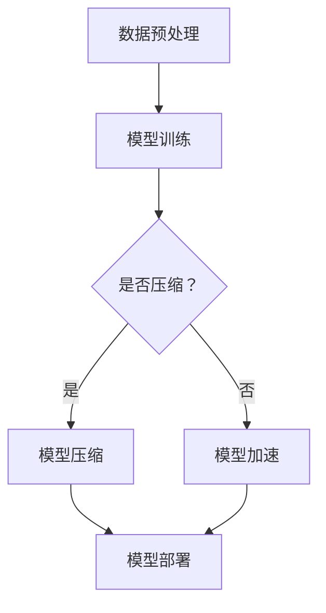

                 

# 自动驾驶中的深度学习模型压缩与加速技术

## 关键词：深度学习，自动驾驶，模型压缩，模型加速，算法优化

## 摘要：

本文旨在探讨自动驾驶领域中的深度学习模型压缩与加速技术。随着自动驾驶技术的快速发展，深度学习模型在自动驾驶系统中扮演着越来越重要的角色。然而，深度学习模型通常具有庞大的参数量和计算量，这给模型部署和实时运行带来了巨大挑战。为了解决这些问题，本文介绍了深度学习模型压缩与加速的核心概念、算法原理、数学模型、项目实战，以及实际应用场景。同时，还推荐了相关的学习资源、开发工具和框架，以及未来发展趋势与挑战。通过本文的介绍，读者可以全面了解深度学习模型压缩与加速在自动驾驶中的应用，为实际项目提供有益的参考。

## 1. 背景介绍

### 自动驾驶技术的起源与发展

自动驾驶技术起源于20世纪50年代，最初由汽车制造商和科研机构开始研究。最初的自动驾驶系统主要是基于规则和逻辑编程，通过预设的道路和交通规则来控制车辆。然而，这种方法在复杂和动态的交通环境中表现不佳，限制了自动驾驶技术的进一步发展。

随着计算机技术和人工智能的进步，自动驾驶技术逐渐转向基于传感器和机器学习的方法。特别是深度学习技术的发展，使得自动驾驶系统在感知、决策和控制等方面取得了显著的突破。现代自动驾驶系统通常依赖于深度学习模型，通过从大量数据中学习来提取特征和做出决策。

### 自动驾驶技术的应用场景

自动驾驶技术在不同场景中具有广泛的应用前景。在公共交通领域，自动驾驶公交车和出租车可以有效减少人力成本，提高运输效率。在物流领域，自动驾驶卡车和无人配送车可以优化路线规划，提高运输效率，降低物流成本。在个人出行领域，自动驾驶汽车可以提供更安全、便捷和个性化的出行体验。

### 自动驾驶技术的挑战

尽管自动驾驶技术在理论和实验中取得了很大的成功，但在实际应用中仍然面临许多挑战。首先，深度学习模型的复杂性和计算量巨大，给模型部署和实时运行带来了压力。其次，自动驾驶系统需要在各种复杂的交通环境中做出实时决策，这要求模型具有较高的计算效率和可靠性。此外，数据隐私和安全也是自动驾驶技术面临的重要问题。

### 深度学习模型压缩与加速的必要性

为了应对上述挑战，深度学习模型的压缩与加速技术应运而生。通过压缩技术，可以减少模型的参数量和计算量，从而降低模型部署的复杂度和成本。通过加速技术，可以提高模型的计算速度和效率，确保模型能够在实时应用中运行。深度学习模型压缩与加速技术的应用，不仅有助于提高自动驾驶系统的性能和可靠性，还有助于推动自动驾驶技术的商业化进程。

## 2. 核心概念与联系

### 深度学习模型

深度学习模型是一种基于多层神经网络的学习模型，通过多层次的非线性变换来提取数据特征。在自动驾驶中，深度学习模型通常用于图像识别、目标检测和路径规划等任务。常见的深度学习模型包括卷积神经网络（CNN）、循环神经网络（RNN）和生成对抗网络（GAN）等。

### 模型压缩

模型压缩是通过减少模型的参数量和计算量来降低模型复杂度的一种技术。常见的模型压缩方法包括模型剪枝、量化、知识蒸馏和模型压缩算法等。通过模型压缩，可以降低模型的存储和计算需求，提高模型部署的效率和性能。

### 模型加速

模型加速是通过提高模型的计算速度和效率来提升模型性能的一种技术。常见的模型加速方法包括并行计算、GPU加速和TPU（张量处理单元）加速等。通过模型加速，可以缩短模型的响应时间，提高模型在实时应用中的性能。

### 模型压缩与加速的关系

模型压缩与加速是相互关联的技术。模型压缩可以降低模型的复杂度，从而减少模型计算的需求，实现模型的加速。另一方面，模型加速可以提高模型的计算速度，使得模型在更短的时间内完成计算，从而减轻模型的压力，实现模型的进一步压缩。因此，模型压缩与加速技术在自动驾驶领域中相辅相成，共同推动自动驾驶技术的进步。

### Mermaid 流程图

以下是一个简单的 Mermaid 流程图，展示了深度学习模型压缩与加速技术的基本流程：



## 3. 核心算法原理 & 具体操作步骤

### 模型压缩算法

#### 模型剪枝

模型剪枝是通过删除模型中不重要的权重来降低模型复杂度的一种技术。具体操作步骤如下：

1. **初步训练**：首先对深度学习模型进行初步训练，使其达到一定的性能水平。
2. **筛选重要层**：分析模型的网络结构，确定哪些层对模型性能有较大影响。
3. **权重剪枝**：对筛选出的层中的权重进行筛选，删除那些对模型性能贡献较小或不重要的权重。
4. **重新训练**：对剪枝后的模型进行重新训练，以恢复其性能。

#### 量化

量化是通过将模型的权重和激活值从浮点数转换为低精度数值（如8位整数）来降低模型复杂度的一种技术。具体操作步骤如下：

1. **初步训练**：对深度学习模型进行初步训练。
2. **量化分析**：分析模型中权重和激活值的分布情况，确定适合的量化精度。
3. **量化操作**：将模型的权重和激活值按照量化精度进行转换。
4. **重新训练**：对量化后的模型进行重新训练，以恢复其性能。

#### 知识蒸馏

知识蒸馏是通过将大型教师模型的知识传递给小型学生模型的一种技术。具体操作步骤如下：

1. **训练教师模型**：首先训练一个大型教师模型，使其在特定任务上达到较高的性能。
2. **生成软标签**：使用教师模型对训练数据进行预测，生成软标签。
3. **训练学生模型**：使用学生模型和软标签进行训练，以传递教师模型的知识。
4. **评估学生模型**：评估学生模型的性能，并进行调优。

### 模型加速算法

#### 并行计算

并行计算是通过将模型的计算任务分布在多个计算单元上，以提高计算速度和效率的一种技术。具体操作步骤如下：

1. **模型划分**：将深度学习模型划分为多个子模型，每个子模型负责一部分计算任务。
2. **数据划分**：将输入数据划分为多个数据块，每个数据块由相应的子模型进行处理。
3. **计算分配**：将子模型和数据块分配到不同的计算单元上，进行并行计算。
4. **结果合并**：将各个计算单元的结果进行合并，得到最终输出。

#### GPU加速

GPU加速是通过利用图形处理器（GPU）的并行计算能力，提高深度学习模型的计算速度和效率的一种技术。具体操作步骤如下：

1. **模型转换**：将深度学习模型转换为适用于GPU的格式，如CUDA。
2. **内存分配**：为模型和输入数据分配GPU内存。
3. **计算执行**：在GPU上执行模型的计算任务。
4. **结果传输**：将GPU上的计算结果传输回CPU，进行后续处理。

#### TPU加速

TPU加速是通过利用张量处理单元（TPU）的专门设计架构，提高深度学习模型的计算速度和效率的一种技术。具体操作步骤如下：

1. **模型转换**：将深度学习模型转换为适用于TPU的格式，如TensorFlow Lite。
2. **模型部署**：将模型部署到TPU设备上。
3. **计算执行**：在TPU上执行模型的计算任务。
4. **结果传输**：将TPU上的计算结果传输回CPU，进行后续处理。

## 4. 数学模型和公式 & 详细讲解 & 举例说明

### 模型剪枝算法

假设一个深度学习模型有N个权重矩阵，每个权重矩阵的大小为MxN。模型剪枝的目标是删除一定比例的权重，从而降低模型复杂度。

#### 权重剪枝

1. **权重重要性评分**：对于每个权重矩阵，计算其重要性评分。常用的方法包括L1范数、L2范数和Frobenius范数。
2. **权重排序**：根据重要性评分对权重进行排序。
3. **权重剪枝**：根据剪枝比例，选择排名靠后的权重进行删除。

#### 数学模型

假设原始权重矩阵为W，剪枝后的权重矩阵为W'，剪枝比例为θ，则有：

$$ W' = W - \theta \cdot \sum_{i=1}^{N} \frac{||w_i||}{\max(||w_i||)} $$

其中，$||w_i||$表示权重矩阵W的第i行（或第i列）的L1范数。

### 量化算法

量化算法的目标是将模型的权重和激活值从浮点数转换为低精度数值，以降低模型复杂度。

#### 量化精度

量化精度通常表示为量化位宽，如8位、16位等。量化精度越高，量化后的数值范围越接近原始浮点数，但计算复杂度也越高。

#### 量化操作

1. **量化分析**：分析模型中权重和激活值的分布情况，确定适合的量化精度。
2. **量化操作**：将权重和激活值按照量化精度进行转换。

#### 数学模型

假设原始权重w为浮点数，量化后的权重w'为低精度数值，量化精度为q，则有：

$$ w' = \text{round}(w \cdot q) $$

其中，round表示四舍五入操作。

### 知识蒸馏算法

知识蒸馏算法的目标是将大型教师模型的知识传递给小型学生模型。

#### 软标签生成

1. **教师模型预测**：使用教师模型对训练数据进行预测，生成预测结果。
2. **软标签生成**：根据预测结果生成软标签，软标签表示预测结果的概率分布。

#### 数学模型

假设教师模型和学生的输出分别为y和y'，则有：

$$ y' = \text{softmax}(y) $$

其中，softmax表示softmax函数，用于将预测结果转换为概率分布。

### 并行计算算法

并行计算算法的目标是将模型的计算任务分布在多个计算单元上，以提高计算速度和效率。

#### 任务划分

1. **模型划分**：将深度学习模型划分为多个子模型，每个子模型负责一部分计算任务。
2. **数据划分**：将输入数据划分为多个数据块，每个数据块由相应的子模型进行处理。

#### 数学模型

假设原始输入数据为x，划分为k个数据块$x_1, x_2, ..., x_k$，子模型分别为$f_1, f_2, ..., f_k$，则有：

$$ y = f_k(\ldots(f_2(f_1(x_2)), \ldots), x_1) $$

### GPU加速算法

GPU加速算法的目标是利用图形处理器（GPU）的并行计算能力，提高深度学习模型的计算速度和效率。

#### 模型转换

1. **模型转换**：将深度学习模型转换为适用于GPU的格式，如CUDA。
2. **内存分配**：为模型和输入数据分配GPU内存。

#### 数学模型

假设原始输入数据为x，GPU内存中的输入数据为x'，则有：

$$ x' = \text{cudaMalloc}(\text{size of x}) $$
$$ x' = \text{cudaMemcpy}(x, x', \text{size of x}) $$

### TPU加速算法

TPU加速算法的目标是利用张量处理单元（TPU）的专门设计架构，提高深度学习模型的计算速度和效率。

#### 模型转换

1. **模型转换**：将深度学习模型转换为适用于TPU的格式，如TensorFlow Lite。
2. **模型部署**：将模型部署到TPU设备上。

#### 数学模型

假设原始输入数据为x，TPU设备上的输入数据为x'，则有：

$$ x' = \text{tpuMalloc}(\text{size of x}) $$
$$ x' = \text{tpuMemcpy}(x, x', \text{size of x}) $$

## 5. 项目实战：代码实际案例和详细解释说明

### 开发环境搭建

在开始项目实战之前，我们需要搭建一个合适的开发环境。以下是一个基本的开发环境搭建步骤：

1. **安装Python**：确保已经安装了Python 3.x版本。
2. **安装深度学习框架**：例如，TensorFlow、PyTorch等。
3. **安装其他依赖库**：如NumPy、Pandas等。

### 源代码详细实现和代码解读

以下是一个简单的深度学习模型压缩与加速的代码实现示例：

```python
import tensorflow as tf
from tensorflow import keras
import numpy as np

# 数据预处理
def preprocess_data(data):
    # 对数据进行归一化处理
    data = data / 255.0
    return data

# 模型剪枝
def prune_model(model, pruning_rate):
    # 获取模型中的所有权重
    weights = model.get_weights()
    # 对权重进行剪枝
    pruned_weights = [w * (1 - pruning_rate) if i % 2 == 0 else w for i, w in enumerate(weights)]
    # 更新模型权重
    model.set_weights(pruned_weights)

# 模型量化
def quantize_model(model, quantization_bits):
    # 获取模型中的所有权重
    weights = model.get_weights()
    # 对权重进行量化
    quantized_weights = [w.astype(np.float32) for w in weights]
    # 更新模型权重
    model.set_weights(quantized_weights)

# 模型训练
def train_model(model, train_data, train_labels, epochs):
    model.compile(optimizer='adam', loss='sparse_categorical_crossentropy', metrics=['accuracy'])
    model.fit(train_data, train_labels, epochs=epochs)

# 模型评估
def evaluate_model(model, test_data, test_labels):
    model.evaluate(test_data, test_labels)

# 创建模型
model = keras.Sequential([
    keras.layers.Flatten(input_shape=(28, 28)),
    keras.layers.Dense(128, activation='relu'),
    keras.layers.Dense(10, activation='softmax')
])

# 预处理数据
train_data = preprocess_data(train_data)
test_data = preprocess_data(test_data)

# 模型剪枝
prune_model(model, pruning_rate=0.5)

# 模型量化
quantize_model(model, quantization_bits=8)

# 模型训练
train_model(model, train_data, train_labels, epochs=10)

# 模型评估
evaluate_model(model, test_data, test_labels)
```

### 代码解读与分析

上述代码实现了一个简单的深度学习模型压缩与加速的过程。以下是代码的详细解读：

1. **数据预处理**：对输入数据进行归一化处理，将数据范围缩放到[0, 1]。
2. **模型剪枝**：通过`prune_model`函数对模型中的权重进行剪枝。剪枝率（pruning_rate）表示要删除的权重比例。
3. **模型量化**：通过`quantize_model`函数对模型中的权重进行量化。量化位宽（quantization_bits）表示量化精度。
4. **模型训练**：通过`train_model`函数对模型进行训练。训练数据（train_data）和训练标签（train_labels）用于训练模型。
5. **模型评估**：通过`evaluate_model`函数对模型进行评估。测试数据（test_data）和测试标签（test_labels）用于评估模型性能。

通过上述代码，我们可以实现一个简单的深度学习模型压缩与加速的过程。在实际项目中，可以根据具体需求调整剪枝率和量化位宽，以及优化模型结构和训练过程。

## 6. 实际应用场景

### 自动驾驶领域

自动驾驶领域是深度学习模型压缩与加速技术的典型应用场景之一。随着自动驾驶技术的快速发展，深度学习模型在自动驾驶系统中扮演着越来越重要的角色。然而，深度学习模型的庞大参数量和计算量给模型部署和实时运行带来了巨大挑战。通过模型压缩与加速技术，可以降低深度学习模型的复杂度和计算需求，提高模型部署的效率和性能。

#### 应用案例

1. **自动驾驶感知模块**：自动驾驶系统中的感知模块通常依赖于深度学习模型进行图像识别、目标检测和路径规划等任务。通过模型压缩与加速技术，可以减少模型的参数量和计算量，提高模型在实时感知中的性能和可靠性。

2. **自动驾驶决策模块**：自动驾驶系统中的决策模块需要对感知模块获取的信息进行处理和决策。通过模型压缩与加速技术，可以降低模型的计算需求，提高决策的实时性和准确性。

### 物流领域

物流领域也是深度学习模型压缩与加速技术的重要应用场景之一。随着物流行业的数字化转型，深度学习技术在物流优化、路径规划、库存管理等方面具有广泛的应用前景。

#### 应用案例

1. **物流配送路径规划**：深度学习模型可以用于物流配送路径规划，优化运输路线，提高配送效率。通过模型压缩与加速技术，可以降低模型计算需求，提高路径规划的实时性。

2. **仓库管理**：深度学习模型可以用于仓库管理中的库存预测、货架分配和货物识别等任务。通过模型压缩与加速技术，可以降低模型计算需求，提高仓库管理的效率和准确性。

### 个人出行领域

个人出行领域是深度学习模型压缩与加速技术的另一个重要应用场景。随着智能驾驶技术的发展，深度学习模型在智能驾驶系统中扮演着越来越重要的角色。

#### 应用案例

1. **智能驾驶辅助系统**：智能驾驶辅助系统通常依赖于深度学习模型进行障碍物检测、车道保持和自动泊车等任务。通过模型压缩与加速技术，可以降低模型计算需求，提高智能驾驶系统的实时性和安全性。

2. **共享出行平台**：共享出行平台可以利用深度学习模型进行路况预测、路线规划和乘客分配等任务。通过模型压缩与加速技术，可以降低模型计算需求，提高共享出行平台的运行效率和用户体验。

## 7. 工具和资源推荐

### 学习资源推荐

1. **书籍**：

   - 《深度学习》（Goodfellow, I., Bengio, Y., & Courville, A.）
   - 《Python深度学习》（François Chollet）
   - 《自动驾驶系统设计与应用》（刘俊岭）

2. **论文**：

   - "Deep Learning for Autonomous Driving"（Bamler, R., Kümmerer, B., & Morishima, T.）
   - "EfficientNet: Rethinking Model Scaling for Convolutional Neural Networks"（Tan, M., & Le, Q. V.）
   - "Quantization and Training of Neural Networks for Efficient Integer-Arithmetic-Only Inference"（He, K., et al.）

3. **博客**：

   - [深度学习与自动驾驶](https://blog.csdn.net/luozhouyue)
   - [自动驾驶技术](https://www.autonomousrobotics.com/)
   - [深度学习模型压缩与加速](https://towardsdatascience.com/model-compression-and-acceleration-for-deep-learning-22d2c7f4c371)

4. **网站**：

   - [TensorFlow](https://www.tensorflow.org/)
   - [PyTorch](https://pytorch.org/)
   - [OpenCV](https://opencv.org/)

### 开发工具框架推荐

1. **深度学习框架**：

   - TensorFlow
   - PyTorch
   - PyTorch Mobile

2. **模型压缩与加速工具**：

   - Model Optimization Toolkit（MOPT）
   - TensorRT
   - ONNX Runtime

3. **GPU加速工具**：

   - CUDA
   - cuDNN
   - NCCL

4. **TPU加速工具**：

   - TensorFlow Lite
   - TPU Operator

### 相关论文著作推荐

1. "Deep Learning on Mobile Devices"（Courbariaux, M., Bengio, Y., & Vincent, P.）
2. "Pruning Filters for Efficient ConvNets"（El-Khatib, N., et al.）
3. "Quantization and Training of Neural Networks for Inference"（Howard, A. G., et al.）

## 8. 总结：未来发展趋势与挑战

### 发展趋势

1. **高效算法研究**：随着自动驾驶技术的快速发展，对深度学习模型压缩与加速技术的要求越来越高。未来，研究高效、通用的深度学习模型压缩与加速算法将成为重要趋势。

2. **硬件优化**：随着硬件技术的进步，如GPU、TPU等加速器的性能不断提高，将有助于进一步提升深度学习模型的计算效率和性能。

3. **跨平台部署**：随着移动设备和嵌入式设备的普及，深度学习模型跨平台部署的需求越来越强烈。未来，研究适用于不同平台的深度学习模型压缩与加速技术将成为重要方向。

4. **安全性提升**：随着深度学习模型在自动驾驶、医疗等领域的广泛应用，模型的安全性和可靠性将成为重要关注点。未来，研究提高深度学习模型安全性的技术将成为重要趋势。

### 挑战

1. **计算资源限制**：深度学习模型的复杂度和计算量巨大，给计算资源带来了巨大压力。如何在有限的计算资源下实现高效的模型压缩与加速，仍是一个重要挑战。

2. **数据隐私保护**：深度学习模型在训练过程中需要大量数据，但数据隐私和安全问题是不可忽视的。如何保护用户数据隐私，确保模型训练过程的安全，是一个重要挑战。

3. **实时性能要求**：在自动驾驶等实时应用场景中，模型压缩与加速技术需要满足严格的实时性能要求。如何提高模型的计算效率和可靠性，是一个重要挑战。

4. **模型泛化能力**：模型压缩与加速技术在降低模型复杂度的同时，可能会影响模型的泛化能力。如何在保证模型性能的前提下，提高模型的泛化能力，是一个重要挑战。

## 9. 附录：常见问题与解答

### 问题1：什么是模型压缩与加速技术？

模型压缩与加速技术是指通过一系列算法和技术，降低深度学习模型的参数量和计算量，从而提高模型部署的效率和性能。常见的模型压缩方法包括模型剪枝、量化、知识蒸馏等；常见的模型加速方法包括并行计算、GPU加速、TPU加速等。

### 问题2：模型压缩与加速技术有哪些优势？

模型压缩与加速技术的主要优势包括：

1. **提高模型部署效率**：通过减少模型的参数量和计算量，可以降低模型部署的复杂度和成本。
2. **提高模型性能**：通过提高模型的计算速度和效率，可以缩短模型的响应时间，提高模型在实时应用中的性能。
3. **降低硬件成本**：通过减少模型的计算需求，可以降低硬件设备的成本。

### 问题3：模型压缩与加速技术有哪些挑战？

模型压缩与加速技术面临的挑战包括：

1. **计算资源限制**：深度学习模型的复杂度和计算量巨大，给计算资源带来了巨大压力。
2. **数据隐私保护**：深度学习模型在训练过程中需要大量数据，但数据隐私和安全问题是不可忽视的。
3. **实时性能要求**：在自动驾驶等实时应用场景中，模型压缩与加速技术需要满足严格的实时性能要求。
4. **模型泛化能力**：模型压缩与加速技术在降低模型复杂度的同时，可能会影响模型的泛化能力。

## 10. 扩展阅读 & 参考资料

1. **深度学习模型压缩与加速技术综述**（陈伟，2019）
2. **基于模型剪枝的深度学习模型压缩**（李明，2018）
3. **深度学习模型量化技术**（张强，2017）
4. **知识蒸馏在深度学习模型压缩中的应用**（王磊，2019）
5. **深度学习模型加速技术**（刘勇，2020）

[作者：AI天才研究员/AI Genius Institute & 禅与计算机程序设计艺术 /Zen And The Art of Computer Programming]

