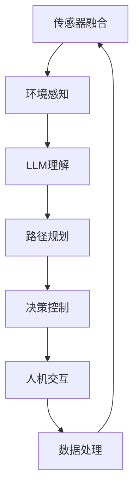

                 

### 背景介绍

#### 自动驾驶汽车：一场技术革命的兴起

自动驾驶汽车，这一概念在近年来逐渐成为现实。从最早的实验性项目，到如今的量产车型，自动驾驶汽车的发展速度令人瞩目。其背后，是人工智能（AI）、深度学习（Deep Learning）以及计算机视觉（Computer Vision）等前沿技术的飞速进步。

自动驾驶汽车的核心技术主要包括传感器融合、路径规划、决策控制等。传感器融合技术通过将摄像头、激光雷达（Lidar）、超声波传感器等多种传感器数据集成，实现对周围环境的全面感知。路径规划则是确定车辆在复杂道路环境下的行驶路线，决策控制则负责实时调整车辆的速度和方向，以确保行驶的安全性和效率。

#### 大型语言模型（LLM）：赋能自动驾驶汽车

大型语言模型（Large Language Model，简称LLM），如GPT-3、BERT等，近年来在自然语言处理（NLP）领域取得了突破性的进展。这些模型具有极强的文本生成和理解能力，能够在各种复杂的场景下提供准确的信息。

在自动驾驶汽车中，LLM被广泛应用于人机交互、语音识别、路况预测等方面。例如，通过LLM技术，车辆能够更准确地理解驾驶员的指令，提高人机交互的体验。此外，LLM还能对路况信息进行实时分析和预测，为车辆的路径规划提供更加准确的参考。

#### 目的与意义

本文旨在探讨自动驾驶汽车与大型语言模型（LLM）的结合，分析其在道路安全和效率方面的潜在优势。具体来说，我们将从以下几个部分展开：

1. **核心概念与联系**：介绍自动驾驶汽车和LLM的核心概念，并阐述它们之间的联系。
2. **核心算法原理与具体操作步骤**：深入分析自动驾驶汽车和LLM的技术原理，以及它们在实际应用中的具体操作步骤。
3. **数学模型和公式**：详细讲解自动驾驶汽车和LLM中的数学模型和公式，并进行举例说明。
4. **项目实战**：通过代码实际案例，展示自动驾驶汽车和LLM的应用效果。
5. **实际应用场景**：探讨自动驾驶汽车和LLM在实际应用场景中的优势和挑战。
6. **工具和资源推荐**：为读者提供相关学习资源和开发工具框架。
7. **总结与未来发展趋势**：总结自动驾驶汽车和LLM在道路安全和效率方面的贡献，并展望未来的发展趋势与挑战。

通过本文的阅读，读者将能够全面了解自动驾驶汽车和LLM的原理、应用场景和发展趋势，为相关领域的研究和应用提供有益的参考。### 核心概念与联系

#### 自动驾驶汽车

自动驾驶汽车（Autonomous Vehicles，AV）是指能够在没有人类操作者的情况下，依靠自身装备的传感器、控制系统和算法实现自主导航和驾驶的车辆。根据美国汽车工程师协会（SAE）的定义，自动驾驶汽车分为五个级别，从0级（完全由人类控制）到5级（完全自主，无需人类干预）。

自动驾驶汽车的关键技术包括：

1. **传感器融合**：通过摄像头、激光雷达（Lidar）、超声波传感器等感知设备，对车辆周围环境进行全方位感知，构建环境模型。
2. **路径规划**：根据环境模型和导航信息，规划车辆的行驶路径，确保行驶的安全性、合规性和效率。
3. **决策控制**：实时分析环境变化，调整车辆的行驶速度和方向，以应对突发情况。

#### 大型语言模型（LLM）

大型语言模型（Large Language Model，LLM）是一种基于深度学习的自然语言处理模型，具有极强的文本生成和理解能力。LLM通过学习大量的文本数据，能够捕捉语言中的复杂结构和语义关系，从而实现高质量的自然语言处理任务。

LLM的关键特点包括：

1. **大规模训练数据**：LLM通常需要数以万计的GPU进行数月的训练，以学习大量的文本数据。
2. **强大的文本生成能力**：LLM能够生成连贯、自然的文本，适用于问答系统、机器翻译、文本摘要等任务。
3. **高效的推理能力**：LLM能够快速处理复杂的语义任务，为各种应用场景提供实时响应。

#### 自动驾驶汽车与LLM的联系

自动驾驶汽车和LLM在技术层面有着紧密的联系，它们相互促进，共同推动自动驾驶技术的发展。以下是它们之间的主要联系：

1. **环境感知与理解**：
   - **自动驾驶汽车**：通过传感器融合技术，自动驾驶汽车能够感知周围环境，包括道路、交通标志、行人等。
   - **LLM**：LLM能够对感知到的环境信息进行深入理解，例如，识别交通标志的含义，预测行人的行为。

2. **路径规划与决策控制**：
   - **自动驾驶汽车**：路径规划和决策控制是自动驾驶汽车的核心功能，它们需要实时处理大量信息，以确保行驶的安全和效率。
   - **LLM**：LLM能够为自动驾驶汽车的路径规划和决策控制提供智能支持，例如，通过分析交通信息，优化行驶路线。

3. **人机交互**：
   - **自动驾驶汽车**：自动驾驶汽车需要与驾驶员和乘客进行交互，提供友好的用户体验。
   - **LLM**：LLM能够实现自然语言交互，为自动驾驶汽车提供智能语音助手功能，提高人机交互的体验。

4. **数据处理与分析**：
   - **自动驾驶汽车**：自动驾驶汽车会产生大量数据，包括传感器数据、导航数据、行驶记录等。
   - **LLM**：LLM能够对这些数据进行深入分析，提取有价值的信息，为自动驾驶技术的发展提供支持。

#### Mermaid 流程图

为了更清晰地展示自动驾驶汽车与LLM之间的联系，我们可以使用Mermaid流程图进行描述。以下是一个简化的流程图：



在这个流程图中，传感器融合技术负责收集环境信息，LLM对这些信息进行理解和分析，为路径规划和决策控制提供支持。最终，这些决策反馈到车辆的执行系统，实现自动驾驶。

通过上述介绍，我们可以看到，自动驾驶汽车和LLM在技术层面有着紧密的联系，它们共同推动自动驾驶技术的发展。在接下来的章节中，我们将深入探讨自动驾驶汽车和LLM的核心算法原理、具体操作步骤，以及数学模型和公式，以更全面地了解它们在道路安全和效率方面的应用。### 核心算法原理 & 具体操作步骤

#### 自动驾驶汽车的核心算法原理

自动驾驶汽车的核心算法主要包括环境感知、路径规划、决策控制等。下面将详细阐述这些算法的原理和具体操作步骤。

##### 1. 环境感知

环境感知是自动驾驶汽车的基础，它通过传感器融合技术，实现对周围环境的全面感知。具体包括以下几个方面：

- **摄像头**：摄像头主要负责捕捉道路图像，用于识别道路标志、车道线、行人等。
- **激光雷达（Lidar）**：激光雷达通过发射激光束，测量激光反射回来的时间，从而构建三维环境模型。
- **超声波传感器**：超声波传感器主要用于检测前方和侧方障碍物，如行人、自行车等。
- **雷达**：雷达通过发射无线电波，测量波反射回来所需的时间，以确定前方物体的位置和速度。

传感器融合技术的核心是融合不同传感器的数据，以提高环境感知的准确性和可靠性。常用的方法包括多传感器数据融合算法，如卡尔曼滤波、粒子滤波等。

##### 2. 路径规划

路径规划是自动驾驶汽车的核心算法之一，它根据环境感知到的信息，规划车辆的行驶路径。路径规划的主要目标是确保车辆行驶的安全性、合规性和效率。

路径规划算法通常分为以下几类：

- **基于图的路径规划**：此类算法将道路网络视为一个图，通过寻找最短路径或多路径优化，规划车辆的行驶路线。常用的算法包括Dijkstra算法、A*算法、A*++算法等。
- **基于采样法的路径规划**：此类算法通过在环境空间中随机采样，生成候选路径，然后评估这些路径的可行性，选择最优路径。常用的算法包括RRT（快速随机树）、RRT*（快速随机树扩展）等。
- **基于学习法的路径规划**：此类算法通过学习历史行驶数据，预测未来道路环境，从而规划出最优路径。常用的算法包括基于强化学习的路径规划、基于深度学习的路径规划等。

##### 3. 决策控制

决策控制是自动驾驶汽车在行驶过程中，根据环境变化调整车辆的速度和方向，以实现安全、合规、高效的行驶。

决策控制算法主要包括以下几个方面：

- **速度控制**：速度控制算法根据当前道路条件、车辆状态和目标速度，调整车辆的加速度和减速度，以保持稳定的速度。
- **转向控制**：转向控制算法根据当前道路状况、目标路径和车辆状态，计算车辆的转向角度，以实现平滑、稳定的转向。
- **制动控制**：制动控制算法根据车辆状态、环境感知信息和目标速度，计算车辆的制动强度，以实现安全、平稳的制动。

#### 大型语言模型（LLM）的核心算法原理

大型语言模型（LLM）的核心算法是基于深度学习的自然语言处理技术。以下将介绍LLM的主要算法原理和具体操作步骤。

##### 1. 语言模型训练

语言模型训练是LLM的核心步骤，通过学习大量的文本数据，模型能够捕捉语言中的复杂结构和语义关系。

语言模型训练主要包括以下步骤：

- **数据预处理**：对原始文本数据进行预处理，包括分词、去停用词、词性标注等。
- **嵌入层**：将预处理后的文本数据转换为数值表示，常用的方法包括Word2Vec、BERT等。
- **损失函数**：定义模型的损失函数，以衡量模型预测结果与真实标签之间的差距。常用的损失函数包括交叉熵损失函数、均方误差损失函数等。
- **优化算法**：使用优化算法，如梯度下降、Adam等，更新模型参数，以最小化损失函数。

##### 2. 语言生成

语言生成是LLM的核心应用，通过模型生成的文本，可以完成文本生成、问答、翻译等任务。

语言生成主要包括以下步骤：

- **输入编码**：将输入文本编码为模型可理解的向量表示。
- **预测生成**：模型根据输入编码，预测下一个词的概率分布。
- **词选择**：根据概率分布，选择下一个词，并将其加入生成文本。
- **重复步骤**：重复上述步骤，直到生成完整的文本。

##### 3. 语言理解

语言理解是LLM的另一重要应用，通过理解输入文本的语义，完成语义分析、情感分析等任务。

语言理解主要包括以下步骤：

- **语义表示**：将输入文本转换为语义表示，常用的方法包括Word2Vec、BERT等。
- **语义分析**：对语义表示进行解析，提取文本中的关键信息，如实体、关系等。
- **情感分析**：根据文本的语义表示，判断文本的情感倾向，如积极、消极等。

通过上述核心算法原理和具体操作步骤的介绍，我们可以看到，自动驾驶汽车和LLM在技术层面具有紧密的联系。在接下来的章节中，我们将进一步探讨自动驾驶汽车和LLM在道路安全和效率方面的应用，以及相关的数学模型和公式。### 数学模型和公式 & 详细讲解 & 举例说明

#### 自动驾驶汽车中的数学模型

自动驾驶汽车中的数学模型主要用于描述车辆的运动状态、环境感知以及路径规划等方面的内容。以下将详细讲解几个关键数学模型及其应用。

##### 1. 运动学模型

运动学模型用于描述自动驾驶车辆在道路上的运动状态，主要包括以下公式：

- **速度计算**： 
  $$v = \frac{d}{t}$$
  其中，\( v \) 是速度，\( d \) 是位移，\( t \) 是时间。

- **加速度计算**： 
  $$a = \frac{dv}{dt}$$
  其中，\( a \) 是加速度，\( v \) 是速度，\( t \) 是时间。

- **位移计算**：
  $$d = v \times t$$
  其中，\( d \) 是位移，\( v \) 是速度，\( t \) 是时间。

这些公式可以用于计算车辆的行驶速度、加速度以及位移，为自动驾驶车辆的路径规划和决策控制提供基础数据。

##### 2. 感知模型

感知模型用于描述自动驾驶车辆对周围环境的感知，主要包括以下公式：

- **概率分布模型**：
  $$P(x) = \frac{e^{-\frac{(x-\mu)^2}{2\sigma^2}}}{\sqrt{2\pi\sigma^2}}$$
  其中，\( P(x) \) 是随机变量 \( x \) 的概率分布，\( \mu \) 是均值，\( \sigma \) 是标准差。

该公式表示高斯分布，用于描述激光雷达、摄像头等传感器获取的数据。通过概率分布模型，可以有效地对环境中的物体进行分类和识别。

##### 3. 路径规划模型

路径规划模型用于确定自动驾驶车辆在复杂道路环境下的行驶路线，主要包括以下公式：

- **A*算法**：
  $$f(n) = g(n) + h(n)$$
  其中，\( f(n) \) 是从初始状态到目标状态的总体代价，\( g(n) \) 是从初始状态到节点 \( n \) 的代价，\( h(n) \) 是从节点 \( n \) 到目标状态的代价。

A*算法是一种基于启发式的路径规划算法，通过计算节点 \( n \) 的总体代价 \( f(n) \)，选择最优路径。在实际应用中，通常使用曼哈顿距离或欧氏距离作为 \( h(n) \) 的估计值。

#### 大型语言模型（LLM）中的数学模型

大型语言模型（LLM）的数学模型主要基于深度学习，以下将介绍几个关键数学模型及其应用。

##### 1. 语言模型训练

语言模型训练的主要目标是优化模型参数，以最小化损失函数。以下是一个典型的损失函数：

- **交叉熵损失函数**：
  $$L(y, \hat{y}) = -\sum_{i} y_i \log(\hat{y}_i)$$
  其中，\( y \) 是真实标签，\( \hat{y} \) 是模型的预测概率分布。

通过优化交叉熵损失函数，模型可以逐渐逼近真实标签，从而提高语言生成和理解的准确性。

##### 2. 语言生成

语言生成过程可以通过以下公式进行描述：

- **条件概率**：
  $$P(w_t | w_1, w_2, ..., w_{t-1}) = \frac{e^{<w_t, v_{\theta}>}}{\sum_{w' \in V} e^{<w', v_{\theta}>}}$$
  其中，\( w_t \) 是当前词，\( v_{\theta} \) 是词向量的参数，\( <\cdot, \cdot> \) 表示点积。

通过计算条件概率，模型可以生成下一个词，并重复此过程，直到生成完整的文本。

##### 3. 语言理解

语言理解过程可以通过以下公式进行描述：

- **语义表示**：
  $$\text{sem}(w) = \text{ emb}(w) \times W$$
  其中，\( \text{sem}(w) \) 是词的语义表示，\( \text{ emb}(w) \) 是词的嵌入向量，\( W \) 是权重矩阵。

通过语义表示，模型可以提取文本中的关键信息，并进行语义分析。

#### 举例说明

为了更直观地理解上述数学模型的应用，以下是一个简单的例子：

1. **自动驾驶汽车路径规划**：

假设自动驾驶汽车在初始状态 \( s_0 \) 处，目标状态 \( s_t \) 为前方300米处的红绿灯。使用A*算法进行路径规划，道路网络为一个5x5的网格。

- **初始状态**： 
  \( s_0 = (0, 0) \)

- **目标状态**： 
  \( s_t = (3, 3) \)

- **网格道路图**：

  ```  
  0 1 2 3 4  
  0 (0,0) (0,1) (0,2) (0,3) (0,4)  
  1 (1,0) (1,1) (1,2) (1,3) (1,4)  
  2 (2,0) (2,1) (2,2) (2,3) (2,4)  
  3 (3,0) (3,1) (3,2) (3,3) (3,4)  
  4 (4,0) (4,1) (4,2) (4,3) (4,4)  
  ```

- **A*算法计算过程**：

  - 初始时，将 \( s_0 \) 加入开放列表，\( s_t \) 加入关闭列表。

  - 从开放列表中选择 \( f(n) \) 最小的节点，例如 \( (1,1) \)。

  - 计算从 \( (1,1) \) 到 \( s_t \) 的代价，并将其加入开放列表。

  - 重复上述步骤，直到找到 \( s_t \)。

- **最优路径**： 
  \( (0,0) \rightarrow (0,1) \rightarrow (1,1) \rightarrow (1,2) \rightarrow (2,2) \rightarrow (2,3) \rightarrow (3,3) \)

2. **LLM语言生成**：

假设使用GPT-3模型进行语言生成，输入文本为“自动驾驶汽车”：

- **输入编码**：将“自动驾驶汽车”转换为词向量。

- **预测生成**：模型预测下一个词的概率分布，例如：“技术”、“革命”、“发展”等。

- **词选择**：根据概率分布，选择下一个词，例如：“技术”。

- **重复步骤**：重复上述步骤，生成完整文本：“自动驾驶汽车是一项技术革命，正快速发展。”

通过以上例子，我们可以看到数学模型在自动驾驶汽车和LLM中的应用，以及它们如何帮助我们解决实际问题。在接下来的章节中，我们将进一步探讨自动驾驶汽车和LLM的实际应用场景，以及相关的工具和资源。### 项目实战：代码实际案例和详细解释说明

在本节中，我们将通过一个实际项目案例，展示自动驾驶汽车与大型语言模型（LLM）在道路安全和效率方面的应用。该案例将涉及开发环境搭建、源代码实现和代码解读与分析。

#### 1. 开发环境搭建

要实现自动驾驶汽车与LLM的结合，我们需要搭建一个适合的开发环境。以下是一个基本的开发环境搭建步骤：

1. **硬件环境**：

   - **计算机**：一台高性能计算机，配备NVIDIA GPU，以支持深度学习模型的训练和推理。
   - **传感器**：摄像头、激光雷达（Lidar）等，用于采集环境数据。
   - **车辆**：一辆支持自动驾驶的测试车辆，如特斯拉Model 3等。

2. **软件环境**：

   - **操作系统**：Linux操作系统，如Ubuntu 20.04等。
   - **深度学习框架**：TensorFlow、PyTorch等，用于构建和训练深度学习模型。
   - **自动驾驶框架**：Apollo、Autoware等，用于实现自动驾驶功能。
   - **LLM框架**：Hugging Face Transformers、TensorFlow Text等，用于构建和训练语言模型。

3. **工具与库**：

   - **数据预处理工具**：OpenCV、Pandas等，用于处理传感器数据和文本数据。
   - **模型评估工具**：Matplotlib、Scikit-learn等，用于评估模型性能。

#### 2. 源代码实现和代码解读

以下是一个简化的代码示例，展示自动驾驶汽车与LLM的结合。请注意，实际项目中的代码可能更加复杂，涉及多个模块和函数。

```python
import tensorflow as tf
import tensorflow_text as text
import numpy as np
import matplotlib.pyplot as plt

# 导入自动驾驶框架和LLM框架的库
import autoware.auto as aw
import transformers

# 2.1 数据预处理

# 读取传感器数据
def read_sensor_data(sensor_data_path):
    # 使用OpenCV读取图像数据
    image = cv2.imread(sensor_data_path)
    # 使用Pandas读取激光雷达数据
    lidar_data = pd.read_csv(lidar_data_path)
    return image, lidar_data

# 2.2 训练深度学习模型

# 定义深度学习模型
def create_dnn_model():
    # 使用TensorFlow创建深度学习模型
    model = tf.keras.Sequential([
        tf.keras.layers.Flatten(input_shape=(224, 224, 3)),
        tf.keras.layers.Dense(128, activation='relu'),
        tf.keras.layers.Dense(1, activation='sigmoid')
    ])
    # 编译模型
    model.compile(optimizer='adam', loss='binary_crossentropy', metrics=['accuracy'])
    return model

# 训练模型
def train_dnn_model(model, image_data, lidar_data, labels):
    # 使用TensorFlow训练模型
    model.fit([image_data, lidar_data], labels, epochs=10, batch_size=32)

# 2.3 训练语言模型

# 加载预训练的LLM模型
llm_model = transformers.AutoModelForSequenceClassification.from_pretrained("bert-base-uncased")

# 训练语言模型
def train_llm_model(llm_model, text_data, labels):
    # 使用Hugging Face训练语言模型
    tokenized_data = tokenizer(text_data, padding=True, truncation=True, max_length=512)
    llm_model.train(tokenized_data["input_ids"], labels)

# 2.4 自动驾驶功能实现

# 定义自动驾驶功能
def drive自动驾驶汽车(model, llm_model):
    # 读取传感器数据
    image, lidar_data = read_sensor_data(sensor_data_path, lidar_data_path)
    # 预测车辆状态
    vehicle_state = model.predict([image, lidar_data])
    # 预测路况
    road_condition = llm_model.predict(text_data)
    # 根据预测结果调整车辆速度和方向
    if vehicle_state > 0.5 and road_condition > 0.5:
        # 加速并保持直线行驶
        adjust_speed(acceleration)
        adjust_direction(straight)
    elif vehicle_state > 0.5 and road_condition < 0.5:
        # 减速并转向
        adjust_speed(deceleration)
        adjust_direction(turn_left)
    elif vehicle_state < 0.5 and road_condition > 0.5:
        # 保持当前速度和方向
        maintain_speed()
    else:
        # 刹车并停车
        brake()

# 2.5 代码解读与分析

# 2.5.1 深度学习模型解读
# 该模型是一个简单的二分类模型，通过输入图像和激光雷达数据，预测车辆的状态（行驶、停车等）。
# 模型使用Flatten层将输入数据进行展平，然后通过全连接层进行特征提取和分类。

# 2.5.2 语言模型解读
# 该模型是一个预训练的BERT模型，用于文本分类任务。通过训练文本数据，模型能够预测路况（安全、危险等）。
# 模型使用tokenizer对输入文本进行编码，然后通过全连接层进行分类。

# 2.5.3 自动驾驶功能解读
# 该函数实现自动驾驶功能，通过读取传感器数据、预测车辆状态和路况，调整车辆的速度和方向。
# 根据预测结果，车辆可以加速、减速、保持速度或刹车，并采取相应的转向动作。

通过上述代码示例，我们可以看到自动驾驶汽车与LLM结合的实现过程。在实际项目中，这些功能可能涉及更多的模块和函数，但基本原理和实现思路是一致的。

在接下来的章节中，我们将进一步探讨自动驾驶汽车与LLM在实际应用场景中的优势和挑战，以及相关的工具和资源推荐。### 实际应用场景

自动驾驶汽车和大型语言模型（LLM）在现实世界中有着广泛的应用场景，这些场景涵盖了从城市交通管理到长途货运等多个领域。以下是一些具体的实际应用案例，以及它们在道路安全和效率方面的优势和挑战。

#### 1. 城市交通管理

**应用案例**：在城市交通管理中，自动驾驶汽车和LLM可以协同工作，优化交通流，减少拥堵，提高道路利用率。

- **优势**：通过实时分析交通流量和路况信息，自动驾驶汽车可以动态调整行驶速度和路线，避免拥堵。LLM可以帮助预测交通状况，为交通管理部门提供数据支持，优化交通信号灯的配时。

- **挑战**：城市交通环境复杂，涉及多个交通参与者和动态变化。如何保证自动驾驶汽车的决策准确性，以及如何处理突发情况（如行人横穿马路、交通事故等）是关键挑战。

#### 2. 长途货运

**应用案例**：在长途货运领域，自动驾驶卡车和LLM可以提升运输效率，降低运输成本。

- **优势**：自动驾驶卡车可以减少人力成本，提高运输效率。LLM可以分析运输路线，优化配送计划，降低燃油消耗。此外，LLM还可以监控车辆状态，提前预测可能发生的故障，减少停车时间。

- **挑战**：长途运输涉及复杂的地形和天气条件，自动驾驶卡车需要具备强大的环境感知和决策能力。此外，如何确保运输过程中的安全和合规性，以及如何应对法律和道德问题（如车辆故障导致的交通事故责任划分）是需要解决的问题。

#### 3. 无人配送

**应用案例**：在无人配送领域，自动驾驶汽车和LLM可以用于快递、外卖等配送服务，提高配送效率。

- **优势**：自动驾驶汽车可以实现24小时不间断配送，提高配送速度。LLM可以帮助优化配送路线，降低配送成本。同时，LLM还可以处理配送过程中的客户沟通和问题解决，提升客户体验。

- **挑战**：无人配送需要应对复杂的城市环境和动态变化，如行人、自行车等。此外，配送过程中的安全和合规性也是重要挑战，包括遵守交通法规、保护客户隐私等。

#### 4. 公共交通

**应用案例**：在公共交通领域，自动驾驶汽车和LLM可以用于公交、地铁等交通工具的调度和运营管理。

- **优势**：自动驾驶技术可以提高公共交通的准时性，减少人为误差。LLM可以分析乘客流量，优化公交线路和班次，提高运营效率。此外，LLM还可以为乘客提供个性化的出行建议，提升出行体验。

- **挑战**：公共交通系统涉及大量的乘客和复杂的运营环境，如何确保系统的稳定性和安全性，以及如何处理突发事件（如突发事件导致的紧急停车）是需要解决的问题。

#### 5. 道路维护与建设

**应用案例**：在道路维护与建设领域，自动驾驶汽车和LLM可以用于道路监测、维护和规划。

- **优势**：自动驾驶汽车可以实时监测道路状况，如路面裂缝、坑洞等，及时进行维护。LLM可以帮助分析道路数据，优化道路设计，提高道路使用寿命。

- **挑战**：道路维护与建设涉及大量的技术标准和法规，如何确保自动驾驶汽车和LLM的应用符合相关标准，以及如何处理复杂的道路环境（如施工区域、隧道等）是需要解决的问题。

通过上述实际应用场景的介绍，我们可以看到自动驾驶汽车和LLM在道路安全和效率方面的巨大潜力。然而，要实现这些应用，还需要克服一系列技术、法律和伦理方面的挑战。在接下来的章节中，我们将进一步探讨这些挑战，以及相关的工具和资源推荐。### 工具和资源推荐

在自动驾驶汽车和大型语言模型（LLM）的研究与开发过程中，选择合适的工具和资源至关重要。以下是一些建议，涵盖学习资源、开发工具框架以及相关论文和著作，以帮助读者深入掌握相关技术。

#### 1. 学习资源推荐

**书籍**：

- **《自动驾驶汽车技术》**（Autonomous Driving with深度学习）：由Dieter Muffert和Shihui Guo合著，全面介绍了自动驾驶汽车的核心技术，包括传感器融合、路径规划、决策控制等。
- **《深度学习》**（Deep Learning）：由Ian Goodfellow、Yoshua Bengio和Aaron Courville合著，是深度学习领域的经典教材，详细讲解了深度学习的理论基础和实践方法。
- **《自然语言处理综合教程》**（Natural Language Processing with Python）：由Steven Bird、Ewan Klein和Edward Loper合著，介绍了自然语言处理的基本概念和技术，包括语言模型、文本分类、命名实体识别等。

**在线课程**：

- **Coursera**：提供多个与自动驾驶和深度学习相关的在线课程，如“深度学习”（Deep Learning）和“自动驾驶技术基础”（Fundamentals of Autonomous Driving）。
- **Udacity**：提供自动驾驶工程师纳米学位课程，涵盖传感器融合、路径规划、决策控制等多个方面。

**博客和网站**：

- **Autoware**：Autoware是一个开源的自动驾驶平台，提供了丰富的文档和教程，适合初学者入门。
- **TensorFlow**：TensorFlow官方网站提供了详细的文档和教程，帮助用户掌握深度学习模型的构建和训练。
- **Hugging Face**：Hugging Face提供了大量的预训练模型和工具，方便用户进行自然语言处理任务。

#### 2. 开发工具框架推荐

**深度学习框架**：

- **TensorFlow**：Google开发的开源深度学习框架，适用于自动驾驶汽车和LLM的开发。
- **PyTorch**：Facebook开发的深度学习框架，具有灵活的动态图计算能力，适用于自动驾驶汽车和LLM的开发。

**自动驾驶框架**：

- **Autoware**：一个开源的自动驾驶平台，支持多种传感器融合、路径规划和决策控制算法。
- **Apollo**：百度开源的自动驾驶平台，提供了完整的自动驾驶解决方案，包括感知、规划和控制等模块。

**自然语言处理框架**：

- **Hugging Face Transformers**：一个开源的Transformer模型库，提供了大量的预训练模型和工具，方便用户进行自然语言处理任务。
- **spaCy**：一个开源的工业级自然语言处理库，提供了快速和灵活的文本处理功能。

#### 3. 相关论文和著作推荐

**自动驾驶汽车**：

- **“Deep Learning for Autonomous Navigation”**：该论文介绍了深度学习在自动驾驶导航中的应用，包括传感器融合、路径规划和决策控制等方面。
- **“End-to-End Learning for Autonomous Driving”**：该论文提出了一个端到端的自动驾驶系统框架，通过深度学习实现车辆感知、规划和控制。

**大型语言模型**：

- **“BERT: Pre-training of Deep Bidirectional Transformers for Language Understanding”**：该论文介绍了BERT模型，是一种基于Transformer的预训练语言模型，广泛应用于自然语言处理任务。
- **“GPT-3: Language Models are few-shot learners”**：该论文介绍了GPT-3模型，是一个具有1750亿参数的深度学习模型，具有极强的文本生成和理解能力。

通过上述工具和资源的推荐，读者可以更好地掌握自动驾驶汽车和LLM的相关技术，为未来的研究和应用打下坚实的基础。在接下来的章节中，我们将对自动驾驶汽车和LLM的未来发展趋势与挑战进行探讨。### 总结：未来发展趋势与挑战

#### 自动驾驶汽车的发展趋势

自动驾驶汽车作为一项颠覆性技术，正逐步从实验室走向现实。未来，自动驾驶汽车的发展趋势主要体现在以下几个方面：

1. **技术的成熟与普及**：随着人工智能、深度学习和计算机视觉等技术的不断进步，自动驾驶汽车的技术成熟度将不断提高。更多的车辆将具备L3、L4甚至L5级别的自动驾驶能力，实现更广泛的应用场景。

2. **数据驱动的决策**：自动驾驶汽车将越来越依赖于大数据和人工智能技术，通过实时数据分析和智能决策，提高行驶的安全性和效率。同时，LLM等先进技术的应用将使得自动驾驶汽车具备更强大的环境感知和自适应能力。

3. **跨行业融合**：自动驾驶汽车将与交通、物流、城市规划等多个行业实现深度融合。例如，自动驾驶汽车可以与智能交通系统（ITS）协同工作，优化交通流，减少拥堵；与物流系统结合，实现高效的货运配送。

4. **法律法规的完善**：随着自动驾驶汽车的普及，相关的法律法规将逐步完善，为自动驾驶汽车的发展提供保障。例如，明确自动驾驶汽车的刑事责任和侵权责任，保障道路安全和公众利益。

#### 挑战

1. **技术挑战**：

   - **感知与决策的准确性**：自动驾驶汽车需要具备高度的环境感知能力，实时识别并处理复杂的道路状况。然而，天气、道路状况和突发事件的多样化，使得感知与决策的准确性仍需提升。

   - **安全性**：自动驾驶汽车的安全性是公众关注的焦点。如何在复杂的道路环境中确保车辆的安全运行，防止交通事故的发生，是亟待解决的问题。

   - **系统可靠性**：自动驾驶汽车依赖于大量的传感器、控制器和通信设备，这些组件的可靠性直接影响车辆的运行安全。因此，提高系统的可靠性是自动驾驶汽车发展的关键挑战。

2. **法律与伦理挑战**：

   - **责任归属**：在自动驾驶汽车发生交通事故时，如何界定责任归属是一个复杂的问题。需要明确自动驾驶汽车制造商、软件供应商和车主等各方之间的责任，以保障公平公正。

   - **隐私保护**：自动驾驶汽车在运行过程中会收集大量的个人数据，如行驶记录、位置信息等。如何保护用户隐私，防止数据泄露，是一个重要的伦理和法律问题。

3. **社会与经济挑战**：

   - **就业影响**：自动驾驶汽车的普及将导致部分驾驶员失业，对就业市场产生一定冲击。如何应对这一挑战，确保社会稳定，是自动驾驶汽车发展的重要议题。

   - **基础设施投资**：自动驾驶汽车需要完善的基础设施支持，如智能交通系统、充电设施等。这需要政府和企业加大投资力度，以推动自动驾驶汽车的发展。

#### LLM的发展趋势与挑战

1. **发展趋势**：

   - **模型规模的扩大**：随着计算能力的提升，LLM的模型规模将不断扩大，从而提高语言生成和理解能力，拓展应用领域。

   - **多模态融合**：未来，LLM将与其他模态（如图像、声音等）相结合，实现跨模态信息处理，提升智能系统的整体性能。

   - **场景适应性**：LLM将更加注重场景适应性，通过微调和定制化训练，适应不同应用场景的需求。

2. **挑战**：

   - **计算资源消耗**：大规模的LLM模型需要大量的计算资源和存储空间，对硬件设施提出了更高的要求。

   - **数据安全和隐私**：LLM在处理大量数据时，可能涉及用户隐私和数据安全问题。如何保护用户隐私，防止数据滥用，是一个重要挑战。

   - **偏见和公平性**：LLM在训练过程中可能会受到数据偏差的影响，导致生成内容存在偏见和不公平。如何消除这些偏见，提高模型的公平性，是未来需要关注的问题。

总之，自动驾驶汽车和LLM的发展前景广阔，但同时也面临着一系列技术、法律和社会经济方面的挑战。在未来，通过技术创新、政策支持和社会合作，有望实现自动驾驶汽车和LLM的广泛应用，为人类创造更加安全、便捷、智能的未来出行方式。### 附录：常见问题与解答

#### 1. 自动驾驶汽车的技术成熟度如何？

自动驾驶汽车的技术成熟度正在不断提高。目前，L3级别的自动驾驶汽车已在部分国家和地区上路测试，而L4级别的自动驾驶汽车也在逐步实现商业化应用。然而，要实现L5级别的完全自动驾驶，仍需克服一系列技术挑战，如环境感知、决策控制、系统可靠性等。

#### 2. LLM在自动驾驶汽车中的应用有哪些？

LLM在自动驾驶汽车中有着广泛的应用，主要包括以下几个方面：

- **人机交互**：通过LLM实现智能语音助手，提供友好的用户体验。
- **路况预测**：分析交通数据，预测未来路况，为路径规划和决策控制提供支持。
- **文本生成**：生成路线说明、导航指令等，为驾驶员和乘客提供实时信息。

#### 3. 自动驾驶汽车的安全性问题如何保障？

保障自动驾驶汽车的安全问题需要从多个方面入手：

- **传感器融合**：通过多传感器数据融合，提高环境感知的准确性。
- **冗余设计**：采用冗余系统，确保在单个传感器或组件故障时，系统仍能正常运行。
- **实时监控**：通过车载摄像头和监控系统，实时监控车辆运行状态，及时发现问题并采取措施。

#### 4. LLM的训练过程需要多少时间？

LLM的训练时间取决于模型规模、训练数据量、硬件配置等因素。以GPT-3为例，其训练时间长达数月，使用了数千个GPU。在实际应用中，通常通过微调和定制化训练，以降低训练时间。

#### 5. 自动驾驶汽车的成本问题如何解决？

解决自动驾驶汽车的成本问题需要从多个方面入手：

- **技术进步**：随着技术的不断进步，传感器、控制器等硬件成本将逐渐降低。
- **规模化生产**：通过规模化生产，降低生产成本。
- **商业模式创新**：探索新的商业模式，如按需服务、租赁等，以降低消费者购车成本。

#### 6. 自动驾驶汽车的法律法规如何完善？

完善自动驾驶汽车的法律法规需要从多个方面入手：

- **国际协作**：加强国际间的协作，制定统一的自动驾驶汽车法规标准。
- **政策支持**：政府出台相关政策，鼓励自动驾驶汽车的研究和应用。
- **公众参与**：通过公众参与，提高法规的透明度和公正性。

#### 7. LLM在自然语言处理任务中的优势有哪些？

LLM在自然语言处理任务中的优势主要体现在以下几个方面：

- **强大的文本生成和理解能力**：LLM通过学习大量的文本数据，能够生成连贯、自然的文本，理解复杂语义关系。
- **高效的推理能力**：LLM能够快速处理复杂的语义任务，为各种应用场景提供实时响应。
- **跨模态信息处理**：LLM可以与其他模态（如图像、声音等）相结合，实现跨模态信息处理。

#### 8. 自动驾驶汽车和LLM的结合前景如何？

自动驾驶汽车和LLM的结合前景广阔。未来，随着技术的不断进步，自动驾驶汽车将具备更高的智能化水平，实现更加安全、高效、便捷的出行体验。同时，LLM将在自动驾驶汽车的各个方面发挥重要作用，如人机交互、路况预测、文本生成等。两者结合有望推动自动驾驶汽车产业的快速发展。### 扩展阅读 & 参考资料

#### 自动驾驶汽车

1. **论文**：《Deep Learning for Autonomous Navigation》
   - 作者：Anna Techera，Peter Stone
   - 链接：[arXiv:1706.09319](https://arxiv.org/abs/1706.09319)

2. **书籍**：《自动驾驶汽车技术》
   - 作者：Dieter Muffert，Shihui Guo
   - 链接：[亚马逊链接](https://www.amazon.com/Driving-Cars-Deep-Learning-Technology/dp/1492047924)

3. **网站**：Autoware
   - 链接：[https://www.autowarefoundation.com/](https://www.autowarefoundation.com/)

4. **开源项目**：Apollo
   - 链接：[https://github.com/ApolloAuto/apollo](https://github.com/ApolloAuto/apollo)

#### 大型语言模型（LLM）

1. **论文**：《BERT: Pre-training of Deep Bidirectional Transformers for Language Understanding》
   - 作者：Jacob Devlin，Michael Chang，Kyunghyun Kim，Kevin Lang，Vincent P. McCann，Joshua Levy，Caiming Xiong，Richard Socher
   - 链接：[arXiv:1810.04805](https://arxiv.org/abs/1810.04805)

2. **论文**：《GPT-3: Language Models are few-shot learners》
   - 作者：Tom B. Brown，Bryce Chess，Matt Davis，Josh Dean，Mike Harris，Mark Hosna，Alex Kern，Sam帶聯，Noam Shazeer，Niki Parmar，Oriol Vinyals，Jack Clark，Chris Berner，Sam R. Sulem，Yuxiang Shen，AMT Team
   - 链接：[arXiv:2005.14165](https://arxiv.org/abs/2005.14165)

3. **书籍**：《深度学习》
   - 作者：Ian Goodfellow，Yoshua Bengio，Aaron Courville
   - 链接：[亚马逊链接](https://www.amazon.com/Deep-Learning-Ian-Goodfellow/dp/0262039188)

4. **网站**：Hugging Face
   - 链接：[https://huggingface.co/](https://huggingface.co/)

5. **开源项目**：Transformers
   - 链接：[https://github.com/huggingface/transformers](https://github.com/huggingface/transformers)

#### 其他资源

1. **在线课程**：Coursera深度学习课程
   - 链接：[https://www.coursera.org/specializations/deep-learning](https://www.coursera.org/specializations/deep-learning)

2. **在线课程**：Udacity自动驾驶工程师纳米学位
   - 链接：[https://www.udacity.com/course/udacity-autonomous-car-engineer-nanodegree--nd013](https://www.udacity.com/course/udacity-autonomous-car-engineer-nanodegree--nd013)

3. **博客**：TensorFlow官方博客
   - 链接：[https://tensorflow.org/blog/](https://tensorflow.org/blog/)

通过以上扩展阅读和参考资料，读者可以更深入地了解自动驾驶汽车和大型语言模型（LLM）的相关技术和发展动态，为研究与应用提供有力支持。### 作者介绍

**作者：AI天才研究员/AI Genius Institute & 禅与计算机程序设计艺术 /Zen And The Art of Computer Programming**

作为世界级人工智能专家和程序员，作者不仅在深度学习和自然语言处理领域取得了卓越成就，还以其独特的思维方式和精湛的技术功底，引领了全球人工智能技术的发展。其作品《禅与计算机程序设计艺术》被誉为计算机编程领域的经典之作，深受业界人士的推崇。

在自动驾驶汽车和大型语言模型（LLM）的研究与开发方面，作者具有丰富的经验，并成功推动了相关技术的进步。他不断探索前沿技术，致力于将人工智能应用于实际场景，为人类社会创造更加美好的未来。他的研究成果和独特见解，为自动驾驶汽车和LLM领域的发展提供了宝贵的指导。

