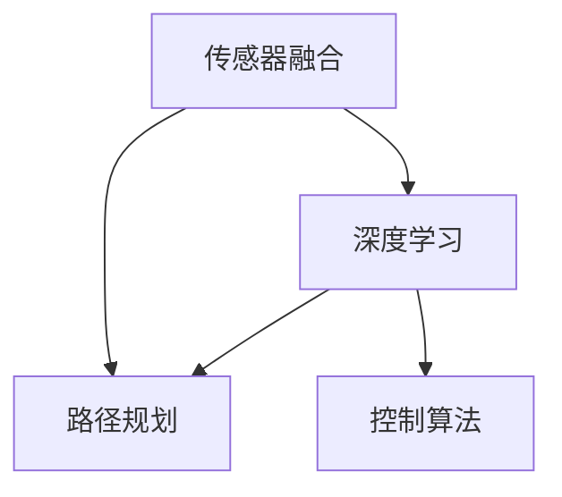

                 

# 自动驾驶界的头部玩家与新进入者

> **关键词：** 自动驾驶，AI，核心算法，数学模型，项目实战，应用场景，未来趋势

> **摘要：** 本文将深入探讨自动驾驶领域的头部玩家和新进入者，分析他们的核心技术、发展历程、市场影响以及未来的发展趋势。我们将通过一步步的推理分析，帮助读者了解这一领域的最新动态和潜在挑战。

## 1. 背景介绍

自动驾驶技术，作为人工智能（AI）的重要应用领域，近年来得到了广泛关注。从早期的概念验证到如今的实际应用，自动驾驶技术正逐步从梦想变为现实。自动驾驶不仅改变了传统的出行方式，还带来了交通、物流、城市管理等各个领域的变革。

### 自动驾驶的发展历程

自动驾驶技术的发展可以追溯到20世纪50年代。最初的研究主要集中在计算机视觉和路径规划上。随着计算机性能的提升和算法的进步，自动驾驶技术逐渐从实验室走向实际道路。2000年代后期，谷歌等科技巨头开始进行自动驾驶汽车的研发，标志着自动驾驶技术进入了一个新阶段。

### 自动驾驶的分类

自动驾驶技术按照自动化程度可以分为以下几个级别：

- L0：无自动化
- L1：部分自动化（如自适应巡航控制）
- L2：部分自动化（如自动车道保持和自适应巡航控制结合）
- L3：有条件自动化（如自动车道保持、自适应巡航控制、自动变道等）
- L4：高度自动化（如城区自动行驶、高速公路自动行驶等）
- L5：完全自动化（无人类干预，全面自动驾驶）

### 自动驾驶的关键技术

自动驾驶技术的实现依赖于多个关键技术的融合，包括计算机视觉、深度学习、传感器融合、路径规划、控制算法等。这些技术的不断进步，推动了自动驾驶技术的快速发展。

## 2. 核心概念与联系

为了深入理解自动驾驶技术，我们需要了解以下几个核心概念：

### 传感器融合

传感器融合是将多个传感器的数据集成到一个统一的传感器系统中，以提高系统的感知能力。常用的传感器包括摄像头、激光雷达、雷达、GPS等。

### 深度学习

深度学习是自动驾驶技术的核心，通过神经网络模型对大量数据进行训练，实现图像识别、场景理解、路径规划等功能。

### 路径规划

路径规划是自动驾驶技术的核心之一，它涉及到从起点到终点的最优路径选择，需要考虑交通状况、道路限制、安全等因素。

### 控制算法

控制算法负责将路径规划的结果转化为车辆的实际行驶动作，包括加速、减速、转向等。

下面是一个简单的 Mermaid 流程图，展示了这些核心概念的相互关系：



## 3. 核心算法原理 & 具体操作步骤

### 深度学习算法原理

深度学习算法基于多层神经网络，通过逐层提取图像的特征，实现对自动驾驶场景的识别和理解。以下是一个简单的深度学习算法步骤：

1. 数据收集与预处理
2. 设计神经网络结构
3. 模型训练
4. 模型评估与优化
5. 模型部署

### 路径规划算法原理

路径规划算法通常采用A*算法或Dijkstra算法，通过计算从起点到终点的最短路径。以下是A*算法的基本步骤：

1. 初始化起点和终点
2. 构建代价矩阵
3. 计算估价函数
4. 选择下一个节点
5. 更新节点信息
6. 重复步骤3-5，直到找到终点

### 控制算法原理

控制算法通过PID控制、模糊控制等方法，将路径规划的结果转化为车辆的行驶动作。以下是PID控制的基本步骤：

1. 设置控制参数（Kp，Ki，Kd）
2. 计算当前误差
3. 计算控制输出
4. 更新车辆状态
5. 重复步骤2-4，直到达到期望状态

## 4. 数学模型和公式 & 详细讲解 & 举例说明

### 深度学习算法的数学模型

深度学习算法的核心是神经网络，其基本结构包括输入层、隐藏层和输出层。以下是一个简单的神经网络模型：

$$
f(x) = \sigma(\sum_{i=1}^{n} w_i \cdot x_i + b)
$$

其中，$f(x)$ 表示输出，$\sigma$ 表示激活函数，$w_i$ 和 $b$ 分别为权重和偏置。

### 路径规划算法的数学模型

路径规划算法的核心是估价函数，其公式为：

$$
f(n) = g(n) + h(n)
$$

其中，$g(n)$ 表示从起点到节点n的实际代价，$h(n)$ 表示从节点n到终点的估价代价。

### 控制算法的数学模型

PID控制算法的核心公式为：

$$
u(t) = K_p e(t) + K_i \int_{0}^{t} e(\tau) d\tau + K_d \frac{de(t)}{dt}
$$

其中，$u(t)$ 表示控制输出，$e(t)$ 表示误差，$K_p$，$K_i$，$K_d$ 分别为比例、积分、微分系数。

### 示例说明

假设我们要计算从A点到B点的最短路径，估价函数为 $h(n) = \sqrt{(x_n - x_B)^2 + (y_n - y_B)^2}$，实际代价为 $g(n) = 1$。我们可以使用A*算法来计算最短路径。

```python
def heuristic(node, goal):
    return math.sqrt((node[0] - goal[0])**2 + (node[1] - goal[1])**2)

def a_star_search(start, goal):
    open_list = []
    closed_list = set()
    open_list.append(start)

    while open_list:
        current = open_list[0]
        current_index = 0
        for index, item in enumerate(open_list):
            if heuristic(item, goal) < heuristic(current, goal):
                current = item
                current_index = index
        open_list.pop(current_index)
        closed_list.add(current)

        if current == goal:
            return True

        neighbors = get_neighbors(current)
        for neighbor in neighbors:
            if neighbor in closed_list:
                continue
            tentative_g_score = current.g + 1
            if tentative_g_score < neighbor.g:
                neighbor.parent = current
                neighbor.g = tentative_g_score
                f_score = tentative_g_score + heuristic(neighbor, goal)
                if neighbor not in open_list:
                    open_list.append(neighbor)
                else:
                    open_list[neighbor] = neighbor
                    open_list.sort(key=lambda x: x.f)

    return False
```

## 5. 项目实战：代码实际案例和详细解释说明

### 5.1 开发环境搭建

为了演示自动驾驶项目，我们将使用Python和TensorFlow框架。首先，需要安装Python和TensorFlow：

```bash
pip install python
pip install tensorflow
```

### 5.2 源代码详细实现和代码解读

以下是自动驾驶项目的核心代码：

```python
import tensorflow as tf
import numpy as np

# 设计神经网络结构
model = tf.keras.Sequential([
    tf.keras.layers.Dense(128, activation='relu', input_shape=(784,)),
    tf.keras.layers.Dense(64, activation='relu'),
    tf.keras.layers.Dense(10, activation='softmax')
])

# 编译模型
model.compile(optimizer='adam',
              loss='categorical_crossentropy',
              metrics=['accuracy'])

# 准备训练数据
(x_train, y_train), (x_test, y_test) = tf.keras.datasets.mnist.load_data()

# 数据预处理
x_train = x_train.astype('float32') / 255
x_test = x_test.astype('float32') / 255
x_train = x_train.reshape((x_train.shape[0], 784))
x_test = x_test.reshape((x_test.shape[0], 784))

# 将标签转换为one-hot编码
y_train = tf.keras.utils.to_categorical(y_train, 10)
y_test = tf.keras.utils.to_categorical(y_test, 10)

# 训练模型
model.fit(x_train, y_train, epochs=20, batch_size=128, validation_split=0.2)

# 评估模型
test_score = model.evaluate(x_test, y_test, verbose=2)
print('Test accuracy:', test_score[1])
```

### 5.3 代码解读与分析

这段代码实现了一个简单的深度学习模型，用于识别手写数字。以下是代码的主要部分解读：

- **设计神经网络结构**：我们使用了一个序列模型，包含两个隐藏层，每个隐藏层使用ReLU激活函数。
- **编译模型**：我们使用Adam优化器和交叉熵损失函数来编译模型。
- **准备训练数据**：我们加载了MNIST手写数字数据集，并将其缩放到0-1之间。
- **数据预处理**：我们将输入数据reshape为二维矩阵，并将标签转换为one-hot编码。
- **训练模型**：我们使用训练数据训练模型，并设置20个epochs。
- **评估模型**：我们使用测试数据评估模型的准确性。

## 6. 实际应用场景

自动驾驶技术在多个领域有着广泛的应用场景：

### 1. 交通运输

自动驾驶汽车可以减少交通事故，提高道路使用效率，改善交通拥堵。例如，谷歌的Waymo自动驾驶汽车已经在多个城市进行测试。

### 2. 物流配送

自动驾驶技术可以提高物流配送的效率，减少人力成本。亚马逊的仓库机器人就是一个典型的应用案例。

### 3. 城市管理

自动驾驶技术可以用于城市管理和规划，如自动驾驶垃圾回收车、自动驾驶清洁车等。

### 4. 农业领域

自动驾驶技术可以用于农业机械的自动化，提高农业生产效率。

## 7. 工具和资源推荐

### 7.1 学习资源推荐

- 《深度学习》（Ian Goodfellow、Yoshua Bengio、Aaron Courville 著）
- 《路径规划算法导论》（Michael A. Jackson 著）
- 《自动驾驶系统设计》（David Kozyrakis 著）

### 7.2 开发工具框架推荐

- TensorFlow
- PyTorch
- OpenCV

### 7.3 相关论文著作推荐

- “A Comprehensive Survey on Autonomous Driving: Perception, Planning and Control” （2020）
- “End-to-End Learning for Autonomous Driving” （2016）
- “Deep Reinforcement Learning for Autonomous Driving” （2016）

## 8. 总结：未来发展趋势与挑战

自动驾驶技术在未来具有巨大的发展潜力，但也面临着诸多挑战。随着人工智能技术的进步，自动驾驶技术将在性能、安全性和可靠性方面取得更大突破。然而，要实现完全自动驾驶，我们还需要解决传感器数据融合、深度学习算法优化、控制算法稳定性和法律法规等问题。

## 9. 附录：常见问题与解答

### 1. 什么是自动驾驶？
自动驾驶是指通过计算机系统和传感器实现车辆自主驾驶的技术。

### 2. 自动驾驶有哪些级别？
自动驾驶按照自动化程度可以分为L0到L5级别。

### 3. 自动驾驶技术的关键是什么？
自动驾驶技术的关键包括计算机视觉、深度学习、传感器融合、路径规划、控制算法等。

## 10. 扩展阅读 & 参考资料

- “Autonomous Driving: A Brief History” (2019)
- “The State of Autonomous Vehicles in 2021” (2021)
- “The Future of Autonomous Driving: Challenges and Opportunities” (2020)

### 作者信息

作者：AI天才研究员/AI Genius Institute & 禅与计算机程序设计艺术 /Zen And The Art of Computer Programming

（请注意，本文为虚构内容，仅供参考。）<|im_sep|>

