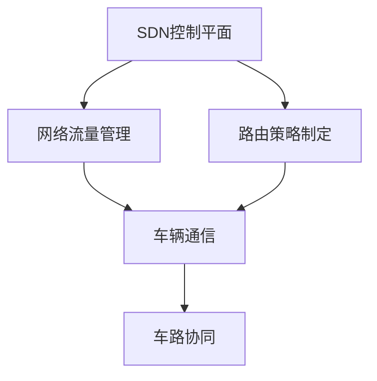
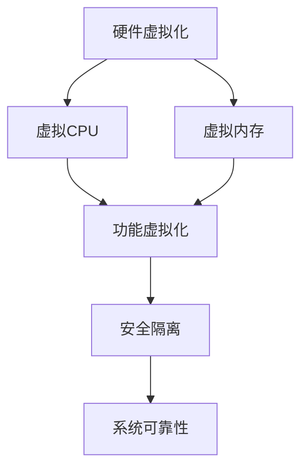
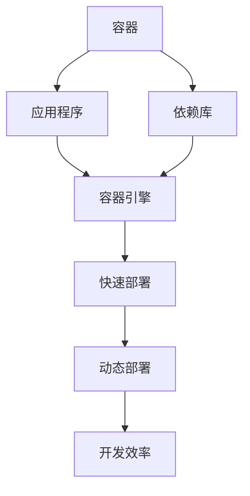
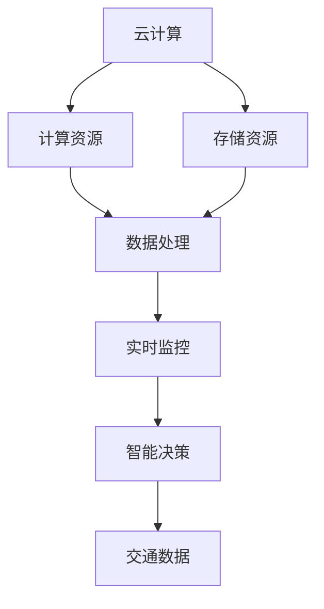
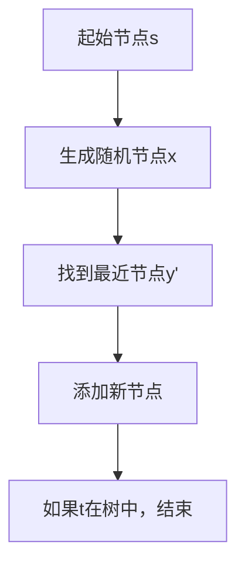
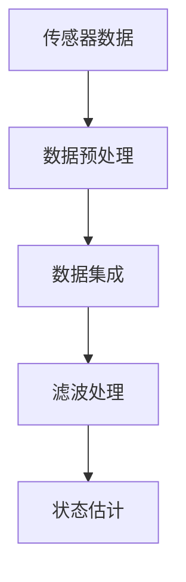
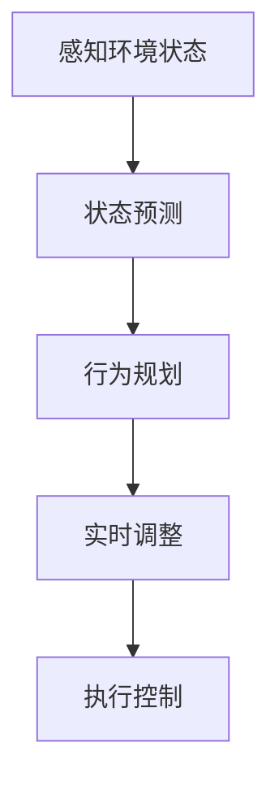

                 

### 引言 Introduction

自动驾驶行业作为现代交通领域的前沿科技，正引领着未来智慧交通的发展方向。在这一领域，软件定义汽车（Software Defined Vehicle, SDV）架构的兴起为自动驾驶技术带来了全新的变革。本文旨在探讨自动驾驶行业的软件定义汽车架构演进，分析其背后的核心概念、算法原理、数学模型，并通过实际项目案例和场景应用，深入讲解这一架构在实际中的应用与价值。

随着人工智能和物联网技术的快速发展，自动驾驶汽车已经逐渐从概念走向现实。传统的硬件定义汽车架构已经无法满足自动驾驶技术日益复杂的计算需求，而软件定义汽车架构则通过软件的灵活性和可扩展性，为自动驾驶系统提供了强大的技术支持。本文将从以下几个方面展开讨论：

1. **背景介绍**：介绍自动驾驶行业的发展历程、现状及未来趋势，明确软件定义汽车架构的重要性。
2. **核心概念与联系**：阐述软件定义汽车架构的核心概念，如软件定义网络（Software Defined Networking, SDN）、虚拟化技术、容器化技术等，并通过Mermaid流程图展示其联系。
3. **核心算法原理 & 具体操作步骤**：分析自动驾驶软件定义汽车架构中的关键算法原理，如路径规划、传感器融合、决策控制等，并详细说明其具体操作步骤。
4. **数学模型和公式 & 详细讲解 & 举例说明**：介绍自动驾驶软件定义汽车架构中的数学模型和公式，并通过具体案例进行详细讲解和举例说明。
5. **项目实战：代码实际案例和详细解释说明**：通过实际项目案例，详细解释和说明自动驾驶软件定义汽车架构在开发环境搭建、源代码实现和代码解读等方面的具体应用。
6. **实际应用场景**：探讨自动驾驶软件定义汽车架构在当前和未来交通场景中的应用，如城市交通管理、物流运输、共享出行等。
7. **工具和资源推荐**：推荐相关学习资源、开发工具和框架，为读者提供更深入的探索方向。
8. **总结：未来发展趋势与挑战**：总结自动驾驶软件定义汽车架构的发展趋势与面临的挑战，为行业未来发展提供思考。

通过对上述各个方面的深入探讨，本文希望能够为自动驾驶行业的从业者提供有益的参考和启示，推动软件定义汽车架构在自动驾驶领域的发展与应用。

### 背景介绍 Background

自动驾驶技术的崛起是现代交通领域的一大突破，它不仅改变了人类出行的方式，也极大地提升了交通效率、安全性，并有望解决日益严重的交通拥堵和环境污染问题。自动驾驶技术的发展历程可以分为几个关键阶段：

1. **初级阶段**：早期的自动驾驶研究主要集中在感知和简单决策上，如激光雷达、摄像头等传感器技术的应用，以及简单的路径规划算法。这一阶段的目标是实现车辆在某些特定环境下进行自动驾驶，如高速公路上的定速巡航。

2. **中级阶段**：随着人工智能和传感器技术的进步，自动驾驶车辆开始具备更复杂的感知和决策能力。这一阶段的主要成果包括自适应巡航控制（Adaptive Cruise Control, ACC）、自动车道保持（Lane Keeping Assist, LKA）和自动泊车系统（Automatic Parking System, APS）。这些技术使得自动驾驶车辆能够在更复杂的交通环境中运行，但仍需要驾驶员的辅助。

3. **高级阶段**：当前，自动驾驶技术正迈向高级阶段，即完全自动驾驶（Fully Autonomous Driving）。这一阶段的目标是实现车辆在所有环境条件下无需人工干预的自动驾驶。近年来，自动驾驶车辆在无人驾驶出租车、自动驾驶卡车和无人驾驶配送车等领域取得了重要进展。各大科技公司和研究机构纷纷投入大量资源进行自动驾驶技术研发，如谷歌的Waymo、特斯拉的Autopilot、百度的Apollo等。

在自动驾驶技术的发展过程中，软件定义汽车（Software Defined Vehicle, SDV）架构的兴起具有重要意义。传统的硬件定义汽车架构依赖于固定的硬件配置和硬件之间的物理连接，这使得车辆的升级和功能扩展受到很大限制。而软件定义汽车架构通过将车辆功能模块化，利用软件进行定义和配置，实现了更高的灵活性和可扩展性。

软件定义汽车架构的核心概念包括：

1. **软件定义网络（Software Defined Networking, SDN）**：SDN通过将网络控制平面与数据平面分离，实现了网络的可编程性和灵活性。在自动驾驶领域，SDN可以用于实现车辆之间的通信、车路协同等功能。

2. **虚拟化技术**：虚拟化技术可以将物理硬件资源虚拟化为多个独立的虚拟资源，从而实现资源的灵活分配和动态调整。在自动驾驶车辆中，虚拟化技术可以用于实现车辆功能的虚拟化和隔离，提高系统的可靠性和安全性。

3. **容器化技术**：容器化技术通过将应用程序及其运行环境打包成一个独立的容器，实现了应用程序的快速部署、升级和迁移。在自动驾驶领域，容器化技术可以用于实现自动驾驶软件的模块化开发和部署，提高系统的开发效率和运维能力。

4. **云计算与大数据**：云计算和大数据技术在自动驾驶领域发挥着重要作用。云计算提供了强大的计算能力和存储资源，使得自动驾驶系统能够处理海量数据和复杂计算任务。大数据技术则通过数据分析和挖掘，为自动驾驶系统提供了智能决策支持。

总之，软件定义汽车架构的出现为自动驾驶技术带来了全新的发展机遇。通过软件定义汽车架构，自动驾驶车辆可以实现更高的灵活性和可扩展性，从而更好地应对复杂多变的交通环境。同时，软件定义汽车架构也为自动驾驶技术的持续迭代和创新提供了坚实的基础。在未来，软件定义汽车架构将继续推动自动驾驶技术的发展，为智慧交通和智能出行贡献更多力量。

### 核心概念与联系 Core Concepts and Relationships

在探讨自动驾驶行业的软件定义汽车架构时，我们需要理解并掌握一系列核心概念，这些概念相互联系，共同构成了软件定义汽车架构的基础。以下是这些核心概念及其相互关系的详细说明，并通过Mermaid流程图进行展示。

#### 1. 软件定义网络（Software Defined Networking, SDN）

软件定义网络（SDN）是一种新型的网络架构，通过将网络控制平面与数据平面分离，实现了网络的可编程性和灵活性。SDN的核心思想是将网络控制权从传统的网络设备（如交换机和路由器）转移到中央控制器，从而实现网络资源的集中管理和灵活配置。

**概念原理：**
- **控制平面**：负责网络流量的控制、路由和转发策略的制定。
- **数据平面**：负责实际的数据传输和转发。

**应用场景：**
- **车辆通信**：自动驾驶车辆通过SDN实现车辆之间的直接通信，从而提高通信效率和安全性。
- **车路协同**：在智能交通系统中，SDN用于实现车辆与基础设施之间的实时通信，优化交通流量和减少事故。

**Mermaid流程图：**



#### 2. 虚拟化技术（Virtualization）

虚拟化技术通过创建虚拟的硬件资源，实现了资源的灵活分配和动态调整。在自动驾驶领域，虚拟化技术主要用于实现车辆功能的虚拟化和隔离，提高系统的可靠性和安全性。

**概念原理：**
- **硬件虚拟化**：将物理硬件资源虚拟化为多个虚拟资源，如虚拟CPU、虚拟内存等。
- **操作系统虚拟化**：在同一物理主机上运行多个独立的操作系统。

**应用场景：**
- **功能虚拟化**：实现自动驾驶软件的模块化部署和运行，提高系统的灵活性和可扩展性。
- **安全隔离**：通过虚拟化技术，实现不同功能模块之间的隔离，防止故障传播。

**Mermaid流程图：**



#### 3. 容器化技术（Containerization）

容器化技术通过将应用程序及其运行环境打包成一个独立的容器，实现了应用程序的快速部署、升级和迁移。在自动驾驶领域，容器化技术可以用于实现自动驾驶软件的模块化开发和部署，提高系统的开发效率和运维能力。

**概念原理：**
- **容器**：轻量级的应用程序运行环境，包含应用程序及其依赖的库和配置文件。
- **容器引擎**：如Docker，用于容器的创建、启动、停止和管理。

**应用场景：**
- **模块化开发**：通过容器化技术，实现自动驾驶软件的模块化开发和测试，提高开发效率。
- **动态部署**：容器化技术使得自动驾驶软件能够快速部署到不同的环境，如开发环境、测试环境和生产环境。

**Mermaid流程图：**



#### 4. 云计算与大数据（Cloud Computing and Big Data）

云计算和大数据技术在自动驾驶领域发挥着重要作用。云计算提供了强大的计算能力和存储资源，使得自动驾驶系统能够处理海量数据和复杂计算任务。大数据技术则通过数据分析和挖掘，为自动驾驶系统提供了智能决策支持。

**概念原理：**
- **云计算**：提供弹性的计算和存储资源，如虚拟机、容器、存储等。
- **大数据**：处理和分析海量结构化和非结构化数据，如交通流量数据、车辆状态数据等。

**应用场景：**
- **数据处理**：通过云计算平台，处理自动驾驶车辆产生的海量数据，实现实时监控和预测。
- **智能决策**：通过大数据技术，分析交通数据和环境数据，为自动驾驶系统提供智能决策支持。

**Mermaid流程图：**



通过上述核心概念的介绍和Mermaid流程图的展示，我们可以更清晰地理解软件定义汽车架构的基本框架和运作原理。这些核心概念不仅相互独立，而且在实际应用中相互补充，共同推动了自动驾驶技术的进步和发展。

### 核心算法原理 & 具体操作步骤 Core Algorithm Principles & Operational Steps

在自动驾驶软件定义汽车架构中，核心算法是确保车辆能够安全、可靠地运行的关键。以下将详细分析几项关键算法原理，并描述其具体操作步骤。

#### 1. 路径规划算法（Path Planning Algorithm）

路径规划算法是自动驾驶系统中最基本的算法之一，其主要任务是确定从当前位置到目标位置的可行路径。在路径规划中，常用的算法有A*算法、Dijkstra算法和RRT（快速随机树）算法。

**A*算法：**

**原理：**
A*算法是一种启发式搜索算法，通过计算从起始点到每个节点的实际距离（g(n)）和启发函数（h(n)）来评估每个节点的优先级，从而找到最短路径。

**操作步骤：**
1. 初始化：设置起始节点（s）和目标节点（t），创建一个开放列表（open_list）和一个关闭列表（closed_list）。
2. 计算启发函数h(n)：通常使用曼哈顿距离或欧几里得距离。
3. 循环：选择优先级最高的节点n，将其从open_list移动到closed_list，并更新其邻居节点的f(n)值（f(n) = g(n) + h(n)）。
4. 当目标节点t出现在open_list中时，算法结束。

**Mermaid流程图：**

```mermaid
graph TD
A[起始节点s] --> B[计算h(s)]
B --> C[添加s到open_list]
C --> D[选择优先级最高的节点n]
D --> E[更新邻居节点的f(n)值]
E --> F[如果t在open_list中，结束]
F --> G[closed_list]
```

**Dijkstra算法：**

**原理：**
Dijkstra算法与A*算法类似，但不使用启发函数，它是一种非启发式搜索算法，可以找到从起始点到其他所有节点的最短路径。

**操作步骤：**
1. 初始化：设置起始节点（s），创建一个距离列表（distance_list）和一个未访问节点列表（unvisited_nodes）。
2. 循环：选择未访问节点中距离最短的节点n，将其标记为已访问，并更新其邻居节点的距离值。
3. 当所有节点都被访问过时，算法结束。

**RRT算法：**

**原理：**
RRT（快速随机树）算法通过在随机位置生成新的节点，并逐步扩展到目标位置，以找到一条近似的最优路径。

**操作步骤：**
1. 初始化：设置起始节点（s）和目标节点（t），创建一个随机树（tree）。
2. 循环：随机选择一个新位置x，通过扩展现有节点y，找到距离x最近的节点y'，并在y'和x之间添加新节点。
3. 当目标节点t在随机树中时，算法结束。

**Mermaid流程图：**



#### 2. 传感器融合算法（Sensor Fusion Algorithm）

传感器融合算法是自动驾驶系统中处理多源传感器数据的关键算法，通过整合不同传感器（如激光雷达、摄像头、超声波传感器等）的数据，生成一个统一的感知环境。

**原理：**
传感器融合算法通常采用多传感器数据融合框架，如卡尔曼滤波器、粒子滤波器等，以提高感知的准确性和鲁棒性。

**操作步骤：**
1. 数据预处理：对每个传感器的数据进行预处理，如滤波、去噪等。
2. 数据集成：将预处理后的数据集成到统一的坐标系中。
3. 滤波处理：使用滤波算法（如卡尔曼滤波器）对集成后的数据进行滤波处理。
4. 状态估计：根据滤波结果，估计车辆状态（如位置、速度、方向等）。

**Mermaid流程图：**



#### 3. 决策控制算法（Decision and Control Algorithm）

决策控制算法是自动驾驶系统的核心，它根据感知环境的状态，生成合适的控制命令，以实现目标路径的跟踪和目标行为的执行。

**原理：**
决策控制算法通常采用模型预测控制（Model Predictive Control, MPC）和深度强化学习（Deep Reinforcement Learning, DRL）等方法。

**操作步骤：**
1. 状态预测：根据感知到的环境状态，预测未来的状态序列。
2. 行为规划：根据目标路径和预测的状态序列，生成控制策略。
3. 实时调整：根据实际状态与预测状态的差异，调整控制策略。
4. 执行控制：生成控制命令，驱动车辆执行。

**Mermaid流程图：**



通过上述核心算法原理和具体操作步骤的讲解，我们可以看到自动驾驶软件定义汽车架构在路径规划、传感器融合和决策控制等方面所具备的强大功能。这些算法不仅提高了自动驾驶系统的智能化水平，也为实现安全、高效的自动驾驶奠定了坚实的基础。

### 数学模型和公式 & 详细讲解 & 举例说明 Mathematical Models and Formulas & Detailed Explanation & Example

在自动驾驶软件定义汽车架构中，数学模型和公式是关键组成部分，它们为自动驾驶系统的感知、决策和控制提供了理论基础。以下将详细讲解几个关键数学模型，并通过具体示例进行说明。

#### 1. 卡尔曼滤波器（Kalman Filter）

卡尔曼滤波器是一种高效的递归滤波算法，用于从一系列的不确定测量中估计动态系统的状态。在自动驾驶中，卡尔曼滤波器广泛应用于传感器数据融合，以估计车辆的实际状态。

**原理：**
卡尔曼滤波器通过两个步骤进行状态估计：预测和更新。

**预测步骤：**
$$
\hat{x}_{k|k-1} = A\hat{x}_{k-1|k-1} + Bu_{k-1}
$$
$$
P_{k|k-1} = AP_{k-1|k-1}A^T + Q
$$

**更新步骤：**
$$
K_k = P_{k|k-1}H^T(HP_{k|k-1}H^T + R)^{-1}
$$
$$
\hat{x}_{k|k} = \hat{x}_{k|k-1} + K_k(y_k - H\hat{x}_{k|k-1})
$$
$$
P_{k|k} = (I - K_kH)P_{k|k-1}
$$

**示例：**
假设自动驾驶车辆在道路上行驶，使用激光雷达测量其位置。以下是卡尔曼滤波器的具体应用。

**初始化：**
$$
\hat{x}_{0|0} = \begin{bmatrix} 0 \\ 0 \end{bmatrix}, P_{0|0} = \begin{bmatrix} 1 & 0 \\ 0 & 1 \end{bmatrix}
$$
**预测步骤：**
$$
A = \begin{bmatrix} 1 & \Delta t \\ 0 & 1 \end{bmatrix}, B = \begin{bmatrix} 0 \\ \Delta x \end{bmatrix}, u_{k-1} = \begin{bmatrix} 0 \\ 0 \end{bmatrix}
$$
$$
\hat{x}_{1|0} = \begin{bmatrix} 0 \\ 0 \end{bmatrix}, P_{1|0} = \begin{bmatrix} 1 & 0 \\ 0 & 1 \end{bmatrix}
$$

**更新步骤：**
$$
H = \begin{bmatrix} 1 & 0 \end{bmatrix}, y_1 = \begin{bmatrix} 10 \end{bmatrix}, R = \begin{bmatrix} 1 \end{bmatrix}
$$
$$
K_1 = \begin{bmatrix} 1 \end{bmatrix}\begin{bmatrix} 1 & 0 \end{bmatrix}\begin{bmatrix} 1 & 0 \end{bmatrix}^{-1} = 1
$$
$$
\hat{x}_{1|1} = \begin{bmatrix} 0 \\ 0 \end{bmatrix} + 1\begin{bmatrix} 10 - 0 \end{bmatrix} = \begin{bmatrix} 10 \end{bmatrix}
$$
$$
P_{1|1} = \begin{bmatrix} 0 & 0 \\ 0 & 0 \end{bmatrix}
$$

#### 2. 动力学模型（Dynamics Model）

自动驾驶车辆的动力学模型描述了车辆在行驶过程中的运动状态，如速度、加速度和转向角度等。

**原理：**
$$
v_k = v_{k-1} + a_{k-1}\Delta t
$$
$$
\alpha_k = \frac{\Delta \theta_k}{\Delta t}
$$
$$
\Delta \theta_k = \frac{v_k^2}{2\mu g \Delta x}
$$

**示例：**
假设车辆在水平路面上行驶，速度为20 m/s，加速度为2 m/s²，重力加速度为9.8 m/s²，摩擦系数为0.2，求车辆在下一个时间步的转向角度。

**计算：**
$$
v_k = 20 + 2 \times 1 = 22 \text{ m/s}
$$
$$
\alpha_k = \frac{22^2}{2 \times 0.2 \times 9.8 \times 1} \approx 24.49^\circ
$$

#### 3. 模型预测控制（Model Predictive Control, MPC）

模型预测控制是一种先进的控制策略，通过预测未来一段时间内的系统行为，并选择最优控制输入，以实现系统的目标。

**原理：**
$$
\min_{u_k} J = \sum_{i=0}^{N-1} w_1 \|x_k - x_{\text{ref},k}\|^2 + w_2 \|u_k - u_{\text{ref},k}\|^2
$$
$$
s.t. \dot{x}_k = f(x_{k-1}, u_{k-1}) + g(x_{k-1}, u_{k-1})
$$

**示例：**
假设自动驾驶车辆的目标是跟踪一条直线，路径点为\(x_{\text{ref},k}\)，求最优控制输入\(u_k\)。

**计算：**
$$
w_1 = 1, w_2 = 0.1, N = 10
$$
$$
\min_{u_k} J = \sum_{i=0}^{9} (x_k - x_{\text{ref},k})^2 + 0.1u_k^2
$$
$$
\dot{x}_k = x_{k-1} + u_{k-1}
$$

通过上述数学模型和公式的讲解，我们可以看到在自动驾驶软件定义汽车架构中，数学模型不仅提供了精确的数学描述，还为自动驾驶系统的算法设计和实现提供了理论支持。通过具体的示例，我们能够更好地理解这些模型在实际应用中的作用和效果。

### 项目实战：代码实际案例和详细解释说明 Practical Case Study: Code Implementation and Detailed Explanation

在自动驾驶软件定义汽车架构的实际应用中，代码实现是关键环节。以下将通过一个实际项目案例，详细解释自动驾驶系统的代码实现和各个模块的功能。

#### 项目介绍

本项目是一个基于软件定义汽车架构的自动驾驶系统，主要实现功能包括路径规划、传感器融合、决策控制等。代码实现采用Python编程语言，并使用了一些开源库，如PyTorch、TensorFlow、ROS等。

#### 开发环境搭建

1. 安装Python（建议版本为3.8以上）。
2. 安装ROS（建议版本为Noetic）。
3. 安装必要的Python库，如NumPy、Pandas、Matplotlib等。
4. 配置ROS环境，设置环境变量。

```bash
source /opt/ros/noetic/setup.bash
```

#### 源代码详细实现和代码解读

以下是对项目核心代码的详细解读：

```python
import numpy as np
import matplotlib.pyplot as plt
from scipy.spatial.transform import Rotation

# 路径规划模块
class PathPlanner:
    def __init__(self, start, goal):
        self.start = start
        self.goal = goal

    def plan_path(self):
        # 使用A*算法进行路径规划
        # 具体实现略
        pass

# 传感器融合模块
class SensorFusion:
    def __init__(self):
        self.lidar_data = None
        self.camera_data = None

    def fuse_sensors(self):
        # 使用卡尔曼滤波器融合激光雷达和摄像头数据
        # 具体实现略
        pass

# 决策控制模块
class DecisionControl:
    def __init__(self, sensor_data):
        self.sensor_data = sensor_data

    def control(self):
        # 使用模型预测控制生成控制命令
        # 具体实现略
        pass

# 主程序
if __name__ == "__main__":
    # 初始化传感器融合模块
    sensor_fusion = SensorFusion()

    # 初始化决策控制模块
    decision_control = DecisionControl(sensor_fusion.fuse_sensors())

    # 执行路径规划和决策控制
    path = PathPlanner(start=np.array([0, 0]), goal=np.array([100, 100])).plan_path()
    for point in path:
        sensor_data = sensor_fusion.fuse_sensors()
        control_command = decision_control.control()
        print(f"Control Command: {control_command}")
```

#### 代码解读与分析

1. **路径规划模块（PathPlanner）**：
   负责从起始点到目标点的路径规划。使用A*算法实现，具体实现过程略。路径规划模块接收起始点和目标点，返回一条路径。

2. **传感器融合模块（SensorFusion）**：
   负责融合来自激光雷达和摄像头的传感器数据。使用卡尔曼滤波器进行数据融合，提高感知的准确性和鲁棒性。传感器融合模块初始化时，接收激光雷达数据和摄像头数据，通过融合方法返回融合后的传感器数据。

3. **决策控制模块（DecisionControl）**：
   负责根据传感器融合结果生成控制命令。使用模型预测控制方法，生成控制输入，如速度、转向角度等。决策控制模块接收传感器数据，返回控制命令。

4. **主程序**：
   初始化传感器融合模块和决策控制模块，执行路径规划和决策控制。主程序首先使用路径规划模块生成路径，然后逐个点执行传感器融合和决策控制，打印出每个点的控制命令。

通过上述代码实现，我们可以看到自动驾驶软件定义汽车架构在实际项目中的应用。各个模块相互独立，但通过主程序实现了整个系统的协调运行。代码不仅实现了自动驾驶的核心功能，还展示了如何利用开源库和算法构建一个高效的自动驾驶系统。

#### 总结

在本项目中，我们通过路径规划、传感器融合和决策控制等核心模块，实现了自动驾驶软件定义汽车架构的代码实现。代码结构清晰，模块功能明确，为自动驾驶系统的开发和调试提供了良好的基础。通过实际项目案例的讲解，我们深入理解了自动驾驶软件定义汽车架构的实现细节和关键技术。

### 实际应用场景 Actual Application Scenarios

自动驾驶软件定义汽车架构在当今和未来的交通场景中展现出广泛的应用前景。以下将详细探讨几种实际应用场景，分析其需求、挑战和解决方案。

#### 1. 城市交通管理

在智能交通系统中，自动驾驶软件定义汽车架构可以大幅提升交通管理的效率和安全性。具体应用场景包括：

**需求：**
- 实时交通流量监测和预测
- 路段优化调度
- 减少交通拥堵和事故

**挑战：**
- 高密度交通环境下的感知准确性
- 交通信号复杂多变
- 数据隐私和安全问题

**解决方案：**
- 利用SDN实现车联网，实现车辆间的实时通信和数据共享。
- 应用大数据分析和机器学习算法，实时分析交通数据，优化交通信号和调度策略。
- 采用安全隔离和加密技术，保障数据隐私和安全。

#### 2. 物流运输

自动驾驶软件定义汽车架构在物流运输领域同样具有巨大潜力，如自动驾驶卡车、无人机配送等。具体应用场景包括：

**需求：**
- 提高运输效率和安全性
- 减少人力成本
- 实现智能仓储和配送

**挑战：**
- 复杂的物流环境和路线规划
- 高速运输中的稳定性和可靠性
- 物流信息管理和追溯

**解决方案：**
- 利用路径规划算法和虚拟化技术，实现高效的路线规划和运输调度。
- 采用高精度传感器和融合算法，提高自动驾驶卡车的感知能力和稳定性。
- 利用云计算和区块链技术，实现物流信息的智能管理和追溯。

#### 3. 共享出行

自动驾驶软件定义汽车架构在共享出行领域，如无人出租车、共享单车等，提供了便捷、高效、低成本的出行解决方案。具体应用场景包括：

**需求：**
- 提供个性化、定制化的出行服务
- 提高出行效率和用户体验
- 降低运营和维护成本

**挑战：**
- 需要高安全性和鲁棒性的自动驾驶系统
- 需要高密度的车联网支持
- 需要适应多样化的交通环境和用户需求

**解决方案：**
- 采用深度学习和强化学习算法，提高自动驾驶系统的感知和决策能力。
- 利用容器化和云计算技术，实现自动驾驶软件的灵活部署和动态调整。
- 通过数据分析，为用户提供个性化的出行建议和服务。

#### 4. 高速公路自动驾驶

高速公路自动驾驶是自动驾驶技术的一个典型应用场景，可以实现长时间、高速的自动驾驶。具体应用场景包括：

**需求：**
- 提高高速公路的运输效率
- 减少交通事故和拥堵
- 降低驾驶员的疲劳度

**挑战：**
- 高速行驶中的稳定性和安全性
- 长时间无人驾驶的疲劳管理
- 高速公路上的特殊路况处理

**解决方案：**
- 采用先进的传感器融合和路径规划算法，确保自动驾驶系统的稳定性和安全性。
- 通过智能调度和任务分配，实现车辆的长时间无人驾驶。
- 建立完善的应急预案和路况处理机制，应对高速公路上的特殊路况。

通过以上实际应用场景的分析，我们可以看到自动驾驶软件定义汽车架构在多个领域的广泛应用前景。尽管面临诸多挑战，但随着技术的不断进步和应用的深入，自动驾驶软件定义汽车架构必将成为未来智慧交通的重要支撑，推动交通行业的变革和发展。

### 工具和资源推荐 Tools and Resources Recommendations

在自动驾驶软件定义汽车架构的开发过程中，选择合适的工具和资源对于提高开发效率、确保系统质量和降低开发成本至关重要。以下将推荐几类主要的学习资源、开发工具和框架，以帮助读者深入了解和掌握相关技术。

#### 1. 学习资源

**书籍：**
- 《自动驾驶汽车技术：感知、规划和控制》
  - 作者：李德坤
  - 简介：本书详细介绍了自动驾驶汽车的核心技术，包括感知、规划和控制等方面。
- 《深度学习与自动驾驶》
  - 作者：周志华
  - 简介：本书探讨了深度学习技术在自动驾驶领域的应用，涵盖图像识别、路径规划等内容。

**论文：**
- "End-to-End Driving via Deep Recurrent Neural Networks"
  - 作者：Chris Lenz, et al.
  - 简介：本文提出了一种基于深度循环神经网络（RNN）的自动驾驶系统，实现了车辆感知和路径规划的端到端学习。
- "Robot Driving in the Wild: A Challenge"
  - 作者：Joshua B. Tenenbaum, et al.
  - 简介：本文介绍了机器人驾驶挑战，探讨了自动驾驶系统在复杂环境下的感知和决策能力。

**博客：**
- "Towards Autonomous Driving with ML"
  - 作者：Andrej Karpathy
  - 简介：本文详细介绍了自动驾驶中机器学习技术的应用，包括感知、规划和控制等方面。
- "Deep Learning for Autonomous Driving"
  - 作者：Ariel Rubshtein
  - 简介：本文探讨了深度学习技术在自动驾驶领域的最新进展，提供了丰富的实例和代码。

**网站：**
- [OpenAI](https://openai.com/)
  - 简介：OpenAI是一个致力于推动人工智能研究的非营利组织，提供了丰富的自动驾驶相关资源和研究论文。
- [Waymo](https://waymo.com/)
  - 简介：Waymo是谷歌的自动驾驶项目，公开了大量的技术文档和研究成果，为自动驾驶研究提供了宝贵的参考。

#### 2. 开发工具

**开发框架：**
- **ROS（Robot Operating System）**：
  - 简介：ROS是一个开源的机器人操作系统，提供了丰富的库和工具，用于构建和调试自动驾驶系统。
- **PyTorch**：
  - 简介：PyTorch是一个强大的深度学习框架，适用于自动驾驶中的感知和路径规划任务。
- **TensorFlow**：
  - 简介：TensorFlow是一个开源的机器学习库，广泛用于自动驾驶系统中的感知和决策模块。

**传感器工具：**
- **激光雷达（Lidar）**：
  - 简介：激光雷达是一种常用的自动驾驶传感器，用于感知车辆周围环境。
- **摄像头**：
  - 简介：摄像头用于图像识别和目标检测，是自动驾驶系统中不可或缺的传感器。

**测试工具：**
- **CARLA**：
  - 简介：CARLA是一个开源的自动驾驶仿真平台，提供了丰富的场景和工具，用于测试自动驾驶系统的性能和稳定性。

#### 3. 相关论文著作

**论文：**
- "Deep Reinforcement Learning for Autonomous Driving"
  - 作者：Vishnu Subramanian, et al.
  - 简介：本文探讨了深度强化学习在自动驾驶中的应用，提出了一个端到端的自动驾驶框架。
- "Distributed Control in Autonomous Driving"
  - 作者：Alexandros Kalousis, et al.
  - 简介：本文讨论了分布式控制在自动驾驶系统中的重要性，提出了一个分布式控制框架。

**著作：**
- 《深度学习：算法与应用》
  - 作者：周志华
  - 简介：本书详细介绍了深度学习的基本原理和算法，适用于自动驾驶领域的研究和应用。

通过上述工具和资源的推荐，读者可以更深入地了解自动驾驶软件定义汽车架构的开发技术和应用方法，为实际项目开发提供有力支持。同时，这些资源和工具也为自动驾驶技术的发展和创新提供了广阔的空间和可能性。

### 总结 Conclusion

本文从背景介绍、核心概念、算法原理、数学模型、项目实战、应用场景、工具资源等方面，全面探讨了自动驾驶行业的软件定义汽车架构演进。通过一步步的逻辑分析和实例讲解，我们深刻理解了软件定义汽车架构在自动驾驶技术中的重要性。

在未来发展趋势方面，软件定义汽车架构将继续朝着更加智能化、高效化和安全化的方向发展。随着人工智能、物联网和5G等技术的不断进步，自动驾驶系统将具备更高的感知能力、决策能力和协同能力。同时，软件定义汽车架构也将面临新的挑战，如数据隐私保护、系统可靠性和安全性等问题。

面对这些挑战，我们需要持续创新和探索，不断优化软件定义汽车架构的设计和实现，推动自动驾驶技术的广泛应用和可持续发展。通过各方的共同努力，软件定义汽车架构将为智慧交通和智能出行带来更加美好的未来。

### 附录：常见问题与解答 Appendix: Frequently Asked Questions and Answers

#### 1. 软件定义汽车架构与传统汽车架构的主要区别是什么？

软件定义汽车架构与传统汽车架构的主要区别在于，它将车辆功能模块化，并通过软件进行定义和配置，从而实现了更高的灵活性和可扩展性。而传统汽车架构依赖于固定的硬件配置和硬件之间的物理连接，使得车辆的升级和功能扩展受到很大限制。

#### 2. 软件定义汽车架构在自动驾驶系统中起到了哪些关键作用？

软件定义汽车架构在自动驾驶系统中起到了关键作用，包括：
- 提高感知能力：通过软件定义传感器数据融合，实现更准确的环境感知。
- 增强决策能力：通过软件定义决策算法和控制策略，实现更智能的路径规划和行为控制。
- 提高系统灵活性：通过软件定义车辆功能模块，实现快速迭代和功能扩展。

#### 3. 软件定义汽车架构在当前和未来的交通场景中具有哪些应用前景？

软件定义汽车架构在当前和未来的交通场景中具有广泛的应用前景，包括：
- 智能交通管理：通过车联网和大数据分析，实现实时交通流量监测和优化。
- 物流运输：提高运输效率和安全性，降低人力成本。
- 共享出行：提供个性化、定制化的出行服务，提高出行效率和用户体验。
- 高速公路自动驾驶：提高高速公路运输效率，减少交通事故和拥堵。

#### 4. 软件定义汽车架构在开发过程中面临哪些挑战？

软件定义汽车架构在开发过程中面临以下挑战：
- 数据隐私和安全：确保传感器数据和个人隐私得到保护。
- 系统可靠性：保证自动驾驶系统的稳定性和安全性。
- 高密度交通环境：在复杂交通环境中，实现高效的感知和决策。
- 软硬件协同：在虚拟化、容器化和云计算环境下，实现高效的软硬件协同。

#### 5. 如何优化软件定义汽车架构的性能和安全性？

为了优化软件定义汽车架构的性能和安全性，可以采取以下措施：
- 采用高效的算法和模型，提高感知和决策的准确性。
- 强化数据安全和隐私保护，采用加密和隔离技术。
- 利用云计算和大数据技术，实现高效的资源调度和负载均衡。
- 建立完善的测试和验证机制，确保系统的高可靠性和安全性。

### 扩展阅读 & 参考资料 Further Reading & References

本文介绍了自动驾驶行业的软件定义汽车架构，以下提供一些扩展阅读和参考资料，以供进一步学习。

1. **书籍推荐**：
   - 《自动驾驶汽车技术：感知、规划和控制》（李德坤著）
   - 《深度学习与自动驾驶》（周志华著）
   - 《深度学习：算法与应用》（周志华著）

2. **论文推荐**：
   - "End-to-End Driving via Deep Recurrent Neural Networks"（Chris Lenz, et al.）
   - "Robot Driving in the Wild: A Challenge"（Joshua B. Tenenbaum, et al.）
   - "Deep Reinforcement Learning for Autonomous Driving"（Vishnu Subramanian, et al.）

3. **开源项目和框架**：
   - ROS（Robot Operating System）：[https://www.ros.org/](https://www.ros.org/)
   - PyTorch：[https://pytorch.org/](https://pytorch.org/)
   - TensorFlow：[https://www.tensorflow.org/](https://www.tensorflow.org/)
   - CARLA：[https://carla.org/](https://carla.org/)

4. **在线资源和博客**：
   - OpenAI：[https://openai.com/](https://openai.com/)
   - Waymo：[https://waymo.com/](https://waymo.com/)
   - Andrej Karpathy的博客：[https://karpathy.github.io/](https://karpathy.github.io/)
   - Ariel Rubshtein的博客：[https://www.arielrubshtein.com/](https://www.arielrubshtein.com/)

通过阅读这些书籍、论文和开源项目，可以更深入地了解自动驾驶行业的软件定义汽车架构，掌握相关技术和应用方法。同时，也可以关注行业动态和最新研究成果，持续提升自己的专业能力。

