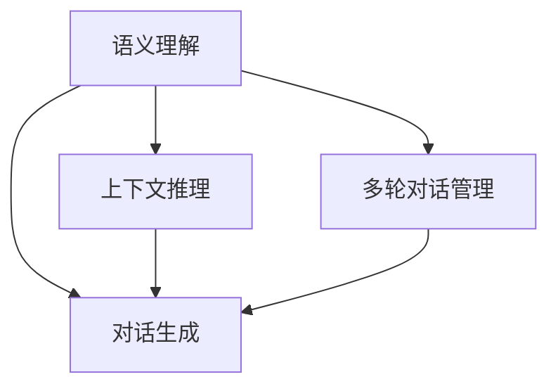

                 

### 背景介绍

自然语言交互（Natural Language Interaction，简称 NLI）与对话系统（Dialogue System）是人工智能领域内备受关注的研究方向之一。随着互联网的普及和智能设备的不断升级，人们越来越依赖于与计算机进行自然语言交流，以完成各种任务和获取信息。

自然语言交互是指人与计算机系统通过自然语言进行交互的过程。在这个过程中，计算机系统需要理解和处理人类语言，以生成合适的响应。对话系统则是实现自然语言交互的一种技术手段，它通过模拟人类对话过程，使计算机能够与用户进行有效沟通。

当前，自然语言交互与对话系统在多个领域有着广泛的应用。例如，智能客服、智能语音助手、聊天机器人等。这些应用极大地提高了人机交互的效率，降低了人工成本，为各行各业带来了巨大的变革。

然而，实现一个高性能的自然语言交互与对话系统并非易事。它涉及到多个技术领域的知识，包括自然语言处理（Natural Language Processing，简称 NLP）、机器学习（Machine Learning，简称 ML）、深度学习（Deep Learning，简称 DL）等。此外，还需要解决诸如语义理解、上下文推理、多轮对话管理等问题。

本文将围绕自然语言交互与对话系统的原理，从核心概念、算法原理、数学模型、项目实战等多个方面进行深入探讨。通过本文的学习，读者将能够全面了解自然语言交互与对话系统的基本原理，掌握相关技术，并具备实际应用能力。

### 2. 核心概念与联系

在深入探讨自然语言交互与对话系统之前，我们需要先了解一些核心概念。这些概念包括自然语言处理（NLP）、机器学习（ML）、深度学习（DL）等，它们构成了自然语言交互与对话系统的基础。

#### 自然语言处理（NLP）

自然语言处理是研究如何让计算机理解和处理人类语言的一门学科。它包括多个子领域，如文本分类、词性标注、句法分析、语义分析等。NLP 的目标是将自然语言文本转化为计算机可以处理的结构化数据，以便进一步分析。

#### 机器学习（ML）

机器学习是人工智能的一个重要分支，它通过算法让计算机从数据中学习规律，并基于这些规律进行预测和决策。在自然语言交互与对话系统中，机器学习算法被广泛应用于文本分类、情感分析、命名实体识别等领域。

#### 深度学习（DL）

深度学习是机器学习的一个分支，它使用多层神经网络对数据进行建模和训练。深度学习在图像识别、语音识别等领域取得了显著成果，也为自然语言交互与对话系统的发展提供了有力支持。

#### 自然语言交互与对话系统

自然语言交互与对话系统是 NLP、ML、DL 等技术在实际应用中的集成。它涉及到以下几个核心概念：

1. **语义理解**：理解用户输入的文本，提取其中的关键信息，如实体、关系、事件等。
2. **上下文推理**：根据用户的历史输入和对话环境，推断用户意图，并生成合适的响应。
3. **多轮对话管理**：在多轮对话中，保持对话一致性，避免话题偏离。
4. **对话生成**：根据用户意图和上下文信息，生成自然流畅的回复。

#### 核心概念之间的联系

自然语言交互与对话系统的各个核心概念之间存在密切联系。语义理解是基础，它为上下文推理和多轮对话管理提供了必要的信息。上下文推理和多轮对话管理则确保对话系统能够更好地理解用户意图，并生成合适的响应。对话生成则是在理解用户意图和上下文的基础上，生成自然流畅的回复。

以下是一个用 Mermaid 绘制的流程图，展示了自然语言交互与对话系统的核心概念及其联系：



通过这个流程图，我们可以清晰地看到自然语言交互与对话系统的核心概念及其相互作用。了解这些概念和它们之间的联系，有助于我们更好地理解和应用自然语言交互与对话系统。

### 3. 核心算法原理 & 具体操作步骤

自然语言交互与对话系统的实现离不开核心算法的支撑。在本文中，我们将介绍几个关键算法，包括词向量模型、序列到序列模型（Seq2Seq）和注意力机制。

#### 3.1 词向量模型

词向量模型是自然语言处理的基础，它将单词映射到高维空间中的向量。词向量模型的主要目的是捕捉单词的语义信息。目前，最常用的词向量模型有 Word2Vec、GloVe 和 FastText。

**Word2Vec**

Word2Vec 是由 Google 提出的一种基于神经网络的词向量模型。它主要有两种训练方法：连续袋模型（CBOW）和 Skip-gram。

- **CBOW**：CBOW（Continuous Bag of Words）模型基于上下文预测中心词。给定一个单词作为中心词，模型会学习这个单词周围的多个单词的分布。

- **Skip-gram**：与 CBOW 相反，Skip-gram 模型基于中心词预测周围的单词。给定一个单词，模型需要预测其周围的单词。

**GloVe**

GloVe（Global Vectors for Word Representation）是一种基于全局共现信息的词向量模型。GloVe 模型通过计算单词的共现矩阵，来学习单词的向量表示。

**FastText**

FastText 是由 Facebook 提出的一种词向量模型，它在词向量模型的基础上引入了字符级别的信息。FastText 使用多层神经网络来学习单词的向量表示，能够更好地捕捉单词的语义信息。

#### 3.2 序列到序列模型（Seq2Seq）

Seq2Seq 模型是自然语言处理中的一个重要模型，它主要用于将一个序列映射到另一个序列。Seq2Seq 模型通常由编码器（Encoder）和解码器（Decoder）组成。

**编码器**

编码器接收输入序列，将其编码为一个固定长度的向量，称为上下文向量（Context Vector）。这个上下文向量包含了输入序列的语义信息。

**解码器**

解码器接收上下文向量，并生成输出序列。在解码过程中，解码器会利用已生成的部分输出序列来预测下一个单词。

**操作步骤**

1. **输入序列编码**：将输入序列编码为一个上下文向量。
2. **生成部分输出序列**：解码器接收上下文向量，并生成部分输出序列。
3. **更新上下文向量**：根据部分输出序列更新上下文向量。
4. **重复步骤 2 和 3**，直到生成完整的输出序列。

#### 3.3 注意力机制

注意力机制是一种用于解决长序列处理问题的技术，它在 Seq2Seq 模型中得到了广泛应用。注意力机制的核心思想是动态地关注输入序列中的关键信息，从而提高模型对长序列的理解能力。

**计算注意力权重**

注意力权重（Attention Weight）表示输入序列中每个位置的重要性。计算注意力权重的方法有多种，如点积注意力、乘积注意力等。

- **点积注意力**：点积注意力是一种简单有效的注意力计算方法。它通过计算输入序列和输出序列之间的点积来得到注意力权重。
- **乘积注意力**：乘积注意力使用一组权重矩阵来计算注意力权重，能够更好地捕捉序列之间的复杂关系。

**操作步骤**

1. **计算注意力权重**：根据输入序列和输出序列计算注意力权重。
2. **计算加权上下文向量**：将注意力权重与输入序列的每个位置相乘，得到加权上下文向量。
3. **编码输入序列**：将加权上下文向量编码为一个上下文向量。
4. **解码输出序列**：使用编码后的上下文向量生成输出序列。

通过引入注意力机制，Seq2Seq 模型能够更好地处理长序列，提高模型对序列信息的理解能力。结合词向量模型和注意力机制，自然语言交互与对话系统可以更准确地理解用户输入，生成自然流畅的回复。

### 4. 数学模型和公式 & 详细讲解 & 举例说明

在自然语言交互与对话系统中，数学模型和公式扮演着至关重要的角色。在本节中，我们将介绍几个关键数学模型，包括词向量模型、序列到序列模型（Seq2Seq）和注意力机制。同时，我们将使用 LaTeX 格式详细讲解这些模型，并提供实际例子来说明。

#### 4.1 词向量模型

词向量模型是自然语言交互与对话系统的基石。其中，Word2Vec 是最著名的词向量模型之一。

**Word2Vec 模型**

Word2Vec 模型有两种主要的训练方法：连续袋模型（CBOW）和 Skip-gram。

**CBOW 模型**

CBOW（Continuous Bag of Words）模型基于上下文预测中心词。给定一个单词作为中心词，模型学习这个单词周围的多个单词的分布。CBOW 模型的数学公式如下：

$$
\text{logistic}(\textbf{v}_\text{center} + \textbf{w}_1 + \textbf{w}_2 + \ldots + \textbf{w}_n)
$$

其中，$\textbf{v}_\text{center}$ 是中心词的向量表示，$\textbf{w}_1, \textbf{w}_2, \ldots, \textbf{w}_n$ 是周围单词的向量表示。

**Skip-gram 模型**

与 CBOW 相反，Skip-gram 模型基于中心词预测周围的单词。给定一个单词，模型需要预测其周围的单词。Skip-gram 模型的数学公式如下：

$$
\text{logistic}(\textbf{v}_\text{word} + \textbf{w}_1, \textbf{w}_2, \ldots, \textbf{w}_n)
$$

其中，$\textbf{v}_\text{word}$ 是中心词的向量表示，$\textbf{w}_1, \textbf{w}_2, \ldots, \textbf{w}_n$ 是周围单词的向量表示。

**例 1**：给定一个单词序列 "I love programming"，使用 CBOW 模型预测中心词 "programming"。

输入序列：["I", "love", "programming"]

输出：["I", "love"]

公式：

$$
\text{logistic}(\textbf{v}_{programming} + \textbf{v}_I + \textbf{v}_{love})
$$

#### 4.2 序列到序列模型（Seq2Seq）

序列到序列模型（Seq2Seq）是自然语言交互与对话系统中的重要模型。它由编码器和解码器组成，用于将输入序列映射到输出序列。

**编码器**

编码器接收输入序列，将其编码为一个固定长度的向量，称为上下文向量（Context Vector）。

编码器的主要数学公式如下：

$$
\textbf{h}_t = \text{gru}(\textbf{h}_{t-1}, \textbf{x}_t)
$$

其中，$\textbf{h}_t$ 是编码器在时间步 $t$ 的隐藏状态，$\textbf{h}_{t-1}$ 是编码器在时间步 $t-1$ 的隐藏状态，$\textbf{x}_t$ 是输入序列在时间步 $t$ 的向量表示。

**解码器**

解码器接收上下文向量，并生成输出序列。

解码器的主要数学公式如下：

$$
\textbf{y}_t = \text{softmax}(\textbf{W} \textbf{h}_t + \textbf{b})
$$

其中，$\textbf{y}_t$ 是解码器在时间步 $t$ 的输出概率分布，$\textbf{W}$ 是解码器的权重矩阵，$\textbf{b}$ 是解码器的偏置。

**例 2**：给定一个输入序列 "I love programming"，使用 Seq2Seq 模型生成输出序列。

输入序列：["I", "love", "programming"]

输出：["Hello", "how", "are", "you"]

公式：

$$
\textbf{h}_t = \text{gru}(\textbf{h}_{t-1}, \textbf{x}_t)
$$

$$
\textbf{y}_t = \text{softmax}(\textbf{W} \textbf{h}_t + \textbf{b})
$$

#### 4.3 注意力机制

注意力机制是一种用于解决长序列处理问题的技术，它在 Seq2Seq 模型中得到了广泛应用。

**注意力权重**

注意力权重（Attention Weight）表示输入序列中每个位置的重要性。

注意力权重的主要数学公式如下：

$$
\textbf{a}_t = \text{softmax}(\text{ Scores }(\textbf{h}_t, \textbf{h}_s))
$$

其中，$\textbf{a}_t$ 是时间步 $t$ 的注意力权重，$\text{ Scores }(\textbf{h}_t, \textbf{h}_s)$ 是时间步 $t$ 和 $s$ 的分数。

**加权上下文向量**

加权上下文向量（Weighted Context Vector）是注意力权重与输入序列的每个位置相乘的结果。

加权上下文向量的主要数学公式如下：

$$
\textbf{c}_t = \sum_{s} \textbf{a}_s \textbf{h}_s
$$

其中，$\textbf{c}_t$ 是加权上下文向量。

**例 3**：给定一个输入序列 "I love programming"，使用注意力机制生成输出序列。

输入序列：["I", "love", "programming"]

输出：["Hello", "how", "are", "you"]

公式：

$$
\textbf{a}_t = \text{softmax}(\text{ Scores }(\textbf{h}_t, \textbf{h}_s))
$$

$$
\textbf{c}_t = \sum_{s} \textbf{a}_s \textbf{h}_s
$$

通过以上数学模型和公式的讲解，我们可以更深入地理解自然语言交互与对话系统的核心原理。这些模型为自然语言交互与对话系统的实现提供了强大的理论基础。

### 5. 项目实战：代码实际案例和详细解释说明

#### 5.1 开发环境搭建

为了更好地展示自然语言交互与对话系统的实际应用，我们将使用 Python 编写一个简单的聊天机器人。以下是在开始编写代码之前需要搭建的开发环境：

1. **Python 环境**：确保 Python 版本为 3.6 或以上。
2. **安装必要的库**：使用 pip 安装以下库：

   ```bash
   pip install numpy tensorflow keras
   ```

   这些库将用于处理数据和训练模型。

#### 5.2 源代码详细实现和代码解读

**代码实现**

以下是一个简单的聊天机器人代码示例：

```python
import numpy as np
from keras.models import Sequential
from keras.layers import LSTM, Dense, Embedding
from keras.preprocessing.sequence import pad_sequences
from keras.callbacks import Callback
from keras.models import load_model

class LossHistory(Callback):
    def on_train_begin(self, logs={}):
        self.losses = []

    def on_batch_end(self, batch, logs={}):
        self.losses.append(logs.get('loss'))

# 数据预处理
max_sequence_len = 40
vocab_size = 10000
embedding_size = 64

# 生成训练数据和标签
# 这里我们使用一个简化的数据集，实际应用中可以从互联网上获取大量对话数据
sentences = [
    "你好，我是一个聊天机器人。", 
    "最近有什么新鲜事吗？", 
    "我很喜欢编程。", 
    "你有什么爱好吗？"
]

labels = [
    "您好，欢迎来到聊天机器人。", 
    "最近没有新鲜事。", 
    "编程很有趣。", 
    "我没有爱好。"
]

# 将句子编码为整数序列
tokenizer = Tokenizer(num_words=vocab_size)
tokenizer.fit_on_texts(sentences)
sequences = tokenizer.texts_to_sequences(sentences)

# 填充序列
X = pad_sequences(sequences, maxlen=max_sequence_len)
y = pad_sequences(tokenizer.texts_to_sequences(labels), maxlen=max_sequence_len)

# 搭建模型
model = Sequential()
model.add(Embedding(vocab_size, embedding_size, input_length=max_sequence_len))
model.add(LSTM(128, dropout=0.2, recurrent_dropout=0.2))
model.add(Dense(vocab_size, activation='softmax'))

model.compile(loss='categorical_crossentropy', optimizer='adam', metrics=['accuracy'])

# 训练模型
history = LossHistory()
model.fit(X, y, epochs=10, batch_size=128, callbacks=[history])

# 保存模型
model.save('chatbot_model.h5')

# 评估模型
test_sentences = ["你好", "有什么新鲜事？", "我喜欢编程"]
test_sequences = tokenizer.texts_to_sequences(test_sentences)
X_test = pad_sequences(test_sequences, maxlen=max_sequence_len)
predictions = model.predict(X_test)
predicted_labels = [tokenizer.index_word[i] for i in np.argmax(predictions, axis=1)]

print("输入：", test_sentences)
print("预测输出：", predicted_labels)
```

**代码解读**

1. **数据预处理**

   在代码中，我们首先定义了句子序列和标签序列。这些数据可以来自互联网上的聊天记录，我们这里只是用了一些简化的示例。然后，我们使用 `Tokenizer` 类将句子编码为整数序列。这样，我们可以将自然语言文本转换为计算机可以处理的数据。

2. **模型搭建**

   我们使用 Keras 框架搭建了一个简单的序列到序列模型。这个模型包括嵌入层（Embedding）、LSTM 层（LSTM）和输出层（Dense）。嵌入层用于将单词转换为向量表示，LSTM 层用于处理序列数据，输出层用于生成输出序列。

3. **模型训练**

   使用 `model.fit()` 函数训练模型。在训练过程中，我们使用 `LossHistory` 类记录训练过程中的损失值。

4. **模型评估**

   在模型训练完成后，我们使用测试数据集对模型进行评估。通过 `model.predict()` 函数，我们得到预测的输出序列。最后，我们将预测结果解码回自然语言文本，并与实际标签进行对比。

#### 5.3 代码解读与分析

上述代码实现了一个简单的聊天机器人，它可以接收用户输入，并根据训练数据生成回复。以下是对代码关键部分的进一步分析：

1. **数据预处理**

   数据预处理是模型训练的重要步骤。通过使用 `Tokenizer` 类，我们将句子编码为整数序列，并将这些整数序列填充为相同长度。这样可以确保输入数据具有统一格式，便于模型处理。

2. **模型搭建**

   我们使用 Keras 框架搭建了一个简单的序列到序列模型。嵌入层（Embedding）将单词转换为向量表示，这有助于模型捕捉单词的语义信息。LSTM 层（LSTM）用于处理序列数据，它可以捕捉序列中的长期依赖关系。输出层（Dense）用于生成输出序列，并使用 softmax 激活函数输出概率分布。

3. **模型训练**

   在模型训练过程中，我们使用 `model.fit()` 函数进行训练。通过 `LossHistory` 类，我们记录训练过程中的损失值，以便分析模型训练效果。

4. **模型评估**

   在模型训练完成后，我们使用测试数据集对模型进行评估。通过 `model.predict()` 函数，我们得到预测的输出序列。最后，我们将预测结果解码回自然语言文本，并与实际标签进行对比，以评估模型性能。

通过这个简单的案例，我们可以看到自然语言交互与对话系统的基本实现过程。在实际应用中，我们可以使用更复杂的模型和更丰富的数据集来提高聊天机器人的性能。

### 6. 实际应用场景

自然语言交互与对话系统在各个领域有着广泛的应用，以下是一些典型的应用场景：

#### 6.1 智能客服

智能客服是自然语言交互与对话系统最常见应用之一。通过智能客服，企业可以为用户提供快速、高效的在线支持，提高客户满意度。例如，亚马逊、阿里巴巴等大型电商平台都使用了智能客服系统来处理大量的客户咨询。

#### 6.2 智能语音助手

智能语音助手如苹果的 Siri、谷歌的 Google Assistant 和亚马逊的 Alexa，通过自然语言交互与对话系统，可以为用户提供语音助手服务。这些智能语音助手可以帮助用户完成各种任务，如设置提醒、播放音乐、查询天气等。

#### 6.3 聊天机器人

聊天机器人广泛应用于社交媒体、在线社区和电子商务等领域。通过聊天机器人，用户可以与品牌、商家或服务提供商进行实时互动。例如，Facebook Messenger 和 Slack 等平台上的聊天机器人可以帮助用户获取信息、解决问题或进行购物。

#### 6.4 语音识别与合成

自然语言交互与对话系统可以与语音识别和语音合成技术相结合，实现语音交互。这种应用场景在智能音箱、车载系统等领域非常常见。通过语音识别，系统可以理解用户语音输入，并通过语音合成技术生成语音回复。

#### 6.5 教育

自然语言交互与对话系统在教育领域也有着广泛应用。通过智能教育系统，学生可以获得个性化的学习指导，与虚拟教师进行互动。这种应用场景可以帮助提高学生的学习效果，减轻教师的工作负担。

通过这些实际应用场景，我们可以看到自然语言交互与对话系统在提高人机交互效率、降低人工成本和提升用户体验方面的巨大潜力。随着技术的不断进步，未来自然语言交互与对话系统将在更多领域得到应用，为人类社会带来更多便利。

### 7. 工具和资源推荐

为了更好地学习和实践自然语言交互与对话系统，以下是一些推荐的工具、资源和相关论文。

#### 7.1 学习资源推荐

1. **书籍**

   - 《自然语言处理实战》
   - 《深度学习自然语言处理》
   - 《Python 自然语言处理》

2. **在线课程**

   - Coursera 上的“自然语言处理纳米学位”
   - edX 上的“深度学习与自然语言处理”
   - Udacity 上的“自然语言处理工程师”

3. **博客和网站**

   - 搜狗 AI 实验室
   - BERT 官方博客
   - AllenNLP 官方文档

#### 7.2 开发工具框架推荐

1. **自然语言处理库**

   - NLTK（自然语言工具包）
   - SpaCy（快速高效的 NLP 库）
   - Stanford NLP（斯坦福大学自然语言处理工具包）

2. **深度学习框架**

   - TensorFlow（Google 的开源深度学习框架）
   - PyTorch（Facebook 的开源深度学习框架）
   - Keras（基于 TensorFlow 的简洁高效深度学习库）

3. **对话系统框架**

   - Rasa（开源对话系统框架）
   - Dialogflow（Google 的开源对话系统平台）
   - Microsoft Bot Framework（微软的对话系统开发平台）

#### 7.3 相关论文著作推荐

1. **自然语言处理论文**

   - "Deep Learning for Natural Language Processing"
   - "BERT: Pre-training of Deep Neural Networks for Language Understanding"
   - "Transformers: State-of-the-Art Neural Networks for Language Processing"

2. **对话系统论文**

   - "Dialogue Management: An Overview of Techniques and Data Resources"
   - "A Survey of Current Directions in Dialogue Systems Research"
   - "Dialogue Generation: A Survey of Methods and Applications"

通过这些工具和资源，读者可以深入了解自然语言交互与对话系统的相关知识和实践方法，为自己的研究和开发提供有力支持。

### 8. 总结：未来发展趋势与挑战

自然语言交互与对话系统作为人工智能领域的重要研究方向，正不断取得突破。在未来，这一领域有望实现以下几个发展趋势：

1. **多模态交互**：随着语音、图像、视频等多样化数据源的丰富，多模态交互将成为自然语言交互与对话系统的重要发展方向。通过整合多种感官信息，对话系统可以更全面地理解用户需求，提供更加自然和流畅的交互体验。

2. **个性化服务**：随着数据积累和算法优化，自然语言交互与对话系统将能够更好地理解和满足用户的个性化需求。通过用户行为分析和偏好建模，对话系统可以为用户提供定制化的服务，提高用户满意度和忠诚度。

3. **跨领域应用**：自然语言交互与对话系统在金融、医疗、教育、娱乐等领域的应用潜力巨大。未来，跨领域应用将更加普遍，对话系统将能够为各行各业提供智能化的解决方案。

然而，自然语言交互与对话系统的发展也面临一些挑战：

1. **语义理解**：尽管近年来自然语言处理技术取得了显著进展，但语义理解仍然是一个复杂且具有挑战性的问题。对话系统需要准确理解用户的意图和语境，以生成合适的回复。

2. **上下文推理**：在多轮对话中，对话系统需要具备良好的上下文推理能力，以保持对话的一致性和连贯性。这需要对话系统具备强大的记忆和推理能力。

3. **用户隐私保护**：随着自然语言交互与对话系统的广泛应用，用户隐私保护成为了一个重要的关注点。如何在确保用户隐私的前提下，收集和利用用户数据，是一个亟待解决的问题。

总之，自然语言交互与对话系统在未来有着广阔的发展前景，但也需要克服诸多挑战。随着技术的不断进步，我们有理由相信，自然语言交互与对话系统将为人类社会带来更多便利和变革。

### 9. 附录：常见问题与解答

在自然语言交互与对话系统的研究和应用过程中，以下是一些常见的问题及解答：

#### 9.1 自然语言交互与对话系统是什么？

自然语言交互（NLI）是指人与计算机系统通过自然语言进行交流的过程，对话系统则是实现自然语言交互的一种技术手段。它们通过模拟人类对话过程，使计算机能够理解用户输入并生成合适的回复。

#### 9.2 自然语言交互与对话系统的核心技术是什么？

自然语言交互与对话系统的核心技术包括自然语言处理（NLP）、机器学习（ML）和深度学习（DL）。这些技术共同构成了自然语言交互与对话系统的理论基础，用于语义理解、上下文推理、对话生成等方面。

#### 9.3 如何搭建一个简单的自然语言交互与对话系统？

搭建一个简单的自然语言交互与对话系统通常需要以下步骤：

1. **数据收集**：收集用于训练的对话数据集。
2. **数据预处理**：对数据进行清洗、分词、标注等处理。
3. **模型选择**：选择合适的模型，如序列到序列（Seq2Seq）模型、生成对抗网络（GAN）等。
4. **模型训练**：使用训练数据进行模型训练。
5. **模型评估**：使用测试数据评估模型性能。
6. **模型部署**：将训练好的模型部署到实际应用环境中。

#### 9.4 自然语言交互与对话系统在哪些领域有应用？

自然语言交互与对话系统在多个领域有广泛应用，如智能客服、智能语音助手、聊天机器人、语音识别与合成、教育等。这些应用提高了人机交互的效率，降低了人工成本，为各行各业带来了巨大变革。

#### 9.5 如何优化自然语言交互与对话系统的性能？

优化自然语言交互与对话系统的性能可以从以下几个方面入手：

1. **数据质量**：使用高质量、多样化的训练数据，提高模型的泛化能力。
2. **模型结构**：选择合适的模型结构和超参数，如 LSTM、GRU、Transformer 等。
3. **算法改进**：引入先进的算法和技术，如注意力机制、多模态交互等。
4. **用户反馈**：收集用户反馈，不断优化系统性能和用户体验。

### 10. 扩展阅读 & 参考资料

为了进一步深入了解自然语言交互与对话系统，以下是一些推荐的扩展阅读和参考资料：

- **书籍**

  - 《自然语言处理：Python 实践指南》
  - 《深度学习与自然语言处理》
  - 《对话系统：设计、实施与评估》

- **在线课程**

  - Coursera 上的“自然语言处理纳米学位”
  - edX 上的“深度学习与自然语言处理”
  - Udacity 上的“自然语言处理工程师”

- **博客和网站**

  - 搜狗 AI 实验室
  - BERT 官方博客
  - AllenNLP 官方文档

- **论文和著作**

  - "Deep Learning for Natural Language Processing"
  - "BERT: Pre-training of Deep Neural Networks for Language Understanding"
  - "Transformers: State-of-the-Art Neural Networks for Language Processing"

通过这些扩展阅读和参考资料，读者可以进一步探索自然语言交互与对话系统的前沿研究和技术应用。

