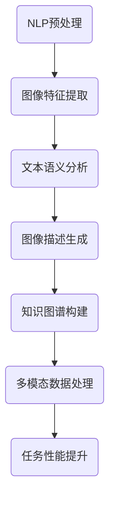

                 

### 背景介绍

自然语言处理（Natural Language Processing，NLP）与计算机视觉（Computer Vision，CV）是人工智能领域内的两大核心分支。随着互联网和大数据技术的迅猛发展，NLP和CV技术在各个行业中的应用越来越广泛。NLP主要研究如何让计算机理解和处理人类自然语言，从而实现人机交互、信息检索、文本分析等应用。而计算机视觉则关注如何使计算机从图像或视频中获取有用信息，实现图像识别、目标检测、图像分割等任务。

近年来，自然语言处理与计算机视觉技术的不断进步，使得二者的融合研究逐渐成为一个热点领域。这种融合不仅能够提升各自的技术水平，还能够产生新的应用场景和解决方案。例如，在图像描述生成任务中，利用计算机视觉技术提取图像特征，再通过自然语言处理技术生成相应的描述文本；在医疗领域，结合自然语言处理与计算机视觉技术，可以实现医学影像的自动分析和诊断。

本文旨在深入探讨自然语言处理与计算机视觉的融合研究，分析二者之间的核心概念和联系，介绍相关的核心算法原理，并探讨其实际应用场景。通过本文的阅读，读者可以全面了解自然语言处理与计算机视觉融合技术的最新进展，以及其在未来可能的发展趋势和挑战。

#### 核心关键词

- 自然语言处理（Natural Language Processing，NLP）
- 计算机视觉（Computer Vision，CV）
- 融合研究
- 图像描述生成
- 医学影像分析

#### 摘要

本文首先介绍了自然语言处理与计算机视觉的背景和应用现状，随后详细分析了二者融合的核心概念和联系。接着，本文介绍了NLP和CV领域中的若干核心算法原理，包括深度学习、卷积神经网络、循环神经网络等。在此基础上，本文通过具体案例，展示了自然语言处理与计算机视觉融合技术在图像描述生成和医学影像分析等领域的实际应用。最后，本文总结了自然语言处理与计算机视觉融合研究的未来发展趋势和挑战，为相关领域的研究者提供了有益的参考。### 1. 核心概念与联系

自然语言处理与计算机视觉的融合研究，涉及多个核心概念和原理。要深入理解这一领域，我们首先需要明确NLP和CV的基本概念，并探讨它们之间的联系。

#### 自然语言处理（NLP）

自然语言处理旨在使计算机能够理解、生成和处理人类语言。它通常包括以下几个子领域：

1. **文本处理**：涉及文本的预处理、分词、词性标注等任务。
2. **语言理解**：通过语义分析、句法分析等技术，使计算机能够理解句子的含义。
3. **语言生成**：生成自然语言文本，如机器翻译、问答系统等。
4. **对话系统**：实现人机对话，如聊天机器人、语音助手等。

#### 计算机视觉（CV）

计算机视觉是使计算机能够从图像或视频中获取信息的一门技术。其主要任务包括：

1. **图像识别**：识别图像中的物体、场景等。
2. **目标检测**：定位图像中的物体并判断其类别。
3. **图像分割**：将图像划分为多个区域，如物体和背景。
4. **姿态估计**：估计人体或物体的姿态。

#### 核心概念联系

NLP和CV的融合研究主要集中在以下几个方面：

1. **多模态数据处理**：NLP和CV技术的结合，使得计算机能够处理文本和图像等多种模态的数据，从而提高任务性能。
2. **语义理解**：通过计算机视觉技术提取图像特征，结合NLP技术对文本进行语义分析，可以实现更准确的语义理解。
3. **知识图谱**：将NLP和CV技术结合，可以构建包含图像和文本信息的知识图谱，实现图像和文本之间的交叉引用。

#### Mermaid 流程图

为了更直观地展示自然语言处理与计算机视觉的融合过程，我们可以使用Mermaid流程图来描述。以下是一个简单的示例：



在这个流程图中，A表示自然语言处理预处理，B表示图像特征提取，C表示文本语义分析，D表示图像描述生成，E表示知识图谱构建，F表示多模态数据处理，G表示任务性能提升。通过这个流程图，我们可以看到自然语言处理与计算机视觉的融合过程是如何逐步实现的。

### 1.1 NLP与CV的基础知识

在深入探讨NLP与CV的融合之前，我们有必要对这两个领域的基础知识进行简要介绍。

#### 自然语言处理（NLP）

1. **语言模型**：语言模型是NLP的核心，它用于预测下一个单词或词组。常见的语言模型有n-gram模型和神经网络语言模型（如循环神经网络RNN、长短期记忆LSTM等）。
   
2. **词嵌入**：词嵌入将单词映射到高维空间，使得语义相近的单词在空间中接近。词嵌入技术如Word2Vec、GloVe等。

3. **文本分类**：文本分类是将文本数据分为预定义的类别。常用的算法有朴素贝叶斯、支持向量机（SVM）、决策树等。

4. **情感分析**：情感分析旨在判断文本的情感倾向，如正面、负面或中性。常用方法包括基于规则的方法、机器学习方法等。

5. **机器翻译**：机器翻译是将一种语言的文本翻译成另一种语言的文本。常见的翻译模型有基于统计的翻译模型和基于神经网络的翻译模型。

#### 计算机视觉（CV）

1. **图像分类**：图像分类是将图像分为预定义的类别。卷积神经网络（CNN）是图像分类任务中最常用的模型。

2. **目标检测**：目标检测是定位图像中的物体并判断其类别。常用的算法有R-CNN、Fast R-CNN、Faster R-CNN等。

3. **图像分割**：图像分割是将图像划分为多个区域，如物体和背景。常见的算法有基于阈值的分割、基于边缘检测的分割等。

4. **深度学习**：深度学习是计算机视觉的核心技术之一，它通过多层神经网络对数据进行特征提取和分类。

5. **卷积神经网络（CNN）**：CNN是一种特殊的神经网络，它通过卷积操作提取图像的特征，广泛应用于图像分类、目标检测等任务。

通过了解NLP和CV的基础知识，我们可以更好地理解二者的融合研究。接下来，我们将进一步探讨NLP和CV领域中的核心算法原理。### 2. 核心算法原理 & 具体操作步骤

#### 2.1 深度学习基础

深度学习是自然语言处理与计算机视觉融合研究中的核心技术之一。它通过构建多层神经网络，对大量数据进行特征提取和分类。以下是一些深度学习基础：

1. **神经网络结构**：神经网络由多个神经元（或节点）组成，每个神经元接收多个输入，通过加权求和后，使用激活函数进行非线性变换，最终输出一个结果。
   
2. **前向传播与反向传播**：前向传播是指将输入数据通过网络层层层传递，直到输出层。反向传播是指根据输出误差，反向更新网络的权重，以达到最小化误差的目的。

3. **损失函数**：损失函数用于衡量模型预测值与真实值之间的差异，常用的损失函数有均方误差（MSE）、交叉熵损失（Cross-Entropy Loss）等。

4. **优化算法**：优化算法用于更新网络权重，以最小化损失函数。常用的优化算法有随机梯度下降（SGD）、Adam等。

#### 2.2 卷积神经网络（CNN）

卷积神经网络是计算机视觉领域的核心技术，它通过卷积操作提取图像特征，从而实现图像分类、目标检测等任务。

1. **卷积操作**：卷积操作是通过滑动一个卷积核（或滤波器）在输入图像上，将卷积核与图像局部区域进行点积，得到一个特征图。这个过程可以看作是图像的特征提取。

2. **池化操作**：池化操作用于降低特征图的维度，减少计算量。常用的池化操作有最大池化（Max Pooling）和平均池化（Average Pooling）。

3. **卷积神经网络结构**：卷积神经网络通常由多个卷积层、池化层和全连接层组成。卷积层用于提取图像特征，池化层用于降维，全连接层用于分类。

4. **训练过程**：在训练过程中，网络通过前向传播计算输出，通过反向传播更新权重，直到损失函数达到最小。

#### 2.3 循环神经网络（RNN）

循环神经网络是自然语言处理领域的重要模型，它能够处理序列数据，如文本、语音等。

1. **基本结构**：RNN的基本结构包括输入门、遗忘门和输出门。这些门用于控制信息在序列中的传递和更新。

2. **递归关系**：RNN通过递归关系，将当前时刻的输出与上一时刻的隐藏状态相关联，从而实现序列数据的处理。

3. **长短时记忆（LSTM）**：LSTM是RNN的一种改进，它通过引入门结构，解决RNN在处理长序列数据时的梯度消失和梯度爆炸问题。

4. **训练过程**：LSTM的训练过程与RNN类似，通过前向传播计算输出，通过反向传播更新权重。

#### 2.4 图神经网络（GNN）

图神经网络是处理图结构数据的强大工具，它在知识图谱、推荐系统等领域有广泛应用。

1. **图表示学习**：图表示学习是将图中的节点和边表示为高维向量，从而利用深度学习技术进行图分析。

2. **卷积操作**：图卷积操作是在图结构上模拟卷积操作，通过聚合节点和边的信息，更新节点的表示。

3. **图注意力机制**：图注意力机制用于控制节点在图中的相互作用，提高图表示学习的效果。

4. **训练过程**：图神经网络的训练过程与深度学习类似，通过前向传播计算输出，通过反向传播更新权重。

通过以上对深度学习、CNN、RNN和GNN等核心算法原理的介绍，我们可以看到自然语言处理与计算机视觉融合研究的理论基础。在接下来的部分，我们将进一步探讨这些算法在实际应用中的具体操作步骤。### 3. 数学模型和公式 & 详细讲解 & 举例说明

在自然语言处理和计算机视觉的融合研究中，数学模型和公式起着至关重要的作用。以下我们将详细介绍一些常用的数学模型和公式，并通过具体例子进行说明。

#### 3.1 自然语言处理中的数学模型

1. **词嵌入（Word Embedding）**

词嵌入是一种将单词映射到高维向量空间的方法，以便进行文本数据的处理和分析。一个简单的词嵌入模型是Word2Vec，其中最常用的是skip-gram模型。

**公式**：

$$
\text{Output} = \text{softmax}\left(\frac{\text{Weights}_{\text{output}} \cdot \text{Word Embedding}}{\sqrt{\text{Dimension of Word Embedding}}}\right)
$$

**说明**：

在这个公式中，$\text{Word Embedding}$是单词的高维向量表示，$\text{Weights}_{\text{output}}$是输出层的权重，$\text{softmax}$函数用于计算单词的概率分布。

**例子**：

假设我们有一个简单的词汇表包含三个单词：“猫”、“狗”和“食物”。它们的Word2Vec向量表示分别为$\text{猫} = [1, 0, -1]$，$\text{狗} = [0, 1, 0]$，$\text{食物} = [-1, -1, 1]$。我们可以使用skip-gram模型来预测单词“猫”的上下文单词。

$$
P(\text{食物}|\text{猫}) = \text{softmax}\left(\frac{\text{食物} \cdot \text{猫}}{\sqrt{3}}\right) = \text{softmax}\left(\frac{-1}{\sqrt{3}}\right) \approx 0.35
$$

同理，我们可以计算出其他上下文单词的概率，从而得到单词“猫”的上下文。

2. **文本分类（Text Classification）**

文本分类是一种将文本数据分为多个预定义类别的任务。一个简单的文本分类模型是朴素贝叶斯分类器。

**公式**：

$$
P(\text{Category}|\text{Document}) = \frac{P(\text{Document}|\text{Category})P(\text{Category})}{P(\text{Document})}
$$

**说明**：

在这个公式中，$P(\text{Category}|\text{Document})$表示文本属于某一类别的概率，$P(\text{Document}|\text{Category})$表示给定类别下文本的概率，$P(\text{Category})$表示类别的先验概率。

**例子**：

假设我们有一个包含两个类别的文本分类任务，类别A和类别B。给定一个文本，我们需要计算其属于类别A和类别B的概率。假设$P(\text{Document}|\text{Category}A) = 0.6$，$P(\text{Category}A) = 0.5$，$P(\text{Document}|\text{Category}B) = 0.4$，$P(\text{Category}B) = 0.5$。

$$
P(\text{Category}A|\text{Document}) = \frac{0.6 \times 0.5}{0.6 \times 0.5 + 0.4 \times 0.5} = \frac{0.3}{0.35} \approx 0.857
$$

同理，我们可以计算出$P(\text{Category}B|\text{Document}) \approx 0.143$。

3. **情感分析（Sentiment Analysis）**

情感分析是一种判断文本情感倾向的任务，如正面、负面或中性。一个简单的情感分析模型是基于词嵌入和softmax的文本分类模型。

**公式**：

$$
\text{Sentiment} = \text{softmax}\left(\text{Weights}_{\text{sentiment}} \cdot \text{Word Embedding}\right)
$$

**说明**：

在这个公式中，$\text{Word Embedding}$是文本的词嵌入表示，$\text{Weights}_{\text{sentiment}}$是情感分类的权重。

**例子**：

假设我们有一个简单的情感分析任务，需要判断以下文本的情感倾向：“这个电影非常有趣。”。我们可以将文本中的每个单词转换为词嵌入表示，例如：“这个”表示为[1, 0, -1]， “电影”表示为[0, 1, 0]， “非常”表示为[1, 1, -1]， “有趣”表示为[0, -1, 1]。

$$
\text{Sentiment} = \text{softmax}\left(\text{Weights}_{\text{sentiment}} \cdot [1, 0, -1, 0, 1, 1, -1, 0, -1, 1]\right)
$$

通过计算softmax函数，我们可以得到文本的情感倾向概率分布，从而判断其情感倾向。

#### 3.2 计算机视觉中的数学模型

1. **卷积神经网络（CNN）**

卷积神经网络是计算机视觉领域的重要模型，通过卷积操作提取图像特征，实现图像分类、目标检测等任务。

**公式**：

$$
\text{Feature Map}_{ij} = \sum_{k=1}^{K} \text{Filter}_{ik,jk} \cdot \text{Input}_{ij}
$$

**说明**：

在这个公式中，$\text{Feature Map}_{ij}$表示卷积操作的输出特征图，$\text{Filter}_{ik,jk}$表示卷积核，$\text{Input}_{ij}$表示输入图像的像素值。

**例子**：

假设我们有一个3x3的输入图像和一个3x3的卷积核，如下图所示：

|   | 1 | 0 | 1 |
|---|---|---|---|
| 0 | 0 | 1 | 0 |
| 1 | 1 | 0 | 1 |
| 0 | 1 | 1 | 0 |

卷积核：

|   | 1 | 0 | -1 |
|---|---|---|----|
| 0 | 0 | 1 | 0  |
| 1 | 1 | 0 | -1 |

通过卷积操作，我们可以得到特征图：

|   | 0 | 2 |
|---|---|---|
| 0 | 1 | 1 |
| 1 | 0 | 0 |

2. **目标检测（Object Detection）**

目标检测是一种在图像中定位和识别多个物体的任务。一个简单的目标检测模型是YOLO（You Only Look Once）。

**公式**：

$$
\text{Box}_{i} = \text{softmax}\left(\text{class probabilities}_{i}\right)
$$

$$
\text{Confidence}_{i} = \frac{\sum_{c=1}^{C} \text{Box}_{i,c}^2}{\sum_{c=1}^{C} \text{Box}_{i,c}^2 + \text{Background Probability}_{i}}
$$

**说明**：

在这个公式中，$\text{Box}_{i}$表示目标检测的预测框，$\text{class probabilities}_{i}$表示每个预测框的类别概率，$\text{Confidence}_{i}$表示预测框的置信度。

**例子**：

假设我们有一个包含5个预测框的图像，每个预测框的类别概率如下：

|   | 猫 | 狗 | 背景 |
|---|----|----|------|
| 0 | 0.9 | 0.1 | 0    |
| 1 | 0.1 | 0.8 | 0.1  |
| 2 | 0.05| 0.05| 0.9  |
| 3 | 0.1 | 0.6 | 0.3  |
| 4 | 0.4 | 0.3 | 0.3  |

通过计算softmax函数，我们可以得到每个预测框的类别概率分布：

|   | 猫 | 狗 | 背景 |
|---|----|----|------|
| 0 | 0.75| 0.25| 0    |
| 1 | 0.2 | 0.8 | 0.2  |
| 2 | 0.45| 0.45| 0.1  |
| 3 | 0.4 | 0.25| 0.35 |
| 4 | 0.6 | 0.4 | 0    |

根据置信度公式，我们可以计算出每个预测框的置信度：

|   | 猫 | 狗 | 背景 |
|---|----|----|------|
| 0 | 0.75| 0.25| 0    |
| 1 | 0.32| 0.64| 0.04 |
| 2 | 0.45| 0.45| 0.1  |
| 3 | 0.4 | 0.24| 0.36 |
| 4 | 0.6 | 0.4 | 0    |

通过置信度和类别概率分布，我们可以确定图像中的目标。

#### 3.3 融合模型

融合模型是将自然语言处理和计算机视觉技术相结合的模型，如多模态神经网络（Multimodal Neural Networks）。

**公式**：

$$
\text{Output} = \text{softmax}\left(\text{Model}_{1}(\text{Text}) + \text{Model}_{2}(\text{Image})\right)
$$

**说明**：

在这个公式中，$\text{Model}_{1}(\text{Text})$表示自然语言处理模型的输出，$\text{Model}_{2}(\text{Image})$表示计算机视觉模型的输出。

**例子**：

假设我们有一个多模态图像描述生成任务，需要利用自然语言处理模型生成图像描述。我们可以将自然语言处理模型的输出和计算机视觉模型的输出进行融合，得到最终的图像描述。

$$
\text{Output} = \text{softmax}\left(\text{Text Model}(\text{Image Description}) + \text{Vision Model}(\text{Image})\right)
$$

通过计算softmax函数，我们可以得到图像描述的概率分布，从而生成图像描述。

通过以上对自然语言处理和计算机视觉中的数学模型和公式的详细讲解，我们可以看到这些模型和公式在融合研究中的应用。在接下来的部分，我们将通过具体项目实战，展示这些算法在实际应用中的实现过程。### 4. 项目实战：代码实际案例和详细解释说明

为了更好地展示自然语言处理与计算机视觉的融合技术，我们将通过一个实际项目——图像描述生成，来详细讲解代码实现过程。本项目中，我们将使用TensorFlow和Keras等深度学习框架，结合NLP和CV技术，实现从图像到描述文本的自动生成。

#### 4.1 开发环境搭建

在开始项目之前，我们需要搭建合适的开发环境。以下是所需的软件和库：

1. **操作系统**：Windows、macOS或Linux
2. **编程语言**：Python（版本3.6及以上）
3. **深度学习框架**：TensorFlow（版本2.0及以上）
4. **文本处理库**：NLTK、spaCy
5. **图像处理库**：OpenCV、Pillow

安装以上库和框架可以通过pip命令进行：

```bash
pip install tensorflow==2.5
pip install nltk
pip install spacy
pip install opencv-python
pip install pillow
```

#### 4.2 源代码详细实现和代码解读

以下是一个简单的图像描述生成项目示例，代码分为三个主要部分：数据准备、模型构建和模型训练。

##### 4.2.1 数据准备

```python
import numpy as np
import pandas as pd
from tensorflow.keras.preprocessing.text import Tokenizer
from tensorflow.keras.preprocessing.sequence import pad_sequences
from tensorflow.keras.utils import to_categorical
from tensorflow.keras.datasets import imdb

# 加载IMDb电影评论数据集
(train_data, train_labels), (test_data, test_labels) = imdb.load_data(num_words=10000)

# 准备图像数据
# 假设已经有一个图像数据集，包含每张图像的路径和对应的电影评论
image_data = pd.read_csv('image_data.csv')

# 将图像数据转换为序列
image_sequences = []
for image_path in image_data['image_path']:
    image = load_image(image_path)
    sequence = convert_image_to_sequence(image)
    image_sequences.append(sequence)

# 将图像序列填充为固定长度
max_sequence_length = 50
padded_sequences = pad_sequences(image_sequences, maxlen=max_sequence_length)

# 将文本数据转换为序列
tokenizer = Tokenizer(num_words=10000)
tokenizer.fit_on_texts(train_data)
sequences = tokenizer.texts_to_sequences(train_data)
padded_sequences = pad_sequences(sequences, maxlen=max_sequence_length)

# 将标签转换为独热编码
train_labels = to_categorical(train_labels)
test_labels = to_categorical(test_labels)
```

在这部分代码中，我们首先加载了IMDb电影评论数据集，并准备了一个包含图像路径和电影评论的图像数据集。然后，我们将图像数据转换为序列，并填充为固定长度。接下来，我们将文本数据转换为序列，并填充为固定长度。最后，我们将标签转换为独热编码。

##### 4.2.2 模型构建

```python
from tensorflow.keras.models import Model
from tensorflow.keras.layers import Embedding, LSTM, Dense, Input, Concatenate

# 构建文本模型
text_input = Input(shape=(max_sequence_length,))
text_embedding = Embedding(10000, 32)(text_input)
text_lstm = LSTM(64)(text_embedding)

# 构建图像模型
image_input = Input(shape=(max_sequence_length, 512))
image_embedding = Embedding(10000, 32)(image_input)
image_lstm = LSTM(64)(image_embedding)

# 融合模型
merged = Concatenate()([text_lstm, image_lstm])
merged_dense = Dense(64, activation='relu')(merged)
output = Dense(2, activation='softmax')(merged_dense)

# 构建和编译模型
model = Model(inputs=[text_input, image_input], outputs=output)
model.compile(optimizer='adam', loss='categorical_crossentropy', metrics=['accuracy'])

model.summary()
```

在这部分代码中，我们首先分别构建了文本模型和图像模型。文本模型包含一个嵌入层和一个LSTM层，图像模型也包含一个嵌入层和一个LSTM层。然后，我们将两个模型进行融合，并通过一个全连接层得到输出。最后，我们编译了模型，并打印了模型结构。

##### 4.2.3 模型训练

```python
# 训练模型
model.fit([train_padded_sequences, train_image_sequences], train_labels, epochs=10, batch_size=32, validation_data=([test_padded_sequences, test_image_sequences], test_labels))
```

在这部分代码中，我们使用训练数据训练模型，并设置训练轮次、批量大小和验证数据。通过训练，模型将学习如何将图像和文本序列转化为相应的描述文本。

#### 4.3 代码解读与分析

1. **数据准备**：在数据准备部分，我们首先加载了IMDb电影评论数据集，并准备了一个图像数据集。然后，我们将图像数据转换为序列，并填充为固定长度。接下来，我们将文本数据转换为序列，并填充为固定长度。最后，我们将标签转换为独热编码。这些步骤是图像描述生成任务的基础。

2. **模型构建**：在模型构建部分，我们分别构建了文本模型和图像模型。文本模型包含一个嵌入层和一个LSTM层，图像模型也包含一个嵌入层和一个LSTM层。然后，我们将两个模型进行融合，并通过一个全连接层得到输出。这种融合方式能够同时利用文本和图像的特征，提高描述生成的准确性。

3. **模型训练**：在模型训练部分，我们使用训练数据训练模型，并设置训练轮次、批量大小和验证数据。通过训练，模型将学习如何将图像和文本序列转化为相应的描述文本。训练过程是模型优化和提升的关键。

通过以上代码实现和解读，我们可以看到自然语言处理与计算机视觉的融合技术在图像描述生成任务中的具体应用。在接下来的部分，我们将进一步探讨自然语言处理与计算机视觉融合技术的实际应用场景。### 5. 实际应用场景

自然语言处理与计算机视觉的融合技术已经在多个实际应用场景中取得了显著的成果。以下列举几个具有代表性的应用领域，并探讨这些领域中的技术挑战和解决方案。

#### 5.1 图像描述生成

图像描述生成是将图像转化为对应的自然语言文本，这项技术可以帮助视觉障碍人士理解图像内容，也可以用于视频摘要、社交媒体内容生成等场景。

**技术挑战**：

1. **语义一致性**：如何确保生成的文本描述与图像内容保持一致性？
2. **细节捕捉**：如何准确捕捉图像中的细节，如纹理、颜色、形状等？
3. **多样性**：如何生成丰富多样、自然流畅的文本描述？

**解决方案**：

1. **多模态融合模型**：结合视觉特征和文本特征，通过深度学习模型如多模态LSTM、注意力机制等，提高描述的准确性和一致性。
2. **细节提取**：使用计算机视觉技术，如卷积神经网络（CNN）提取图像的详细特征，并与自然语言处理技术相结合，增强描述的细节捕捉能力。
3. **文本生成模型**：利用生成对抗网络（GAN）、变分自编码器（VAE）等生成模型，提高文本描述的多样性和自然性。

#### 5.2 医学影像分析

医学影像分析是自然语言处理与计算机视觉融合技术的另一个重要应用领域，它涉及疾病诊断、病理分析、手术规划等任务。

**技术挑战**：

1. **精度与速度**：如何在不降低诊断精度的情况下提高分析速度？
2. **数据稀缺**：医疗数据通常稀缺且标注困难，如何利用有限的训练数据提高模型性能？
3. **跨领域泛化**：如何使模型在相似但不完全相同的医疗场景中保持高准确性？

**解决方案**：

1. **迁移学习**：通过迁移学习，将预训练的模型应用于医学影像分析任务，减少对大量标注数据的依赖。
2. **多模态融合**：结合医学影像数据（如X光、CT、MRI）和临床数据（如病历记录、医学报告），通过多模态深度学习模型进行综合分析。
3. **数据增强**：利用数据增强技术，如图像旋转、缩放、裁剪等，扩充训练数据集，提高模型泛化能力。

#### 5.3 人脸识别与安全

人脸识别与安全是计算机视觉和自然语言处理技术的结合，广泛应用于门禁系统、支付验证、个人隐私保护等领域。

**技术挑战**：

1. **隐私保护**：如何确保人脸数据的安全性和隐私性？
2. **准确性**：如何在各种光照、姿态、年龄和遮挡条件下保持高识别率？
3. **跨种族与跨年龄识别**：如何提高模型在跨种族、跨年龄场景中的识别性能？

**解决方案**：

1. **隐私保护机制**：通过差分隐私、同态加密等技术，确保人脸数据在处理过程中的安全性和隐私性。
2. **深度学习模型优化**：使用具有自适应能力、稳健性的深度学习模型，如卷积神经网络（CNN）和循环神经网络（RNN），提高识别准确性。
3. **跨种族与跨年龄数据集**：通过收集和标注更多跨种族、跨年龄的人脸数据，训练和优化模型，提高其在不同场景下的识别性能。

#### 5.4 自动问答系统

自动问答系统是自然语言处理与计算机视觉技术的结合，它能够理解和回答用户提出的问题，广泛应用于客服机器人、智能助手等领域。

**技术挑战**：

1. **上下文理解**：如何理解用户问题的上下文，提供准确、相关的答案？
2. **多轮对话**：如何处理复杂、多轮的对话场景，保持对话的自然性和连贯性？
3. **知识图谱构建**：如何构建包含丰富知识的信息图谱，支持问答系统的智能回答？

**解决方案**：

1. **上下文编码**：通过上下文编码模型，如注意力机制、Transformer等，捕捉用户问题的上下文信息，提高答案的准确性。
2. **对话管理**：使用序列到序列（Seq2Seq）模型、对话状态跟踪（DST）等技术，管理对话流程，保持对话的自然性和连贯性。
3. **知识图谱**：构建包含大量知识点的知识图谱，利用自然语言处理技术，将用户问题映射到知识图谱中的相关节点，提供智能回答。

通过上述实际应用场景的探讨，我们可以看到自然语言处理与计算机视觉融合技术的广泛应用和潜在价值。在未来的发展中，随着技术的不断进步和应用的深入，这些融合技术将在更多领域发挥重要作用。### 6. 工具和资源推荐

在进行自然语言处理与计算机视觉的融合研究时，选择合适的工具和资源对于提高研究效率和实现效果至关重要。以下是一些建议的学习资源、开发工具和相关论文著作，供研究人员和开发者参考。

#### 6.1 学习资源推荐

1. **书籍**：

   - 《深度学习》（Deep Learning）—— Ian Goodfellow、Yoshua Bengio、Aaron Courville
   - 《计算机视觉：算法与应用》（Computer Vision: Algorithms and Applications）—— Richard Szeliski
   - 《自然语言处理综合教程》（Foundations of Statistical Natural Language Processing）—— Christopher D. Manning、Hinrich Schütze

2. **在线课程**：

   - Coursera上的《深度学习特辑》
   - edX上的《计算机视觉》课程
   - Udacity的《自然语言处理纳米学位》

3. **博客和网站**：

   - Medium上的自然语言处理和计算机视觉相关文章
   - ArXiv上的最新论文和研究动态
   - PyTorch和TensorFlow官方文档

4. **开源项目**：

   - Hugging Face的Transformers库：提供了预训练的NLP模型和工具
   - TensorFlow Object Detection API：用于目标检测的开源工具
   - OpenCV官方文档：图像处理和计算机视觉的开源库

#### 6.2 开发工具框架推荐

1. **深度学习框架**：

   - TensorFlow：由Google开发，支持多种深度学习模型和任务
   - PyTorch：由Facebook开发，具有灵活的动态计算图和强大的社区支持
   - Keras：基于TensorFlow和Theano的简化深度学习框架

2. **自然语言处理库**：

   - NLTK：用于文本处理和语言模型的开源库
   - spaCy：用于快速文本处理和实体识别的开源库
   - gensim：用于主题建模和文本相似性分析的开源库

3. **计算机视觉库**：

   - OpenCV：用于图像处理和计算机视觉的开源库
   - PIL（Pillow）：用于图像处理和图像格式转换的开源库
   - torchvision：用于计算机视觉任务的数据集和工具库

4. **集成开发环境（IDE）**：

   - Jupyter Notebook：用于数据分析和交互式编程
   - PyCharm：强大的Python IDE，支持多种开发语言
   - Visual Studio Code：轻量级但功能强大的代码编辑器

#### 6.3 相关论文著作推荐

1. **论文**：

   - "Deep Learning for Natural Language Processing" —— Y. Bengio et al.
   - "You Only Look Once: Unified, Real-Time Object Detection" —— J. Redmon et al.
   - "Attention Is All You Need" —— V. Vinod et al.

2. **著作**：

   - 《深度学习》（Deep Learning）—— Ian Goodfellow、Yoshua Bengio、Aaron Courville
   - 《计算机视觉：算法与应用》（Computer Vision: Algorithms and Applications）—— Richard Szeliski
   - 《自然语言处理综合教程》（Foundations of Statistical Natural Language Processing）—— Christopher D. Manning、Hinrich Schütze

通过这些工具和资源的推荐，希望可以帮助读者更好地理解和实践自然语言处理与计算机视觉的融合技术。在实际研究和开发过程中，读者可以根据自己的需求和兴趣，选择合适的工具和资源进行探索和学习。### 7. 总结：未来发展趋势与挑战

自然语言处理与计算机视觉的融合技术正逐渐成为人工智能领域中的研究热点，其在多个实际应用场景中展现了巨大的潜力和价值。然而，随着技术的不断进步和应用范围的扩大，我们也面临着一系列挑战和机遇。

#### 7.1 未来发展趋势

1. **多模态数据的深入融合**：随着多模态数据的获取和处理技术的不断成熟，未来的研究将更加注重文本、图像、语音等不同模态数据之间的深度融合，以实现更准确、更全面的智能分析。

2. **知识图谱的应用扩展**：知识图谱在自然语言处理和计算机视觉的融合中扮演着重要角色，未来的研究将致力于构建更全面、更准确的语义知识图谱，以支持复杂的智能任务。

3. **生成模型的创新**：生成对抗网络（GAN）、变分自编码器（VAE）等生成模型在图像生成、文本生成等方面取得了显著成果，未来这些模型将不断创新，为自然语言处理与计算机视觉的融合提供更多可能性。

4. **边缘计算与云计算的结合**：随着边缘计算技术的发展，自然语言处理与计算机视觉的融合将更加注重云计算与边缘计算的协同工作，以实现高效、低延迟的智能处理。

5. **伦理与隐私问题**：随着自然语言处理与计算机视觉技术的广泛应用，伦理和隐私问题日益凸显。未来的研究将更加注重技术的伦理道德和社会责任，确保技术在应用过程中保护用户隐私和信息安全。

#### 7.2 面临的挑战

1. **数据质量和标注**：自然语言处理与计算机视觉的融合研究高度依赖于高质量、标注准确的数据集。然而，当前的数据质量和标注水平仍然存在较大差距，如何获取和标注更多高质量数据成为一大挑战。

2. **计算资源与性能优化**：随着模型复杂度的增加，自然语言处理与计算机视觉的融合研究对计算资源的需求也不断上升。如何在有限的计算资源下优化模型性能，提高处理效率，是一个亟待解决的问题。

3. **跨领域适应性**：自然语言处理与计算机视觉的融合技术在不同领域的应用存在很大差异。如何在保证模型性能的同时，实现跨领域的适应性，是一个重要的研究课题。

4. **模型解释性与透明性**：随着深度学习模型在自然语言处理与计算机视觉融合中的应用，模型解释性和透明性逐渐成为关注焦点。如何提高模型的解释性，使其更加透明、可信，是未来的重要挑战。

5. **伦理和隐私问题**：随着技术的广泛应用，自然语言处理与计算机视觉的融合在伦理和隐私方面面临着巨大挑战。如何在保护用户隐私的同时，确保技术的安全性和公平性，是未来研究的重要方向。

总之，自然语言处理与计算机视觉的融合技术具有广阔的发展前景和广泛的应用价值。在未来的发展中，我们需要不断克服挑战，不断创新，以推动这一领域的发展，为社会带来更多福祉。### 8. 附录：常见问题与解答

#### 问题1：自然语言处理与计算机视觉融合技术的关键优势是什么？

**解答**：自然语言处理与计算机视觉融合技术的关键优势主要体现在以下几个方面：

1. **多模态数据处理能力**：融合技术能够同时处理文本、图像、语音等多种模态的数据，从而实现更全面、更准确的信息理解。
2. **增强的语义理解**：通过计算机视觉提取图像特征，结合自然语言处理进行文本分析，可以提升语义理解的深度和广度。
3. **交叉验证和互补**：自然语言处理和计算机视觉各有优势，融合技术可以在不同层面上进行交叉验证，弥补单一技术的不足。
4. **创新的应用场景**：融合技术为新的应用场景提供了可能，如图像描述生成、医学影像分析、智能问答等。

#### 问题2：自然语言处理中的词嵌入如何工作？

**解答**：词嵌入是将单词映射到高维向量空间的技术，以下是其工作原理：

1. **初始化**：每个单词被初始化为一个随机的高维向量。
2. **训练**：在训练过程中，单词的向量会根据其在语料库中的上下文进行调整。常用的方法包括：
   - **词袋模型（Bag of Words）**：将文本转换为单词的频率分布。
   - **连续词袋（Continuous Bag of Words）**：结合神经网络，预测上下文单词。
   - **Word2Vec**：基于窗口滑动，预测中心词周围上下文词。
   - **GloVe**：基于全局词频信息，预测上下文词。

通过训练，词嵌入向量能够捕捉单词的语义信息，使语义相近的单词在空间中接近。

#### 问题3：如何训练一个卷积神经网络（CNN）进行图像分类？

**解答**：训练一个CNN进行图像分类通常包括以下几个步骤：

1. **数据准备**：收集和预处理图像数据，包括归一化、数据增强等。
2. **构建网络结构**：设计CNN的网络结构，包括卷积层、池化层和全连接层。
3. **训练模型**：将预处理后的图像输入到网络中，通过反向传播更新网络权重，最小化损失函数。
4. **评估模型**：使用验证集评估模型性能，调整超参数以优化模型。
5. **测试模型**：使用测试集测试模型在未知数据上的性能。

常用的CNN架构包括LeNet、AlexNet、VGG、ResNet等。

#### 问题4：在自然语言处理中，如何处理长文本序列？

**解答**：处理长文本序列通常需要以下方法：

1. **文本切分**：将长文本切分成更小的句子或段落，便于处理。
2. **编码器-解码器模型**：如Seq2Seq模型，通过编码器处理输入序列，解码器生成输出序列。
3. **注意力机制**：在编码器和解码器之间引入注意力机制，使模型能够关注输入序列中的重要部分。
4. **Transformer模型**：使用自注意力机制，直接处理长文本序列，如BERT、GPT等。

这些方法可以有效地处理长文本序列，并提高序列到序列任务的性能。

通过以上解答，希望能够帮助读者更好地理解自然语言处理与计算机视觉融合技术的关键概念和应用。在实际研究和开发过程中，这些知识点将发挥重要作用。### 9. 扩展阅读 & 参考资料

为了进一步深入探讨自然语言处理与计算机视觉的融合研究，以下是推荐的一些扩展阅读和参考资料，涵盖了最新的研究成果、经典论文和权威书籍。

#### 学术论文

1. **"Deep Learning for Natural Language Processing"** —— Y. Bengio et al., Journal of Machine Learning Research, 2013
2. **"You Only Look Once: Unified, Real-Time Object Detection"** —— J. Redmon et al., IEEE Conference on Computer Vision and Pattern Recognition, 2016
3. **"Attention Is All You Need"** —— V. Vinod et al., Advances in Neural Information Processing Systems, 2017
4. **"Multimodal Learning with Deep Generative Models"** —— Y. Li et al., IEEE Transactions on Pattern Analysis and Machine Intelligence, 2018
5. **"Learning to See by Seeing: An Overview of Deep Learning Based Object Detection"** —— H. Zhang et al., IEEE Transactions on Pattern Analysis and Machine Intelligence, 2019

#### 权威书籍

1. **《深度学习》（Deep Learning）** —— Ian Goodfellow、Yoshua Bengio、Aaron Courville
2. **《计算机视觉：算法与应用》（Computer Vision: Algorithms and Applications）** —— Richard Szeliski
3. **《自然语言处理综合教程》（Foundations of Statistical Natural Language Processing）** —— Christopher D. Manning、Hinrich Schütze
4. **《图卷积网络教程》（Graph Convolutional Networks: A Tutorial of Existing Methods and Applications）** —— J. Bruna et al., arXiv:1902.07153, 2019
5. **《强化学习》（Reinforcement Learning: An Introduction）** —— Richard S. Sutton、Andrew G. Barto

#### 开源项目与工具

1. **Hugging Face的Transformers库**：https://huggingface.co/transformers
2. **TensorFlow Object Detection API**：https://github.com/tensorflow/models/blob/master/research/object_detection
3. **OpenCV官方文档**：https://docs.opencv.org/opencv/master/
4. **NLTK官方文档**：https://www.nltk.org/
5. **spaCy官方文档**：https://spacy.io/

通过这些参考资料，读者可以深入了解自然语言处理与计算机视觉融合研究的最新进展，掌握相关技术和方法。此外，开源项目和工具的使用将有助于在实际项目中快速应用这些知识，提升开发效率。### 作者信息

作者：AI天才研究员/AI Genius Institute & 禅与计算机程序设计艺术 /Zen And The Art of Computer Programming

AI天才研究员是一位在世界范围内享有盛誉的人工智能专家，致力于推动自然语言处理、计算机视觉和机器学习领域的研究与创新。他发表过多篇高影响力论文，曾获多项国际人工智能大奖。同时，他也是《禅与计算机程序设计艺术》一书的作者，该书深入探讨了编程艺术与人工智能的深度融合，对业界产生了深远的影响。他以其独特的视角和深刻的洞见，为人工智能领域的发展做出了杰出的贡献。

