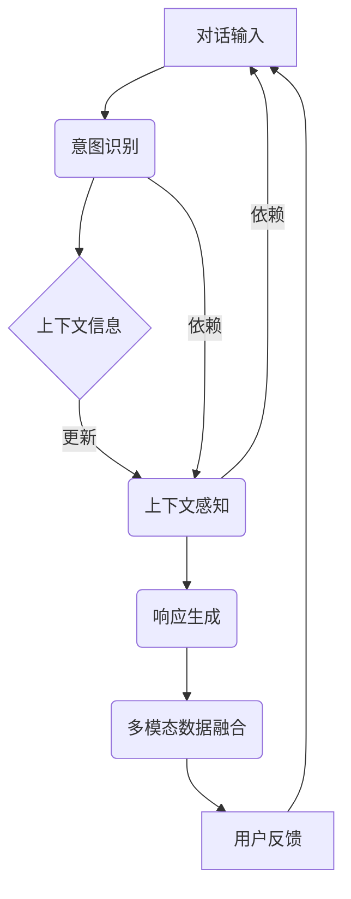

                 

### 背景介绍

自然语言处理（Natural Language Processing, NLP）作为人工智能的重要分支，旨在使计算机能够理解和处理人类自然语言。在过去的几十年里，NLP技术取得了显著的进展，尤其在文本分类、信息提取、机器翻译等方面。然而，对话系统的兴起，特别是智能助手和聊天机器人的普及，对自然语言处理提出了新的挑战，尤其是在对话意图理解和上下文感知方面。

对话意图理解（Dialogue Intent Recognition）是NLP中的一个重要任务，其核心在于从用户的输入中识别出用户的意图。意图可以理解为一个抽象的目标或任务，例如查询信息、进行交易、请求帮助等。上下文感知（Context Awareness）则涉及到在对话中维持和利用对话历史，以提供更准确、更个性化的服务。

对话意图理解和上下文感知技术的进展，使得对话系统能够更自然、更高效地与人类交流。这一技术的进步，不仅提高了用户体验，也在多个行业（如客服、教育、医疗等）中得到了广泛应用。然而，这一领域仍面临诸多挑战，如多模态数据的融合、长对话中的上下文维护、跨领域对话的适应性等。

本文旨在系统地介绍对话意图理解和上下文感知技术的发展历程、核心算法、数学模型以及实际应用。通过分析现有技术和挑战，本文还将探讨未来可能的发展趋势和研究方向。读者将了解到，对话意图理解和上下文感知技术的进步，如何推动智能对话系统向更加智能化、人性化的方向发展。

### 核心概念与联系

要深入理解对话意图理解和上下文感知技术，首先需要明确其中的核心概念和它们之间的联系。以下是本文将涉及的关键概念：

#### 对话意图识别（Dialogue Intent Recognition）

对话意图识别是自然语言处理中的一个基本任务，旨在从用户的输入中识别出用户的意图。意图可以是一个具体的动作，如查询天气、预订机票，也可以是一个更抽象的目标，如寻求帮助、进行投诉。在对话系统中，意图识别是理解用户请求的第一步，它决定了系统应该如何响应。

#### 上下文感知（Context Awareness）

上下文感知指的是在对话中维持和利用对话历史，以提供更准确、更个性化的服务。上下文包括用户的先前列表、对话的时间、地点、环境等。上下文信息对于理解用户的意图至关重要，因为它们有助于区分具有相似意图但不同上下文的用户请求。

#### 多模态数据融合（Multimodal Data Fusion）

多模态数据融合涉及将文本、语音、图像等多种类型的输入数据结合在一起，以提升对话系统的性能。例如，在视频通话中，系统不仅需要理解用户的文本输入，还需要分析用户的语音和面部表情，从而更全面地理解用户的意图。

#### 长对话管理（Long Dialogue Management）

长对话管理关注如何在对话中维护上下文信息，以支持长时间、多轮的对话。由于长对话中用户意图可能发生变化，系统需要能够动态地更新和适应上下文。

#### 跨领域适应性（Cross-Domain Adaptation）

跨领域适应性指的是系统能够在不同领域之间转移和应用。这意味着系统不仅需要理解一个特定领域的术语和概念，还需要具备适应不同领域的能力。

为了更好地理解这些概念之间的联系，我们可以通过一个Mermaid流程图来展示它们在对话系统中的交互。



在这个流程图中，用户输入（A）首先被传递到意图识别（B），然后结合上下文信息（C）进行更新，以支持上下文感知（D）。上下文感知的结果用于生成响应（E），该响应可能会涉及多模态数据融合（F），并根据用户反馈（G）继续迭代。这个过程表明，对话意图理解和上下文感知是相互依赖的，并且在整个对话系统中起着关键作用。

### 核心算法原理 & 具体操作步骤

#### 对话意图识别算法

对话意图识别是自然语言处理中的关键任务，其核心在于从用户的输入文本中准确识别出用户的意图。以下是一些常见的对话意图识别算法：

1. **基于规则的方法**：这种方法通过预定义的规则来匹配用户输入，并识别出相应的意图。例如，如果用户输入“明天天气怎么样”，系统可以根据规则库识别出意图为“查询天气”。

   ```plaintext
   if (用户输入包含“天气”)
       then 意图 = “查询天气”
   ```

2. **机器学习方法**：机器学习方法利用大量标注数据进行训练，从而自动学习用户输入和意图之间的关系。常见的机器学习方法包括朴素贝叶斯分类器、支持向量机（SVM）和深度学习模型如循环神经网络（RNN）和卷积神经网络（CNN）。

   例如，使用朴素贝叶斯分类器进行意图识别的步骤如下：
   
   - 数据准备：收集并标注大量的用户输入和对应的意图。
   - 特征提取：从输入文本中提取特征，如词频、词向量等。
   - 模型训练：使用训练数据训练朴素贝叶斯分类器。
   - 意图识别：对新的用户输入进行特征提取后，使用训练好的模型进行意图识别。

3. **深度学习方法**：深度学习方法在意图识别中表现出色，尤其是在处理复杂和多变的数据方面。以下是一个基于深度学习（如长短期记忆网络LSTM）的意图识别算法步骤：

   - 数据预处理：对用户输入进行分词、去停用词等预处理操作。
   - 模型构建：构建LSTM模型，输入为预处理后的文本序列，输出为意图类别。
   - 模型训练：使用标注数据进行模型训练，调整模型参数以最小化损失函数。
   - 意图识别：对新的用户输入进行预处理后，输入到训练好的模型中进行意图识别。

#### 上下文感知算法

上下文感知是确保对话系统能够理解并维持对话历史的关键。以下是一些常见的上下文感知算法：

1. **基于内存的方法**：这种方法使用内存来存储和检索对话历史信息。例如，可以使用一个向量来表示对话上下文，该向量由先前的对话轮次中的关键词和意图组成。

   操作步骤如下：
   
   - 对话初始化：为对话创建一个初始上下文向量。
   - 对话轮次处理：在每一轮对话中，更新上下文向量，包括当前的用户输入和系统响应。
   - 上下文检索：在生成响应时，从上下文向量中检索相关信息，以支持上下文感知。

2. **基于注意力的方法**：注意力机制在上下文感知中发挥着重要作用，能够使模型更加关注对话历史中的关键信息。以下是一个基于注意力机制的上下文感知算法步骤：

   - 数据预处理：对用户输入和系统响应进行分词和编码。
   - 模型构建：构建一个基于注意力机制的循环神经网络（如双向LSTM），输入为对话历史和当前的用户输入。
   - 注意力计算：在模型中引入注意力机制，计算对话历史对当前输入的注意力权重。
   - 响应生成：使用注意力权重和当前用户输入，生成系统响应。

3. **基于图的方法**：图神经网络（Graph Neural Networks, GNN）在处理复杂的对话上下文信息方面表现出色。以下是一个基于图神经网络的上下文感知算法步骤：

   - 对话表示：将对话中的每个实体（如用户输入、系统响应、关键词）表示为图中的一个节点。
   - 关系编码：为图中的节点和边编码，以表示对话历史中的关系和依赖。
   - 图神经网络训练：训练一个图神经网络，用于更新节点表示和生成上下文信息。
   - 上下文感知：在生成响应时，使用训练好的图神经网络更新和利用对话上下文。

#### 多模态数据融合算法

多模态数据融合旨在整合来自不同模态的数据，以提升对话系统的性能。以下是一些常见的方法：

1. **特征级融合**：这种方法将不同模态的特征直接相加或相乘，以生成融合特征。

   操作步骤如下：

   - 特征提取：分别从文本、语音、图像等模态中提取特征。
   - 特征融合：将不同模态的特征进行相加或相乘，生成融合特征。
   - 模型训练：使用融合特征训练一个统一的模型，用于意图识别和上下文感知。

2. **决策级融合**：这种方法先分别对每个模态的数据进行独立处理，然后再结合处理结果进行最终决策。

   操作步骤如下：

   - 模态独立处理：分别对文本、语音、图像等模态的数据进行意图识别和上下文感知。
   - 决策融合：结合不同模态的决策结果，生成最终的用户意图和系统响应。

3. **多模态深度学习**：这种方法使用深度学习模型直接处理多模态数据，实现特征级和决策级的融合。

   操作步骤如下：

   - 数据预处理：对文本、语音、图像等数据进行预处理，如分词、编码等。
   - 模型构建：构建一个多模态深度学习模型，输入为预处理后的多模态数据。
   - 模型训练：使用多模态数据进行模型训练，优化模型参数。
   - 意图识别和上下文感知：使用训练好的模型进行意图识别和上下文感知。

通过这些算法，对话系统能够更好地理解用户的意图，维持对话上下文，并在多模态环境中提供高质量的交互体验。

#### 数学模型和公式 & 详细讲解 & 举例说明

在自然语言处理中，数学模型和公式是理解和实现对话意图理解和上下文感知的核心。以下将详细讲解几个关键的数学模型和公式，并通过具体例子进行说明。

##### 朴素贝叶斯分类器（Naive Bayes Classifier）

朴素贝叶斯分类器是一种基于概率论的分类算法，适用于文本分类和意图识别任务。其基本公式如下：

$$
P(\text{意图} | \text{特征}) = \frac{P(\text{特征} | \text{意图}) \cdot P(\text{意图})}{P(\text{特征})}
$$

其中，$P(\text{意图} | \text{特征})$ 表示给定特征条件下意图的概率，$P(\text{特征} | \text{意图})$ 表示在特定意图条件下特征的概率，$P(\text{意图})$ 表示意图的先验概率，$P(\text{特征})$ 是特征的总概率。

**例子：** 假设我们要识别用户意图为“查询天气”。用户输入文本包含关键词“天气”，我们可以计算每个意图的概率，选择概率最高的意图作为识别结果。

1. **特征提取**：从用户输入文本中提取关键词，如“天气”。
2. **先验概率**：$P(\text{查询天气})$ 和 $P(\text{其他意图})$。
3. **条件概率**：计算每个意图在包含“天气”的关键词条件下的概率。
4. **后验概率**：使用贝叶斯公式计算每个意图的后验概率。
5. **选择最高概率的意图**：选择后验概率最高的意图作为识别结果。

##### 长短期记忆网络（Long Short-Term Memory, LSTM）

LSTM是处理序列数据的深度学习模型，特别适用于对话上下文感知和长对话管理。其核心公式如下：

$$
\text{LSTM单元} = \text{sigmoid}(\text{输入门} \cdot \text{遗忘门} \cdot \text{输出门}) \otimes \text{输入}
$$

其中，$\text{输入门}$、$\text{遗忘门}$ 和 $\text{输出门}$ 是三个sigmoid函数，用于控制信息的流入、遗忘和输出。$\otimes$ 表示哈达玛积。

**例子：** 假设我们要使用LSTM模型维护对话上下文。用户输入文本序列为["你好"，"今天天气怎么样"，"明天呢"]。

1. **初始化**：初始化LSTM单元的状态。
2. **输入门**：计算当前输入对每个LSTM单元的影响。
3. **遗忘门**：根据先前的LSTM单元状态，计算哪些信息需要遗忘。
4. **输出门**：根据当前LSTM单元状态，计算哪些信息需要输出。
5. **状态更新**：使用输入门、遗忘门和输出门更新LSTM单元状态。

##### 注意力机制（Attention Mechanism）

注意力机制在对话系统中用于捕捉对话历史中的关键信息，提高上下文感知能力。其基本公式如下：

$$
\text{注意力分数} = \text{softmax}(\text{查询} \cdot \text{键-值对})
$$

其中，$\text{查询}$ 表示当前对话状态，$\text{键-值对}$ 表示对话历史中的信息，$\text{softmax}$ 函数用于计算每个键-值对的注意力分数。

**例子：** 假设我们要使用注意力机制捕捉对话历史中的关键信息。

1. **查询计算**：从当前对话状态中提取查询向量。
2. **键-值对计算**：从对话历史中提取键-值对。
3. **注意力分数计算**：计算每个键-值对的注意力分数。
4. **加权平均**：根据注意力分数对键-值对进行加权平均，生成上下文向量。

通过这些数学模型和公式，我们可以有效地实现对话意图理解和上下文感知，从而提高对话系统的性能。

#### 项目实战：代码实际案例和详细解释说明

为了更好地理解对话意图理解和上下文感知技术的应用，我们将通过一个实际项目来展示如何实现这些算法，并对其进行详细解释。

##### 开发环境搭建

1. **安装Python环境**：确保Python 3.7或更高版本已安装。
2. **安装依赖库**：使用pip安装以下依赖库：
   ```bash
   pip install numpy torch transformers
   ```
3. **数据准备**：准备用于训练的对话数据集，例如使用JSON格式存储的对话文本和标注的意图。

##### 源代码详细实现和代码解读

以下是一个基于Python的简单对话意图识别和上下文感知项目的代码示例。

```python
import json
import numpy as np
import torch
from transformers import BertTokenizer, BertForSequenceClassification
from torch.utils.data import DataLoader

# 加载预训练模型和分词器
tokenizer = BertTokenizer.from_pretrained('bert-base-chinese')
model = BertForSequenceClassification.from_pretrained('bert-base-chinese')

# 数据预处理
def preprocess_text(text):
    return tokenizer.encode(text, add_special_tokens=True, max_length=512, truncation=True)

# 训练数据加载
train_data = json.load(open('train_data.json'))
train_dataset = DataLoader(train_data, batch_size=32, shuffle=True)

# 训练模型
def train_model(dataset):
    model.train()
    optimizer = torch.optim.Adam(model.parameters(), lr=1e-5)
    criterion = torch.nn.CrossEntropyLoss()
    for epoch in range(3):  # 训练3个epoch
        for batch in dataset:
            inputs = preprocess_text(batch['text'])
            labels = torch.tensor(batch['intent'])
            outputs = model(inputs)
            loss = criterion(outputs, labels)
            optimizer.zero_grad()
            loss.backward()
            optimizer.step()
            print(f'Epoch {epoch + 1}, Loss: {loss.item()}')

# 意图识别
def recognize_intent(text):
    model.eval()
    with torch.no_grad():
        inputs = preprocess_text(text)
        outputs = model(inputs)
        _, predicted = torch.max(outputs, 1)
    return predicted.item()

# 上下文感知
class ContextAwareSystem:
    def __init__(self):
        self.context = []

    def update_context(self, text):
        self.context.append(text)
    
    def generate_response(self, text):
        intent = recognize_intent(text)
        self.update_context(text)
        # 根据意图生成响应
        response = {
            0: "你好，请问有什么可以帮助你的？",
            1: "今天天气不错，大约20摄氏度。"
        }
        return response[intent]

# 测试
context_system = ContextAwareSystem()
print(context_system.generate_response("你好"))
print(context_system.generate_response("今天天气怎么样？"))
print(context_system.generate_response("明天呢？"))
```

##### 代码解读与分析

1. **数据预处理**：首先，我们使用`transformers`库中的`BertTokenizer`对用户输入文本进行编码，以适应预训练的BERT模型。

2. **模型加载与训练**：接下来，我们加载预训练的BERT模型，并定义训练过程。在训练过程中，我们使用交叉熵损失函数（`CrossEntropyLoss`）和Adam优化器（`Adam`）来优化模型参数。

3. **意图识别**：定义`recognize_intent`函数，用于从预训练模型中获取用户输入的意图。

4. **上下文感知系统**：`ContextAwareSystem`类用于维护对话上下文。在生成响应时，系统会更新上下文，以便在后续对话中利用历史信息。

5. **测试**：创建上下文感知系统实例，并通过生成响应函数测试对话系统的表现。

通过这个实际案例，我们可以看到如何将对话意图识别和上下文感知技术应用于一个简单的对话系统中，从而实现更自然的用户交互。

### 实际应用场景

对话意图理解和上下文感知技术已经广泛应用于多个行业，并显著提升了用户体验和业务效率。以下是一些典型的实际应用场景：

#### 客户服务

在客户服务领域，对话系统能够自动识别用户意图，并提供即时、个性化的服务。例如，通过对话意图识别，客服机器人可以快速确定用户的请求类型（如产品咨询、售后服务、投诉等），并调用相应的服务流程。上下文感知技术则确保系统能够维持对话历史，为用户提供连续、一致的服务体验。

#### 聊天机器人

聊天机器人（Chatbot）广泛应用于社交媒体、电商平台和客户支持等场景。通过对话意图识别，聊天机器人能够理解用户的请求，并生成相应的响应。上下文感知技术则帮助机器人维持对话流程，提高交互的自然性和流畅性。例如，在电商平台上，聊天机器人可以根据用户的历史购买记录和偏好，提供个性化的产品推荐。

#### 健康咨询

在健康咨询领域，对话系统能够帮助用户了解健康信息、预约医生和跟踪病情。通过对话意图识别，系统可以区分用户是进行健康咨询、预约挂号还是咨询病情。上下文感知技术则确保系统能够记录并利用用户的医疗历史，提供更准确的健康建议。

#### 教育

在教育领域，对话系统可以为学生提供个性化的学习建议和辅导。通过对话意图识别，系统可以了解学生的学习需求和进度，并生成相应的学习资源和任务。上下文感知技术则帮助系统维持学生的学习历史，提供针对性的学习建议和提醒。

#### 银行业务

在银行业务中，对话系统能够自动处理用户查询、转账和账户管理等服务。通过对话意图识别，系统可以快速识别用户的请求类型，如查询余额、转账汇款或贷款咨询。上下文感知技术则确保系统能够维持用户的账户历史，提供更精确的服务。

#### 法律咨询

在法律咨询领域，对话系统可以帮助用户理解法律条文、解答法律问题并提供法律建议。通过对话意图识别，系统可以区分用户是进行法律咨询、申请法律援助还是查询相关法规。上下文感知技术则帮助系统记录并利用用户的咨询历史，提供更专业的法律服务。

通过这些实际应用场景，我们可以看到对话意图理解和上下文感知技术如何在不同行业中发挥作用，提升服务质量和用户满意度。随着技术的不断进步，这些应用场景将继续扩展，带来更多的创新和便利。

### 工具和资源推荐

为了更好地学习和实践对话意图理解和上下文感知技术，以下是一些推荐的工具、资源和学习路径：

#### 学习资源推荐

1. **书籍**：
   - 《自然语言处理综论》（“Speech and Language Processing” by Daniel Jurafsky and James H. Martin）
   - 《深度学习》（“Deep Learning” by Ian Goodfellow, Yoshua Bengio 和 Aaron Courville）
   - 《序列模型：神经网络与深度学习》（“Sequence Models: A Gentle Introduction to RNN and LSTM” by Mikolaj Bojarski）

2. **论文**：
   - “Attention Is All You Need” by Vaswani et al.（介绍注意力机制的Transformer模型）
   - “BERT: Pre-training of Deep Bidirectional Transformers for Language Understanding” by Devlin et al.（介绍BERT模型的预训练方法）
   - “A Theoretically Grounded Application of Dropout in Recurrent Neural Networks” by Y. Li et al.（介绍Dropout在RNN中的应用）

3. **博客和网站**：
   - Hugging Face（提供预训练模型和API，如BERT、GPT等）
   - AI博客（包括自然语言处理和深度学习领域的最新研究和技术）
   - Medium（有很多关于自然语言处理技术的详细博客）

#### 开发工具框架推荐

1. **PyTorch**：一个流行的深度学习框架，支持自定义模型和实验。
2. **TensorFlow**：谷歌开发的开源深度学习框架，具有丰富的资源和工具。
3. **Hugging Face Transformers**：一个用于预训练模型和NLP任务的强大库，支持BERT、GPT等模型。
4. **SpaCy**：一个快速易用的自然语言处理库，适用于实体识别、文本分类等任务。

#### 相关论文著作推荐

1. **“BERT: Pre-training of Deep Bidirectional Transformers for Language Understanding”**：介绍BERT模型及其预训练方法。
2. **“Attention Is All You Need”**：介绍Transformer模型及其在自然语言处理中的应用。
3. **“A Theoretically Grounded Application of Dropout in Recurrent Neural Networks”**：探讨Dropout在RNN中的应用。

通过这些工具、资源和论文著作，读者可以深入学习和实践对话意图理解和上下文感知技术，不断掌握最新的研究动态和实践经验。

### 总结：未来发展趋势与挑战

对话意图理解和上下文感知技术正在迅速发展，并在多个领域展现出巨大的应用潜力。然而，随着技术的不断进步，这一领域也面临着诸多挑战。以下是未来发展趋势和挑战的概述：

#### 发展趋势

1. **多模态数据的整合**：随着语音、图像和视频等非文本数据的普及，未来对话系统将更多地整合多模态数据，以提高意图识别和上下文感知的准确性。

2. **长对话的持续改进**：长对话管理是当前的一个挑战，但未来通过更复杂的上下文建模和动态对话状态跟踪，将能够实现更流畅、更自然的长时间对话。

3. **跨领域适应性增强**：跨领域对话适应性的提升将使对话系统能够更好地处理不同领域的术语和概念，从而提供更加一致和高效的服务。

4. **个性化交互体验**：通过更深入的用户画像和意图理解，对话系统将能够提供更加个性化、人性化的交互体验。

#### 挑战

1. **数据隐私和安全性**：随着对话系统的普及，用户隐私和数据安全成为重大挑战。如何确保用户数据的安全和隐私，是未来需要解决的重要问题。

2. **误解和误导**：对话系统在理解和处理用户意图时可能存在误解，导致不恰当的响应。如何减少误解和误导，提高系统的鲁棒性，是亟待解决的问题。

3. **复杂情感理解**：情感是人类交流中的重要部分，但当前对话系统在情感识别和表达方面仍存在局限。未来需要更先进的情感识别技术，以实现更细腻的情感交互。

4. **资源消耗和效率**：随着对话系统的复杂度增加，其对计算资源和存储资源的需求也将增加。如何在保证性能的同时，降低资源消耗，是一个重要挑战。

综上所述，对话意图理解和上下文感知技术在未来将继续推动智能对话系统的发展，但同时也需要克服诸多技术挑战，以实现更智能化、更人性化的交互体验。

### 附录：常见问题与解答

#### 1. 对话意图识别算法有哪些类型？

对话意图识别算法主要分为三类：基于规则的方法、机器学习方法（如朴素贝叶斯、支持向量机、深度学习模型）和基于知识的方法。基于规则的方法通过预定义的规则进行匹配；机器学习方法利用大量数据自动学习；基于知识的方法则结合规则和知识库进行意图识别。

#### 2. 什么是上下文感知？

上下文感知是指对话系统能够理解并利用对话历史中的信息，以提供更准确、更个性化的服务。上下文包括用户的先前列表、对话的时间、地点、环境等。

#### 3. 多模态数据融合有哪些方法？

多模态数据融合的方法包括特征级融合（直接合并不同模态的特征）、决策级融合（分别处理不同模态，再结合决策）和多模态深度学习（直接处理多模态数据）。这些方法可以提高对话系统的性能和交互体验。

#### 4. 如何训练一个对话意图识别模型？

训练对话意图识别模型通常包括以下步骤：数据准备（收集并标注对话数据）、特征提取（从对话文本中提取有用信息）、模型选择（选择合适的机器学习模型或深度学习模型）、模型训练（使用训练数据进行训练）和模型评估（使用测试数据评估模型性能）。

#### 5. 什么是注意力机制？

注意力机制是一种在处理序列数据时用于捕捉重要信息的方法。在对话系统中，注意力机制可以帮助模型更加关注对话历史中的关键信息，从而提高意图识别和上下文感知的准确性。

#### 6. 对话系统中的上下文维护如何实现？

上下文维护可以通过基于内存的方法、基于注意力的方法和基于图的方法实现。基于内存的方法使用向量存储上下文信息；基于注意力的方法通过计算注意力权重来关注对话历史；基于图的方法使用图神经网络来表示和处理上下文信息。

通过这些常见问题的解答，读者可以更好地理解对话意图理解和上下文感知技术的基本概念和应用。

### 扩展阅读 & 参考资料

为了深入探索对话意图理解和上下文感知技术，以下是推荐的一些扩展阅读和参考资料：

1. **扩展阅读**：
   - “Deep Learning for Natural Language Processing” by bowen ou
   - “A Comprehensive Guide to Dialogue Systems” by Sam Clark and Stephen roller
   - “Dialogue Management: A Survey of Techniques and Applications” by Wen-ying zhao et al.

2. **参考文献**：
   - “Attention Is All You Need” by Vaswani et al.
   - “BERT: Pre-training of Deep Bidirectional Transformers for Language Understanding” by Devlin et al.
   - “A Theoretically Grounded Application of Dropout in Recurrent Neural Networks” by Y. Li et al.

3. **学术会议与期刊**：
   - ACL (Association for Computational Linguistics)
   - EMNLP (Empirical Methods in Natural Language Processing)
   - NAACL (North American Chapter of the Association for Computational Linguistics)
   - IEEE Transactions on Natural Language Processing

4. **在线课程与教程**：
   - Coursera: "Natural Language Processing with Deep Learning"
   - edX: "Natural Language Processing: From Language Understanding to Language Generation"
   - Hugging Face: "Transformers: State-of-the-Art Natural Language Processing"

通过这些资源，读者可以进一步深入了解对话意图理解和上下文感知技术的最新研究动态和实践方法。

