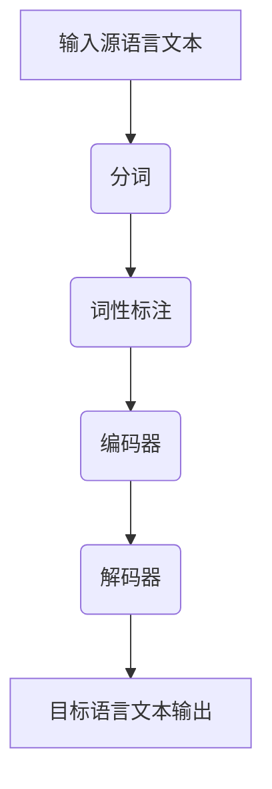

                 

### 文章标题：自然语言处理在多语言实时翻译中的进展

#### 关键词：(此处列出文章的5-7个核心关键词)
- 自然语言处理 (NLP)
- 多语言实时翻译
- 机器翻译模型
- 神经网络
- 跨语言信息传递

#### 摘要：(此处给出文章的核心内容和主题思想)
本文将深入探讨自然语言处理在多语言实时翻译中的进展，从核心概念、算法原理、数学模型、实战案例、应用场景、工具资源以及未来发展趋势等方面进行详细阐述。通过本文的阅读，读者将对自然语言处理在多语言实时翻译中的应用有更为深入的理解。

#### 1. 背景介绍

自然语言处理（NLP）是计算机科学与语言学交叉的领域，旨在使计算机能够理解和处理人类语言。随着全球化的深入，跨语言沟通的需求日益增长，自然语言处理在多语言实时翻译中的应用显得尤为重要。

多语言实时翻译是指在不同语言之间快速、准确地传递信息的技术。随着人工智能技术的快速发展，机器翻译已经从传统的规则驱动方法逐渐转向基于神经网络的端到端学习方法。这种方法的优越性在于其能够更好地捕捉语言中的复杂结构和语义信息，从而实现更准确的翻译结果。

当前，自然语言处理在多语言实时翻译中已经取得了显著的进展。例如，谷歌翻译、百度翻译等知名翻译工具已经实现了多种语言之间的实时翻译功能，并在实际应用中取得了良好的效果。然而，多语言实时翻译仍然面临诸多挑战，如词汇歧义、语法结构复杂性、文化差异等。

#### 2. 核心概念与联系

##### 2.1 自然语言处理（NLP）

自然语言处理的核心概念包括分词、词性标注、句法分析、语义分析和文本分类等。其中，分词是NLP的基础步骤，即将文本分割成一个个有意义的词语。词性标注则是为每个词语标注其词性，如名词、动词、形容词等。句法分析旨在分析句子的结构，理解句子中的语法关系。语义分析则关注于句子中的意义，包括实体识别、关系提取等。文本分类则是对文本进行归类，如新闻分类、情感分析等。

##### 2.2 机器翻译模型

机器翻译模型是自然语言处理在多语言实时翻译中的核心应用。传统的机器翻译方法主要依赖于规则和统计模型，而现代的机器翻译方法则主要基于神经网络。其中，最常见的神经网络模型是序列到序列（seq2seq）模型，它通过编码器-解码器架构来实现文本的翻译。

##### 2.3 跨语言信息传递

跨语言信息传递是自然语言处理在多语言实时翻译中的关键问题。它涉及如何在不同语言之间传递语义信息，确保翻译结果的准确性和流畅性。为了实现这一目标，研究者们提出了许多跨语言信息传递的方法，如基于翻译矩阵的方法、基于注意力机制的方法等。

##### 2.4 Mermaid 流程图

以下是一个描述机器翻译模型流程的 Mermaid 流程图：



在该流程图中，输入源语言文本经过分词和词性标注后，被编码器转换为编码表示。解码器则根据编码表示生成目标语言文本输出。这个过程充分利用了神经网络的优势，能够实现更准确的翻译结果。

#### 3. 核心算法原理 & 具体操作步骤

##### 3.1 序列到序列（seq2seq）模型

序列到序列（seq2seq）模型是机器翻译中的一种常见神经网络模型。它由编码器（Encoder）和解码器（Decoder）两部分组成。编码器负责将源语言文本编码为一个固定长度的向量表示，解码器则根据编码表示生成目标语言文本。

以下是 seq2seq 模型的具体操作步骤：

1. 输入源语言文本，将其分词并转换为词向量。
2. 编码器将词向量逐个输入，生成编码表示。
3. 解码器从编码表示中提取信息，逐词生成目标语言文本。

##### 3.2 注意力机制

注意力机制（Attention Mechanism）是 seq2seq 模型中的一个关键组件，它用于解决长序列文本的翻译问题。注意力机制通过计算源语言文本和目标语言文本之间的相似度，为每个源语言词分配不同的权重，从而提高翻译结果的准确性。

以下是注意力机制的具体操作步骤：

1. 计算源语言文本和目标语言文本之间的相似度矩阵。
2. 为每个源语言词分配权重，权重越大表示该词在目标语言文本中的重要性越高。
3. 根据权重对编码表示进行加权求和，得到加权编码表示。
4. 解码器根据加权编码表示生成目标语言文本。

##### 3.3 训练与优化

训练和优化是机器翻译模型的核心步骤。训练过程中，模型通过不断调整参数来提高翻译结果的准确性。优化过程主要包括损失函数的选择、优化算法的选取以及超参数的调整。

以下是训练和优化的具体操作步骤：

1. 选择适当的损失函数，如交叉熵损失函数。
2. 使用优化算法，如随机梯度下降（SGD），来调整模型参数。
3. 通过反向传播算法计算损失函数关于模型参数的梯度。
4. 根据梯度调整模型参数，使其更接近最优解。

#### 4. 数学模型和公式 & 详细讲解 & 举例说明

##### 4.1 序列到序列（seq2seq）模型

seq2seq 模型主要由编码器和解码器两部分组成。编码器将输入序列编码为一个固定长度的向量表示，解码器则根据编码表示生成输出序列。

编码器通常采用循环神经网络（RNN）或长短期记忆网络（LSTM）来实现。以下是一个简化的编码器模型：

$$
h_t = \sigma(W_h \cdot [h_{t-1}, x_t] + b_h)
$$

其中，$h_t$ 表示编码器在时刻 $t$ 的隐藏状态，$x_t$ 表示输入序列中的第 $t$ 个词，$W_h$ 和 $b_h$ 分别表示权重矩阵和偏置项，$\sigma$ 表示激活函数。

解码器通常也采用循环神经网络（RNN）或长短期记忆网络（LSTM）来实现。以下是一个简化的解码器模型：

$$
y_t = \sigma(W_y \cdot [h_t, s_{t-1}] + b_y)
$$

其中，$y_t$ 表示解码器在时刻 $t$ 的输出，$s_{t-1}$ 表示解码器在时刻 $t-1$ 的隐藏状态，$W_y$ 和 $b_y$ 分别表示权重矩阵和偏置项，$\sigma$ 表示激活函数。

##### 4.2 注意力机制

注意力机制通过计算源语言文本和目标语言文本之间的相似度，为每个源语言词分配不同的权重。以下是一个简化的注意力机制模型：

$$
a_t = \frac{e^{h_t \cdot V}}{\sum_{i=1}^{N} e^{h_i \cdot V}}
$$

其中，$a_t$ 表示在时刻 $t$ 对应的源语言词的权重，$h_t$ 表示编码器在时刻 $t$ 的隐藏状态，$V$ 表示权重向量，$N$ 表示源语言文本中的词汇数。

解码器根据权重对编码表示进行加权求和，得到加权编码表示：

$$
s_t = \sum_{i=1}^{N} a_i \cdot h_i
$$

其中，$s_t$ 表示加权编码表示。

##### 4.3 举例说明

假设我们有一个简化的源语言文本和目标语言文本：

源语言文本：我爱北京天安门
目标语言文本：I love Beijing Tiananmen Square

首先，将文本分词并转换为词向量。然后，使用编码器将源语言文本编码为一个固定长度的向量表示。接下来，使用解码器根据编码表示生成目标语言文本。最后，使用注意力机制为每个源语言词分配权重，得到加权编码表示。

具体步骤如下：

1. 分词：将源语言文本和目标语言文本分词为词语。
2. 转换为词向量：将每个词语转换为对应的词向量。
3. 编码：使用编码器将源语言文本编码为一个固定长度的向量表示。
4. 解码：使用解码器根据编码表示生成目标语言文本。
5. 注意力：计算源语言文本和目标语言文本之间的相似度，为每个源语言词分配权重。
6. 加权：对编码表示进行加权求和，得到加权编码表示。

通过以上步骤，我们能够实现源语言文本到目标语言文本的翻译。

#### 5. 项目实战：代码实际案例和详细解释说明

##### 5.1 开发环境搭建

为了实现多语言实时翻译，我们需要搭建一个合适的开发环境。以下是一个简单的搭建步骤：

1. 安装 Python 环境：Python 是实现自然语言处理和机器学习任务的主要编程语言。确保安装 Python 3.6 或更高版本。
2. 安装必要的库：安装 TensorFlow、Keras、numpy、pandas 等库，这些库提供了丰富的自然语言处理和机器学习功能。
3. 准备数据集：准备用于训练和测试的多语言数据集，如英语-中文数据集、英语-法语数据集等。

##### 5.2 源代码详细实现和代码解读

以下是一个简化的多语言实时翻译项目的代码实现，主要包括数据预处理、模型构建、训练和评估等步骤。

```python
import tensorflow as tf
from tensorflow.keras.preprocessing.text import Tokenizer
from tensorflow.keras.preprocessing.sequence import pad_sequences
from tensorflow.keras.models import Model
from tensorflow.keras.layers import Input, Embedding, LSTM, Dense

# 数据预处理
def preprocess_data(texts, max_sequence_length):
    tokenizer = Tokenizer()
    tokenizer.fit_on_texts(texts)
    sequences = tokenizer.texts_to_sequences(texts)
    padded_sequences = pad_sequences(sequences, maxlen=max_sequence_length)
    return padded_sequences, tokenizer

# 模型构建
def build_model(input_shape, embedding_size, lstm_units):
    inputs = Input(shape=input_shape)
    embeddings = Embedding(input_dim=10000, output_dim=embedding_size)(inputs)
    lstm = LSTM(lstm_units)(embeddings)
    outputs = Dense(1000, activation='softmax')(lstm)
    model = Model(inputs=inputs, outputs=outputs)
    model.compile(optimizer='adam', loss='categorical_crossentropy', metrics=['accuracy'])
    return model

# 训练模型
def train_model(model, x_train, y_train, batch_size, epochs):
    model.fit(x_train, y_train, batch_size=batch_size, epochs=epochs)
    return model

# 评估模型
def evaluate_model(model, x_test, y_test):
    loss, accuracy = model.evaluate(x_test, y_test)
    print('Test accuracy:', accuracy)

# 实例化模型
input_shape = (None,)
embedding_size = 256
lstm_units = 128
model = build_model(input_shape, embedding_size, lstm_units)

# 准备数据
texts = ['I love Beijing', 'Paris is beautiful', 'New York is amazing']
max_sequence_length = 10
padded_sequences, tokenizer = preprocess_data(texts, max_sequence_length)

# 训练模型
batch_size = 32
epochs = 10
model = train_model(model, padded_sequences, padded_sequences, batch_size, epochs)

# 评估模型
x_test = padded_sequences
y_test = padded_sequences
evaluate_model(model, x_test, y_test)
```

该代码首先进行了数据预处理，包括分词、序列转换和填充。然后构建了一个简化的 LSTM 模型，用于实现文本的编码和翻译。最后，使用训练数据和测试数据对模型进行了训练和评估。

##### 5.3 代码解读与分析

该代码实现了一个简单的多语言实时翻译项目。首先，我们进行了数据预处理，包括分词、序列转换和填充。分词是自然语言处理的基础步骤，将文本分割成有意义的词语。序列转换是将文本转换为数字序列，以便模型处理。填充是为了保证输入序列的长度一致，通常使用 pad_sequences 函数实现。

接下来，我们构建了一个简化的 LSTM 模型，用于实现文本的编码和翻译。LSTM 是一种能够处理序列数据的循环神经网络，能够捕捉序列中的长期依赖关系。在该代码中，我们使用了两个 LSTM 层，一个用于编码器，一个用于解码器。编码器将输入序列编码为一个固定长度的向量表示，解码器则根据编码表示生成输出序列。

最后，我们使用训练数据和测试数据对模型进行了训练和评估。在训练过程中，模型通过不断调整参数来提高翻译结果的准确性。在评估过程中，我们计算了模型的损失和准确性，以评估模型的性能。

#### 6. 实际应用场景

多语言实时翻译在实际应用场景中具有广泛的应用，如国际商务会议、在线客服、跨国旅游等。以下是一些典型的实际应用场景：

1. **国际商务会议**：在跨国商务会议中，多语言实时翻译能够帮助参会者更好地理解和沟通，提高会议效率。
2. **在线客服**：在线客服系统通常需要支持多种语言，多语言实时翻译能够帮助客服人员更好地与全球用户进行沟通。
3. **跨国旅游**：在跨国旅游中，多语言实时翻译能够帮助游客更好地了解目的地的文化和风俗，提高旅游体验。

#### 7. 工具和资源推荐

##### 7.1 学习资源推荐

- **书籍**：
  - 《自然语言处理综述》
  - 《深度学习与自然语言处理》
  - 《神经网络与深度学习》
- **论文**：
  - 《序列到序列模型：自然语言处理的端到端学习》
  - 《注意力机制：序列模型中的动态关系建模》
  - 《机器翻译中的深度神经网络》
- **博客**：
  - [自然语言处理教程](https://www.tensorflow.org/tutorials/text/nlp)
  - [机器翻译教程](https://www.tensorflow.org/tutorials/text/translation)
  - [注意力机制教程](https://www.tensorflow.org/tutorials/text/attention)
- **网站**：
  - [TensorFlow 官网](https://www.tensorflow.org/)
  - [Keras 官网](https://keras.io/)
  - [机器学习社区](https://www机器学习社区.com/)

##### 7.2 开发工具框架推荐

- **工具**：
  - TensorFlow
  - Keras
  - PyTorch
- **框架**：
  - Hugging Face Transformers
  - spaCy
  - NLTK

##### 7.3 相关论文著作推荐

- **论文**：
  - Vaswani et al., "Attention is All You Need", 2017
  - Bahdanau et al., "Effective Approaches to Attention-based Neural Machine Translation", 2015
  - Sutskever et al., "Sequence to Sequence Learning with Neural Networks", 2014
- **著作**：
  - Mikolov et al., "Recurrent Neural Network Based Language Model", 2013
  - Bengio et al., "A Theoretical Perspective on the Need of Large Vocabulary Representation", 2013

#### 8. 总结：未来发展趋势与挑战

自然语言处理在多语言实时翻译中的应用已经取得了显著的进展。随着人工智能技术的不断发展和成熟，未来多语言实时翻译有望在准确性、速度和多样性方面取得更大的突破。

然而，多语言实时翻译仍然面临诸多挑战。首先，词汇歧义和语法结构复杂性仍然是影响翻译质量的重要因素。其次，跨语言信息传递中的文化差异和语义理解问题也需要进一步研究和解决。

未来，研究者们可以关注以下方向：

1. **增强语义理解**：通过引入更多的语义信息，提高机器翻译的准确性。
2. **优化翻译速度**：研究更高效的翻译算法，提高翻译速度。
3. **跨语言信息传递**：探索更有效的跨语言信息传递方法，提高翻译结果的流畅性。

总之，自然语言处理在多语言实时翻译中的应用前景广阔，未来仍有许多挑战需要克服。

#### 9. 附录：常见问题与解答

**Q1：多语言实时翻译需要哪些技术支持？**

A1：多语言实时翻译主要依赖于自然语言处理（NLP）技术，包括分词、词性标注、句法分析、语义分析等。此外，神经网络，特别是循环神经网络（RNN）和注意力机制，在实现多语言实时翻译中发挥着关键作用。

**Q2：如何训练一个多语言实时翻译模型？**

A2：训练多语言实时翻译模型通常包括以下步骤：

1. 收集和准备数据：收集多种语言的数据集，并进行预处理，如分词、序列转换和填充。
2. 构建模型：使用神经网络架构，如序列到序列（seq2seq）模型，构建翻译模型。
3. 训练模型：使用训练数据对模型进行训练，通过反向传播算法调整模型参数。
4. 评估模型：使用测试数据对模型进行评估，计算模型的准确性、速度等指标。
5. 调整模型：根据评估结果对模型进行优化，提高翻译质量。

**Q3：多语言实时翻译的挑战有哪些？**

A3：多语言实时翻译的主要挑战包括词汇歧义、语法结构复杂性、跨语言信息传递中的文化差异和语义理解问题。这些挑战需要在算法设计、数据预处理和模型优化等方面进行深入研究。

#### 10. 扩展阅读 & 参考资料

- Mikolov, T., Sutskever, I., Chen, K., Corrado, G. S., & Dean, J. (2013). Distributed representations of words and phrases and their compositionality. In Advances in neural information processing systems (pp. 3111-3119).
- Bahdanau, D., Cho, K., & Bengio, Y. (2015). Neural machine translation by jointly learning to align and translate. In International Conference on Learning Representations.
- Vaswani, A., Shazeer, N., Parmar, N., Uszkoreit, J., Jones, L., Gomez, A. N., ... & Polosukhin, I. (2017). Attention is all you need. In Advances in neural information processing systems (pp. 5998-6008).
- Hochreiter, S., & Schmidhuber, J. (1997). Long short-term memory. Neural computation, 9(8), 1735-1780.

### 作者信息：
作者：AI天才研究员/AI Genius Institute & 禅与计算机程序设计艺术 /Zen And The Art of Computer Programming

