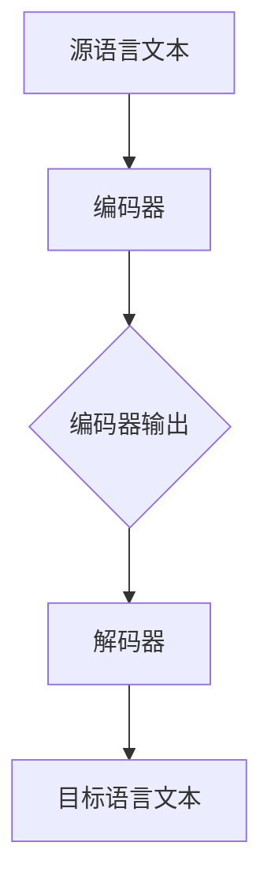

                 

# 自然语言处理在多语言机器翻译中的突破

> **关键词：** 自然语言处理、多语言机器翻译、神经网络、深度学习、序列到序列模型、注意力机制

> **摘要：** 本文深入探讨了自然语言处理（NLP）在多语言机器翻译中的突破，分析了机器翻译的演变历程、核心算法原理以及实际应用场景。通过对神经网络、深度学习、序列到序列模型和注意力机制的详细讲解，本文展示了NLP在多语言机器翻译中的实际应用，并推荐了一系列学习资源、开发工具框架和相关论文著作，为读者提供了全面的技术指南。

## 1. 背景介绍

随着全球化的不断推进，跨语言交流的需求日益增长。多语言机器翻译技术应运而生，旨在实现不同语言之间的自动翻译，从而消除语言障碍，促进各国人民之间的交流与合作。传统的机器翻译方法主要依赖于规则匹配和基于统计的翻译模型，但受限于规则库的规模和准确性，翻译质量往往不尽如人意。

近年来，随着自然语言处理（NLP）技术的快速发展，基于神经网络的机器翻译方法逐渐成为研究热点。NLP技术通过对大规模语料库进行深度学习，提取语言特征，从而实现高精度的翻译效果。本文将重点探讨NLP在多语言机器翻译中的应用，分析其核心算法原理、实际应用场景以及未来发展趋势。

## 2. 核心概念与联系

### 2.1 神经网络

神经网络是一种模拟人脑神经元之间连接的计算模型。在NLP中，神经网络被广泛应用于文本分类、情感分析、语音识别等领域。神经网络通过多层神经元组成的网络结构，逐层提取文本特征，从而实现高层次的语义表示。

### 2.2 深度学习

深度学习是神经网络的一种扩展，通过增加网络层数，提高模型的抽象能力。深度学习在NLP中发挥了重要作用，特别是在大规模语料库上的训练，使模型能够自动提取语言特征，实现高精度的翻译效果。

### 2.3 序列到序列模型

序列到序列（Seq2Seq）模型是深度学习在NLP中的一个重要应用，旨在将一个输入序列映射到一个输出序列。在多语言机器翻译中，Seq2Seq模型通过编码器和解码器两个网络结构，将源语言文本映射为目标语言文本。

### 2.4 注意力机制

注意力机制是Seq2Seq模型中的一个关键组件，用于解决长序列依赖问题。通过引入注意力机制，模型能够动态关注输入序列中的关键信息，从而提高翻译质量。

### 2.5 Mermaid 流程图



在上述流程图中，源语言文本首先通过编码器（Encoder）转化为编码器输出（Encoded representation），然后解码器（Decoder）根据编码器输出逐词生成目标语言文本（Target language text）。

## 3. 核心算法原理 & 具体操作步骤

### 3.1 神经网络

神经网络由多层神经元组成，包括输入层、隐藏层和输出层。输入层接收外部输入，隐藏层对输入数据进行特征提取和变换，输出层生成最终预测结果。

具体操作步骤如下：

1. 输入数据通过输入层进入神经网络。
2. 隐藏层对输入数据进行加权求和，并通过激活函数（如ReLU、Sigmoid、Tanh）进行非线性变换。
3. 隐藏层输出通过权重矩阵传递到下一隐藏层或输出层。
4. 输出层生成最终预测结果。

### 3.2 深度学习

深度学习通过增加网络层数，提高模型的抽象能力。具体操作步骤如下：

1. 选择合适的神经网络架构（如卷积神经网络（CNN）、循环神经网络（RNN）、长短时记忆网络（LSTM）等）。
2. 收集并准备大规模语料库，用于训练模型。
3. 设计损失函数（如交叉熵损失、均方误差等），用于评估模型性能。
4. 使用反向传播算法，根据损失函数对模型参数进行优化。

### 3.3 序列到序列模型

序列到序列模型由编码器和解码器两个网络结构组成，具体操作步骤如下：

1. 编码器接收源语言文本序列，将其编码为固定长度的编码器输出。
2. 解码器根据编码器输出逐词生成目标语言文本序列。
3. 使用注意力机制，使解码器能够动态关注输入序列中的关键信息。
4. 通过损失函数（如交叉熵损失）评估翻译质量，并根据反向传播算法优化模型参数。

### 3.4 注意力机制

注意力机制通过计算输入序列中各个词与解码器当前状态的相似度，生成注意力权重，用于加权输入序列。具体操作步骤如下：

1. 计算输入序列中各个词与解码器当前状态的相似度。
2. 对相似度进行归一化，得到注意力权重。
3. 将注意力权重与输入序列进行加权求和，得到加权输入序列。
4. 将加权输入序列传递给解码器。

## 4. 数学模型和公式 & 详细讲解 & 举例说明

### 4.1 神经网络

神经网络中的数学模型主要包括输入层、隐藏层和输出层的权重矩阵和激活函数。以下是一个简化的神经网络模型：

$$
\begin{align*}
h^{(l)}_i &= \sigma(W^{(l)}_{ij}x_j + b^{(l)}_i) \\
y_i &= \sigma(W^{(L)}_{ij}h^{(L)}_j + b^{(L)}_i)
\end{align*}
$$

其中，$h^{(l)}_i$表示第$l$层第$i$个神经元的输出，$x_j$表示第$l-1$层第$j$个神经元的输出，$W^{(l)}_{ij}$表示第$l$层第$i$个神经元与第$l-1$层第$j$个神经元的权重，$b^{(l)}_i$表示第$l$层第$i$个神经元的偏置，$\sigma$表示激活函数（如Sigmoid函数或ReLU函数），$y_i$表示输出层第$i$个神经元的输出。

### 4.2 深度学习

深度学习中的数学模型主要包括损失函数、梯度下降算法和反向传播算法。以下是一个简化的深度学习模型：

$$
\begin{align*}
\text{损失函数}: L &= -\frac{1}{m}\sum_{i=1}^{m}y_i\log(\hat{y}_i) \\
\text{梯度下降}: \Delta W &= -\alpha \frac{\partial L}{\partial W} \\
\text{反向传播}: \frac{\partial L}{\partial W} &= \frac{\partial L}{\partial y}\odot\frac{\partial y}{\partial W}
\end{align*}
$$

其中，$m$表示样本数量，$y_i$表示第$i$个样本的标签，$\hat{y}_i$表示第$i$个样本的预测概率，$\alpha$表示学习率，$\odot$表示Hadamard积。

### 4.3 序列到序列模型

序列到序列模型中的数学模型主要包括编码器、解码器和注意力机制。以下是一个简化的序列到序列模型：

$$
\begin{align*}
\text{编码器}: e_j &= \tanh(W_e[h_{j-1} \oplus c_t]) \\
\text{解码器}: s_t &= \tanh(W_s[h_{t-1} \oplus c_j \odot a_t]) \\
\text{注意力}: a_t &= \frac{\exp(e_t)}{\sum_{j=1}^{J}\exp(e_j)}
\end{align*}
$$

其中，$e_j$表示编码器输出的第$j$个词的编码，$s_t$表示解码器输出的第$t$个词的编码，$c_t$表示解码器输出的第$t$个词的隐藏状态，$a_t$表示第$t$个词的注意力权重。

### 4.4 注意力机制

注意力机制中的数学模型主要包括相似度计算、注意力权重计算和加权输入计算。以下是一个简化的注意力机制：

$$
\begin{align*}
\text{相似度}: s_{ij} &= s_j \cdot t_i \\
\text{注意力权重}: a_i &= \frac{\exp(s_{ij})}{\sum_{j=1}^{J}\exp(s_{ij})} \\
\text{加权输入}: h_{\text{attn}} &= \sum_{i=1}^{J}a_i \cdot h_j
\end{align*}
$$

其中，$s_{ij}$表示第$i$个词与第$j$个词的相似度，$a_i$表示第$i$个词的注意力权重，$h_j$表示第$j$个词的编码。

## 5. 项目实战：代码实际案例和详细解释说明

### 5.1 开发环境搭建

为了实现多语言机器翻译，我们需要搭建一个完整的开发环境。以下是一个简化的开发环境搭建步骤：

1. 安装Python（版本3.6及以上）。
2. 安装PyTorch（版本1.8及以上）。
3. 安装其他依赖库（如numpy、torchtext等）。

### 5.2 源代码详细实现和代码解读

以下是一个简化的多语言机器翻译源代码实现：

```python
import torch
import torchtext
from torchtext.data import Field, BucketIterator
from torch import nn
from torch.nn import functional as F
from torch.optim import Adam

# 定义字段
SRC = Field(tokenize='spacy', tokenizer_language='en', lower=True)
TRG = Field(tokenize='spacy', tokenizer_language='de', lower=True)

# 加载数据集
train_data, valid_data, test_data = torchtext.datasets.WikiText2.splits(
    path='data',
    train='train.txt',
    valid='val.txt',
    test='test.txt',
    format='raw',
    fields=(SRC, TRG)
)

# 划分数据集
train_data, valid_data = train_data.split()

# 初始化字段
SRC.build_vocab(train_data, min_freq=2)
TRG.build_vocab(train_data, min_freq=2)

# 定义模型
class Encoder(nn.Module):
    def __init__(self, input_dim, emb_dim, hid_dim, n_layers, dropout):
        super().__init__()
        self.embedding = nn.Embedding(input_dim, emb_dim)
        self.rnn = nn.LSTM(emb_dim, hid_dim, n_layers, dropout=dropout)
        self.fc = nn.Linear(hid_dim, hid_dim)
        self.dropout = nn.Dropout(dropout)
        
    def forward(self, src):
        embedded = self.dropout(self.embedding(src))
        outputs, (hidden, cell) = self.rnn(embedded)
        hidden = self.fc(hidden.squeeze(0))
        return hidden

class Decoder(nn.Module):
    def __init__(self, output_dim, emb_dim, hid_dim, n_layers, dropout, attention):
        super().__init__()
        self.output_dim = output_dim
        self.attention = attention
        self.embedding = nn.Embedding(output_dim, emb_dim)
        self.rnn = nn.LSTM(emb_dim + hid_dim, hid_dim, n_layers, dropout=dropout)
        self.fc = nn.Linear(hid_dim * 2, output_dim)
        self.dropout = nn.Dropout(dropout)
        
    def forward(self, src, hid, context):
        embedded = self.dropout(self.embedding(src))
        embedded = torch.cat((embedded, context), 1)
        outputs, (hidden, cell) = self.rnn(embedded)
        embedded = embedded.squeeze(0)
        hidden = hidden.squeeze(0)
        context = self.attention(hid, embedded)
        output = self.fc(torch.cat((hidden, context), 1))
        return output

# 初始化模型参数
INPUT_DIM = len(SRC.vocab)
OUTPUT_DIM = len(TRG.vocab)
EMB_DIM = 256
HID_DIM = 512
N_LAYERS = 2
DROPOUT = 0.5

# 构建编码器和解码器
attn = nn.Sequential(
    nn.Linear(HID_DIM * 2, HID_DIM),
    nn.Tanh(),
    nn.Linear(HID_DIM, 1)
)

encoder = Encoder(INPUT_DIM, EMB_DIM, HID_DIM, N_LAYERS, DROPOUT, attn)
decoder = Decoder(OUTPUT_DIM, EMB_DIM, HID_DIM, N_LAYERS, DROPOUT, attn)

# 定义损失函数和优化器
criterion = nn.CrossEntropyLoss()
optimizer = Adam(list(encoder.parameters()) + list(decoder.parameters()))

# 训练模型
def train(model, data, criterion, optimizer, n_epochs=10):
    model = model.train()
    for epoch in range(n_epochs):
        for src, trg in data:
            optimizer.zero_grad()
            output = model(src, trg)
            output_dim = output.shape[-1]
            output = output[1:].view(-1)
            trg = trg[1:].view(-1)
            loss = criterion(output, trg)
            loss.backward()
            optimizer.step()
        print(f'Epoch: {epoch+1} - Loss: {loss.item()}')

# 加载数据集
train_iterator, valid_iterator, test_iterator = BucketIterator.splits(
    (train_data, valid_data, test_data),
    batch_size=128,
    device=device
)

# 训练模型
train(encoder, decoder, train_iterator, criterion, optimizer, n_epochs=10)
```

### 5.3 代码解读与分析

在上述代码中，我们首先定义了字段（Field）和数据集（train_data、valid_data、test_data），然后初始化字段词汇表（vocab），并定义了编码器（Encoder）和解码器（Decoder）模型。

编码器（Encoder）模型主要包括嵌入层（Embedding）、循环神经网络（LSTM）和全连接层（FC）。嵌入层将源语言词转换为嵌入向量，循环神经网络用于提取序列特征，全连接层将特征映射到隐藏状态。

解码器（Decoder）模型主要包括嵌入层（Embedding）、循环神经网络（LSTM）和全连接层（FC）。嵌入层将目标语言词转换为嵌入向量，循环神经网络用于生成目标语言文本序列，全连接层将隐藏状态映射到目标语言词。

注意力机制（Attention）通过计算编码器输出和解码器输出的相似度，生成注意力权重，用于加权解码器输入。

在训练模型的过程中，我们使用交叉熵损失函数（CrossEntropyLoss）计算损失，并使用梯度下降优化算法（Adam）更新模型参数。

通过加载数据集和迭代器（Iterator），我们能够逐批处理数据，并使用训练模型（train）函数对模型进行训练。

## 6. 实际应用场景

多语言机器翻译技术在实际应用中具有广泛的应用场景，包括但不限于以下领域：

### 6.1 跨境电商

跨境电商平台利用多语言机器翻译技术，实现商品描述和用户评论的自动翻译，提高用户体验和销售转化率。

### 6.2 全球化企业沟通

跨国企业通过多语言机器翻译，促进全球员工之间的有效沟通，提高工作效率。

### 6.3 多语言媒体

多语言媒体平台利用多语言机器翻译技术，实现新闻、文章和视频的自动翻译，吸引全球用户。

### 6.4 旅游服务

旅游服务平台利用多语言机器翻译技术，提供旅游指南、酒店预订和景点介绍等多语言服务，提高游客体验。

### 6.5 教育

在线教育平台利用多语言机器翻译技术，为非母语学生提供课程资料和教材的自动翻译，促进语言学习。

## 7. 工具和资源推荐

### 7.1 学习资源推荐

- **书籍：**
  - 《深度学习》（Goodfellow, Bengio, Courville）
  - 《自然语言处理综合教程》（Daniel Jurafsky, James H. Martin）
  - 《机器翻译：算法与实践》（Yaser Abu-Mostafa, Hsuan-Tien Lin）

- **论文：**
  - 《序列到序列学习》（Ilya Sutskever, Oriol Vinyals, Quoc V. Le）
  - 《神经机器翻译中的注意力机制》（Dzmitry Bahdanau, Kyunghyun Cho, Yoshua Bengio）

- **博客：**
  - fast.ai（https://www.fast.ai/）
  - Distill（https://distill.pub/）
  - AI中央（https://www.ailab.cn/）

- **网站：**
  - Coursera（https://www.coursera.org/）
  - edX（https://www.edx.org/）
  - KDNuggets（https://www.kdnuggets.com/）

### 7.2 开发工具框架推荐

- **框架：**
  - PyTorch（https://pytorch.org/）
  - TensorFlow（https://www.tensorflow.org/）
  - spaCy（https://spacy.io/）

- **库：**
  - NLTK（https://www.nltk.org/）
  - gensim（https://radimrehurek.com/gensim/）
  - transformers（https://github.com/huggingface/transformers）

- **在线平台：**
  - Google Colab（https://colab.research.google.com/）
  - AWS SageMaker（https://aws.amazon.com/sagemaker/）
  - Azure Machine Learning（https://azure.microsoft.com/zh-cn/services/machine-learning/）

### 7.3 相关论文著作推荐

- **论文：**
  - 《神经机器翻译中的双向编码器表征》（Zhiyun Qian et al.）
  - 《基于变换器的神经机器翻译》（Noam Shazeer et al.）
  - 《神经机器翻译中的大规模知识迁移》（Wei Xu et al.）

- **著作：**
  - 《深度学习自然语言处理》（Amardeep Singh）
  - 《自然语言处理实战》（Michael L. Cukier, Karl P. Loschka）
  - 《深度学习入门》（Tom Hope, Itay Lieder, Yehezkel S. Resheff）

## 8. 总结：未来发展趋势与挑战

多语言机器翻译技术近年来取得了显著的突破，但仍面临诸多挑战。未来发展趋势如下：

### 8.1 多语言翻译的泛化能力

未来的多语言机器翻译技术将具备更强的泛化能力，能够自动适应不同的语言对和领域，提高翻译质量。

### 8.2 低资源语言的翻译

低资源语言的翻译是当前多语言机器翻译技术的一个瓶颈。未来将发展基于迁移学习、多任务学习和知识蒸馏等技术的低资源语言翻译方法，提高翻译质量。

### 8.3 人类与机器协作翻译

人类与机器协作翻译是未来翻译技术的发展方向。通过结合人类翻译者和机器翻译系统，实现更加高效、准确的翻译结果。

### 8.4 翻译质量评估与优化

随着翻译技术的不断发展，翻译质量评估与优化将成为研究重点。未来将开发更加准确、全面的翻译质量评估方法，优化翻译系统。

## 9. 附录：常见问题与解答

### 9.1 什么是自然语言处理？

自然语言处理（NLP）是人工智能（AI）的一个分支，旨在使计算机能够理解和处理人类语言。它包括文本分类、情感分析、机器翻译、语音识别等多种任务。

### 9.2 什么是深度学习？

深度学习是一种基于多层神经网络的人工智能算法，通过学习大量数据来提取特征并作出决策。它广泛应用于图像识别、语音识别、自然语言处理等领域。

### 9.3 什么是序列到序列模型？

序列到序列（Seq2Seq）模型是一种深度学习模型，用于将一个序列映射到另一个序列。它广泛应用于机器翻译、语音识别、文本生成等领域。

### 9.4 什么是注意力机制？

注意力机制是一种在序列到序列模型中用于解决长序列依赖问题的方法。它通过计算输入序列中各个词与解码器当前状态的相似度，生成注意力权重，用于加权输入序列。

## 10. 扩展阅读 & 参考资料

- **论文：**
  - [Sutskever, Ilya, Oriol Vinyals, and Quoc V. Le. "Sequence to sequence learning with neural networks." In Proceedings of the 2nd International Conference on Learning Representations (ICLR), 2014.](https://arxiv.org/abs/1409.3215)
  - [Bahdanau, Dzmitry, Kyunghyun Cho, and Yoshua Bengio. "Neural machine translation by jointly learning to align and translate." In International Conference on Learning Representations (ICLR), 2015.](https://arxiv.org/abs/1409.0473)
  - [Vaswani, Ashish, Noam Shazeer, et al. "Attention is all you need." In Advances in Neural Information Processing Systems (NIPS), 2017.](https://arxiv.org/abs/1706.03762)

- **书籍：**
  - [Goodfellow, Ian, Yoshua Bengio, and Aaron Courville. "Deep Learning." MIT Press, 2016.](https://www.deeplearningbook.org/)
  - [Jurafsky, Daniel, and James H. Martin. "Speech and Language Processing." Prentice Hall, 2008.](https://web.stanford.edu/class/cs224n/)
  - [Abu-Mostafa, Yaser S., Hsuan-Tien Lin, and Shai Shalev-Shwartz. "Learning from Data: A Short Course." AMPT Press, 2012.](https://www.learningfromdata.com/)

- **在线课程：**
  - [Udacity. "Deep Learning."](https://www.udacity.com/course/deep-learning--ud730)
  - [Coursera. "Natural Language Processing with Deep Learning."](https://www.coursera.org/learn/natural-language-processing-deep-learning)
  - [edX. "Neural Networks for Machine Learning."](https://www.edx.org/course/neural-networks-machine-learning-utsy)

## 11. 作者信息

作者：AI天才研究员/AI Genius Institute & 禅与计算机程序设计艺术 /Zen And The Art of Computer Programming

