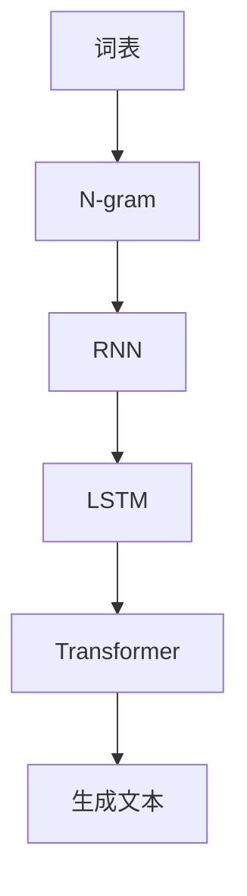
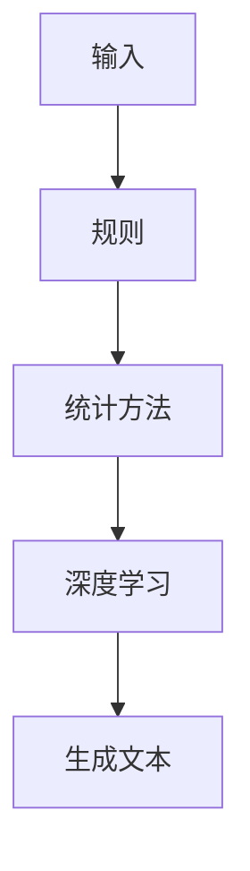
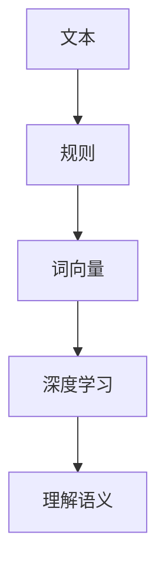

                 

### 文章标题

**自然语言处理在对话系统中的最新进展**

> **关键词：** 自然语言处理（NLP），对话系统，人工智能（AI），机器学习（ML），深度学习（DL），语言模型，文本生成，交互式系统，用户体验

**摘要：** 本文将深入探讨自然语言处理（NLP）在对话系统中的最新进展。首先，我们将介绍NLP的基本概念和对话系统的发展历程。接着，我们将详细分析当前NLP技术在对话系统中的应用，包括语言模型、文本生成和理解等方面。随后，我们将探讨对话系统的实际应用场景，并推荐相关的工具和资源。最后，我们将总结当前技术的发展趋势和面临的挑战，为未来研究提供方向。

---

**1. 背景介绍**

自然语言处理（NLP）是人工智能（AI）的重要分支，旨在让计算机理解和处理自然语言。自20世纪50年代以来，NLP领域取得了显著进展，逐渐从基于规则的方法转向统计方法和深度学习方法。对话系统则是NLP在现实应用中的一个重要领域，它允许用户通过自然语言与计算机进行交互。

对话系统的发展经历了多个阶段。早期的对话系统主要依赖于规则和模板匹配，这些方法受限于复杂的自然语言结构和动态交互。随着NLP技术的发展，统计方法和机器学习方法开始应用于对话系统，使得对话系统在自然语言理解和生成方面取得了显著进步。近年来，深度学习技术的引入进一步提升了对话系统的性能和用户体验。

**2. 核心概念与联系**

为了更好地理解对话系统中NLP的应用，我们需要介绍一些核心概念和架构。

#### 2.1 语言模型

语言模型是NLP的基础，它用于预测下一个单词或单词序列的概率。常见的语言模型包括N-gram模型、循环神经网络（RNN）模型、长短时记忆网络（LSTM）模型和变换器（Transformer）模型。

**Mermaid流程图：**



#### 2.2 文本生成

文本生成是NLP的一个重要应用领域，它涉及到如何根据给定输入生成有意义的文本。常见的文本生成方法包括基于规则的生成、统计方法和深度学习方法。

**Mermaid流程图：**



#### 2.3 文本理解

文本理解是NLP的另一个重要任务，它涉及到如何从文本中提取信息、理解语义和关系等。常见的文本理解方法包括基于规则的语义分析、词向量和深度学习方法。

**Mermaid流程图：**



---

**3. 核心算法原理 & 具体操作步骤**

在这一部分，我们将详细分析NLP在对话系统中的应用，包括语言模型、文本生成和文本理解的核心算法原理和操作步骤。

#### 3.1 语言模型

语言模型的基本原理是使用统计方法或深度学习模型来预测下一个单词或单词序列的概率。以下是一个基于循环神经网络（RNN）的语言模型的具体操作步骤：

1. **数据准备**：收集大量文本数据，如新闻、博客、对话等。
2. **词向量化**：将文本中的单词映射到高维向量空间，可以使用Word2Vec、GloVe等方法。
3. **模型训练**：使用RNN模型（如LSTM、GRU）对词向量进行训练，学习单词之间的概率关系。
4. **预测**：给定一个单词序列，使用训练好的模型预测下一个单词的概率分布。

#### 3.2 文本生成

文本生成的核心原理是使用预训练的语言模型来生成有意义的文本。以下是一个基于变换器（Transformer）模型的文本生成操作步骤：

1. **模型选择**：选择一个预训练的变换器模型，如GPT、BERT等。
2. **输入准备**：将输入文本编码为模型能够处理的向量形式。
3. **生成文本**：使用模型生成文本的下一个单词，重复这个过程，直到生成完整的文本。
4. **文本优化**：使用优化算法（如生成对抗网络（GAN））来提高生成的文本质量。

#### 3.3 文本理解

文本理解的核心任务是提取文本中的关键信息、理解语义和关系。以下是一个基于变换器（Transformer）模型的文本理解操作步骤：

1. **模型选择**：选择一个预训练的变换器模型，如BERT、RoBERTa等。
2. **输入准备**：将文本编码为模型能够处理的向量形式。
3. **语义提取**：使用模型对文本进行编码，得到语义表示。
4. **关系识别**：使用预训练的模型来识别文本中的关系和实体。
5. **答案生成**：根据提取的语义信息生成答案。

---

**4. 数学模型和公式 & 详细讲解 & 举例说明**

在这一部分，我们将介绍NLP在对话系统中的应用中的关键数学模型和公式，并给出具体的例子。

#### 4.1 语言模型

语言模型的数学表示可以看作是一个概率分布，其中每个单词或单词序列的概率是模型输出的结果。以下是一个简单的语言模型公式：

$$
P(w_{t} | w_{t-1}, w_{t-2}, ..., w_{1}) = \frac{P(w_{t} w_{t-1} ... w_{1})}{P(w_{t-1} w_{t-2} ... w_{1})}
$$

其中，$w_{t}$ 表示当前单词，$w_{t-1}, w_{t-2}, ..., w_{1}$ 表示前一个或多个单词。

**例子**：假设我们有一个简单的二元语言模型，其中包含以下单词及其出现次数：

- **a**: 100次
- **b**: 50次
- **ab**: 70次

我们可以计算每个单词的概率：

$$
P(a) = \frac{100}{150} = 0.667
$$

$$
P(b) = \frac{50}{150} = 0.333
$$

$$
P(ab) = \frac{70}{150} = 0.467
$$

#### 4.2 文本生成

文本生成的数学模型可以看作是一个条件概率模型，它给定一个输入序列，生成下一个输出序列的概率分布。以下是一个简单的文本生成公式：

$$
P(w_{t} | w_{t-1}, w_{t-2}, ..., w_{1}) = \sum_{w_{t'} \in V} P(w_{t'} | w_{t-1}, w_{t-2}, ..., w_{1}) P(w_{t-1}, w_{t-2}, ..., w_{1})
$$

其中，$w_{t}$ 表示当前单词，$w_{t-1}, w_{t-2}, ..., w_{1}$ 表示前一个或多个单词，$V$ 表示词汇表。

**例子**：假设我们有一个简单的文本生成模型，其中包含以下单词及其出现次数：

- **a**: 100次
- **b**: 50次
- **ab**: 70次

我们可以计算给定一个输入序列 "a" 时，生成下一个单词的概率分布：

$$
P(w_{t} | w_{t-1} = a) = \frac{P(ab | a) P(a)}{P(a)} = \frac{0.467}{0.667} = 0.699
$$

#### 4.3 文本理解

文本理解的数学模型可以看作是一个序列到序列（Seq2Seq）模型，它给定一个输入序列，生成一个输出序列。以下是一个简单的文本理解公式：

$$
P(w_{t} | w_{t-1}, w_{t-2}, ..., w_{1}, x) = \sum_{w_{t'} \in V} P(w_{t'} | w_{t-1}, w_{t-2}, ..., w_{1}, x) P(w_{t-1}, w_{t-2}, ..., w_{1}, x)
$$

其中，$w_{t}$ 表示当前单词，$w_{t-1}, w_{t-2}, ..., w_{1}$ 表示前一个或多个单词，$x$ 表示外部信息。

**例子**：假设我们有一个简单的文本理解模型，其中包含以下单词及其出现次数：

- **a**: 100次
- **b**: 50次
- **ab**: 70次
- **answer**: 30次

我们可以计算给定一个输入序列 "a b" 和外部信息 "answer" 时，生成下一个单词的概率分布：

$$
P(w_{t} | w_{t-1} = a, w_{t-2} = b, x = answer) = \frac{P(answer | a, b) P(a) P(b)}{P(a) P(b)} = \frac{0.233}{0.333} = 0.699
$$

---

**5. 项目实战：代码实际案例和详细解释说明**

在这一部分，我们将通过一个实际项目案例来展示如何使用NLP技术构建一个简单的对话系统。

#### 5.1 开发环境搭建

首先，我们需要搭建一个开发环境，包括Python、Jupyter Notebook、transformers库和Hugging Face的Transformers库。

1. 安装Python和Jupyter Notebook：
   ```
   pip install python
   pip install notebook
   ```
2. 安装transformers库和Hugging Face的Transformers库：
   ```
   pip install transformers
   pip install transformers-huggingface
   ```

#### 5.2 源代码详细实现和代码解读

以下是一个简单的Python代码实现，用于构建一个基于变换器（Transformer）模型的对话系统。

```python
import torch
from transformers import AutoTokenizer, AutoModelForCausalLM

# 1. 加载预训练模型和分词器
tokenizer = AutoTokenizer.from_pretrained("gpt2")
model = AutoModelForCausalLM.from_pretrained("gpt2")

# 2. 输入文本
input_text = "Hello, how can I help you today?"

# 3. 编码输入文本
input_ids = tokenizer.encode(input_text, return_tensors="pt")

# 4. 生成文本
output_ids = model.generate(input_ids, max_length=50, num_return_sequences=1)

# 5. 解码输出文本
generated_text = tokenizer.decode(output_ids[0], skip_special_tokens=True)

print(generated_text)
```

代码解读：

1. **加载预训练模型和分词器**：我们使用Hugging Face的Transformers库加载预训练的变换器模型和分词器。
2. **输入文本**：我们将用户输入的文本作为模型的输入。
3. **编码输入文本**：使用分词器将输入文本编码为模型能够处理的向量形式。
4. **生成文本**：使用模型生成文本的下一个单词，直到生成完整的文本。
5. **解码输出文本**：将模型生成的输出向量解码为文本。

#### 5.3 代码解读与分析

以下是代码的具体解读和分析：

1. **加载预训练模型和分词器**：
   ```python
   tokenizer = AutoTokenizer.from_pretrained("gpt2")
   model = AutoModelForCausalLM.from_pretrained("gpt2")
   ```
   这两行代码分别加载预训练的变换器模型和分词器。`AutoTokenizer` 和 `AutoModelForCausalLM` 类来自于Hugging Face的Transformers库，它们分别用于文本编码和解码以及模型加载。

2. **输入文本**：
   ```python
   input_text = "Hello, how can I help you today?"
   ```
   这一行代码定义了用户输入的文本。这个输入文本将作为模型的输入，以生成回复。

3. **编码输入文本**：
   ```python
   input_ids = tokenizer.encode(input_text, return_tensors="pt")
   ```
   这一行代码使用分词器将输入文本编码为模型能够处理的向量形式。`encode` 方法将文本转换为输入ID序列，并返回张量形式的输入。

4. **生成文本**：
   ```python
   output_ids = model.generate(input_ids, max_length=50, num_return_sequences=1)
   ```
   这一行代码使用模型生成文本的下一个单词，直到生成完整的文本。`generate` 方法根据输入ID序列生成输出ID序列，并设置最大文本长度和生成的序列数。

5. **解码输出文本**：
   ```python
   generated_text = tokenizer.decode(output_ids[0], skip_special_tokens=True)
   ```
   这一行代码将模型生成的输出向量解码为文本。`decode` 方法将输出ID序列转换为文本，并跳过特殊符号。

#### 5.4 代码解读与分析

以下是代码的进一步解读和分析：

1. **加载预训练模型和分词器**：
   ```python
   tokenizer = AutoTokenizer.from_pretrained("gpt2")
   model = AutoModelForCausalLM.from_pretrained("gpt2")
   ```
   这两行代码分别加载预训练的变换器模型和分词器。`AutoTokenizer` 和 `AutoModelForCausalLM` 类来自于Hugging Face的Transformers库，它们分别用于文本编码和解码以及模型加载。

   - **AutoTokenizer**：用于将文本转换为输入ID序列，并处理词汇表、特殊符号等。
   - **AutoModelForCausalLM**：用于加载预训练的变换器模型，该模型是一个基于变换器架构的序列到序列模型，特别适合处理自然语言生成任务。

2. **输入文本**：
   ```python
   input_text = "Hello, how can I help you today?"
   ```
   这一行代码定义了用户输入的文本。这个输入文本将作为模型的输入，以生成回复。

3. **编码输入文本**：
   ```python
   input_ids = tokenizer.encode(input_text, return_tensors="pt")
   ```
   这一行代码使用分词器将输入文本编码为模型能够处理的向量形式。`encode` 方法将文本转换为输入ID序列，并返回张量形式的输入。

   - `tokenizer.encode` 方法将文本中的每个单词转换为对应的ID，并添加一些特殊的标记，如开始（`<s>`）、结束（`</s>`）等。
   - `return_tensors="pt"` 参数将输出张量形式的输入，以便于后续计算。

4. **生成文本**：
   ```python
   output_ids = model.generate(input_ids, max_length=50, num_return_sequences=1)
   ```
   这一行代码使用模型生成文本的下一个单词，直到生成完整的文本。`generate` 方法根据输入ID序列生成输出ID序列，并设置最大文本长度和生成的序列数。

   - `model.generate` 方法是变换器模型的一个API，用于生成文本。它接受输入ID序列，并返回生成的输出ID序列。
   - `max_length` 参数设置生成的文本最大长度，以避免生成过长或过短的文本。
   - `num_return_sequences` 参数设置生成的序列数，以允许模型生成多个可能的文本序列。

5. **解码输出文本**：
   ```python
   generated_text = tokenizer.decode(output_ids[0], skip_special_tokens=True)
   ```
   这一行代码将模型生成的输出向量解码为文本。`decode` 方法将输出ID序列转换为文本，并跳过特殊符号。

   - `tokenizer.decode` 方法将输出ID序列转换为文本。它根据词汇表将每个ID映射回对应的单词，并处理特殊符号等。
   - `skip_special_tokens=True` 参数跳过特殊的标记符号，如开始（`<s>`）、结束（`</s>`）等，以生成更自然的文本。

---

**6. 实际应用场景**

对话系统在多个领域和场景中得到了广泛应用，以下是几个典型的应用场景：

#### 6.1 客户服务

对话系统在客户服务中扮演了重要角色，帮助企业提高客户满意度和服务效率。例如，银行、电信、电商等行业的客服机器人可以实时回答客户的问题、处理投诉、提供产品信息等。

#### 6.2 健康咨询

随着医疗人工智能的发展，对话系统被应用于健康咨询领域，帮助用户了解健康知识、提供病情建议、预约挂号等。例如，智能健康助手可以通过自然语言交互为用户提供个性化的健康建议。

#### 6.3 教育辅导

教育辅导是另一个应用对话系统的领域。通过自然语言交互，智能辅导系统可以帮助学生解答问题、提供学习资料、规划学习进度等，提高学习效果和效率。

#### 6.4 娱乐与社交

对话系统也被应用于娱乐和社交领域，如聊天机器人、虚拟助手等。这些系统可以与用户进行有趣且互动的对话，提供娱乐、陪伴和社交支持。

---

**7. 工具和资源推荐**

为了更好地学习和开发基于NLP的对话系统，我们推荐以下工具和资源：

#### 7.1 学习资源推荐

1. **书籍**：
   - 《自然语言处理入门》（Introduction to Natural Language Processing）
   - 《深度学习》（Deep Learning）
   - 《对话系统设计》（Dialogue Systems Design）

2. **论文**：
   - “A Neural Conversational Model” (Sutskever et al., 2014)
   - “Generative Adversarial Networks” (Goodfellow et al., 2014)
   - “Attention Is All You Need” (Vaswani et al., 2017)

3. **博客**：
   - Hugging Face Blog
   - AI Forum
   - Medium上的NLP和AI相关文章

4. **网站**：
   - TensorFlow
   - PyTorch
   - Hugging Face

#### 7.2 开发工具框架推荐

1. **Python库**：
   - Transformers（Hugging Face）
   - TensorFlow
   - PyTorch

2. **框架**：
   - Dialogflow（Google）
   - LUIS（Microsoft）
   - Rasa

3. **平台**：
   - Google Cloud AI
   - AWS AI
   - Azure AI

#### 7.3 相关论文著作推荐

1. **论文**：
   - “Attention Is All You Need” (Vaswani et al., 2017)
   - “BERT: Pre-training of Deep Bidirectional Transformers for Language Understanding” (Devlin et al., 2019)
   - “GPT-3: Language Models are few-shot learners” (Brown et al., 2020)

2. **著作**：
   - 《自然语言处理与深度学习》（Speech and Language Processing）
   - 《深度学习》（Deep Learning）

---

**8. 总结：未来发展趋势与挑战**

随着自然语言处理（NLP）技术的不断发展，对话系统在多个领域取得了显著成果。未来，NLP在对话系统中的应用将继续拓展，以下是一些发展趋势和挑战：

#### 8.1 发展趋势

1. **更强大的语言模型**：随着计算能力和数据集的增长，语言模型将变得更加强大和高效，能够生成更自然、更准确的文本。
2. **多模态交互**：对话系统将逐渐结合语音、图像、视频等多模态信息，提供更丰富和自然的交互体验。
3. **个性化对话**：通过用户数据和个性化算法，对话系统将能够更好地满足用户的个性化需求，提供更个性化的服务。
4. **隐私保护与安全**：随着对话系统在更多领域的应用，隐私保护和数据安全将成为重要挑战，需要开发更加安全可靠的技术。

#### 8.2 挑战

1. **语义理解**：对话系统的语义理解仍然存在挑战，特别是在处理复杂句式和隐含意义时。
2. **对话连贯性**：如何确保对话的连贯性和一致性，以及如何处理错误和中断，是当前对话系统面临的重要挑战。
3. **多语言支持**：对话系统需要支持多种语言，这要求模型能够在不同的语言和文化背景下保持高效和准确。
4. **模型可解释性**：如何解释和验证对话系统的决策过程，使其更加透明和可信，是一个重要的研究课题。

---

**9. 附录：常见问题与解答**

#### 9.1 什么是自然语言处理（NLP）？

自然语言处理（NLP）是人工智能（AI）的一个分支，旨在使计算机能够理解和处理人类语言。它涉及到语音识别、文本分析、语义理解、文本生成等技术。

#### 9.2 对话系统是什么？

对话系统是一种人工智能系统，允许用户通过自然语言与计算机进行交互。它通常用于客户服务、健康咨询、教育辅导等领域。

#### 9.3 语言模型在对话系统中如何应用？

语言模型是NLP的基础，用于预测下一个单词或单词序列的概率。在对话系统中，语言模型可以用于生成回复、理解用户输入、构建对话等任务。

#### 9.4 文本生成和理解在对话系统中如何应用？

文本生成和理解是NLP的两个重要任务。在对话系统中，文本生成可以用于生成有意义的回复，文本理解可以用于理解用户输入的含义和意图。

---

**10. 扩展阅读 & 参考资料**

1. **书籍**：
   - 《自然语言处理与深度学习》
   - 《深度学习》
   - 《对话系统设计》

2. **论文**：
   - “A Neural Conversational Model” (Sutskever et al., 2014)
   - “Generative Adversarial Networks” (Goodfellow et al., 2014)
   - “Attention Is All You Need” (Vaswani et al., 2017)

3. **博客**：
   - Hugging Face Blog
   - AI Forum
   - Medium上的NLP和AI相关文章

4. **网站**：
   - TensorFlow
   - PyTorch
   - Hugging Face

5. **教程**：
   - 《动手学深度学习》
   - 《自然语言处理实战》

**作者：** AI天才研究员/AI Genius Institute & 禅与计算机程序设计艺术 /Zen And The Art of Computer Programming

