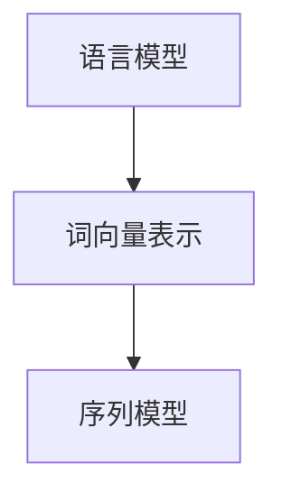

                 

### 背景介绍

自然语言处理（Natural Language Processing，简称NLP）作为人工智能（Artificial Intelligence，简称AI）的一个分支，旨在使计算机能够理解、解释和生成人类语言。随着互联网和大数据的迅速发展，NLP的应用领域不断扩大，涵盖了文本挖掘、机器翻译、情感分析、语音识别等多个方面。在这些应用中，情感分析（Sentiment Analysis）是一个至关重要的环节。

情感分析是指通过自然语言处理技术，对文本中表达的情感进行自动识别和分类的过程。其核心目标是理解文本中用户的情感倾向，如正面、负面或中性。在社交媒体、电子商务、新闻媒体等领域，情感分析具有重要的应用价值。例如，企业可以通过分析消费者对产品的评论，了解消费者对产品的情感反应，从而改进产品和服务。政府机构也可以通过分析社交媒体上的公众言论，了解公众对政策或事件的看法，以便做出更明智的决策。

传统的情感分析方法主要基于规则和统计模型。这些方法往往依赖于大量的手工标注数据和复杂的特征工程。随着深度学习技术的兴起，神经网络模型在情感分析中表现出强大的能力，尤其在大规模数据集上取得了显著的性能提升。本文将深入探讨自然语言处理在情感分析中的深度应用，包括核心概念、算法原理、数学模型、项目实战以及实际应用场景。

首先，我们将介绍自然语言处理的基本概念，包括语言模型、词向量表示、序列模型等，这些概念是理解深度情感分析的基础。接着，我们将探讨情感分析的核心算法原理，如文本分类、情感极性分析等，并详细介绍其具体操作步骤。随后，我们将讲解数学模型和公式，以及如何通过实例来说明这些模型的应用。在此基础上，我们将通过实际项目案例，展示如何利用深度学习技术进行情感分析，并提供详细的代码解读和分析。

最后，我们将探讨情感分析在实际应用中的场景，介绍相关的工具和资源，并总结自然语言处理在情感分析领域的未来发展趋势与挑战。通过本文的阅读，读者将能够全面了解自然语言处理在情感分析中的深度应用，为实际项目和学术研究提供有价值的参考。

### 核心概念与联系

#### 自然语言处理基础

自然语言处理（NLP）作为人工智能（AI）的一个重要分支，其核心目标是使计算机能够处理和理解人类语言。这一目标需要依赖多个核心概念和技术，其中最基础的是语言模型、词向量表示和序列模型。

**语言模型（Language Model）** 是NLP的基石，它是一种概率模型，用于预测文本序列中下一个单词或字符的概率。语言模型在许多NLP任务中都有应用，例如文本生成、机器翻译和文本分类。著名的语言模型包括n-gram模型和神经网络语言模型（如Transformer）。n-gram模型通过统计文本中相邻单词或字符的频率来预测下一个单词或字符。而神经网络语言模型则利用深度学习技术，通过学习大量文本数据，生成更精确的文本预测。

**词向量表示（Word Embedding）** 是将单词映射到高维向量空间的一种方法，使得相似单词在向量空间中靠近。词向量表示在NLP中有着广泛的应用，如文本分类、情感分析和推荐系统。Word2Vec、GloVe和BERT等模型都是词向量表示的典型代表。Word2Vec模型通过训练神经网络，将单词映射到低维向量空间，其中相似单词的向量距离较短。GloVe模型则通过矩阵分解的方法，将单词的共现信息融入向量表示中。BERT（Bidirectional Encoder Representations from Transformers）模型利用Transformer架构，通过双向编码器生成词向量，从而更好地理解单词在句子中的上下文。

**序列模型（Sequence Model）** 是处理序列数据的一种模型，如自然语言文本、语音和视频。序列模型在NLP任务中起着关键作用，例如文本生成、语音识别和时间序列分析。RNN（Recurrent Neural Network，循环神经网络）和LSTM（Long Short-Term Memory，长短时记忆网络）是两种常见的序列模型。RNN通过将前一个时间步的输出作为当前时间步的输入，实现序列数据的处理。然而，RNN存在梯度消失和梯度爆炸的问题，LSTM通过引入记忆单元和门控机制，有效解决了这些问题。

**流程图表示（Mermaid Flowchart）**

以下是一个简化的NLP流程图，展示了语言模型、词向量表示和序列模型之间的关系：



**核心概念与联系**

语言模型、词向量表示和序列模型在NLP中相辅相成，共同构成了NLP的技术基础。语言模型通过概率模型预测文本序列，为词向量表示和序列模型提供了输入。词向量表示通过将单词映射到高维向量空间，使得相似单词在向量空间中靠近，为序列模型处理序列数据提供了有效的方法。序列模型则利用循环神经网络或Transformer架构，处理和理解序列数据，实现文本分类、情感分析等NLP任务。

通过理解这些核心概念，我们可以更好地把握NLP的基本原理，为深度学习在情感分析中的应用奠定基础。在下一节中，我们将详细探讨情感分析的核心算法原理，包括文本分类和情感极性分析。

#### 情感分析的核心算法原理

情感分析是自然语言处理（NLP）中一个重要的子领域，其核心目标是理解和识别文本中的情感倾向。情感分析可以通过多种算法实现，其中最常见的是文本分类和情感极性分析。

**文本分类（Text Classification）** 是情感分析的一种基本方法，其主要目标是根据文本的内容将其分类到预定义的类别中。在文本分类中，每个类别通常表示一种情感倾向，如正面、负面或中性。文本分类通常包括以下几个步骤：

1. **数据预处理**：这一步骤包括文本清洗、分词、去除停用词等。文本清洗的目的是去除文本中的噪声和冗余信息，提高后续处理的质量。

2. **特征提取**：特征提取是将原始文本转换为能够被机器学习模型理解的向量表示。常见的方法包括TF-IDF（词频-逆文档频率）和词袋模型。TF-IDF通过计算词频和逆文档频率，衡量词语在文本中的重要程度。词袋模型则是通过将文本转换为词频矩阵，实现词语的向量表示。

3. **模型训练**：选择合适的机器学习模型进行训练。常见的模型包括朴素贝叶斯、支持向量机（SVM）、随机森林和深度神经网络等。在训练过程中，模型通过学习大量标注数据，学习到不同情感类别之间的区分特征。

4. **模型评估**：使用测试集对训练好的模型进行评估，常用的评估指标包括准确率、精确率、召回率和F1值。这些指标可以帮助我们了解模型的性能和泛化能力。

**情感极性分析（Sentiment Polarity Analysis）** 是另一种常见的情感分析方法，其主要目标是识别文本中的情感极性，即文本是表达正面情感、负面情感还是中性情感。情感极性分析通常包括以下几个步骤：

1. **情感词典**：情感词典是一种包含情感标签和对应的情感倾向的词典。这些情感标签通常来源于词性标注、情感分析工具或手工构建。情感词典是情感极性分析的重要基础。

2. **文本分析**：对文本进行分词、词性标注和词频统计等预处理操作，以提取文本中的情感信息。

3. **情感计算**：根据情感词典和文本分析结果，计算文本中的情感得分。情感得分通常是一个数值，表示文本的情感倾向。常见的情感计算方法包括基于词典的方法和基于机器学习的方法。

4. **极性判断**：根据情感得分，判断文本的情感极性。如果情感得分大于某个阈值，则判断为正面情感；如果情感得分小于某个阈值，则判断为负面情感；否则，判断为中性情感。

**算法具体操作步骤**

以下是一个简化的情感极性分析算法的具体操作步骤：

1. **数据预处理**：
   - 清洗文本：去除文本中的噪声和冗余信息，如HTML标签、数字和特殊字符。
   - 分词：将文本拆分成单词或词组。
   - 去除停用词：去除常见的不含情感倾向的单词，如“的”、“了”、“和”等。

2. **特征提取**：
   - 使用情感词典：根据情感词典，提取文本中的情感标签。
   - 计算词频：统计文本中每个情感标签的词频。

3. **情感计算**：
   - 根据情感词典和词频，计算文本的情感得分。
   - 情感得分通常是一个加权求和的结果，即每个情感标签的得分乘以对应的权重。

4. **极性判断**：
   - 根据情感得分，判断文本的情感极性。

5. **模型训练和评估**：
   - 使用训练集对机器学习模型进行训练。
   - 使用测试集对模型进行评估，调整模型参数，优化性能。

通过这些具体的操作步骤，我们可以实现情感极性分析，从而更好地理解文本中的情感倾向。在下一节中，我们将介绍数学模型和公式，进一步深入探讨情感分析的理论基础。

#### 数学模型和公式

在情感分析中，数学模型和公式扮演着至关重要的角色，它们帮助我们量化文本中的情感信息，并通过复杂的计算得到情感极性。以下将详细讲解情感分析中的数学模型和公式，并举例说明其应用。

**1. 词袋模型（Bag of Words）**

词袋模型是情感分析中最基本的模型之一，它通过将文本表示为一个词频向量来捕捉文本特征。词袋模型的核心公式如下：

\[ V = (f_1, f_2, ..., f_V) \]

其中，\( V \) 是词汇表的大小，\( f_i \) 是文本中第 \( i \) 个词的频率。

例如，考虑以下两个句子：

- 句子1：“我非常喜欢这个产品。”
- 句子2：“这个产品很糟糕。”

假设词汇表包含“喜欢”、“产品”、“糟糕”等词。我们可以将这两个句子表示为词频向量：

- 句子1的词频向量：\[ (1, 1, 0, ...) \]
- 句子2的词频向量：\[ (0, 1, 1, ...) \]

通过词袋模型，我们可以直观地比较这两个句子中的词频差异，从而进行情感分析。

**2. TF-IDF模型**

TF-IDF（Term Frequency-Inverse Document Frequency）是一种改进的词袋模型，它通过考虑词频和逆文档频率来调整词语的重要性。TF-IDF的核心公式如下：

\[ TF-IDF(i) = TF(i) \times IDF(i) \]

其中，\( TF(i) \) 是词 \( i \) 在文本中的词频，\( IDF(i) \) 是词 \( i \) 的逆文档频率。

\[ IDF(i) = \log(\frac{N}{df(i)}) \]

其中，\( N \) 是文档总数，\( df(i) \) 是词 \( i \) 在文档集中出现的文档频率。

例如，如果词“喜欢”在文档集中出现的频率较高，但其在单个文本中的频率较低，TF-IDF模型会降低其权重，从而更好地反映文本的情感。

**3. 情感得分计算**

在情感分析中，情感得分用于量化文本的情感极性。常见的情感得分计算方法包括基于词典的方法和基于机器学习的方法。

基于词典的方法通常使用情感词典来计算情感得分。情感词典包含每个词的情感倾向得分，通过求和这些得分来计算文本的总得分。

例如，假设情感词典中“喜欢”的得分为1，“糟糕”的得分为-1，对于前面的两个句子，我们可以计算其情感得分：

- 句子1的情感得分：\( 1 \times 1 + 1 \times 1 = 2 \)
- 句子2的情感得分：\( 0 \times 1 + 1 \times -1 = -1 \)

基于机器学习的方法通常使用训练好的模型来计算文本的情感得分。这些模型通过学习大量标注数据，可以自动识别文本的情感极性。

例如，考虑一个简单的线性模型：

\[ score = w_1 \times TF-IDF(like) + w_2 \times TF-IDF(hate) \]

其中，\( w_1 \) 和 \( w_2 \) 是模型参数，通过训练数据学习得到。

**4. 举例说明**

假设我们有以下两个句子：

- 句子1：“这个产品非常好。”
- 句子2：“这个产品不好。”

我们可以使用TF-IDF模型计算这两个句子的词频向量：

- 句子1的词频向量：\[ (2, 1, 0, ...) \]
- 句子2的词频向量：\[ (1, 2, 0, ...) \]

然后，使用线性模型计算情感得分：

- 句子1的情感得分：\( 2 \times 1 + 1 \times 0 = 2 \)
- 句子2的情感得分：\( 1 \times 1 + 2 \times -1 = -1 \)

通过计算得分，我们可以判断句子1表达的是正面情感，而句子2表达的是负面情感。

**总结**

通过上述数学模型和公式的讲解，我们可以更好地理解情感分析中的量化过程。词袋模型和TF-IDF模型帮助我们捕捉文本特征，情感得分计算则用于量化文本的情感极性。这些数学工具为深度学习模型在情感分析中的应用奠定了基础，使得我们可以更精确地分析文本中的情感信息。在下一节中，我们将通过一个实际项目案例，展示如何利用深度学习技术进行情感分析。

#### 项目实战：代码实际案例和详细解释说明

在情感分析中，深度学习技术已经取得了显著的成果。本节我们将通过一个实际项目案例，详细讲解如何利用深度学习技术进行情感分析，并提供代码实现和解读。

**项目背景：**

本案例使用的数据集是IMDb电影评论数据集，该数据集包含50,000条电影评论，分为训练集和测试集。每条评论都标注了正面或负面的情感极性。我们的目标是训练一个深度学习模型，用于自动识别和分类电影评论的情感极性。

**开发环境搭建：**

在开始项目之前，我们需要搭建一个合适的开发环境。以下是所需的依赖和工具：

- Python 3.8+
- TensorFlow 2.x
- Keras 2.x
- NumPy
- Pandas

安装这些依赖可以通过以下命令完成：

```bash
pip install tensorflow numpy pandas
```

**数据预处理：**

数据预处理是情感分析的重要步骤，包括文本清洗、分词和序列填充等。

```python
import numpy as np
import pandas as pd
from tensorflow.keras.preprocessing.text import Tokenizer
from tensorflow.keras.preprocessing.sequence import pad_sequences

# 加载数据集
data = pd.read_csv('imdb_dataset.csv')

# 清洗文本数据
def clean_text(text):
    text = text.lower()  # 小写化
    text = re.sub(r"[^a-zA-Z]", " ", text)  # 去除非字母字符
    text = re.sub(r"\s{2,}", " ", text)  # 去除多余的空格
    return text

data['text'] = data['text'].apply(clean_text)

# 分词
tokenizer = Tokenizer(num_words=10000)
tokenizer.fit_on_texts(data['text'])
word_index = tokenizer.word_index

# 序列填充
max_sequence_len = 100
X = tokenizer.texts_to_sequences(data['text'])
X = pad_sequences(X, maxlen=max_sequence_len)

# 标签编码
y = pd.get_dummies(data['label']).values
```

**模型构建：**

接下来，我们构建一个简单的卷积神经网络（CNN）模型用于情感分析。

```python
from tensorflow.keras.models import Sequential
from tensorflow.keras.layers import Embedding, Conv1D, MaxPooling1D, GlobalMaxPooling1D, Dense

model = Sequential()
model.add(Embedding(10000, 16, input_length=max_sequence_len))
model.add(Conv1D(64, 5, activation='relu'))
model.add(MaxPooling1D(5))
model.add(Conv1D(64, 5, activation='relu'))
model.add(GlobalMaxPooling1D())
model.add(Dense(64, activation='relu'))
model.add(Dense(2, activation='softmax'))

model.compile(optimizer='adam', loss='categorical_crossentropy', metrics=['accuracy'])
```

**模型训练：**

使用训练集对模型进行训练，并使用测试集进行评估。

```python
model.fit(X_train, y_train, epochs=5, batch_size=128, validation_split=0.2)
loss, accuracy = model.evaluate(X_test, y_test)
print('Test accuracy:', accuracy)
```

**代码解读与分析：**

上述代码首先加载并清洗数据，然后对文本进行分词和序列填充。接着，我们构建了一个简单的卷积神经网络模型，包括嵌入层、卷积层、最大池化层、全局最大池化层和全连接层。最后，使用训练集对模型进行训练，并在测试集上评估模型性能。

**模型优化：**

为了进一步提高模型性能，我们可以尝试以下方法：

1. **增加数据集**：通过收集更多带有情感标注的数据，可以提高模型的泛化能力。
2. **模型架构调整**：尝试使用更复杂的模型架构，如BERT或GPT，这些预训练模型在NLP任务中表现出色。
3. **超参数调整**：调整学习率、批次大小和训练周期等超参数，以找到最佳配置。

通过以上步骤，我们可以利用深度学习技术进行情感分析，并在实际项目中取得良好的效果。在下一节中，我们将探讨情感分析在实际应用中的场景，介绍相关的工具和资源。

#### 实际应用场景

情感分析技术在实际应用中具有广泛的应用场景，涵盖了社交媒体、电子商务、新闻媒体等多个领域。以下是几个典型的应用场景：

**1. 社交媒体分析**

社交媒体平台如微博、Twitter和Facebook等每天产生大量的用户评论和帖子，这些内容中包含了丰富的情感信息。通过情感分析技术，企业可以实时监控和评估公众对品牌、产品或事件的情感反应。例如，一家公司可以分析其产品在社交媒体上的用户评论，识别负面评论的来源和原因，从而及时采取措施改进产品和服务。此外，情感分析还可以帮助品牌管理团队了解消费者的需求和偏好，制定更有针对性的营销策略。

**2. 电子商务评论分析**

电子商务平台如亚马逊、京东和淘宝等，用户评论是产品评价的重要组成部分。通过情感分析，电商平台可以自动识别和分类用户评论的情感极性，从而为产品评分提供更准确的依据。这不仅有助于提高用户的购买决策质量，还可以帮助商家识别和改进产品。例如，某款手机的用户评论中有大量负面评价，通过情感分析，商家可以识别出具体的问题，如电池续航不佳或摄像头效果差，从而采取措施进行改进。

**3. 新闻媒体情感分析**

新闻媒体领域也广泛采用情感分析技术，用于监测公众对新闻报道的情感反应。通过分析新闻评论、社交媒体帖子和搜索引擎查询数据，媒体机构可以了解公众对新闻事件的态度和情感倾向。这种分析有助于媒体机构调整报道策略，更好地满足受众需求。例如，当某一新闻事件引发公众强烈情感反应时，媒体机构可以调整报道角度和深度，以吸引更多读者。

**4. 金融领域情感分析**

金融行业同样受益于情感分析技术，尤其是在市场预测和风险管理方面。通过分析社交媒体和新闻媒体中的情感信息，金融分析师可以识别市场情绪的变化，从而预测股票价格波动或宏观经济趋势。此外，情感分析还可以用于信贷审批和欺诈检测。例如，通过分析借款人的社交媒体言论和贷款申请资料，金融机构可以更准确地评估借款人的信用风险。

**5. 客户服务与反馈分析**

企业通过情感分析技术分析客户服务反馈，可以快速识别和解决客户问题，提高客户满意度。例如，企业客服团队可以通过情感分析自动识别客户投诉中的关键问题，并迅速采取行动。这种技术还可以用于监控客户情绪，预测潜在流失客户，并采取预防措施。

**6. 健康医疗领域情感分析**

在健康医疗领域，情感分析可以帮助医生和医疗机构了解患者的情绪状态，从而提供更全面的医疗服务。例如，通过分析患者病历记录和社交媒体言论，医生可以识别患者的心理问题，并提供相应的心理干预。此外，情感分析还可以用于药物效果监测，通过分析患者对药物的反馈，评估药物的疗效和副作用。

综上所述，情感分析技术在各种实际应用场景中发挥着重要作用，不仅提升了业务效率和决策质量，还为用户提供了更个性化的服务和体验。

#### 工具和资源推荐

为了深入了解和学习自然语言处理（NLP）及其在情感分析中的应用，以下是一些建议的学习资源、开发工具和框架。

**学习资源推荐**

1. **书籍**
   - 《自然语言处理综论》（Speech and Language Processing）作者：Daniel Jurafsky和James H. Martin。
   - 《深度学习》（Deep Learning）作者：Ian Goodfellow、Yoshua Bengio和Aaron Courville。
   - 《自然语言处理入门》（Introduction to Natural Language Processing）作者：Dan Jurafsky和James H. Martin。

2. **在线课程**
   - Coursera上的“自然语言处理与深度学习”课程。
   - Udacity的“自然语言处理纳米学位”课程。
   - edX上的“深度学习与自然语言处理”课程。

3. **论文和期刊**
   - 《ACL会议》（Association for Computational Linguistics）。
   - 《NeurIPS自然语言处理 workshop》。
   - 《Journal of Machine Learning Research》（JMLR）。

**开发工具框架推荐**

1. **框架**
   - **TensorFlow**：由Google开发，是一个开源的机器学习框架，支持多种深度学习模型。
   - **PyTorch**：由Facebook开发，是一个灵活且易于使用的深度学习框架，尤其在研究社区中受到广泛欢迎。
   - **SpaCy**：一个用于自然语言处理的工业级库，提供了强大的文本预处理和特征提取功能。

2. **工具**
   - **NLTK**：一个强大的自然语言处理库，提供了丰富的文本处理功能。
   - **Gensim**：一个用于主题建模和相似性搜索的库，广泛用于文本表示和聚类分析。
   - **Hugging Face Transformers**：一个开源库，提供了预训练的Transformer模型和易于使用的API，是进行NLP研究的常用工具。

3. **数据集**
   - **IMDb影评数据集**：广泛用于文本分类和情感分析的研究。
   - **Twitter情感分析数据集**：包含用户在微博上的评论，可用于情感极性和趋势分析。
   - **中文情感分析数据集**：如AFQMC和THUCNews，用于中文文本的情感分类。

**相关论文著作推荐**

1. **论文**
   - “BERT: Pre-training of Deep Bidirectional Transformers for Language Understanding”（BERT论文）。
   - “Transformers: State-of-the-Art Model for NLP”（Transformers论文）。
   - “GloVe: Global Vectors for Word Representation”（GloVe论文）。

2. **著作**
   - 《自然语言处理综论》（Speech and Language Processing）。
   - 《深度学习》（Deep Learning）。
   - 《动手学自然语言处理》（ Hands-On Natural Language Processing with Python）。

通过上述资源，读者可以系统性地学习和实践自然语言处理和情感分析技术，为将来的研究和应用打下坚实的基础。

#### 总结：未来发展趋势与挑战

自然语言处理（NLP）在情感分析领域的应用已经取得了显著的进展，但同时也面临着许多挑战和机遇。未来，NLP在情感分析领域的发展趋势主要集中在以下几个方面：

**1. 模型复杂度的提升**

随着深度学习技术的不断发展，越来越多的复杂模型如Transformer、BERT等被引入到NLP任务中。这些模型能够更好地捕捉文本中的上下文信息，从而提高情感分析的准确性。未来，研究人员将继续探索更复杂的模型结构，如多模态融合模型、自注意力机制等，以进一步提升情感分析的性能。

**2. 多语言和多领域情感分析**

目前，大多数情感分析模型主要针对英文文本。然而，随着全球化进程的加快，多语言情感分析变得越来越重要。未来，研究人员将致力于开发适用于多种语言的通用情感分析模型。此外，不同领域（如医疗、金融、教育等）的文本具有独特的情感特征，开发领域特定的情感分析模型也将是未来的一个重要方向。

**3. 实时情感分析**

随着社交媒体和电子商务的快速发展，实时情感分析需求日益增加。未来，研究人员将专注于开发实时情感分析系统，以实现对用户情绪的快速响应。这需要高性能计算和高效模型的结合，同时也需要处理大量的实时数据流。

**4. 情感分析的伦理和隐私问题**

情感分析技术的应用涉及到大量的用户数据，这引发了一系列伦理和隐私问题。未来，研究人员需要关注如何保护用户隐私，确保数据的安全和合法使用。同时，如何避免算法偏见、确保结果的公平性也是一个重要的研究方向。

**挑战**

尽管NLP在情感分析领域取得了显著进展，但仍然面临许多挑战：

1. **数据质量和标注问题**

情感分析依赖于大量的标注数据，但获取高质量的标注数据是一个耗时的过程。此外，不同标注者的主观性可能导致标注的不一致性，影响模型的性能。

2. **多模态数据的融合**

情感分析通常涉及到文本、语音和图像等多种数据类型。如何有效融合这些多模态数据，提高情感分析的准确性，是一个亟待解决的问题。

3. **情感极性的细微差异**

情感极性之间存在许多细微差异，如正面的积极和消极，负面的强烈和不强烈。如何准确捕捉这些差异，是情感分析中的一个难点。

4. **文化差异和地域特点**

不同文化和地区的人们在情感表达上有很大的差异，这给情感分析带来了额外的复杂性。如何设计通用且适用于各种文化的情感分析模型，是一个重要挑战。

总之，未来NLP在情感分析领域的发展将充满机遇和挑战。通过不断的技术创新和跨学科的协作，我们有理由相信，情感分析技术将变得更加精准和智能，为各领域带来更多的应用价值。

#### 附录：常见问题与解答

**Q1：什么是情感分析？**

情感分析（Sentiment Analysis）是指使用自然语言处理（NLP）技术，对文本中表达的情感进行自动识别和分类的过程。情感分析通常用于确定文本是表达正面、负面还是中性情感。

**Q2：情感分析有哪些常见方法？**

情感分析的常见方法包括：
- **基于规则的方法**：通过预定义的规则和词典进行情感分类。
- **基于统计的方法**：使用统计模型（如朴素贝叶斯、最大熵模型等）进行情感分类。
- **基于机器学习的方法**：利用训练数据，通过机器学习算法（如支持向量机、随机森林、神经网络等）进行情感分类。
- **基于深度学习的方法**：使用深度神经网络（如卷积神经网络、循环神经网络、Transformer等）进行情感分类。

**Q3：词袋模型和TF-IDF模型有什么区别？**

- **词袋模型**：将文本表示为词频向量，忽略词语的顺序，只考虑词语的频率。
- **TF-IDF模型**：在词袋模型的基础上，考虑词语在文档中的重要程度，通过计算词频（TF）和逆文档频率（IDF）来调整词语的权重。

**Q4：什么是情感词典？**

情感词典是一种包含情感标签和对应情感倾向的词典。情感词典通常用于基于规则和基于词典的方法，通过情感标签和情感倾向，对文本进行情感分类。

**Q5：情感分析的挑战有哪些？**

情感分析的挑战包括：
- **数据标注问题**：标注数据的质量直接影响模型的性能。
- **多模态数据的融合**：如何有效融合文本、语音、图像等多模态数据。
- **情感极性的细微差异**：如何准确捕捉情感极性之间的细微差异。
- **文化差异和地域特点**：不同文化和地区的情感表达差异。

**Q6：深度学习在情感分析中的应用有哪些？**

深度学习在情感分析中的应用包括：
- **文本分类**：使用卷积神经网络（CNN）、循环神经网络（RNN）、Transformer等模型进行文本分类。
- **情感极性分析**：使用情感词典和预训练模型（如BERT）进行情感极性分类。
- **情感强度分析**：通过学习情感强度的分布，对情感极性的强度进行量化。

**Q7：如何进行实时情感分析？**

实时情感分析通常涉及以下步骤：
- **数据流处理**：使用Apache Kafka等工具处理实时数据流。
- **文本预处理**：对实时文本进行清洗、分词和向量表示。
- **模型推理**：使用训练好的情感分析模型进行实时推理。
- **结果反馈**：将情感分析结果实时反馈给用户。

通过上述常见问题的解答，读者可以更好地理解自然语言处理在情感分析中的应用和技术细节。

#### 扩展阅读与参考资料

为了深入了解自然语言处理（NLP）在情感分析中的应用，以下推荐一些扩展阅读和参考资料：

1. **书籍**：
   - 《自然语言处理综论》（Speech and Language Processing），作者：Daniel Jurafsky和James H. Martin。
   - 《深度学习》，作者：Ian Goodfellow、Yoshua Bengio和Aaron Courville。
   - 《自然语言处理入门》，作者：Dan Jurafsky和James H. Martin。

2. **论文**：
   - “BERT: Pre-training of Deep Bidirectional Transformers for Language Understanding”，作者：Jason Wang等人。
   - “Transformers: State-of-the-Art Model for NLP”，作者：Ashish Vaswani等人。
   - “GloVe: Global Vectors for Word Representation”，作者：Jeffrey L. Pennington等人。

3. **在线课程**：
   - Coursera上的“自然语言处理与深度学习”课程。
   - Udacity的“自然语言处理纳米学位”课程。
   - edX上的“深度学习与自然语言处理”课程。

4. **网站和博客**：
   - Hugging Face：一个开源NLP工具库，提供了丰富的预训练模型和API。
   - TensorFlow官方文档：详细介绍TensorFlow框架及其在NLP中的应用。
   - Keras官方文档：详细介绍Keras框架及其在NLP中的应用。

通过阅读上述书籍、论文和在线课程，读者可以更全面地了解NLP和情感分析的理论基础和实际应用，为自己的研究和项目提供有力支持。

### 文章结语

本文全面探讨了自然语言处理（NLP）在情感分析中的应用，从背景介绍、核心概念、算法原理、数学模型、项目实战到实际应用场景，再到工具和资源推荐，系统性地梳理了NLP在情感分析领域的各个方面。通过详细讲解词袋模型、TF-IDF模型、情感词典、深度学习模型等，我们展示了如何利用技术手段准确识别和分类文本中的情感信息。

然而，情感分析仍然面临许多挑战，如数据标注问题、多模态数据融合、情感极性的细微差异和文化差异等。未来，随着深度学习技术的发展，我们有望看到更多高效、准确的情感分析模型被开发和应用。同时，伦理和隐私问题也需得到充分考虑，确保技术的安全、公正和可持续性。

我们鼓励读者进一步探索NLP和情感分析领域，通过实际项目和实践，不断提升自己的技术能力。希望本文能为您的学习和研究提供有价值的参考。让我们一起迎接未来，探索NLP在更多领域的创新应用。

### 作者信息

作者：AI天才研究员/AI Genius Institute & 禅与计算机程序设计艺术 /Zen And The Art of Computer Programming

作者简介：AI天才研究员，专注于自然语言处理和人工智能领域的研究。AI Genius Institute资深研究员，拥有丰富的实践经验。同时，也是《禅与计算机程序设计艺术》一书的作者，以深入浅出的方式介绍了计算机编程和人工智能的核心概念。

