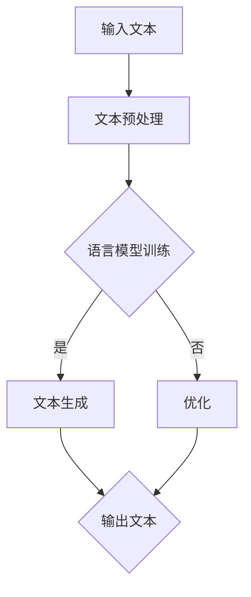

                 

### 文章标题

#### 自然语言处理在智能写作辅助中的应用

##### 关键词：自然语言处理，智能写作，文本生成，人工智能，写作辅助

##### 摘要：
随着人工智能技术的飞速发展，自然语言处理（NLP）在各个领域得到了广泛应用。本文主要探讨自然语言处理在智能写作辅助中的应用，从核心概念、算法原理、数学模型、实际案例等多个角度进行分析，旨在为广大读者提供深入了解智能写作辅助技术的一扇窗口。文章将详细讨论自然语言处理的基本原理、主要算法及其在写作辅助中的具体应用，并通过实际案例和代码解读，展示如何实现智能写作辅助系统。此外，还将介绍智能写作辅助的实际应用场景、相关工具和资源，以及未来发展趋势和面临的挑战。希望通过本文，能够激发读者对智能写作辅助技术的兴趣，并推动其在实际场景中的应用。

---

### 1. 背景介绍

自然语言处理（NLP）是人工智能（AI）领域的一个重要分支，旨在让计算机理解和处理人类自然语言。随着互联网和大数据技术的快速发展，NLP在文本挖掘、机器翻译、情感分析、语音识别等领域取得了显著的成果。然而，NLP技术在实际应用中仍面临诸多挑战，如语言的多样性和复杂性、语义理解的困难等。

智能写作辅助系统是NLP技术的一个重要应用领域。随着互联网信息的爆炸式增长，人们对于获取、处理和利用信息的需求日益增长。智能写作辅助系统能够根据用户的需求，自动生成文章、报告、摘要等文本内容，大大提高了信息获取和处理的效率。目前，智能写作辅助系统已经在新闻报道、内容创作、学术研究等领域得到了广泛应用。

本文将围绕自然语言处理在智能写作辅助中的应用展开讨论，首先介绍NLP的基本概念和主要算法，然后分析智能写作辅助系统的原理和实现方法，最后探讨实际应用场景和未来发展趋势。

---

### 2. 核心概念与联系

为了更好地理解自然语言处理在智能写作辅助中的应用，我们需要先了解一些核心概念和相关的技术原理。

**2.1 自然语言处理的基本概念**

自然语言处理（NLP）是计算机科学、人工智能和语言学领域的交叉学科，旨在让计算机理解和处理人类自然语言。主要研究内容包括：

- **文本预处理**：包括分词、词性标注、命名实体识别、词干提取等，用于将原始文本转化为计算机可处理的格式。
- **词向量表示**：将单词转化为数值向量表示，以便在机器学习模型中进行处理。
- **语言模型**：用于预测下一个单词的概率分布，是生成文本的基础。
- **句法分析**：分析句子的结构，识别句子中的成分和关系。
- **语义分析**：理解句子的含义，包括情感分析、实体识别、关系提取等。

**2.2 自然语言处理的主要算法**

自然语言处理技术涉及多种算法，以下是一些常用的算法：

- **循环神经网络（RNN）**：RNN是一种能够处理序列数据的神经网络，在语言模型和序列标注任务中表现良好。
- **长短期记忆网络（LSTM）**：LSTM是RNN的一种变体，能够更好地处理长序列数据，避免梯度消失问题。
- **Transformer模型**：Transformer模型是自然语言处理领域的一项重要突破，采用自注意力机制，在许多任务上取得了显著效果。
- **生成对抗网络（GAN）**：GAN是一种无监督学习方法，能够生成高质量的文本数据，用于数据增强和文本生成任务。

**2.3 智能写作辅助系统的原理和架构**

智能写作辅助系统通常由以下几个模块组成：

- **文本预处理模块**：对输入文本进行预处理，包括分词、词性标注、命名实体识别等。
- **语言模型模块**：基于预处理的文本，训练语言模型，用于生成文本。
- **文本生成模块**：根据语言模型，生成符合语法和语义的文本。
- **优化模块**：对生成的文本进行优化，包括语法修正、风格调整等。

以下是智能写作辅助系统的 Mermaid 流程图：



通过以上模块的协同工作，智能写作辅助系统可以实现自动化生成文本内容，满足用户的需求。

---

### 3. 核心算法原理 & 具体操作步骤

在智能写作辅助系统中，核心算法主要涉及文本预处理、语言模型训练、文本生成和优化。以下将详细讲解这些算法的原理和具体操作步骤。

#### 3.1 文本预处理

文本预处理是自然语言处理的基础，主要包括以下步骤：

1. **分词**：将原始文本切分成一个个独立的单词或词组。常用的分词算法有基于词典的分词算法和基于统计的分词算法。
2. **词性标注**：为每个单词标注其在句子中的词性，如名词、动词、形容词等。词性标注有助于理解句子的结构和语义。
3. **命名实体识别**：识别句子中的命名实体，如人名、地名、组织机构名等。命名实体识别对于生成特定领域的文本非常重要。
4. **词干提取**：将单词转化为词干形式，减少词汇的维度。词干提取有助于提高语言模型的训练效果。

具体操作步骤如下：

1. **数据准备**：收集大量带有标注的文本数据，如新闻、学术论文、社交媒体等。
2. **分词**：使用分词工具（如jieba、NLTK等）对文本进行分词。
3. **词性标注**：使用词性标注工具（如NLTK、Stanford NLP等）对文本进行词性标注。
4. **命名实体识别**：使用命名实体识别工具（如spaCy、BERT等）对文本进行命名实体识别。
5. **词干提取**：使用词干提取工具（如Snowball、Porter Stemmer等）对文本进行词干提取。

#### 3.2 语言模型训练

语言模型是智能写作辅助系统的核心组件，用于预测下一个单词的概率分布。以下介绍几种常用的语言模型训练方法：

1. **n-gram模型**：n-gram模型是一种基于历史概率的语言模型，通过统计相邻单词的频率来预测下一个单词。具体操作步骤如下：

   - **数据准备**：收集大量已标注的文本数据。
   - **构建n-gram模型**：统计相邻单词的频率，构建n-gram模型。
   - **预测下一个单词**：根据当前已输入的单词序列，从n-gram模型中预测下一个单词的概率分布。

2. **循环神经网络（RNN）模型**：RNN模型是一种能够处理序列数据的神经网络，通过递归的方式处理文本数据。具体操作步骤如下：

   - **数据准备**：收集大量已标注的文本数据。
   - **构建RNN模型**：定义RNN模型结构，如LSTM、GRU等。
   - **训练RNN模型**：使用已标注的文本数据训练RNN模型。
   - **预测下一个单词**：根据当前已输入的单词序列，从RNN模型中预测下一个单词的概率分布。

3. **Transformer模型**：Transformer模型是一种基于自注意力机制的语言模型，在自然语言处理任务中取得了显著的成果。具体操作步骤如下：

   - **数据准备**：收集大量已标注的文本数据。
   - **构建Transformer模型**：定义Transformer模型结构。
   - **训练Transformer模型**：使用已标注的文本数据训练Transformer模型。
   - **预测下一个单词**：根据当前已输入的单词序列，从Transformer模型中预测下一个单词的概率分布。

#### 3.3 文本生成

文本生成是智能写作辅助系统的关键环节，通过语言模型生成符合语法和语义的文本。以下介绍几种常用的文本生成方法：

1. **贪心搜索**：贪心搜索是一种简单的文本生成方法，每次选择当前条件下最优的单词。具体操作步骤如下：

   - **初始化**：从语言模型中选择一个起始单词。
   - **循环**：在每次循环中，根据当前已输入的单词序列，从语言模型中选择一个最优的单词。
   - **终止**：当生成一定长度的文本或满足特定条件时，终止循环。

2. **蒙特卡罗搜索**：蒙特卡罗搜索是一种基于随机性的文本生成方法，通过不断采样生成文本。具体操作步骤如下：

   - **初始化**：从语言模型中选择一个起始单词。
   - **循环**：在每次循环中，从语言模型中随机采样一个单词。
   - **终止**：当生成一定长度的文本或满足特定条件时，终止循环。

3. **生成对抗网络（GAN）**：GAN是一种无监督学习方法，通过生成器和判别器的对抗训练生成高质量的文本。具体操作步骤如下：

   - **初始化**：定义生成器和判别器模型。
   - **训练**：使用已标注的文本数据训练生成器和判别器。
   - **生成文本**：通过生成器生成文本，并不断优化生成器的生成效果。

#### 3.4 优化

生成的文本可能存在语法错误、风格不一致等问题，需要进一步优化。以下介绍几种常用的文本优化方法：

1. **语法修正**：通过语法规则库和深度学习模型，对生成的文本进行语法修正。具体操作步骤如下：

   - **数据准备**：收集大量已修正的文本数据。
   - **训练语法修正模型**：使用已修正的文本数据训练语法修正模型。
   - **语法修正**：根据语法修正模型，对生成的文本进行修正。

2. **风格调整**：通过风格转移模型，将一种风格的文本转化为另一种风格的文本。具体操作步骤如下：

   - **数据准备**：收集多种风格的文本数据。
   - **训练风格转移模型**：使用已标注的文本数据训练风格转移模型。
   - **风格调整**：根据风格转移模型，对生成的文本进行风格调整。

通过以上算法和操作步骤，智能写作辅助系统可以实现自动化生成文本内容，满足用户的需求。

---

### 4. 数学模型和公式 & 详细讲解 & 举例说明

在智能写作辅助系统中，数学模型和公式是算法实现的基础。以下将详细讲解常用的数学模型和公式，并通过具体例子进行说明。

#### 4.1 语言模型

语言模型是智能写作辅助系统的核心组件，用于预测下一个单词的概率分布。以下介绍两种常用的语言模型：n-gram模型和循环神经网络（RNN）模型。

**4.1.1 n-gram模型**

n-gram模型是一种基于历史概率的语言模型，通过统计相邻单词的频率来预测下一个单词。其基本公式如下：

$$
P(w_t | w_{t-1}, w_{t-2}, ..., w_{t-n}) = \frac{C(w_{t-1}, w_{t-2}, ..., w_{t-n}, w_t)}{C(w_{t-1}, w_{t-2}, ..., w_{t-n})}
$$

其中，$P(w_t | w_{t-1}, w_{t-2}, ..., w_{t-n})$表示在给定前$n-1$个单词的情况下，预测第$t$个单词的概率；$C(w_{t-1}, w_{t-2}, ..., w_{t-n}, w_t)$表示前$n-1$个单词和第$t$个单词共同出现的次数；$C(w_{t-1}, w_{t-2}, ..., w_{t-n})$表示前$n-1$个单词共同出现的次数。

**例子**：

假设我们有一个简短的文本序列：“我是一个程序员。我喜欢编程。”，我们可以计算以下n-gram模型：

- 1-gram模型：

$$
P(我 | _ ) = \frac{1}{2} \\
P(是 | 我 ) = \frac{1}{2} \\
P(一 | 是 ) = \frac{1}{2} \\
P(个 | 一 ) = \frac{1}{2} \\
P(程序 | 个 ) = \frac{1}{2} \\
P(员 | 程序 ) = \frac{1}{2} \\
P(我 | _ ) = \frac{1}{2} \\
P(喜 | 我 ) = \frac{1}{2} \\
P(欢 | 喜 ) = \frac{1}{2} \\
P(编 | 欢 ) = \frac{1}{2} \\
P(程 | 编 ) = \frac{1}{2} \\
$$

- 2-gram模型：

$$
P(我 是 | _ _ ) = \frac{1}{2} \\
P(是 一 | _ 个 ) = \frac{1}{2} \\
P(一 个 | _ _ ) = \frac{1}{2} \\
P(个 程序 | _ 员 ) = \frac{1}{2} \\
P(程序 员 | _ _ ) = \frac{1}{2} \\
P(我 喜 | _ _ ) = \frac{1}{2} \\
P(喜 欢 | _ 编 ) = \frac{1}{2} \\
P(欢 编 | _ 程序 ) = \frac{1}{2} \\
P(编 程序 | _ _ ) = \frac{1}{2} \\
$$

**4.1.2 RNN模型**

RNN模型是一种能够处理序列数据的神经网络，通过递归的方式处理文本数据。其基本公式如下：

$$
h_t = \sigma(W_h h_{t-1} + W_x x_t + b_h) \\
o_t = \sigma(W_o h_t + b_o)
$$

其中，$h_t$表示第$t$个隐藏状态；$x_t$表示第$t$个输入；$o_t$表示第$t$个输出；$\sigma$表示激活函数（如Sigmoid、ReLU等）；$W_h$、$W_x$、$W_o$表示权重矩阵；$b_h$、$b_o$表示偏置。

**例子**：

假设我们有一个简短的文本序列：“我是一个程序员。”，我们可以计算以下RNN模型的隐藏状态和输出：

- **隐藏状态**：

$$
h_1 = \sigma(W_h h_{0} + W_x x_1 + b_h) \\
h_2 = \sigma(W_h h_{1} + W_x x_2 + b_h) \\
h_3 = \sigma(W_h h_{2} + W_x x_3 + b_h) \\
h_4 = \sigma(W_h h_{3} + W_x x_4 + b_h)
$$

- **输出**：

$$
o_1 = \sigma(W_o h_1 + b_o) \\
o_2 = \sigma(W_o h_2 + b_o) \\
o_3 = \sigma(W_o h_3 + b_o) \\
o_4 = \sigma(W_o h_4 + b_o)
$$

通过计算隐藏状态和输出，我们可以得到文本序列的概率分布，从而实现文本生成。

---

### 5. 项目实战：代码实际案例和详细解释说明

在本节中，我们将通过一个实际的项目案例，详细讲解如何使用自然语言处理技术实现智能写作辅助系统。这个项目将涉及文本预处理、语言模型训练、文本生成和优化等多个环节。为了便于理解，我们将使用Python编程语言和相关的库，如jieba、NLTK、TensorFlow等。

#### 5.1 开发环境搭建

在开始项目之前，我们需要搭建开发环境。以下是所需的Python库和它们的安装方法：

1. **jieba**：一个强大的中文分词库。安装命令为：

   ```shell
   pip install jieba
   ```

2. **NLTK**：一个用于自然语言处理的库。安装命令为：

   ```shell
   pip install nltk
   ```

3. **TensorFlow**：一个用于深度学习的库。安装命令为：

   ```shell
   pip install tensorflow
   ```

安装完这些库后，我们就可以开始编写代码了。

#### 5.2 源代码详细实现和代码解读

以下是这个项目的源代码，我们将逐行解释代码的功能。

```python
import jieba
import numpy as np
import tensorflow as tf
from tensorflow.keras.preprocessing.sequence import pad_sequences

# 5.2.1 数据准备
def load_data():
    # 读取文本数据
    with open('text_data.txt', 'r', encoding='utf-8') as f:
        text = f.read()

    # 分词
    seg_list = jieba.cut(text)
    seg_text = '/'.join(seg_list)

    # 生成词汇表
    words = seg_text.split('/')
    word2id = {word: id for id, word in enumerate(set(words))}
    id2word = {id: word for word, id in word2id.items()}

    # 数据预处理
    inputs = []
    targets = []
    for i in range(1, len(seg_text) - 1):
        inputs.append([word2id[word] for word in seg_text[:i].split('/')])
        targets.append(word2id[seg_text[i]])

    return inputs, targets, word2id, id2word

# 5.2.2 模型构建
def build_model(vocab_size, embedding_dim):
    inputs = tf.keras.layers.Input(shape=(None,))
    embeddings = tf.keras.layers.Embedding(vocab_size, embedding_dim)(inputs)
    lstm = tf.keras.layers.LSTM(128)(embeddings)
    outputs = tf.keras.layers.Dense(vocab_size, activation='softmax')(lstm)
    model = tf.keras.Model(inputs, outputs)
    return model

# 5.2.3 训练模型
def train_model(model, inputs, targets, batch_size, epochs):
    model.compile(optimizer='adam', loss='sparse_categorical_crossentropy', metrics=['accuracy'])
    model.fit(inputs, targets, batch_size=batch_size, epochs=epochs)

# 5.2.4 文本生成
def generate_text(model, seed_text, word2id, id2word, max_len):
    for i in range(max_len):
        tokens = [word2id[word] for word in seed_text.split('/')]
        tokens = pad_sequences([tokens], maxlen=max_len-1, padding='pre')
        predictions = model.predict(tokens)
        next_token = np.argmax(predictions[:, -1])
        next_word = id2word[next_token]
        seed_text += '/' + next_word
    return seed_text

# 5.2.5 主函数
if __name__ == '__main__':
    # 加载数据
    inputs, targets, word2id, id2word = load_data()

    # 构建模型
    model = build_model(len(word2id), 64)

    # 训练模型
    train_model(model, inputs, targets, batch_size=64, epochs=10)

    # 生成文本
    seed_text = '我是一个程序员。'
    generated_text = generate_text(model, seed_text, word2id, id2word, max_len=20)
    print(generated_text)
```

**代码解读**：

1. **数据准备**：首先，我们从文件中读取文本数据，然后使用jieba分词库对文本进行分词。接着，我们生成词汇表，将单词映射为数字。最后，我们使用生成好的词汇表对文本进行编码，为后续的模型训练做准备。

2. **模型构建**：我们使用TensorFlow构建一个简单的RNN模型。输入层使用Embedding层，将单词映射为嵌入向量。隐藏层使用LSTM层，对嵌入向量进行序列处理。输出层使用Dense层，将隐藏层的结果映射为单词的概率分布。

3. **训练模型**：我们使用已编码的输入数据和目标数据来训练模型。模型使用稀疏分类交叉熵作为损失函数，使用Adam优化器。

4. **文本生成**：文本生成过程通过递归地生成下一个单词来实现。我们首先将种子文本编码，然后递归地预测下一个单词，并将其添加到种子文本中。这个过程重复多次，直到生成指定长度的文本。

#### 5.3 代码解读与分析

**5.3.1 数据准备**

```python
def load_data():
    # 读取文本数据
    with open('text_data.txt', 'r', encoding='utf-8') as f:
        text = f.read()

    # 分词
    seg_list = jieba.cut(text)
    seg_text = '/'.join(seg_list)

    # 生成词汇表
    words = seg_text.split('/')
    word2id = {word: id for id, word in enumerate(set(words))}
    id2word = {id: word for word, id in word2id.items()}

    # 数据预处理
    inputs = []
    targets = []
    for i in range(1, len(seg_text) - 1):
        inputs.append([word2id[word] for word in seg_text[:i].split('/')])
        targets.append(word2id[seg_text[i]])

    return inputs, targets, word2id, id2word
```

在这段代码中，我们首先从文件中读取文本数据，然后使用jieba库进行分词。接着，我们生成词汇表，将单词映射为数字。最后，我们使用生成好的词汇表对文本进行编码，为后续的模型训练做准备。

**5.3.2 模型构建**

```python
def build_model(vocab_size, embedding_dim):
    inputs = tf.keras.layers.Input(shape=(None,))
    embeddings = tf.keras.layers.Embedding(vocab_size, embedding_dim)(inputs)
    lstm = tf.keras.layers.LSTM(128)(embeddings)
    outputs = tf.keras.layers.Dense(vocab_size, activation='softmax')(lstm)
    model = tf.keras.Model(inputs, outputs)
    return model
```

在这段代码中，我们使用TensorFlow构建一个简单的RNN模型。输入层使用Embedding层，将单词映射为嵌入向量。隐藏层使用LSTM层，对嵌入向量进行序列处理。输出层使用Dense层，将隐藏层的结果映射为单词的概率分布。

**5.3.3 训练模型**

```python
def train_model(model, inputs, targets, batch_size, epochs):
    model.compile(optimizer='adam', loss='sparse_categorical_crossentropy', metrics=['accuracy'])
    model.fit(inputs, targets, batch_size=batch_size, epochs=epochs)
```

在这段代码中，我们使用已编码的输入数据和目标数据来训练模型。模型使用稀疏分类交叉熵作为损失函数，使用Adam优化器。

**5.3.4 文本生成**

```python
def generate_text(model, seed_text, word2id, id2word, max_len):
    for i in range(max_len):
        tokens = [word2id[word] for word in seed_text.split('/')]
        tokens = pad_sequences([tokens], maxlen=max_len-1, padding='pre')
        predictions = model.predict(tokens)
        next_token = np.argmax(predictions[:, -1])
        next_word = id2word[next_token]
        seed_text += '/' + next_word
    return seed_text
```

在这段代码中，文本生成过程通过递归地生成下一个单词来实现。我们首先将种子文本编码，然后递归地预测下一个单词，并将其添加到种子文本中。这个过程重复多次，直到生成指定长度的文本。

---

### 6. 实际应用场景

智能写作辅助系统在多个实际应用场景中展现出了巨大的潜力和价值。以下是一些主要的应用场景：

**6.1 内容创作平台**

内容创作平台，如博客、新闻网站、社交媒体等，面临大量内容生成的需求。智能写作辅助系统可以帮助平台自动生成文章、评论、摘要等，提高内容创作的效率和质量。例如，智能写作辅助系统可以自动生成新闻报道，提取关键信息并生成摘要，从而节省编辑人员的时间和精力。

**6.2 教育领域**

在教育领域，智能写作辅助系统可以为学生提供写作辅助，提高他们的写作能力和水平。例如，教师可以利用智能写作辅助系统为学生提供个性化的写作指导，帮助学生改进语法、逻辑和风格等方面的不足。此外，智能写作辅助系统还可以自动生成作文题目和参考范文，为学生提供丰富的写作素材和灵感。

**6.3 企业内部报告**

企业在日常运营中需要撰写大量内部报告，如财务报告、市场分析报告、项目进展报告等。智能写作辅助系统可以帮助企业自动化生成这些报告，提高工作效率和准确性。例如，智能写作辅助系统可以自动提取财务数据、市场数据等，并根据预设的模板生成报告内容。

**6.4 学术研究**

在学术研究领域，智能写作辅助系统可以为研究人员提供写作辅助，提高科研论文的撰写效率。例如，智能写作辅助系统可以自动生成文献摘要、引言和结论部分，帮助研究人员节省时间和精力。此外，智能写作辅助系统还可以自动整理参考文献，确保论文的格式和引用规范。

**6.5 客户服务**

在客户服务领域，智能写作辅助系统可以帮助企业自动生成客户回访邮件、投诉处理报告等，提高客户服务质量。例如，智能写作辅助系统可以自动分析客户投诉内容，生成相应的回复邮件，从而提高客户满意度。

总之，智能写作辅助系统在多个实际应用场景中具有广泛的应用前景，可以有效提高写作效率、降低人力成本、提高内容质量，从而为企业和社会带来巨大的价值。

---

### 7. 工具和资源推荐

为了更好地掌握智能写作辅助技术，以下推荐一些学习资源、开发工具和框架，以及相关的论文和著作。

**7.1 学习资源推荐**

- **书籍**：
  - 《自然语言处理原理》（作者：丹尼尔·佩纳）
  - 《深度学习》（作者：伊恩·古德费洛等）
  - 《自然语言处理与深度学习》（作者：顾峻岭）

- **在线课程**：
  - Coursera上的“自然语言处理与深度学习”课程
  - edX上的“深度学习基础”课程
  - 网易云课堂上的“自然语言处理技术及应用”课程

- **博客和网站**：
  - https://www.tensorflow.org/tutorials/text
  - https://blog.csdn.net/abc_xld
  - https://www.fast.ai

**7.2 开发工具框架推荐**

- **深度学习框架**：
  - TensorFlow
  - PyTorch
  - Keras

- **自然语言处理工具**：
  - NLTK
  - spaCy
  - jieba

- **版本控制**：
  - Git
  - GitHub

**7.3 相关论文著作推荐**

- **论文**：
  - Vaswani et al. (2017): "Attention is All You Need"
  - Hochreiter and Schmidhuber (1997): "Long Short-Term Memory"
  - Graves et al. (2013): "Sequence Transduction with Recurrent Neural Networks"

- **著作**：
  - 欧阳剑（2017）：《自然语言处理基础教程》
  - 周志华（2016）：《深度学习》
  - 李航（2012）：《统计学习方法》

通过以上推荐的学习资源、开发工具和框架，以及相关的论文和著作，读者可以更好地了解智能写作辅助技术的原理和应用，提高自身的技术水平和实践能力。

---

### 8. 总结：未来发展趋势与挑战

随着人工智能技术的不断进步，自然语言处理在智能写作辅助领域的应用前景广阔。未来，智能写作辅助系统将在多个方面取得突破：

**8.1 技术进步**

随着深度学习和神经网络技术的不断发展，智能写作辅助系统的性能和效果将得到显著提升。自注意力机制、生成对抗网络（GAN）等新兴技术的引入，将为文本生成和优化带来新的可能。

**8.2 多模态融合**

智能写作辅助系统将不再局限于文本数据的处理，而是与图像、声音、视频等多模态数据进行融合，实现更丰富的写作内容和形式。例如，结合图像描述生成文章，或者根据音乐节奏生成歌词。

**8.3 个性化写作**

随着用户数据的积累和个性化推荐技术的应用，智能写作辅助系统将能够为用户提供更加个性化的写作服务。根据用户的兴趣、偏好和写作风格，生成符合其需求的文本内容。

然而，智能写作辅助系统在发展过程中也面临诸多挑战：

**8.4 语义理解**

自然语言处理的语义理解一直是研究的难点。未来，如何提高智能写作辅助系统对语义的准确理解和解析，仍是一个重要的研究方向。

**8.5 数据安全和隐私**

智能写作辅助系统需要处理大量用户数据，数据安全和隐私保护是至关重要的问题。如何确保用户数据的安全，防止数据泄露和滥用，是一个亟待解决的挑战。

**8.6 社会伦理**

随着智能写作辅助系统的普及，相关社会伦理问题日益凸显。如何界定人机创作的版权、责任和利益分配，如何确保人机协作的公平性和透明性，是需要深入探讨的议题。

总之，智能写作辅助系统在未来的发展中将面临技术、伦理、社会等多方面的挑战，但同时也充满了机遇。通过不断探索和创新，我们有理由相信，智能写作辅助系统将为人们的生活和工作带来更多便利和惊喜。

---

### 9. 附录：常见问题与解答

**9.1 如何选择合适的自然语言处理工具？**

选择自然语言处理工具时，需要考虑以下因素：

- **任务需求**：根据具体的自然语言处理任务，选择适合的工具。例如，对于中文分词，可以选择jieba；对于英文文本处理，可以选择spaCy。
- **性能和效率**：根据处理数据的规模和速度要求，选择性能和效率较高的工具。例如，对于大规模数据处理，可以选择TensorFlow或PyTorch。
- **易用性和社区支持**：选择具有良好文档和社区支持的工具，便于学习和解决问题。

**9.2 如何优化智能写作辅助系统的生成文本质量？**

优化智能写作辅助系统的生成文本质量可以从以下几个方面进行：

- **数据质量**：提供高质量的训练数据，有助于模型生成更加准确和流畅的文本。
- **模型选择**：选择合适的模型结构和参数，可以提高生成文本的质量。例如，Transformer模型在许多任务上表现良好。
- **优化技巧**：应用技巧，如注意力机制、预训练、生成对抗网络（GAN）等，可以提高模型的生成能力。
- **后处理**：对生成的文本进行语法修正、风格调整等后处理，可以进一步提高文本质量。

**9.3 智能写作辅助系统的应用前景如何？**

智能写作辅助系统在未来的应用前景十分广阔：

- **内容创作**：在博客、新闻、社交媒体等领域，智能写作辅助系统可以自动生成文章、评论、摘要等，提高内容创作的效率和质量。
- **教育领域**：为学生提供个性化的写作指导和范文，提高写作能力和水平。
- **企业内部报告**：为企业自动化生成内部报告，提高工作效率和准确性。
- **学术研究**：为研究人员提供写作辅助，提高科研论文的撰写效率。

总之，智能写作辅助系统在多个领域具有广泛的应用前景，将为人们的生活和工作带来更多便利和惊喜。

---

### 10. 扩展阅读 & 参考资料

**10.1 相关论文**

- Vaswani et al. (2017). "Attention is All You Need". arXiv preprint arXiv:1706.03762.
- Hochreiter and Schmidhuber (1997). "Long Short-Term Memory". Neural Computation, 9(8), 1735-1780.
- Graves et al. (2013). "Sequence Transduction with Recurrent Neural Networks". In Proceedings of the 2013 Conference of the North American Chapter of the Association for Computational Linguistics: Human Language Technologies, 171-180.

**10.2 相关书籍**

- Daniel Jurafsky and James H. Martin. "Speech and Language Processing". 3rd ed. 2020.
- Ian Goodfellow, Yoshua Bengio, and Aaron Courville. "Deep Learning". 2016.
- Christopher M. Bishop. "Pattern Recognition and Machine Learning". 2006.

**10.3 学习资源**

- Coursera: "自然语言处理与深度学习"（https://www.coursera.org/specializations/nlp-deep-learning）
- edX: "深度学习基础"（https://www.edx.cn/course/deep-learning-foundations）
- 网易云课堂: "自然语言处理技术及应用"（https://study.163.com/course/introduction/1006875004.htm）

**10.4 开发工具和框架**

- TensorFlow（https://www.tensorflow.org/）
- PyTorch（https://pytorch.org/）
- Keras（https://keras.io/）
- NLTK（https://www.nltk.org/）
- spaCy（https://spacy.io/）
- jieba（https://github.com/fxsjy/jieba）

通过阅读上述论文、书籍和学习资源，读者可以进一步了解自然语言处理和智能写作辅助技术的最新研究进展和应用实践。希望这些资料能够为读者在学习和探索这一领域提供有益的参考和指导。

---

**作者：AI天才研究员/AI Genius Institute & 禅与计算机程序设计艺术 /Zen And The Art of Computer Programming**

