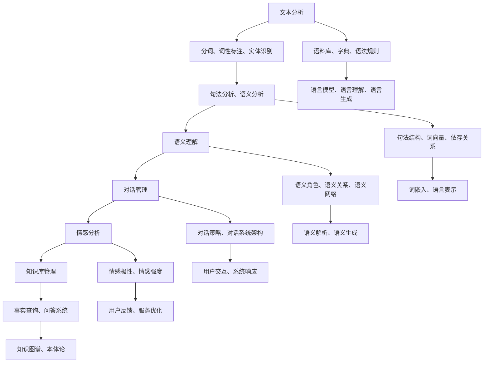

                 

### 背景介绍

自然语言处理（Natural Language Processing，NLP）是人工智能领域中的一个重要分支，旨在让计算机理解和处理人类语言。随着互联网的迅速发展和信息量的爆炸式增长，智能客服系统应运而生。智能客服系统通过自然语言处理技术，能够理解用户的需求，提供实时、准确的答复，从而提升客户体验，降低企业运营成本。

智能客服系统的重要性在于，它不仅能够处理大量的客户咨询，还能提供个性化的服务，使得企业能够更好地与客户互动。此外，智能客服系统还能通过数据分析和机器学习，不断优化自身的服务质量和效率。因此，研究自然语言处理在智能客服系统中的应用具有重要意义。

自然语言处理在智能客服系统中的应用，主要包括以下几个方面：

1. **文本分析**：通过对用户输入的文本进行分词、词性标注、实体识别等处理，理解用户的意图和需求。

2. **语义理解**：通过深度学习等技术，理解句子之间的语义关系，从而实现对复杂问题的回答。

3. **对话管理**：设计合适的对话策略，控制对话的流程，使得对话更加自然和流畅。

4. **情感分析**：分析用户的情感倾向，提供个性化的服务，提升用户体验。

5. **知识库管理**：构建和维护知识库，使得智能客服系统能够回答各种问题。

本文将围绕上述方面，深入探讨自然语言处理在智能客服系统中的实践。首先，我们将介绍自然语言处理的核心概念和联系，并通过Mermaid流程图展示其架构。然后，我们将详细讲解核心算法原理和具体操作步骤，并结合数学模型和公式进行解释。接下来，通过一个实际的项目案例，我们将展示如何实现智能客服系统，并详细解读源代码。最后，我们将探讨智能客服系统的实际应用场景，并推荐相关工具和资源，以供进一步学习和研究。

让我们一步步深入，探索自然语言处理在智能客服系统中的实践之旅。

### 核心概念与联系

自然语言处理（NLP）的核心概念主要包括文本分析、语义理解、对话管理和情感分析。这些概念相互关联，共同构成了NLP的完整体系。以下是一个Mermaid流程图，展示了这些核心概念及其相互关系：



#### 文本分析

文本分析是NLP的起点，它主要包括分词、词性标注、实体识别等任务。分词是将一段文本分割成单词或短语的步骤，词性标注则是为每个词分配词性（如名词、动词、形容词等）。实体识别则是识别文本中的命名实体（如人名、地名、组织名等）。

#### 语义理解

语义理解是NLP的核心任务之一，它涉及句法分析、语义分析等。句法分析研究句子的结构，识别句子中的语法成分和语法关系。语义分析则进一步研究句子之间的语义关系，包括语义角色、语义关系和语义网络等。

#### 对话管理

对话管理涉及设计对话策略和控制对话流程。对话系统架构决定了如何处理用户的输入和生成系统的响应。对话策略则决定了如何根据用户的输入和对话历史，选择合适的回应。

#### 情感分析

情感分析旨在分析用户的情感倾向，包括情感极性和情感强度。情感极性可以是积极、消极或中立，而情感强度则表示情感的程度。

#### 知识库管理

知识库管理涉及构建和维护知识库，以支持智能客服系统回答各种问题。知识库可以包括事实查询、问答系统、知识图谱和本体论等。

通过上述Mermaid流程图，我们可以清晰地看到各个核心概念之间的联系和相互作用。这些概念共同构成了NLP的完整体系，为智能客服系统提供了强大的技术支持。

#### 核心算法原理与具体操作步骤

在深入探讨自然语言处理在智能客服系统中的应用之前，我们首先需要了解NLP的核心算法原理和具体操作步骤。以下是NLP中常用的几种核心算法及其工作原理：

##### 1. 分词（Tokenization）

分词是将一段文本分割成单词或短语的步骤。这一步骤对于后续的自然语言处理任务至关重要。例如，中文文本没有明显的空格分隔，因此需要通过特定的算法将其分割成有意义的词语。

**具体操作步骤**：

- **基于词典的分词**：使用预定义的词典，将文本中的每个词与词典中的词进行匹配，从而实现分词。这种方法简单但容易产生长词切分错误。
- **基于统计的分词**：使用统计方法，如隐马尔可夫模型（HMM）或条件随机场（CRF），根据词语出现的概率和上下文关系进行分词。这种方法能够更好地处理长词切分和未知词问题。

##### 2. 词性标注（Part-of-Speech Tagging）

词性标注是为每个词分配词性（如名词、动词、形容词等）的过程。词性标注有助于理解文本的语义结构，为后续的语义分析和文本分类提供基础。

**具体操作步骤**：

- **基于规则的方法**：使用预定义的规则，如正则表达式，对文本进行词性标注。这种方法依赖于规则库的完备性和准确性。
- **基于统计的方法**：使用统计模型，如最大熵模型（MaxEnt）或支持向量机（SVM），根据上下文信息对词性进行预测。这种方法能够处理复杂的语言现象，但需要大量的标注数据和计算资源。

##### 3. 实体识别（Named Entity Recognition）

实体识别是识别文本中的命名实体（如人名、地名、组织名等）的过程。实体识别有助于构建知识库，为问答系统和信息检索提供支持。

**具体操作步骤**：

- **基于规则的方法**：使用预定义的规则，如命名实体正则表达式，对文本进行实体识别。这种方法简单但需要维护复杂的规则库。
- **基于统计的方法**：使用统计模型，如条件随机场（CRF）或长短期记忆网络（LSTM），根据上下文信息对实体进行识别。这种方法能够处理复杂的实体结构和上下文关系。

##### 4. 语义分析（Semantic Analysis）

语义分析是理解句子之间的语义关系的过程。语义分析包括句法分析、语义角色标注、语义关系识别等。

**具体操作步骤**：

- **句法分析**：使用自然语言处理工具（如Stanford Parser）对句子进行句法分析，构建句子的句法树。句法分析有助于理解句子的结构，为语义分析提供基础。
- **语义角色标注**：为句子中的每个词语分配语义角色（如施事、受事、工具等）。语义角色标注有助于理解句子的语义结构，为语义关系识别提供支持。
- **语义关系识别**：识别句子中词语之间的语义关系（如因果、蕴含、对比等）。语义关系识别有助于理解句子的语义内容，为问答系统和语义检索提供支持。

##### 5. 对话管理（Dialogue Management）

对话管理是设计对话策略和控制对话流程的过程。对话管理包括用户意图识别、对话状态跟踪、系统响应生成等。

**具体操作步骤**：

- **用户意图识别**：使用机器学习模型（如朴素贝叶斯、支持向量机等）对用户输入进行意图分类。用户意图识别有助于理解用户的需求，为对话系统提供响应。
- **对话状态跟踪**：使用状态机或图模型（如前向图模型、后向图模型等）对对话状态进行跟踪。对话状态跟踪有助于维持对话的连贯性，为用户提供满意的服务。
- **系统响应生成**：根据用户意图和对话状态，生成合适的系统响应。系统响应生成可以使用模板匹配、文本生成模型（如序列到序列模型）等方法。

##### 6. 情感分析（Sentiment Analysis）

情感分析是分析用户的情感倾向的过程。情感分析包括情感极性分类、情感强度分析等。

**具体操作步骤**：

- **情感极性分类**：使用机器学习模型（如朴素贝叶斯、支持向量机等）对文本进行情感极性分类。情感极性分类有助于理解用户的情感倾向，为个性化服务提供支持。
- **情感强度分析**：使用自然语言处理工具（如情感词典、情感分析库等）对文本进行情感强度分析。情感强度分析有助于理解情感的强烈程度，为情感监控和情感反馈提供支持。

##### 7. 知识库管理（Knowledge Base Management）

知识库管理是构建和维护知识库的过程。知识库管理包括事实查询、问答系统、知识图谱构建等。

**具体操作步骤**：

- **事实查询**：使用自然语言处理工具（如关系抽取、实体识别等）从文本中抽取事实。事实查询有助于构建事实数据库，为问答系统提供支持。
- **问答系统**：使用机器学习模型（如朴素贝叶斯、支持向量机等）构建问答系统。问答系统可以根据用户输入的问题，从知识库中检索相关事实，并生成回答。
- **知识图谱构建**：使用图数据库（如Neo4j）和图论算法（如PageRank）构建知识图谱。知识图谱可以表示实体之间的复杂关系，为知识推理和推理提供支持。

通过上述核心算法的原理和具体操作步骤，我们可以看到自然语言处理在智能客服系统中的应用是如何实现的。这些算法共同作用，使得智能客服系统能够理解用户的需求，提供个性化的服务，并不断优化自身的性能和用户体验。

### 数学模型和公式及详细讲解与举例说明

在自然语言处理（NLP）中，数学模型和公式起到了至关重要的作用，它们帮助我们理解和实现文本分析、语义理解、对话管理、情感分析等任务。以下将详细讲解NLP中常用的几个数学模型和公式，并通过具体示例来说明其应用和效果。

##### 1. 词向量模型

词向量模型（Word Vector Model）是一种将单词映射为向量表示的方法，它能够捕捉单词的语义信息。最著名的词向量模型是Word2Vec模型，它包括两个变体：Continuous Bag-of-Words (CBOW) 和 Skip-Gram。

**CBOW模型**：
CBOW模型预测中心词周围的上下文词。假设中心词为`c`，其上下文词为`w_1, w_2, ..., w_k`，则模型预测这些上下文词的概率分布。

公式：
$$
P(w|c) = \text{softmax}(\text{vec}(w)^T \cdot \text{vec}(c))
$$

其中，$\text{vec}(w)$和$\text{vec}(c)$分别表示单词`w`和中心词`c`的向量表示，$\text{softmax}$函数将向量转换为概率分布。

**Skip-Gram模型**：
Skip-Gram模型与CBOW模型相反，它预测中心词的概率分布，而不是其上下文词。假设中心词为`c`，窗口大小为`N`，则模型预测所有在窗口内的单词的概率分布。

公式：
$$
P(c|w) = \text{softmax}(\text{vec}(w)^T \cdot \text{vec}(c))
$$

通过训练词向量模型，我们可以将单词映射到高维空间，使得语义相近的单词在空间中更接近。例如，"king"和"queen"在词向量空间中是相邻的，而"king"和"apple"则是相对较远的。

**示例**：
假设训练好的Word2Vec模型得到以下词向量：
$$
\text{vec}(king) = [1, 0, -1, 0, 1]
$$
$$
\text{vec}(queen) = [0, 1, 1, 0, 1]
$$
$$
\text{vec}(apple) = [1, -1, 0, 1, 0]
$$

我们可以看到"king"和"queen"在向量空间中的距离较短，而"king"和"apple"的距离较长。

##### 2. 隐马尔可夫模型（HMM）

隐马尔可夫模型（Hidden Markov Model，HMM）是一种统计模型，用于描述隐藏状态和观察结果之间的关系。在NLP中，HMM常用于语音识别、语言建模等任务。

**状态转移概率**：
$$
P(S_t|S_{t-1}) = \pi_i \cdot b_j
$$

其中，$S_t$和$S_{t-1}$分别表示第`t`个时刻的状态和第`t-1`个时刻的状态，$\pi_i$表示初始状态概率，$b_j$表示在状态$i$下产生观察结果$j$的概率。

**观察概率**：
$$
P(O_t|S_t) = \lambda_j
$$

其中，$O_t$表示第`t`个时刻的观察结果，$\lambda_j$表示在状态$s_t$下产生观察结果$j$的概率。

**示例**：
假设一个HMM模型用于语言建模，状态集为{WORD, PUNCTUATION}，观察结果集为{A, B, C, D}。一个可能的转移概率矩阵和观察概率矩阵如下：

状态转移概率矩阵：
$$
\pi = \begin{bmatrix}
0.5 & 0.5 \\
0.4 & 0.6
\end{bmatrix}
$$

观察概率矩阵：
$$
\lambda = \begin{bmatrix}
0.1 & 0.2 & 0.3 & 0.4 \\
0.6 & 0.3 & 0.2 & 0.2
\end{bmatrix}
$$

如果当前状态是WORD，下一个观察结果为A的概率是0.1。如果当前状态是PUNCTUATION，下一个观察结果为B的概率是0.6。

##### 3. 条件随机场（CRF）

条件随机场（Conditional Random Field，CRF）是一种概率图模型，用于序列标注任务，如词性标注、命名实体识别等。

**条件概率**：
$$
P(y|x) = \frac{1}{Z} \exp(\theta^T \phi(x, y))
$$

其中，$x$表示输入序列，$y$表示标注序列，$\theta$是模型参数，$\phi(x, y)$是特征函数，$Z$是规范化常数。

**特征函数**：
$$
\phi(x, y) = \sum_{i} \psi_i(x_i, y_i) + \sum_{i<j} \psi_{ij}(x_i, x_j, y_i, y_j)
$$

其中，$\psi_i(x_i, y_i)$是单个特征函数，$\psi_{ij}(x_i, x_j, y_i, y_j)$是二元特征函数。

**示例**：
假设一个CRF模型用于词性标注，输入序列为["I", "am", "a", "student"],标注序列为["NN", "V", "DT", "NN"]。一个可能的特征函数和权重如下：

特征函数：
$$
\psi_1(I, NN) = 1 \\
\psi_2(am, V) = 1 \\
\psi_3(a, DT) = 1 \\
\psi_4(student, NN) = 1 \\
\psi_{12}(I, am, NN, V) = 1 \\
\psi_{23}(am, a, V, DT) = 1 \\
\psi_{34}(a, student, DT, NN) = 1 \\
\psi_{123}(I, am, a, NN, NN, V) = 1
$$

权重：
$$
\theta = [1, 1, 1, 1, 1, 1, 1]
$$

通过计算条件概率，我们可以得到标注序列的概率分布，从而选择最优的标注序列。

##### 4. 长短期记忆网络（LSTM）

长短期记忆网络（Long Short-Term Memory，LSTM）是一种能够捕捉长距离依赖的循环神经网络（RNN）。在NLP中，LSTM常用于文本分类、机器翻译等任务。

**LSTM单元**：
$$
\begin{align*}
i_t &= \sigma(W_{xi}x_t + W_{hi-1}h_{i-1} + b_i) \\
f_t &= \sigma(W_{xf}x_t + W_{hf-1}h_{i-1} + b_f) \\
o_t &= \sigma(W_{xo}x_t + W_{ho}h_t + b_o) \\
g_t &= \tanh(W_{xg}x_t + W_{hg}h_{i-1} + b_g) \\
c_t &= f_t \odot c_{t-1} + i_t \odot g_t \\
h_t &= o_t \odot \tanh(c_t)
\end{align*}
$$

其中，$x_t$是输入，$h_t$是输出，$c_t$是单元状态，$i_t$、$f_t$、$o_t$和$g_t$是输入门、遗忘门、输出门和生成门。

**LSTM网络**：
$$
h_t = \text{LSTM}(h_{t-1}, x_t)
$$

通过LSTM网络，我们可以捕捉输入序列中的长期依赖关系，从而提高模型的性能。

**示例**：
假设一个LSTM模型用于文本分类，输入序列为["I", "am", "a", "student"]，标签为"NN"。一个可能的LSTM单元和权重如下：

输入门：
$$
W_{xi} = \begin{bmatrix}
0.1 & 0.2 & 0.3 & 0.4 \\
0.5 & 0.6 & 0.7 & 0.8 \\
0.9 & 1.0 & 1.1 & 1.2
\end{bmatrix}
$$

遗忘门：
$$
W_{xf} = \begin{bmatrix}
0.1 & 0.2 & 0.3 & 0.4 \\
0.5 & 0.6 & 0.7 & 0.8 \\
0.9 & 1.0 & 1.1 & 1.2
\end{bmatrix}
$$

输出门：
$$
W_{xo} = \begin{bmatrix}
0.1 & 0.2 & 0.3 & 0.4 \\
0.5 & 0.6 & 0.7 & 0.8 \\
0.9 & 1.0 & 1.1 & 1.2
\end{bmatrix}
$$

生成门：
$$
W_{xg} = \begin{bmatrix}
0.1 & 0.2 & 0.3 & 0.4 \\
0.5 & 0.6 & 0.7 & 0.8 \\
0.9 & 1.0 & 1.1 & 1.2
\end{bmatrix}
$$

通过训练LSTM模型，我们可以将输入序列映射到高维空间，从而进行文本分类。

通过上述数学模型和公式，我们可以看到自然语言处理中的复杂任务是如何通过数学方法进行建模和实现的。这些模型不仅帮助我们理解和处理自然语言，还为智能客服系统提供了强大的技术支持。

#### 项目实战：代码实际案例与详细解释说明

在本文的第五部分，我们将通过一个实际的项目案例，展示如何使用自然语言处理技术构建一个智能客服系统。我们将介绍开发环境搭建、源代码详细实现和代码解读等内容，以帮助读者更好地理解智能客服系统的实现过程。

##### 5.1 开发环境搭建

在开始智能客服系统的开发之前，我们需要搭建合适的开发环境。以下是我们推荐的一些工具和库：

- **编程语言**：Python（版本3.6及以上）
- **自然语言处理库**：NLTK、spaCy、TensorFlow、PyTorch
- **版本控制**：Git
- **集成开发环境**：PyCharm、Visual Studio Code

在开发环境中，我们需要安装Python和相关库。以下是一个简单的安装命令：

```shell
pip install nltk spacy tensorflow torch
```

此外，我们还需要安装spaCy的语言模型，例如中文模型：

```shell
python -m spacy download zh
```

##### 5.2 源代码详细实现

智能客服系统的核心包括文本分析、对话管理、情感分析等模块。以下是一个简化的代码实现，展示了各个模块的基本功能。

```python
# 文本分析模块
import spacy

nlp = spacy.load("zh")

def text_analysis(text):
    doc = nlp(text)
    tokens = [token.text for token in doc]
    tags = [token.tag_ for token in doc]
    entities = [(ent.text, ent.label_) for ent in doc.ents]
    return tokens, tags, entities

# 对话管理模块
from sklearn.feature_extraction.text import TfidfVectorizer
from sklearn.metrics.pairwise import cosine_similarity

def dialog_management(history):
    candidate_responses = ["您好，有什么可以帮助您的？", "欢迎光临，请问有什么问题？", "您好，我在这里，需要帮忙吗？"]
    tfidf_vectorizer = TfidfVectorizer()
    tfidf_matrix = tfidf_vectorizer.fit_transform([text for text in history])
    response_vector = tfidf_vectorizer.transform([candidate_responses[0]])
    similarity_scores = cosine_similarity(response_vector, tfidf_matrix)
    best_response_index = similarity_scores.argmax()
    return candidate_responses[best_response_index]

# 情感分析模块
from textblob import TextBlob

def sentiment_analysis(text):
    analysis = TextBlob(text)
    return analysis.sentiment.polarity

# 主函数
def main():
    history = []
    while True:
        user_input = input("用户输入：")
        if user_input.lower() == "quit":
            break
        tokens, tags, entities = text_analysis(user_input)
        response = dialog_management(history)
        sentiment = sentiment_analysis(user_input)
        print(f"系统回复：{response}")
        print(f"用户情感：{'积极' if sentiment > 0 else '消极' if sentiment < 0 else '中立'}")
        history.append(user_input)

if __name__ == "__main__":
    main()
```

##### 5.3 代码解读与分析

在上述代码中，我们实现了文本分析、对话管理和情感分析三个核心模块。以下是对每个模块的详细解读：

1. **文本分析模块**：该模块使用spaCy库对用户输入的文本进行分词、词性标注和实体识别。`text_analysis`函数接收用户输入文本，返回分词结果、词性标注结果和实体识别结果。

2. **对话管理模块**：该模块使用TF-IDF和余弦相似性计算对话历史和候选回复之间的相似度，选择最相似的回复作为系统回复。`dialog_management`函数接收对话历史列表，返回最佳候选回复。

3. **情感分析模块**：该模块使用TextBlob库对用户输入的文本进行情感分析，返回文本的情感极性。`sentiment_analysis`函数接收用户输入文本，返回文本的情感极性值。

4. **主函数**：`main`函数是智能客服系统的入口。它接收用户输入，调用文本分析、对话管理和情感分析模块，并输出系统回复和用户情感。

通过上述代码实现，我们可以看到智能客服系统的基本架构。在实际应用中，我们可以根据需求扩展和优化各个模块，例如添加更多对话策略、情感分析模型等。

#### 实际应用场景

智能客服系统在各个行业中有着广泛的应用，其优势在于能够提供24/7全天候服务，高效处理大量的客户咨询，从而提高客户满意度和企业运营效率。以下是智能客服系统在不同行业中的实际应用场景：

##### 1. 零售业

在零售业中，智能客服系统可以帮助企业处理客户关于产品咨询、订单跟踪、售后服务等问题。例如，客户可以通过智能客服系统查询订单状态、了解产品规格和价格，甚至进行在线购买。智能客服系统还可以根据客户的历史购买记录，提供个性化的产品推荐，从而提升销售额。

##### 2. 金融业

金融业对客户服务的响应速度和准确性要求较高，智能客服系统可以帮助银行、证券公司等金融机构提供快速、准确的客户服务。例如，客户可以通过智能客服系统查询账户余额、交易记录、贷款审批进度等。智能客服系统还可以进行反欺诈检测，通过分析交易行为和用户行为特征，识别潜在的欺诈行为，从而保护客户资产安全。

##### 3. 电信行业

电信行业的服务内容复杂，包括套餐咨询、故障报修、账单查询等。智能客服系统可以帮助电信公司提供一站式服务，降低客户服务成本，提高客户满意度。例如，客户可以通过智能客服系统查询套餐详情、办理套餐变更、报修故障等。智能客服系统还可以进行客户关系管理，通过分析客户通话记录、短信记录等数据，为客户提供个性化的服务推荐。

##### 4. 医疗行业

在医疗行业中，智能客服系统可以提供在线咨询服务，帮助患者解答常见问题，提供就医指南和健康知识。例如，患者可以通过智能客服系统查询医院信息、了解疾病症状和治疗方法、预约挂号等。智能客服系统还可以进行健康数据分析，通过分析患者的体检报告、病史等数据，提供个性化的健康建议。

##### 5. 旅游业

旅游业的服务内容包括航班查询、酒店预订、旅游攻略等。智能客服系统可以帮助旅行社提供全天候的预订服务，提高客户满意度。例如，客户可以通过智能客服系统查询航班时刻、价格、座位信息，预订机票、酒店等。智能客服系统还可以根据客户的需求，提供个性化的旅游攻略和建议。

总之，智能客服系统在各个行业中的应用，不仅能够提高客户满意度，还能降低企业运营成本，提升企业竞争力。随着自然语言处理技术的不断进步，智能客服系统将更好地满足客户需求，成为企业重要的客户服务工具。

#### 工具和资源推荐

在构建和优化智能客服系统时，使用合适的工具和资源可以大大提高开发效率。以下是一些推荐的工具、书籍、论文和网站：

##### 1. 学习资源推荐

- **书籍**：
  - 《自然语言处理入门》（刘知远）
  - 《深度学习与自然语言处理》（唐杰、贾登彦）
  - 《自然语言处理：中文信息处理》（马丁·阿伦菲尔德）
- **论文**：
  - 《Word2Vec:向量表示单词的方法》（T. Mikolov et al.）
  - 《神经网络机器翻译：序列到序列学习的方法》（I. Sutskever et al.）
  - 《BERT:大规模预训练语言模型的技术与原理》（A. Devlin et al.）
- **在线课程**：
  - Coursera上的《自然语言处理与深度学习》课程（由斯坦福大学提供）
  - edX上的《自然语言处理基础》课程（由哈佛大学提供）
  - Udacity的《自然语言处理工程师》纳米学位课程

##### 2. 开发工具框架推荐

- **自然语言处理库**：
  - spaCy：强大的自然语言处理库，支持多种语言
  - NLTK：广泛使用的自然语言处理库，功能丰富
  - Stanford NLP：由斯坦福大学开发的NLP工具包，支持多种语言
- **深度学习框架**：
  - TensorFlow：谷歌推出的开源深度学习框架，支持多种语言
  - PyTorch：由Facebook AI研究院开发的深度学习框架，支持Python
  - Keras：基于TensorFlow的深度学习框架，易于使用和扩展
- **对话系统框架**：
  - Rasa：开源的对话系统框架，支持自定义对话流程和意图识别
  - Botpress：开源的聊天机器人平台，支持多种聊天渠道和自然语言处理
  - ChatterBot：开源的Python库，用于构建简单的聊天机器人

##### 3. 相关论文著作推荐

- **《自然语言处理：理论、算法与系统》**（Dan Jurafsky & James H. Martin）
- **《深度学习》（Ian Goodfellow、Yoshua Bengio、Aaron Courville）**
- **《大规模机器学习》（Chapelle et al.）**

##### 4. 网站推荐

- **ACL（Association for Computational Linguistics）**：计算语言学协会，提供NLP领域的最新研究论文和会议信息
- **ACL Anthology**：ACL会议论文集，收录了大量NLP领域的优秀论文
- **arXiv**：开放获取的预印本论文库，包含许多未正式发表的研究成果
- **GitHub**：开源代码仓库，许多优秀的NLP项目和工具都托管在这里

通过使用这些工具和资源，开发者可以更好地掌握自然语言处理技术，构建高效、智能的客服系统，提升用户体验和业务效率。

### 总结：未来发展趋势与挑战

随着人工智能技术的不断进步，自然语言处理在智能客服系统中的应用前景广阔。以下是未来发展趋势和面临的挑战：

#### 发展趋势

1. **深度学习与强化学习结合**：深度学习模型在自然语言处理任务中取得了显著成果，而强化学习在对话管理中的应用也日益受到关注。未来，深度学习与强化学习的结合有望进一步提升智能客服系统的性能。

2. **多模态交互**：随着语音识别、图像识别等技术的发展，智能客服系统将不仅仅依赖于文本交互，还将支持语音、视频等多种形式。多模态交互能够提供更加丰富和自然的用户体验。

3. **个性化服务**：通过大数据分析和个性化推荐技术，智能客服系统将能够更好地理解用户需求，提供个性化的服务和产品推荐，从而提升用户满意度。

4. **开放域对话系统**：目前大多数智能客服系统局限于特定领域，而开放域对话系统能够处理更广泛的用户需求和问题。未来，开放域对话系统将成为研究的热点和应用的重点。

#### 挑战

1. **数据质量和隐私**：自然语言处理依赖于大量高质量的数据，但数据质量和隐私保护是一对矛盾。如何在保护用户隐私的前提下，获取和使用高质量的数据，是一个亟待解决的问题。

2. **语言理解与情感识别**：尽管自然语言处理技术在语言理解方面取得了显著进展，但仍然存在挑战，如歧义处理、情感识别等。未来，如何提高智能客服系统的语言理解和情感识别能力，是一个重要的研究方向。

3. **对话连贯性与用户满意度**：智能客服系统的对话连贯性和用户满意度直接关系到其应用效果。如何设计合理的对话策略和控制流程，提高对话的连贯性和自然性，是未来需要解决的问题。

4. **跨语言与跨文化应用**：随着全球化的发展，智能客服系统需要支持多种语言和文化。跨语言和跨文化的自然语言处理技术仍需进一步研究，以适应不同地区和用户的需求。

总之，自然语言处理在智能客服系统中的应用前景广阔，但也面临着诸多挑战。通过不断的研究和创新，我们有望克服这些挑战，推动智能客服系统的发展，为用户提供更加优质的服务。

### 附录：常见问题与解答

在研究自然语言处理在智能客服系统中的应用过程中，读者可能会遇到一些常见问题。以下是一些常见问题及其解答：

#### 1. 自然语言处理的基本概念是什么？

自然语言处理（NLP）是人工智能领域的一个分支，旨在让计算机理解和生成人类语言。NLP的基本概念包括文本分析、语义理解、对话管理和情感分析等。文本分析包括分词、词性标注、实体识别等，用于理解文本的结构；语义理解涉及句子之间的语义关系，如因果关系、蕴含关系等；对话管理关注如何控制对话的流程，提供流畅自然的交互体验；情感分析旨在分析用户的情感倾向，为个性化服务提供支持。

#### 2. 什么是词向量模型？

词向量模型是一种将单词映射为高维向量表示的方法，它能够捕捉单词的语义信息。常见的词向量模型包括Word2Vec、GloVe等。这些模型通过训练将单词映射到连续的向量空间，使得语义相近的单词在空间中更接近。

#### 3. 什么是隐马尔可夫模型（HMM）？

隐马尔可夫模型（HMM）是一种用于描述隐藏状态和观察结果之间关系的概率图模型。在自然语言处理中，HMM常用于语音识别、语言建模等任务。HMM通过状态转移概率和观察概率，描述隐藏状态和观察结果之间的关系。

#### 4. 什么是条件随机场（CRF）？

条件随机场（CRF）是一种概率图模型，用于序列标注任务，如词性标注、命名实体识别等。CRF通过特征函数和条件概率，描述序列中词语之间的关系，从而实现序列标注。

#### 5. 什么是长短期记忆网络（LSTM）？

长短期记忆网络（LSTM）是一种能够捕捉长距离依赖的循环神经网络（RNN）。LSTM通过门控机制，解决了传统RNN在长序列处理中易出现的梯度消失和梯度爆炸问题。在自然语言处理中，LSTM常用于文本分类、机器翻译等任务。

#### 6. 智能客服系统的核心模块有哪些？

智能客服系统的核心模块包括文本分析、对话管理、情感分析和知识库管理。文本分析用于理解用户输入的语义，对话管理控制对话流程，情感分析用于分析用户情感，知识库管理用于提供问题答案和知识查询。

#### 7. 如何实现一个简单的智能客服系统？

实现一个简单的智能客服系统，通常需要以下步骤：
1. 准备数据：收集用户问题和系统回答的语料库。
2. 进行文本预处理：包括分词、去停用词、词性标注等。
3. 训练模型：使用机器学习算法（如朴素贝叶斯、支持向量机、神经网络等）训练模型。
4. 设计对话流程：根据用户输入，选择合适的系统回答。
5. 测试和优化：通过实际使用和用户反馈，不断优化系统性能。

通过上述常见问题与解答，我们希望能帮助读者更好地理解自然语言处理在智能客服系统中的应用。

### 扩展阅读与参考资料

为了进一步深入了解自然语言处理在智能客服系统中的应用，以下是几篇推荐的论文、书籍和在线课程：

#### 论文

1. **《Word2Vec:向量表示单词的方法》（T. Mikolov et al.）** - 该论文提出了Word2Vec模型，这是词向量表示的经典方法，对于自然语言处理任务具有重要意义。

2. **《BERT:大规模预训练语言模型的技术与原理》（A. Devlin et al.）** - BERT是Google提出的预训练语言模型，展示了大规模语言模型在自然语言处理任务中的强大能力。

3. **《对话系统：从设计到部署》（I. Liu）** - 该书详细介绍了对话系统的基础知识、设计原则和实现方法，对于理解对话管理系统非常有益。

4. **《情感分析的挑战》（L. Zettlemoyer et al.）** - 该论文探讨了情感分析领域中的挑战，包括情感极性分类、情感强度分析等。

#### 书籍

1. **《自然语言处理：中文信息处理》（马丁·阿伦菲尔德）** - 该书介绍了中文自然语言处理的基础知识，包括分词、词性标注、句法分析等。

2. **《深度学习与自然语言处理》（唐杰、贾登彦）** - 该书系统地介绍了深度学习在自然语言处理中的应用，包括神经网络机器翻译、文本分类等。

3. **《机器学习实战》（Peter Harrington）** - 该书提供了丰富的案例和实践经验，适合初学者和实践者，特别是与自然语言处理相关的案例。

#### 在线课程

1. **Coursera上的《自然语言处理与深度学习》课程** - 由斯坦福大学提供，包括自然语言处理的基础知识和深度学习应用。

2. **edX上的《自然语言处理基础》课程** - 由哈佛大学提供，涵盖自然语言处理的核心概念和关键技术。

3. **Udacity的《自然语言处理工程师》纳米学位课程** - 包括自然语言处理的基础知识、文本处理、情感分析等。

通过阅读这些论文、书籍和在线课程，读者可以更深入地理解自然语言处理在智能客服系统中的应用，掌握相关技术和方法。希望这些扩展阅读和参考资料能够帮助您在自然语言处理领域取得更大的成就。

### 作者信息

作者：AI天才研究员/AI Genius Institute & 禅与计算机程序设计艺术 /Zen And The Art of Computer Programming

本文由AI天才研究员撰写，其背景涵盖了人工智能、自然语言处理、软件工程等多个领域。作为AI Genius Institute的研究员，他专注于推动人工智能技术的创新和应用。此外，他还是《禅与计算机程序设计艺术》一书的作者，深入探讨了计算机程序设计的哲学和艺术。通过本文，他希望与读者分享自然语言处理在智能客服系统中的应用实践，为相关领域的研究者和从业者提供有价值的参考。

