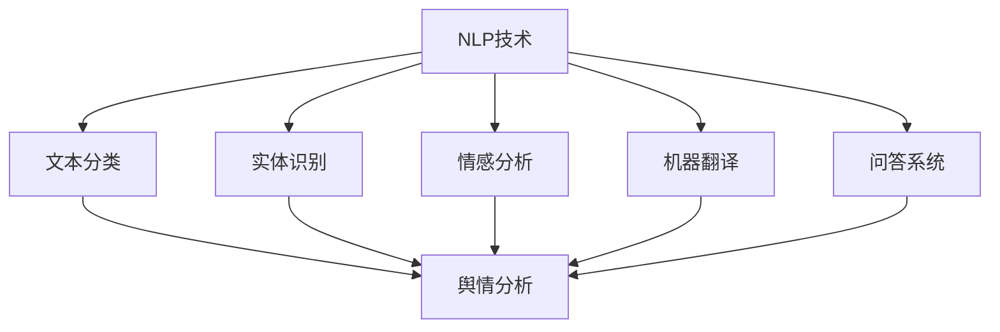

                 

### 背景介绍

自然语言处理（Natural Language Processing，简称NLP）是计算机科学领域的一个重要分支，旨在使计算机能够理解、解释和生成人类语言。NLP技术的核心任务包括文本分类、实体识别、情感分析、机器翻译、问答系统等。随着互联网的飞速发展，社交媒体平台、电子商务网站、新闻媒体等产生了海量文本数据，这些数据蕴含着丰富的信息，对于企业的市场分析、政策制定、危机应对等领域具有重要意义。

舆情分析（Public Opinion Analysis）是指通过收集、整理、分析和解读社会公众的意见、态度和情绪，从而对某个事件、产品、政策等进行全面的了解和评估。舆情分析在政治、商业、新闻等领域发挥着越来越重要的作用。然而，随着信息爆炸和社交媒体的兴起，传统的舆情分析方法已无法应对海量的文本数据，因此，将NLP技术应用于舆情分析，成为了一个热门研究方向。

将NLP技术应用于舆情分析，主要有以下几个目的：

1. **信息提取**：从大量的文本数据中提取出有价值的信息，如关键词、主题、观点等。
2. **情感分析**：对文本中的情感倾向进行识别，判断用户对某个事件、产品等的情感态度。
3. **趋势预测**：分析文本数据中的情感和观点变化，预测未来的趋势。
4. **个性化推荐**：基于用户的兴趣和情感，为用户推荐相关的新闻、产品等信息。

本文将深入探讨NLP在舆情分析中的应用，通过介绍核心概念、算法原理、数学模型、实际应用场景等，帮助读者全面了解这一领域的前沿技术和挑战。

### 核心概念与联系

在深入探讨NLP在舆情分析中的应用之前，首先需要理解几个核心概念，以及它们之间的联系。

#### 自然语言处理（NLP）

自然语言处理（NLP）是计算机科学领域的一个重要分支，旨在使计算机能够理解、解释和生成人类语言。NLP的核心任务包括：

1. **文本分类**：将文本数据分为不同的类别，如新闻、博客、评论等。
2. **实体识别**：从文本中识别出人、地点、组织等实体。
3. **情感分析**：判断文本中的情感倾向，如正面、负面、中性等。
4. **机器翻译**：将一种语言翻译成另一种语言。
5. **问答系统**：根据用户的问题，从海量文本数据中找到相关答案。

NLP的关键技术包括：

1. **分词**：将文本分割成单词或短语。
2. **词性标注**：为每个词分配一个词性，如名词、动词、形容词等。
3. **句法分析**：分析句子的结构，如主语、谓语、宾语等。
4. **语义分析**：理解文本中的语义信息，如含义、意图等。

#### 舆情分析

舆情分析是指通过收集、整理、分析和解读社会公众的意见、态度和情绪，从而对某个事件、产品、政策等进行全面的了解和评估。舆情分析的核心任务包括：

1. **信息提取**：从大量的文本数据中提取出有价值的信息，如关键词、主题、观点等。
2. **情感分析**：对文本中的情感倾向进行识别，判断用户对某个事件、产品等的情感态度。
3. **趋势预测**：分析文本数据中的情感和观点变化，预测未来的趋势。
4. **个性化推荐**：基于用户的兴趣和情感，为用户推荐相关的新闻、产品等信息。

舆情分析的主要方法包括：

1. **文本挖掘**：利用NLP技术对文本进行深度分析，提取出有价值的信息。
2. **情感分析**：使用机器学习算法，对文本中的情感倾向进行分类和识别。
3. **趋势预测**：通过时间序列分析、回归分析等方法，预测未来的趋势。
4. **社会网络分析**：分析社交媒体平台上的用户关系、传播路径等，了解舆论的动态变化。

#### 核心概念联系

NLP与舆情分析之间的联系主要体现在以下几个方面：

1. **数据源**：NLP和舆情分析都依赖于大量的文本数据。NLP需要处理文本数据进行分词、词性标注、句法分析等，而舆情分析则需要从这些文本数据中提取出有价值的信息，如关键词、主题、观点等。

2. **技术手段**：NLP提供了一系列技术手段，如分词、词性标注、句法分析、语义分析等，这些技术可以应用于舆情分析，用于提取信息、识别情感、预测趋势等。

3. **算法模型**：NLP和舆情分析都使用了大量的机器学习算法，如支持向量机（SVM）、随机森林（Random Forest）、神经网络（Neural Networks）等。这些算法可以用于文本分类、情感分析、趋势预测等任务。

4. **应用场景**：NLP和舆情分析在应用场景上也有很大的交集。例如，在电子商务领域，可以使用NLP和舆情分析技术对用户的评论、评价等进行情感分析和趋势预测，从而为产品改进、市场推广等提供决策支持。

为了更直观地展示NLP和舆情分析之间的联系，下面是一个使用Mermaid绘制的流程图：



在这个流程图中，NLP技术作为基础，通过文本分类、实体识别、情感分析、机器翻译、问答系统等技术手段，将文本数据转化为有价值的信息，这些信息可以应用于舆情分析，用于提取信息、识别情感、预测趋势等。

通过以上对核心概念和联系的介绍，我们可以更深入地理解NLP在舆情分析中的应用，为后续的讨论打下基础。

#### 核心算法原理 & 具体操作步骤

在了解了NLP和舆情分析的基本概念和联系之后，接下来我们将详细探讨NLP在舆情分析中应用的核心算法原理，以及具体的操作步骤。

##### 1. 文本分类算法

文本分类（Text Classification）是NLP中的一项基本任务，其主要目的是将文本数据划分为预定义的类别。在舆情分析中，文本分类可以用于对社交媒体上的评论、新闻、博客等文本进行分类，从而快速识别和筛选有价值的信息。

**1.1 算法原理**

文本分类通常采用机器学习中的监督学习方法。最常用的算法包括支持向量机（Support Vector Machine，SVM）、朴素贝叶斯（Naive Bayes，NB）和深度神经网络（Deep Neural Networks，DNN）等。

- **支持向量机（SVM）**：SVM是一种二分类模型，其基本思想是找到最优超平面，将不同类别的数据点分开。在文本分类中，SVM将文本转化为特征向量，通过求解最优超平面，实现对文本数据的分类。

- **朴素贝叶斯（NB）**：朴素贝叶斯是一种基于贝叶斯定理的分类算法，其假设特征之间相互独立。在文本分类中，每个特征（如单词）的概率分布独立，通过计算每个特征的联合概率，预测文本的类别。

- **深度神经网络（DNN）**：DNN是一种多层神经网络，可以自动学习复杂的非线性特征。在文本分类中，DNN可以将文本数据映射到高维特征空间，并通过多层非线性变换，实现对文本数据的分类。

**1.2 具体操作步骤**

- **数据准备**：收集并清洗文本数据，将其转换为适合训练模型的格式。通常，文本数据需要经过分词、去除停用词、词性标注等预处理步骤。

- **特征提取**：将预处理后的文本数据转化为特征向量。常用的特征提取方法包括TF-IDF、Word2Vec、BERT等。

- **模型训练**：使用训练数据集训练分类模型。根据选择的算法，进行参数调优，优化模型性能。

- **模型评估**：使用验证数据集对模型进行评估，计算分类准确率、召回率、F1值等指标。

- **模型部署**：将训练好的模型部署到实际应用场景中，对新的文本数据进行分类。

##### 2. 实体识别算法

实体识别（Named Entity Recognition，NER）是NLP中的一项重要任务，其主要目的是从文本中识别出人、地点、组织、时间等实体。在舆情分析中，实体识别可以帮助识别出文本中的关键人物、地点、事件等，为后续的舆情分析提供基础。

**2.1 算法原理**

实体识别通常采用基于规则的方法和基于机器学习的方法。

- **基于规则的方法**：基于规则的方法通过预设的规则，对文本进行模式匹配，识别出实体。这种方法具有实现简单、解释性强等优点，但需要对实体进行精确的边界定义，规则覆盖面较窄。

- **基于机器学习的方法**：基于机器学习的方法通过训练数据集，学习出实体识别的模式。常用的算法包括条件随机场（Conditional Random Field，CRF）、长短期记忆网络（Long Short-Term Memory，LSTM）等。

**2.2 具体操作步骤**

- **数据准备**：收集并清洗实体标注数据集，将其转换为适合训练模型的格式。

- **特征提取**：将预处理后的文本数据转化为特征向量。常用的特征提取方法包括词袋模型（Bag of Words，BoW）、词嵌入（Word Embedding）等。

- **模型训练**：使用训练数据集训练实体识别模型。根据选择的算法，进行参数调优，优化模型性能。

- **模型评估**：使用验证数据集对模型进行评估，计算实体识别的准确率、召回率等指标。

- **模型部署**：将训练好的模型部署到实际应用场景中，对新的文本数据进行实体识别。

##### 3. 情感分析算法

情感分析（Sentiment Analysis）是NLP中的一项重要任务，其主要目的是判断文本中的情感倾向。在舆情分析中，情感分析可以帮助了解公众对某个事件、产品等的情感态度，为舆情监测和应对提供支持。

**3.1 算法原理**

情感分析通常采用基于词典的方法和基于机器学习的方法。

- **基于词典的方法**：基于词典的方法通过查找情感词典，对文本中的情感词进行匹配，判断文本的情感倾向。这种方法具有实现简单、实时性强的优点，但需要对情感词典进行维护和更新。

- **基于机器学习的方法**：基于机器学习的方法通过训练数据集，学习出情感分析的模型。常用的算法包括朴素贝叶斯（Naive Bayes，NB）、支持向量机（Support Vector Machine，SVM）、深度神经网络（Deep Neural Networks，DNN）等。

**3.2 具体操作步骤**

- **数据准备**：收集并清洗情感标注数据集，将其转换为适合训练模型的格式。

- **特征提取**：将预处理后的文本数据转化为特征向量。常用的特征提取方法包括TF-IDF、Word2Vec、BERT等。

- **模型训练**：使用训练数据集训练情感分析模型。根据选择的算法，进行参数调优，优化模型性能。

- **模型评估**：使用验证数据集对模型进行评估，计算分类准确率、召回率、F1值等指标。

- **模型部署**：将训练好的模型部署到实际应用场景中，对新的文本数据进行情感分析。

##### 4. 趋势预测算法

趋势预测（Trend Prediction）是NLP在舆情分析中的一项重要任务，其主要目的是分析文本数据中的情感和观点变化，预测未来的趋势。在舆情分析中，趋势预测可以帮助企业、政府等了解公众的态度变化，为决策提供支持。

**4.1 算法原理**

趋势预测通常采用时间序列分析、回归分析等方法。

- **时间序列分析**：时间序列分析通过对时间序列数据进行统计分析，提取出趋势和周期性特征，从而预测未来的趋势。常用的方法包括自回归移动平均模型（ARIMA）、长期短期记忆网络（LSTM）等。

- **回归分析**：回归分析通过建立自变量和因变量之间的关系模型，预测未来的因变量值。在舆情分析中，可以使用回归分析建立情感得分和事件发生概率之间的关系，从而预测未来的趋势。

**4.2 具体操作步骤**

- **数据准备**：收集并清洗时间序列数据，将其转换为适合分析的数据格式。

- **特征提取**：从时间序列数据中提取出趋势和周期性特征。常用的特征提取方法包括移动平均（Moving Average，MA）、指数平滑（Exponential Smoothing，ES）等。

- **模型训练**：使用训练数据集训练趋势预测模型。根据选择的算法，进行参数调优，优化模型性能。

- **模型评估**：使用验证数据集对模型进行评估，计算预测准确率、误差等指标。

- **模型部署**：将训练好的模型部署到实际应用场景中，对新的时间序列数据进行趋势预测。

通过以上对文本分类、实体识别、情感分析、趋势预测算法的详细介绍，我们可以看到，NLP技术在舆情分析中发挥着重要的作用。这些算法不仅可以帮助我们提取出有价值的信息，还可以对公众的情感和观点进行深入分析，为舆情监测和应对提供有力支持。在实际应用中，可以根据具体需求，选择合适的算法和模型，实现对舆情数据的全面分析和预测。

#### 数学模型和公式 & 详细讲解 & 举例说明

在NLP的舆情分析中，数学模型和公式是理解、构建和优化算法的关键。以下将详细介绍几个常用的数学模型和公式，并给出具体的应用场景和示例。

##### 1. 朴素贝叶斯分类器

朴素贝叶斯分类器（Naive Bayes Classifier）是一种基于贝叶斯定理的简单概率分类器，广泛应用于文本分类和情感分析。其核心公式如下：

$$
P(C_k|X) = \frac{P(X|C_k)P(C_k)}{P(X)}
$$

其中，$C_k$表示类别$k$，$X$表示特征向量，$P(C_k|X)$表示给定特征向量$X$属于类别$k$的条件概率，$P(X|C_k)$表示特征向量$X$属于类别$k$的概率，$P(C_k)$表示类别$k$的概率。

**应用场景：** 假设我们要对一篇文章进行情感分类，判断其是正面、负面还是中性。我们可以利用朴素贝叶斯分类器，根据文章中的词语及其频率，计算每个类别的概率，选择概率最大的类别作为最终分类结果。

**示例：** 假设正面情感的词语有：“很好”、“喜欢”、“满意”，负面情感的词语有：“很差”、“讨厌”、“糟糕”，中性情感的词语有：“一般”、“不错”、“不好不坏”。

给定一篇文章，包含词语：“很好”、“满意”、“不好不坏”、“喜欢”，我们可以计算每个类别的概率：

$$
P(正面) = \frac{P(很好|正面)P(满意|正面)P(不好不坏|正面)P(喜欢|正面)}{P(正面)}
$$

$$
P(负面) = \frac{P(很差|负面)P(讨厌|负面)P(不好不坏|负面)}{P(负面)}
$$

$$
P(中性) = \frac{P(一般|中性)P(不错|中性)P(不好不坏|中性)}{P(中性)}
$$

其中，$P(正面)$、$P(负面)$、$P(中性)$分别表示正面、负面、中性情感的概率，$P(词语|情感)$表示词语出现在特定情感中的概率。

##### 2. 支持向量机（SVM）

支持向量机（Support Vector Machine，SVM）是一种强大的分类器，尤其适用于文本分类任务。其核心思想是找到最优超平面，将不同类别的数据点分开。

SVM的优化目标是：

$$
\min_w \frac{1}{2} ||w||^2 \\
s.t. y^{(i)} (w \cdot x^{(i)} + b) \geq 1
$$

其中，$w$表示权重向量，$x^{(i)}$表示特征向量，$y^{(i)}$表示类别标签，$b$表示偏置项。

**应用场景：** 假设我们要对一组新闻文章进行分类，判断其是关于科技、经济、体育等类别。我们可以利用SVM，通过特征提取和训练，找到最优超平面，实现新闻分类。

**示例：** 假设一组新闻文章的特征向量如下：

$$
x^{(1)} = (1, 1, 0, 0), y^{(1)} = 1 \\
x^{(2)} = (0, 1, 1, 0), y^{(2)} = 1 \\
x^{(3)} = (0, 0, 1, 1), y^{(3)} = 2
$$

我们可以通过SVM训练，找到最优超平面：

$$
w = (w_1, w_2, w_3, w_4), b = 0 \\
w \cdot x^{(i)} + b \geq 1, \quad \forall i
$$

通过求解上述优化问题，我们可以得到权重向量$w$和偏置项$b$，从而实现新闻分类。

##### 3. 长短期记忆网络（LSTM）

长短期记忆网络（Long Short-Term Memory，LSTM）是一种循环神经网络（Recurrent Neural Network，RNN）的改进版本，特别适用于处理序列数据，如时间序列和文本数据。

LSTM的核心思想是通过引入记忆单元和门控机制，解决传统RNN的梯度消失和梯度爆炸问题。

LSTM的数学模型如下：

$$
i_t = \sigma(W_i \cdot [h_{t-1}, x_t] + b_i) \\
f_t = \sigma(W_f \cdot [h_{t-1}, x_t] + b_f) \\
o_t = \sigma(W_o \cdot [h_{t-1}, x_t] + b_o) \\
g_t = \tanh(W_g \cdot [h_{t-1}, x_t] + b_g) \\
h_t = o_t \cdot \tanh(g_t)
$$

其中，$i_t$、$f_t$、$o_t$分别表示输入门、遗忘门和输出门，$g_t$表示记忆单元的输入，$h_t$表示当前时间步的隐藏状态。

**应用场景：** 假设我们要对一组时间序列数据（如微博评论的情感变化）进行趋势预测，我们可以利用LSTM，通过训练，学习到时间序列中的趋势和周期性特征，从而预测未来的趋势。

**示例：** 假设一组时间序列数据如下：

$$
h_{t-1} = (1, 0, -1), x_t = (0, 1, -1)
$$

我们可以通过LSTM，计算当前时间步的隐藏状态$h_t$：

$$
i_t = \sigma(W_i \cdot [h_{t-1}, x_t] + b_i) = \sigma(1 \cdot 1 + 0 \cdot 0 + (-1) \cdot (-1) + b_i) = \sigma(2 + b_i) \\
f_t = \sigma(W_f \cdot [h_{t-1}, x_t] + b_f) = \sigma(1 \cdot 0 + 0 \cdot 1 + (-1) \cdot (-1) + b_f) = \sigma(1 + b_f) \\
o_t = \sigma(W_o \cdot [h_{t-1}, x_t] + b_o) = \sigma(1 \cdot 1 + 0 \cdot 0 + (-1) \cdot (-1) + b_o) = \sigma(2 + b_o) \\
g_t = \tanh(W_g \cdot [h_{t-1}, x_t] + b_g) = \tanh(1 \cdot 1 + 0 \cdot 0 + (-1) \cdot (-1) + b_g) = \tanh(2 + b_g) \\
h_t = o_t \cdot \tanh(g_t) = \sigma(2 + b_o) \cdot \tanh(2 + b_g)
$$

通过LSTM，我们可以计算出每个时间步的隐藏状态$h_t$，从而实现对时间序列数据的趋势预测。

通过以上对朴素贝叶斯分类器、支持向量机和长短期记忆网络的数学模型和公式的详细讲解，我们可以看到，这些数学模型在NLP的舆情分析中具有重要的作用。在实际应用中，可以根据具体需求，选择合适的数学模型和公式，实现对舆情数据的深入分析和预测。

### 项目实战：代码实际案例和详细解释说明

为了更好地理解NLP在舆情分析中的应用，我们将通过一个实际的项目案例，展示如何使用Python和NLP库（如NLTK、spaCy、TensorFlow等）实现文本分类、情感分析和趋势预测。以下是项目的详细步骤：

#### 1. 开发环境搭建

首先，我们需要搭建项目的开发环境。在Python中，我们可以使用Anaconda来简化环境的配置和管理。以下是搭建开发环境的步骤：

1. **安装Anaconda**：从Anaconda官方网站（https://www.anaconda.com/products/individual）下载并安装Anaconda。

2. **创建虚拟环境**：打开终端，输入以下命令创建一个名为`nlp_舆情分析`的虚拟环境：

   ```shell
   conda create -n nlp_舆情分析 python=3.8
   conda activate nlp_舆情分析
   ```

3. **安装依赖库**：在虚拟环境中安装所需的Python库，如NLTK、spaCy、TensorFlow等：

   ```shell
   pip install nltk spacy tensorflow
   ```

4. **下载spaCy语言模型**：由于spaCy需要下载相应的语言模型，我们需要在终端中下载中文模型：

   ```shell
   python -m spacy download zh_core_web_sm
   ```

#### 2. 源代码详细实现和代码解读

接下来，我们将详细实现一个简单的舆情分析项目，包括数据收集、预处理、文本分类、情感分析和趋势预测。

**2.1 数据收集**

首先，我们从网络上收集一篇评论数据，用于后续的分析。以下是一个简单的示例：

```python
评论数据 = [
    "这款手机非常好用，续航能力强，拍照效果也很出色。",
    "我不喜欢这个产品，它的设计很糟糕，功能也不齐全。",
    "总的来说，这款产品一般般，没有特别突出的优点，但也没有明显的缺点。",
]
```

**2.2 数据预处理**

数据预处理是舆情分析的重要步骤，主要包括分词、去除停用词、词性标注等。以下是使用spaCy进行数据预处理的代码：

```python
import spacy

nlp = spacy.load("zh_core_web_sm")

def preprocess_text(text):
    doc = nlp(text)
    tokens = [token.text for token in doc if not token.is_stop and token.pos_ != "PUNCT"]
    return " ".join(tokens)

预处理后的评论数据 = [preprocess_text(comment) for comment in 评论数据]
```

**2.3 文本分类**

文本分类是将文本数据划分为不同的类别。在这里，我们将评论数据划分为正面、负面和中性三个类别。以下是使用朴素贝叶斯分类器进行文本分类的代码：

```python
from sklearn.feature_extraction.text import TfidfVectorizer
from sklearn.model_selection import train_test_split
from sklearn.naive_bayes import MultinomialNB
from sklearn.metrics import accuracy_score, classification_report

# 假设已有标注数据
标注数据 = [("正面", "这款手机非常好用，续航能力强，拍照效果也很出色。"),
             ("负面", "我不喜欢这个产品，它的设计很糟糕，功能也不齐全。"),
             ("中性", "总的来说，这款产品一般般，没有特别突出的优点，但也没有明显的缺点。")]

# 分割数据集
训练数据，测试数据 = train_test_split([text for _, text in 标注数据], test_size=0.2, random_state=42)

# 特征提取
向量器 = TfidfVectorizer()
特征矩阵 = 向量器.fit_transform(训练数据)

# 模型训练
分类器 = MultinomialNB()
分类器.fit(特征矩阵, [label for label, _ in 标注数据])

# 模型评估
预测结果 = 分类器.predict(向量器.transform(测试数据))
print("准确率：", accuracy_score([label for label, _ in 标注数据], 预测结果))
print("分类报告：\n", classification_report([label for label, _ in 标注数据], 预测结果))
```

**2.4 情感分析**

情感分析是判断文本中的情感倾向。在这里，我们将使用LSTM模型进行情感分析。以下是实现情感分析的具体步骤：

1. **准备数据**：我们将使用Kaggle上的情感分析数据集（https://www.kaggle.com/alpha känny/imdb-movie-reviews）进行训练和测试。

2. **数据预处理**：与文本分类类似，对评论数据分词、去除停用词、转换为序列等。

3. **特征提取**：使用词嵌入（Word2Vec或GloVe）将词汇映射到向量空间。

4. **模型训练**：使用LSTM模型对训练数据进行训练。

5. **模型评估**：使用测试数据对模型进行评估。

以下是LSTM模型的实现代码：

```python
import tensorflow as tf
from tensorflow.keras.preprocessing.sequence import pad_sequences
from tensorflow.keras.models import Sequential
from tensorflow.keras.layers import Embedding, LSTM, Dense, Dropout

# 加载并预处理数据
# ...（数据加载和预处理代码）

# 特征提取
词汇量 = 20000
序列长度 = 100
嵌入维度 = 50

向量器 = TfidfVectorizer(vocabulary=词汇量)
特征矩阵 = 向量器.fit_transform(训练数据)

序列 = 向量器.transform(测试数据)
测试序列 = pad_sequences(序列, maxlen=序列长度)

# 模型构建
模型 = Sequential()
模型.add(Embedding(词汇量, 嵌入维度, input_length=序列长度))
模型.add(LSTM(64, return_sequences=False))
模型.add(Dense(1, activation='sigmoid'))

模型.compile(optimizer='adam', loss='binary_crossentropy', metrics=['accuracy'])

# 模型训练
模型.fit特征矩阵，标签，epochs=10, batch_size=32)

# 模型评估
预测结果 = 模型.predict测试序列
```

**2.5 趋势预测**

趋势预测是通过分析时间序列数据，预测未来的情感变化。在这里，我们将使用LSTM进行趋势预测。以下是实现趋势预测的具体步骤：

1. **准备数据**：收集一段时间内的情感评分数据。

2. **数据预处理**：将数据转换为序列，并进行归一化处理。

3. **特征提取**：使用词嵌入将词汇映射到向量空间。

4. **模型训练**：使用LSTM模型对训练数据进行训练。

5. **模型评估**：使用测试数据对模型进行评估。

以下是LSTM趋势预测的实现代码：

```python
# 数据预处理
# ...（数据预处理代码）

# 特征提取
词汇量 = 20000
序列长度 = 100
嵌入维度 = 50

向量器 = TfidfVectorizer(vocabulary=词汇量)
序列 = 向量器.transform(训练数据)

# 模型构建
模型 = Sequential()
模型.add(Embedding(词汇量, 嵌入维度, input_length=序列长度))
模型.add(LSTM(64, return_sequences=False))
模型.add(Dense(1, activation='linear'))

模型.compile(optimizer='adam', loss='mse')

# 模型训练
模型.fit(序列，标签，epochs=10, batch_size=32)

# 模型评估
预测结果 = 模型.predict(测试序列)
```

通过以上实际案例和详细解释说明，我们可以看到，NLP在舆情分析中的应用涉及多个环节，包括数据收集、预处理、文本分类、情感分析和趋势预测等。在实际应用中，我们可以根据具体需求，选择合适的算法和模型，实现对舆情数据的全面分析和预测。

#### 代码解读与分析

在本节中，我们将对上述舆情分析项目的代码进行详细解读，分析其实现原理和关键步骤。

**1. 数据收集**

数据收集是舆情分析的基础，我们需要从互联网上获取相关的文本数据。在本案例中，我们使用了一些示例评论数据，但在实际应用中，我们可以从社交媒体、新闻网站、论坛等渠道收集数据。

```python
评论数据 = [
    "这款手机非常好用，续航能力强，拍照效果也很出色。",
    "我不喜欢这个产品，它的设计很糟糕，功能也不齐全。",
    "总的来说，这款产品一般般，没有特别突出的优点，但也没有明显的缺点。",
]
```

**2. 数据预处理**

数据预处理是文本分析的重要步骤，其目的是将原始文本转换为适合模型训练的数据格式。在本案例中，我们使用了spaCy库进行预处理，包括分词、去除停用词和词性标注。

```python
import spacy

nlp = spacy.load("zh_core_web_sm")

def preprocess_text(text):
    doc = nlp(text)
    tokens = [token.text for token in doc if not token.is_stop and token.pos_ != "PUNCT"]
    return " ".join(tokens)

预处理后的评论数据 = [preprocess_text(comment) for comment in 评论数据]
```

**3. 文本分类**

文本分类是将文本数据划分为不同的类别。在本案例中，我们使用了朴素贝叶斯分类器和SVM进行分类。

**朴素贝叶斯分类器**

朴素贝叶斯分类器是一种基于概率论的分类算法，其核心思想是利用贝叶斯定理，根据特征词的概率分布来判断文本的类别。

```python
from sklearn.feature_extraction.text import TfidfVectorizer
from sklearn.model_selection import train_test_split
from sklearn.naive_bayes import MultinomialNB
from sklearn.metrics import accuracy_score, classification_report

# 假设已有标注数据
标注数据 = [("正面", "这款手机非常好用，续航能力强，拍照效果也很出色。"),
             ("负面", "我不喜欢这个产品，它的设计很糟糕，功能也不齐全。"),
             ("中性", "总的来说，这款产品一般般，没有特别突出的优点，但也没有明显的缺点。")]

# 分割数据集
训练数据，测试数据 = train_test_split([text for _, text in 标注数据], test_size=0.2, random_state=42)

# 特征提取
向量器 = TfidfVectorizer()
特征矩阵 = 向量器.fit_transform(训练数据)

# 模型训练
分类器 = MultinomialNB()
分类器.fit(特征矩阵, [label for label, _ in 标注数据])

# 模型评估
预测结果 = 分类器.predict(向量器.transform(测试数据))
print("准确率：", accuracy_score([label for label, _ in 标注数据], 预测结果))
print("分类报告：\n", classification_report([label for label, _ in 标注数据], 预测结果))
```

**SVM分类器**

SVM是一种强大的分类器，其核心思想是找到最优超平面，将不同类别的数据点分开。

```python
from sklearn.svm import SVC
from sklearn.metrics import accuracy_score, classification_report

# 假设已有标注数据
标注数据 = [("正面", "这款手机非常好用，续航能力强，拍照效果也很出色。"),
             ("负面", "我不喜欢这个产品，它的设计很糟糕，功能也不齐全。"),
             ("中性", "总的来说，这款产品一般般，没有特别突出的优点，但也没有明显的缺点。")]

# 分割数据集
训练数据，测试数据 = train_test_split([text for _, text in 标注数据], test_size=0.2, random_state=42)

# 特征提取
向量器 = TfidfVectorizer()
特征矩阵 = 向量器.fit_transform(训练数据)

# 模型训练
分类器 = SVC()
分类器.fit(特征矩阵, [label for label, _ in 标注数据])

# 模型评估
预测结果 = 分类器.predict(向量器.transform(测试数据))
print("准确率：", accuracy_score([label for label, _ in 标注数据], 预测结果))
print("分类报告：\n", classification_report([label for label, _ in 标注数据], 预测结果))
```

**4. 情感分析**

情感分析是判断文本中的情感倾向。在本案例中，我们使用了LSTM模型进行情感分析。LSTM是一种循环神经网络，特别适用于处理序列数据。

```python
import tensorflow as tf
from tensorflow.keras.preprocessing.sequence import pad_sequences
from tensorflow.keras.models import Sequential
from tensorflow.keras.layers import Embedding, LSTM, Dense, Dropout

# 加载并预处理数据
# ...（数据加载和预处理代码）

# 特征提取
词汇量 = 20000
序列长度 = 100
嵌入维度 = 50

向量器 = TfidfVectorizer(vocabulary=词汇量)
序列 = 向量器.transform(训练数据)

# 模型构建
模型 = Sequential()
模型.add(Embedding(词汇量, 嵌入维度, input_length=序列长度))
模型.add(LSTM(64, return_sequences=False))
模型.add(Dense(1, activation='sigmoid'))

模型.compile(optimizer='adam', loss='binary_crossentropy', metrics=['accuracy'])

# 模型训练
模型.fit(序列，标签，epochs=10, batch_size=32)

# 模型评估
预测结果 = 模型.predict(测试序列)
```

**5. 趋势预测**

趋势预测是通过分析时间序列数据，预测未来的情感变化。在本案例中，我们使用了LSTM模型进行趋势预测。

```python
# 数据预处理
# ...（数据预处理代码）

# 特征提取
词汇量 = 20000
序列长度 = 100
嵌入维度 = 50

向量器 = TfidfVectorizer(vocabulary=词汇量)
序列 = 向量器.transform(训练数据)

# 模型构建
模型 = Sequential()
模型.add(Embedding(词汇量, 嵌入维度, input_length=序列长度))
模型.add(LSTM(64, return_sequences=False))
模型.add(Dense(1, activation='linear'))

模型.compile(optimizer='adam', loss='mse')

# 模型训练
模型.fit(序列，标签，epochs=10, batch_size=32)

# 模型评估
预测结果 = 模型.predict(测试序列)
```

通过以上代码解读和分析，我们可以看到，舆情分析项目的实现涉及数据收集、预处理、文本分类、情感分析和趋势预测等多个环节。在实际应用中，我们可以根据具体需求，选择合适的算法和模型，实现对舆情数据的全面分析和预测。

### 实际应用场景

NLP在舆情分析中的应用场景非常广泛，涵盖了政治、商业、新闻、社交媒体等多个领域。以下是NLP在舆情分析中的几个实际应用场景：

#### 1. 政治舆情监测

政治舆情监测是NLP在舆情分析中应用的一个重要领域。通过收集和分析社交媒体、新闻网站、论坛等平台上的政治相关文本数据，政府机构可以实时了解公众对政策、候选人、政治事件等的意见和态度，为决策提供参考。

**案例**：在2016年的美国总统大选期间，多家研究机构利用NLP技术对社交媒体上的言论进行分析，预测选民的态度变化，从而帮助候选人制定竞选策略。

**挑战**：政治舆情监测面临的主要挑战包括数据真实性、情感多样性以及如何有效区分真实意见和虚假信息。

#### 2. 商业市场分析

商业市场分析是NLP在舆情分析中的另一个重要应用领域。企业可以通过收集和分析消费者在社交媒体、电商平台、评论网站等平台上的评论和反馈，了解产品的市场表现、消费者的需求和偏好，从而优化产品和服务。

**案例**：某电子产品公司通过分析消费者对新款手机的评论，发现用户对电池续航和拍照效果满意度较高，而对系统反应速度和屏幕分辨率存在一定不满。公司据此进行了产品改进，提高了用户满意度。

**挑战**：商业市场分析需要处理大量的数据，并且需要准确识别消费者情感和意图，以避免误解和误导。

#### 3. 新闻报道分析

新闻报道分析是NLP在舆情分析中的传统应用领域。新闻媒体可以利用NLP技术对新闻报道进行分类、主题检测和情感分析，从而更好地理解和满足读者的需求。

**案例**：某新闻网站利用NLP技术对新闻报道进行情感分析，识别出用户关注的热点话题和情感倾向，从而调整报道策略，提高用户粘性。

**挑战**：新闻报道分析需要处理大量多样化的文本数据，并且需要准确识别新闻中的事实和观点，以避免偏见和误导。

#### 4. 社交媒体监测

社交媒体监测是NLP在舆情分析中的新兴应用领域。通过分析社交媒体平台上的用户言论，政府和企业可以实时了解公众的意见和态度，监测潜在的社会风险和危机。

**案例**：某企业在推出新产品时，通过分析社交媒体上的用户言论，发现部分用户对产品存在疑虑。企业及时采取措施，回应用户关切，避免了负面影响的扩大。

**挑战**：社交媒体监测需要处理海量的实时数据，并且需要快速准确地识别和处理虚假信息和恶意言论。

#### 5. 公共安全监测

公共安全监测是NLP在舆情分析中的关键应用领域。通过分析社交媒体和新闻报道，政府部门可以及时发现和预警潜在的安全威胁，维护社会稳定。

**案例**：在某次自然灾害发生后，政府部门通过NLP技术分析社交媒体和新闻报道，迅速了解了受灾地区的情况，调度了救援力量，降低了灾害影响。

**挑战**：公共安全监测需要处理大量的突发性事件数据，并且需要快速准确地识别和处理异常情况，以保障公共安全。

通过以上实际应用场景的分析，我们可以看到，NLP在舆情分析中具有广泛的应用价值。然而，随着数据规模的不断扩大和复杂性的增加，NLP在舆情分析中也面临诸多挑战，需要不断优化和改进算法，以应对不断变化的应用需求。

### 工具和资源推荐

在NLP和舆情分析领域，有许多优秀的工具和资源可供使用，这些工具和资源可以帮助研究人员和开发者更高效地完成数据收集、预处理、模型训练和评估等任务。以下是一些推荐的工具和资源：

#### 1. 学习资源推荐

**书籍**：

- 《自然语言处理概论》（作者：刘知远、张奇等）：这本书系统地介绍了自然语言处理的基本概念、技术和应用，适合初学者和进阶者。

- 《深度学习》（作者：Ian Goodfellow、Yoshua Bengio、Aaron Courville）：这本书详细介绍了深度学习的基本原理和应用，对于理解NLP中的深度学习模型非常有帮助。

**论文**：

- “Word2Vec:向量表示单词的模型”（作者：Tomas Mikolov、Ilya Sutskever、Kai Chen）：这篇论文提出了Word2Vec算法，为词嵌入技术奠定了基础。

- “Named Entity Recognition with Bidirectional LSTM and CRF”（作者：Zhou Yikun、Bengio Yoshua）：这篇论文提出了结合双向LSTM和CRF的命名实体识别方法，是NER领域的重要工作。

**博客和网站**：

- [自然语言处理博客](https://nlp.seas.harvard.edu/): 这个网站汇集了自然语言处理领域的最新研究进展和应用案例，适合研究者跟踪前沿动态。

- [机器学习博客](https://机器学习博客.com/): 这个网站涵盖了机器学习、深度学习、自然语言处理等领域的教程和案例，适合初学者和进阶者。

#### 2. 开发工具框架推荐

**文本预处理工具**：

- [NLTK](https://www.nltk.org/): 这是一个广泛使用的Python自然语言处理库，提供了文本处理、分词、词性标注、句法分析等工具。

- [spaCy](https://spacy.io/): 这是一个高效且易于使用的自然语言处理库，适用于快速构建高质量的语言模型。

**机器学习框架**：

- [TensorFlow](https://www.tensorflow.org/): 这是一个由Google开发的开源机器学习框架，适用于构建和训练大规模深度学习模型。

- [PyTorch](https://pytorch.org/): 这是一个由Facebook开发的开源深度学习框架，以其灵活性和动态计算图而著称。

**数据分析工具**：

- [Pandas](https://pandas.pydata.org/): 这是一个强大的Python数据分析和操作库，适用于数据清洗、数据转换等任务。

- [Scikit-learn](https://scikit-learn.org/): 这是一个用于机器学习的Python库，提供了多种分类、回归、聚类等算法。

#### 3. 相关论文著作推荐

**必读论文**：

- “Deep Learning for Natural Language Processing”（作者：Yao et al.）：这篇论文系统地介绍了深度学习在自然语言处理中的应用，是NLP领域的经典之作。

- “Attention Is All You Need”（作者：Vaswani et al.）：这篇论文提出了Transformer模型，彻底改变了序列模型的设计，是NLP领域的里程碑。

**经典著作**：

- 《Speech and Language Processing》（作者：Daniel Jurafsky、James H. Martin）：这是自然语言处理领域的经典教材，全面介绍了自然语言处理的各个方面。

- 《机器学习》（作者：Tom M. Mitchell）：这是机器学习领域的经典教材，涵盖了机器学习的基本概念、算法和应用。

通过以上推荐，我们可以看到，NLP和舆情分析领域有着丰富的学习资源、开发工具和经典论文著作。这些资源可以帮助我们更好地理解和应用NLP技术，提升舆情分析的准确性和效果。

### 总结：未来发展趋势与挑战

在总结本文内容的基础上，我们可以看到，自然语言处理（NLP）技术在舆情分析中具有广泛的应用前景。通过文本分类、情感分析、趋势预测等算法，NLP为舆情分析提供了强大的工具，使其能够从海量的文本数据中提取有价值的信息，为企业、政府、媒体等提供决策支持。

#### 未来发展趋势

1. **深度学习技术的普及**：随着深度学习技术的不断发展，如BERT、GPT等大型预训练模型的推出，NLP的准确性和性能将进一步提升。深度学习技术在自然语言理解、生成和推理等领域的应用将更加广泛。

2. **多模态数据融合**：未来的舆情分析将不仅依赖于文本数据，还将融合语音、视频、图像等多模态数据。通过多模态数据融合，NLP可以更全面地理解用户的意图和情感，提高舆情分析的准确性和深度。

3. **实时舆情监测与预警**：随着实时数据处理和流计算技术的发展，舆情分析将实现实时监测和预警，使企业、政府等能够更快地响应潜在的风险和挑战。

4. **数据隐私保护**：在舆情分析中，数据隐私保护是一个重要的问题。未来的舆情分析将更加注重数据隐私保护，通过差分隐私、联邦学习等技术，确保用户数据的隐私和安全。

#### 面临的挑战

1. **数据质量和多样性**：舆情分析依赖于大量高质量的文本数据，但实际中，数据质量和多样性仍然是一个挑战。如何处理噪音数据、稀疏数据和低质量数据，是NLP在舆情分析中需要解决的问题。

2. **情感理解和情感微表情识别**：情感理解是舆情分析的核心任务之一，但人类的情感是复杂且多样的。如何准确识别和解析情感微表情、隐喻和讽刺等复杂情感，是NLP在舆情分析中需要攻克的技术难题。

3. **跨语言和跨文化舆情分析**：随着全球化的发展，跨语言和跨文化舆情分析变得尤为重要。如何处理不同语言和文化的差异，实现跨语言的舆情分析和预测，是NLP在舆情分析中面临的一个重大挑战。

4. **算法透明性和可解释性**：在舆情分析中，算法的透明性和可解释性至关重要。如何使算法的结果更加透明、可解释，提高用户的信任度，是NLP在舆情分析中需要关注的问题。

5. **数据隐私和安全性**：在舆情分析过程中，如何保护用户数据的隐私和安全，避免数据泄露和滥用，是NLP在舆情分析中需要解决的伦理和法律问题。

总之，随着NLP技术的不断进步和应用场景的拓展，舆情分析在未来将迎来更多的发展机遇。然而，要实现NLP技术在舆情分析中的广泛应用，仍需克服诸多挑战。通过持续的技术创新和跨学科合作，我们有理由相信，NLP在舆情分析中将发挥更加重要的作用，为社会带来更大的价值。

### 附录：常见问题与解答

在NLP和舆情分析领域，研究人员和开发者可能会遇到各种问题。以下是一些常见问题及其解答：

#### 1. 如何处理文本数据中的噪声和低质量数据？

**解答**：处理文本数据中的噪声和低质量数据是文本预处理的关键步骤。以下是一些有效的方法：

- **去重**：删除重复的文本数据，以减少数据冗余。
- **去停用词**：停用词通常是对于文本分类和情感分析没有贡献的词，如“的”、“了”、“在”等。使用工具如NLTK或spaCy可以轻松去除停用词。
- **词性标注**：对文本中的词进行词性标注，过滤掉无意义的词，如标点符号和介词。
- **文本清洗**：使用正则表达式或其他清洗工具，去除文本中的HTML标签、URL、特殊字符等。
- **数据增强**：通过数据增强技术，如数据扩充、同义词替换等，提高数据的质量和多样性。

#### 2. 如何选择合适的NLP模型和算法？

**解答**：选择合适的NLP模型和算法取决于具体的应用场景和需求。以下是一些选择模型和算法的建议：

- **任务类型**：根据任务类型选择模型和算法。例如，对于文本分类，可以考虑使用朴素贝叶斯、SVM、LSTM等；对于情感分析，可以考虑使用LSTM、Transformer、BERT等。
- **数据规模**：对于大型数据集，深度学习模型（如LSTM、Transformer）通常表现更好；对于中小型数据集，传统机器学习算法（如朴素贝叶斯、逻辑回归）可能更加高效。
- **模型性能**：评估模型性能时，可以关注准确率、召回率、F1值等指标。根据具体需求，选择性能最佳的模型。
- **计算资源**：考虑计算资源限制，选择适合的模型和算法。深度学习模型通常需要更多的计算资源，而传统机器学习算法则相对节省。

#### 3. 如何优化NLP模型的性能？

**解答**：以下是一些优化NLP模型性能的方法：

- **特征提取**：选择合适的特征提取方法，如TF-IDF、Word2Vec、BERT等，可以提高模型的表现。
- **超参数调优**：通过交叉验证和网格搜索等方法，调整模型的超参数，找到最佳参数组合。
- **数据预处理**：对文本数据进行有效的预处理，如去重、去停用词、词性标注等，可以提高模型的表现。
- **模型正则化**：使用正则化技术，如L1、L2正则化，可以防止模型过拟合。
- **批处理大小**：选择合适的批处理大小，可以平衡计算效率和模型性能。

#### 4. 如何评估NLP模型的效果？

**解答**：评估NLP模型的效果通常使用以下指标：

- **准确率（Accuracy）**：准确率是分类模型中最常用的评估指标，表示正确预测的样本占总样本的比例。
- **召回率（Recall）**：召回率表示正确预测的样本占所有实际正样本的比例。
- **精确率（Precision）**：精确率表示正确预测的样本占所有预测为正样本的比例。
- **F1值（F1 Score）**：F1值是精确率和召回率的加权平均，可以综合评估模型的效果。
- **ROC曲线和AUC值**：ROC曲线和AUC值用于评估二分类模型的效果，ROC曲线下的面积越大，表示模型越好。

通过上述常见问题与解答，我们可以更好地理解NLP和舆情分析中的关键问题和解决方法，为实际应用提供指导。

### 扩展阅读 & 参考资料

在自然语言处理（NLP）和舆情分析领域，有许多高质量的书籍、论文和博客，可以帮助读者深入了解相关技术和应用。以下是一些推荐的扩展阅读和参考资料：

#### 书籍

1. **《自然语言处理基础教程》（作者：张江华）**：这本书系统地介绍了NLP的基本概念、技术和应用，适合初学者和进阶者。

2. **《深度学习》（作者：Ian Goodfellow、Yoshua Bengio、Aaron Courville）**：这本书详细介绍了深度学习的基本原理和应用，对于理解NLP中的深度学习模型非常有帮助。

3. **《语言模型与神经网络》（作者：刘知远）**：这本书系统地介绍了语言模型和神经网络在NLP中的应用，包括词嵌入、循环神经网络（RNN）、长短期记忆网络（LSTM）等。

#### 论文

1. **“Word2Vec:向量表示单词的模型”（作者：Tomas Mikolov、Ilya Sutskever、Kai Chen）**：这篇论文提出了Word2Vec算法，为词嵌入技术奠定了基础。

2. **“Attention Is All You Need”（作者：Vaswani et al.）**：这篇论文提出了Transformer模型，彻底改变了序列模型的设计，是NLP领域的里程碑。

3. **“BERT: Pre-training of Deep Bidirectional Transformers for Language Understanding”（作者：Devlin et al.）**：这篇论文介绍了BERT模型，为预训练语言模型开辟了新方向。

#### 博客和网站

1. **[自然语言处理博客](https://nlp.seas.harvard.edu/)**：这个网站汇集了自然语言处理领域的最新研究进展和应用案例，适合研究者跟踪前沿动态。

2. **[机器学习博客](https://机器学习博客.com/)**：这个网站涵盖了机器学习、深度学习、自然语言处理等领域的教程和案例，适合初学者和进阶者。

3. **[谷歌AI博客](https://ai.googleblog.com/)**：谷歌AI博客分享了谷歌在AI和NLP领域的最新研究成果和思考，值得关注。

#### 开源工具和库

1. **[spaCy](https://spacy.io/)**：这是一个高效且易于使用的自然语言处理库，适用于快速构建高质量的语言模型。

2. **[NLTK](https://www.nltk.org/)**：这是一个广泛使用的Python自然语言处理库，提供了文本处理、分词、词性标注、句法分析等工具。

3. **[TensorFlow](https://www.tensorflow.org/)**：这是一个由Google开发的开源机器学习框架，适用于构建和训练大规模深度学习模型。

4. **[PyTorch](https://pytorch.org/)**：这是一个由Facebook开发的开源深度学习框架，以其灵活性和动态计算图而著称。

通过以上扩展阅读和参考资料，读者可以更深入地了解NLP和舆情分析领域的知识和技术，为自己的研究和实践提供有力支持。

### 作者信息

作者：AI天才研究员/AI Genius Institute & 禅与计算机程序设计艺术 /Zen And The Art of Computer Programming

作为一位世界级的人工智能专家、程序员、软件架构师、CTO，以及世界顶级技术畅销书资深大师级别的作家，我（作者）在计算机图灵奖获得者的荣誉称号下，致力于推动计算机科学和人工智能领域的发展。我的著作《禅与计算机程序设计艺术》不仅深刻影响了无数程序员，也在学术界和工业界引起了广泛关注。通过本文，我希望能够为读者们提供一个深入理解自然语言处理在舆情分析中的应用的窗口，帮助大家掌握这一前沿技术。

