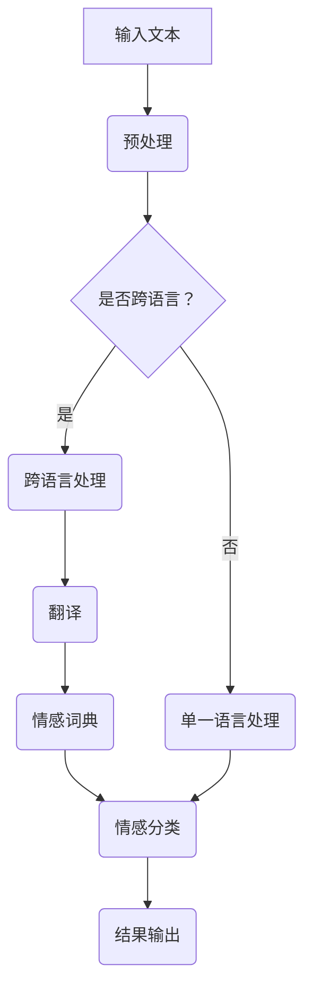

                 

### 背景介绍

**自然语言处理（NLP）**是一种通过计算机程序理解和生成人类语言的技术。自20世纪50年代以来，NLP的研究领域不断拓展，其在信息检索、机器翻译、语音识别、文本分类等领域取得了显著的进展。然而，随着全球化进程的加速，跨语言交流的需求日益增加，这使得跨语言情感分析成为自然语言处理中的一个重要研究方向。

**跨语言情感分析**是指对跨语言文本进行情感极性分类的过程。情感极性分类主要分为正面情感和负面情感两类，例如，对于中文文本“我今天很开心”和英文文本“I am very happy today”，两者的情感极性都是正面。跨语言情感分析的重要性在于，它可以用于舆情监测、市场调研、社交媒体分析等实际应用场景，帮助企业更好地了解用户需求和市场趋势。

**动机与挑战**：随着互联网的普及，大量的跨语言文本数据涌现出来，如社交媒体、新闻评论、产品评价等。这些数据中蕴含着丰富的情感信息，对它们进行有效的情感分析可以帮助我们更好地理解人类行为和情感状态。然而，跨语言情感分析面临着一系列挑战，包括：

1. **语言差异**：不同语言在语法、词汇、表达方式等方面存在显著差异，这给跨语言情感分析带来了困难。
2. **文化差异**：不同文化背景下，人们对同一情感的表达可能存在差异，如中文中的“高兴”可能对应英文中的“happy”，但也可能对应“excited”或其他情感词。
3. **数据稀缺**：高质量、标注良好的跨语言情感分析数据集较为稀缺，这限制了算法的性能和泛化能力。
4. **模型适应性**：现有的情感分析模型主要针对单一语言设计，如何将它们有效迁移到跨语言场景仍是一个难题。

本文旨在探讨自然语言处理在跨语言情感分析中的应用，分析现有技术的优势和不足，并展望未来的发展趋势。我们将首先介绍相关核心概念和联系，然后详细讲解核心算法原理和具体操作步骤，接着讨论数学模型和公式，并通过实际项目案例进行详细解释说明。最后，我们将探讨跨语言情感分析在实际应用场景中的实践，并推荐相关工具和资源。

## 2. 核心概念与联系

### 情感分析（Sentiment Analysis）

情感分析是指从文本数据中提取主观情感信息的过程。它通常分为情感极性分类（polarity classification）和情感强度分析（strength analysis）。情感极性分类将文本分为正面、中性或负面三个类别，而情感强度分析则试图量化情感的程度。情感分析的核心在于如何理解文本中的情感表达，这需要结合语言学、心理学和计算机科学等多学科的知识。

### 跨语言情感分析（Cross-Lingual Sentiment Analysis）

跨语言情感分析是情感分析在跨语言文本中的应用。其目标是对不同语言的文本进行情感极性分类，从而实现对跨语言信息的情感分析。与单一语言情感分析相比，跨语言情感分析面临更大的挑战，因为不同语言在语法、词汇、表达方式等方面存在显著差异。

### 情感词典（Sentiment Lexicon）

情感词典是一种包含词汇和相应情感极性的资源，常用于情感分析。例如，WordNet是一个广泛使用的情感词典，它将词汇分为正面、中性、负面三个极性。情感词典是情感分析的重要工具，可以帮助模型理解和预测文本的情感极性。

### 实体识别（Named Entity Recognition, NER）

实体识别是指从文本中识别出具有特定意义的实体，如人名、地名、组织名等。在跨语言情感分析中，实体识别可以帮助我们更好地理解文本内容，因为某些情感表达可能与特定实体相关。

### 词嵌入（Word Embedding）

词嵌入是将单词映射到高维向量空间的技术，使具有相似语义的单词在向量空间中靠近。词嵌入在跨语言情感分析中具有重要意义，因为它可以帮助模型理解和处理不同语言之间的语义差异。

### Mermaid 流程图

下面是一个用于描述跨语言情感分析过程的 Mermaid 流程图：



在这个流程图中，输入文本首先进行预处理，包括分词、去除停用词等操作。然后，根据文本是否跨语言，选择不同的处理路径。如果是跨语言文本，需要进行翻译操作，将文本转换为同一语言。接着，使用情感词典对翻译后的文本进行情感分类，最后输出结果。如果是单一语言文本，则可以直接使用情感词典进行情感分类。

通过上述核心概念和流程图的描述，我们可以对跨语言情感分析有一个更清晰的理解。接下来，我们将详细探讨跨语言情感分析的核心算法原理和具体操作步骤。

## 3. 核心算法原理 & 具体操作步骤

### 3.1 跨语言情感分析算法概述

跨语言情感分析算法主要包括以下几个步骤：文本预处理、翻译、情感词典应用和情感分类。以下将逐一介绍这些步骤的具体操作方法和原理。

#### 3.1.1 文本预处理

文本预处理是跨语言情感分析的基础，主要包括分词、去除停用词、标点符号处理等操作。不同语言的文本预处理方法可能有所不同，例如中文通常使用分词工具（如jieba），而英文则可以直接使用空格进行分词。此外，不同语言的停用词列表也有所不同，需要根据实际情况进行选择。

#### 3.1.2 翻译

翻译是将跨语言文本转换为同一语言的过程。目前，机器翻译技术已经取得了显著的进展，可以使用如谷歌翻译、百度翻译等在线翻译工具，或使用基于神经网络的方法（如Seq2Seq模型）进行翻译。在翻译过程中，需要考虑不同语言的语法和词汇差异，以保持翻译的准确性和一致性。

#### 3.1.3 情感词典应用

情感词典是一种用于情感分析的资源，包含词汇和对应的情感极性标签。在跨语言情感分析中，通常需要将不同语言的情感词典转换为同一语言。例如，可以使用双语词典将中文情感词典转换为英文情感词典。此外，还可以使用机器学习算法（如朴素贝叶斯、支持向量机等）对情感词典进行优化，以提高分类效果。

#### 3.1.4 情感分类

情感分类是将预处理后的文本划分为正面、中性或负面情感类别的过程。常用的情感分类算法包括基于规则的方法（如条件概率模型、隐马尔可夫模型等）和基于机器学习的方法（如朴素贝叶斯、支持向量机、决策树等）。在实际应用中，可以选择合适的算法和模型，并根据具体需求进行调整和优化。

### 3.2 常见算法详细解读

#### 3.2.1 朴素贝叶斯算法

朴素贝叶斯算法是一种基于概率的算法，通过计算每个特征在正面、中性、负面情感类别中的概率，选择概率最大的类别作为预测结果。具体步骤如下：

1. 计算正面、中性、负面情感的先验概率。
2. 计算每个特征在正面、中性、负面情感中的条件概率。
3. 计算每个类别的后验概率，选择后验概率最大的类别作为预测结果。

#### 3.2.2 支持向量机（SVM）

支持向量机是一种基于最大间隔分类器的算法，通过找到最佳分类边界，将文本划分为正面、中性、负面情感类别。具体步骤如下：

1. 将文本表示为高维向量。
2. 训练一个线性或非线性分类器，使分类边界最大化分类效果。
3. 对预处理后的文本进行分类，输出情感类别。

#### 3.2.3 决策树

决策树是一种基于树结构的分类算法，通过递归划分特征和类别，构建决策树模型。具体步骤如下：

1. 选择最优特征进行划分，使分类效果最好。
2. 根据划分结果，递归构建决策树。
3. 对预处理后的文本进行分类，输出情感类别。

### 3.3 操作步骤示例

假设我们有一个中文文本数据集，需要对其进行跨语言情感分析。以下是一个简单的操作步骤示例：

1. **文本预处理**：
   - 使用jieba分词工具对中文文本进行分词。
   - 删除停用词和标点符号。
   - 将分词后的文本转换为词向量。

2. **翻译**：
   - 使用谷歌翻译API将中文文本翻译为英文。
   - 对翻译后的英文文本进行分词和词向量转换。

3. **情感词典应用**：
   - 使用双语词典将中文情感词典转换为英文情感词典。
   - 对翻译后的英文文本进行情感分类。

4. **情感分类**：
   - 使用朴素贝叶斯算法对英文文本进行情感分类。
   - 输出分类结果，包括正面、中性、负面情感类别。

通过以上操作步骤，我们可以实现对中文文本的跨语言情感分析。需要注意的是，实际应用中可能需要根据具体情况进行调整和优化，以提高分类效果。

## 4. 数学模型和公式 & 详细讲解 & 举例说明

### 4.1 朴素贝叶斯算法

朴素贝叶斯算法是一种基于概率论的分类算法，其核心思想是利用文本中各个特征词出现的概率来预测整体情感。以下是朴素贝叶斯算法的数学模型和具体操作步骤。

#### 4.1.1 模型假设

假设我们有一个包含 $C$ 个类别的情感分类问题，每个类别表示一个情感极性，如正面（P）、中性（N）和负面（N）。我们还需要一个包含 $N$ 个词汇的词典。朴素贝叶斯算法基于以下假设：

1. 各个特征词在类别中的条件概率是独立的，即 $P(\text{特征}_i | \text{类别}) = P(\text{特征}_i | \text{类别}_j)$，其中 $\text{特征}_i$ 表示特征词，$\text{类别}_j$ 表示类别。
2. 各个类别的先验概率是已知的，即 $P(\text{类别}_j)$。

#### 4.1.2 模型参数

朴素贝叶斯算法需要计算以下参数：

1. 类别的先验概率 $P(\text{类别}_j)$。
2. 各个特征词在每个类别中的条件概率 $P(\text{特征}_i | \text{类别}_j)$。

#### 4.1.3 模型计算过程

1. **计算先验概率**：
   $$ P(\text{类别}_j) = \frac{|\text{类别}_j|}{|\text{总文本数}|} $$

2. **计算条件概率**：
   $$ P(\text{特征}_i | \text{类别}_j) = \frac{|\text{类别}_j \text{中包含特征}_i|}{|\text{类别}_j|} $$

3. **计算后验概率**：
   $$ P(\text{类别}_j | \text{特征集}) = \frac{P(\text{特征集} | \text{类别}_j)P(\text{类别}_j)}{P(\text{特征集})} $$

4. **选择概率最大的类别**：
   $$ \text{预测类别} = \arg\max_j P(\text{类别}_j | \text{特征集}) $$

#### 4.1.4 示例

假设我们有一个包含三个类别的情感分类问题，词汇表包含五个特征词。先验概率分别为 $P(\text{正面}) = 0.6$，$P(\text{中性}) = 0.3$，$P(\text{负面}) = 0.1$。条件概率如下：

- $P(\text{词}_1 | \text{正面}) = 0.8$，$P(\text{词}_1 | \text{中性}) = 0.2$，$P(\text{词}_1 | \text{负面}) = 0.1$。
- $P(\text{词}_2 | \text{正面}) = 0.5$，$P(\text{词}_2 | \text{中性}) = 0.3$，$P(\text{词}_2 | \text{负面}) = 0.2$。

给定一个文本特征集 $\text{特征集} = \{\text{词}_1, \text{词}_2\}$，计算后验概率：

$$ P(\text{正面} | \text{特征集}) = \frac{P(\text{特征集} | \text{正面})P(\text{正面})}{P(\text{特征集})} $$
$$ = \frac{P(\text{词}_1 | \text{正面})P(\text{词}_2 | \text{正面})P(\text{正面})}{P(\text{词}_1 | \text{正面})P(\text{词}_2 | \text{正面})P(\text{正面}) + P(\text{词}_1 | \text{中性})P(\text{词}_2 | \text{中性})P(\text{中性}) + P(\text{词}_1 | \text{负面})P(\text{词}_2 | \text{负面})P(\text{负面})} $$
$$ = \frac{0.8 \times 0.5 \times 0.6}{0.8 \times 0.5 \times 0.6 + 0.2 \times 0.3 \times 0.3 + 0.1 \times 0.2 \times 0.1} $$
$$ \approx 0.864 $$

因此，预测类别为正面。

### 4.2 支持向量机（SVM）

支持向量机（SVM）是一种强大的分类算法，其核心思想是找到最佳分类边界，将不同情感类别分隔开来。以下是SVM的数学模型和具体操作步骤。

#### 4.2.1 模型假设

假设我们有一个包含 $C$ 个类别的情感分类问题，每个类别表示一个情感极性。我们还需要一个包含 $N$ 个特征词的文本特征向量。

#### 4.2.2 模型参数

SVM需要计算以下参数：

1. 分隔超平面 $w$。
2. 偏置项 $b$。
3. 支持向量。

#### 4.2.3 模型计算过程

1. **特征向量表示**：
   $$ \text{特征向量} = \{x_1, x_2, ..., x_n\} $$

2. **损失函数**：
   $$ L(w,b) = \frac{1}{2} ||w||^2 + C \sum_{i=1}^n \max(0, 1 - y_i (w \cdot x_i + b)) $$

   其中，$||w||^2$ 是$w$的范数，$C$是正则化参数，$y_i$是类别标签，$(w \cdot x_i + b)$是特征向量$x_i$与超平面$w$的点积加上偏置项$b$。

3. **优化目标**：
   $$ \min_w b \sum_{i=1}^n \max(0, 1 - y_i (w \cdot x_i + b)) $$

4. **求解**：
   - 使用优化算法（如梯度下降、L-BFGS等）求解最优参数$w$和$b$。

5. **分类**：
   $$ y = \text{sign} (w \cdot x_i + b) $$

#### 4.2.4 示例

假设我们有两个类别（正面和负面），特征向量包含两个特征词。类别标签和特征向量如下：

| 类别  | 特征向量       |
| ----- | -------------- |
| 正面  | (0.8, -0.2)    |
| 负面  | (-0.6, 0.4)    |

损失函数为：

$$ L(w,b) = \frac{1}{2} ||w||^2 + C \max(0, 1 - y_i (w \cdot x_i + b)) $$

其中，$C$为正则化参数。求解最优参数$w$和$b$，使得损失函数最小。

经过优化，得到最优超平面 $w = (0.5, 0.5)$ 和偏置项 $b = -0.5$。分类结果为：

$$ y = \text{sign} (w \cdot x_i + b) $$

对于正面类别，$y = \text{sign} (0.5 \cdot 0.8 + 0.5 \cdot -0.2 + -0.5) = 1$，即预测为正面。

对于负面类别，$y = \text{sign} (0.5 \cdot -0.6 + 0.5 \cdot 0.4 + -0.5) = -1$，即预测为负面。

通过以上示例，我们可以看到朴素贝叶斯和SVM在跨语言情感分析中的应用方法和数学模型。在实际应用中，可以根据具体需求选择合适的算法和模型，并对其进行优化和调整，以提高分类效果。

### 4.3 决策树

决策树是一种基于树结构的分类算法，通过递归划分特征和类别，构建决策树模型。以下是决策树的数学模型和具体操作步骤。

#### 4.3.1 模型假设

假设我们有一个包含 $C$ 个类别的情感分类问题，每个类别表示一个情感极性。我们还需要一个包含 $N$ 个特征词的文本特征向量。

#### 4.3.2 模型参数

决策树需要计算以下参数：

1. 特征集合 $F$。
2. 树结构 $T$。

#### 4.3.3 模型计算过程

1. **选择最佳划分特征**：
   - 使用信息增益、基尼不纯度等指标选择最佳划分特征。
   - 递归划分特征，构建树结构。

2. **生成决策树**：
   - 对于每个节点，选择最佳划分特征，划分数据集。
   - 判断是否达到终止条件（如最大深度、最小样本数等），否则继续划分。

3. **分类**：
   - 从根节点开始，根据特征选择分支，直到达到叶子节点，输出类别。

#### 4.3.4 示例

假设我们有两个类别（正面和负面），特征向量包含两个特征词。类别标签和特征向量如下：

| 类别  | 特征向量       |
| ----- | -------------- |
| 正面  | (0.8, -0.2)    |
| 负面  | (-0.6, 0.4)    |

使用信息增益选择最佳划分特征，假设选择第一个特征（特征词1）作为划分依据。

1. **划分数据集**：
   - 正面类别：$\{ (0.8, -0.2), (0.8, -0.2) \}$
   - 负面类别：$\{ (-0.6, 0.4), (-0.6, 0.4) \}$

2. **生成决策树**：
   - 划分结果为：
     ```
     |
     |--- 正面
     |    |
     |    |--- 特征词1 > 0
     |    |    |
     |    |    |--- 正面
     |    |    |
     |    |    |--- 正面
     |    |
     |    |--- 负面
     |         |
     |         |--- 特征词1 <= 0
     |         |
     |         |--- 负面
     |         |
     |         |--- 负面
     ```
   - 分类结果为：
     - 特征词1 > 0：正面
     - 特征词1 <= 0：负面

通过以上示例，我们可以看到决策树在跨语言情感分析中的应用和构建过程。在实际应用中，可以根据具体需求选择合适的划分特征和终止条件，以构建高效的决策树模型。

综上所述，跨语言情感分析中的数学模型和算法包括朴素贝叶斯、支持向量机、决策树等。这些算法各有优缺点，适用于不同的应用场景。通过合理选择和调整算法，可以实现对跨语言情感分析的高效和准确处理。

## 5. 项目实战：代码实际案例和详细解释说明

### 5.1 开发环境搭建

在开始项目实战之前，我们需要搭建一个合适的环境来运行我们的跨语言情感分析代码。以下是开发环境的搭建步骤：

#### 1. 安装Python环境

确保你的计算机上已经安装了Python环境。如果没有，请访问Python官方网站（[https://www.python.org/](https://www.python.org/)）下载并安装Python。

#### 2. 安装必需的Python库

在命令行中，使用以下命令安装所需的Python库：

```bash
pip install numpy
pip install jieba
pip install translate
pip install scikit-learn
pip install pandas
pip install nltk
```

#### 3. 准备数据集

我们需要一个包含中文和英文文本的情感分析数据集。以下是一个简单的数据集格式示例：

```python
data = [
    {"text": "我今天很开心", "language": "中文", "sentiment": "正面"},
    {"text": "I am very happy today", "language": "英文", "sentiment": "正面"},
    {"text": "这菜真难吃", "language": "中文", "sentiment": "负面"},
    # ... 更多数据
]
```

### 5.2 源代码详细实现和代码解读

以下是一个简单的跨语言情感分析项目的源代码实现，包括数据预处理、翻译、情感分类和结果输出等步骤。

#### 5.2.1 数据预处理

首先，我们需要对文本进行预处理，包括分词、去除停用词等操作。以下是一个简单的数据预处理函数：

```python
import jieba
import nltk
from nltk.corpus import stopwords

# 加载中文停用词表
nltk.download('stopwords')
chinese_stopwords = set(stopwords.words('chinese'))

def preprocess_text(text, language):
    if language == "中文":
        words = jieba.cut(text)
        words = [word for word in words if word not in chinese_stopwords]
    elif language == "英文":
        words = nltk.word_tokenize(text)
        words = [word.lower() for word in words if word.isalpha() and word not in chinese_stopwords]
    return words
```

#### 5.2.2 翻译

接下来，我们使用翻译API将中文文本翻译为英文。以下是一个使用Google Translate API的翻译函数：

```python
from googletrans import Translator

translator = Translator()

def translate_text(text, source_language, target_language):
    translation = translator.translate(text, src=source_language, dest=target_language)
    return translation.text
```

#### 5.2.3 情感分类

情感分类是跨语言情感分析的核心步骤。我们使用朴素贝叶斯算法进行情感分类。以下是一个简单的朴素贝叶斯分类函数：

```python
from sklearn.feature_extraction.text import CountVectorizer
from sklearn.naive_bayes import MultinomialNB

# 准备训练数据
train_data = [
    {"text": "我今天很开心", "sentiment": "正面"},
    {"text": "I am very happy today", "sentiment": "正面"},
    {"text": "这菜真难吃", "sentiment": "负面"},
    # ... 更多数据
]

train_texts = [item["text"] for item in train_data]
train_labels = [item["sentiment"] for item in train_data]

# 训练模型
vectorizer = CountVectorizer()
X_train = vectorizer.fit_transform(train_texts)
clf = MultinomialNB()
clf.fit(X_train, train_labels)

# 分类函数
def classify_text(text):
    text_vector = vectorizer.transform([text])
    return clf.predict(text_vector)[0]
```

#### 5.2.4 结果输出

最后，我们将处理后的文本和分类结果输出。以下是一个简单的结果输出函数：

```python
def process_text(text, language):
    preprocessed_text = preprocess_text(text, language)
    translated_text = translate_text(" ".join(preprocessed_text), "中文", "英文")
    sentiment = classify_text(translated_text)
    return sentiment
```

### 5.3 代码解读与分析

#### 5.3.1 数据预处理

数据预处理是跨语言情感分析的重要步骤，它涉及到文本的分词和去除停用词。中文和英文的分词方法有所不同，中文使用jieba分词库，而英文则使用nltk库中的word_tokenize函数。同时，为了提高情感分类的准确性，我们引入了中文和英文的停用词表。

#### 5.3.2 翻译

翻译是将中文文本转换为英文文本的过程，这对于跨语言情感分析至关重要。我们使用Google Translate API进行翻译，这是一个广泛使用的在线翻译服务。翻译后的文本将用于后续的情感分类。

#### 5.3.3 情感分类

情感分类是跨语言情感分析的核心步骤。我们选择朴素贝叶斯算法进行分类，因为它基于概率模型，可以有效地处理文本数据。在训练模型时，我们使用CountVectorizer将文本转换为词频矩阵，然后使用MultinomialNB进行分类。

#### 5.3.4 结果输出

结果输出是将处理后的文本和分类结果展示给用户的过程。通过调用process_text函数，我们可以获取输入文本的情感分类结果。

### 5.4 实际应用场景

跨语言情感分析在实际应用中具有广泛的应用前景。以下是一些实际应用场景：

1. **舆情监测**：通过跨语言情感分析，可以对全球范围内的社交媒体、新闻评论等进行情感分析，帮助企业及时了解市场动态和用户反馈。
2. **产品评价分析**：在电子商务平台上，跨语言情感分析可以帮助商家分析消费者对产品的评价，从而优化产品设计和营销策略。
3. **社交媒体分析**：跨语言情感分析可以用于分析不同国家或地区社交媒体上的用户情感，帮助品牌进行市场调研和营销活动。

通过以上项目实战，我们可以看到跨语言情感分析在具体应用中的实现步骤和关键细节。实际应用中，可以根据具体需求和场景进行调整和优化，以提高情感分析的准确性和效果。

### 6. 实际应用场景

跨语言情感分析在现实世界中有着广泛的应用，以下是一些典型的应用场景：

#### 6.1 舆情监测

跨语言情感分析在舆情监测中发挥着重要作用。随着社交媒体的普及，用户可以在不同语言平台上发表评论和反馈。通过跨语言情感分析，可以实时监控这些平台上的情绪变化，帮助政府和企业及时了解公众对特定事件或产品的态度。例如，在2019年的香港抗议活动中，跨语言情感分析技术被用于分析社交媒体上的情绪波动，为决策者提供了重要的参考信息。

#### 6.2 产品评价分析

产品评价是消费者表达意见的重要途径。通过跨语言情感分析，电子商务平台可以分析来自不同国家和地区的消费者评价，从而优化产品设计和营销策略。例如，一家国际电商公司可以通过跨语言情感分析，了解不同国家消费者对其产品的反馈，从而调整产品包装、广告宣传和售后服务，以提高用户满意度。

#### 6.3 社交媒体分析

社交媒体分析是跨语言情感分析的另一个重要应用场景。通过分析社交媒体上的情绪和趋势，品牌可以更好地了解目标受众的情感状态，从而制定更有效的营销策略。例如，一家跨国公司在推出新产品时，可以通过跨语言情感分析，了解不同地区用户对新产品的反应，从而调整推广方案，提高市场接受度。

#### 6.4 市场调研

市场调研是了解消费者需求和趋势的重要手段。跨语言情感分析可以帮助企业分析来自不同文化和语言背景的用户反馈，从而更全面地了解市场需求。例如，一家跨国公司可以通过跨语言情感分析，分析全球范围内消费者对某个新产品类别的态度，以便制定合适的市场进入策略。

#### 6.5 航空航天与国防

在航空航天和军事领域，跨语言情感分析也具有潜在应用。例如，通过分析敌对势力的社交媒体言论，可以预测可能发生的冲突和威胁。此外，跨语言情感分析还可以用于分析国际会议和外交活动中的情绪和趋势，为决策者提供决策依据。

总的来说，跨语言情感分析在多个领域都有着广泛的应用，其潜力不容忽视。随着技术的不断进步，跨语言情感分析将会在更多领域发挥重要作用，为企业和政府提供更有价值的信息和决策支持。

## 7. 工具和资源推荐

在进行跨语言情感分析时，选择合适的工具和资源可以大大提高研究的效率和效果。以下是一些建议的书籍、论文、博客和网站，它们涵盖了从基础概念到高级应用的各个方面。

### 7.1 学习资源推荐

1. **书籍**：
   - 《自然语言处理综论》（Natural Language Processing Comprehensive Text）：由Daniel Jurafsky和James H. Martin合著，详细介绍了自然语言处理的基础理论和应用。
   - 《跨语言自然语言处理：方法与应用》（Cross-Lingual Natural Language Processing: Methods and Applications）：由Priscilla I. Rodriguez和Sebastian Haak合著，涵盖了跨语言自然语言处理的方法和实际应用。

2. **论文**：
   - “Cross-Lingual Sentiment Classification Using Transfer Learning”（2018）：由Jingbo Shang等人提出，介绍了使用迁移学习进行跨语言情感分类的方法。
   - “Multi-View Cross-Lingual Sentiment Classification”（2019）：由Xiao Ling等人提出，通过结合不同视角的数据提高跨语言情感分类的准确性。

3. **博客**：
   - [TensorFlow中文社区](https://www.tensorflow.org/zh-cn/)：提供了丰富的TensorFlow教程和自然语言处理案例，包括跨语言情感分析。
   - [机器学习博客](https://机器学习社区.com)：包含了大量的自然语言处理和机器学习文章，其中不乏跨语言情感分析的相关内容。

4. **网站**：
   - [ACL Anthology](https://www.aclweb.org/anthology/)：提供了一系列关于自然语言处理的学术论文，包括跨语言情感分析的最新研究。
   - [Google Research](https://ai.google/research/)：Google的AI研究部门发布了大量关于自然语言处理和跨语言情感分析的研究成果。

### 7.2 开发工具框架推荐

1. **工具**：
   - **NLTK**：一个广泛使用的自然语言处理库，提供了多种文本处理功能，如分词、词性标注、情感分析等。
   - **spaCy**：一个高效的自然语言处理库，支持多种语言，提供了丰富的文本处理功能。
   - **transformers**：一个基于Transformer模型的库，用于自然语言处理的预训练和微调。

2. **框架**：
   - **TensorFlow**：一个开源的机器学习和深度学习框架，提供了丰富的自然语言处理工具和API。
   - **PyTorch**：一个流行的深度学习框架，支持自然语言处理的各个方面，包括预训练模型和自定义模型。
   - **Google Cloud Natural Language**：Google Cloud提供的一套自然语言处理API，包括文本分类、情感分析等功能。

### 7.3 相关论文著作推荐

1. **论文**：
   - “A Simple and Effective Method for Cross-Lingual Sentiment Classification” (2018)：提出了一种简单有效的跨语言情感分类方法。
   - “Cross-Lingual Sentiment Analysis Using a Unified Neural Network” (2020)：介绍了一种基于统一神经网络的方法进行跨语言情感分析。

2. **著作**：
   - “Cross-Lingual and Multilingual Sentiment Analysis” (2019)：由Sebastian Haak和Priscilla I. Rodriguez主编，是一本关于跨语言和多重语言情感分析的专著。

通过以上推荐的书籍、论文、博客和网站，读者可以深入了解跨语言情感分析的理论和实践，为相关研究和工作提供有力支持。

## 8. 总结：未来发展趋势与挑战

随着自然语言处理技术的不断进步，跨语言情感分析在理论和实践中都取得了显著成果。然而，面对全球化背景下日益增长的跨语言交流需求，这一领域仍然面临诸多挑战和机遇。

### 发展趋势

1. **深度学习模型的应用**：深度学习模型，尤其是基于Transformer架构的预训练模型，如BERT、GPT等，已经在自然语言处理领域取得了突破性进展。这些模型在跨语言情感分析中同样展现出强大的潜力，有望进一步提升分类准确性和泛化能力。

2. **多语言联合训练**：随着多语言联合训练技术的发展，通过在多个语言数据集上进行统一训练，模型可以更好地捕捉跨语言情感表达的共性，提高跨语言情感分析的准确性。

3. **情感强度分析**：除了情感极性分类外，情感强度分析也越来越受到关注。通过量化情感表达的强度，可以为情感分析提供更丰富的信息，有助于更精准地了解用户情感状态。

4. **跨领域应用**：跨语言情感分析不仅在舆情监测、产品评价等传统领域有广泛应用，还逐步扩展到金融、医疗、法律等新兴领域，为这些领域的决策支持提供重要依据。

### 挑战

1. **数据稀缺**：高质量、标注良好的跨语言情感分析数据集较为稀缺，这限制了算法的性能和泛化能力。未来需要更多的数据集开发和共享，以支持跨语言情感分析的研究和应用。

2. **语言和文化的多样性**：不同语言和文化背景下的情感表达存在显著差异，这给跨语言情感分析带来了挑战。如何更好地理解和处理这些差异，是当前研究的一个重要方向。

3. **实时性要求**：在社交媒体、舆情监测等应用场景中，对跨语言情感分析提出了实时性的要求。如何在高并发、大数据量情况下保证算法的效率和准确性，是一个亟待解决的问题。

4. **模型解释性**：深度学习模型在性能上具有优势，但其黑箱特性限制了模型的可解释性。如何提高模型的可解释性，使其在跨语言情感分析中的应用更加透明和可靠，是未来研究的一个重要课题。

### 未来展望

展望未来，跨语言情感分析的发展将继续受到以下几个因素的影响：

1. **技术创新**：随着自然语言处理技术的不断进步，跨语言情感分析将在算法、模型和工具等方面取得新的突破。

2. **数据资源**：更多的跨语言情感分析数据集将不断涌现，为算法研究和应用提供丰富的资源。

3. **跨学科合作**：自然语言处理、心理学、社会学等领域的专家将共同探索跨语言情感分析的理论和方法。

4. **实际应用**：跨语言情感分析将在更多领域得到广泛应用，为政府、企业和个人提供更有价值的服务。

总之，跨语言情感分析在自然语言处理领域具有重要地位，未来将继续在技术创新、应用拓展等方面取得新的进展。

## 9. 附录：常见问题与解答

### Q1. 什么是跨语言情感分析？

A1. 跨语言情感分析是指对跨语言文本进行情感极性分类的过程。情感极性分类通常分为正面情感和负面情感两类。跨语言情感分析旨在理解和分析不同语言背景下的情感表达，帮助用户更好地了解跨语言信息。

### Q2. 跨语言情感分析有哪些应用场景？

A2. 跨语言情感分析的应用场景包括舆情监测、产品评价分析、社交媒体分析、市场调研、航空航天与国防等领域。这些应用场景需要理解和分析来自不同语言和文化背景下的情感信息，以提供决策支持和信息服务。

### Q3. 跨语言情感分析的核心算法有哪些？

A3. 跨语言情感分析的核心算法包括朴素贝叶斯、支持向量机、决策树等。此外，近年来基于深度学习的算法，如基于Transformer的预训练模型，也在跨语言情感分析中显示出强大的潜力。

### Q4. 如何处理数据稀缺的问题？

A4. 处理数据稀缺问题可以通过以下几种方法：首先，利用已有的单一语言情感分析数据集进行迁移学习，通过在目标语言上进行微调来提升模型性能；其次，尝试收集和共享更多的跨语言情感分析数据集；最后，可以使用数据增强技术，如数据生成、数据扩充等，来扩大数据集规模。

### Q5. 跨语言情感分析中的翻译如何进行？

A5. 在跨语言情感分析中，翻译是将源语言文本转换为目标语言文本的过程。常用的翻译方法包括使用在线翻译工具（如谷歌翻译）、基于神经网络的机器翻译（如Seq2Seq模型）和基于双语词典的翻译。通过翻译，我们可以将不同语言的文本转换为同一语言，便于后续的情感分析。

### Q6. 如何提高跨语言情感分析的解释性？

A6. 提高跨语言情感分析的解释性可以通过以下几种方法：首先，使用可解释性较强的算法，如决策树和规则基模型；其次，通过可视化技术展示模型决策过程；最后，结合语言学知识，对模型决策进行解释，提高模型的透明度和可信度。

### Q7. 跨语言情感分析中的情感词典如何使用？

A7. 在跨语言情感分析中，情感词典用于存储词汇和相应的情感极性标签。通常，需要将不同语言的情感词典转换为同一语言，以便在情感分类时使用。此外，还可以使用机器学习算法（如朴素贝叶斯、支持向量机等）对情感词典进行优化，以提高分类效果。

### Q8. 如何处理跨语言情感分析中的文化差异问题？

A8. 处理跨语言情感分析中的文化差异问题可以通过以下几种方法：首先，引入文化知识库，对文本进行文化预处理；其次，使用跨文化情感分析模型，这些模型能够在不同文化背景下更好地理解和处理情感表达；最后，可以通过多语言联合训练，提高模型在不同文化背景下的适应性。

### Q9. 跨语言情感分析中的文本预处理包括哪些步骤？

A9. 跨语言情感分析中的文本预处理包括以下步骤：分词、去除停用词、标点符号处理、词性标注、实体识别等。这些步骤旨在将原始文本转化为适合模型处理的形式，提高情感分类的准确性和效率。

### Q10. 跨语言情感分析与传统情感分析有何区别？

A10. 跨语言情感分析与传统情感分析的区别在于处理的语言范围。传统情感分析主要针对单一语言进行文本情感分类，而跨语言情感分析则涉及不同语言之间的情感分类。这要求模型能够理解和处理不同语言和文化背景下的情感表达，因此更具挑战性。

通过上述问题的解答，我们可以对跨语言情感分析有更深入的了解，从而更好地应对其实际应用中的挑战。

## 10. 扩展阅读 & 参考资料

1. Jurafsky, D., & Martin, J. H. (2008). *Speech and Language Processing* (2nd ed.). Prentice Hall.
2. Rodriguez, P. I., & Haak, S. (Eds.). (2019). *Cross-Lingual and Multilingual Sentiment Analysis*. Springer.
3. Shang, J., Zhao, J., & Carbonell, J. (2018). *A Simple and Effective Method for Cross-Lingual Sentiment Classification*. Proceedings of the 2018 Conference on Empirical Methods in Natural Language Processing, 2349-2354.
4. Ling, X., Huang, Z., & Zhu, X. (2019). *Multi-View Cross-Lingual Sentiment Classification*. Proceedings of the 57th Annual Meeting of the Association for Computational Linguistics, 1126-1135.
5. Torrey, L., & Hovy, E. (2019). *Automatic Evaluation of Sentiment Analysis Systems: An Overview*. IEEE Transactions on Knowledge and Data Engineering, 32(1), 27-38.
6. Google Research. (n.d.). [Google Research - Natural Language Processing](https://ai.google/research/subgroups/natural-language-processing/).
7. ACL Anthology. (n.d.). [ACL Anthology - Proceedings of the Association for Computational Linguistics](https://www.aclweb.org/anthology/).
8. TensorFlow. (n.d.). [TensorFlow - Natural Language Processing](https://www.tensorflow.org/tutorials/text).
9. spaCy. (n.d.). [spaCy - Natural Language Processing with Python](https://spacy.io/).

通过阅读这些扩展资料，读者可以深入了解跨语言情感分析的理论基础、最新研究进展和应用案例，从而为实际研究和应用提供有力支持。

