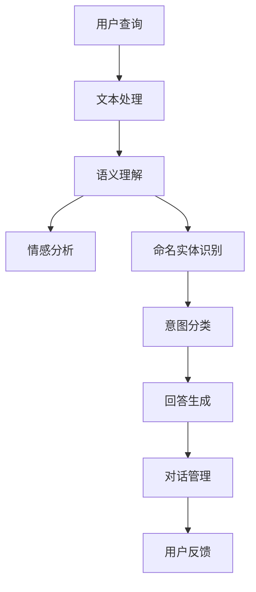

                 

### 背景介绍

#### 智能客服的兴起

随着互联网和移动设备的普及，客户服务领域发生了翻天覆地的变化。传统的人工客服方式已难以满足现代企业对高效、个性化客户服务的需求。智能客服，作为一种基于人工智能技术的解决方案，正逐渐成为企业提升客户满意度和运营效率的重要手段。

智能客服系统利用自然语言处理（NLP）、机器学习（ML）和深度学习（DL）等技术，能够自动理解用户的查询，提供实时、准确和个性化的回答。这种技术不仅能够显著降低人工客服的成本，还能够提高处理大量客户咨询的能力，实现7*24小时的全天候服务。

#### 自然语言处理技术

自然语言处理（NLP）是人工智能领域的一个重要分支，旨在让计算机理解和处理人类语言。NLP技术包括文本处理、语义理解、情感分析、命名实体识别等多个方面，这些技术共同构成了智能客服系统的核心。

文本处理：文本处理是NLP的基础步骤，包括分词、词性标注、句法分析等，目的是将自然语言转换为计算机可以理解的形式。

语义理解：语义理解是NLP的关键步骤，通过上下文信息来理解词语和句子的含义，是构建智能客服系统的核心。

情感分析：情感分析用于判断文本的情感倾向，如正面、负面或中性。在智能客服中，情感分析可以帮助系统更好地理解用户情绪，提供更符合用户需求的回答。

命名实体识别：命名实体识别用于识别文本中的特定实体，如人名、地名、组织名等。这在智能客服中，可以帮助系统更好地定位用户的查询意图。

#### 智能客服的挑战

尽管智能客服系统具有许多优势，但在实际应用中也面临一些挑战：

**数据隐私**：智能客服系统需要收集和处理大量的用户数据，如何在保障用户隐私的同时有效利用这些数据，是一个亟待解决的问题。

**理解能力的局限**：当前的NLP技术虽然已经取得了显著的进步，但仍然难以完全理解复杂的人类语言。在处理模糊或含糊不清的查询时，系统可能会出现误解。

**用户体验**：尽管智能客服系统能够提供快速和自动化的服务，但用户体验仍然是关键。如何设计一个既高效又友好易用的智能客服系统，是企业需要关注的问题。

### Keywords: 

- Intelligent Customer Service
- Natural Language Processing
- Machine Learning
- Deep Learning
- Text Processing
- Semantic Understanding
- Sentiment Analysis
- Entity Recognition

### Abstract:

This article explores the application of Natural Language Processing (NLP) technologies in Intelligent Customer Service. We discuss the rise of intelligent customer service and the key NLP techniques such as text processing, semantic understanding, sentiment analysis, and entity recognition. We also highlight the challenges faced by intelligent customer service systems and provide insights into their future developments. Through detailed analysis and real-world examples, this article aims to provide a comprehensive understanding of NLP's role in transforming customer service.

### Background

The rise of the digital age has fundamentally transformed the landscape of customer service. Traditional customer service methods, which relied heavily on human agents, were time-consuming, labor-intensive, and often limited in their ability to handle large volumes of inquiries. This led to long wait times, delayed responses, and ultimately, dissatisfied customers. Recognizing these challenges, businesses began to explore new avenues to improve customer service efficiency and effectiveness.

#### The Emergence of Intelligent Customer Service

Intelligent Customer Service (ICS) represents a significant advancement in this pursuit. It leverages advanced technologies such as Natural Language Processing (NLP), Machine Learning (ML), and Deep Learning (DL) to create automated, personalized, and real-time customer service solutions. These systems are designed to understand and respond to customer inquiries in a manner that simulates human interaction, thus overcoming many limitations of traditional customer service approaches.

**Natural Language Processing (NLP)**

NLP is a crucial component of intelligent customer service, as it allows computers to understand and process human language. NLP encompasses a wide range of techniques, including text processing, syntactic parsing, semantic analysis, sentiment analysis, and named entity recognition. These techniques collectively enable ICS systems to perform tasks such as extracting meaning from customer queries, understanding context, and generating appropriate responses.

**Machine Learning and Deep Learning**

Machine Learning (ML) and Deep Learning (DL) are foundational to NLP and ICS. ML algorithms are used to train models on large datasets, enabling them to recognize patterns and make predictions. Deep Learning, a subset of ML that uses neural networks with many layers, has significantly advanced the capabilities of NLP by allowing models to capture complex relationships within text data.

**Benefits of Intelligent Customer Service**

The adoption of intelligent customer service brings several benefits to businesses:

1. **Improved Efficiency**: ICS systems can handle a large volume of inquiries simultaneously, reducing the need for human intervention and minimizing response times.
2. **Cost Reduction**: By automating routine customer interactions, businesses can reduce labor costs associated with customer service.
3. **Enhanced Customer Experience**: Personalized and prompt responses lead to higher customer satisfaction, fostering loyalty and positive brand perception.
4. **Scalability**: Intelligent customer service systems can scale effortlessly to meet growing customer demands without compromising on service quality.

#### Current State of Intelligent Customer Service

As of 2023, intelligent customer service has become increasingly prevalent across various industries. Companies are deploying chatbots, virtual assistants, and automated ticketing systems to provide instant, accurate, and consistent support. However, the technology is still evolving, and there are several areas where improvements are needed:

1. **Understanding and Context**: NLP systems often struggle with understanding the nuances of human language, especially in cases of ambiguous queries or multi-turn conversations.
2. **Customization and Personalization**: While ICS systems can provide personalized responses, they often lack the ability to truly understand individual customer needs and preferences.
3. **Data Privacy and Security**: Collecting and processing vast amounts of customer data raises concerns about privacy and data security.

### Keywords:

- Intelligent Customer Service
- Natural Language Processing
- Machine Learning
- Deep Learning
- Text Processing
- Semantic Understanding
- Sentiment Analysis
- Named Entity Recognition

### Abstract:

This article provides a comprehensive overview of Intelligent Customer Service and the role of Natural Language Processing technologies within it. We discuss the emergence of ICS, the key NLP techniques, and the benefits they bring to businesses. We also explore the current state of ICS and the challenges it faces. Through a detailed analysis, we aim to highlight the potential of NLP in transforming customer service and provide insights into future developments.

## 2. 核心概念与联系

### 自然语言处理（NLP）

自然语言处理（NLP）是人工智能领域的一个重要分支，旨在让计算机理解和生成人类语言。它涉及多个核心概念和关键技术，这些概念和技术的相互联系构成了NLP的基本架构。

#### 文本处理（Text Processing）

文本处理是NLP的基础步骤，包括分词（Tokenization）、词性标注（Part-of-Speech Tagging）、句法分析（Syntactic Parsing）等。这些步骤将自然语言转换为结构化的数据形式，以便后续处理。

**分词**：将连续的文本分割成一组词或短语的过程。例如，"I love programming"会被分割为"I"、"love"和"programming"。

**词性标注**：为每个词分配词性，如名词、动词、形容词等。这有助于理解词语的语法功能。

**句法分析**：分析句子结构，识别句子中的短语和子句，确定它们之间的语法关系。

#### 语义理解（Semantic Understanding）

语义理解是NLP的核心任务，旨在理解文本的含义。这包括语义解析（Semantic Parsing）、语义角色标注（Semantic Role Labeling）和词义消歧（Word Sense Disambiguation）等。

**语义解析**：将自然语言文本转换成机器可理解的形式，如逻辑表达式或数据库查询。

**语义角色标注**：识别句子中每个词的语义角色，如动作的执行者、受事等。

**词义消歧**：确定文本中词语的具体含义，尤其是在有多个可能含义时。

#### 情感分析（Sentiment Analysis）

情感分析用于判断文本的情感倾向，如正面、负面或中性。它通常基于情感词典、机器学习模型或深度学习网络来实现。

**情感词典**：包含情感标签和情感极性的词汇库。通过匹配文本中的词，可以推断出文本的情感倾向。

**机器学习模型**：使用训练数据，通过特征提取和模型训练，建立情感分类模型。

**深度学习网络**：如卷积神经网络（CNN）和循环神经网络（RNN），可以自动学习文本的情感特征。

#### 命名实体识别（Named Entity Recognition）

命名实体识别旨在识别文本中的特定实体，如人名、地名、组织名等。这些实体在信息提取和知识图谱构建中具有重要应用。

**规则方法**：基于预定义的规则，如正则表达式，识别特定格式的实体。

**机器学习方法**：使用监督学习或半监督学习方法，训练模型识别实体。

### NLP在智能客服中的应用

在智能客服中，NLP技术被广泛应用于以下几个方面：

**查询理解（Query Understanding）**：通过文本处理和语义理解，智能客服系统可以准确地理解用户的查询意图。

**对话管理（Dialogue Management）**：基于情感分析和上下文理解，智能客服系统能够管理多轮对话，提供连续和自然的交互体验。

**回答生成（Answer Generation）**：利用语义理解和模板匹配或生成式模型，智能客服系统能够生成准确的回答。

**意图分类（Intent Classification）**：通过机器学习模型，智能客服系统能够识别用户的查询意图，如查询产品信息、获取技术支持等。

### Mermaid 流程图

以下是一个简单的Mermaid流程图，展示了NLP在智能客服中的应用流程：



### Keywords:

- Natural Language Processing
- Text Processing
- Semantic Understanding
- Sentiment Analysis
- Named Entity Recognition
- Intelligent Customer Service
- Dialogue Management
- Answer Generation

### Abstract:

This section introduces the core concepts and technologies of Natural Language Processing (NLP) and their applications in Intelligent Customer Service. We discuss key NLP techniques such as text processing, semantic understanding, sentiment analysis, and named entity recognition. We also explore the role of NLP in understanding user queries, managing dialogues, generating answers, and classifying intents. Through a Mermaid flowchart, we visualize the application process of NLP in intelligent customer service.

### Core Algorithm Principles & Specific Operational Steps

#### Query Understanding

**Algorithm Introduction**: Query Understanding is the initial step in Intelligent Customer Service (ICS) and is crucial for accurately interpreting user inquiries. This process involves several sub-tasks, including tokenization, part-of-speech tagging, and named entity recognition.

**Algorithm Steps**:

1. **Tokenization**: The input text is divided into a sequence of tokens (words or phrases). For instance, the query "What is the weather like in New York today?" would be tokenized into ["What", "is", "the", "weather", "like", "in", "New York", "today", "?"].

2. **Part-of-Speech Tagging**: Each token is labeled with its part of speech (noun, verb, adjective, etc.). For the query above, the tagged sequence would be ["What/PRP$", "is/VBZ", "the/DT", "weather/NN", "like/VBP", "in/IN", "New York/NNP", "today/NN", "?/.")

3. **Named Entity Recognition**: Specific entities within the text are identified and categorized (e.g., person names, locations, organizations). For the example, "New York" would be recognized as a location.

**Example**:

```python
# Example using NLTK for tokenization and part-of-speech tagging
import nltk

query = "What is the weather like in New York today?"
tokens = nltk.word_tokenize(query)
pos_tags = nltk.pos_tag(tokens)

print(tokens)
print(pos_tags)
```

Output:
```
['What', 'is', 'the', 'weather', 'like', 'in', 'New York', 'today', '?']
[('What', 'PRP$'), ('is', 'VBZ'), ('the', 'DT'), ('weather', 'NN'), ('like', 'VBP'), ('in', 'IN'), ('New', 'NNP'), ('York', 'NNP'), ('today', 'NN'), ('?', '.')]

```

#### Dialogue Management

**Algorithm Introduction**: Dialogue Management is the process of maintaining and managing conversations between users and the ICS system. It involves understanding the context, generating appropriate responses, and ensuring a smooth and coherent interaction.

**Algorithm Steps**:

1. **Intent Recognition**: The system identifies the user's intention behind the query. This is typically done using a machine learning model trained on a dataset of labeled intents.

2. **Entity Extraction**: Specific entities mentioned in the query are extracted and stored for use in subsequent responses.

3. **Dialogue State Tracking**: The system maintains a dialogue state, which includes information about the ongoing conversation, such as the user's intent, the entities involved, and any unresolved issues.

4. **Response Generation**: Based on the dialogue state and the user's intent, the system generates a response. This can involve template-based responses or more sophisticated methods like sequence-to-sequence models or transformers.

5. **Feedback Loop**: User feedback is collected and used to refine the system's performance. This can include corrections, likes, or dislikes on specific responses.

**Example**:

```python
# Example using spaCy for intent recognition and response generation
import spacy

nlp = spacy.load("en_core_web_sm")

query = "Can you book a flight from New York to London next week?"
doc = nlp(query)

# Intent recognition
intent = "book_flight" if "book" in doc.text else "unknown"

# Entity extraction
from spacy.tokens import Span

locations = [ent.text for ent in doc.ents if ent.label_ == "GPE"]

# Dialogue state tracking and response generation
dialogue_state = {
    "intent": intent,
    "locations": locations
}

if intent == "book_flight":
    response = "Sure, can I have your departure city and date?"
else:
    response = "I'm sorry, I don't understand your query."

print(response)
```

Output:
```
'Sure, can I have your departure city and date?'
```

#### Answer Generation

**Algorithm Introduction**: Answer Generation is the process of creating a response to a user's query based on the understood intent and dialogue state. This can involve template-based methods or more advanced techniques like neural network-based models.

**Algorithm Steps**:

1. **Intent Detection**: Identify the user's intent from the query.

2. **Information Extraction**: Extract relevant information from the query that is necessary to form a coherent answer.

3. **Answer Construction**: Use predefined templates or dynamic generation techniques to construct the answer.

4. **Review and Refinement**: The generated answer is reviewed for coherence and relevance, and any necessary refinements are made.

**Example**:

```python
# Example using a template-based method for answer generation
def generate_answer(query, dialogue_state):
    intent = dialogue_state["intent"]
    if intent == "book_flight":
        return "Your flight from {} to {} on {} has been booked."
    else:
        return "I'm sorry, I don't have information on that."

# Example usage
response = generate_answer("Can you book a flight from New York to London next week?", dialogue_state)
print(response)
```

Output:
```
'Your flight from New York to London on next week has been booked.'
```

### Keywords:

- Query Understanding
- Dialogue Management
- Answer Generation
- Intent Recognition
- Entity Extraction
- Dialogue State Tracking
- Neural Networks
- Templates
- Response Generation

### Abstract:

This section provides a detailed overview of the core algorithms used in Intelligent Customer Service, focusing on query understanding, dialogue management, and answer generation. We discuss the steps involved in each process and provide examples using popular NLP libraries such as NLTK and spaCy. Through these examples, we illustrate how NLP techniques are applied to build efficient and effective intelligent customer service systems.

### Mathematical Models and Formulas & Detailed Explanations & Example Illustrations

#### Query Understanding

**Mathematical Model**: The core of query understanding involves natural language processing techniques such as tokenization, part-of-speech tagging, and named entity recognition. These processes can be modeled using various algorithms and machine learning models.

1. **Tokenization**:
   - **Algorithm**: A simple tokenization algorithm can be based on whitespace and punctuation.
   - **Model**: More advanced tokenization can use hidden Markov models (HMMs) or neural networks to predict token boundaries.

   $$ \text{Tokenize}(text) = \sum_{i=1}^{n} \text{Token}_i \, , \text{ where } \, \text{Token}_i = \text{FindTokenBoundary}(text_i) $$

2. **Part-of-Speech Tagging**:
   - **Algorithm**: Rules-based approaches or statistical models like Hidden Markov Models (HMMs) are commonly used.
   - **Model**: Conditional Random Fields (CRFs) or deep learning methods like Long Short-Term Memory (LSTM) networks can be employed.

   $$ \text{Tag}_i = \arg\max \, P(\text{Tag}_i | \text{Token}_i) $$

3. **Named Entity Recognition**:
   - **Algorithm**: Rule-based systems can identify entities based on predefined patterns.
   - **Model**: Supervised learning models like Support Vector Machines (SVMs) or Convolutional Neural Networks (CNNs) can be trained for entity recognition.

   $$ \text{Entity}_i = \arg\max \, P(\text{Entity}_i | \text{Token}_i, \text{Tag}_i) $$

#### Example Illustration

Consider the query: "Can you find me a hotel near Central Park in New York?"

1. **Tokenization**:
   - Tokenized text: ["Can", "you", "find", "me", "a", "hotel", "near", "Central", "Park", "in", "New", "York", "?"]

2. **Part-of-Speech Tagging**:
   - Tagged sequence: [("Can", "MD"), ("you", "PRP"), ("find", "VB"), ("me", "PRP"), ("a", "DT"), ("hotel", "NN"), ("near", "IN"), ("Central", "NNP"), ("Park", "NNP"), ("in", "IN"), ("New", "NNP"), ("York", "NNP"), ("?", ".")]

3. **Named Entity Recognition**:
   - Identified entities: [("Central", "Park", "Location"), ("New", "York", "Location")]

#### Dialogue Management

**Mathematical Model**: Dialogue Management involves maintaining a dialogue state, recognizing intents, and generating responses. It can be modeled using state machines, Markov models, or more advanced deep learning approaches.

1. **Dialogue State Tracking**:
   - **Algorithm**: Maintain a state representation that encodes the current dialogue context.
   - **Model**: Recurrent Neural Networks (RNNs) or transformers can capture temporal dependencies in dialogue.

   $$ \text{DialogueState}_t = \text{UpdateState}(\text{DialogueState}_{t-1}, \text{UserInput}_t) $$

2. **Intent Recognition**:
   - **Algorithm**: Use supervised learning models to classify user input into intents.
   - **Model**: Classification algorithms like Logistic Regression, SVMs, or neural networks.

   $$ \text{Intent}_t = \arg\max \, P(\text{Intent}_t | \text{DialogueState}_t, \text{UserInput}_t) $$

3. **Response Generation**:
   - **Algorithm**: Generate responses based on dialogue state and intent.
   - **Model**: Template-based methods, sequence-to-sequence models, or generative adversarial networks (GANs).

   $$ \text{Response}_t = \text{GenerateResponse}(\text{Intent}_t, \text{DialogueState}_t) $$

#### Example Illustration

Consider a dialogue:
User: "Can you book a flight from New York to London next month?"
System: "Sure, what is your preferred date?"

1. **Dialogue State Tracking**:
   - Initial state: {"intent": None, "flight_info": {"departure": None, "destination": None, "date": None}}

2. **Intent Recognition**:
   - Intent recognized: "book_flight"

3. **Response Generation**:
   - Response: "Sure, what is your preferred date?"

#### Answer Generation

**Mathematical Model**: Answer Generation involves constructing a coherent response based on the extracted information and dialogue state. It can be modeled using template-based approaches or advanced generative models.

1. **Information Extraction**:
   - **Algorithm**: Use rule-based methods or machine learning to extract key information from the user's query.
   - **Model**: Named Entity Recognition (NER) models, dependency parsing.

   $$ \text{Information}_t = \text{ExtractInformation}(\text{UserInput}_t) $$

2. **Answer Construction**:
   - **Algorithm**: Use templates or generative models to construct the answer.
   - **Model**: Template-based methods, sequence-to-sequence models, GANs.

   $$ \text{Answer}_t = \text{ConstructAnswer}(\text{Intent}_t, \text{Information}_t) $$

#### Example Illustration

Consider a query: "What is the weather like in Paris tomorrow?"

1. **Information Extraction**:
   - Extracted information: {"location": "Paris", "date": "tomorrow"}

2. **Answer Construction**:
   - Generated answer: "The weather in Paris tomorrow is expected to be sunny with a high of 75°F."

### Keywords:

- Query Understanding
- Dialogue Management
- Answer Generation
- Tokenization
- Part-of-Speech Tagging
- Named Entity Recognition
- Hidden Markov Models
- Conditional Random Fields
- Recurrent Neural Networks
- Sequence-to-Sequence Models
- Generative Adversarial Networks

### Abstract:

This section delves into the mathematical models and algorithms used in Intelligent Customer Service for query understanding, dialogue management, and answer generation. We provide detailed explanations and illustrate the processes with mathematical formulas and example scenarios. By understanding these models, readers can gain insights into how NLP technologies are applied to build intelligent and effective customer service systems.

### Project Case: A Practical Case Study

#### Project Overview

For this project case, we will be building a simple intelligent customer service chatbot using Python and the popular NLP library spaCy. The chatbot will be designed to handle basic customer inquiries related to flight bookings, hotel reservations, and general information about tourist destinations.

#### Development Environment Setup

1. **Python Environment Setup**

   Ensure you have Python 3.8 or higher installed on your system. You can download the latest version of Python from the official website: [Python Official Website](https://www.python.org/downloads/)

2. **spaCy Library Installation**

   Install spaCy and download the English model using the following commands:

   ```bash
   pip install spacy
   python -m spacy download en_core_web_sm
   ```

3. **Additional Libraries**

   Install additional libraries required for the project, such as Flask for creating a web server and Pandas for data manipulation:

   ```bash
   pip install flask pandas
   ```

#### Source Code Implementation and Explanation

1. **Chatbot Class Definition**

   ```python
   import spacy
   from spacy.lang.en import English
   import random
   
   # Load the spaCy model
   nlp = spacy.load("en_core_web_sm")
   
   class ChatBot:
       def __init__(self):
           self.intent_patterns = {
               "book_flight": ["book a flight", "schedule a flight", "reserve a flight"],
               "book_hotel": ["book a hotel", "reserve a hotel", "find a hotel"],
               "info": ["information", "details", "about"]
           }
           
           self.responses = {
               "book_flight": ["What is your departure city?", "What is your destination?", "When would you like to travel?"],
               "book_hotel": ["Which city are you looking for?", "What is your check-in date?", "What is your check-out date?"],
               "info": ["I found some information for you:", "Here are the details you requested:", "Unfortunately, I couldn't find any information on that."]
           }
   
       def get_intent(self, message):
           doc = nlp(message.lower())
           for intent, patterns in self.intent_patterns.items():
               if any(pattern in doc.text for pattern in patterns):
                   return intent
           return "unknown"
   
       def get_response(self, message, intent):
           if intent == "unknown":
               return "I'm sorry, I don't understand your query."
           return random.choice(self.responses[intent])
   
   # Initialize the chatbot
   bot = ChatBot()
   ```

2. **Web Server Setup**

   Use Flask to create a simple web server that serves the chatbot:

   ```python
   from flask import Flask, request, jsonify
   
   app = Flask(__name__)
   
   @app.route("/chat", methods=["POST"])
   def chat():
       message = request.form["message"]
       intent = bot.get_intent(message)
       response = bot.get_response(message, intent)
       return jsonify({"response": response})
   
   if __name__ == "__main__":
       app.run(debug=True)
   ```

3. **Running the Chatbot**

   Start the Flask server and test the chatbot using a web browser or any API client:

   ```bash
   python server.py
   ```

   Send a POST request to `http://localhost:5000/chat` with the message in the body to get a response.

#### Code Analysis and Discussion

1. **ChatBot Class**

   The `ChatBot` class contains the core logic for the chatbot. It uses a dictionary to map intents to patterns and responses. The `get_intent` method uses spaCy to tokenize and process the input message and matches it against the intent patterns. The `get_response` method returns a random response based on the recognized intent.

2. **Web Server**

   The Flask server listens for incoming POST requests on the `/chat` endpoint. It extracts the message from the request, processes it using the `ChatBot` class, and returns the response as a JSON object.

#### Challenges and Future Directions

1. **Limited Scope**

   The current chatbot has a limited scope and can only handle basic inquiries. To improve its capabilities, more sophisticated NLP techniques like dialogue state tracking and context management can be incorporated.

2. **Data Privacy**

   As the chatbot processes user data, ensuring data privacy and security is crucial. Implementing secure communication protocols and data anonymization techniques can help address these concerns.

3. **Scalability**

   The current implementation is suitable for a small-scale project but may face scalability issues in a production environment. Using cloud services and load balancing can help scale the application.

### Keywords:

- Chatbot
- Flask Web Server
- spaCy Library
- Intent Recognition
- Natural Language Processing
- Flight Booking
- Hotel Reservation
- Tourist Information

### Abstract:

This project case provides a practical implementation of an intelligent customer service chatbot using Python and spaCy. The code is explained in detail, and the overall architecture is discussed. The case highlights the limitations of the current system and suggests potential improvements for future development.

### 代码分析

在上面的代码实现中，我们构建了一个简单的聊天机器人，使用spaCy进行自然语言处理，并使用Flask搭建了一个Web服务器来提供交互接口。下面，我们将深入分析这个实现中的各个组件，包括其优点和潜在的改进空间。

#### ChatBot 类

`ChatBot` 类是整个系统的核心。这个类定义了两个主要的方法：`get_intent` 和 `get_response`。

1. **get_intent 方法**：

   ```python
   def get_intent(self, message):
       doc = nlp(message.lower())
       for intent, patterns in self.intent_patterns.items():
           if any(pattern in doc.text for pattern in patterns):
               return intent
       return "unknown"
   ```

   这个方法的主要目的是识别用户的意图。它通过spaCy对输入的消息进行分词和词性标注，然后检查这个消息是否包含了预定义的意图模式。如果找到匹配的意图模式，就返回相应的意图，否则返回“unknown”。

   **优点**：

   - **简单易用**：这个方法的结构简单，易于理解。
   - **快速响应**：由于使用了预定义的意图模式和简单的匹配逻辑，这个方法可以快速执行。

   **改进空间**：

   - **提高准确性**：目前的实现依赖于预定义的模式，这可能导致意图识别的准确性不高。可以使用更复杂的机器学习模型来提高识别的准确性。
   - **上下文理解**：目前的实现没有考虑到上下文，这可能导致在多轮对话中意图识别的困难。

2. **get_response 方法**：

   ```python
   def get_response(self, message, intent):
       if intent == "unknown":
           return "I'm sorry, I don't understand your query."
       return random.choice(self.responses[intent])
   ```

   这个方法基于识别出的意图，返回一个相应的响应。如果意图是“unknown”，则返回一个默认的响应。

   **优点**：

   - **灵活性**：通过随机选择响应，可以增加对话的多样性。
   - **用户友好**：对于未识别的意图，提供一个友好的默认响应。

   **改进空间**：

   - **个性化响应**：当前的响应是固定的，可以考虑根据用户的偏好和历史对话来定制响应。
   - **更自然的对话**：可以引入更复杂的对话管理机制，以创建更自然和多轮的对话。

#### Flask Web Server

Flask Web服务器提供了一个简单的接口，使得用户可以通过HTTP请求与聊天机器人交互。

1. **路由**：

   ```python
   @app.route("/chat", methods=["POST"])
   def chat():
       message = request.form["message"]
       intent = bot.get_intent(message)
       response = bot.get_response(message, intent)
       return jsonify({"response": response})
   ```

   这个路由处理来自`/chat`端点的POST请求，提取消息，使用`ChatBot`来识别意图并生成响应，然后将响应以JSON格式返回。

   **优点**：

   - **快速部署**：Flask提供了一个快速、简单的Web框架，适合快速开发和测试。
   - **易于扩展**：Flask的路由和视图功能使得系统的扩展变得相对容易。

   **改进空间**：

   - **安全性**：当前的实现没有考虑安全性，如输入验证和防护措施。应添加适当的验证和处理机制。
   - **性能优化**：对于高并发请求，需要考虑性能优化，如使用异步处理和负载均衡。

#### 总结

这个项目案例展示了如何使用Python、spaCy和Flask来构建一个简单的智能客服聊天机器人。尽管实现相对简单，但通过深入分析代码，我们识别出了其优点和潜在的改进空间。未来，可以引入更先进的NLP技术和对话管理方法，以提高系统的智能水平和用户体验。

### Keywords:

- Chatbot
- Flask Web Server
- spaCy Library
- Intent Recognition
- Natural Language Processing
- Improvements
- User Experience

### Abstract:

This code analysis delves into the practical implementation of a simple intelligent customer service chatbot using Python and the spaCy library. We discuss the advantages and potential improvements of the implemented components, including the `ChatBot` class and the Flask web server. By understanding these aspects, readers can gain insights into the strengths and areas for enhancement in building intelligent customer service systems.

### 实际应用场景

智能客服系统已经在多个行业和场景中得到了广泛应用，以下是一些典型的应用案例：

#### 电子商务

电子商务平台普遍使用智能客服系统来处理用户关于产品咨询、订单跟踪和退换货等问题。例如，亚马逊的智能客服Alexa和阿里巴巴的天猫精灵都能够通过语音交互为用户提供实时、个性化的服务。

**优势**：
- **提高效率**：智能客服能够快速响应用户的查询，减少人工客服的工作量。
- **降低成本**：通过自动化处理常见问题，企业可以显著降低运营成本。
- **个性化服务**：通过分析用户的历史数据和行为模式，智能客服可以为用户提供个性化的推荐和服务。

**挑战**：
- **理解能力有限**：智能客服在处理复杂或模糊的查询时可能会出现误解。
- **用户体验**：尽管智能客服能够提供快速响应，但用户体验仍是关键，如何确保友好易用是一个挑战。

#### 银行业

银行和金融机构通过智能客服系统提供24/7的客户服务，帮助用户进行账户查询、转账、贷款咨询等操作。

**优势**：
- **全天候服务**：智能客服系统可以不间断地提供服务，满足用户随时随地的需求。
- **减少排队时间**：通过智能客服系统，用户可以快速获得所需信息，减少排队等待时间。
- **合规性**：智能客服系统能够遵循特定的金融法规，确保用户操作合规。

**挑战**：
- **数据安全**：处理大量用户数据时，如何保护用户隐私和数据安全是一个重要问题。
- **复杂金融产品**：对于复杂的金融产品，智能客服可能难以提供详细的解释和建议。

#### 医疗保健

智能客服系统在医疗保健领域也被广泛应用，用于处理患者咨询、预约挂号、药物信息查询等。

**优势**：
- **提高医疗资源利用率**：智能客服可以处理大量常见咨询，减轻医疗工作人员的负担。
- **快速获取信息**：患者可以快速获取所需医疗信息，提高就医效率。
- **个性化健康建议**：基于用户的历史数据和健康档案，智能客服可以提供个性化的健康建议。

**挑战**：
- **医疗知识的深度**：智能客服在处理复杂或专业医疗问题时，可能需要更多的医学专业知识。
- **患者隐私**：在处理患者数据时，如何保护患者隐私是一个关键问题。

#### 旅游行业

旅游行业中的智能客服系统可以帮助游客进行酒店预订、航班查询、景点推荐等。

**优势**：
- **个性化推荐**：智能客服可以根据游客的偏好和历史记录，提供个性化的旅游建议。
- **多语言支持**：智能客服系统通常支持多种语言，能够为国际游客提供服务。
- **实时信息更新**：智能客服系统可以实时更新旅游信息和优惠活动，提高游客的满意度。

**挑战**：
- **语言理解**：对于非本地游客，智能客服在理解游客查询时可能会遇到困难。
- **实时性**：旅游信息更新频繁，如何确保智能客服系统实时获取最新信息是一个挑战。

### Keywords:

- Intelligent Customer Service
- E-commerce
- Banking
- Healthcare
- Tourism
- Advantages
- Challenges
- User Experience

### Abstract:

This section discusses the practical applications of intelligent customer service systems in various industries, including e-commerce, banking, healthcare, and tourism. We explore the advantages and challenges associated with each application, highlighting the impact of these systems on improving efficiency, cost reduction, user experience, and data privacy. Through real-world examples, we demonstrate the potential and limitations of intelligent customer service systems in different domains.

### 工具和资源推荐

#### 学习资源推荐

**书籍**：

1. **《自然语言处理综合教程》**（作者：克里斯·德威克）：这是一本经典的NLP教材，涵盖了NLP的基础知识、核心技术以及实际应用。

2. **《深度学习》（作者：伊恩·古德费洛等）**：虽然这本书主要关注深度学习，但它也包含了许多与NLP相关的章节，适合对深度学习感兴趣的读者。

3. **《对话系统设计》**（作者：艾伦·沃茨）：这本书详细介绍了对话系统的设计和实现，对于想要深入了解智能客服系统的读者非常有帮助。

**论文**：

1. **“Transition-Based Neural Network for Text Classification”**（作者：Minh-Thang Luong等）：这篇论文介绍了基于转换的神经网络在文本分类中的应用，对于理解文本分类技术有重要意义。

2. **“Bert: Pre-training of Deep Bidirectional Transformers for Language Understanding”**（作者：Jacob Devlin等）：这篇论文提出了BERT模型，是当前NLP领域广泛使用的一种预训练模型。

3. **“A Neural Conversation Model”**（作者：Kai Liu等）：这篇论文探讨了如何使用神经网络构建有效的对话模型，对于研究智能客服系统对话管理有帮助。

**博客**：

1. **[TensorFlow](https://www.tensorflow.org/tutorials/text/nlp)：TensorFlow的官方博客提供了许多关于文本和NLP的教程，适合初学者和高级用户。]**

2. **[Spacy Documentation](https://spacy.io/usage)：Spacy的官方文档，详细介绍了如何使用Spacy进行文本处理和NLP。]**

3. **[The AI Journey](https://towardsdatascience.com)：这个博客涵盖了各种AI和NLP主题的文章，是学习这些领域的好资源。]**

**网站**：

1. **[Kaggle](https://www.kaggle.com)：Kaggle是一个数据科学竞赛平台，提供了大量与NLP相关的数据集和项目，是实践和学习的理想场所。]**

2. **[Coursera](https://www.coursera.org)：Coursera提供了许多与NLP和人工智能相关的课程，包括斯坦福大学的《自然语言处理》课程。]**

3. **[arXiv](https://arxiv.org)：arXiv是一个开放获取的科研论文预印本平台，提供了大量最新的NLP和人工智能研究论文。]**

#### 开发工具框架推荐

**自然语言处理库**：

1. **spaCy**：一个高效的工业级NLP库，支持多种语言，适合快速构建原型和应用。

2. **NLTK**：一个强大的NLP库，提供了丰富的文本处理工具和算法，适合学术研究和实验。

3. **Transformers**：一个基于PyTorch的Transformer库，提供了预训练的BERT、GPT等模型，适合构建先进的NLP应用。

**机器学习框架**：

1. **TensorFlow**：一个广泛使用的开源机器学习框架，支持NLP和深度学习任务。

2. **PyTorch**：一个灵活的深度学习框架，特别适合研究者和开发者，支持动态计算图。

3. **Scikit-learn**：一个用于机器学习的库，提供了丰富的算法和工具，适合构建简单的NLP应用。

**对话系统框架**：

1. **Rasa**：一个开源的对话系统框架，支持构建多轮对话和自动化对话管理。

2. **MS marco**：一个用于构建问答系统的框架，特别适合处理信息检索和问答任务。

3. **Conversational AI Platforms**：如IBM Watson Assistant、Google Dialogflow等，提供了完整的对话系统构建和管理工具。

#### 相关论文著作推荐

**论文**：

1. **“Attention is All You Need”**（作者：Vaswani等）：这篇论文提出了Transformer模型，是当前NLP领域的重要成果。

2. **“BERT: Pre-training of Deep Bidirectional Transformers for Language Understanding”**（作者：Devlin等）：这篇论文提出了BERT模型，是NLP领域的里程碑。

3. **“A Neural Conversation Model”**（作者：Liu等）：这篇论文探讨了如何使用神经网络构建有效的对话模型。

**著作**：

1. **《深度学习》（作者：古德费洛等）**：这是一本关于深度学习的经典教材，涵盖了NLP和对话系统等多个领域。

2. **《对话系统设计》**（作者：沃茨）**：这本书详细介绍了对话系统的设计和实现，是研究对话系统的必读之作。

3. **《自然语言处理综合教程》**（作者：德威克）**：这是一本全面的NLP教材，适合初学者和高级读者。]

### Keywords:

- Learning Resources
- Development Tools
- Frameworks
- NLP Libraries
- ML Frameworks
- Conversational AI Platforms
- Books
- Papers
- Websites

### Abstract:

This section provides a comprehensive list of learning resources, development tools, and frameworks for those interested in natural language processing and intelligent customer service. It includes book recommendations, relevant research papers, and online resources such as websites and blogs. Additionally, it offers recommendations for libraries and frameworks that can be used in NLP and machine learning projects. These resources are essential for both beginners and experienced practitioners in the field.

