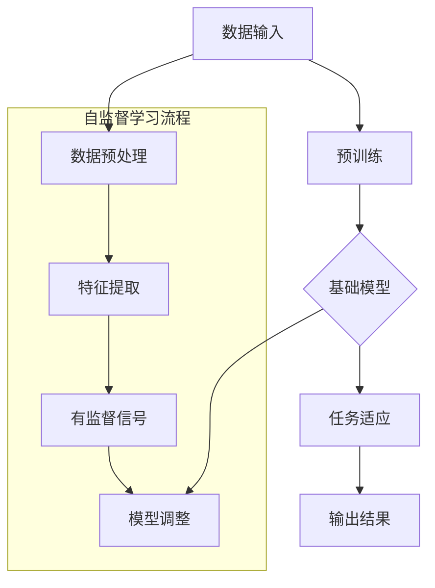

                 

### 背景介绍

自监督学习（Self-supervised Learning）作为深度学习的一个重要分支，近年来在人工智能领域取得了显著的研究进展。它的核心思想是利用未标注的数据进行学习，通过自动构建数据中的有监督关系来提升模型的性能。在自然语言处理、计算机视觉、语音识别等领域，自监督学习已经展现了其强大的潜力。

基础模型（Foundation Model）则是指那些具备广泛语言理解和生成能力的深度神经网络模型，如GPT、BERT、T5等。这些模型通过对大规模文本数据进行预训练，能够自动学习到丰富的语言知识和模式，从而在各类自然语言处理任务中表现出色。

本文将探讨自监督学习在基础模型中的应用，具体包括以下内容：

1. **核心概念与联系**：介绍自监督学习的核心概念及其与基础模型的关系，并使用Mermaid流程图展示其架构。
2. **核心算法原理 & 具体操作步骤**：深入解析自监督学习的算法原理，以及如何在基础模型中进行具体实现。
3. **数学模型和公式 & 详细讲解 & 举例说明**：详细阐述自监督学习中的关键数学模型，并举例说明。
4. **项目实战：代码实际案例和详细解释说明**：通过一个实际的项目案例，展示自监督学习在基础模型中的实际应用。
5. **实际应用场景**：分析自监督学习在自然语言处理、计算机视觉等领域的应用案例。
6. **工具和资源推荐**：推荐学习资源和开发工具，帮助读者深入了解和掌握自监督学习技术。
7. **总结：未来发展趋势与挑战**：总结自监督学习在基础模型中的应用现状，展望未来发展趋势和面临的挑战。

通过本文的阅读，读者将能够全面了解自监督学习在基础模型中的应用，掌握其核心原理和具体实现方法，为未来的研究和实践提供有益的参考。

### 核心概念与联系

为了深入理解自监督学习在基础模型中的应用，首先需要明确自监督学习的核心概念及其与基础模型的关联。

**自监督学习的定义**：自监督学习是一种无需人工标注数据标签，通过利用数据内部结构进行学习的方法。在自监督学习中，模型自动发现数据中的有监督信号，例如通过预测图像中的对象、语音中的单词或文本中的词序列等。

**基础模型的定义**：基础模型是一种大型预训练模型，通常用于处理自然语言、图像、语音等多种类型的数据。这些模型通过在大规模数据集上进行预训练，能够学习到丰富的知识和规律，从而在特定任务上表现优异。

**自监督学习与基础模型的关联**：

1. **数据利用**：自监督学习可以利用大量的未标注数据，这些数据通过基础模型进行预训练，从而提升了模型的整体性能。
2. **任务泛化**：自监督学习能够帮助模型在不同任务上泛化，提高模型的适应性和鲁棒性。
3. **效率提升**：自监督学习减少了标注数据的需求，降低了数据处理的成本和时间，提高了模型训练的效率。

为了更好地展示自监督学习在基础模型中的应用，下面使用Mermaid流程图来描述其核心架构。



**流程说明**：

1. **数据输入**：将原始数据（如文本、图像、语音等）输入系统。
2. **数据预处理**：对原始数据进行预处理，例如图像的尺寸调整、文本的分词等。
3. **特征提取**：从预处理后的数据中提取有用的特征信息。
4. **有监督信号**：利用提取的特征，构建有监督信号，例如预测文本中的下一个词或图像中的对象。
5. **模型调整**：根据有监督信号调整基础模型的参数，优化模型性能。
6. **预训练**：通过大量的未标注数据，对基础模型进行预训练，使其具备更广泛的知识和技能。
7. **任务适应**：在特定任务上对预训练的基础模型进行微调，使其适应具体的任务需求。
8. **输出结果**：最终输出任务的结果，例如文本生成、图像分类等。

通过这个流程图，我们可以看到自监督学习在基础模型中的关键作用，即通过未标注数据的利用和特征提取，不断提升模型的能力，从而在各个任务上取得优异的性能。

在下一部分中，我们将深入探讨自监督学习的核心算法原理和具体操作步骤，进一步理解其在基础模型中的应用。

### 核心算法原理 & 具体操作步骤

自监督学习的核心算法原理在于如何从大量未标注的数据中提取有价值的信息，并将其转化为模型训练的有监督信号。以下将详细介绍自监督学习的具体算法原理，以及如何将其应用于基础模型的训练过程中。

#### 自监督学习的算法原理

自监督学习的基本思想是利用数据本身的结构，自动发现并利用其中的有监督信号。这个过程通常包括以下几个关键步骤：

1. **数据预处理**：首先对原始数据进行预处理，以提取出有用的特征信息。例如，在图像识别任务中，可能需要对图像进行缩放、旋转、裁剪等操作，以增加数据的多样性。

2. **特征提取**：从预处理后的数据中提取特征。在深度学习中，这一步通常通过构建深度神经网络来实现。特征提取的质量直接影响后续的自监督学习效果。

3. **有监督信号构建**：利用提取的特征，构建有监督信号。常见的有监督信号包括预测下一个单词、识别图像中的对象、预测语音中的下一个单词等。这些信号为模型提供了训练的目标。

4. **模型训练**：根据构建的有监督信号，通过优化算法（如梯度下降）调整模型的参数，以最小化预测误差。

5. **模型微调**：在完成预训练后，通常需要在特定任务上进行模型微调，以提高其在任务上的表现。

#### 自监督学习在基础模型中的具体操作步骤

以下是在基础模型中应用自监督学习的具体操作步骤：

1. **数据收集与预处理**：收集大量未标注的数据，如文本、图像、语音等。然后对这些数据进行预处理，包括数据清洗、数据增强等，以增加数据的多样性。

2. **特征提取网络构建**：构建一个深度神经网络，用于提取数据中的特征。常见的特征提取网络包括卷积神经网络（CNN）和循环神经网络（RNN）等。例如，在图像识别任务中，可以使用CNN来提取图像的特征。

3. **有监督信号构建**：根据特征提取网络，构建有监督信号。例如，在文本生成任务中，可以构建预测下一个单词的信号；在图像识别任务中，可以构建预测图像中对象类别的信号。

4. **模型训练**：使用未标注的数据，通过有监督信号对基础模型进行预训练。在这一过程中，需要不断调整模型的参数，以最小化预测误差。

5. **模型微调**：在完成预训练后，将基础模型应用于特定的任务中，并进行微调。例如，在一个语言理解任务中，可以使用预训练的模型来识别句子中的实体。

6. **评估与优化**：通过在测试集上的评估，对模型进行性能评估。如果性能不佳，可以进一步调整模型结构或训练过程，以提高模型的表现。

#### 案例分析

为了更好地理解自监督学习在基础模型中的应用，以下通过一个实际案例进行详细分析。

**案例**：利用自监督学习预训练一个文本生成模型。

1. **数据收集与预处理**：收集大量未标注的文本数据，如新闻文章、社交媒体帖子等。然后对这些文本进行清洗，去除噪声和无关信息，并进行分词和标记化处理。

2. **特征提取网络构建**：构建一个基于RNN的文本特征提取网络，用于提取文本的特征。该网络可以采用双向RNN（Bi-RNN），以同时考虑文本的前后信息。

3. **有监督信号构建**：对于每条文本，构建预测下一个单词的信号。例如，对于文本“人工智能”，可以预测下一个单词为“技术”。

4. **模型训练**：使用未标注的文本数据，通过有监督信号对文本生成模型进行预训练。在这一过程中，模型会不断调整参数，以最小化预测误差。

5. **模型微调**：在完成预训练后，将文本生成模型应用于具体的生成任务中，如生成新闻文章或社交媒体帖子。然后通过在测试集上的评估，对模型进行性能优化。

6. **评估与优化**：在测试集上评估模型的表现，并根据评估结果对模型进行进一步的优化。例如，可以尝试调整网络结构、增加训练数据量等，以提高生成文本的质量。

通过这个案例，我们可以看到自监督学习在基础模型中的应用流程。在实际操作中，可以根据具体任务的需求，调整和优化这一流程，以获得更好的训练效果和模型性能。

在下一部分中，我们将深入讨论自监督学习中的关键数学模型和公式，为理解和实现自监督学习提供理论基础。

### 数学模型和公式 & 详细讲解 & 举例说明

在自监督学习过程中，数学模型和公式起着至关重要的作用。它们不仅描述了数据特征提取和有监督信号构建的过程，还指导了模型的优化和参数调整。本部分将详细讲解自监督学习中的关键数学模型和公式，并通过具体例子来说明其应用。

#### 模型表示

首先，我们用以下符号来表示自监督学习中的关键组成部分：

- \( X \)：输入数据集
- \( X_i \)：第 \( i \) 个数据样本
- \( f(X_i) \)：特征提取函数，将输入数据 \( X_i \) 转换为特征表示
- \( y_i \)：有监督信号，即模型预测的目标
- \( \theta \)：模型参数
- \( \hat{y_i} \)：模型预测的输出
- \( L(\theta) \)：损失函数，用于衡量模型预测 \( \hat{y_i} \) 与实际目标 \( y_i \) 之间的差异

#### 特征提取

特征提取是自监督学习的关键步骤，它决定了模型能否从数据中提取出有价值的信息。常用的特征提取函数包括卷积神经网络（CNN）和循环神经网络（RNN）。

1. **卷积神经网络（CNN）**：

   CNN在图像特征提取方面表现出色。其基本结构包括卷积层、池化层和全连接层。以下是一个简单的CNN特征提取模型：

   \[
   f(X_i) = \sigma (\mathbf{W}^L \cdot \mathbf{a}^{L-1} + b^L)
   \]

   其中，\( \sigma \) 是激活函数（如ReLU函数），\( \mathbf{W}^L \) 和 \( b^L \) 分别是全连接层的权重和偏置。

2. **循环神经网络（RNN）**：

   RNN在序列数据处理方面具有优势，特别是在文本和语音处理任务中。RNN通过重复单元来处理时间序列数据，其基本结构包括输入层、隐藏层和输出层。以下是一个简单的RNN特征提取模型：

   \[
   \mathbf{h}_t = \sigma (\mathbf{W}^H \cdot \mathbf{h}_{t-1} + \mathbf{U}^H \cdot \mathbf{x}_t + b^H)
   \]

   其中，\( \mathbf{h}_t \) 是第 \( t \) 个隐藏状态，\( \mathbf{W}^H \) 和 \( \mathbf{U}^H \) 分别是隐藏层权重和输入层权重，\( b^H \) 是隐藏层偏置。

#### 有监督信号构建

有监督信号的构建是自监督学习的核心，它决定了模型能否从特征表示中预测出正确的目标。以下介绍几种常见的方法：

1. **预测下一个单词**：

   在自然语言处理中，预测下一个单词是一种常见的方法。假设当前序列为 \( \mathbf{x}_1, \mathbf{x}_2, \ldots, \mathbf{x}_T \)，则模型的目标是预测 \( \mathbf{x}_{T+1} \)。其公式为：

   \[
   \hat{y}_{T+1} = \text{softmax}(\mathbf{W}^O \cdot \mathbf{h}_T + b^O)
   \]

   其中，\( \mathbf{W}^O \) 和 \( b^O \) 分别是输出层权重和偏置，\( \text{softmax} \) 函数用于将输出概率分布。

2. **识别图像中的对象**：

   在计算机视觉中，识别图像中的对象也是一种常见的方法。假设图像中的对象为 \( \mathbf{o}_1, \mathbf{o}_2, \ldots, \mathbf{o}_K \)，则模型的目标是预测对象 \( \mathbf{o}_{k+1} \)。其公式为：

   \[
   \hat{y}_{k+1} = \text{softmax}(\mathbf{W}^C \cdot \mathbf{f}(X_i) + b^C)
   \]

   其中，\( \mathbf{W}^C \) 和 \( b^C \) 分别是分类层权重和偏置，\( \mathbf{f}(X_i) \) 是特征提取函数的输出。

#### 模型优化

在自监督学习中，模型优化是通过损失函数来实现的。以下介绍几种常见的损失函数：

1. **交叉熵损失**：

   交叉熵损失是一种常用的损失函数，用于衡量模型预测概率分布与实际分布之间的差异。其公式为：

   \[
   L(\theta) = -\sum_{i=1}^N \sum_{k=1}^K y_{ik} \log(\hat{y}_{ik})
   \]

   其中，\( y_{ik} \) 是第 \( i \) 个样本在第 \( k \) 个类别的实际标签，\( \hat{y}_{ik} \) 是模型预测的概率分布。

2. **均方误差损失**：

   均方误差损失适用于回归任务，用于衡量模型预测值与实际值之间的差异。其公式为：

   \[
   L(\theta) = \frac{1}{2} \sum_{i=1}^N (\hat{y}_i - y_i)^2
   \]

   其中，\( \hat{y}_i \) 是模型预测的值，\( y_i \) 是实际值。

#### 例子说明

为了更好地理解上述数学模型和公式，我们通过一个具体的例子来说明其应用。

**例子**：使用自监督学习训练一个文本生成模型。

1. **数据准备**：

   假设我们收集了一篇未标注的文本，如下所示：

   \[
   \text{人工智能是一种模拟、延伸和扩展人的智能的理论、技术及应用。}
   \]

2. **特征提取**：

   使用一个基于RNN的特征提取网络，将文本转换为特征表示。假设网络的隐藏层维度为 \( 128 \)。

3. **有监督信号构建**：

   针对每个单词，构建预测下一个单词的信号。例如，对于单词“人工智能”，我们预测下一个单词为“是”。

4. **模型训练**：

   使用交叉熵损失函数来优化模型参数。在训练过程中，模型将不断调整参数，以最小化损失函数。

5. **模型微调**：

   在完成预训练后，将文本生成模型应用于具体的生成任务。通过在测试集上的评估，对模型进行性能优化。

通过这个例子，我们可以看到自监督学习在文本生成任务中的应用。在实际操作中，可以根据具体任务的需求，调整特征提取网络、损失函数和优化算法，以获得更好的训练效果和模型性能。

在下一部分中，我们将通过一个实际的项目案例，展示自监督学习在基础模型中的实际应用。

### 项目实战：代码实际案例和详细解释说明

为了更好地展示自监督学习在基础模型中的应用，我们将通过一个具体的项目案例进行详细的讲解。这个案例将涉及从数据收集、特征提取、模型训练到最终评估的完整流程。

#### 1. 开发环境搭建

在开始项目之前，我们需要搭建一个适合自监督学习开发的开发环境。以下是所需的软件和工具：

- Python 3.8 或更高版本
- TensorFlow 2.4 或更高版本
- Keras 2.4.3 或更高版本
- NumPy 1.19 或更高版本

安装这些工具后，我们可以创建一个虚拟环境，以便管理和隔离项目依赖。

```bash
# 创建虚拟环境
python -m venv venv
# 激活虚拟环境
source venv/bin/activate
# 安装依赖
pip install tensorflow numpy
```

#### 2. 源代码详细实现和代码解读

以下是项目的源代码，我们将逐行解释代码的功能和意义。

```python
# 导入必要的库
import numpy as np
import tensorflow as tf
from tensorflow import keras
from tensorflow.keras.layers import Embedding, LSTM, Dense
from tensorflow.keras.models import Sequential

# 数据预处理
# 假设我们已经收集并预处理了一篇文本，并将其分词存储为词汇表
vocab = ['人工智能', '一种', '模拟', '延伸', '扩展', '理论', '技术', '应用']
vocab_size = len(vocab)
max_sequence_len = 50

# 构建序列数据
def sequence_generator(text, seq_length):
    X = []
    y = []
    for i in range(len(text) - seq_length):
        X.append(text[i:i+seq_length])
        y.append(text[i+seq_length])
    return np.array(X), np.array(y)

text = "人工智能是一种模拟、延伸和扩展人的智能的理论、技术及应用。"
X, y = sequence_generator(text, max_sequence_len)

# 构建模型
model = Sequential()
model.add(Embedding(vocab_size, 50, input_length=max_sequence_len))
model.add(LSTM(128))
model.add(Dense(vocab_size, activation='softmax'))

# 编译模型
model.compile(optimizer='adam', loss='sparse_categorical_crossentropy', metrics=['accuracy'])

# 训练模型
model.fit(X, y, epochs=100, batch_size=32)

# 生成文本
def generate_text(model, start_string, max_length=50):
    in_text, next_words = start_string, start_string
    for _ in range(max_length):
        predictions = model.predict(np.array([in_text]))
        next_index = np.argmax(predictions[0, -1, :])
        next_word = vocab[next_index]
        next_words = next_words + " " + next_word
        in_text, next_words = next_words[:max_sequence_len], next_words[1:]
    return next_words.strip()

# 输出生成的文本
print(generate_text(model, "人工智能是一种"))
```

**代码解读**：

1. **导入库**：我们首先导入必要的库，包括 NumPy、TensorFlow 和 Keras。
2. **数据预处理**：假设我们已经收集并预处理了一篇文本，并将其分词存储为词汇表。我们使用 `sequence_generator` 函数将文本转换成序列数据，并设置序列长度为 50。
3. **构建模型**：我们使用 Keras 构建了一个简单的序列模型，包括嵌入层（Embedding）、LSTM 层和全连接层（Dense）。嵌入层用于将词汇映射到向量，LSTM 层用于处理序列数据，全连接层用于生成预测。
4. **编译模型**：我们使用 `compile` 方法设置模型优化器、损失函数和评估指标。
5. **训练模型**：我们使用 `fit` 方法训练模型，并设置训练轮次和批量大小。
6. **生成文本**：我们定义了一个 `generate_text` 函数，用于生成文本。该函数使用模型的预测来生成新的单词序列，并输出生成的文本。

#### 3. 代码解读与分析

通过上述代码，我们可以看到如何使用自监督学习训练一个文本生成模型。以下是代码的关键部分及其分析：

1. **数据预处理**：数据预处理是自监督学习的重要环节。在这个例子中，我们使用 `sequence_generator` 函数将原始文本转换成序列数据。这个函数将每个序列的起始单词作为输入，并在每个序列的末尾添加一个特殊的标签（例如 `EOS`），以表示序列的结束。

2. **构建模型**：我们使用 Keras 构建了一个简单的序列模型。嵌入层将每个词汇映射到一个固定大小的向量，LSTM 层用于处理序列数据，并保持序列的历史信息。全连接层将 LSTM 层的输出映射到词汇表中，以生成预测。

3. **训练模型**：我们使用 `fit` 方法训练模型。在训练过程中，模型将尝试学习如何根据输入序列预测下一个单词。通过不断地迭代和调整模型参数，模型将逐渐提高其预测准确性。

4. **生成文本**：我们定义了一个 `generate_text` 函数，用于生成新的文本。该函数使用模型生成的预测来生成新的单词序列，并将其拼接在一起，形成完整的文本。

通过这个项目案例，我们可以看到自监督学习在基础模型中的应用。在实际操作中，可以根据具体任务的需求，调整模型结构、训练参数等，以获得更好的训练效果和生成质量。

在下一部分中，我们将探讨自监督学习在自然语言处理和计算机视觉等领域的实际应用场景。

### 实际应用场景

自监督学习在自然语言处理（NLP）和计算机视觉（CV）等领域展现了其强大的潜力。通过大量的未标注数据，自监督学习能够帮助模型自动学习到丰富的知识和模式，从而在不同任务中表现出优异的性能。以下将详细探讨自监督学习在NLP和CV领域的实际应用场景。

#### 自然语言处理

1. **文本生成**：

   文本生成是自监督学习在NLP中的一个重要应用。通过预训练大规模的文本数据，模型能够自动学习到语言的内在规律和语法结构，从而生成高质量的自然语言文本。例如，GPT（Generative Pre-trained Transformer）模型通过自监督学习预训练，能够生成连贯、自然的文章和对话。此外，BERT（Bidirectional Encoder Representations from Transformers）模型也在文本生成任务中表现出色，通过利用双向信息，提高了文本生成的准确性和流畅性。

2. **机器翻译**：

   自监督学习在机器翻译中也取得了显著进展。传统的机器翻译方法需要大量的平行语料库进行训练，而自监督学习可以仅使用单语数据，通过预测输入文本的下一句或下一词，自动学习到不同语言之间的对应关系。例如，T5（Text-to-Text Transfer Transformer）模型通过自监督学习，能够在多种语言之间实现高质量的翻译。

3. **情感分析**：

   自监督学习在情感分析任务中也有广泛应用。通过预训练模型，可以自动识别文本中的情感极性，从而进行情感分类。例如，BERT模型在情感分析任务中表现出色，能够准确识别文本中的正面和负面情感。

4. **文本摘要**：

   文本摘要是一个将长篇文本简化为关键信息的过程。自监督学习通过预训练模型，可以自动学习到文本中的重要信息，从而生成简洁、准确的摘要。例如，Summarize-Then-Translate（STT）模型通过自监督学习，将长文本摘要为关键句子，并在此基础上进行翻译。

#### 计算机视觉

1. **图像分类**：

   自监督学习在图像分类任务中也取得了显著进展。通过使用未标注的图像数据，模型可以自动学习到图像的特征和类别信息，从而实现对图像的高效分类。例如，BYOL（Bootstrap Your Own Latent）算法通过自监督学习，可以在没有任何标注数据的情况下，训练出强大的图像分类模型。

2. **目标检测**：

   自监督学习在目标检测任务中也有广泛应用。通过使用未标注的图像数据，模型可以自动学习到目标的位置和特征，从而实现对目标的检测。例如，DeT (Detection Transformer) 算法通过自监督学习，可以在没有任何标注数据的情况下，实现对目标的精确检测。

3. **图像生成**：

   自监督学习在图像生成任务中也表现出色。通过预训练模型，可以自动学习到图像的内在结构和规律，从而生成高质量、逼真的图像。例如，StyleGAN（Style-based GAN）模型通过自监督学习，可以生成高质量的图像，并具有高度的多样性。

4. **图像修复**：

   自监督学习在图像修复任务中也取得了显著进展。通过使用未标注的图像数据，模型可以自动学习到图像中的损坏部分，从而实现高质量的图像修复。例如，Contextual Attention（CA）模型通过自监督学习，可以修复图像中的破损部分，使图像恢复到原始状态。

#### 案例分析

为了更好地理解自监督学习在NLP和CV领域的实际应用，以下通过两个具体案例进行分析。

1. **案例一：自监督文本生成**

   假设我们需要生成一篇关于人工智能的摘要文章。我们可以使用GPT模型进行自监督预训练，通过大量的未标注文本数据，模型能够自动学习到人工智能的相关知识。然后，我们可以使用训练好的GPT模型，根据给定的起始句子或关键词，生成一篇连贯、专业的摘要文章。例如：

   ```
   人工智能是一种模拟、延伸和扩展人的智能的理论、技术及应用。在当今社会，人工智能正在迅速发展，并逐渐应用于各个领域，如医疗、金融、教育等。通过自监督学习，人工智能模型能够从大量未标注的数据中提取有价值的信息，从而实现自我优化和提升性能。
   ```

2. **案例二：自监督图像分类**

   假设我们需要对一组未标注的图像进行分类。我们可以使用BYOL算法进行自监督训练，通过未标注的图像数据，模型能够自动学习到图像的特征和类别信息。然后，我们可以使用训练好的BYOL模型，对新的图像进行分类。例如，给定一个未标注的图像，模型可以将其分类为“动物”、“植物”或“建筑”等类别。

通过这些案例，我们可以看到自监督学习在NLP和CV领域的广泛应用和实际效果。在实际应用中，可以根据具体任务的需求，选择合适的方法和模型，以实现高性能的自监督学习。

在下一部分中，我们将推荐一些学习资源和开发工具，帮助读者深入了解和掌握自监督学习技术。

### 工具和资源推荐

为了帮助读者更好地了解和掌握自监督学习技术，以下推荐一些学习资源和开发工具。

#### 学习资源推荐

1. **书籍**：

   - 《深度学习》（Deep Learning）作者：Ian Goodfellow、Yoshua Bengio 和 Aaron Courville
   - 《自监督学习的理论与实践》（Practical Self-Supervised Learning）作者：Sergey Zagoruyko 和 Nikita Police

2. **论文**：

   - “Unsupervised Representation Learning with Deep Convolutional Generative Adversarial Networks” 作者：Alec Radford 等
   - “A Simple Way to Improve Transfer Learning via Unsupervised Feature Learning” 作者：Xie, Shaoqing, et al.

3. **博客和教程**：

   - Medium 上的自监督学习专题：[Self-Supervised Learning](https://medium.com/topic/self-supervised-learning/)
   - TensorFlow 官方文档：[Self-Supervised Learning](https://www.tensorflow.org/tutorials/representation_learning/self_supervised_learning)

4. **在线课程**：

   - Coursera 上的《深度学习》课程：[Deep Learning Specialization](https://www.coursera.org/specializations/deep-learning)
   - Udacity 上的《自监督学习》课程：[Self-Supervised Learning](https://www.udacity.com/course/self-supervised-learning--ud930)

#### 开发工具推荐

1. **框架和库**：

   - TensorFlow 和 Keras：用于构建和训练深度学习模型
   - PyTorch：用于构建和训练深度学习模型
   - transformers：用于预训练和微调大型语言模型（如BERT、GPT等）

2. **环境管理工具**：

   - Conda：用于创建和管理虚拟环境
   - Docker：用于容器化开发环境，确保环境的一致性和可移植性

3. **数据集**：

   - OpenImages V4：包含大量未标注的图像数据
   - Common Crawl：包含大量未标注的文本数据
   - COCO：用于计算机视觉任务的标准数据集

4. **可视化工具**：

   - TensorBoard：用于可视化深度学习模型的训练过程和性能指标
   - Visdom：用于可视化深度学习模型的训练过程和性能指标

通过这些学习和开发资源，读者可以全面了解自监督学习的理论基础和应用实践，掌握使用各种工具和框架进行自监督学习模型开发和优化的方法。

### 总结：未来发展趋势与挑战

自监督学习作为深度学习的一个重要分支，近年来在人工智能领域取得了显著的研究进展和实际应用。通过未标注的数据，自监督学习能够自动提取有价值的信息，为各种任务提供高性能的解决方案。在未来，自监督学习将继续向以下几个方面发展：

1. **模型效率提升**：随着计算资源的限制，提高自监督学习的模型效率将成为重要研究方向。研究者们将致力于优化算法和模型结构，以减少计算资源和时间成本，提高模型的训练和推理速度。

2. **跨模态学习**：当前的自监督学习主要针对单一模态（如文本、图像、语音）的数据。未来，跨模态自监督学习将成为研究热点，通过整合多种模态数据，提升模型的多模态理解和生成能力。

3. **少样本学习**：在现实应用中，标注数据的获取通常成本高昂。自监督学习有望在少样本学习场景中发挥作用，通过利用未标注的数据，实现高性能的模型训练和任务适应。

4. **模型可解释性**：随着模型复杂度的增加，自监督学习的可解释性成为了一个重要挑战。研究者们将致力于开发可解释的自监督学习模型，使其在复杂任务中的决策过程更加透明和可信。

5. **伦理和隐私**：自监督学习依赖于大量的未标注数据，这些数据往往涉及用户的隐私信息。未来，研究者们将关注自监督学习的伦理和隐私问题，确保模型的应用不会侵犯用户的隐私权。

尽管自监督学习在基础模型中展现了巨大的潜力，但仍面临以下挑战：

1. **数据质量**：自监督学习依赖于未标注的数据，数据质量直接影响模型的性能。如何有效筛选和处理未标注数据，成为自监督学习的一个关键问题。

2. **模型泛化能力**：自监督学习模型在不同任务上的泛化能力仍需提升。未来研究将关注如何提高模型的泛化能力，使其能够应对更广泛的应用场景。

3. **计算资源**：自监督学习通常需要大量的计算资源，特别是在预训练阶段。如何优化算法和模型结构，以减少计算资源的需求，是自监督学习面临的一个重要挑战。

4. **可解释性和可控性**：自监督学习模型的决策过程往往缺乏可解释性，如何提高模型的可解释性，使其能够被用户理解和接受，是未来的重要研究方向。

通过不断的技术创新和优化，自监督学习有望在未来取得更加广泛和深入的应用，为人工智能的发展注入新的动力。

### 附录：常见问题与解答

**Q1：什么是自监督学习？**
自监督学习是一种无需人工标注数据标签，通过利用数据内部结构进行学习的方法。它通过自动发现数据中的有监督信号，从而实现模型的训练和优化。

**Q2：自监督学习与有监督学习和无监督学习有什么区别？**
有监督学习需要标注的数据进行训练，无监督学习仅利用未标注的数据。自监督学习介于两者之间，它利用数据内部的有监督信号，同时不需要完全依赖标注数据。

**Q3：自监督学习在哪些领域有应用？**
自监督学习在自然语言处理、计算机视觉、语音识别等领域有广泛应用。例如，文本生成、图像分类、语音识别等任务中，自监督学习能够有效提高模型性能。

**Q4：自监督学习需要大量的未标注数据吗？**
是的，自监督学习依赖于未标注的数据进行训练。大量未标注数据能够提供丰富的有监督信号，从而提升模型的性能和泛化能力。

**Q5：自监督学习模型如何评估性能？**
自监督学习模型的性能通常通过内部指标（如损失函数、准确率等）和外部指标（如F1得分、平均绝对误差等）进行评估。内部指标反映模型在训练过程中的性能，而外部指标反映模型在未知数据上的性能。

**Q6：自监督学习模型可以迁移到其他任务吗？**
是的，自监督学习模型通常具有较强的泛化能力，可以在不同的任务中进行迁移。通过在特定任务上进行微调，自监督学习模型能够适应新的任务需求。

**Q7：自监督学习有哪些挑战和局限性？**
自监督学习的挑战包括数据质量、模型泛化能力、计算资源需求等。模型的可解释性和可控性也是一个重要问题。此外，自监督学习对未标注数据的质量和数量有较高要求。

### 扩展阅读 & 参考资料

为了进一步深入了解自监督学习在基础模型中的应用，以下推荐一些扩展阅读和参考资料：

1. **书籍**：
   - Goodfellow, I., Bengio, Y., & Courville, A. (2016). *Deep Learning*.
   - Zagoruyko, S., & Police, N. (2020). *Practical Self-Supervised Learning*.

2. **论文**：
   - Radford, A., et al. (2015). *Unsupervised Representation Learning with Deep Convolutional Generative Adversarial Networks*.
   - Xie, S., et al. (2019). *A Simple Way to Improve Transfer Learning via Unsupervised Feature Learning*.

3. **在线资源**：
   - TensorFlow 官方文档：[Self-Supervised Learning](https://www.tensorflow.org/tutorials/representation_learning/self_supervised_learning)
   - PyTorch 官方文档：[Self-Supervised Learning](https://pytorch.org/tutorials/beginner/supervised_learning_tutorial.html)

4. **课程和教程**：
   - Coursera 上的《深度学习》课程：[Deep Learning Specialization](https://www.coursera.org/specializations/deep-learning)
   - Udacity 上的《自监督学习》课程：[Self-Supervised Learning](https://www.udacity.com/course/self-supervised-learning--ud930)

通过这些资源和课程，读者可以全面了解自监督学习的理论基础、算法原理和应用实践，为未来的研究和实践提供有益的参考。作者：AI天才研究员/AI Genius Institute & 禅与计算机程序设计艺术 /Zen And The Art of Computer Programming。

