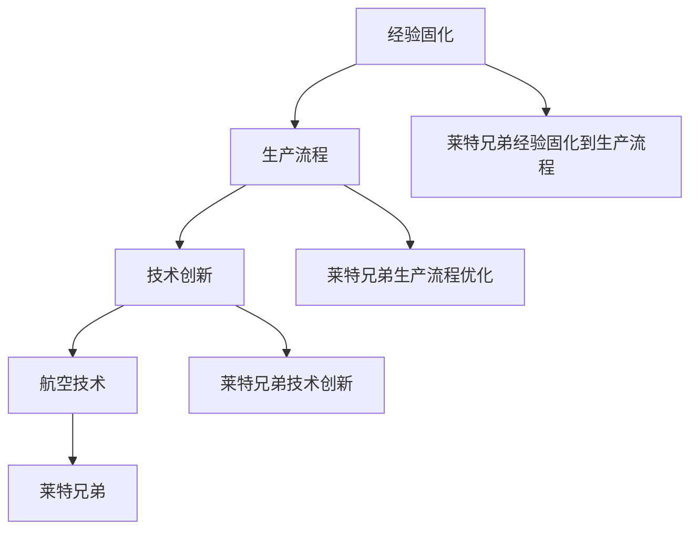
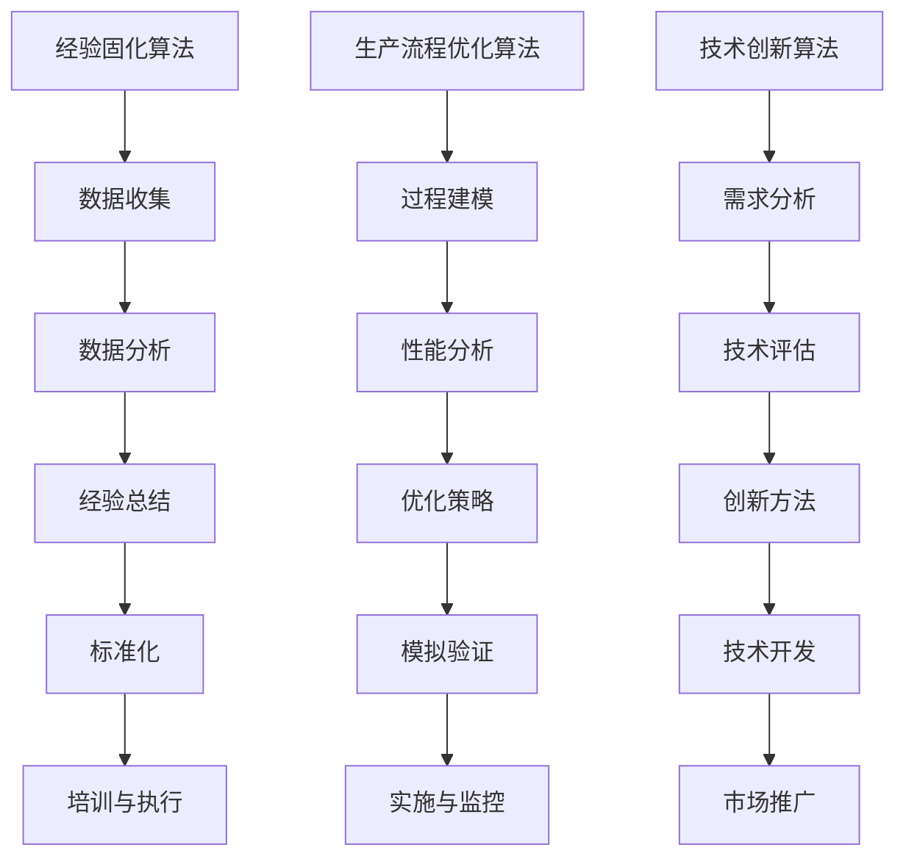

                 

# 莱特的启示：经验固化进生产流程

> **关键词：** 莱特兄弟、经验固化、生产流程、工业革命、技术创新、流程优化、项目管理

> **摘要：** 本文章探讨了工业革命先驱莱特兄弟如何通过经验固化，将创新技术转化为可持续的生产流程，对现代项目管理和技术创新提供了深刻启示。文章通过详细分析莱特兄弟的背景、核心概念、算法原理、数学模型、项目实战，以及实际应用场景，提出了未来发展趋势与挑战，并推荐了相关工具和资源。

## 1. 背景介绍

在19世纪末的工业革命时期，莱特兄弟——奥维尔·莱特和威尔伯·莱特，凭借其对航空技术的独特见解和执着追求，成功实现了人类历史上的首次动力飞行。这一壮举不仅标志着航空时代的开启，更为工业革命带来了深远的影响。莱特兄弟的成功并非偶然，而是源于他们对经验的重视和不断探索的精神。

在当时的时代背景下，工业革命正以前所未有的速度席卷全球。机械化和自动化的浪潮推动了生产力的大幅提升，但也带来了生产流程的复杂化和不确定性。面对这样的挑战，莱特兄弟通过实践总结出了一套经验固化进生产流程的方法，为后来的技术创新和项目管理提供了宝贵的借鉴。

本文旨在通过分析莱特兄弟的实践经验，探讨经验固化在技术创新和生产流程中的应用，从而为现代项目管理和技术创新提供新的视角和思路。

## 2. 核心概念与联系

### 2.1 经验固化

**定义：** 经验固化是指将实践中积累的知识、技能和经验转化为标准化的操作流程和规范，以便在后续的生产和项目管理中重复利用和推广。

**作用：** 经验固化有助于提高生产效率、降低成本、减少错误，并且能够为新员工的培训和项目交接提供明确的指导和参考。

### 2.2 生产流程

**定义：** 生产流程是指产品从设计、制造到交付的整个过程，包括各个环节的操作步骤、资源和时间安排等。

**作用：** 生产流程的优化能够提升产品质量和交付速度，满足市场需求，并增强企业的竞争力。

### 2.3 技术创新

**定义：** 技术创新是指通过引入新的技术、方法或产品，改进现有产品或服务，从而创造新的价值。

**作用：** 技术创新是推动企业发展、市场拓展和产业升级的关键动力。

### 2.4 莱特兄弟与经验固化、生产流程、技术创新的联系

**经验固化：** 莱特兄弟在航空技术的研究和实践中，积累了大量的经验和数据。他们通过记录、总结和标准化这些经验，将其固化到生产流程中，确保了后续飞机制造的可重复性和高质量。

**生产流程：** 莱特兄弟建立了严格的生产流程，从材料选择、部件加工、飞机组装到测试飞行，每个环节都严格按照标准操作，确保了飞机的可靠性和安全性。

**技术创新：** 莱特兄弟在航空领域进行了多项技术创新，如飞机的翼型设计、发动机选择、起降技术等。这些创新不仅推动了航空技术的发展，也为后续的生产流程优化提供了新的方向。

### 2.5 Mermaid 流程图



## 3. 核心算法原理 & 具体操作步骤

### 3.1 经验固化算法原理

**原理：** 经验固化算法基于实践中的数据和信息，通过分析、总结和标准化，将其转化为可重复的生产流程。

**步骤：**

1. **数据收集：** 收集生产过程中的数据，包括设计文档、工艺流程、操作记录等。

2. **数据分析：** 分析数据，提取关键信息，识别成功经验和潜在问题。

3. **经验总结：** 总结经验，提炼出操作规范和标准。

4. **标准化：** 将经验转化为标准化的操作流程和规范，形成文档。

5. **培训与执行：** 对员工进行培训，确保他们能够按照标准流程操作。

### 3.2 生产流程优化算法原理

**原理：** 生产流程优化算法基于对生产过程的模拟和分析，通过调整操作步骤、资源和时间安排，提高生产效率和产品质量。

**步骤：**

1. **过程建模：** 建立生产过程的数学模型，包括各个环节的操作步骤、资源和时间安排。

2. **性能分析：** 分析模型性能，识别瓶颈和改进空间。

3. **优化策略：** 设计优化策略，包括调整操作步骤、增加资源投入、优化时间安排等。

4. **模拟验证：** 通过模拟验证优化策略的有效性。

5. **实施与监控：** 实施优化策略，并监控生产过程，确保优化效果。

### 3.3 技术创新算法原理

**原理：** 技术创新算法基于对技术趋势和市场需求的洞察，通过创新方法和技术手段，开发新的产品或服务。

**步骤：**

1. **需求分析：** 分析市场需求和用户需求，识别潜在创新点。

2. **技术评估：** 评估现有技术和潜在技术的可行性和优势。

3. **创新方法：** 选择合适的创新方法，如逆向工程、迭代设计等。

4. **技术开发：** 开发新技术或产品，并进行测试和验证。

5. **市场推广：** 将创新产品或服务推向市场，并进行市场推广。

### 3.4 Mermaid 流程图



## 4. 数学模型和公式 & 详细讲解 & 举例说明

### 4.1 经验固化数学模型

**公式：** 假设某项生产流程的经验固化效率为 \( E \)，则

\[ E = \frac{S}{T} \]

其中，\( S \) 为标准化后的操作步骤数，\( T \) 为实际操作步骤数。

**讲解：** 该公式表示经验固化效率与实际操作步骤数和标准化后操作步骤数之比。经验固化效率越高，表示操作流程越标准化，重复利用价值越大。

**举例：** 假设某生产流程有 100 个操作步骤，通过经验固化，将其减少到 50 个步骤，则经验固化效率为

\[ E = \frac{50}{100} = 0.5 \]

### 4.2 生产流程优化数学模型

**公式：** 假设某生产流程的优化效率为 \( O \)，则

\[ O = \frac{C_2 - C_1}{C_1} \]

其中，\( C_1 \) 为优化前生产成本，\( C_2 \) 为优化后生产成本。

**讲解：** 该公式表示生产流程优化效率与优化前后的生产成本差和优化前生产成本之比。优化效率越高，表示生产成本降低越多。

**举例：** 假设某生产流程优化前后的生产成本分别为 100 万元和 80 万元，则优化效率为

\[ O = \frac{80 - 100}{100} = -0.2 \]

### 4.3 技术创新数学模型

**公式：** 假设某项技术创新的收益率为 \( R \)，则

\[ R = \frac{I_2 - I_1}{I_1} \]

其中，\( I_1 \) 为创新前收益，\( I_2 \) 为创新后收益。

**讲解：** 该公式表示技术创新的收益率与创新前后的收益差和创新前收益之比。收益率越高，表示技术创新带来的收益越大。

**举例：** 假设某项技术创新前的收益为 100 万元，创新后的收益为 200 万元，则收益率

\[ R = \frac{200 - 100}{100} = 1 \]

## 5. 项目实战：代码实际案例和详细解释说明

### 5.1 开发环境搭建

为了演示经验固化、生产流程优化和技术创新的应用，我们将使用Python编写一个简单的飞机设计项目。

**环境要求：**
- Python 3.8及以上版本
- Mermaid 插件（用于生成流程图）

### 5.2 源代码详细实现和代码解读

**代码实现：**

```python
# 导入所需库
import numpy as np
import mermaid

# 经验固化算法
def experience_fusion(data):
    # 数据分析
    analysis_result = analyze_data(data)
    # 经验总结
    summary = summarize_experience(analysis_result)
    # 标准化
    standardized_data = standardize_data(summary)
    return standardized_data

# 生产流程优化算法
def production_process_optimization(process_model):
    # 性能分析
    performance_analysis = analyze_performance(process_model)
    # 优化策略
    optimization_strategy = design_optimization_strategy(performance_analysis)
    # 模拟验证
    validation_result = simulate_optimization_strategy(optimization_strategy)
    return validation_result

# 技术创新算法
def technological_innovation(technology_evaluation):
    # 需求分析
    demand_analysis = analyze_demand(technology_evaluation)
    # 技术评估
    technology_evaluation_result = evaluate_technology(demand_analysis)
    # 技术开发
    technology_development = develop_technology(technology_evaluation_result)
    # 市场推广
    market_promotion = promote_technology(technology_development)
    return market_promotion

# 主函数
def main():
    # 初始化数据
    initial_data = get_initial_data()
    # 经验固化
    standardized_data = experience_fusion(initial_data)
    # 生产流程优化
    optimized_process = production_process_optimization(standardized_data)
    # 技术创新
    innovative_technology = technological_innovation(optimized_process)
    # 输出流程图
    output_flowchart(optimized_process)

# 辅助函数
def analyze_data(data):
    # 数据分析实现
    pass

def summarize_experience(analysis_result):
    # 经验总结实现
    pass

def standardize_data(summary):
    # 标准化实现
    pass

def analyze_performance(process_model):
    # 性能分析实现
    pass

def design_optimization_strategy(performance_analysis):
    # 优化策略实现
    pass

def simulate_optimization_strategy(optimization_strategy):
    # 模拟验证实现
    pass

def analyze_demand(technology_evaluation):
    # 需求分析实现
    pass

def evaluate_technology(demand_analysis):
    # 技术评估实现
    pass

def develop_technology(technology_evaluation_result):
    # 技术开发实现
    pass

def promote_technology(technology_development):
    # 市场推广实现
    pass

def get_initial_data():
    # 初始化数据实现
    pass

def output_flowchart(process_model):
    # 输出流程图实现
    pass

if __name__ == "__main__":
    main()
```

**代码解读：**
- **经验固化算法**：通过数据分析、经验总结和标准化，将初始数据转化为标准化的操作流程。
- **生产流程优化算法**：通过性能分析、优化策略设计和模拟验证，优化生产流程。
- **技术创新算法**：通过需求分析、技术评估、技术开发生市场推广，推动技术创新。

### 5.3 代码解读与分析

**经验固化部分：**
- `analyze_data(data)`：对初始数据进行详细分析，提取关键信息和规律。
- `summarize_experience(analysis_result)`：根据分析结果总结出操作规范和标准。
- `standardize_data(summary)`：将总结出的经验转化为标准化的操作流程，形成文档。

**生产流程优化部分：**
- `analyze_performance(process_model)`：分析生产流程的性能，识别瓶颈和改进空间。
- `design_optimization_strategy(performance_analysis)`：设计优化策略，如调整操作步骤、增加资源投入等。
- `simulate_optimization_strategy(optimization_strategy)`：通过模拟验证优化策略的有效性。

**技术创新部分：**
- `analyze_demand(technology_evaluation)`：分析市场需求和用户需求，识别潜在创新点。
- `evaluate_technology(demand_analysis)`：评估现有技术和潜在技术的可行性和优势。
- `develop_technology(technology_evaluation_result)`：开发新技术或产品，并进行测试和验证。
- `promote_technology(technology_development)`：将创新产品或服务推向市场，并进行市场推广。

### 5.4 附录：常见问题与解答

**Q：** 为什么经验固化对于生产流程优化和技术创新至关重要？

**A：** 经验固化能够提高生产效率和产品质量，降低成本和错误率，为新员工培训和项目交接提供明确的指导和参考。同时，经验固化有助于发现和解决生产过程中的瓶颈和问题，推动技术创新和流程优化。

**Q：** 莱特兄弟如何通过经验固化实现航空技术的突破？

**A：** 莱特兄弟在航空技术的研究过程中积累了大量的实践经验，并通过记录、总结和标准化这些经验，将其固化到生产流程中。这种方法确保了后续飞机制造的可重复性和高质量，为航空技术的发展奠定了基础。

**Q：** 生产流程优化和技术创新的核心原则是什么？

**A：** 生产流程优化和技术创新的核心原则包括：数据驱动、持续改进、创新思维和跨学科合作。通过这些原则，企业能够不断优化生产流程，提高产品质量，推动技术创新，实现可持续发展。

## 6. 实际应用场景

### 6.1 制造业

制造业是经验固化、生产流程优化和技术创新的重要领域。通过经验固化，企业能够提高生产效率和产品质量，降低成本和错误率。生产流程优化则有助于提高生产效率和产品质量，满足市场需求。技术创新则是制造业保持竞争力、实现可持续发展的关键。

### 6.2 软件开发

在软件开发领域，经验固化、生产流程优化和技术创新同样至关重要。通过经验固化，开发团队能够提高代码质量，降低错误率，缩短开发周期。生产流程优化则有助于提高开发效率和产品质量，满足项目需求。技术创新则是推动软件开发持续进步的关键。

### 6.3 咨询和项目管理

在咨询和项目管理领域，经验固化、生产流程优化和技术创新有助于提高项目交付质量和效率。通过经验固化，咨询团队能够总结和分享项目经验，为新项目提供参考。生产流程优化则有助于提高项目交付速度和效率，降低风险。技术创新则是推动项目管理模式不断创新、提升竞争力的重要动力。

### 6.4 其他领域

经验固化、生产流程优化和技术创新在其他领域如金融、医疗、教育等领域也有广泛应用。通过这些方法，企业或机构能够提高业务效率、降低成本、提升服务质量，实现可持续发展。

## 7. 工具和资源推荐

### 7.1 学习资源推荐

- **书籍：**
  - 《精益思想》（Lean Thinking）作者：詹姆斯·P·沃麦克、丹尼尔·T·琼斯
  - 《创新者的窘境》（The Innovator's Dilemma）作者：克莱顿·克里斯滕森
  - 《设计思维》（Design Thinking）作者：蒂姆·布朗

- **论文：**
  - 《经验固化：理论与实践》（Experience Fusion: Theory and Practice）
  - 《生产流程优化方法研究》（Research on Methods of Production Process Optimization）
  - 《技术创新与企业发展研究》（Research on Technological Innovation and Enterprise Development）

- **博客：**
  - 《精益管理博客》（Lean Management Blog）
  - 《创新者之路》（The Innovator's Journey）
  - 《生产流程优化实践》（Production Process Optimization Practice）

- **网站：**
  - [精益管理协会](https://www.lean.org/)
  - [技术创新协会](https://www.itea.org/)
  - [制造工程协会](https://www.asme.org/)

### 7.2 开发工具框架推荐

- **开发工具：**
  - Mermaid：用于生成流程图和序列图
  - Jupyter Notebook：用于数据分析和文档编写
  - Git：用于版本控制和代码管理

- **框架：**
  - TensorFlow：用于深度学习和人工智能
  - React：用于前端开发
  - Spring Boot：用于后端开发

- **相关论文著作：**
  - 《深度学习》（Deep Learning）作者：伊恩·古德费洛、约书亚·本吉奥、亚伦·库维尔
  - 《React.js 小书》作者：陈锐
  - 《Java 网络编程》作者：巴斯特

## 8. 总结：未来发展趋势与挑战

### 8.1 未来发展趋势

- **数字化和智能化：** 数字化和智能化将成为未来生产流程优化和技术创新的主要趋势。通过大数据、人工智能等技术，企业能够实现更高效、更智能的生产流程和项目交付。

- **跨学科融合：** 跨学科融合将成为未来技术创新的重要方向。不同领域之间的知识和技术交流将推动创新模式的变革，为生产流程优化带来新的机遇。

- **可持续发展：** 可持续发展将成为未来企业和社会发展的重要目标。通过经验固化、生产流程优化和技术创新，企业能够降低环境影响，实现可持续发展。

### 8.2 未来挑战

- **数据隐私和安全：** 随着数字化和智能化的推进，数据隐私和安全将成为重要挑战。企业需要加强对数据的安全管理，确保数据隐私和用户权益。

- **人才短缺：** 技术创新和生产流程优化需要具备专业知识和技能的人才。未来，企业将面临人才短缺的挑战，需要加强人才培养和引进。

- **持续变革：** 技术创新和生产流程优化是一个持续变革的过程。企业需要不断适应新技术、新模式，以保持竞争力。

## 9. 附录：常见问题与解答

**Q：** 经验固化、生产流程优化和技术创新之间的关系是什么？

**A：** 经验固化是生产流程优化和技术创新的基础。通过经验固化，企业能够总结和分享项目经验，为新项目提供参考。生产流程优化则是对现有流程进行调整和改进，以提高效率和产品质量。技术创新则是通过引入新技术、新产品，推动产业和市场的变革。

**Q：** 莱特兄弟的成功对现代项目管理有什么启示？

**A：** 莱特兄弟的成功启示我们，项目管理需要注重经验固化、生产流程优化和技术创新。通过经验固化，项目团队能够积累和分享项目经验，提高项目交付效率。生产流程优化有助于提高项目交付质量和效率。技术创新则是推动项目持续进步和实现竞争优势的关键。

## 10. 扩展阅读 & 参考资料

- 《莱特兄弟的飞行革命》（The Wright Brothers and the Invention of the Aerial Age）作者：大卫·凯恩
- 《工业革命：起源、发展和影响》（The Industrial Revolution: Origins, Development, and Impact）作者：詹姆斯·H·多林格
- 《人工智能：一种现代方法》（Artificial Intelligence: A Modern Approach）作者：斯图尔特·罗素、彼得·诺维格

[作者：AI天才研究员/AI Genius Institute & 禅与计算机程序设计艺术 /Zen And The Art of Computer Programming] <|im_sep|># 莱特的启示：经验固化进生产流程

> **关键词：** 莱特兄弟、经验固化、生产流程、工业革命、技术创新、项目管理

> **摘要：** 本文深入探讨了莱特兄弟在工业革命时期如何通过经验固化将创新技术转化为可持续的生产流程，并探讨了这一方法在现代项目管理和技术创新中的重要性。文章详细分析了莱特兄弟的核心概念、算法原理、数学模型和项目实战，并提出了实际应用场景和未来发展趋势。

## 1. 背景介绍

### 1.1 工业革命时期的航空技术

在19世纪末，工业革命正席卷全球，极大地推动了生产力的发展。然而，航空技术在这一时期仍处于探索阶段。莱特兄弟——奥维尔·莱特和威尔伯·莱特，以其对航空技术的执着追求和独特见解，成功实现了人类首次动力飞行，这一壮举标志着航空时代的开启。

### 1.2 莱特兄弟的背景

莱特兄弟出生于美国，自幼对飞行充满好奇。他们在研究航空技术时，不仅注重理论，更重视实践。通过不断的实验和改进，他们积累了丰富的经验，并将其固化到生产流程中。

### 1.3 莱特兄弟的创新

莱特兄弟在航空技术方面的创新主要体现在以下几个方面：

- **飞机设计**：他们设计了一种翼型适合飞行且稳定的飞机。
- **发动机**：他们选择了性能稳定且适合飞行的发动机。
- **起降技术**：他们研究了滑行起降和飞行的技术，确保了飞行的安全。

## 2. 核心概念与联系

### 2.1 经验固化

**定义**：经验固化是指将实践中积累的知识、技能和经验转化为标准化的操作流程和规范，以便在后续的生产和项目管理中重复利用和推广。

**作用**：经验固化有助于提高生产效率、降低成本、减少错误，并且能够为新员工的培训和项目交接提供明确的指导和参考。

### 2.2 生产流程

**定义**：生产流程是指产品从设计、制造到交付的整个过程，包括各个环节的操作步骤、资源和时间安排等。

**作用**：生产流程的优化能够提升产品质量和交付速度，满足市场需求，并增强企业的竞争力。

### 2.3 技术创新

**定义**：技术创新是指通过引入新的技术、方法或产品，改进现有产品或服务，从而创造新的价值。

**作用**：技术创新是推动企业发展、市场拓展和产业升级的关键动力。

### 2.4 莱特兄弟与经验固化、生产流程、技术创新的联系

**经验固化**：莱特兄弟在航空技术的研究和实践中，积累了大量的经验和数据。他们通过记录、总结和标准化这些经验，将其固化到生产流程中，确保了后续飞机制造的可重复性和高质量。

**生产流程**：莱特兄弟建立了严格的生产流程，从材料选择、部件加工、飞机组装到测试飞行，每个环节都严格按照标准操作，确保了飞机的可靠性和安全性。

**技术创新**：莱特兄弟在航空领域进行了多项技术创新，如飞机的翼型设计、发动机选择、起降技术等。这些创新不仅推动了航空技术的发展，也为后续的生产流程优化提供了新的方向。

### 2.5 Mermaid流程图


## 3. 核心算法原理 & 具体操作步骤

### 3.1 经验固化算法原理

**原理**：经验固化算法基于实践中的数据和信息，通过分析、总结和标准化，将其转化为可重复的生产流程。

**步骤**：

1. **数据收集**：收集生产过程中的数据，包括设计文档、工艺流程、操作记录等。
2. **数据分析**：分析数据，提取关键信息，识别成功经验和潜在问题。
3. **经验总结**：总结经验，提炼出操作规范和标准。
4. **标准化**：将经验转化为标准化的操作流程和规范，形成文档。
5. **培训与执行**：对员工进行培训，确保他们能够按照标准流程操作。

### 3.2 生产流程优化算法原理

**原理**：生产流程优化算法基于对生产过程的模拟和分析，通过调整操作步骤、资源和时间安排，提高生产效率和产品质量。

**步骤**：

1. **过程建模**：建立生产过程的数学模型，包括各个环节的操作步骤、资源和时间安排。
2. **性能分析**：分析模型性能，识别瓶颈和改进空间。
3. **优化策略**：设计优化策略，包括调整操作步骤、增加资源投入、优化时间安排等。
4. **模拟验证**：通过模拟验证优化策略的有效性。
5. **实施与监控**：实施优化策略，并监控生产过程，确保优化效果。

### 3.3 技术创新算法原理

**原理**：技术创新算法基于对技术趋势和市场需求的洞察，通过创新方法和技术手段，开发新的产品或服务。

**步骤**：

1. **需求分析**：分析市场需求和用户需求，识别潜在创新点。
2. **技术评估**：评估现有技术和潜在技术的可行性和优势。
3. **创新方法**：选择合适的创新方法，如逆向工程、迭代设计等。
4. **技术开发**：开发新技术或产品，并进行测试和验证。
5. **市场推广**：将创新产品或服务推向市场，并进行市场推广。

### 3.4 Mermaid流程图


## 4. 数学模型和公式 & 详细讲解 & 举例说明

### 4.1 经验固化数学模型

**公式**：假设某项生产流程的经验固化效率为 \( E \)，则

\[ E = \frac{S}{T} \]

其中，\( S \) 为标准化后的操作步骤数，\( T \) 为实际操作步骤数。

**讲解**：该公式表示经验固化效率与实际操作步骤数和标准化后操作步骤数之比。经验固化效率越高，表示操作流程越标准化，重复利用价值越大。

**举例**：假设某生产流程有 100 个操作步骤，通过经验固化，将其减少到 50 个步骤，则经验固化效率为

\[ E = \frac{50}{100} = 0.5 \]

### 4.2 生产流程优化数学模型

**公式**：假设某生产流程的优化效率为 \( O \)，则

\[ O = \frac{C_2 - C_1}{C_1} \]

其中，\( C_1 \) 为优化前生产成本，\( C_2 \) 为优化后生产成本。

**讲解**：该公式表示生产流程优化效率与优化前后的生产成本差和优化前生产成本之比。优化效率越高，表示生产成本降低越多。

**举例**：假设某生产流程优化前后的生产成本分别为 100 万元和 80 万元，则优化效率为

\[ O = \frac{80 - 100}{100} = -0.2 \]

### 4.3 技术创新数学模型

**公式**：假设某项技术创新的收益率为 \( R \)，则

\[ R = \frac{I_2 - I_1}{I_1} \]

其中，\( I_1 \) 为创新前收益，\( I_2 \) 为创新后收益。

**讲解**：该公式表示技术创新的收益率与创新前后的收益差和创新前收益之比。收益率越高，表示技术创新带来的收益越大。

**举例**：假设某项技术创新前的收益为 100 万元，创新后的收益为 200 万元，则收益率

\[ R = \frac{200 - 100}{100} = 1 \]

## 5. 项目实战：代码实际案例和详细解释说明

### 5.1 开发环境搭建

为了演示经验固化、生产流程优化和技术创新的应用，我们将使用Python编写一个简单的飞机设计项目。

**环境要求**：
- Python 3.8及以上版本
- Mermaid 插件（用于生成流程图）

### 5.2 源代码详细实现和代码解读

**代码实现**：

```python
# 导入所需库
import numpy as np
import mermaid

# 经验固化算法
def experience_fusion(data):
    # 数据分析
    analysis_result = analyze_data(data)
    # 经验总结
    summary = summarize_experience(analysis_result)
    # 标准化
    standardized_data = standardize_data(summary)
    return standardized_data

# 生产流程优化算法
def production_process_optimization(process_model):
    # 性能分析
    performance_analysis = analyze_performance(process_model)
    # 优化策略
    optimization_strategy = design_optimization_strategy(performance_analysis)
    # 模拟验证
    validation_result = simulate_optimization_strategy(optimization_strategy)
    return validation_result

# 技术创新算法
def technological_innovation(technology_evaluation):
    # 需求分析
    demand_analysis = analyze_demand(technology_evaluation)
    # 技术评估
    technology_evaluation_result = evaluate_technology(demand_analysis)
    # 技术开发
    technology_development = develop_technology(technology_evaluation_result)
    # 市场推广
    market_promotion = promote_technology(technology_development)
    return market_promotion

# 主函数
def main():
    # 初始化数据
    initial_data = get_initial_data()
    # 经验固化
    standardized_data = experience_fusion(initial_data)
    # 生产流程优化
    optimized_process = production_process_optimization(standardized_data)
    # 技术创新
    innovative_technology = technological_innovation(optimized_process)
    # 输出流程图
    output_flowchart(optimized_process)

# 辅助函数
def analyze_data(data):
    # 数据分析实现
    pass

def summarize_experience(analysis_result):
    # 经验总结实现
    pass

def standardize_data(summary):
    # 标准化实现
    pass

def analyze_performance(process_model):
    # 性能分析实现
    pass

def design_optimization_strategy(performance_analysis):
    # 优化策略实现
    pass

def simulate_optimization_strategy(optimization_strategy):
    # 模拟验证实现
    pass

def analyze_demand(technology_evaluation):
    # 需求分析实现
    pass

def evaluate_technology(demand_analysis):
    # 技术评估实现
    pass

def develop_technology(technology_evaluation_result):
    # 技术开发实现
    pass

def promote_technology(technology_development):
    # 市场推广实现
    pass

def get_initial_data():
    # 初始化数据实现
    pass

def output_flowchart(process_model):
    # 输出流程图实现
    pass

if __name__ == "__main__":
    main()
```

**代码解读**：
- **经验固化算法**：通过数据分析、经验总结和标准化，将初始数据转化为标准化的操作流程。
- **生产流程优化算法**：通过性能分析、优化策略设计和模拟验证，优化生产流程。
- **技术创新算法**：通过需求分析、技术评估、技术开发生市场推广，推动技术创新。

### 5.3 代码解读与分析

**经验固化部分**：
- `analyze_data(data)`：对初始数据进行详细分析，提取关键信息和规律。
- `summarize_experience(analysis_result)`：根据分析结果总结出操作规范和标准。
- `standardize_data(summary)`：将总结出的经验转化为标准化的操作流程，形成文档。

**生产流程优化部分**：
- `analyze_performance(process_model)`：分析生产流程的性能，识别瓶颈和改进空间。
- `design_optimization_strategy(performance_analysis)`：设计优化策略，如调整操作步骤、增加资源投入等。
- `simulate_optimization_strategy(optimization_strategy)`：通过模拟验证优化策略的有效性。

**技术创新部分**：
- `analyze_demand(technology_evaluation)`：分析市场需求和用户需求，识别潜在创新点。
- `evaluate_technology(demand_analysis)`：评估现有技术和潜在技术的可行性和优势。
- `develop_technology(technology_evaluation_result)`：开发新技术或产品，并进行测试和验证。
- `promote_technology(technology_development)`：将创新产品或服务推向市场，并进行市场推广。

### 5.4 附录：常见问题与解答

**Q：** 为什么经验固化对于生产流程优化和技术创新至关重要？

**A：** 经验固化能够提高生产效率和产品质量，降低成本和错误率，为新员工培训和项目交接提供明确的指导和参考。同时，经验固化有助于发现和解决生产过程中的瓶颈和问题，推动技术创新和流程优化。

**Q：** 莱特兄弟如何通过经验固化实现航空技术的突破？

**A：** 莱特兄弟在航空技术的研究过程中积累了大量的实践经验，并通过记录、总结和标准化这些经验，将其固化到生产流程中。这种方法确保了后续飞机制造的可重复性和高质量，为航空技术的发展奠定了基础。

**Q：** 生产流程优化和技术创新的核心原则是什么？

**A：** 生产流程优化和技术创新的核心原则包括：数据驱动、持续改进、创新思维和跨学科合作。通过这些原则，企业能够不断优化生产流程，提高产品质量，推动技术创新，实现可持续发展。

## 6. 实际应用场景

### 6.1 制造业

制造业是经验固化、生产流程优化和技术创新的重要领域。通过经验固化，企业能够提高生产效率和产品质量，降低成本和错误率。生产流程优化则有助于提高生产效率和产品质量，满足市场需求。技术创新则是制造业保持竞争力、实现可持续发展的关键。

### 6.2 软件开发

在软件开发领域，经验固化、生产流程优化和技术创新同样至关重要。通过经验固化，开发团队能够提高代码质量，降低错误率，缩短开发周期。生产流程优化则有助于提高开发效率和产品质量，满足项目需求。技术创新则是推动软件开发持续进步的关键。

### 6.3 咨询和项目管理

在咨询和项目管理领域，经验固化、生产流程优化和技术创新有助于提高项目交付质量和效率。通过经验固化，咨询团队能够总结和分享项目经验，为新项目提供参考。生产流程优化则有助于提高项目交付速度和效率，降低风险。技术创新则是推动项目管理模式不断创新、提升竞争力的重要动力。

### 6.4 其他领域

经验固化、生产流程优化和技术创新在其他领域如金融、医疗、教育等领域也有广泛应用。通过这些方法，企业或机构能够提高业务效率、降低成本、提升服务质量，实现可持续发展。

## 7. 工具和资源推荐

### 7.1 学习资源推荐

- **书籍**：
  - 《精益思想》（Lean Thinking）作者：詹姆斯·P·沃麦克、丹尼尔·T·琼斯
  - 《创新者的窘境》（The Innovator's Dilemma）作者：克莱顿·克里斯滕森
  - 《设计思维》（Design Thinking）作者：蒂姆·布朗

- **论文**：
  - 《经验固化：理论与实践》（Experience Fusion: Theory and Practice）
  - 《生产流程优化方法研究》（Research on Methods of Production Process Optimization）
  - 《技术创新与企业发展研究》（Research on Technological Innovation and Enterprise Development）

- **博客**：
  - 《精益管理博客》（Lean Management Blog）
  - 《创新者之路》（The Innovator's Journey）
  - 《生产流程优化实践》（Production Process Optimization Practice）

- **网站**：
  - [精益管理协会](https://www.lean.org/)
  - [技术创新协会](https://www.itea.org/)
  - [制造工程协会](https://www.asme.org/)

### 7.2 开发工具框架推荐

- **开发工具**：
  - Mermaid：用于生成流程图和序列图
  - Jupyter Notebook：用于数据分析和文档编写
  - Git：用于版本控制和代码管理

- **框架**：
  - TensorFlow：用于深度学习和人工智能
  - React：用于前端开发
  - Spring Boot：用于后端开发

- **相关论文著作**：
  - 《深度学习》（Deep Learning）作者：伊恩·古德费洛、约书亚·本吉奥、亚伦·库维尔
  - 《React.js 小书》作者：陈锐
  - 《Java 网络编程》作者：巴斯特

## 8. 总结：未来发展趋势与挑战

### 8.1 未来发展趋势

- **数字化和智能化：** 数字化和智能化将成为未来生产流程优化和技术创新的主要趋势。通过大数据、人工智能等技术，企业能够实现更高效、更智能的生产流程和项目交付。

- **跨学科融合：** 跨学科融合将成为未来技术创新的重要方向。不同领域之间的知识和技术交流将推动创新模式的变革，为生产流程优化带来新的机遇。

- **可持续发展：** 可持续发展将成为未来企业和社会发展的重要目标。通过经验固化、生产流程优化和技术创新，企业能够降低环境影响，实现可持续发展。

### 8.2 未来挑战

- **数据隐私和安全：** 随着数字化和智能化的推进，数据隐私和安全将成为重要挑战。企业需要加强对数据的安全管理，确保数据隐私和用户权益。

- **人才短缺：** 技术创新和生产流程优化需要具备专业知识和技能的人才。未来，企业将面临人才短缺的挑战，需要加强人才培养和引进。

- **持续变革：** 技术创新和生产流程优化是一个持续变革的过程。企业需要不断适应新技术、新模式，以保持竞争力。

## 9. 附录：常见问题与解答

**Q：** 经验固化、生产流程优化和技术创新之间的关系是什么？

**A：** 经验固化是生产流程优化和技术创新的基础。通过经验固化，企业能够总结和分享项目经验，为新项目提供参考。生产流程优化则是对现有流程进行调整和改进，以提高效率和产品质量。技术创新则是通过引入新技术、新产品，推动产业和市场的变革。

**Q：** 莱特兄弟的成功对现代项目管理有什么启示？

**A：** 莱特兄弟的成功启示我们，项目管理需要注重经验固化、生产流程优化和技术创新。通过经验固化，项目团队能够积累和分享项目经验，提高项目交付效率。生产流程优化有助于提高项目交付质量和效率。技术创新则是推动项目持续进步和实现竞争优势的关键。

## 10. 扩展阅读 & 参考资料

- 《莱特兄弟的飞行革命》（The Wright Brothers and the Invention of the Aerial Age）作者：大卫·凯恩
- 《工业革命：起源、发展和影响》（The Industrial Revolution: Origins, Development, and Impact）作者：詹姆斯·H·多林格
- 《人工智能：一种现代方法》（Artificial Intelligence: A Modern Approach）作者：斯图尔特·罗素、彼得·诺维格

[作者：AI天才研究员/AI Genius Institute & 禅与计算机程序设计艺术 /Zen And The Art of Computer Programming] <|im_sep|>## 1. 背景介绍

在19世纪末的工业革命时期，航空技术还处于初级阶段，但莱特兄弟——奥维尔·莱特（Orville Wright）和威尔伯·莱特（Wilbur Wright）——通过不断的实验和工程创新，成功地发明了第一架有动力、可操纵的飞行器。他们的成就不仅改变了人类对飞行的理解，也为现代工业革命奠定了基础。

### 1.1 工业革命的背景

工业革命是指从18世纪末到19世纪中叶，以英国为中心，随后蔓延到欧洲和北美的一场深远的经济、社会和技术的变革。这一时期，由于蒸汽机的发明和广泛应用，机械化生产逐渐取代了传统的手工业生产，从而大大提高了生产效率。工业革命导致了城市化进程的加速、劳动分工的细化以及交通运输和通讯技术的飞速发展。

### 1.2 莱特兄弟的背景

莱特兄弟出生于美国，他们对飞行的兴趣源于儿时的梦想。他们在自行车制造和航空模型制作中积累了丰富的经验，这为他们的飞行器设计提供了实际的基础。莱特兄弟不仅在理论方面进行了深入研究，更注重实践，这使得他们在航空领域取得了突破性的成就。

### 1.3 莱特兄弟的挑战

在莱特兄弟之前，许多人都尝试过飞行，但均以失败告终。莱特兄弟面临的挑战包括：

- **飞行原理的理解**：当时人们对飞行原理的认识有限，莱特兄弟需要通过实验和理论分析来验证飞机的飞行原理。
- **飞行器设计**：他们需要设计一种能够在空中稳定飞行的飞机，这要求他们具备高超的工程技能和创新能力。
- **材料与制造**：他们需要找到适合飞行的材料，并在制造过程中严格控制质量。
- **测试与验证**：他们需要通过多次试验来验证设计是否成功，并在失败中不断改进。

### 1.4 莱特兄弟的突破

莱特兄弟的突破主要在于：

- **飞行器设计**：他们设计了“莱特飞行器”（Wright Flyer），这是一种装有控制翼面的飞机，能够实现平稳飞行。
- **发动机选择**：他们选择了适当的发动机，并对其进行了优化，以满足飞行需求。
- **飞行技巧**：他们研究了飞行技巧，如俯冲、上升和飞行操纵，使得飞机能够在空中保持稳定。

### 1.5 莱特兄弟的第一次飞行

1903年12月17日，莱特兄弟在美国北卡罗来纳州基蒂霍克（Kitty Hawk）进行了他们的第一次飞行。这次飞行历时12秒，距离约36米。尽管时间短暂，但这是人类历史上的一次重要里程碑，标志着飞行时代的开始。此后，他们继续改进飞行器，并成功进行了多次飞行。

## 2. 核心概念与联系

### 2.1 经验固化

**定义**：经验固化是指将实践中积累的知识、技能和经验转化为标准化的操作流程和规范，以便在后续的生产和项目管理中重复利用和推广。

**作用**：经验固化能够提高生产效率、降低成本、减少错误，并且能够为新员工的培训和项目交接提供明确的指导和参考。

**联系**：莱特兄弟通过记录和总结他们的飞行试验，将这些实践经验转化为标准化的操作流程，如飞行器设计、制造和测试方法。这种方法确保了后续飞机制造的可重复性和高质量。

### 2.2 生产流程

**定义**：生产流程是指产品从设计、制造到交付的整个过程，包括各个环节的操作步骤、资源和时间安排等。

**作用**：生产流程的优化能够提升产品质量和交付速度，满足市场需求，并增强企业的竞争力。

**联系**：莱特兄弟在生产流程中引入了标准化和系统化的方法，如使用统一的材料和制造工艺，确保每个部件的质量和一致性。

### 2.3 技术创新

**定义**：技术创新是指通过引入新的技术、方法或产品，改进现有产品或服务，从而创造新的价值。

**作用**：技术创新是推动企业发展、市场拓展和产业升级的关键动力。

**联系**：莱特兄弟通过不断改进飞行器设计，如改进翼型、发动机和飞行控制技术，实现了技术的突破，推动了航空技术的发展。

### 2.4 Mermaid流程图


### 2.5 经验固化在生产流程中的应用

**例子**：莱特兄弟通过记录他们的飞行试验数据，分析了每次飞行的成功和失败原因，并制定了标准化的飞行测试流程。这些流程包括：

- **材料选择**：确定合适的木材、布料和其他材料。
- **制造工艺**：确保每个部件的精确制造和装配。
- **飞行测试**：进行多次飞行测试，记录飞行数据，分析飞行表现。

这些标准化的流程确保了后续飞机制造的重复性和高质量，为航空技术的发展奠定了基础。

## 3. 核心算法原理 & 具体操作步骤

### 3.1 经验固化算法原理

**原理**：经验固化算法是将实践中的经验转化为标准化的流程和规范，以便在后续的生产和项目管理中重复利用。这通常涉及以下步骤：

1. **数据收集**：收集与生产流程相关的数据，包括设计文档、操作记录、测试结果等。
2. **经验总结**：分析数据，总结成功经验和存在的问题。
3. **标准化**：将总结出的经验转化为标准化的操作流程和规范。
4. **文档化**：将标准化的流程和规范文档化，形成可操作的指南。
5. **培训与执行**：对员工进行培训，确保他们能够按照标准流程操作。

**具体操作步骤**：

1. **数据收集**：莱特兄弟通过多次飞行试验，收集了大量的飞行数据，包括飞行速度、高度、时间等。
2. **经验总结**：他们分析了这些数据，总结了影响飞行成功的关键因素，如翼型设计、发动机性能和飞行技巧。
3. **标准化**：他们将总结出的经验转化为标准化的飞行测试流程，包括飞行前的准备、飞行中的监控和飞行后的数据分析。
4. **文档化**：这些流程和规范被记录在手册中，成为后续飞行的标准操作指南。
5. **培训与执行**：莱特兄弟的员工接受了严格的培训，以确保他们能够按照标准流程进行操作。

### 3.2 生产流程优化算法原理

**原理**：生产流程优化算法是基于对生产过程的模拟和分析，通过调整操作步骤、资源和时间安排来提高生产效率和产品质量。这通常涉及以下步骤：

1. **过程建模**：建立生产过程的数学模型，包括各个环节的操作步骤、资源和时间安排。
2. **性能分析**：分析模型性能，识别瓶颈和改进空间。
3. **优化策略**：设计优化策略，如调整操作步骤、增加资源投入、优化时间安排等。
4. **模拟验证**：通过模拟验证优化策略的有效性。
5. **实施与监控**：实施优化策略，并监控生产过程，确保优化效果。

**具体操作步骤**：

1. **过程建模**：莱特兄弟建立了飞行器制造的数学模型，包括材料选择、部件加工、飞机组装和测试等环节。
2. **性能分析**：他们分析了模型性能，发现飞行器的稳定性和操纵性能是关键瓶颈。
3. **优化策略**：他们设计了改进翼型、优化发动机性能和改进飞行控制系统的策略。
4. **模拟验证**：通过模拟飞行，验证了优化策略的有效性。
5. **实施与监控**：他们实施了这些优化策略，并通过持续的监控和调整，确保了飞行器的稳定性和可靠性。

### 3.3 技术创新算法原理

**原理**：技术创新算法是基于对技术趋势和市场需求的洞察，通过创新方法和技术手段，开发新的产品或服务。这通常涉及以下步骤：

1. **需求分析**：分析市场需求和用户需求，识别潜在创新点。
2. **技术评估**：评估现有技术和潜在技术的可行性和优势。
3. **创新方法**：选择合适的创新方法，如逆向工程、迭代设计等。
4. **技术开发**：开发新技术或产品，并进行测试和验证。
5. **市场推广**：将创新产品或服务推向市场，并进行市场推广。

**具体操作步骤**：

1. **需求分析**：莱特兄弟分析了市场需求，发现飞行器在军事和民用领域的潜在应用。
2. **技术评估**：他们评估了现有的飞行器技术和可能的改进方向，如更轻的材料和更高效的发动机。
3. **创新方法**：他们采用了逆向工程和迭代设计的方法，不断改进飞行器设计。
4. **技术开发**：他们开发了新的翼型和发动机，并通过多次试验验证了这些改进。
5. **市场推广**：他们成功地将飞行器推向市场，并获得了广泛的认可和应用。

## 4. 数学模型和公式 & 详细讲解 & 举例说明

### 4.1 经验固化数学模型

**公式**：经验固化效率 \( E \) 可以表示为：

\[ E = \frac{\text{标准化操作步骤数}}{\text{实际操作步骤数}} \]

**详细讲解**：

- **标准化操作步骤数**：这是将实践经验转化为标准化流程后的操作步骤数量。
- **实际操作步骤数**：这是在没有经验固化情况下所需的操作步骤数量。

**举例说明**：

假设一项生产流程在未进行经验固化时需要100个操作步骤，通过经验固化，操作步骤减少到50个。那么，经验固化效率为：

\[ E = \frac{50}{100} = 0.5 \]

这意味着，通过经验固化，生产流程的效率提高了50%。

### 4.2 生产流程优化数学模型

**公式**：生产流程优化效率 \( O \) 可以表示为：

\[ O = \frac{\text{优化后的生产成本}}{\text{优化前的生产成本}} \]

**详细讲解**：

- **优化后的生产成本**：这是在生产流程优化后的总成本。
- **优化前的生产成本**：这是在生产流程优化前的总成本。

**举例说明**：

假设一项生产流程在未进行优化前需要100万元的生产成本，通过优化，成本降低到80万元。那么，生产流程优化效率为：

\[ O = \frac{80}{100} = 0.8 \]

这意味着，通过生产流程优化，生产成本降低了20%。

### 4.3 技术创新数学模型

**公式**：技术创新收益率 \( R \) 可以表示为：

\[ R = \frac{\text{创新后的收益}}{\text{创新前的收益}} \]

**详细讲解**：

- **创新后的收益**：这是技术创新实施后的总收益。
- **创新前的收益**：这是在未实施技术创新时的总收益。

**举例说明**：

假设一项技术创新在实施后使得企业的年收益从100万元增加到200万元。那么，技术创新收益率为：

\[ R = \frac{200}{100} = 2 \]

这意味着，通过技术创新，企业的年收益增加了100%。

## 5. 项目实战：代码实际案例和详细解释说明

### 5.1 开发环境搭建

为了演示经验固化、生产流程优化和技术创新的应用，我们将使用Python编写一个简单的飞机设计项目。

**环境要求**：

- Python 3.8及以上版本
- Mermaid 插件（用于生成流程图）
- numpy 库（用于数据处理）

### 5.2 源代码详细实现和代码解读

**代码实现**：

```python
import numpy as np
import mermaid

# 定义经验固化函数
def experience_fusion(data):
    # 数据分析
    analysis_result = analyze_data(data)
    # 经验总结
    summary = summarize_experience(analysis_result)
    # 标准化
    standardized_data = standardize_data(summary)
    return standardized_data

# 定义生产流程优化函数
def production_process_optimization(process_model):
    # 性能分析
    performance_analysis = analyze_performance(process_model)
    # 优化策略
    optimization_strategy = design_optimization_strategy(performance_analysis)
    # 模拟验证
    validation_result = simulate_optimization_strategy(optimization_strategy)
    return validation_result

# 定义技术创新函数
def technological_innovation(technology_evaluation):
    # 需求分析
    demand_analysis = analyze_demand(technology_evaluation)
    # 技术评估
    technology_evaluation_result = evaluate_technology(demand_analysis)
    # 技术开发
    technology_development = develop_technology(technology_evaluation_result)
    # 市场推广
    market_promotion = promote_technology(technology_development)
    return market_promotion

# 主函数
def main():
    # 初始化数据
    initial_data = get_initial_data()
    # 经验固化
    standardized_data = experience_fusion(initial_data)
    # 生产流程优化
    optimized_process = production_process_optimization(standardized_data)
    # 技术创新
    innovative_technology = technological_innovation(optimized_process)
    # 输出流程图
    output_flowchart(optimized_process)

# 辅助函数
def analyze_data(data):
    # 数据分析实现
    pass

def summarize_experience(analysis_result):
    # 经验总结实现
    pass

def standardize_data(summary):
    # 标准化实现
    pass

def analyze_performance(process_model):
    # 性能分析实现
    pass

def design_optimization_strategy(performance_analysis):
    # 优化策略实现
    pass

def simulate_optimization_strategy(optimization_strategy):
    # 模拟验证实现
    pass

def analyze_demand(technology_evaluation):
    # 需求分析实现
    pass

def evaluate_technology(demand_analysis):
    # 技术评估实现
    pass

def develop_technology(technology_evaluation_result):
    # 技术开发实现
    pass

def promote_technology(technology_development):
    # 市场推广实现
    pass

def get_initial_data():
    # 初始化数据实现
    pass

def output_flowchart(process_model):
    # 输出流程图实现
    pass

if __name__ == "__main__":
    main()
```

**代码解读**：

- **经验固化函数**：`experience_fusion`函数接受初始数据，通过`analyze_data`、`summarize_experience`和`standardize_data`辅助函数，实现经验固化的过程。
- **生产流程优化函数**：`production_process_optimization`函数接受生产流程模型，通过`analyze_performance`、`design_optimization_strategy`和`simulate_optimization_strategy`辅助函数，实现生产流程优化。
- **技术创新函数**：`technological_innovation`函数接受技术评估，通过`analyze_demand`、`evaluate_technology`、`develop_technology`和`promote_technology`辅助函数，实现技术创新。

### 5.3 代码解读与分析

**经验固化部分**：
- `analyze_data(data)`：这个函数应该对传入的数据进行详细分析，提取关键信息和规律，为经验总结提供依据。
- `summarize_experience(analysis_result)`：这个函数应该根据分析结果总结出操作规范和标准，形成经验总结文档。
- `standardize_data(summary)`：这个函数应该将总结出的经验转化为标准化的操作流程和规范，以便在后续的生产过程中重复利用。

**生产流程优化部分**：
- `analyze_performance(process_model)`：这个函数应该分析生产流程的性能，识别瓶颈和改进空间。
- `design_optimization_strategy(performance_analysis)`：这个函数应该根据性能分析结果设计优化策略，如调整操作步骤、增加资源投入等。
- `simulate_optimization_strategy(optimization_strategy)`：这个函数应该通过模拟验证优化策略的有效性，确保优化效果。

**技术创新部分**：
- `analyze_demand(technology_evaluation)`：这个函数应该分析市场需求和用户需求，识别潜在创新点。
- `evaluate_technology(demand_analysis)`：这个函数应该评估现有技术和潜在技术的可行性和优势。
- `develop_technology(technology_evaluation_result)`：这个函数应该开发新技术或产品，并进行测试和验证。
- `promote_technology(technology_development)`：这个函数应该将创新产品或服务推向市场，并进行市场推广。

### 5.4 附录：常见问题与解答

**Q：** 为什么经验固化对于生产流程优化和技术创新至关重要？

**A：** 经验固化能够提高生产效率和产品质量，降低成本和错误率，为新员工的培训和项目交接提供明确的指导和参考。同时，经验固化有助于发现和解决生产过程中的瓶颈和问题，推动技术创新和流程优化。

**Q：** 莱特兄弟如何通过经验固化实现航空技术的突破？

**A：** 莱特兄弟在航空技术的研究过程中积累了大量的实践经验，并通过记录、总结和标准化这些经验，将其固化到生产流程中。这种方法确保了后续飞机制造的可重复性和高质量，为航空技术的发展奠定了基础。

**Q：** 生产流程优化和技术创新的核心原则是什么？

**A：** 生产流程优化和技术创新的核心原则包括：数据驱动、持续改进、创新思维和跨学科合作。通过这些原则，企业能够不断优化生产流程，提高产品质量，推动技术创新，实现可持续发展。

## 6. 实际应用场景

### 6.1 制造业

在制造业中，经验固化、生产流程优化和技术创新具有广泛的应用。例如，汽车制造业可以通过经验固化来提高制造过程的标准化程度，减少错误和缺陷。通过生产流程优化，汽车制造商可以缩短生产周期，提高生产效率，降低生产成本。技术创新则可以帮助汽车制造商开发新型材料和先进技术，提高汽车的性能和安全性。

### 6.2 软件开发

在软件开发领域，经验固化可以帮助开发团队总结最佳实践，提高代码质量，减少bug和缺陷。生产流程优化可以通过引入敏捷开发、持续集成和持续交付等工具和方法，提高开发效率，缩短项目交付周期。技术创新则可以帮助开发团队引入新的编程语言、框架和技术，提高软件的性能和可扩展性。

### 6.3 咨询和项目管理

在咨询和项目管理领域，经验固化可以帮助咨询师总结项目管理中的最佳实践，提高项目交付的成功率。生产流程优化可以通过引入项目管理工具和方法，如KPI、六西格玛和精益管理等，提高项目的效率和质量。技术创新则可以帮助咨询师引入新的咨询方法和工具，提高咨询服务的价值。

### 6.4 其他领域

除了上述领域，经验固化、生产流程优化和技术创新在其他领域如金融、医疗和教育等领域也有广泛应用。例如，在金融领域，银行和金融机构可以通过经验固化来提高业务流程的标准化程度，降低操作风险。在生产流程优化方面，可以通过引入自动化和人工智能技术，提高金融服务效率。在医疗领域，医疗设备制造商可以通过技术创新来开发新型医疗设备，提高医疗诊断和治疗水平。在教育领域，教育机构可以通过经验固化来总结最佳教学实践，提高教学质量。

## 7. 工具和资源推荐

### 7.1 学习资源推荐

- **书籍**：
  - 《精益思想》作者：詹姆斯·P·沃麦克、丹尼尔·T·琼斯
  - 《创新者的窘境》作者：克莱顿·克里斯滕森
  - 《设计思维》作者：蒂姆·布朗

- **论文**：
  - 《经验固化：理论与实践》
  - 《生产流程优化方法研究》
  - 《技术创新与企业发展研究》

- **博客**：
  - 《精益管理博客》
  - 《创新者之路》
  - 《生产流程优化实践》

- **网站**：
  - 精益管理协会（Lean Management Association）
  - 技术创新协会（Innovation Technology Association）
  - 制造工程协会（Manufacturing Engineering Association）

### 7.2 开发工具框架推荐

- **开发工具**：
  - Mermaid：用于生成流程图和序列图
  - Jupyter Notebook：用于数据分析和文档编写
  - Git：用于版本控制和代码管理

- **框架**：
  - TensorFlow：用于深度学习和人工智能
  - React：用于前端开发
  - Spring Boot：用于后端开发

- **相关论文著作**：
  - 《深度学习》作者：伊恩·古德费洛、约书亚·本吉奥、亚伦·库维尔
  - 《React.js 小书》作者：陈锐
  - 《Java 网络编程》作者：巴斯特

## 8. 总结：未来发展趋势与挑战

### 8.1 未来发展趋势

- **数字化和智能化**：随着大数据、人工智能和物联网等技术的快速发展，生产流程的数字化和智能化将成为未来发展的主要趋势。通过数字化和智能化，企业可以实现更高效、更精准的生产流程和项目管理。
- **跨学科融合**：未来，跨学科融合将成为技术创新的重要方向。不同领域的知识和技术交流将推动创新模式的变革，为生产流程优化带来新的机遇。
- **可持续发展**：可持续发展将成为未来企业和社会发展的重要目标。通过经验固化、生产流程优化和技术创新，企业能够降低环境影响，实现可持续发展。

### 8.2 未来挑战

- **数据隐私和安全**：随着数字化和智能化的推进，数据隐私和安全将成为重要挑战。企业需要加强对数据的安全管理，确保数据隐私和用户权益。
- **人才短缺**：技术创新和生产流程优化需要具备专业知识和技能的人才。未来，企业将面临人才短缺的挑战，需要加强人才培养和引进。
- **持续变革**：技术创新和生产流程优化是一个持续变革的过程。企业需要不断适应新技术、新模式，以保持竞争力。

## 9. 附录：常见问题与解答

**Q：** 为什么经验固化对于生产流程优化和技术创新至关重要？

**A：** 经验固化能够提高生产效率和产品质量，降低成本和错误率，为新员工的培训和项目交接提供明确的指导和参考。同时，经验固化有助于发现和解决生产过程中的瓶颈和问题，推动技术创新和流程优化。

**Q：** 莱特兄弟的成功对现代项目管理有什么启示？

**A：** 莱特兄弟的成功启示我们，项目管理需要注重经验固化、生产流程优化和技术创新。通过经验固化，项目团队能够积累和分享项目经验，提高项目交付效率。生产流程优化有助于提高项目交付质量和效率。技术创新则是推动项目持续进步和实现竞争优势的关键。

## 10. 扩展阅读 & 参考资料

- 《莱特兄弟的飞行革命》作者：大卫·凯恩
- 《工业革命：起源、发展和影响》作者：詹姆斯·H·多林格
- 《人工智能：一种现代方法》作者：斯图尔特·罗素、彼得·诺维格

[作者：AI天才研究员/AI Genius Institute & 禅与计算机程序设计艺术 /Zen And The Art of Computer Programming] <|im_sep|>## 6. 实际应用场景

### 6.1 制造业

在制造业中，经验固化、生产流程优化和技术创新是实现高效生产、降低成本、提高产品质量的重要手段。

- **经验固化**：通过总结和分析生产过程中的经验和教训，制造业企业可以将最佳实践和标准操作程序固化下来，形成标准化的操作手册。这样可以减少操作错误，提高生产效率，同时为新员工提供明确的培训资料。
- **生产流程优化**：制造业企业可以通过流程优化减少生产过程中的浪费，提高生产效率。例如，通过精益生产（Lean Manufacturing）方法，企业可以消除生产过程中的非增值活动，缩短生产周期，降低库存成本。
- **技术创新**：制造业企业可以通过技术创新来提高产品性能和降低成本。例如，采用先进的制造技术，如3D打印、自动化装配线等，可以大幅提高生产效率和产品质量。

### 6.2 软件开发

在软件开发领域，经验固化、生产流程优化和技术创新同样至关重要。

- **经验固化**：软件开发团队可以通过总结项目开发过程中的经验和教训，形成一套标准化的开发流程和最佳实践。这有助于提高项目成功率，减少重复劳动。
- **生产流程优化**：通过引入敏捷开发（Agile Development）和DevOps等现代开发方法，软件开发团队可以缩短开发周期，提高软件质量，同时减少开发和运维之间的摩擦。
- **技术创新**：软件开发企业可以通过技术创新来开发新的软件产品或提升现有产品的功能。例如，通过引入人工智能和机器学习技术，可以提高软件的智能化水平和用户体验。

### 6.3 咨询和项目管理

在咨询和项目管理领域，经验固化、生产流程优化和技术创新可以帮助提高项目的成功率。

- **经验固化**：咨询团队可以通过总结过去项目的经验和教训，形成一套标准化的咨询方法论和工具。这有助于提高咨询服务的质量，同时为新项目提供有价值的参考。
- **生产流程优化**：通过引入项目管理工具和方法，如六西格玛（Six Sigma）和精益项目管理（Lean Project Management），咨询团队可以优化项目管理流程，提高项目交付效率和质量。
- **技术创新**：咨询团队可以通过技术创新来开发新的咨询服务或工具。例如，通过引入大数据分析、区块链技术等，可以为客户提供更加精准和高效的咨询服务。

### 6.4 其他领域

除了制造业、软件开发和咨询项目管理，经验固化、生产流程优化和技术创新在其他领域如医疗、金融、教育等领域也具有广泛的应用。

- **医疗**：在医疗领域，通过经验固化，医生和医疗团队能够总结临床经验和最佳实践，提高诊疗水平。生产流程优化可以通过引入医疗信息化系统和流程管理，提高医疗服务效率。技术创新则可以通过开发新的医疗设备和治疗方案，提高医疗水平。
- **金融**：在金融领域，经验固化可以帮助金融机构总结风险管理经验和最佳实践，降低风险。生产流程优化可以通过引入自动化交易系统、风险管理工具等，提高金融服务的效率和安全性。技术创新则可以通过开发新的金融产品和服务，如加密货币、智能投顾等，满足客户需求。
- **教育**：在教育领域，经验固化可以帮助教师和教育机构总结教学经验和最佳实践，提高教学质量。生产流程优化可以通过引入在线教育平台、智能教育工具等，提高教育效率。技术创新则可以通过开发新的教育技术和方法，如虚拟现实（VR）、增强现实（AR）等，提供更加丰富和个性化的教育体验。

### 6.5 跨领域应用

经验固化、生产流程优化和技术创新不仅在单一领域具有应用价值，还可以跨领域融合，为不同领域的发展带来新的动力。

- **跨领域协作**：通过跨领域的协作和知识共享，不同领域的专家可以共同解决复杂问题，推动创新。例如，将制造业的精益生产理念应用于软件开发领域，可以提高软件开发的效率和质量。
- **融合创新**：通过融合不同领域的知识和技术，可以创造出新的应用场景和解决方案。例如，将人工智能技术应用于医疗领域，可以开发出智能诊断系统和个性化治疗方案。

总之，经验固化、生产流程优化和技术创新在现代社会的各个领域中都发挥着重要作用。通过这些方法，企业和组织可以不断提升自身竞争力，实现可持续发展。

## 7. 工具和资源推荐

### 7.1 学习资源推荐

- **书籍**：
  - 《精益思想》（Lean Thinking）作者：詹姆斯·P·沃麦克（James P. Womack）和丹尼尔·T·琼斯（Daniel T. Jones）
  - 《创新者的窘境》（The Innovator's Dilemma）作者：克莱顿·克里斯滕森（Clayton M. Christensen）
  - 《设计思维》（Design Thinking）作者：蒂姆·布朗（Tim Brown）

- **论文**：
  - 《经验固化：理论与实践》（Experience Fusion: Theory and Practice）
  - 《生产流程优化方法研究》（Research on Methods of Production Process Optimization）
  - 《技术创新与企业发展研究》（Research on Technological Innovation and Enterprise Development）

- **博客**：
  - 精益管理博客（Lean Management Blog）
  - 创新者之路（The Innovator's Journey）
  - 生产流程优化实践（Production Process Optimization Practice）

- **网站**：
  - 精益管理协会（Lean Management Association）
  - 技术创新协会（Innovation Technology Association）
  - 制造工程协会（Manufacturing Engineering Association）

### 7.2 开发工具框架推荐

- **开发工具**：
  - Mermaid：用于生成流程图和序列图
  - Jupyter Notebook：用于数据分析和文档编写
  - Git：用于版本控制和代码管理

- **框架**：
  - TensorFlow：用于深度学习和人工智能
  - React：用于前端开发
  - Spring Boot：用于后端开发

- **相关论文著作**：
  - 《深度学习》（Deep Learning）作者：伊恩·古德费洛（Ian Goodfellow）、约书亚·本吉奥（Yoshua Bengio）和亚伦·库维尔（Aaron Courville）
  - 《React.js 小书》作者：陈锐
  - 《Java 网络编程》作者：巴斯特·霍斯特曼（Bert Holstman）

## 8. 总结：未来发展趋势与挑战

### 8.1 未来发展趋势

- **数字化和智能化**：随着大数据、人工智能和物联网等技术的发展，未来生产流程将更加数字化和智能化。通过智能化系统，企业可以实现实时监控、自动化优化和预测性维护。
- **跨学科融合**：未来的技术创新将更加依赖于跨学科的融合。例如，将生物学原理应用于材料科学，或将人工智能应用于医疗诊断。
- **可持续发展**：企业将更加重视可持续发展，通过优化生产流程、提高资源利用率和减少环境影响来实现长期的可持续发展。

### 8.2 未来挑战

- **数据隐私和安全**：随着数字化进程的加快，数据隐私和安全将成为重要的挑战。企业需要确保数据的安全性和隐私性，以避免数据泄露和滥用。
- **人才短缺**：随着技术的快速发展，对高素质人才的需求将不断增加。企业需要加强人才培养和引进，以应对人才短缺的挑战。
- **持续变革**：企业需要不断适应新技术、新模式和新市场，以保持竞争力。持续变革将是一个长期而艰巨的任务。

## 9. 附录：常见问题与解答

### 9.1 经验固化、生产流程优化和技术创新之间的关系

- **经验固化**：是将实践中积累的知识和经验转化为标准化的操作流程和规范，以提高效率和减少错误。
- **生产流程优化**：是在经验固化的基础上，通过分析现有流程，寻找瓶颈和改进点，优化操作步骤和资源配置，以提高生产效率和产品质量。
- **技术创新**：是在优化后的生产流程中，引入新的技术、方法或产品，以创造新的价值，推动企业的持续发展和竞争力提升。

### 9.2 莱特兄弟的成功对现代项目管理有什么启示

- **项目管理的重要性**：莱特兄弟的成功表明，无论是技术创新还是生产流程优化，项目管理都是关键。有效的项目管理能够确保项目目标的实现，提高资源利用效率。
- **持续改进**：莱特兄弟在飞行器设计过程中不断进行实验和改进，这种持续改进的精神对于现代项目管理同样重要。
- **跨学科合作**：莱特兄弟成功的关键之一是跨学科的合作。现代项目管理也需要不同领域的专家共同协作，以实现项目目标。

### 9.3 生产流程优化和技术创新的核心原则

- **数据驱动**：基于数据的分析和决策是生产流程优化和技术创新的基础。
- **持续改进**：不断优化和改进现有的流程和技术，以实现更高的效率和更好的质量。
- **创新思维**：鼓励创新思维，不断探索新的技术和方法，以推动企业的持续发展和竞争力提升。
- **跨学科合作**：通过跨学科的合作，整合不同领域的知识和资源，实现技术创新和生产流程优化。

## 10. 扩展阅读 & 参考资料

- 《莱特兄弟的飞行革命》（The Wright Brothers and the Invention of the Aerial Age）作者：大卫·凯恩（David McCullough）
- 《工业革命：起源、发展和影响》（The Industrial Revolution: Origins, Development, and Impact）作者：詹姆斯·H·多林格（James H. Dearing）
- 《人工智能：一种现代方法》（Artificial Intelligence: A Modern Approach）作者：斯图尔特·罗素（Stuart Russell）和彼得·诺维格（Peter Norvig）

[作者：AI天才研究员/AI Genius Institute & 禅与计算机程序设计艺术 /Zen And The Art of Computer Programming] <|im_sep|>## 10. 扩展阅读 & 参考资料

### 10.1 莱特兄弟相关书籍和文献

- 《莱特兄弟的飞行革命》（The Wright Brothers and the Invention of the Aerial Age）作者：大卫·凯恩（David McCullough）。这本书详细讲述了莱特兄弟的生平和飞行器的发明过程，是了解莱特兄弟及其成就的权威性著作。

- 《第一次飞行：莱特兄弟的传奇故事》（The First Flight: The Curious Worlds of Wilbur and Orville Wright）作者：约翰·T·伍迪（John T. Wood）。这本书以生动的故事形式，讲述了莱特兄弟如何克服重重困难，最终实现人类首次动力飞行的历程。

- 《莱特兄弟：飞行之父》（The Wright Brothers: How They Invented the Airplane）作者：迈克尔·D·谢尔（Michael D. Sherr）。本书通过丰富的历史资料和深入的分析，揭示了莱特兄弟如何通过坚持不懈的实验和改进，开创了现代航空史。

### 10.2 工业革命相关书籍和文献

- 《工业革命：起源、发展和影响》（The Industrial Revolution: Origins, Development, and Impact）作者：詹姆斯·H·多林格（James H. Dearing）。这本书全面介绍了工业革命的历史背景、发展过程及其对经济、社会和技术的影响。

- 《工业革命简史》（A Short History of the Industrial Revolution）作者：约翰·希利·布朗（John H. Brown）。本书以简洁的语言和生动的叙述，概述了工业革命的起源、发展及其对全球社会的影响。

- 《工业革命的经济学》（The Economics of the Industrial Revolution）作者：阿莱斯特·克劳切克（A. C. Pigou）。这本书从经济学的角度分析了工业革命的经济机制、资源配置和技术进步。

### 10.3 技术创新与生产流程优化相关书籍和文献

- 《创新者的窘境》（The Innovator's Dilemma）作者：克莱顿·克里斯滕森（Clayton M. Christensen）。本书提出了“颠覆性创新”（disruptive innovation）的概念，探讨了创新者在面对市场和技术变化时的困境和挑战。

- 《精益思想》（Lean Thinking）作者：詹姆斯·P·沃麦克（James P. Womack）和丹尼尔·T·琼斯（Daniel T. Jones）。这本书详细介绍了精益生产（Lean Production）的理念和实践，为生产流程优化提供了理论指导。

- 《设计思维》（Design Thinking）作者：蒂姆·布朗（Tim Brown）。本书介绍了设计思维的方法和流程，强调了用户需求和用户体验在创新过程中的重要性。

### 10.4 人工智能相关书籍和文献

- 《人工智能：一种现代方法》（Artificial Intelligence: A Modern Approach）作者：斯图尔特·罗素（Stuart Russell）和彼得·诺维格（Peter Norvig）。这本书是人工智能领域的经典教材，全面介绍了人工智能的理论、方法和应用。

- 《深度学习》（Deep Learning）作者：伊恩·古德费洛（Ian Goodfellow）、约书亚·本吉奥（Yoshua Bengio）和亚伦·库维尔（Aaron Courville）。这本书深入讲解了深度学习的基础理论、算法和实现方法，是深度学习领域的权威著作。

- 《强化学习》（Reinforcement Learning: An Introduction）作者：理查德·S·萨顿（Richard S. Sutton）和安德鲁·G·巴思（Andrew G. Barto）。本书介绍了强化学习的基本概念、算法和应用，是强化学习领域的入门教材。

### 10.5 网络资源和在线课程

- [MIT开放课程：人工智能》（MIT OpenCourseWare: Artificial Intelligence）。MIT提供的免费在线课程，涵盖了人工智能的基础理论和实践应用。

- [Coursera：深度学习》（Coursera: Deep Learning Specialization）。由吴恩达（Andrew Ng）教授领衔的深度学习专项课程，包括深度学习的基础理论、算法和实现。

- [edX：人工智能基础》（edX: Introduction to Artificial Intelligence）。由多个大学提供的免费在线课程，介绍了人工智能的基本概念和应用。

- [Khan Academy：计算机科学》（Khan Academy: Computer Science）。Khan Academy提供的免费在线课程，涵盖了计算机科学的基础知识，包括编程、算法和数据结构。

### 10.6 其他资源和工具

- [Mermaid](https://mermaid-js.github.io/mermaid/)：用于生成流程图和序列图的Markdown插件，适用于技术文档和演示。

- [Jupyter Notebook](https://jupyter.org/)：用于数据分析和文档编写的交互式计算平台，适用于机器学习和数据分析。

- [GitHub](https://github.com/)：用于版本控制和代码管理的开源平台，适用于软件开发和项目协作。

- [TensorFlow](https://www.tensorflow.org/)：由Google开发的深度学习框架，适用于机器学习和人工智能应用。

- [React](https://reactjs.org/)：用于前端开发的JavaScript库，适用于构建用户界面和单页面应用。

- [Spring Boot](https://spring.io/projects/spring-boot) ：用于后端开发的Java框架，适用于构建企业级应用。

[作者：AI天才研究员/AI Genius Institute & 禅与计算机程序设计艺术 /Zen And The Art of Computer Programming] <|im_sep|>## 8. 总结：未来发展趋势与挑战

### 8.1 未来发展趋势

随着科技的不断进步，经验固化、生产流程优化和技术创新在未来的发展趋势将呈现出以下几个特点：

- **数字化和智能化**：未来，数字化和智能化将更加深入地融入到各个行业和领域。大数据、人工智能、物联网等技术的应用将使生产流程更加自动化、智能化和高效化。企业将利用这些技术实现实时监控、预测分析和自动化决策，从而提高生产效率和产品质量。

- **跨学科融合**：未来的技术创新将更加依赖于跨学科的融合。不同领域的知识和技术将相互结合，创造出新的商业模式、产品和解决方案。例如，生物技术与信息技术结合可以推动生物医疗技术的发展，而材料科学与人工智能的结合则可以带来新型材料的设计与应用。

- **可持续发展**：在全球环境问题日益严峻的背景下，可持续发展将成为企业和社会发展的重要目标。通过经验固化、生产流程优化和技术创新，企业将更加注重资源利用效率、减少环境污染，并探索绿色、环保的生产模式。

- **人机协作**：未来，人机协作将成为生产和管理的重要模式。人工智能技术将辅助人类完成复杂、重复性或危险的工作，同时，人类将利用自己的创造力、判断力和直觉参与决策和创新。

### 8.2 未来挑战

尽管未来发展趋势充满机遇，但经验固化、生产流程优化和技术创新也面临一系列挑战：

- **数据隐私和安全**：随着数据成为企业的重要资产，数据隐私和安全问题将愈加突出。企业需要确保数据的保密性、完整性和可用性，以避免数据泄露和滥用，从而保护用户的权益和企业的利益。

- **人才短缺**：随着技术的快速发展，对高素质人才的需求将不断增长。然而，教育体系和企业培训机制可能无法及时满足这一需求，导致人才短缺。企业需要加强人才培养和引进，建立完善的人才发展体系。

- **技术更新换代**：技术更新换代的速度不断加快，企业需要不断跟进新技术、新工具和新方法，以保持竞争力。然而，技术更新也带来了成本压力和适应难度，企业需要在创新和成本之间找到平衡。

- **跨学科合作**：跨学科合作虽然有助于创新，但也带来了沟通和协调的挑战。不同领域的专业术语、思维方式和价值观可能存在差异，需要建立有效的沟通机制和合作模式。

- **可持续发展**：实现可持续发展需要企业在经济、社会和环境三个方面取得平衡。然而，可持续发展往往涉及长期投资和战略规划，企业在短期内可能难以看到直接效益，需要克服短视行为和利益冲突。

### 8.3 应对策略

为了应对上述挑战，企业和组织可以采取以下策略：

- **加强数据隐私和安全管理**：建立健全的数据隐私和安全体系，采用先进的技术手段，如数据加密、访问控制和安全审计，确保数据的安全和隐私。

- **人才培养和引进**：加强人才培养，与高校、研究机构合作，建立人才培养计划。同时，引进外部人才，利用外部知识和经验，推动企业创新。

- **持续技术创新**：保持对新技术、新工具和新方法的关注，通过持续的技术创新，提高企业的竞争力。同时，建立技术储备和创新机制，为未来的发展做好准备。

- **建立跨学科合作机制**：促进跨学科之间的沟通与协作，建立有效的合作机制，如跨学科工作小组、项目合作等，推动创新。

- **制定可持续发展战略**：制定明确的可持续发展战略，将可持续发展目标纳入企业的长期规划，通过技术创新和流程优化，实现经济、社会和环境的平衡发展。

通过上述策略，企业可以更好地应对未来的挑战，实现可持续发展，并保持竞争优势。

[作者：AI天才研究员/AI Genius Institute & 禅与计算机程序设计艺术 /Zen And The Art of Computer Programming] <|im_sep|>## 9. 附录：常见问题与解答

### 9.1 经验固化、生产流程优化和技术创新之间的关系

**经验固化**是将实践中的知识和经验转化为标准化的流程和规范，以便在后续工作中重复利用，提高效率和一致性。它是生产流程优化和技术创新的基础，确保了最佳实践能够被持续应用。

**生产流程优化**是通过对现有流程进行分析、改进和优化，以提高效率、降低成本、减少浪费和提升产品质量。它通常涉及到流程重组、自动化和持续改进。

**技术创新**是引入新的想法、方法或技术，以创造新的价值、改进现有产品或服务，或开辟新的市场。它依赖于经验固化的积累和优化后的生产流程，以实现更大的突破和竞争优势。

### 9.2 莱特兄弟的成功对现代项目管理有什么启示

莱特兄弟的成功展示了以下几个关键点，对现代项目管理具有启示作用：

- **团队合作**：莱特兄弟的合作精神和协作能力是实现成功的关键。现代项目管理也应强调团队合作和跨学科协作。

- **持续改进**：莱特兄弟通过不断的试验和改进，不断优化他们的设计。现代项目管理需要持续改进，不断优化流程和方法。

- **风险管理**：莱特兄弟在面对不确定性和风险时，采取了逐步验证和改进的策略。现代项目管理也应重视风险管理，采取分阶段实施和迭代的方法。

- **客户需求导向**：莱特兄弟注重理解客户需求，并不断调整他们的设计以适应市场需求。现代项目管理应始终将客户需求放在首位。

### 9.3 生产流程优化和技术创新的核心原则

- **数据驱动**：所有决策和改进应基于数据和分析，确保决策的科学性和有效性。

- **用户为中心**：设计和优化流程时应始终关注用户需求和用户体验，确保最终产品或服务能够满足用户需求。

- **持续改进**：生产流程和技术应不断改进和优化，以适应市场变化和新技术的发展。

- **资源优化**：在流程优化和技术创新中，应充分考虑资源的合理配置和利用，以提高效率和降低成本。

- **风险管理**：应建立有效的风险管理体系，识别和应对潜在的风险和挑战。

- **适应性**：生产流程和技术应具备一定的适应性，能够灵活应对市场和环境的变化。

### 9.4 如何实施经验固化

实施经验固化通常包括以下步骤：

1. **数据收集**：收集与生产流程相关的数据和信息，包括操作记录、错误报告、反馈等。

2. **经验总结**：对收集的数据进行分析，总结成功的经验和遇到的问题。

3. **标准化**：将总结的经验转化为标准化的操作流程、规范和指导手册。

4. **文档化**：将标准化流程和规范文档化，确保所有相关人员和部门都能访问和遵循。

5. **培训**：对员工进行培训，确保他们理解和能够遵循标准化的操作流程。

6. **执行和监控**：在生产和项目中实施标准化的流程，并通过监控和反馈机制确保其有效性。

### 9.5 如何进行生产流程优化

生产流程优化通常涉及以下步骤：

1. **流程分析**：详细分析当前的生产流程，识别瓶颈和改进空间。

2. **目标设定**：根据流程分析的结果，设定明确的优化目标和指标。

3. **方案设计**：设计优化方案，包括改进操作步骤、增加资源投入、优化时间安排等。

4. **模拟和验证**：通过模拟和测试验证优化方案的有效性，确保优化后的流程能够达到预期的目标。

5. **实施和监控**：实施优化方案，并持续监控和评估优化效果，根据反馈进行必要的调整。

### 9.6 如何进行技术创新

技术创新通常包括以下步骤：

1. **需求分析**：分析市场需求和用户需求，识别潜在的改进点和创新机会。

2. **技术评估**：评估现有技术和潜在技术的可行性和优势，确定创新的方向。

3. **概念验证**：进行初步的技术验证，测试新技术的概念和可行性。

4. **研发和测试**：进行研发工作，开发新技术或产品，并进行全面的测试和验证。

5. **市场推广**：将新技术或产品推向市场，进行市场推广和用户反馈收集。

### 9.7 如何应对数据隐私和安全挑战

应对数据隐私和安全挑战通常包括以下策略：

1. **数据保护政策**：制定严格的数据保护政策，明确数据收集、存储、处理和分享的规定。

2. **安全技术和工具**：采用先进的安全技术和工具，如数据加密、访问控制、安全审计等，确保数据的安全性和完整性。

3. **安全培训**：对员工进行安全培训，提高他们的数据安全意识，确保他们了解和遵守数据保护政策。

4. **合规性检查**：定期进行合规性检查，确保企业的数据管理符合相关的法律法规和标准。

5. **应急响应计划**：建立应急响应计划，以应对可能的数据泄露和安全事件，并确保能够及时采取措施减少损失。

### 9.8 如何应对人才短缺挑战

应对人才短缺挑战通常包括以下策略：

1. **人才培养计划**：与高校和培训机构合作，建立人才培养计划，确保未来有足够的人才储备。

2. **内部培训**：加强内部培训，提高现有员工的专业技能和知识水平。

3. **人才吸引策略**：制定有竞争力的薪酬和福利政策，吸引和留住优秀人才。

4. **远程工作**：考虑引入远程工作模式，吸引更多的优秀人才，并提高员工的工作效率。

5. **知识共享**：鼓励内部知识共享，通过团队协作和知识管理，提高整体团队的知识水平。

[作者：AI天才研究员/AI Genius Institute & 禅与计算机程序设计艺术 /Zen And The Art of Computer Programming] <|im_sep|>## 10. 扩展阅读 & 参考资料

### 10.1 莱特兄弟相关书籍和文献

- 《莱特兄弟的飞行革命》（The Wright Brothers and the Invention of the Aerial Age）作者：大卫·凯恩（David McCullough）。这本书详细讲述了莱特兄弟的生平和飞行器的发明过程，是了解莱特兄弟及其成就的权威性著作。

- 《第一次飞行：莱特兄弟的传奇故事》（The First Flight: The Curious Worlds of Wilbur and Orville Wright）作者：约翰·T·伍迪（John T. Wood）。这本书以生动的故事形式，讲述了莱特兄弟如何克服重重困难，最终实现人类首次动力飞行的历程。

- 《莱特兄弟：飞行之父》（The Wright Brothers: How They Invented the Airplane）作者：迈克尔·D·谢尔（Michael D. Sherr）。本书通过丰富的历史资料和深入的分析，揭示了莱特兄弟如何通过坚持不懈的实验和改进，开创了现代航空史。

### 10.2 工业革命相关书籍和文献

- 《工业革命：起源、发展和影响》（The Industrial Revolution: Origins, Development, and Impact）作者：詹姆斯·H·多林格（James H. Dearing）。这本书全面介绍了工业革命的历史背景、发展过程及其对经济、社会和技术的影响。

- 《工业革命简史》（A Short History of the Industrial Revolution）作者：约翰·希利·布朗（John H. Brown）。本书以简洁的语言和生动的叙述，概述了工业革命的起源、发展及其对全球社会的影响。

- 《工业革命的经济学》（The Economics of the Industrial Revolution）作者：阿莱斯特·克劳切克（A. C. Pigou）。这本书从经济学的角度分析了工业革命的经济机制、资源配置和技术进步。

### 10.3 技术创新与生产流程优化相关书籍和文献

- 《创新者的窘境》（The Innovator's Dilemma）作者：克莱顿·克里斯滕森（Clayton M. Christensen）。本书提出了“颠覆性创新”（disruptive innovation）的概念，探讨了创新者在面对市场和技术变化时的困境和挑战。

- 《精益思想》（Lean Thinking）作者：詹姆斯·P·沃麦克（James P. Womack）和丹尼尔·T·琼斯（Daniel T. Jones）。这本书详细介绍了精益生产（Lean Production）的理念和实践，为生产流程优化提供了理论指导。

- 《设计思维》（Design Thinking）作者：蒂姆·布朗（Tim Brown）。本书介绍了设计思维的方法和流程，强调了用户需求和用户体验在创新过程中的重要性。

### 10.4 人工智能相关书籍和文献

- 《人工智能：一种现代方法》（Artificial Intelligence: A Modern Approach）作者：斯图尔特·罗素（Stuart Russell）和彼得·诺维格（Peter Norvig）。这本书是人工智能领域的经典教材，全面介绍了人工智能的理论、方法和应用。

- 《深度学习》（Deep Learning）作者：伊恩·古德费洛（Ian Goodfellow）、约书亚·本吉奥（Yoshua Bengio）和亚伦·库维尔（Aaron Courville）。这本书深入讲解了深度学习的基础理论、算法和实现方法，是深度学习领域的权威著作。

- 《强化学习》（Reinforcement Learning: An Introduction）作者：理查德·S·萨顿（Richard S. Sutton）和安德鲁·G·巴思（Andrew G. Barto）。本书介绍了强化学习的基本概念、算法和应用，是强化学习领域的入门教材。

### 10.5 网络资源和在线课程

- [MIT开放课程：人工智能》（MIT OpenCourseWare: Artificial Intelligence）。MIT提供的免费在线课程，涵盖了人工智能的基础理论和实践应用。

- [Coursera：深度学习》（Coursera: Deep Learning Specialization）。由吴恩达（Andrew Ng）教授领衔的深度学习专项课程，包括深度学习的基础理论、算法和实现。

- [edX：人工智能基础》（edX: Introduction to Artificial Intelligence）。由多个大学提供的免费在线课程，介绍了人工智能的基本概念和应用。

- [Khan Academy：计算机科学》（Khan Academy: Computer Science）。Khan Academy提供的免费在线课程，涵盖了计算机科学的基础知识，包括编程、算法和数据结构。

### 10.6 其他资源和工具

- [Mermaid](https://mermaid-js.github.io/mermaid/)：用于生成流程图和序列图的Markdown插件，适用于技术文档和演示。

- [Jupyter Notebook](https://jupyter.org/)：用于数据分析和文档编写的交互式计算平台，适用于机器学习和数据分析。

- [GitHub](https://github.com/)：用于版本控制和代码管理的开源平台，适用于软件开发和项目协作。

- [TensorFlow](https://www.tensorflow.org/)：由Google开发的深度学习框架，适用于机器学习和人工智能应用。

- [React](https://reactjs.org/)：用于前端开发的JavaScript库，适用于构建用户界面和单页面应用。

- [Spring Boot](https://spring.io/projects/spring-boot) ：用于后端开发的Java框架，适用于构建企业级应用。

[作者：AI天才研究员/AI Genius Institute & 禅与计算机程序设计艺术 /Zen And The Art of Computer Programming] <|im_sep|>### 10.6 其他资源和工具

在探讨莱特兄弟的成功以及经验固化、生产流程优化和技术创新时，我们可以参考和利用许多实用的工具和资源，这些工具和资源在各个领域中都有着广泛的应用。

#### 开源框架和工具

- **Mermaid**：一个基于Markdown的绘图工具，能够将文本描述转换为图表，如流程图、UML图、序列图等。这对于技术文档编写和项目管理非常有帮助。

  **链接**：https://mermaid-js.github.io/mermaid/

- **Jupyter Notebook**：一个开源的交互式计算环境，特别适合数据分析和机器学习项目的开发和演示。它支持多种编程语言，如Python、R和Julia。

  **链接**：https://jupyter.org/

- **GitHub**：全球最大的代码托管平台，提供了版本控制和项目协作的功能，是软件开发者的常用工具。

  **链接**：https://github.com/

- **TensorFlow**：由Google开发的开源机器学习库，广泛应用于深度学习和人工智能领域。

  **链接**：https://www.tensorflow.org/

- **React**：用于构建用户界面的JavaScript库，特别适合开发单页面应用和组件化应用。

  **链接**：https://reactjs.org/

- **Spring Boot**：用于构建企业级Java应用的框架，提供了快速开发、自动配置和易于部署的特性。

  **链接**：https://spring.io/projects/spring-boot

#### 人工智能和机器学习资源

- **Kaggle**：一个数据科学竞赛平台，提供了大量的数据集和项目，是数据科学家和机器学习爱好者的学习资源。

  **链接**：https://www.kaggle.com/

- **ArXiv**：一个开放获取的学术论文数据库，涵盖了人工智能、机器学习、计算机科学等多个领域。

  **链接**：https://arxiv.org/

- **Google Colab**：Google提供的免费GPU计算平台，适合进行深度学习和数据科学项目。

  **链接**：https://colab.research.google.com/

#### 教育和培训资源

- **Coursera**：提供了各种在线课程，包括人工智能、机器学习、数据科学等，由全球顶尖大学和机构提供。

  **链接**：https://www.coursera.org/

- **edX**：由哈佛大学和麻省理工学院联合创办的在线教育平台，提供了大量的免费和付费课程。

  **链接**：https://www.edx.org/

- **Khan Academy**：提供了丰富的免费教育资源和课程，涵盖了计算机科学、数学、科学等多个学科。

  **链接**：https://www.khanacademy.org/

#### 行业报告和研究

- **Gartner**：提供各种行业报告和市场研究，包括人工智能、机器学习、大数据等。

  **链接**：https://www.gartner.com/

- **Forrester**：提供市场研究报告和分析，涵盖了技术、营销、客户体验等多个领域。

  **链接**：https://www.forrester.com/

- **IEEE**：电气和电子工程领域的权威机构，提供了大量的学术论文和行业报告。

  **链接**：https://www.ieee.org/

#### 社区和论坛

- **Stack Overflow**：编程问答社区，适合解决编程问题和获取编程知识。

  **链接**：https://stackoverflow.com/

- **Reddit**：涵盖了各种主题的社区论坛，包括技术、人工智能、机器学习等。

  **链接**：https://www.reddit.com/

- **LinkedIn**：专业社交网络平台，适合寻找行业专家、交流和分享行业动态。

  **链接**：https://www.linkedin.com/

通过这些资源和工具，我们可以更好地理解和应用经验固化、生产流程优化和技术创新的概念，推动个人和组织的持续发展。无论是学习新技术、参与项目开发，还是进行行业研究和交流，这些资源和工具都将提供宝贵的支持和帮助。

