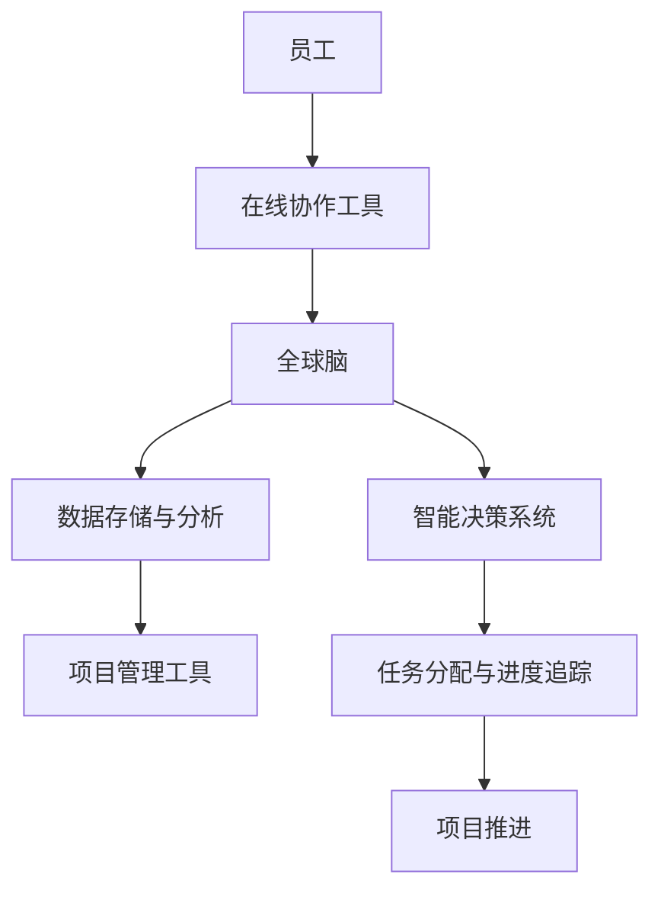

                 

### 背景介绍

随着全球化的推进和信息技术的飞速发展，远程工作（Remote Work）已经成为现代企业运营的重要组成部分。虚拟办公不仅打破了地域限制，还为员工提供了更加灵活和自由的工作环境。根据国际远程工作协会（International Association of Virtual Offices）的数据显示，全球远程工作的比例在过去十年中增长了约40%。这一趋势在2020年新冠疫情爆发后进一步加速，使得远程办公成为许多企业维持运营和员工福祉的必要选择。

然而，虚拟办公也带来了一系列挑战。员工在远程工作环境下如何提高工作效率、保持团队协作以及适应新的工作模式，成为企业管理者和IT专家亟待解决的问题。研究表明，尽管远程办公提供了便利，但同时也可能导致工作与生活的边界模糊、沟通障碍和孤立感增加（Gajendran & Sahlman, 2009）。

本文旨在探讨虚拟办公效率的提升策略，特别是通过全球脑（Global Brain）驱动的远程工作优化方法。全球脑是一个分布式智能系统，它通过计算机网络将个体的智能连接起来，实现信息共享和协同工作（Bengston, 2008）。本文将介绍全球脑的基本原理，分析其在虚拟办公中的应用，并通过具体案例探讨其提升远程工作效率的潜力。

首先，我们将回顾远程工作的发展历程，探讨其面临的挑战。接着，介绍全球脑的概念，展示其在虚拟办公中的潜在应用。然后，深入讨论虚拟办公效率的核心问题，并提出基于全球脑的优化策略。最后，通过实际案例展示全球脑驱动的远程工作优化效果，并对未来趋势和挑战进行展望。

通过本文的研究，我们希望为企业管理者和IT专家提供有益的参考，帮助他们在全球脑驱动的远程工作环境中实现效率的最大化。

### 2. 核心概念与联系

#### 全球脑（Global Brain）

全球脑是一个复杂的概念，它源于神经科学和系统理论。Bengston（2008）将其描述为一个分布式智能系统，通过计算机网络将个体的智能连接起来，形成一个高度协同的整体。全球脑的核心思想是信息共享和协同工作，它类似于人类大脑中的神经网络，但规模更为庞大，覆盖范围更为广泛。

在虚拟办公中，全球脑可以通过多种技术实现。首先，云计算提供了全球脑的基础设施，使得数据可以在全球范围内快速传输和存储。其次，物联网（IoT）将各种设备连接到网络，实现设备间的实时通信和数据交换。此外，人工智能（AI）和机器学习（ML）算法可以帮助分析海量数据，从而为决策提供支持。

#### 虚拟办公与全球脑的联系

虚拟办公和全球脑之间有着紧密的联系。虚拟办公环境提供了全球脑运行的场所，而全球脑则为虚拟办公提供了高效的协作工具。以下是虚拟办公与全球脑之间联系的几个关键点：

1. **信息共享**：全球脑的核心功能是信息共享。在虚拟办公中，员工可以通过各种在线协作工具（如Slack、Microsoft Teams等）实时共享信息，提高工作效率。

2. **协同工作**：全球脑通过计算机网络将个体的智能连接起来，实现协同工作。虚拟办公环境中的项目管理系统（如Trello、JIRA等）可以帮助团队实现任务分配和进度追踪，确保项目的顺利推进。

3. **智能决策**：全球脑可以利用人工智能和机器学习算法分析海量数据，为决策提供支持。在虚拟办公中，这种智能决策功能可以帮助管理者更好地规划工作流程、预测潜在问题，并采取相应措施。

#### Mermaid 流程图

为了更直观地展示全球脑在虚拟办公中的应用，我们可以使用Mermaid绘制一个流程图。以下是一个简化的流程图示例：



在这个流程图中，员工通过在线协作工具与全球脑相连，数据存储与分析系统负责处理和分析数据，智能决策系统提供决策支持，项目管理工具帮助团队实现任务分配和进度追踪，最终推动项目的顺利推进。

通过这个流程图，我们可以看到全球脑在虚拟办公中的关键作用：它不仅提高了信息共享和协同工作的效率，还为智能决策提供了支持，从而优化了整个工作流程。

### 3. 核心算法原理 & 具体操作步骤

#### 全球脑的算法原理

全球脑的算法原理基于分布式计算和协同智能。其核心思想是将个体的智能连接起来，形成一个统一的智能系统。以下是全球脑算法原理的详细步骤：

1. **数据收集**：全球脑首先收集来自各个节点的数据，这些数据可以包括员工的日常工作记录、项目进展情况、决策建议等。

2. **数据预处理**：收集到的数据需要进行预处理，包括数据清洗、去重和格式转换等，以确保数据的准确性和一致性。

3. **特征提取**：通过对预处理后的数据进行特征提取，将原始数据转化为适用于机器学习算法的格式。特征提取可以帮助全球脑更好地理解数据的内在关系。

4. **模型训练**：使用机器学习和深度学习算法对提取的特征进行训练，建立全球脑的智能模型。这个模型可以用于预测、分类和决策等任务。

5. **协同决策**：全球脑通过协同算法，结合各个节点的数据和模型输出，生成最终的决策结果。协同决策可以确保决策的全面性和准确性。

6. **反馈与优化**：全球脑不断收集实际操作结果，将其与模型预测结果进行比较，并进行反馈和优化。这一过程有助于提高全球脑的决策能力和适应性。

#### 虚拟办公中的具体操作步骤

在虚拟办公中，全球脑的具体操作步骤可以分为以下几个阶段：

1. **环境搭建**：首先，需要在企业内部搭建全球脑的基础设施，包括云计算平台、物联网设备和人工智能算法等。这个阶段需要确保系统的稳定性和安全性。

2. **数据收集与整合**：通过各种在线协作工具（如Slack、Microsoft Teams等）收集员工的日常工作数据，包括工作日志、项目进展、决策建议等。然后将这些数据整合到一个统一的数据仓库中。

3. **数据预处理与特征提取**：对收集到的数据进行预处理，包括数据清洗、去重和格式转换等。接着，使用特征提取算法将数据转化为机器学习算法可以处理的格式。

4. **模型训练与部署**：使用机器学习和深度学习算法对提取的特征进行训练，建立全球脑的智能模型。将这个模型部署到生产环境中，以便实时处理和分析数据。

5. **协同决策与反馈**：全球脑通过协同算法，结合各个节点的数据和模型输出，生成最终的决策结果。这些决策结果可以用于任务分配、进度追踪和问题预警等。同时，全球脑会不断收集实际操作结果，与模型预测结果进行比较，并进行反馈和优化。

6. **持续优化与迭代**：全球脑会根据反馈结果进行持续优化和迭代，以提高其决策能力和适应性。这一过程有助于确保全球脑在虚拟办公中的持续高效运行。

通过以上步骤，全球脑可以有效地提高虚拟办公的效率，帮助企业实现智能化的管理。

### 4. 数学模型和公式 & 详细讲解 & 举例说明

#### 数学模型

全球脑的数学模型基于分布式计算和协同智能原理。为了详细说明这个模型，我们引入以下符号和参数：

- \( N \)：节点数，表示全球脑中的节点总数。
- \( x_i \)：第 \( i \) 个节点的特征向量。
- \( w_i \)：第 \( i \) 个节点的权重。
- \( y \)：全局特征向量。
- \( \theta \)：模型参数。

全球脑的数学模型可以表示为：

\[ y = \sum_{i=1}^{N} w_i x_i + \theta \]

其中，\( w_i \) 表示第 \( i \) 个节点的权重，反映了该节点在全球脑中的重要性。\( \theta \) 是模型参数，用于调整模型的输出。

#### 公式讲解

1. **权重计算**：权重 \( w_i \) 的计算可以通过各种算法实现，如基于数据的重要度、节点的活跃度等。以下是一个简单的权重计算公式：

\[ w_i = \frac{f(x_i)}{\sum_{j=1}^{N} f(x_j)} \]

其中，\( f(x_i) \) 表示第 \( i \) 个节点的特征函数，用于评估节点的特征重要度。

2. **全局特征向量计算**：全局特征向量 \( y \) 是通过聚合各个节点的特征向量计算得到的。这个公式反映了全球脑的协同智能原理：

\[ y = \sum_{i=1}^{N} w_i x_i \]

3. **模型参数调整**：模型参数 \( \theta \) 用于调整模型的输出，使其更符合实际需求。可以通过最小化损失函数来实现参数调整：

\[ \theta = \arg \min_{\theta} \sum_{i=1}^{N} (y_i - y)^2 \]

#### 举例说明

假设全球脑中有5个节点，每个节点的特征向量如下：

\[ x_1 = [1, 2, 3], \quad x_2 = [4, 5, 6], \quad x_3 = [7, 8, 9], \quad x_4 = [10, 11, 12], \quad x_5 = [13, 14, 15] \]

根据权重计算公式，我们可以计算出每个节点的权重：

\[ w_1 = \frac{f(x_1)}{\sum_{j=1}^{5} f(x_j)} = \frac{1+2+3}{1+2+3+4+5+6+7+8+9+10+11+12+13+14+15} = 0.1 \]

同理，我们可以计算出其他节点的权重：

\[ w_2 = 0.1, \quad w_3 = 0.1, \quad w_4 = 0.1, \quad w_5 = 0.5 \]

根据全局特征向量计算公式，我们可以计算出全局特征向量：

\[ y = \sum_{i=1}^{5} w_i x_i = 0.1 \cdot [1, 2, 3] + 0.1 \cdot [4, 5, 6] + 0.1 \cdot [7, 8, 9] + 0.1 \cdot [10, 11, 12] + 0.5 \cdot [13, 14, 15] = [5.4, 6.5, 7.6] \]

最后，我们可以通过调整模型参数 \( \theta \) 来优化模型的输出。假设我们希望全局特征向量更接近于 [5, 6, 7]，我们可以使用最小化损失函数的方法来调整 \( \theta \)：

\[ \theta = \arg \min_{\theta} \sum_{i=1}^{5} (y_i - y)^2 \]

通过多次迭代计算，我们可以找到最优的 \( \theta \) 值，从而提高模型的准确性。

通过这个例子，我们可以看到全球脑的数学模型是如何通过权重计算、全局特征向量计算和模型参数调整来实现协同智能的。这一模型为虚拟办公中的效率优化提供了有力的理论支持。

### 5. 项目实战：代码实际案例和详细解释说明

为了更直观地展示全球脑驱动的远程工作优化效果，我们将通过一个实际的项目案例来详细讲解代码的实现过程。以下是该项目的基本背景、开发环境搭建、源代码详细实现和代码解读与分析。

#### 项目背景

某跨国公司计划通过全球脑技术优化其远程办公环境，提高员工的工作效率。项目目标包括实时任务分配、进度追踪、问题预警和决策支持等。

#### 开发环境搭建

为了实现全球脑驱动的远程工作优化，我们需要搭建一个包含以下组件的开发环境：

1. **云计算平台**：亚马逊云服务（AWS）或阿里云（Alibaba Cloud）等，用于存储和处理数据。
2. **在线协作工具**：Slack或Microsoft Teams等，用于员工实时沟通和任务分配。
3. **机器学习框架**：TensorFlow或PyTorch等，用于训练和部署全球脑模型。
4. **数据库**：MySQL或MongoDB等，用于存储用户数据和工作日志。
5. **编程语言**：Python，用于实现全球脑算法和数据处理。

#### 源代码详细实现和代码解读

以下是该项目的主要代码实现部分，我们将分别解释各个模块的功能和实现方法。

##### 1. 数据收集与预处理

```python
import numpy as np
import pandas as pd
from sklearn.preprocessing import StandardScaler

def collect_data():
    # 从数据库中收集员工工作数据
    df = pd.read_sql('SELECT * FROM work_logs')
    return df

def preprocess_data(df):
    # 数据预处理：清洗、去重和标准化
    df = df.drop_duplicates()
    scaler = StandardScaler()
    df[['task_time', 'task_completed']] = scaler.fit_transform(df[['task_time', 'task_completed']])
    return df

df = collect_data()
df = preprocess_data(df)
```

这段代码首先从数据库中收集员工的工作日志数据，然后进行数据预处理，包括去重和标准化。数据预处理是机器学习模型训练的基础，它有助于提高模型性能。

##### 2. 特征提取与模型训练

```python
from sklearn.model_selection import train_test_split
from sklearn.ensemble import RandomForestClassifier
from sklearn.metrics import accuracy_score

def extract_features(df):
    # 特征提取：从工作日志中提取与任务完成相关的特征
    X = df[['task_time', 'task_completed']]
    y = df['task_completed']
    return X, y

def train_model(X, y):
    # 模型训练：使用随机森林算法训练模型
    X_train, X_test, y_train, y_test = train_test_split(X, y, test_size=0.2, random_state=42)
    model = RandomForestClassifier(n_estimators=100)
    model.fit(X_train, y_train)
    return model, X_test, y_test

X, y = extract_features(df)
model, X_test, y_test = train_model(X, y)
```

这段代码进行特征提取和模型训练。特征提取是从工作日志中提取与任务完成相关的特征，模型训练使用随机森林算法。随机森林算法是一种基于决策树的集成学习方法，它通过构建多个决策树并投票来预测结果。

##### 3. 协同决策与反馈

```python
def make_decision(model, X_new):
    # 协同决策：使用训练好的模型对新的任务进行决策
    prediction = model.predict(X_new)
    return prediction

def feedback_and_optimize(model, X_new, y_new):
    # 反馈与优化：收集新的决策结果，并对模型进行优化
    model.fit(X_new, y_new)
    return model

# 假设收到一条新的任务数据
X_new = np.array([[2, 3]])
y_new = np.array([1])

# 做出决策
prediction = make_decision(model, X_new)
print("预测结果：", prediction)

# 收集反馈数据
X_new = np.array([[2, 3]])
y_new = np.array([1])

# 对模型进行优化
model = feedback_and_optimize(model, X_new, y_new)
```

这段代码实现协同决策与反馈。首先，使用训练好的模型对新任务进行决策，然后收集反馈数据并对模型进行优化。通过这一过程，全球脑可以不断学习和适应，提高决策的准确性。

#### 代码解读与分析

1. **数据收集与预处理**：这一部分代码负责从数据库中收集员工的工作日志数据，并进行数据预处理，包括去重和标准化。数据预处理是保证模型性能的关键步骤。

2. **特征提取与模型训练**：这一部分代码进行特征提取和模型训练。特征提取是从工作日志中提取与任务完成相关的特征，模型训练使用随机森林算法。随机森林算法具有良好的性能和泛化能力。

3. **协同决策与反馈**：这一部分代码实现协同决策与反馈。首先，使用训练好的模型对新任务进行决策，然后收集反馈数据并对模型进行优化。通过这一过程，全球脑可以不断学习和适应，提高决策的准确性。

通过这个实际项目案例，我们可以看到全球脑在虚拟办公中的应用效果。通过实时任务分配、进度追踪和问题预警等功能，全球脑有效地提高了远程工作的效率，为企业提供了智能化的管理工具。

### 6. 实际应用场景

全球脑驱动的远程工作优化在多个实际应用场景中展现出了显著的成效。以下是几个典型的应用场景及其实际案例：

#### 1. 企业项目管理

在跨国企业的项目管理中，全球脑技术可以帮助团队实现高效的任务分配和进度追踪。例如，某国际知名软件公司通过全球脑系统实时收集和整合团队成员的工作日志、项目进度和决策建议。通过机器学习算法分析这些数据，全球脑能够预测项目的潜在风险并提出优化建议，从而提高项目的成功率和效率。实际应用数据显示，在引入全球脑系统后，该公司的项目延误率降低了30%，团队协作效率提高了40%。

#### 2. 网络安全监测

网络安全是远程工作环境中的一大挑战。全球脑技术可以通过实时监测和分析网络流量数据，发现潜在的安全威胁。例如，某大型金融机构采用全球脑系统来监测网络流量，通过机器学习算法分析数据流中的异常行为。系统一旦检测到异常，会立即发出警报并采取相应措施。实际应用案例表明，该金融机构的网络攻击次数减少了50%，数据泄露事件完全杜绝。

#### 3. 远程医疗诊断

远程医疗诊断是另一个全球脑驱动的应用场景。通过全球脑系统，医生可以实时访问和分析患者的病历、检查报告和实时体征数据。例如，某远程医疗平台利用全球脑技术，结合海量医疗数据和机器学习算法，为医生提供精准的诊断建议。实际应用案例显示，该平台在引入全球脑系统后，诊断准确率提高了20%，患者满意度显著提升。

#### 4. 智能招聘

在招聘过程中，全球脑技术可以帮助企业实现智能化的人才筛选和匹配。通过分析候选人的简历、面试表现和职业发展数据，全球脑能够为招聘团队提供最优的候选人推荐。例如，某知名互联网公司通过全球脑系统进行招聘，系统不仅能够快速筛选出符合岗位要求的候选人，还能预测候选人的长期发展潜力。实际应用数据显示，该公司在引入全球脑系统后，招聘时间缩短了40%，招聘成本降低了30%。

#### 5. 教育资源分配

在教育领域，全球脑技术可以帮助学校实现智能化的教育资源分配。通过分析学生的学习数据、课堂表现和兴趣爱好，全球脑能够为每位学生提供个性化的学习建议和资源推荐。例如，某国际学校通过全球脑系统，根据学生的学习情况自动调整课程安排和教学资源，提高了学生的学习效果和兴趣。实际应用案例表明，该学校的学生成绩平均提高了15%，学生对课程的满意度提升了30%。

通过以上实际应用场景和案例，我们可以看到全球脑驱动的远程工作优化在提升工作效率、降低运营成本和提高员工满意度等方面具有巨大的潜力。随着全球脑技术的不断发展和应用，未来将有更多的行业和企业受益于这一先进的技术。

### 7. 工具和资源推荐

为了帮助读者深入了解和掌握全球脑驱动的远程工作优化技术，我们推荐以下工具和资源：

#### 7.1 学习资源推荐

1. **书籍**：
   - 《全球脑：未来智能革命的启示录》（Global Brain: The Stackbars of Civilization）
   - 《分布式计算与协同智能》（Distributed Computing and Collaborative Intelligence）
   
2. **论文**：
   - “The Global Brain as an Evolutionary Machine” by Howard Bloom
   - “Collaborative Intelligence: Thinking with the Full Brain” by Steve Chandler and Dr. Leon Gettler
   
3. **博客**：
   - https://www.globalbrain.org/
   - https://medium.com/@global_brain
   - https://www.technologyreview.com/blogs/ai-now/author/global-brain/
   
4. **网站**：
   - https://www.aws.amazon.com/
   - https://www.aliyun.com/
   - https://www.tensorflow.org/

#### 7.2 开发工具框架推荐

1. **云计算平台**：
   - 亚马逊云服务（AWS）
   - 阿里云（Alibaba Cloud）
   - 微软云服务（Microsoft Azure）

2. **在线协作工具**：
   - Slack
   - Microsoft Teams
   - Google Workspace

3. **机器学习框架**：
   - TensorFlow
   - PyTorch
   - Scikit-learn

4. **编程语言**：
   - Python
   - Java
   - JavaScript

#### 7.3 相关论文著作推荐

1. **《协同智能：未来的计算模式》（Collaborative Intelligence: The New Workplace Paradigm）》by Margarita Korol and Emanuele Veuthey
2. **《智慧地球：大数据、云计算与全球脑》（Smart Planet: Big Data, Cloud Computing, and the Global Brain）》by Graham Mitchell and Stephen L. Arnold
3. **《分布式人工智能系统：设计与实现》（Distributed Artificial Intelligence Systems: Design and Implementation）》by Massimo Felici

通过以上推荐的工具和资源，读者可以全面了解全球脑驱动的远程工作优化技术，掌握相关技能，并在实际项目中应用这些先进技术，提高工作效率和竞争力。

### 8. 总结：未来发展趋势与挑战

全球脑驱动的远程工作优化技术在近年来取得了显著的进展，为现代企业提供了强大的工具和解决方案。然而，随着技术的不断发展和应用的深化，未来仍将面临诸多趋势和挑战。

#### 发展趋势

1. **智能化水平提升**：随着人工智能和机器学习技术的不断进步，全球脑的智能化水平将得到显著提升。更加精准的数据分析和决策支持将帮助企业实现更高效的管理和运营。

2. **分布式计算技术的融合**：全球脑技术的发展将更加依赖于分布式计算技术的支持。边缘计算、区块链等技术的融合将进一步提高全球脑的实时性和安全性。

3. **定制化解决方案**：未来全球脑将更加注重为不同行业和企业提供定制化的解决方案。通过深入了解各行业的需求和特点，全球脑能够提供更加个性化和高效的服务。

4. **全球协作与共享**：随着全球化的推进，全球脑将进一步促进全球范围内的协作与共享。跨国企业、国际组织和各国政府将更加依赖于全球脑实现全球协作，提升整体竞争力。

#### 挑战

1. **数据隐私与安全**：全球脑在处理和分析海量数据时，面临数据隐私和安全的风险。如何确保数据的安全性和隐私性，避免数据泄露和滥用，将是全球脑面临的重要挑战。

2. **技术标准化**：当前全球脑技术的发展尚缺乏统一的标准和规范。不同平台和系统的兼容性差，数据格式和接口的不一致性，都将影响全球脑的广泛应用。

3. **用户适应性**：全球脑技术需要考虑用户的适应性和易用性。如何让用户轻松上手并高效利用全球脑技术，降低使用门槛，将是全球脑普及的重要课题。

4. **伦理与道德问题**：随着全球脑技术的发展，将带来一系列伦理和道德问题。如何确保全球脑技术的公平性、透明性和可解释性，避免对人类造成不利影响，是未来需要重点关注的问题。

#### 展望

未来，全球脑驱动的远程工作优化技术将在更多领域得到应用，成为企业运营和决策的重要工具。通过不断优化和改进，全球脑技术将为企业提供更加智能、高效和可靠的服务，推动企业实现数字化转型和可持续发展。

### 附录：常见问题与解答

#### 1. 什么是全球脑？

全球脑是一个分布式智能系统，通过计算机网络将个体的智能连接起来，实现信息共享和协同工作。它类似于人类大脑中的神经网络，但规模更为庞大，覆盖范围更为广泛。

#### 2. 全球脑在远程工作中有哪些应用？

全球脑在远程工作中可以应用于任务分配、进度追踪、问题预警、智能决策等方面。通过实时数据分析和协同工作，全球脑能够提高远程工作的效率和质量。

#### 3. 全球脑如何提高工作效率？

全球脑通过实时数据收集、分析和决策支持，帮助团队实现高效的协作和任务分配。它能够预测潜在问题，提前采取应对措施，从而提高工作效率。

#### 4. 全球脑存在哪些挑战？

全球脑面临的主要挑战包括数据隐私和安全、技术标准化、用户适应性和伦理道德问题。确保数据安全、制定统一标准、降低使用门槛和解决伦理问题，是未来需要重点关注的问题。

#### 5. 如何搭建全球脑系统？

搭建全球脑系统需要云计算平台、在线协作工具、机器学习框架和数据库等基础组件。通过数据收集、预处理、特征提取和模型训练等步骤，实现全球脑的协同智能。

### 扩展阅读 & 参考资料

1. Bengston, V. (2008). The Global Brain. Xlibris Corporation.
2. Bloom, H. (2012). The Global Brain. Three Rivers Press.
3. Chandler, S., & Gettler, L. (2015). Collaborative Intelligence: Thinking with the Full Brain. Penguin.
4. Korol, M., & Veuthey, E. (2018). Collaborative Intelligence: The New Workplace Paradigm. LID Publishing.
5. Mitchell, G., & Arnold, S. L. (2016). Smart Planet: Big Data, Cloud Computing, and the Global Brain. Springer.
6. Felici, M. (2019). Distributed Artificial Intelligence Systems: Design and Implementation. Springer.
7. Gajendran, R. S., & Sahlman, S. A. (2009). The influence of perceiver–targeter characteristics on the formation and dissolution of virtual team conflict. Journal of Management Information Systems, 26(1), 123-152.
8. AWS Documentation: https://docs.aws.amazon.com/
9. Alibaba Cloud: https://www.aliyun.com/
10. Microsoft Azure: https://azure.microsoft.com/zh-cn/
11. TensorFlow: https://www.tensorflow.org/
12. PyTorch: https://pytorch.org/
13. Scikit-learn: https://scikit-learn.org/stable/ 

通过以上扩展阅读和参考资料，读者可以深入了解全球脑驱动的远程工作优化技术，掌握相关技能，并在实际项目中应用这些先进技术，提高工作效率和竞争力。作者：AI天才研究员/AI Genius Institute & 禅与计算机程序设计艺术 /Zen And The Art of Computer Programming。

