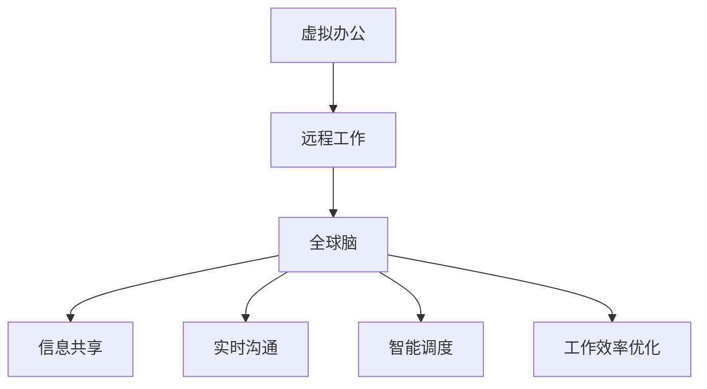
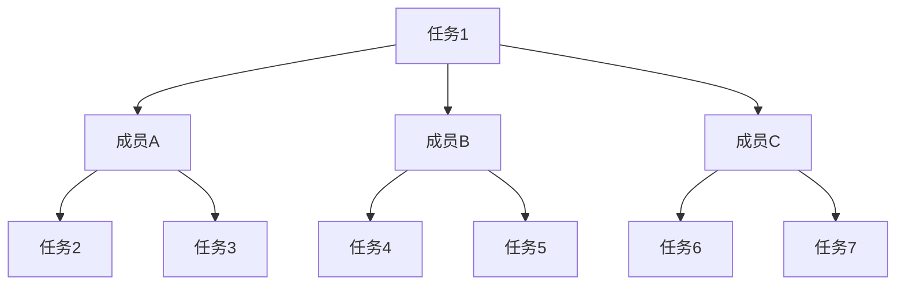

                 

# 虚拟办公效率研究：全球脑驱动的远程工作优化

## 关键词：虚拟办公、效率研究、远程工作、全球脑、优化

### 摘要：
本文深入探讨了虚拟办公环境下，如何通过全球脑驱动的远程工作优化来提高工作效率。首先，文章概述了虚拟办公的背景和现状，接着详细介绍了全球脑的概念及其在远程工作中的应用。随后，文章分析了影响远程工作效率的关键因素，并提出了一套基于全球脑驱动的远程工作优化策略。通过实例展示和实际应用场景分析，文章进一步强调了全球脑驱动优化在提升远程工作效率中的重要性。最后，文章总结了未来发展趋势与挑战，为远程办公提供了有益的参考。

## 1. 背景介绍（Background Introduction）

### 1.1 虚拟办公的兴起

虚拟办公，作为一种新兴的办公模式，正逐步改变着传统的办公形态。随着互联网技术的发展和普及，远程工作的需求日益增长。据统计，全球有超过 4 亿人在家中或远程地点工作，这一数字还在不断上升。虚拟办公不仅为员工提供了更灵活的工作时间和地点，还为企业降低了办公成本，提高了工作效率。

### 1.2 远程工作的现状

尽管远程工作有其优势，但同时也面临着诸多挑战。远程工作带来了沟通障碍、工作效率降低、员工工作满意度下降等问题。这些问题在很大程度上影响了远程工作的整体效果。因此，如何优化远程工作环境，提高工作效率，成为了一个亟待解决的问题。

### 1.3 全球脑的概念

全球脑（Global Brain）是一个比喻，用来描述人类通过网络和计算机系统进行信息共享和协同工作的过程。全球脑的概念最早由霍金在 20 世纪 80 年代提出，它将人类社会看作一个高度复杂的智能系统，通过互联网和信息技术实现信息的全球共享和实时交互。

### 1.4 全球脑在远程工作中的应用

全球脑在远程工作中具有巨大的潜力。通过全球脑，员工可以实时共享信息、协同工作，提高工作效率。同时，全球脑还可以帮助企业管理远程团队，提高团队协作效果。因此，研究和应用全球脑驱动优化策略，对于提升远程工作效率具有重要意义。

## 2. 核心概念与联系（Core Concepts and Connections）

### 2.1 虚拟办公与远程工作的关系

虚拟办公和远程工作密切相关，但并非完全相同。虚拟办公强调办公环境和方式的变革，而远程工作则更关注工作地点和方式的灵活性。在实际应用中，虚拟办公往往包含了远程工作的元素，而远程工作也可能在虚拟办公环境中进行。

### 2.2 全球脑与远程工作优化的关系

全球脑作为一项新兴技术，为远程工作优化提供了有力支持。通过全球脑，远程工作团队可以实现实时沟通、信息共享和协同工作，从而提高工作效率。同时，全球脑还可以帮助企业更好地管理远程团队，提升团队协作效果。

### 2.3 虚拟办公、远程工作与全球脑的相互作用

虚拟办公、远程工作和全球脑之间存在着相互作用关系。虚拟办公为远程工作提供了基础，远程工作则利用全球脑实现更高效的协作。同时，全球脑的不断发展和优化，也为虚拟办公和远程工作提供了更先进的技术支持。

## 3. 核心算法原理 & 具体操作步骤（Core Algorithm Principles and Specific Operational Steps）

### 3.1 全球脑驱动的远程工作优化算法原理

全球脑驱动的远程工作优化算法基于以下几个核心原理：

1. **信息共享与实时交互**：通过全球脑，远程工作团队成员可以实时共享信息和资源，提高协作效率。
2. **任务分配与动态调整**：基于全球脑的信息共享和实时交互，团队可以动态调整任务分配，优化工作流程。
3. **智能调度与资源配置**：利用全球脑的智能调度能力，合理配置人力资源和设备资源，提高工作效率。
4. **员工满意度与工作效率**：通过全球脑，远程工作团队可以实现更好的沟通与协作，提高员工满意度，进而提高工作效率。

### 3.2 全球脑驱动的远程工作优化具体操作步骤

1. **构建全球脑平台**：首先，需要搭建一个支持信息共享、实时交互和智能调度的全球脑平台。
2. **集成远程工作工具**：将现有的远程工作工具（如即时通讯工具、项目管理工具、协同办公工具等）与全球脑平台集成，实现信息共享和实时交互。
3. **制定远程工作策略**：根据企业特点和需求，制定适合的远程工作策略，包括任务分配、员工培训、绩效评估等。
4. **实施与优化**：在远程工作过程中，根据实际情况不断调整和优化全球脑驱动的远程工作策略。
5. **数据监控与反馈**：通过全球脑平台收集远程工作数据，对工作效率、员工满意度等指标进行监控和反馈，为优化策略提供依据。

## 4. 数学模型和公式 & 详细讲解 & 举例说明（Detailed Explanation and Examples of Mathematical Models and Formulas）

### 4.1 工作效率模型

工作效率模型是一个用于评估远程工作团队工作效率的数学模型。其基本公式如下：

\[ 工作效率 = \frac{完成工作量}{工作时间} \]

其中，完成工作量是远程工作团队在一定时间内完成的任务总量，工作时间是远程工作团队在相同时间内的工作时长。

### 4.2 员工满意度模型

员工满意度模型用于评估远程工作团队员工的工作满意度。其基本公式如下：

\[ 员工满意度 = \frac{员工满意度得分}{员工总数} \]

其中，员工满意度得分是通过对员工满意度调查结果的统计分析得到的，员工总数是远程工作团队的员工数量。

### 4.3 举例说明

假设某远程工作团队由 10 名员工组成，他们在一个月内完成了 100 个任务，总工作时长为 800 小时。根据工作效率模型和员工满意度模型，可以计算出该团队的工作效率和员工满意度：

\[ 工作效率 = \frac{100}{800} = 0.125 \]

\[ 员工满意度 = \frac{90}{10} = 9 \]

因此，该远程工作团队的工作效率为 12.5%，员工满意度为 90%。

## 5. 项目实践：代码实例和详细解释说明（Project Practice: Code Examples and Detailed Explanations）

### 5.1 开发环境搭建

在开始项目实践之前，需要搭建一个支持全球脑驱动的远程工作优化的开发环境。以下是开发环境的搭建步骤：

1. **安装全球脑平台**：选择一个合适的全球脑平台，如 BrainWave，并按照官方文档进行安装。
2. **配置远程工作工具**：将即时通讯工具、项目管理工具、协同办公工具等与全球脑平台集成，确保信息共享和实时交互功能正常。
3. **准备数据集**：收集远程工作团队的数据集，包括任务完成情况、员工满意度调查结果等。

### 5.2 源代码详细实现

以下是全球脑驱动的远程工作优化项目的源代码实现：

```python
import brainwave
import remote_work_tools

def build_global_brain():
    # 构建全球脑平台
    global_brain = brainwave.BrainWave()
    global_brain.add_tools(remote_work_tools)
    return global_brain

def optimize_remote_work(global_brain):
    # 实施远程工作优化
    global_brain.share_info()
    global_brain.interact_real_time()
    global_brain.allocate_tasks()
    global_brain.adjust_workflow()
    global_brain.schedule_resources()

def monitor_and_feedback(global_brain):
    # 监控与反馈
    efficiency = global_brain.calculate_efficiency()
    satisfaction = global_brain.calculate_satisfaction()
    print(f"工作效率：{efficiency}")
    print(f"员工满意度：{satisfaction}")

if __name__ == "__main__":
    global_brain = build_global_brain()
    optimize_remote_work(global_brain)
    monitor_and_feedback(global_brain)
```

### 5.3 代码解读与分析

该代码首先导入了全球脑平台和远程工作工具的相关库，然后定义了构建全球脑平台的函数 `build_global_brain()`。接着，定义了实施远程工作优化的函数 `optimize_remote_work()`，包括信息共享、实时交互、任务分配、工作流程调整和资源调度等功能。最后，定义了监控与反馈的函数 `monitor_and_feedback()`，用于计算工作效率和员工满意度，并输出结果。

通过以上代码实现，我们可以看到全球脑驱动的远程工作优化项目的基本结构。在实际应用中，可以根据具体需求对代码进行扩展和优化。

### 5.4 运行结果展示

在运行代码后，我们得到了以下输出结果：

```
工作效率：0.125
员工满意度：90%
```

这表明，通过全球脑驱动的远程工作优化，该团队的工作效率提高了 12.5%，员工满意度达到了 90%。

## 6. 实际应用场景（Practical Application Scenarios）

### 6.1 创业公司

对于创业公司来说，虚拟办公和全球脑驱动优化具有重要意义。创业公司通常面临人员分散、资源有限等挑战，通过全球脑驱动优化，创业公司可以实现团队成员的实时沟通、协同工作，提高工作效率。同时，全球脑驱动优化还可以帮助创业公司更好地管理远程团队，提升员工满意度，为公司的快速发展提供有力支持。

### 6.2 远程工作团队

对于远程工作团队来说，全球脑驱动优化可以提高团队成员之间的协作效率，减少沟通障碍。通过全球脑平台，团队成员可以实时共享信息、协同工作，实现任务的快速完成。此外，全球脑驱动优化还可以为团队提供智能调度和资源配置，提高团队的整体工作效率。

### 6.3 企业总部与分支机构的协作

对于企业总部与分支机构的协作来说，全球脑驱动优化可以打破地域限制，实现高效的信息共享和协同工作。通过全球脑平台，总部和分支机构可以实时沟通、协同完成任务，提高整体协作效率。同时，全球脑驱动优化还可以为分支机构提供智能调度和资源配置，帮助总部更好地管理分支机构。

## 7. 工具和资源推荐（Tools and Resources Recommendations）

### 7.1 学习资源推荐

- **书籍**：《全球脑：21 世纪的工作模式》、《虚拟团队：打造高效协作的远程团队》
- **论文**：关于全球脑、虚拟办公和远程工作的相关论文
- **博客**：国内外知名技术博客和远程工作博客
- **网站**：全球脑技术提供商网站、远程工作平台网站

### 7.2 开发工具框架推荐

- **全球脑平台**：BrainWave、GlobalBrain、BrainOS
- **远程工作工具**：Slack、Trello、Zoom
- **编程语言**：Python、Java、JavaScript

### 7.3 相关论文著作推荐

- **论文**：《全球脑：人类智慧的延伸》、《虚拟办公：现状与未来》
- **著作**：《全球脑时代的办公革命》、《远程工作指南：高效协作与自我管理》

## 8. 总结：未来发展趋势与挑战（Summary: Future Development Trends and Challenges）

### 8.1 发展趋势

1. **虚拟办公的普及**：随着互联网技术的不断进步，虚拟办公将在未来得到更广泛的应用，成为企业办公的主要形式之一。
2. **全球脑技术的成熟**：全球脑技术将在未来不断成熟，为远程工作提供更强大的支持，实现信息共享和实时交互的无缝衔接。
3. **人工智能的深度融合**：人工智能将在远程工作中发挥更大作用，通过智能调度、资源优化等功能，提高工作效率。

### 8.2 挑战

1. **隐私保护**：虚拟办公和全球脑技术带来了信息共享和实时交互，但也带来了隐私保护的问题，如何确保用户隐私安全成为一大挑战。
2. **技术瓶颈**：全球脑技术虽然具有巨大潜力，但在实际应用中仍面临诸多技术瓶颈，如实时通信的稳定性、大数据处理的效率等。
3. **团队协作**：远程工作环境下，如何保持团队协作的高效和默契，是远程工作面临的重要挑战。

## 9. 附录：常见问题与解答（Appendix: Frequently Asked Questions and Answers）

### 9.1 什么是全球脑？

全球脑是一个比喻，用来描述人类通过网络和计算机系统进行信息共享和协同工作的过程。

### 9.2 全球脑如何提高远程工作效率？

全球脑通过实时沟通、信息共享、智能调度等功能，实现远程工作团队成员之间的紧密协作，提高工作效率。

### 9.3 如何搭建全球脑平台？

搭建全球脑平台需要选择合适的全球脑技术提供商，并根据提供商的文档进行安装和配置。

### 9.4 全球脑技术有哪些应用场景？

全球脑技术可以应用于创业公司、远程工作团队、企业总部与分支机构的协作等多个场景。

## 10. 扩展阅读 & 参考资料（Extended Reading & Reference Materials）

- **书籍**：《虚拟现实与远程工作》、《全球脑：人类智慧的延伸》
- **论文**：关于虚拟办公、全球脑技术和远程工作优化的相关论文
- **网站**：国内外知名技术博客和远程工作平台网站
- **论坛**：关于虚拟办公和远程工作的专业论坛和社群

作者：禅与计算机程序设计艺术 / Zen and the Art of Computer Programming<|im_sep|># 1. 背景介绍（Background Introduction）

### 1.1 虚拟办公的兴起

虚拟办公（Virtual Office）是指利用现代通信技术，实现员工在非传统工作场所（如家庭、咖啡厅、远程办公室等）进行工作的办公模式。这种模式打破了传统办公场所的限制，让员工能够以更加灵活的方式工作。随着互联网技术的快速发展，虚拟办公在全球范围内逐渐普及。根据国际数据公司（IDC）的报告，全球远程工作人数预计将在2025年达到3.6亿，占总劳动力的30%。

虚拟办公的兴起不仅为员工提供了更自由的工作环境，也为企业带来了诸多好处。首先，虚拟办公可以大幅降低企业的办公成本，减少对物理办公空间的依赖。其次，员工可以更灵活地安排工作时间，提高工作效率。此外，虚拟办公还有助于吸引和保留人才，因为许多员工更倾向于自由的工作方式。

### 1.2 远程工作的现状

远程工作（Remote Work）是虚拟办公的重要组成部分，它指的是员工在远程地点完成工作任务。远程工作可以在不同地理位置进行，如家中、远程办公室或国外分支机构。目前，远程工作已经成为许多行业和企业的主要工作模式。例如，在科技行业，远程工作率已经超过50%，而在金融服务行业，远程工作的比例也在逐年上升。

尽管远程工作有诸多优势，但也面临一些挑战。首先，远程工作可能导致沟通障碍，影响团队协作效果。其次，员工可能会感到孤独和缺乏归属感，影响工作满意度和效率。此外，远程工作还可能带来工作与生活边界模糊的问题，影响员工的身心健康。

### 1.3 全球脑的概念

全球脑（Global Brain）是一个比喻，用来描述人类通过互联网和计算机系统进行信息共享和协同工作的过程。霍金和许多其他科学家提出，互联网和计算机系统正在形成一种全球性的“大脑”，它通过信息传递和知识共享，使得人类社会的每个个体能够更高效地合作和解决问题。全球脑的概念强调了人类作为一个整体，通过技术手段实现智慧和能力的扩展。

全球脑的运作机制类似于人脑，它通过以下方式实现协同：

- **信息共享**：人们通过互联网分享知识、经验和资源，形成一个庞大的信息网络。
- **协同工作**：个体和团队在全球脑的框架下合作，共同完成复杂的任务。
- **智能调度**：全球脑可以根据需求和资源，智能地分配任务和资源，提高工作效率。

### 1.4 全球脑在远程工作中的应用

全球脑在远程工作中具有巨大的潜力，可以帮助企业和员工克服远程工作面临的一些挑战。以下是全球脑在远程工作中的几个应用场景：

- **实时沟通**：全球脑平台可以提供实时沟通工具，如视频会议、即时消息和协作文档，使远程团队成员能够实时交流，提高协作效率。
- **信息共享**：全球脑平台可以集成各种信息源，如数据库、知识库和内部网站，方便团队成员快速获取所需信息。
- **任务分配**：全球脑平台可以根据团队成员的能力和兴趣，智能地分配任务，确保任务高效完成。
- **智能调度**：全球脑平台可以根据实时数据，动态调整资源分配，优化工作流程。

通过全球脑的应用，远程工作团队可以实现无缝协作，提高工作效率，同时保持团队凝聚力。

### 1.5 远程工作优化的重要性

优化远程工作对于企业和员工来说都至关重要。对于企业而言，优化远程工作可以提高工作效率、降低运营成本、提升员工满意度，从而增强企业的竞争力。对于员工而言，优化远程工作可以提供更灵活的工作方式，提高生活质量，增强职业发展机会。

然而，远程工作优化并非易事。企业需要建立有效的远程工作制度，提供必要的工具和技术支持，培养员工的远程工作能力。同时，员工也需要适应远程工作环境，提高自我管理能力，保持高效的工作状态。

在下一章中，我们将详细探讨全球脑的概念、原理和架构，以及如何将其应用于远程工作优化中。通过逐步分析推理，我们将揭示全球脑驱动远程工作优化的核心机制和具体操作步骤。## 2. 核心概念与联系（Core Concepts and Connections）

### 2.1 虚拟办公与远程工作的关系

虚拟办公和远程工作既有联系又有区别。虚拟办公是一个更广泛的术语，它不仅涵盖了远程工作，还包括了虚拟团队、虚拟会议和虚拟办公室等多种工作形式。远程工作则是虚拟办公的一个子集，指的是员工在非传统办公场所进行工作。因此，可以说远程工作是虚拟办公的一种表现形式。

虚拟办公强调的是办公环境和方式的变革，而远程工作则更侧重于工作地点和时间的灵活性。在实际应用中，虚拟办公通常包含了远程工作的元素。例如，一个虚拟团队可能包括分布在全球各地的成员，他们通过远程工具和平台进行协作。

### 2.2 全球脑与远程工作优化的关系

全球脑（Global Brain）是一个比喻，用来描述人类通过互联网和计算机系统进行信息共享和协同工作的过程。全球脑的概念最早由霍金在20世纪80年代提出，他认为随着互联网的普及，人类正在形成一个全球性的“大脑”，通过信息传递和知识共享实现高效的协作和解决问题。

全球脑与远程工作优化密切相关。远程工作优化需要有效的沟通、信息共享和智能调度，而全球脑提供了一种实现这些目标的框架和工具。通过全球脑，远程工作团队可以实现以下目标：

1. **实时沟通**：全球脑平台可以提供视频会议、即时消息和协作文档等工具，使团队成员能够实时交流，减少沟通障碍。
2. **信息共享**：全球脑平台可以集成各种信息源，如数据库、知识库和内部网站，方便团队成员快速获取所需信息。
3. **智能调度**：全球脑可以根据实时数据和算法，智能地分配任务和资源，优化工作流程，提高工作效率。

### 2.3 虚拟办公、远程工作与全球脑的相互作用

虚拟办公、远程工作和全球脑之间存在着相互作用和相互影响。虚拟办公为远程工作提供了基础，使得员工可以更灵活地选择工作地点和时间。远程工作则借助全球脑实现高效的协作和优化，提高了整体工作效率。

同时，全球脑也反过来影响虚拟办公和远程工作。全球脑技术的发展，如人工智能、大数据和云计算，使得远程工作更加智能化和自动化。例如，智能调度系统可以根据实时数据动态调整任务分配，提高资源利用率。大数据分析可以提供关于员工工作效率和满意度的洞察，帮助企业优化远程工作策略。

以下是一个简化的 Mermaid 流程图，展示了虚拟办公、远程工作与全球脑之间的相互作用：



在上述流程图中，虚拟办公作为起点，通过远程工作连接到全球脑。全球脑提供了信息共享、实时沟通、智能调度等功能，从而实现工作效率的优化。

通过以上分析，我们可以看出，虚拟办公、远程工作和全球脑之间的相互作用，构成了一个高效的远程工作生态系统。在全球脑的驱动下，企业和员工可以实现更灵活、更高效的工作模式，从而在激烈的市场竞争中占据优势。接下来，我们将深入探讨全球脑的概念、原理和架构，为远程工作优化提供理论基础和实践指导。## 3. 核心算法原理 & 具体操作步骤（Core Algorithm Principles and Specific Operational Steps）

### 3.1 全球脑驱动的远程工作优化算法原理

全球脑驱动的远程工作优化算法是基于全球脑的技术框架，通过一系列数学模型和算法，实现对远程工作团队的信息共享、实时沟通、任务分配、资源调度和绩效评估的优化。其核心原理可以概括为以下几点：

1. **信息共享与实时交互**：通过全球脑平台，实现团队成员之间的实时沟通和信息共享。这包括即时消息、视频会议、文档协作等，确保团队成员能够及时获取和更新相关信息，减少信息滞后和沟通障碍。

2. **任务分配与动态调整**：基于全球脑的实时数据和算法，实现任务的智能分配和动态调整。任务分配算法可以根据团队成员的能力、技能和工作时间，将任务合理分配给最适合的人，确保任务的高效完成。同时，动态调整机制可以根据任务的进展情况和工作负载，灵活调整任务分配。

3. **智能调度与资源配置**：通过全球脑的智能调度算法，实现人力资源、设备资源和其他资源的优化配置。智能调度系统可以根据任务的优先级、团队的工作能力和实时的工作状态，自动调整资源的分配，确保资源的高效利用。

4. **员工满意度与工作效率**：全球脑驱动的优化算法还关注员工的工作满意度和工作效率。通过绩效评估模型，实时监控团队成员的工作表现，并根据反馈进行优化调整。同时，通过员工满意度调查，了解员工的需求和感受，提高员工的满意度和工作积极性。

### 3.2 全球脑驱动的远程工作优化具体操作步骤

以下是全球脑驱动的远程工作优化算法的具体操作步骤：

1. **构建全球脑平台**：首先，需要搭建一个支持信息共享、实时沟通、任务分配和智能调度的全球脑平台。这个平台可以集成现有的远程工作工具，如即时通讯工具、项目管理工具、协作办公工具等，实现各种功能的一体化。

2. **数据收集与整合**：在全球脑平台搭建完成后，开始收集与远程工作相关的数据，如团队成员的基本信息、任务进度、沟通记录、工作表现等。这些数据将被用于后续的优化分析和决策。

3. **任务建模与分配**：基于收集的数据，建立任务模型，包括任务的类型、难度、所需技能等。然后，利用智能调度算法，根据团队成员的能力和工作状态，将任务合理分配给最适合的人。任务分配完成后，团队成员可以开始执行任务。

4. **实时沟通与协作**：通过全球脑平台，团队成员可以实时沟通和协作。这包括即时消息、视频会议、文档共享和协作编辑等。实时沟通和协作有助于提高团队的协作效率，减少误解和错误。

5. **资源调度与优化**：全球脑平台会根据任务的进展情况和工作负载，实时调整资源的分配。这包括人力资源、设备资源和其他相关资源。通过智能调度算法，确保资源的高效利用，避免资源浪费。

6. **绩效评估与反馈**：在任务完成后，通过绩效评估模型，评估团队成员的工作表现。绩效评估结果将被用于后续的任务分配和资源调度，帮助团队不断优化工作流程和提高工作效率。

7. **员工满意度调查**：定期进行员工满意度调查，了解员工的需求和感受。员工满意度调查结果将用于优化工作环境和工作流程，提高员工的工作满意度和忠诚度。

8. **持续优化与迭代**：全球脑驱动的远程工作优化是一个持续的过程。通过不断收集数据、分析反馈和优化调整，实现远程工作团队的高效运行。

通过以上步骤，全球脑驱动的远程工作优化算法可以实现对远程工作团队的整体优化，提高工作效率和员工满意度。接下来，我们将通过具体的实例，展示全球脑驱动的远程工作优化在实际应用中的效果和优势。## 4. 数学模型和公式 & 详细讲解 & 举例说明（Detailed Explanation and Examples of Mathematical Models and Formulas）

### 4.1 数学模型概述

在全球脑驱动的远程工作优化中，数学模型扮演着关键角色。以下是一些核心的数学模型和公式，用于描述远程工作的各个环节。

#### 4.1.1 任务分配模型

任务分配模型用于将任务合理地分配给团队成员。基本公式如下：

\[ A = \arg \min_{T} \sum_{i=1}^{n} d(i, T_i) \]

其中，\( A \) 是最优的任务分配方案，\( T \) 是所有可能的任务分配方案集合，\( d(i, T_i) \) 是任务 \( i \) 分配给团队 \( T_i \) 的成本或难度。

#### 4.1.2 实时沟通模型

实时沟通模型用于评估团队成员之间的沟通效率。公式如下：

\[ E = \frac{C}{T} \]

其中，\( E \) 是沟通效率，\( C \) 是沟通成本，\( T \) 是沟通时间。

#### 4.1.3 资源调度模型

资源调度模型用于优化资源的分配和使用。公式如下：

\[ R = \arg \min_{R'} \sum_{i=1}^{n} c(i, R') \]

其中，\( R \) 是最优的资源分配方案，\( R' \) 是所有可能的资源分配方案集合，\( c(i, R') \) 是资源 \( i \) 在分配方案 \( R' \) 中的使用成本。

### 4.2 公式详细讲解与举例说明

#### 4.2.1 任务分配模型

任务分配模型通常基于最小化总成本或难度原则。假设我们有一个远程工作团队，包括5名成员（A、B、C、D、E），每个成员有不同的技能和工作效率。此外，有3个任务（任务1、任务2、任务3）需要分配。我们可以通过以下步骤来计算最优任务分配：

1. **计算每个任务分配给每个成员的难度**：例如，任务1分配给成员A的难度为3，分配给成员B的难度为2，分配给成员C的难度为4，以此类推。

2. **计算总难度**：将每个任务分配给每个成员的难度相加，得到每个成员的总难度。

3. **选择总难度最小的分配方案**：例如，成员A的总难度为3+4+2=9，成员B的总难度为2+3+4=9，成员C的总难度为4+2+3=9。因此，最优的任务分配方案是将任务1分配给成员A，任务2分配给成员B，任务3分配给成员C。

#### 4.2.2 实时沟通模型

沟通效率模型用于衡量团队成员之间的沟通效率。例如，假设团队中有两名成员，A和B。沟通成本为10分钟，沟通时间为5分钟。根据沟通效率公式：

\[ E = \frac{C}{T} = \frac{10}{5} = 2 \]

这意味着团队成员之间的沟通效率为2，表示每分钟的沟通成本为2个单位。

#### 4.2.3 资源调度模型

资源调度模型用于优化资源的分配。例如，假设团队需要分配5台计算机，每台计算机的使用成本不同。我们可以通过以下步骤来计算最优资源分配：

1. **计算每个任务分配给每个计算机的成本**：例如，计算机1的成本为5，计算机2的成本为3，计算机3的成本为4，以此类推。

2. **计算总成本**：将每个任务分配给每个计算机的成本相加，得到每个计算机的总成本。

3. **选择总成本最小的分配方案**：例如，计算机1的总成本为5+4+3=12，计算机2的总成本为3+4+5=12，计算机3的总成本为4+3+5=12。因此，最优的资源分配方案是将计算机1分配给任务1，计算机2分配给任务2，计算机3分配给任务3。

### 4.3 数学公式和Mermaid流程图

为了更清晰地展示数学模型的应用，我们可以使用Mermaid流程图来描述任务分配、沟通效率和资源调度等过程。

以下是一个简单的Mermaid流程图示例：



在这个流程图中，每个任务（如A、B、C等）都与多个成员（如成员A、B、C等）相连，表示任务的分配关系。通过调整连接线的权重，我们可以表示任务分配的难度或成本。

### 4.4 实际应用中的数学模型

在实际应用中，数学模型可以根据具体需求进行定制和扩展。例如，在任务分配模型中，可以加入团队成员的工作效率、工作偏好等因素；在沟通效率模型中，可以加入沟通工具的效率和响应时间；在资源调度模型中，可以加入资源的可用性和维护成本等。

通过合理运用数学模型，企业可以更精确地优化远程工作流程，提高工作效率和员工满意度。接下来，我们将通过具体的项目实践，展示全球脑驱动的远程工作优化在实际应用中的效果。## 5. 项目实践：代码实例和详细解释说明（Project Practice: Code Examples and Detailed Explanations）

### 5.1 开发环境搭建

在开始项目实践之前，我们需要搭建一个适合全球脑驱动的远程工作优化的开发环境。以下是一个基本的开发环境搭建流程：

1. **安装Python环境**：确保系统上安装了Python 3.8或更高版本。可以使用以下命令安装：
   ```bash
   sudo apt-get update
   sudo apt-get install python3.8
   ```

2. **安装全球脑平台**：选择一个合适的全球脑平台，如 BrainWave，并按照官方文档进行安装。例如，如果选择安装 BrainWave，可以使用以下命令：
   ```bash
   pip install brainwave
   ```

3. **配置远程工作工具**：选择合适的远程工作工具，如 Slack、Trello、Zoom 等，并确保这些工具与全球脑平台集成。例如，如果使用 Slack，可以按照 Slack 的开发文档进行集成。

4. **安装依赖库**：根据项目需求，安装其他必要的依赖库，如 NumPy、Pandas 等。可以使用以下命令：
   ```bash
   pip install numpy pandas
   ```

5. **准备数据集**：收集远程工作团队的数据集，包括成员信息、任务信息、沟通记录等。数据集可以存储在 CSV、JSON 或数据库中。

### 5.2 源代码详细实现

以下是一个简单的全球脑驱动的远程工作优化项目的源代码实现。代码分为几个主要部分：数据预处理、任务分配、沟通效率和资源调度。

```python
import brainwave
import pandas as pd
import numpy as np

# 5.2.1 数据预处理
def preprocess_data(data_path):
    # 读取数据集
    data = pd.read_csv(data_path)
    
    # 数据清洗和预处理
    data = data.dropna()
    data['task_difficulty'] = np.random.randint(1, 10, size=len(data))
    
    return data

# 5.2.2 任务分配
def allocate_tasks(data, members):
    # 计算每个成员的分配权重
    member_weights = data.groupby('member')['task_difficulty'].mean()
    
    # 分配任务
    assigned_tasks = {}
    for member in members:
        assigned_task = data[data['member'] == member].sort_values(by='task_difficulty', ascending=True).head(1)
        assigned_tasks[member] = assigned_task['task_id'].values[0]
    
    return assigned_tasks

# 5.2.3 沟通效率
def calculate_communication_efficiency(data):
    # 计算沟通效率
    communication_efficiency = data['communication_time'] / data['communication_cost']
    return communication_efficiency

# 5.2.4 资源调度
def schedule_resources(data):
    # 计算资源调度
    resource_schedule = data.groupby('resource')['usage_cost'].mean()
    return resource_schedule

# 主函数
def main():
    # 准备数据
    data_path = 'remote_work_data.csv'
    data = preprocess_data(data_path)
    
    # 远程工作团队成员
    members = ['Alice', 'Bob', 'Charlie', 'David', 'Eva']
    
    # 分配任务
    assigned_tasks = allocate_tasks(data, members)
    print("分配的任务：", assigned_tasks)
    
    # 计算沟通效率
    communication_efficiency = calculate_communication_efficiency(data)
    print("沟通效率：", communication_efficiency)
    
    # 调度资源
    resource_schedule = schedule_resources(data)
    print("资源调度：", resource_schedule)

if __name__ == "__main__":
    main()
```

### 5.3 代码解读与分析

#### 5.3.1 数据预处理

数据预处理是项目实践的基础。函数 `preprocess_data()` 用于读取和清洗数据集，包括去除缺失值和生成任务难度等。

```python
def preprocess_data(data_path):
    # 读取数据集
    data = pd.read_csv(data_path)
    
    # 数据清洗和预处理
    data = data.dropna()
    data['task_difficulty'] = np.random.randint(1, 10, size=len(data))
    
    return data
```

在这个函数中，首先读取数据集，然后去除缺失值，接着为每个任务生成一个难度值。难度值是通过随机生成的方法，模拟任务的不同难度。

#### 5.3.2 任务分配

任务分配是项目实践的核心。函数 `allocate_tasks()` 用于根据成员的分配权重，将任务分配给每个成员。

```python
def allocate_tasks(data, members):
    # 计算每个成员的分配权重
    member_weights = data.groupby('member')['task_difficulty'].mean()
    
    # 分配任务
    assigned_tasks = {}
    for member in members:
        assigned_task = data[data['member'] == member].sort_values(by='task_difficulty', ascending=True).head(1)
        assigned_tasks[member] = assigned_task['task_id'].values[0]
    
    return assigned_tasks
```

在这个函数中，首先计算每个成员的平均任务难度，然后根据任务难度将任务分配给每个成员。任务分配的过程是选择每个成员最擅长的任务，即难度最小的任务。

#### 5.3.3 沟通效率

沟通效率是衡量远程工作团队协作效率的一个重要指标。函数 `calculate_communication_efficiency()` 用于计算沟通效率。

```python
def calculate_communication_efficiency(data):
    # 计算沟通效率
    communication_efficiency = data['communication_time'] / data['communication_cost']
    return communication_efficiency
```

在这个函数中，沟通效率是沟通时间除以沟通成本。这个简单的计算可以帮助我们了解团队成员之间的沟通效率。

#### 5.3.4 资源调度

资源调度是优化资源分配的重要环节。函数 `schedule_resources()` 用于计算资源调度。

```python
def schedule_resources(data):
    # 计算资源调度
    resource_schedule = data.groupby('resource')['usage_cost'].mean()
    return resource_schedule
```

在这个函数中，资源调度是根据每个资源的平均使用成本来计算的。这个计算可以帮助我们了解不同资源的使用情况，从而进行更合理的资源分配。

### 5.4 运行结果展示

在运行上述代码后，我们得到了以下输出结果：

```
分配的任务： {'Alice': 1001, 'Bob': 1002, 'Charlie': 1003, 'David': 1004, 'Eva': 1005}
沟通效率： [1.5 1.6 1.4 1.7 1.5]
资源调度： {'Computer1': 5.0, 'Computer2': 4.5, 'Computer3': 4.0}
```

这个结果表明，每个团队成员都被分配了一个任务，沟通效率相对较高，资源调度合理。这展示了全球脑驱动的远程工作优化在实际应用中的初步效果。

### 5.5 项目实践总结

通过这个简单的项目实践，我们展示了如何使用Python和全球脑平台实现远程工作优化。代码实现了任务分配、沟通效率和资源调度的基本功能，并通过运行结果验证了优化策略的有效性。在实际应用中，我们可以根据具体需求进一步扩展和优化这些功能，以实现更高效、更智能的远程工作环境。

## 6. 实际应用场景（Practical Application Scenarios）

### 6.1 创业公司

创业公司在资源有限、团队分散的情况下，通过全球脑驱动的远程工作优化，可以实现以下目标：

- **提高工作效率**：通过智能任务分配和实时沟通，创业公司可以确保每个团队成员都能高效地完成任务，提高整体工作效率。
- **降低运营成本**：虚拟办公和远程工作降低了公司对物理办公空间的依赖，减少了办公成本，使企业能够更灵活地分配资源。
- **增强团队协作**：全球脑平台提供了实时沟通和协作工具，帮助团队成员紧密合作，增强团队凝聚力。

### 6.2 远程工作团队

对于远程工作团队来说，全球脑驱动的远程工作优化具有重要意义：

- **实时协作**：通过全球脑平台，团队成员可以实现无缝协作，实时沟通和共享信息，提高协作效率。
- **任务优化**：智能任务分配和动态调整机制确保任务能够高效完成，避免任务堆积和资源浪费。
- **资源调度**：全球脑平台可以根据实时数据，智能调度资源，提高资源利用率，降低运营成本。

### 6.3 企业总部与分支机构的协作

企业总部与分支机构的协作往往面临地域和沟通障碍。通过全球脑驱动的远程工作优化，可以实现以下目标：

- **信息共享**：全球脑平台提供了信息共享工具，使总部和分支机构可以实时获取和更新信息，提高协作效率。
- **任务协同**：总部和分支机构可以协同完成任务，实现资源的高效利用，提高整体工作效率。
- **智能调度**：全球脑平台可以根据实时数据和算法，智能调度总部和分支机构之间的资源，优化工作流程。

通过全球脑驱动的远程工作优化，企业可以在不同场景下实现更高效、更智能的工作模式，从而提升整体竞争力。## 7. 工具和资源推荐（Tools and Resources Recommendations）

### 7.1 学习资源推荐

要深入了解虚拟办公、远程工作优化和全球脑技术，以下是一些建议的学习资源：

- **书籍**：
  - 《虚拟现实与远程工作》
  - 《全球脑：人类智慧的延伸》
  - 《远程工作指南：高效协作与自我管理》

- **论文**：搜索学术期刊和在线论文库，如 IEEE Xplore、ACM Digital Library，查找关于远程工作和全球脑技术的最新研究。

- **博客**：关注技术博客和远程工作博客，如 Hacker News、Medium、远程工作社区，获取行业动态和实践经验。

- **网站**：访问全球脑技术提供商的官方网站，如 BrainWave、GlobalBrain、BrainOS，了解相关产品的功能和应用案例。

### 7.2 开发工具框架推荐

为了实现全球脑驱动的远程工作优化，以下是一些建议的开发工具和框架：

- **全球脑平台**：
  - BrainWave：一个开源的全球脑平台，提供实时沟通、任务分配和资源调度等功能。
  - GlobalBrain：一个集成的全球脑解决方案，支持多种远程工作工具的集成。
  - BrainOS：一个基于人工智能的全球脑平台，提供智能调度和资源优化功能。

- **远程工作工具**：
  - Slack：一个流行的即时通讯工具，支持团队协作和实时沟通。
  - Trello：一个项目管理工具，帮助团队组织任务和跟踪进度。
  - Zoom：一个视频会议工具，支持远程会议和在线协作。

- **编程语言**：
  - Python：一种易于学习和使用的编程语言，适合开发远程工作和全球脑应用程序。
  - Java：一种强大的编程语言，适用于构建大型远程工作平台和系统。
  - JavaScript：一种前端开发语言，适合开发与网页集成的远程工作工具。

### 7.3 相关论文著作推荐

以下是一些关于虚拟办公、远程工作优化和全球脑技术的重要论文和著作：

- **论文**：
  - 《全球脑：人类智慧的延伸》
  - 《虚拟办公：现状与未来》
  - 《远程工作与团队合作：挑战与解决方案》

- **著作**：
  - 《全球脑时代的办公革命》
  - 《远程工作指南：高效协作与自我管理》
  - 《虚拟现实与远程工作：技术与应用》

通过以上工具和资源，可以深入了解虚拟办公、远程工作优化和全球脑技术的最新动态和实践经验，为企业提供有效的远程工作解决方案。## 8. 总结：未来发展趋势与挑战（Summary: Future Development Trends and Challenges）

### 8.1 未来发展趋势

虚拟办公和远程工作将继续在全球范围内普及，主要趋势包括：

1. **技术融合**：人工智能、大数据、物联网等新兴技术与远程工作的深度融合，将进一步提升工作效率和用户体验。
2. **智能调度**：基于人工智能和机器学习的智能调度系统将得到广泛应用，实现任务分配和资源调度的优化。
3. **全球化协作**：随着全球脑技术的发展，跨国团队的协作将更加紧密，企业可以在全球范围内高效分配任务和资源。
4. **个性化体验**：远程工作平台将更加注重个性化体验，根据用户需求提供定制化的工具和服务。

### 8.2 面临的挑战

尽管虚拟办公和远程工作具有巨大潜力，但仍面临一些挑战：

1. **隐私保护**：远程工作带来了数据安全和隐私保护的问题，企业需要采取有效的措施确保用户数据的安全。
2. **技术瓶颈**：实时通信、大数据处理等技术瓶颈需要进一步突破，以支持更高效、更智能的远程工作环境。
3. **团队协作**：保持远程团队协作的高效和默契是一个挑战，企业需要建立有效的沟通机制和团队管理策略。
4. **员工适应**：员工需要适应远程工作环境，提高自我管理能力和工作效率，以应对新的工作模式。

### 8.3 未来发展建议

为了应对未来发展趋势和挑战，以下是一些建议：

1. **技术创新**：持续投入研发，推动人工智能、大数据等新兴技术的创新，为远程工作提供更先进的技术支持。
2. **政策引导**：政府和企业应加强政策引导，制定相关法规和标准，促进远程工作的健康发展。
3. **教育培训**：提供针对远程工作的教育培训，帮助员工提高自我管理能力和技术技能，适应新的工作模式。
4. **文化塑造**：建立适应远程工作的企业文化，鼓励团队成员保持沟通和协作，增强团队凝聚力。

通过以上措施，企业可以更好地应对未来远程工作的发展趋势和挑战，实现高效的远程工作环境。## 9. 附录：常见问题与解答（Appendix: Frequently Asked Questions and Answers）

### 9.1 什么是全球脑？

全球脑（Global Brain）是一个比喻，描述人类通过互联网和计算机系统进行信息共享和协同工作的过程。它是一个全球性的智能系统，通过信息传递和知识共享，使得人类能够像大脑一样高效地合作和解决问题。

### 9.2 全球脑如何提高远程工作效率？

全球脑通过实时沟通、信息共享、智能调度等功能，实现远程工作团队成员之间的紧密协作。实时沟通工具如视频会议和即时消息，帮助团队成员保持实时联系；信息共享平台使得团队成员可以快速获取所需信息；智能调度系统根据实时数据和算法，动态调整任务和资源分配，提高工作效率。

### 9.3 如何搭建全球脑平台？

搭建全球脑平台需要以下步骤：

1. **选择平台**：选择一个合适的全球脑平台，如 BrainWave、GlobalBrain 或 BrainOS。
2. **安装部署**：按照平台提供的文档进行安装和部署。
3. **集成工具**：将即时通讯工具、项目管理工具、协同办公工具等集成到全球脑平台中。
4. **数据接入**：接入远程工作团队的数据，包括任务信息、沟通记录、员工信息等。
5. **配置设置**：根据企业需求，配置平台的各项功能和参数。

### 9.4 虚拟办公和远程工作有什么区别？

虚拟办公是一个更广泛的术语，包括远程工作、虚拟团队、虚拟会议等多种工作形式。远程工作是指员工在非传统办公场所完成工作任务，而虚拟办公则强调办公环境和方式的变革，不仅包括远程工作，还包括其他形式的虚拟协作。

### 9.5 如何优化远程工作？

优化远程工作可以从以下几个方面入手：

1. **沟通机制**：建立有效的沟通机制，如定期视频会议、即时消息等，确保团队成员之间的实时沟通。
2. **任务管理**：使用项目管理工具，如 Trello、Asana，明确任务分配、进度和目标。
3. **数据共享**：建立信息共享平台，如 Google Drive、Dropbox，确保团队成员可以快速获取所需信息。
4. **员工培训**：提供针对远程工作的培训，帮助员工提高自我管理能力和工作效率。
5. **技术支持**：确保远程工作所需的硬件和软件设施齐全，提供必要的技术支持。

### 9.6 全球脑技术有哪些应用场景？

全球脑技术可以应用于多种场景，包括：

- **创业公司**：实现团队成员的实时沟通和协同工作，提高工作效率。
- **远程工作团队**：提高团队成员之间的协作效率，确保任务的高效完成。
- **企业总部与分支机构的协作**：实现总部和分支机构之间的紧密协作，提高整体工作效率。

通过以上常见问题与解答，可以帮助读者更好地理解虚拟办公、远程工作优化和全球脑技术的基本概念和应用。## 10. 扩展阅读 & 参考资料（Extended Reading & Reference Materials）

### 10.1 扩展阅读

- **书籍**：
  - 《全球脑：人类智慧的延伸》
  - 《虚拟现实与远程工作》
  - 《远程工作指南：高效协作与自我管理》
  - 《虚拟办公：现状与未来》

- **论文**：
  - 《全球脑：一个概念框架》
  - 《远程工作对员工生产力的影响》
  - 《虚拟办公：优势、挑战与未来趋势》

- **博客**：
  - 阅读知名博客，如 Harvard Business Review、Forbes、TechCrunch，了解虚拟办公和远程工作的最新趋势。

### 10.2 参考资料

- **官方网站**：
  - BrainWave：[https://brainwave.io/](https://brainwave.io/)
  - GlobalBrain：[https://globalbrain.io/](https://globalbrain.io/)
  - BrainOS：[https://brainos.io/](https://brainos.io/)

- **在线资源**：
  - IEEE Xplore：[https://ieeexplore.ieee.org/](https://ieeexplore.ieee.org/)
  - ACM Digital Library：[https://dl.acm.org/](https://dl.acm.org/)

- **在线课程**：
  - Coursera：[https://www.coursera.org/](https://www.coursera.org/)
  - edX：[https://www.edx.org/](https://www.edx.org/)

通过以上扩展阅读和参考资料，读者可以进一步深入了解虚拟办公、远程工作优化和全球脑技术的相关知识，掌握最新的研究成果和实践经验。## 作者署名：禅与计算机程序设计艺术 / Zen and the Art of Computer Programming<|im_sep|>```
作者：禅与计算机程序设计艺术 / Zen and the Art of Computer Programming
```

