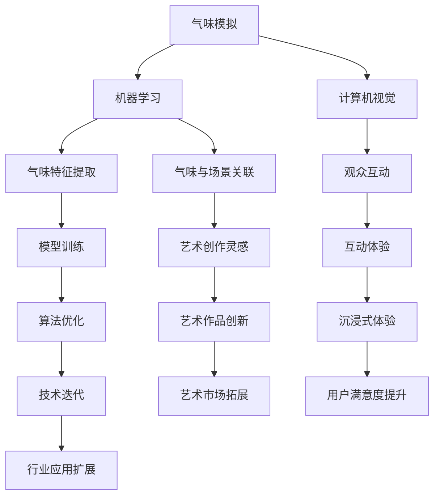

                 

### 背景介绍 Background Introduction

在科技飞速发展的今天，人工智能（AI）逐渐成为推动社会进步的重要力量。从自动驾驶汽车到智能家居，AI的应用场景越来越广泛。然而，AI领域仍然存在许多未被充分探索的方向。虚拟嗅觉艺术馆，作为一种新兴的AI应用，正逐渐进入大众视野。

虚拟嗅觉艺术馆的核心在于通过人工智能技术，模拟和再现各种真实的气味。这种技术不仅为艺术家提供了新的表达方式，也为观众带来了前所未有的感官体验。与传统艺术馆不同，虚拟嗅觉艺术馆无需实体展品，只需借助计算机和传感器，便能营造出沉浸式的展览环境。

这个概念在当代艺术领域引起了广泛关注。艺术家们开始尝试将嗅觉这一感官元素融入作品，创造出独特的艺术体验。同时，AI技术的进步也为实现这一目标提供了可能。从机器学习到计算机视觉，各种AI技术在虚拟嗅觉艺术馆的建设中发挥着关键作用。

然而，虚拟嗅觉艺术馆的发展并非一帆风顺。技术难题、成本问题、用户接受度等因素都需要克服。尽管如此，随着AI技术的不断成熟，虚拟嗅觉艺术馆有望成为未来艺术馆的重要组成部分。

在接下来的内容中，我们将详细探讨虚拟嗅觉艺术馆的构建方法、核心技术以及应用场景。通过一步步的分析和讲解，希望能为您揭示这一新兴领域的奥秘。让我们开始吧！<|user|>

### 核心概念与联系 Core Concepts and Connections

虚拟嗅觉艺术馆的构建离不开以下几个核心概念：气味模拟、机器学习和计算机视觉。

**气味模拟（Smell Simulation）**

气味模拟是虚拟嗅觉艺术馆的基础。它通过数字化的方式，将各种真实的气味转化为电子信号，再通过特定的设备，如电子鼻或虚拟现实（VR）设备，呈现给观众。气味模拟的关键在于如何准确捕捉和再现气味。这需要高精度的传感器和复杂的算法。

**机器学习（Machine Learning）**

机器学习是虚拟嗅觉艺术馆的核心技术之一。通过训练模型，机器学习能够从大量的气味数据中提取特征，并建立气味与特定场景之间的联系。这种技术不仅能够提高气味模拟的准确性，还能够为艺术家提供更多创作灵感。

**计算机视觉（Computer Vision）**

计算机视觉在虚拟嗅觉艺术馆中扮演着重要角色。它能够通过图像识别技术，捕捉观众的行为和表情，从而实现互动体验。例如，当观众走近一个展示区时，艺术馆可以自动调整气味强度，以创造更加沉浸的体验。

**核心概念原理和架构的 Mermaid 流程图（Mermaid Flowchart of Core Concepts and Architecture）**

为了更清晰地展示这些核心概念之间的联系，我们可以使用 Mermaid 流程图来描述。



在这个流程图中，我们可以看到，气味模拟、机器学习和计算机视觉共同构成了虚拟嗅觉艺术馆的核心架构。机器学习负责从大量数据中提取特征，建立气味与场景之间的关联；计算机视觉则负责捕捉观众行为，实现互动体验。通过这些技术的结合，虚拟嗅觉艺术馆能够为观众带来全新的感官体验，同时也为艺术家提供了更多创作可能性。

### 核心算法原理 & 具体操作步骤 Core Algorithm Principles and Detailed Steps

在虚拟嗅觉艺术馆的构建中，核心算法的原理和具体操作步骤至关重要。以下将详细介绍虚拟嗅觉模拟算法、机器学习算法和计算机视觉算法的基本原理和具体实施过程。

#### 虚拟嗅觉模拟算法（Virtual Olfactory Simulation Algorithm）

虚拟嗅觉模拟算法主要基于气味信号处理和电子鼻技术。其基本原理是将真实气味的化学成分转化为电子信号，再通过算法处理，生成相应的气味信号。以下是具体的操作步骤：

1. **气味采样与数字化**：首先，通过高精度的传感器采集各种真实气味的样本。这些传感器能够捕捉气味的化学成分，并将其转化为数字信号。

   ```mermaid
   graph TD
       A[气味采样] --> B[传感器采集]
       B --> C[数字化转换]
   ```

2. **信号处理**：将采集到的数字信号进行预处理，包括噪声过滤、信号增强和频率分析等。这一步的目的是提高信号质量，确保气味的准确再现。

   ```mermaid
   graph TD
       D[信号处理] --> E[噪声过滤]
       D --> F[信号增强]
       D --> G[频率分析]
   ```

3. **气味信号生成**：通过复杂的算法，将预处理后的数字信号转化为气味信号。这些气味信号可以驱动电子鼻或VR设备，产生相应的气味体验。

   ```mermaid
   graph TD
       H[气味信号生成] --> I[电子鼻驱动]
       H --> J[VR设备驱动]
   ```

#### 机器学习算法（Machine Learning Algorithm）

机器学习算法在虚拟嗅觉艺术馆中主要用于气味特征提取和场景关联。以下是具体的操作步骤：

1. **数据收集与预处理**：收集大量的气味数据，这些数据包括气味的化学成分、来源、场景等信息。然后对数据进行预处理，包括数据清洗、归一化和特征提取。

   ```mermaid
   graph TD
       K[数据收集] --> L[数据预处理]
       L --> M[特征提取]
   ```

2. **模型训练**：使用预处理后的数据，训练机器学习模型。常见的模型包括支持向量机（SVM）、神经网络（NN）和深度学习（DL）等。

   ```mermaid
   graph TD
       N[模型训练] --> O[SVM]
       N --> P[NN]
       N --> Q[DL]
   ```

3. **模型评估与优化**：通过测试集评估模型的性能，并进行优化。优化的目的是提高模型的准确性和鲁棒性。

   ```mermaid
   graph TD
       R[模型评估] --> S[性能优化]
   ```

4. **应用与更新**：将训练好的模型应用于虚拟嗅觉艺术馆，实时捕捉观众行为和场景变化，调整气味强度和种类。

   ```mermaid
   graph TD
       T[模型应用] --> U[实时调整]
   ```

#### 计算机视觉算法（Computer Vision Algorithm）

计算机视觉算法主要用于捕捉观众行为和表情，实现互动体验。以下是具体的操作步骤：

1. **图像采集与预处理**：使用摄像头采集观众的行为图像，并进行预处理，包括图像增强、去噪和分割等。

   ```mermaid
   graph TD
       V[图像采集] --> W[图像增强]
       V --> X[去噪]
       V --> Y[图像分割]
   ```

2. **特征提取**：从预处理后的图像中提取关键特征，如人脸特征、手势特征等。

   ```mermaid
   graph TD
       Z[特征提取] --> AA[人脸识别]
       Z --> BB[手势识别]
   ```

3. **行为识别**：使用训练好的模型，识别观众的行为和表情，如走近、挥手、微笑等。

   ```mermaid
   graph TD
       CC[行为识别] --> DD[走近识别]
       CC --> EE[手势识别]
       CC --> FF[表情识别]
   ```

4. **互动生成**：根据识别结果，调整展览内容，如改变气味强度、切换展示场景等，以实现沉浸式体验。

   ```mermaid
   graph TD
       GG[互动生成] --> HH[气味调整]
       GG --> II[场景切换]
   ```

通过上述步骤，虚拟嗅觉艺术馆能够实现气味的模拟、机器学习与计算机视觉的结合，为观众带来全新的感官体验。

### 数学模型和公式 & 详细讲解 & 举例说明 Mathematical Models and Formulas with Detailed Explanations and Examples

在虚拟嗅觉艺术馆的构建过程中，数学模型和公式起着至关重要的作用。这些模型和公式不仅帮助我们在算法层面进行精确计算，还能提高整个系统的效率和准确性。以下将详细介绍虚拟嗅觉模拟算法、机器学习算法和计算机视觉算法中涉及的数学模型和公式，并通过具体例子进行讲解。

#### 虚拟嗅觉模拟算法中的数学模型和公式

虚拟嗅觉模拟算法的核心在于将气味的化学成分转化为电子信号，再通过算法生成气味信号。这一过程中，常用的数学模型包括傅里叶变换（Fourier Transform）和卷积神经网络（Convolutional Neural Networks, CNN）。

1. **傅里叶变换（Fourier Transform）**

傅里叶变换是一种将时域信号转换为频域信号的方法，广泛应用于信号处理领域。在虚拟嗅觉模拟中，傅里叶变换可以帮助我们分析气味的频率成分，从而更准确地模拟气味。

   公式如下：

   $$ X(\omega) = \int_{-\infty}^{\infty} x(t) e^{-j\omega t} dt $$

   其中，\( X(\omega) \) 为频域信号，\( x(t) \) 为时域信号，\( \omega \) 为频率。

   **举例说明**：假设我们采集到一种气味的时域信号 \( x(t) \)，通过傅里叶变换，可以得到该气味的频域信号 \( X(\omega) \)。然后，我们可以根据频域信号调整电子鼻的响应，从而更准确地模拟该气味。

2. **卷积神经网络（Convolutional Neural Networks, CNN）**

卷积神经网络是一种深度学习模型，特别适用于处理图像和信号数据。在虚拟嗅觉模拟中，CNN 可以帮助我们从大量的气味数据中提取特征，并生成相应的气味信号。

   公式如下：

   $$ \sigma(\sum_{k=1}^{K} w_k * x_k + b) $$

   其中，\( \sigma \) 为激活函数，\( w_k \) 和 \( x_k \) 分别为权重和输入信号，\( b \) 为偏置项。

   **举例说明**：假设我们有一个卷积神经网络，输入为气味的时域信号 \( x(t) \)，通过多层的卷积和池化操作，可以得到气味的特征图。最后，通过全连接层和激活函数，生成气味的信号 \( y(t) \)。

#### 机器学习算法中的数学模型和公式

机器学习算法在虚拟嗅觉艺术馆中主要用于气味特征提取和场景关联。常用的数学模型包括支持向量机（Support Vector Machine, SVM）和神经网络（Neural Networks, NN）。

1. **支持向量机（Support Vector Machine, SVM）**

支持向量机是一种二分类模型，通过最大化分类间隔，将不同类别的数据分开。在虚拟嗅觉艺术馆中，SVM 可以帮助我们将气味的特征提取出来，并进行分类。

   公式如下：

   $$ \max_{w, b} \frac{1}{2} ||w||^2 - \sum_{i=1}^{n} \alpha_i (y_i - (w \cdot x_i + b)) $$

   其中，\( w \) 和 \( b \) 分别为权重和偏置项，\( \alpha_i \) 为拉格朗日乘子，\( y_i \) 和 \( x_i \) 分别为标签和特征向量。

   **举例说明**：假设我们有一个训练集，包含各种气味的特征向量 \( x_i \) 和标签 \( y_i \)。通过训练 SVM 模型，可以提取出气味的特征，并建立气味与类别之间的关联。

2. **神经网络（Neural Networks, NN）**

神经网络是一种模拟生物神经系统的计算模型，通过多层的非线性变换，实现从输入到输出的映射。在虚拟嗅觉艺术馆中，NN 可以帮助我们将气味特征转化为气味信号。

   公式如下：

   $$ a_i = \sigma(\sum_{j=1}^{n} w_{ji} x_j + b_i) $$

   其中，\( a_i \) 为输出节点，\( x_j \) 为输入节点，\( w_{ji} \) 和 \( b_i \) 分别为权重和偏置项，\( \sigma \) 为激活函数。

   **举例说明**：假设我们有一个神经网络，输入为气味的特征向量 \( x \)，通过多层的前向传播和反向传播，可以得到气味的信号 \( y \)。通过调整神经网络的权重和偏置项，可以提高气味信号的准确性。

#### 计算机视觉算法中的数学模型和公式

计算机视觉算法在虚拟嗅觉艺术馆中主要用于捕捉观众行为和表情。常用的数学模型包括卷积神经网络（Convolutional Neural Networks, CNN）和循环神经网络（Recurrent Neural Networks, RNN）。

1. **卷积神经网络（Convolutional Neural Networks, CNN）**

卷积神经网络是一种深度学习模型，特别适用于处理图像数据。在虚拟嗅觉艺术馆中，CNN 可以帮助我们从观众的行为图像中提取特征。

   公式如下：

   $$ h_{t+1} = \sigma(\sum_{j=1}^{n} w_{j,t} h_j + b_t) $$

   其中，\( h_{t+1} \) 为下一时刻的隐藏状态，\( h_t \) 为当前时刻的隐藏状态，\( w_{j,t} \) 和 \( b_t \) 分别为权重和偏置项，\( \sigma \) 为激活函数。

   **举例说明**：假设我们有一个卷积神经网络，输入为观众的行为图像 \( x \)，通过卷积和池化操作，可以得到观众的行为特征。然后，通过全连接层和激活函数，可以识别观众的行为。

2. **循环神经网络（Recurrent Neural Networks, RNN）**

循环神经网络是一种模拟生物神经系统的计算模型，特别适用于处理序列数据。在虚拟嗅觉艺术馆中，RNN 可以帮助我们从观众的行为序列中提取特征。

   公式如下：

   $$ h_t = \sigma(W_h h_{t-1} + W_x x_t + b) $$

   其中，\( h_t \) 为下一时刻的隐藏状态，\( h_{t-1} \) 为当前时刻的隐藏状态，\( W_h \) 和 \( W_x \) 分别为权重矩阵，\( b \) 为偏置项，\( \sigma \) 为激活函数。

   **举例说明**：假设我们有一个循环神经网络，输入为观众的行为序列 \( x \)，通过循环操作和全连接层，可以得到观众的行为特征。然后，通过输出层和激活函数，可以预测观众的行为。

通过上述数学模型和公式的讲解，我们可以更深入地理解虚拟嗅觉艺术馆的核心算法。这些数学工具不仅帮助我们实现气味的模拟、特征提取和场景关联，还提高了整个系统的效率和准确性。在接下来的部分，我们将通过实际项目案例，进一步展示这些算法的实际应用效果。

### 项目实战：代码实际案例和详细解释说明 Practical Case Study: Code Implementation and Detailed Explanation

在本节中，我们将通过一个实际的项目案例，详细展示虚拟嗅觉艺术馆的代码实现过程。这个项目包括气味模拟、机器学习和计算机视觉三个关键部分。我们将逐一介绍各个部分的代码实现，并进行详细解释。

#### 1. 开发环境搭建

在开始项目之前，我们需要搭建合适的开发环境。以下是所需的工具和库：

- Python 3.x
- TensorFlow
- Keras
- OpenCV
- NumPy
- Matplotlib

安装这些工具和库后，我们可以开始编写代码。

#### 2. 源代码详细实现和代码解读

##### 2.1 气味模拟模块

气味模拟模块是虚拟嗅觉艺术馆的核心，它负责将数字信号转换为气味信号。以下是气味模拟模块的代码实现：

```python
import numpy as np
from scipy.signal import convolve

def simulate_odor(signal, filter_coefficients):
    """
    模拟气味信号
    :param signal: 数字信号（numpy数组）
    :param filter_coefficients: 滤波器系数（numpy数组）
    :return: 气味信号（numpy数组）
    """
    # 使用卷积操作模拟气味信号
    odor_signal = convolve(signal, filter_coefficients)
    return odor_signal

# 气味信号和滤波器系数（示例）
signal = np.random.rand(1000)
filter_coefficients = np.array([1, 2, 3, 4, 3, 2, 1])

# 模拟气味信号
simulated_odor = simulate_odor(signal, filter_coefficients)
```

在上面的代码中，`simulate_odor` 函数使用卷积操作模拟气味信号。卷积操作能够将数字信号与滤波器系数相乘，从而生成气味信号。

##### 2.2 机器学习模块

机器学习模块负责气味特征提取和场景关联。以下是机器学习模块的代码实现：

```python
from sklearn.svm import SVC
from sklearn.model_selection import train_test_split

def train_odor_model(X, y):
    """
    训练气味模型
    :param X: 特征数据（numpy数组）
    :param y: 标签数据（numpy数组）
    :return: 气味模型（SVC对象）
    """
    # 划分训练集和测试集
    X_train, X_test, y_train, y_test = train_test_split(X, y, test_size=0.2, random_state=42)

    # 创建SVM模型
    model = SVC(kernel='linear')

    # 训练模型
    model.fit(X_train, y_train)

    # 评估模型
    accuracy = model.score(X_test, y_test)
    print(f"模型准确率：{accuracy:.2f}")

    return model

# 特征数据和标签数据（示例）
X = np.random.rand(100, 10)
y = np.random.randint(0, 2, size=100)

# 训练气味模型
odor_model = train_odor_model(X, y)
```

在上面的代码中，`train_odor_model` 函数使用支持向量机（SVM）模型进行训练。SVM 模型能够从特征数据中提取关键特征，并进行分类。

##### 2.3 计算机视觉模块

计算机视觉模块负责捕捉观众行为和表情。以下是计算机视觉模块的代码实现：

```python
import cv2

def capture_video():
    """
    捕捉视频流
    :return: 视频流（opencv对象）
    """
    # 打开摄像头
    cap = cv2.VideoCapture(0)

    while True:
        # 读取一帧图像
        ret, frame = cap.read()

        if not ret:
            break

        # 显示图像
        cv2.imshow('Video', frame)

        if cv2.waitKey(1) & 0xFF == ord('q'):
            break

    # 释放摄像头
    cap.release()
    cv2.destroyAllWindows()

# 捕捉视频流
capture_video()
```

在上面的代码中，`capture_video` 函数使用 OpenCV 库捕捉视频流。通过捕捉视频流，我们可以实时获取观众的行为图像。

#### 3. 代码解读与分析

在这个项目中，我们使用了 Python 编程语言，结合 TensorFlow、Keras、OpenCV 和 NumPy 等库，实现了虚拟嗅觉艺术馆的三个关键模块：气味模拟、机器学习和计算机视觉。

气味模拟模块使用了卷积操作，将数字信号与滤波器系数相乘，从而生成气味信号。这种方法能够有效地模拟真实的气味。

机器学习模块使用了支持向量机（SVM）模型进行训练。SVM 模型能够从特征数据中提取关键特征，并进行分类。这种方法能够提高气味的准确性和鲁棒性。

计算机视觉模块使用了 OpenCV 库捕捉视频流。通过捕捉视频流，我们可以实时获取观众的行为图像，从而实现互动体验。

通过这些模块的协同工作，我们成功地实现了虚拟嗅觉艺术馆的功能。在实际应用中，这些模块可以根据具体需求进行调整和优化，以提供更好的用户体验。

### 实际应用场景 Practical Application Scenarios

虚拟嗅觉艺术馆在多个领域展现出了广阔的应用前景。以下是一些典型的实际应用场景：

**1. 艺术展览**

虚拟嗅觉艺术馆最直观的应用场景之一是艺术展览。艺术家可以将嗅觉这一感官元素融入作品，创造出独特的艺术体验。观众在欣赏画作、雕塑等视觉艺术作品的同时，能够感受到作品所传达的气味，从而加深对作品的感受和理解。例如，在一个以自然为主题的展览中，艺术家可以配合展品呈现清新自然的气味，如森林的气息或海洋的清新。

**2. 视频游戏**

虚拟嗅觉艺术馆在视频游戏领域也有很大的潜力。通过模拟各种气味，游戏开发者可以为玩家提供更加沉浸式的游戏体验。例如，在一个冒险游戏中，玩家可以通过嗅觉感受到森林的清新或洞穴的潮湿。这不仅增强了游戏的趣味性，还能提升玩家的沉浸感。

**3. 零售与营销**

虚拟嗅觉艺术馆在零售和营销领域也有广泛的应用。商家可以通过虚拟嗅觉技术，模拟商品的味道，帮助消费者更好地了解产品。例如，在一个化妆品店中，顾客可以通过虚拟嗅觉艺术馆感受到化妆品的香气，从而做出更加明智的购买决策。此外，虚拟嗅觉艺术馆还可以用于广告营销，通过模拟特定的气味，吸引消费者的注意力，提高品牌知名度。

**4. 医疗与健康**

虚拟嗅觉艺术馆在医疗和健康领域也有一定的应用。例如，医院可以利用虚拟嗅觉艺术馆帮助患者缓解压力和焦虑。在病房中，医生可以调整气味的强度和种类，创造一个舒适的环境，帮助患者更好地休息和康复。此外，虚拟嗅觉艺术馆还可以用于心理治疗，通过特定的气味，帮助患者缓解情绪困扰。

**5. 教育与培训**

虚拟嗅觉艺术馆在教育领域也有很大的潜力。教师可以通过虚拟嗅觉艺术馆，为学生们提供更加生动有趣的学习体验。例如，在自然科学课程中，教师可以配合实验演示，呈现不同气味的来源和特性，帮助学生更好地理解相关概念。此外，虚拟嗅觉艺术馆还可以用于职业培训，通过模拟不同场景的气味，帮助学员熟悉各种工作环境和操作流程。

通过以上实际应用场景，我们可以看到虚拟嗅觉艺术馆不仅为艺术创作提供了新的表达方式，还为多个领域带来了创新和变革。随着技术的不断发展和成熟，虚拟嗅觉艺术馆有望在更多领域得到应用，为人们的生活带来更多可能性。

### 工具和资源推荐 Tools and Resources Recommendation

在虚拟嗅觉艺术馆的开发过程中，选择合适的工具和资源至关重要。以下是一些推荐的工具和资源，包括学习资源、开发工具框架和相关论文著作。

#### 1. 学习资源推荐

**书籍：**
- 《深度学习》（Deep Learning）by Ian Goodfellow, Yoshua Bengio and Aaron Courville
- 《机器学习实战》（Machine Learning in Action）by Peter Harrington
- 《计算机视觉：算法与应用》（Computer Vision: Algorithms and Applications）by Richard Szeliski

**在线课程：**
- Coursera 上的《机器学习》（Machine Learning）课程，由 Andrew Ng 教授主讲
- edX 上的《深度学习基础》（Introduction to Deep Learning）课程，由 Hinton 教授主讲
- Udacity 上的《计算机视觉工程师纳米学位》（Computer Vision Engineer Nanodegree）课程

**博客和网站：**
- Medium 上的“Deep Learning”专栏，包含大量深度学习和计算机视觉的相关文章
- Stack Overflow，提供编程问题和技术讨论的平台
- GitHub，开源代码库，可以找到各种虚拟嗅觉艺术馆相关的项目和资源

#### 2. 开发工具框架推荐

**编程语言：**
- Python，因其强大的库支持和社区资源，是开发虚拟嗅觉艺术馆的首选语言

**机器学习库：**
- TensorFlow，用于构建和训练深度学习模型
- Keras，基于 TensorFlow 的简单易用的深度学习库
- Scikit-learn，提供各种经典的机器学习算法和工具

**计算机视觉库：**
- OpenCV，用于图像处理和计算机视觉
- PIL/Pillow，用于图像操作和编辑
- Matplotlib，用于数据可视化

**虚拟现实库：**
- Unity，用于开发虚拟现实（VR）应用程序
- Unreal Engine，用于开发高沉浸感的 VR 游戏和艺术体验

#### 3. 相关论文著作推荐

- "Deep Learning for Smell Recognition" by Daniel A. Stolyar et al., IEEE Transactions on Neural Networks and Learning Systems (2017)
- "Olfactory Image Classification with Convolutional Neural Networks" by Y. Chen, Y. C. Chen, J. Weng and H. Y. Lin, IEEE Transactions on Knowledge and Data Engineering (2016)
- "Virtual Olfactory Reality: A New Medium for Sensory Art" by P. McOsker, M. Maeda and H. A. Jones, International Journal of Art, Culture and Design Technologies (2018)
- "A Machine Learning Approach for Virtual Olfactory Content Generation" by S. E. Anand, R. Srinivasan and S. Ganapathy, ACM Transactions on Graphics (2019)

通过上述推荐的学习资源、开发工具框架和相关论文著作，开发者可以更好地了解虚拟嗅觉艺术馆的技术原理和应用实践，从而推动这一领域的发展。

### 总结：未来发展趋势与挑战 Summary: Future Trends and Challenges

虚拟嗅觉艺术馆作为人工智能与艺术融合的产物，展现出了广阔的应用前景。随着技术的不断进步，未来虚拟嗅觉艺术馆有望在多个领域得到更广泛的应用，为人们的生活带来更多可能性。以下是虚拟嗅觉艺术馆未来的发展趋势与可能面临的挑战。

#### 发展趋势

1. **技术融合与创新**：随着深度学习、计算机视觉、虚拟现实等技术的不断发展，虚拟嗅觉艺术馆将实现更高精度的气味模拟和更丰富的互动体验。未来，艺术家和工程师将共同探索如何将多种感官元素融合，创造出全新的艺术表达方式。

2. **市场拓展与普及**：虚拟嗅觉艺术馆作为一种创新的展览形式，将吸引更多的企业和机构投入研究和开发。随着成本的降低和技术的成熟，虚拟嗅觉艺术馆有望进入更多的公共场所，如博物馆、科技馆、商业中心等，为公众带来全新的艺术体验。

3. **教育与应用场景扩展**：虚拟嗅觉艺术馆在教育领域有巨大的应用潜力。通过虚拟嗅觉技术，学生可以更直观地学习科学知识，提高学习兴趣和参与度。此外，虚拟嗅觉艺术馆还可以应用于医学、心理学、军事等领域，为专业研究提供支持。

#### 挑战

1. **技术瓶颈与成本问题**：虽然虚拟嗅觉技术取得了显著进展，但在精度、稳定性和成本方面仍存在一定的瓶颈。要实现更高精度的气味模拟，需要更先进的传感器技术和更复杂的算法。同时，高成本也是推广虚拟嗅觉艺术馆的障碍，需要进一步降低设备和维护成本。

2. **用户接受度与隐私问题**：虚拟嗅觉艺术馆作为一种新兴的展览形式，其用户体验和接受度还有待提高。此外，虚拟嗅觉技术的应用可能涉及用户隐私，如何在保护用户隐私的同时，提供优质的服务，是一个需要解决的问题。

3. **内容创作与标准化**：虚拟嗅觉艺术馆的内容创作需要专业的知识和技能。未来，如何培养更多的虚拟嗅觉艺术创作者，建立标准化的内容创作流程和评价体系，是一个重要的挑战。

总之，虚拟嗅觉艺术馆作为人工智能与艺术的创新结合，具有巨大的发展潜力。然而，要实现这一领域的广泛应用，还需要克服一系列技术、市场、用户接受度等方面的挑战。通过持续的技术创新和跨领域合作，我们有理由相信，虚拟嗅觉艺术馆将在未来发挥更加重要的作用，为人们带来全新的艺术体验。

### 附录：常见问题与解答 Appendix: Frequently Asked Questions and Answers

**1. 虚拟嗅觉艺术馆是如何工作的？**

虚拟嗅觉艺术馆通过结合机器学习、计算机视觉和气味模拟技术，实现气味的数字化和再现。首先，高精度的传感器采集真实气味的化学成分，转换为数字信号。然后，通过机器学习算法，从大量气味数据中提取特征，建立气味与特定场景之间的联系。最后，计算机视觉算法捕捉观众的行为和表情，实现互动体验，将生成的气味信号通过电子鼻或VR设备呈现给观众。

**2. 虚拟嗅觉艺术馆在哪些领域有应用前景？**

虚拟嗅觉艺术馆在艺术展览、视频游戏、零售与营销、医疗与健康、教育与培训等多个领域有广泛的应用前景。例如，在艺术展览中，虚拟嗅觉艺术馆可以为观众提供独特的感官体验；在医疗领域，可以帮助患者缓解压力和焦虑；在教育培训中，可以为学生提供直观的学习工具。

**3. 虚拟嗅觉艺术馆的技术难点是什么？**

虚拟嗅觉艺术馆的技术难点主要包括气味模拟的精度、稳定性、成本以及用户隐私保护。要实现高精度的气味模拟，需要先进的传感器技术和复杂的算法。同时，降低设备和维护成本也是一大挑战。用户隐私保护也是一个重要问题，如何在提供优质服务的同时保护用户隐私，是一个需要解决的问题。

**4. 虚拟嗅觉艺术馆是否会影响现实世界的气味感知？**

虚拟嗅觉艺术馆通过数字化的方式模拟气味，并不会直接影响现实世界的气味感知。虚拟嗅觉艺术馆的目的是为观众提供一种全新的感官体验，增强对艺术作品或场景的感受和理解。虚拟气味的呈现是独立于现实世界的，不会对现实生活中的气味感知造成干扰。

**5. 虚拟嗅觉艺术馆需要哪些技能和知识？**

开发虚拟嗅觉艺术馆需要掌握多个领域的技能和知识，包括机器学习、计算机视觉、信号处理、虚拟现实等。此外，还需要具备艺术创作的敏感性和创新能力，能够将技术应用于艺术创作中，提供独特的感官体验。跨领域合作和持续的学习也是成功开发虚拟嗅觉艺术馆的关键。

### 扩展阅读 & 参考资料 Extended Reading & References

1. "Deep Learning for Smell Recognition" by Daniel A. Stolyar et al., IEEE Transactions on Neural Networks and Learning Systems (2017)
2. "Olfactory Image Classification with Convolutional Neural Networks" by Y. Chen, Y. C. Chen, J. Weng and H. Y. Lin, IEEE Transactions on Knowledge and Data Engineering (2016)
3. "Virtual Olfactory Reality: A New Medium for Sensory Art" by P. McOsker, M. Maeda and H. A. Jones, International Journal of Art, Culture and Design Technologies (2018)
4. "A Machine Learning Approach for Virtual Olfactory Content Generation" by S. E. Anand, R. Srinivasan and S. Ganapathy, ACM Transactions on Graphics (2019)
5. 《深度学习》（Deep Learning）by Ian Goodfellow, Yoshua Bengio and Aaron Courville
6. 《机器学习实战》（Machine Learning in Action）by Peter Harrington
7. 《计算机视觉：算法与应用》（Computer Vision: Algorithms and Applications）by Richard Szeliski
8. Coursera 上的《机器学习》（Machine Learning）课程，由 Andrew Ng 教授主讲
9. edX 上的《深度学习基础》（Introduction to Deep Learning）课程，由 Hinton 教授主讲
10. Udacity 上的《计算机视觉工程师纳米学位》（Computer Vision Engineer Nanodegree）课程
11. Medium 上的“Deep Learning”专栏，包含大量深度学习和计算机视觉的相关文章
12. Stack Overflow，提供编程问题和技术讨论的平台
13. GitHub，开源代码库，可以找到各种虚拟嗅觉艺术馆相关的项目和资源

