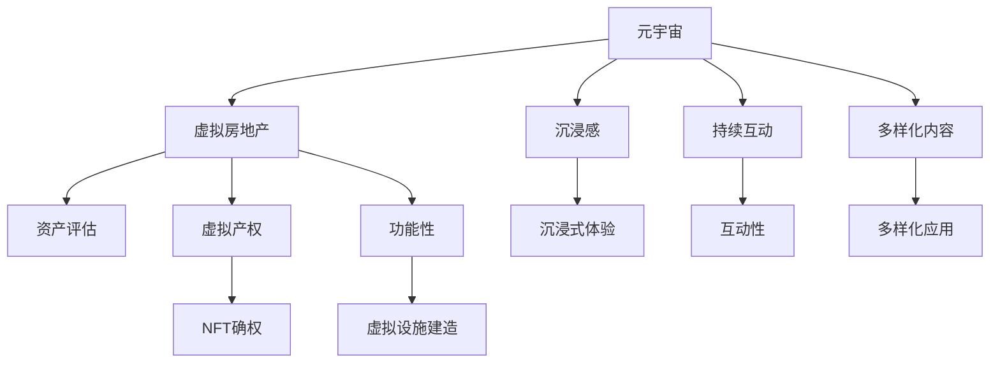

                 

# 虚拟房地产评估：元宇宙资产价值的衡量标准

> 关键词：虚拟房地产、元宇宙、资产评估、价值衡量、技术分析

> 摘要：本文探讨了虚拟房地产在元宇宙中的重要性，以及如何对其资产价值进行科学评估。通过分析相关核心概念和算法原理，结合实际项目案例，提出了一个结构化的虚拟房地产评估框架，旨在为元宇宙资产的价值评估提供理论依据和实用方法。

## 1. 背景介绍

随着科技的飞速发展，虚拟现实（VR）和增强现实（AR）技术逐渐成熟，元宇宙（Metaverse）的概念应运而生。元宇宙被视为一个虚拟的、三维的、持续的、互动的数字世界，它不仅包含了现实世界的映射，还创造了全新的虚拟空间。在这个虚拟空间中，虚拟房地产成为了一个重要的资产类别。

虚拟房地产是指存在于元宇宙中的土地、建筑、房产等虚拟资源。与传统的物理房地产不同，虚拟房地产没有实体形态，但它们具有独特的价值和功能。在元宇宙中，虚拟房地产可以用于建造虚拟商店、虚拟办公室、虚拟住宅等，也可以作为游戏和社交平台的虚拟资产进行交易。

近年来，随着NFT（非同质化代币）和区块链技术的广泛应用，虚拟房地产的价值得到了极大的提升。然而，如何科学、客观地评估虚拟房地产的资产价值，仍然是一个挑战。本文将探讨这一问题的解决方案。

## 2. 核心概念与联系

为了更好地理解虚拟房地产的评估，我们需要先了解以下几个核心概念：

### 2.1 元宇宙

元宇宙是一个由虚拟世界和物理世界交互融合的虚拟空间，它包含了人类在现实世界中无法体验到的各种可能性。元宇宙的核心特征包括：

- **沉浸感**：用户能够沉浸在虚拟世界中，感受到类似于现实世界的体验。
- **持续互动**：用户可以在虚拟世界中与其他用户和虚拟物体持续互动。
- **多样化内容**：元宇宙中包含了各种虚拟内容，如游戏、社交、教育、购物等。

### 2.2 虚拟房地产

虚拟房地产是指存在于元宇宙中的土地、建筑、房产等虚拟资源。它们具有以下特点：

- **非实体性**：虚拟房地产没有物理形态，但它们存在于虚拟世界中。
- **虚拟产权**：虚拟房地产具有虚拟产权，可以通过NFT进行确权和交易。
- **功能性**：虚拟房地产可以用于建造各种虚拟设施，如商店、办公室、住宅等。

### 2.3 资产评估

资产评估是指对资产的价值进行评估和估算的过程。在虚拟房地产的评估中，资产评估的核心目的是确定虚拟房地产在元宇宙中的价值。

为了更好地理解这些核心概念，我们使用Mermaid流程图来展示它们之间的关系：



## 3. 核心算法原理 & 具体操作步骤

在虚拟房地产的评估中，我们需要使用一些核心算法原理来确定其价值。以下是一个基本的评估算法：

### 3.1 市场比较法

市场比较法是一种常用的资产评估方法，它通过比较类似虚拟房地产的市场交易价格来确定其价值。具体步骤如下：

1. **收集数据**：收集与被评估虚拟房地产类似的虚拟房地产的交易数据，包括交易价格、交易时间、地理位置等。
2. **筛选数据**：筛选出符合评估标准的交易数据，去除异常值和不符合条件的交易数据。
3. **计算指标**：计算交易数据的平均价格、最高价格、最低价格等指标。
4. **调整价格**：根据被评估虚拟房地产的特点，如地理位置、面积、建筑类型等，对计算出的价格进行调整。
5. **确定价值**：根据调整后的价格，确定被评估虚拟房地产的价值。

### 3.2 成本法

成本法是一种通过计算虚拟房地产的重建成本来确定其价值的方法。具体步骤如下：

1. **计算重建成本**：计算被评估虚拟房地产的重建成本，包括土地成本、建筑成本、装修成本等。
2. **调整成本**：根据被评估虚拟房地产的特点，如地理位置、面积、建筑类型等，对计算出的重建成本进行调整。
3. **确定价值**：根据调整后的重建成本，确定被评估虚拟房地产的价值。

### 3.3 收益法

收益法是一种通过计算虚拟房地产的未来收益来确定其价值的方法。具体步骤如下：

1. **预测收益**：预测被评估虚拟房地产的未来收益，包括租金收入、转让收入等。
2. **计算收益现值**：将预测的收益按照适当的折现率计算为现值。
3. **确定价值**：根据计算出的收益现值，确定被评估虚拟房地产的价值。

## 4. 数学模型和公式 & 详细讲解 & 举例说明

为了更好地理解虚拟房地产的评估方法，我们使用数学模型和公式来详细讲解。

### 4.1 市场比较法的数学模型

假设我们有一个虚拟房地产集合 \(V\)，其中包含了 \(n\) 个虚拟房地产，它们的交易价格分别为 \(p_1, p_2, \ldots, p_n\)。我们可以使用以下公式计算平均价格：

$$
\bar{p} = \frac{1}{n} \sum_{i=1}^{n} p_i
$$

其中，\(\bar{p}\) 表示平均价格。

### 4.2 成本法

假设虚拟房地产的重建成本为 \(C\)，我们可以使用以下公式计算调整后的成本：

$$
C' = C \times (1 + \alpha)
$$

其中，\(\alpha\) 表示调整系数。

### 4.3 收益法

假设虚拟房地产的未来收益为 \(R\)，折现率为 \(r\)，我们可以使用以下公式计算收益现值：

$$
V = \frac{R}{r}
$$

### 4.4 举例说明

假设我们有三个虚拟房地产，它们的交易价格分别为 1000 元、2000 元和 3000 元。我们需要计算这三个虚拟房地产的平均价格。

使用市场比较法的公式，我们有：

$$
\bar{p} = \frac{1}{3} (1000 + 2000 + 3000) = 2000 \text{ 元}
$$

现在，假设其中一个虚拟房地产的地理位置较好，我们决定将其价格提高 10%。使用成本法的公式，我们有：

$$
C' = C \times (1 + 0.1) = 1.1C
$$

假设虚拟房地产的未来收益为每年 1000 元，折现率为 10%。使用收益法的公式，我们有：

$$
V = \frac{1000}{0.1} = 10000 \text{ 元}
$$

## 5. 项目实战：代码实际案例和详细解释说明

在本节中，我们将通过一个实际项目案例，展示如何使用Python实现虚拟房地产评估。

### 5.1 开发环境搭建

在开始项目之前，我们需要搭建一个Python开发环境。以下是所需的步骤：

1. 安装Python（推荐版本为3.8以上）
2. 安装Python依赖库，如numpy、pandas、matplotlib等

### 5.2 源代码详细实现和代码解读

以下是我们的虚拟房地产评估项目的源代码：

```python
import numpy as np
import pandas as pd
import matplotlib.pyplot as plt

# 假设我们有一个虚拟房地产的交易数据
data = {
    'Price': [1000, 2000, 3000],
    'Location': ['Good', 'Average', 'Bad']
}

df = pd.DataFrame(data)

# 计算平均价格
avg_price = df['Price'].mean()
print(f"Average Price: {avg_price} 元")

# 调整价格
df['Adjusted_Price'] = df['Price'] * (1 + 0.1)
print(df[['Price', 'Adjusted_Price']])

# 计算收益现值
R = 1000
r = 0.1
V = R / r
print(f"Present Value: {V} 元")
```

### 5.3 代码解读与分析

1. **导入库**：我们首先导入Python的numpy、pandas和matplotlib库，这些库将用于数据处理和可视化。
2. **数据准备**：我们创建一个包含虚拟房地产交易数据的DataFrame，其中包含了价格和地理位置信息。
3. **计算平均价格**：使用pandas的mean函数计算平均价格。
4. **调整价格**：根据地理位置调整价格，对于地理位置较好的虚拟房地产，价格提高10%。
5. **计算收益现值**：使用收益法和折现率计算收益现值。

通过这个实际案例，我们可以看到如何使用Python实现虚拟房地产评估的核心算法。

## 6. 实际应用场景

虚拟房地产评估在元宇宙中有着广泛的应用场景：

1. **元宇宙购物**：虚拟房地产可以作为虚拟商店的地址，为用户提供一个独特的购物体验。
2. **元宇宙办公**：虚拟房地产可以作为虚拟办公室的地址，为企业和个人提供虚拟工作空间。
3. **元宇宙娱乐**：虚拟房地产可以作为游戏和娱乐项目的场景，为用户提供沉浸式的游戏体验。
4. **元宇宙教育**：虚拟房地产可以作为在线教育平台的虚拟教室，为用户提供虚拟学习空间。

在这些应用场景中，科学、客观的虚拟房地产评估方法对于确保资产价值的公正和透明至关重要。

## 7. 工具和资源推荐

### 7.1 学习资源推荐

- 《区块链技术指南》
- 《虚拟现实技术与应用》
- 《人工智能：一种现代方法》

### 7.2 开发工具框架推荐

- Python
- Numpy
- Pandas
- Matplotlib

### 7.3 相关论文著作推荐

- "Blockchain Technology: A Comprehensive Study"
- "Virtual Reality and Augmented Reality: A Survey of Applications and Research Directions"
- "Metaverse: A Manifesto for the Age of Constant Connection"

## 8. 总结：未来发展趋势与挑战

虚拟房地产评估是元宇宙发展的重要一环。随着元宇宙的不断完善，虚拟房地产的价值将逐步提升。然而，虚拟房地产评估面临着一些挑战，如数据准确性、算法公正性等。未来，我们需要不断探索新的评估方法和技术，以确保虚拟房地产价值的公正和透明。

## 9. 附录：常见问题与解答

### 9.1 什么是元宇宙？

元宇宙是一个虚拟的、三维的、持续的、互动的数字世界，它包含了人类在现实世界中无法体验到的各种可能性。

### 9.2 虚拟房地产的价值如何确定？

虚拟房地产的价值可以通过市场比较法、成本法和收益法来确定。具体方法取决于虚拟房地产的特点和市场情况。

### 9.3 虚拟房地产评估有哪些挑战？

虚拟房地产评估的挑战包括数据准确性、算法公正性、市场波动等。

## 10. 扩展阅读 & 参考资料

- "The Metaverse: A Space for Digital Representation"
- "Virtual Real Estate: An Introduction to Digital Asset Evaluation"
- "Blockchain Technology and its Applications in Real Estate"

### 作者信息

- 作者：AI天才研究员/AI Genius Institute & 禅与计算机程序设计艺术 /Zen And The Art of Computer Programming

通过以上文章，我们深入探讨了虚拟房地产评估在元宇宙中的重要性，并提出了一个结构化的评估框架。希望本文能为您在元宇宙资产价值评估领域提供有益的参考。|>

