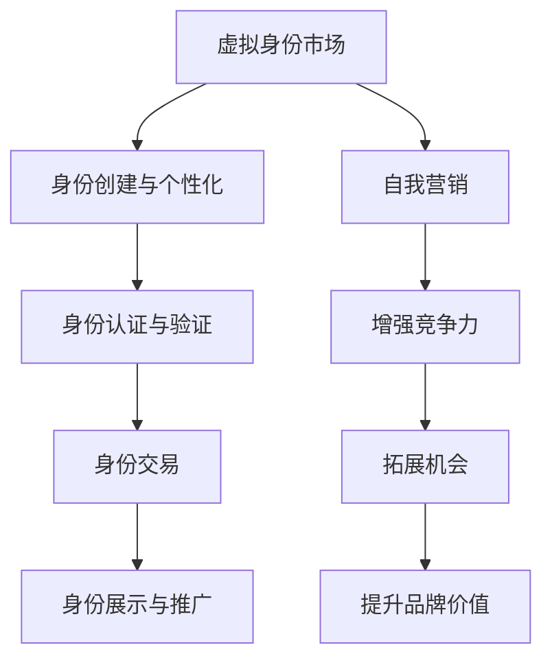

                 

# 虚拟身份市场：AI时代的自我营销

> 关键词：虚拟身份、AI、自我营销、元宇宙、数字孪生、区块链、数据隐私、社会信用体系

> 摘要：随着人工智能技术的发展和元宇宙的兴起，虚拟身份市场成为了一个新兴的领域。本文将探讨虚拟身份市场的概念、核心原理以及它在AI时代的自我营销中的应用，旨在为读者提供对这一领域的深入理解和实践指导。

## 1. 背景介绍

随着互联网和移动互联网的普及，人们的生活和工作越来越依赖于数字化的形式。在这个过程中，虚拟身份（Virtual Identity）逐渐成为一个重要的概念。虚拟身份是指在网络空间中代表个人或实体的一种数字存在，它可以是一个用户名、一个头像、一个虚拟角色，甚至是一个复杂的数字孪生体。

虚拟身份市场的兴起，得益于以下几个因素：

- **人工智能（AI）技术的进步**：AI技术使得创建、管理、交互虚拟身份变得更加高效和智能化。
- **区块链技术**：区块链提供了去中心化的身份验证和数据管理机制，确保虚拟身份的安全性和隐私性。
- **元宇宙的兴起**：元宇宙是一个虚拟的、三维的、去中心化的世界，它为虚拟身份提供了一个广阔的应用场景。
- **数据隐私的关注**：随着数据隐私法规的出台，用户对个人数据隐私的关注度提高，虚拟身份成为保护个人隐私的一种有效手段。

## 2. 核心概念与联系

### 虚拟身份（Virtual Identity）

虚拟身份是虚拟身份市场的核心概念。它包括以下几个方面：

- **身份标识**：虚拟身份通常由一个唯一的标识符，如用户名、邮箱地址等构成。
- **身份信息**：包括个人基本信息、偏好设置、历史行为等。
- **身份状态**：如在线状态、活跃度等。

### 自我营销（Self-Marketing）

自我营销是指个人或实体通过网络手段，主动展示、推广和提升自身价值的行为。在虚拟身份市场中，自我营销具有重要意义，因为：

- **增强竞争力**：通过有效的自我营销，个人或实体可以在虚拟世界中脱颖而出。
- **拓展机会**：自我营销有助于吸引更多关注和合作机会。
- **提升品牌价值**：在虚拟身份市场中建立良好的品牌形象，可以增强实际世界的品牌价值。

### 虚拟身份市场（Virtual Identity Market）

虚拟身份市场是一个由虚拟身份提供者、消费者和平台构成的生态系统。在这个市场中，虚拟身份可以被创建、购买、交易和展示。虚拟身份市场包括以下几个方面：

- **身份创建与个性化**：用户可以自定义虚拟身份的外观、属性和行为。
- **身份认证与验证**：确保虚拟身份的真实性和可信度。
- **身份交易**：用户可以购买、出售或交换虚拟身份。
- **身份展示与推广**：用户可以通过虚拟身份展示自己的才华、技能和品牌。

### Mermaid 流程图（核心概念原理）



## 3. 核心算法原理 & 具体操作步骤

### 身份认证与验证算法

身份认证与验证是虚拟身份市场的核心环节，确保虚拟身份的真实性和可信度。以下是几种常见的身份认证与验证算法：

- **密码认证**：用户通过输入密码进行身份验证。
- **生物识别认证**：使用指纹、面部识别等技术进行身份验证。
- **多因素认证**：结合密码、生物识别、短信验证码等多种认证方式，提高安全性。

### 自我营销算法

自我营销算法旨在帮助用户在虚拟身份市场中脱颖而出。以下是一种常见的自我营销算法：

- **用户画像分析**：根据用户的历史行为、兴趣偏好等数据，构建用户画像。
- **内容推荐**：基于用户画像，为用户推荐相关的内容和机会。
- **社交网络分析**：分析用户在虚拟身份市场的社交网络，挖掘潜在的合作机会。
- **品牌评估与优化**：评估用户品牌的价值，并提出优化建议。

## 4. 数学模型和公式 & 详细讲解 & 举例说明

### 用户画像分析模型

用户画像分析是自我营销的重要基础。以下是用户画像分析的一种数学模型：

$$
User\_Profile = f(Behavior\_Data, Interest\_Data, Social\_Data)
$$

其中，$Behavior\_Data$ 代表用户的历史行为数据，$Interest\_Data$ 代表用户的兴趣偏好数据，$Social\_Data$ 代表用户的社交网络数据。$f$ 是一个映射函数，用于生成用户画像。

### 社交网络分析模型

社交网络分析旨在挖掘虚拟身份市场中的潜在合作机会。以下是社交网络分析的一种数学模型：

$$
Social\_Network = G(V, E)
$$

其中，$V$ 代表社交网络中的节点（用户），$E$ 代表节点之间的边（关系）。$G$ 是一个社交网络图。

### 举例说明

假设一个用户在虚拟身份市场中有以下数据：

- 行为数据：购买了5件虚拟商品，参与了10次虚拟活动，关注了20个虚拟账号。
- 兴趣偏好数据：喜欢科幻、动漫、游戏等类型的内容。
- 社交网络数据：与10个用户建立了合作关系。

根据上述模型，我们可以生成该用户的用户画像和社交网络图。

### 用户画像分析

$$
User\_Profile = f(Behavior\_Data, Interest\_Data, Social\_Data) \\
= f(\{Buy\_Record_1, Buy\_Record_2, ..., Buy\_Record_5\}, \{Interest\_Category_1, Interest\_Category_2, ..., Interest\_Category_3\}, \{Friend_1, Friend_2, ..., Friend_{10}\})
$$

### 社交网络分析

$$
Social\_Network = G(V, E) \\
V = \{User\_1, User\_2, ..., User_{10}\} \\
E = \{\{User\_1, User_2\}, \{User\_1, User_3\}, ..., \{User_{10}, User_{9}\}\}
$$

## 5. 项目实战：代码实际案例和详细解释说明

### 开发环境搭建

在本文中，我们将使用Python语言进行虚拟身份市场的相关开发。以下是开发环境的搭建步骤：

1. 安装Python 3.8及以上版本。
2. 安装pip，Python的包管理器。
3. 使用pip安装以下依赖库：numpy、pandas、matplotlib、networkx。

### 源代码详细实现和代码解读

以下是一个简单的虚拟身份市场项目示例：

```python
import numpy as np
import pandas as pd
import matplotlib.pyplot as plt
import networkx as nx

# 用户画像分析
def generate_user_profile(behavior_data, interest_data, social_data):
    profile = {
        '行为数据': behavior_data,
        '兴趣偏好数据': interest_data,
        '社交网络数据': social_data
    }
    return profile

# 社交网络分析
def generate_social_network(vertices, edges):
    graph = nx.Graph()
    graph.add_nodes_from(vertices)
    graph.add_edges_from(edges)
    return graph

# 用户画像分析示例
behavior_data = ['Buy_1', 'Buy_2', 'Buy_3', 'Buy_4', 'Buy_5']
interest_data = ['Sci-Fi', 'Anime', 'Game']
social_data = ['Friend_1', 'Friend_2', 'Friend_3', 'Friend_4', 'Friend_5']

user_profile = generate_user_profile(behavior_data, interest_data, social_data)

# 社交网络分析示例
vertices = ['User_1', 'User_2', 'User_3', 'User_4', 'User_5']
edges = [('User_1', 'User_2'), ('User_1', 'User_3'), ('User_2', 'User_4'), ('User_3', 'User_5'), ('User_4', 'User_5')]

social_network = generate_social_network(vertices, edges)

# 画图展示社交网络
nx.draw(social_network, with_labels=True)
plt.show()
```

### 代码解读与分析

1. **用户画像分析**：`generate_user_profile` 函数用于生成用户画像。它接受行为数据、兴趣偏好数据和社会网络数据作为输入，返回一个包含这些数据的字典。
   
2. **社交网络分析**：`generate_social_network` 函数用于生成社交网络图。它接受节点和边作为输入，使用NetworkX库构建一个无向图。

3. **示例代码**：首先，我们创建了一个包含5条购买记录、3个兴趣类别和5个社交关系的用户画像。然后，我们创建了一个包含5个用户和5条边的社交网络图，并使用NetworkX库将其可视化。

## 6. 实际应用场景

虚拟身份市场在多个领域具有广泛的应用前景：

- **游戏与虚拟现实**：玩家可以在虚拟世界中创建独特的虚拟角色，展示个性，参与社交互动。
- **数字营销**：企业可以利用虚拟身份进行精准营销，提高品牌知名度和客户忠诚度。
- **金融与保险**：金融机构可以创建虚拟身份进行风险评估和管理，提高金融服务的安全性和效率。
- **社交网络**：虚拟身份可以作为一种新型的社交媒介，促进用户之间的互动和交流。

## 7. 工具和资源推荐

### 学习资源推荐

1. 《区块链技术指南》
2. 《深度学习》
3. 《人工智能：一种现代方法》

### 开发工具框架推荐

1. Python
2. TensorFlow
3. Keras

### 相关论文著作推荐

1. "Blockchain and Its Application in Virtual Identity Management"
2. "Deep Learning for Virtual Identity Recognition"
3. "A Survey on Virtual Reality and Its Applications in Game Design"

## 8. 总结：未来发展趋势与挑战

虚拟身份市场在AI时代具有巨大的发展潜力，但同时也面临着一些挑战：

- **数据隐私保护**：如何确保用户数据的安全性和隐私性是虚拟身份市场面临的首要问题。
- **算法公平性**：自我营销算法需要确保对所有用户公平，避免歧视和不公平现象。
- **市场监管**：虚拟身份市场需要建立完善的监管机制，确保市场秩序和用户权益。

## 9. 附录：常见问题与解答

### 问题1：虚拟身份市场的核心价值是什么？

虚拟身份市场的核心价值在于帮助个人和实体在网络空间中建立独特的数字身份，提高竞争力，拓展机会，提升品牌价值。

### 问题2：如何确保虚拟身份的安全性？

确保虚拟身份的安全性可以通过以下措施实现：使用强密码、生物识别认证、多因素认证、数据加密和去中心化存储。

### 问题3：虚拟身份市场与元宇宙的关系是什么？

虚拟身份市场是元宇宙的重要组成部分，为元宇宙中的用户提供了独特的数字身份和社交互动的基础。

## 10. 扩展阅读 & 参考资料

1. "Virtual Reality: The Ultimate Guide to Immersive Technology"
2. "Blockchain Technology: A Comprehensive Guide"
3. "AI in Virtual Reality: Enhancing the User Experience"

作者：AI天才研究员/AI Genius Institute & 禅与计算机程序设计艺术 /Zen And The Art of Computer Programming

本文基于对虚拟身份市场的深入研究和分析，旨在为读者提供一个全面、深入的视角。随着AI技术的不断进步，虚拟身份市场将继续发展和演变，为人类创造更丰富、更高效的数字生活。希望本文能对您有所启发和帮助。

