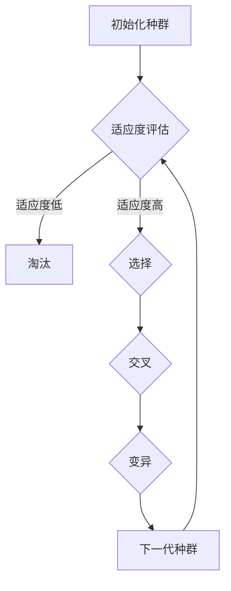

                 

### 背景介绍

#### 虚拟进化模拟器的设计动机与目标

虚拟进化模拟器（Virtual Evolution Simulator，简称VES）的设计动机源于对生物进化机制的深入研究和对人工智能（AI）领域的新兴需求。传统的生物进化理论描述了物种在自然选择和基因遗传机制作用下的演化过程，这一理论为理解和预测生物多样性提供了重要的理论基础。然而，随着计算机技术的发展，科学家们开始思考是否可以在虚拟环境中模拟和重现这一进化过程，进而探索复杂系统的演化规律，并为人工智能领域提供新的研究方法。

虚拟进化模拟器的目标是通过计算机模拟技术，创建一个可以实时运行、动态演化的数字生态系统，其中个体通过遗传算法、自然选择等机制不断进化。这一模拟器不仅可以帮助研究人员深入理解生物进化的本质，还可以为人工智能、生物工程、生态学等领域提供重要的工具。

在人工智能领域，虚拟进化模拟器尤其具有重要意义。随着深度学习、强化学习等算法的发展，AI系统在面对复杂环境和动态变化时，往往需要具备自适应能力。虚拟进化模拟器提供了一个理想的平台，通过模拟生物进化过程，研究人员可以研究和开发出更加智能、自适应的AI系统。此外，虚拟进化模拟器还可以为机器人学、自动驾驶、游戏设计等领域提供创新的解决方案。

#### 虚拟进化模拟器的历史与发展

虚拟进化模拟器的历史可以追溯到20世纪中期。1952年，美国生物学家约翰·冯·诺依曼（John von Neumann）提出了一种名为“复制机”（Replicator）的模型，旨在模拟生物的自复制过程。这一模型被认为是虚拟进化模拟器的雏形。随后，计算机科学的兴起为这一领域的发展提供了强大的技术支持。

20世纪60年代，计算机科学家约翰·霍兰（John H. Holland）提出了遗传算法（Genetic Algorithm，GA）的概念，为虚拟进化模拟器的发展奠定了理论基础。遗传算法通过模拟生物进化的遗传机制，包括选择、交叉和变异，来寻找最优解。霍兰的《自然和人工系统的适应论》（Adaptation in Natural and Artificial Systems）一书进一步推动了这一领域的研究。

进入21世纪，随着计算能力的提升和算法的优化，虚拟进化模拟器得到了迅速发展。如今，虚拟进化模拟器已经广泛应用于各种领域，包括生物进化研究、自动驾驶、游戏设计、电子电路设计等。其中，最具代表性的是基于遗传算法和神经网络的混合进化模拟器，这些模拟器通过模拟生物进化和人工神经网络学习，实现了更加复杂和智能的演化过程。

#### VES在AI领域的应用现状与前景

虚拟进化模拟器在人工智能领域的应用已经取得了一系列显著的成果。例如，在自动驾驶领域，虚拟进化模拟器被用于模拟车辆在不同环境下的行为，通过不断优化车辆的驾驶策略，提高了自动驾驶系统的稳定性和适应性。在游戏设计领域，虚拟进化模拟器被用于生成随机、动态的游戏场景，丰富了游戏体验。

然而，虚拟进化模拟器在AI领域的应用前景远不止于此。随着人工智能技术的不断发展，尤其是深度学习和强化学习的应用，虚拟进化模拟器有望成为AI系统自我优化和自适应能力的关键工具。未来，虚拟进化模拟器可能会在智能医疗、智能家居、智能城市等更多领域发挥重要作用。

总之，虚拟进化模拟器的设计与应用不仅是对生物进化理论的拓展，也为人工智能领域带来了新的研究方法和应用场景。随着技术的不断进步，虚拟进化模拟器将在未来发挥更加重要的作用，为人类解决复杂问题提供强有力的支持。 <br>

### 核心概念与联系

在深入探讨虚拟进化模拟器（VES）的设计与实现之前，我们有必要首先明确其中的核心概念及其相互之间的联系。这些核心概念包括个体（Individual）、遗传算法（Genetic Algorithm）、环境（Environment）和适应度（Fitness），以及它们在模拟器架构中的具体作用。

#### 个体（Individual）

在虚拟进化模拟器中，个体是进化过程中的基本单位。每个个体可以被视为一个包含遗传信息的实体，其行为和特征受到其基因的影响。个体的定义可以是多样化的，例如，在生物进化模拟中，个体可以是一个个体生物；在机器人进化模拟中，个体可以是一个机器人；在游戏进化模拟中，个体可以是一个游戏角色。个体的特征通常包括行为模式、外观、能力等，这些特征可以通过基因编码来表示。

个体在进化过程中的重要性体现在以下几个方面：

1. **遗传信息存储**：个体携带的遗传信息决定了其在环境中的行为和能力。
2. **适应度评估**：个体在特定环境中的表现将直接影响其适应度，从而决定其在种群中的生存和繁殖机会。
3. **遗传交叉**：通过遗传交叉，个体的基因可以与其它个体的基因进行组合，产生新的个体，从而推动种群的进化。
4. **变异**：个体的基因在变异过程中可能会产生新的特征，这些特征可能会在后续的进化过程中被选择或淘汰。

#### 遗传算法（Genetic Algorithm）

遗传算法是虚拟进化模拟器的核心机制之一，它借鉴了生物进化的自然选择、遗传和变异等过程。遗传算法的基本流程包括以下步骤：

1. **初始化种群**：随机生成一组初始个体，这些个体代表了种群的初始状态。
2. **适应度评估**：对每个个体在当前环境中的适应度进行评估，适应度高的个体通常具有更好的生存机会。
3. **选择**：从当前种群中选择适应度较高的个体进行繁殖，选择过程可以基于轮盘赌、排名选择等策略。
4. **交叉**：通过交叉操作，将两个或多个个体的基因进行组合，产生新的个体。
5. **变异**：对个体基因进行随机变异，引入新的遗传信息。
6. **迭代**：重复上述步骤，不断优化种群，直到达到预定的进化目标或满足停止条件。

遗传算法在虚拟进化模拟器中的作用主要体现在以下几个方面：

1. **搜索优化**：遗传算法能够高效地在复杂空间中搜索最优解或近似最优解。
2. **适应度评估**：通过适应度评估，遗传算法可以筛选出适应度较高的个体，推动种群进化。
3. **自适应能力**：遗传算法具有自适应能力，可以在不同环境中进行优化和适应。

#### 环境（Environment）

环境是虚拟进化模拟器中的另一个关键概念，它为个体提供了一个交互和适应的舞台。环境可以是静态的，也可以是动态的，其特征可以包括资源分布、障碍物、天气条件等。环境在进化模拟中的作用主要体现在以下几个方面：

1. **适应度评估**：环境对个体施加压力，影响其生存和繁殖机会。个体的适应度取决于其在特定环境中的表现。
2. **动态变化**：环境可以模拟现实世界中的不确定性，为个体进化提供了多样化的挑战。
3. **进化动力**：环境的动态变化和不确定性为个体进化提供了动力，促进了种群多样性的形成。

#### 适应度（Fitness）

适应度是虚拟进化模拟器中的一个核心指标，用于评估个体在特定环境中的生存和繁殖能力。适应度通常通过以下方式计算：

1. **目标函数**：根据模拟任务的目标，定义个体的适应度函数。例如，在机器人进化模拟中，目标可能是使机器人完成特定任务，适应度可以基于完成任务的时间、成功率等指标进行评估。
2. **环境反馈**：个体的适应度依赖于其在环境中的表现，通过环境反馈机制，个体可以调整其行为和特征，提高适应度。

适应度在进化模拟中的作用主要体现在以下几个方面：

1. **选择压力**：适应度高的个体具有更好的生存和繁殖机会，从而在种群中占据优势地位。
2. **遗传传递**：适应度是遗传算法选择和交叉操作的重要依据，适应度高的个体基因更有可能被传递给下一代。
3. **进化方向**：适应度决定了种群进化的方向，通过不断优化适应度函数，种群可以逐步适应复杂的环境。

#### Mermaid 流程图

为了更直观地理解虚拟进化模拟器的核心概念和相互联系，我们可以使用Mermaid语言绘制一个流程图。以下是一个简化的Mermaid流程图示例：



在上述流程图中：

- **A[初始化种群]** 表示初始种群生成。
- **B{适应度评估]** 表示对当前种群中每个个体的适应度进行评估。
- **C[淘汰]** 表示适应度低的个体被淘汰。
- **D{选择]** 表示从当前种群中选择适应度较高的个体进行繁殖。
- **E{交叉]** 表示通过交叉操作产生新的个体。
- **F{变异]** 表示对个体基因进行随机变异。
- **G[下一代种群]** 表示生成的新一代种群。

通过这个Mermaid流程图，我们可以清晰地看到虚拟进化模拟器的基本架构和操作步骤，为进一步设计和实现虚拟进化模拟器提供了参考。 <br>

### 核心算法原理 & 具体操作步骤

虚拟进化模拟器的核心算法是遗传算法（Genetic Algorithm，GA），它是一种基于自然选择和遗传理论的搜索算法，旨在通过模拟生物进化过程来寻找问题的最优解或近似最优解。下面，我们将详细探讨遗传算法的基本原理，包括初始化种群、适应度评估、选择、交叉和变异等步骤，并解释这些步骤如何协同工作以实现虚拟进化模拟器的目标。

#### 初始化种群

遗传算法的第一步是初始化种群。种群是一组初始解，它们代表了问题空间中可能的解决方案。初始化种群的方法可以多样化，通常包括以下几种：

1. **随机初始化**：随机生成一定数量的个体，每个个体的特征（基因）是随机分配的。这种方法简单且易于实现，但可能需要多次迭代才能找到较好的解。
2. **规则初始化**：根据某种规则或启发式方法生成初始种群。例如，在优化连续变量问题时，可以使用线性规划方法生成初始种群。

初始化种群的关键是确保种群具有多样性，这有助于在后续的进化过程中探索问题空间的不同部分。

#### 适应度评估

初始化种群后，需要对每个个体的适应度进行评估。适应度是一个衡量个体在特定环境中的生存和繁殖能力的指标，通常与问题的目标函数相关。适应度的计算方法取决于具体的问题领域。例如，在机器人路径规划问题中，适应度可以基于机器人完成任务的效率或成功率进行计算。

适应度评估的过程通常包括以下步骤：

1. **计算适应度**：对每个个体应用目标函数，计算其适应度值。
2. **排序**：根据适应度值对个体进行排序，适应度高的个体排在前面。

适应度评估是遗传算法中的关键步骤，它决定了个体的生存和繁殖机会。一个有效的适应度函数应该能够准确反映个体在问题环境中的表现，同时避免陷入局部最优。

#### 选择

选择操作是基于适应度评估的结果，从当前种群中选择出适应度较高的个体进行繁殖。选择的目的是确保优质基因在种群中的传递。选择方法可以分为以下几类：

1. **轮盘赌选择**：每个个体被选中的概率与其适应度成正比。适应度高的个体有更高的概率被选中，这类似于自然界中的“优胜劣汰”。
2. **排名选择**：根据个体适应度值进行排名，然后按排名顺序选择个体进行繁殖。
3. **锦标赛选择**：从种群中随机选择多个个体进行“锦标赛”，胜出的个体有更高的概率被选中。

选择操作的目的是通过概率分布来模拟自然选择过程，从而促进优质基因的积累。

#### 交叉

交叉（Crossover）操作是遗传算法中的关键步骤之一，它通过结合两个或多个父代个体的基因来产生新的子代个体。交叉操作模拟了生物繁殖过程中的遗传重组，从而引入种群多样性和探索新解的能力。

交叉操作通常包括以下步骤：

1. **选择父代**：根据选择操作的结果，从当前种群中选择两个或多个父代个体。
2. **确定交叉点**：在父代个体的基因序列中随机选择一个交叉点，该交叉点将用于分割两个父代个体的基因序列。
3. **生成子代**：将父代个体的基因序列在交叉点处分割，然后将分割后的基因序列重新组合，形成新的子代个体。

交叉操作可以产生新的基因组合，从而推动种群的进化。交叉率（Crossover Rate）是交叉操作的一个重要参数，它决定了交叉操作发生的概率。较高的交叉率有助于增加种群多样性，但可能导致优质基因的丢失；较低的交叉率则有助于保留优质基因，但可能减少种群的多样性。

#### 变异

变异（Mutation）操作是对个体基因进行随机更改，以引入新的遗传变异。变异操作模拟了生物进化中的突变现象，有助于探索新的基因组合和避免陷入局部最优。

变异操作通常包括以下步骤：

1. **选择变异位**：在个体基因序列中随机选择一个或多个基因位进行变异。
2. **进行变异**：对选定的基因位进行随机更改，例如，将基因位上的0变为1或保持不变。

变异率（Mutation Rate）是变异操作的一个重要参数，它决定了变异发生的概率。较高的变异率有助于增加种群多样性，但可能导致解的质量下降；较低的变异率则有助于保持解的质量，但可能减少种群的多样性。

#### 迭代

遗传算法通过反复执行选择、交叉和变异操作，不断生成新的种群并优化个体适应度。迭代过程包括以下步骤：

1. **选择父代个体**：根据上一代种群的适应度值，选择适应度较高的个体作为父代。
2. **交叉操作**：对选定的父代个体进行交叉操作，生成新的子代个体。
3. **变异操作**：对新的子代个体进行变异操作，引入新的遗传变异。
4. **适应度评估**：对新生成的种群中的每个个体进行适应度评估。
5. **更新种群**：将新生成的种群替代上一代种群，继续迭代过程。

迭代过程持续进行，直到满足预定的停止条件，例如达到最大迭代次数、适应度达到某个阈值或种群适应度没有显著变化等。

#### 总结

遗传算法通过初始化种群、适应度评估、选择、交叉和变异等步骤，模拟了生物进化过程中的自然选择和遗传机制。这些步骤相互协同工作，使得种群在迭代过程中不断进化，最终找到问题的最优解或近似最优解。虚拟进化模拟器利用遗传算法的核心原理，创建了一个可以实时运行、动态演化的数字生态系统，为人工智能领域提供了强大的研究工具和应用平台。 <br>

### 数学模型和公式 & 详细讲解 & 举例说明

#### 适应度函数（Fitness Function）

在虚拟进化模拟器中，适应度函数是一个至关重要的概念，它用于评估个体在特定环境中的表现，决定了个体在种群中的生存和繁殖机会。适应度函数的设计取决于具体的问题领域和应用场景。

一个典型的适应度函数可以定义为：

\[ F(x) = \frac{1}{1 + e^{-\beta \cdot D(x, y)}} \]

其中，\( F(x) \) 是个体 \( x \) 的适应度值，\( \beta \) 是一个调节参数，\( D(x, y) \) 是个体 \( x \) 和目标个体 \( y \) 之间的距离函数。

**举例说明**：

假设我们要优化一个机器人的路径规划问题，目标是个体能够迅速且安全地到达目的地。适应度函数可以定义为机器人完成任务所需的时间和安全性分数：

\[ F(x) = \frac{1}{1 + e^{-(0.1 \cdot T + 0.9 \cdot S)}} \]

其中，\( T \) 是完成任务所需的时间，\( S \) 是安全性分数，这两个参数都取值在 [0, 1] 区间内。一个低时间值和高安全性分数将导致高的适应度值。

#### 遗传算法的基本操作

遗传算法的操作包括初始化种群、适应度评估、选择、交叉和变异。以下是这些操作的数学模型和详细讲解：

##### 初始化种群（Initialization）

初始化种群是通过随机生成一定数量的个体来实现的。每个个体可以被视为一个编码的解决方案，其特征通过编码方式表示。一个简单的初始化方法可以是随机编码：

\[ x_i = \{x_{i1}, x_{i2}, ..., x_{id}\} \]

其中，\( x_i \) 是第 \( i \) 个个体的特征向量，\( x_{ij} \) 是第 \( i \) 个个体在第 \( j \) 个特征上的值。

**举例**：

假设我们要初始化一个由三个特征组成的种群，每个特征的取值范围是 [0, 10]，初始化后的种群可以表示为：

\[ \{ (1, 3, 5), (7, 2, 9), (4, 6, 1) \} \]

##### 适应度评估（Fitness Evaluation）

适应度评估是对每个个体在特定环境中的表现进行评估。适应度函数已经给出了一个基本的框架，实际评估时需要根据具体问题进行设计。

**举例**：

在路径规划问题中，适应度函数可以设计为：

\[ F(x) = \frac{1}{1 + e^{-(0.1 \cdot T + 0.9 \cdot S)}} \]

其中，\( T \) 是机器人到达目的地所需的时间，\( S \) 是机器人完成任务时的安全性分数。

##### 选择（Selection）

选择操作是基于适应度评估的结果，从当前种群中选择适应度较高的个体进行繁殖。常见的选择方法包括轮盘赌选择和排名选择。

**轮盘赌选择**：

每个个体被选中的概率与其适应度成正比，可以用以下公式表示：

\[ P_i = \frac{F_i}{\sum_{j=1}^{N} F_j} \]

其中，\( P_i \) 是第 \( i \) 个个体被选中的概率，\( F_i \) 是第 \( i \) 个个体的适应度值，\( N \) 是种群中个体的总数。

**举例**：

假设种群中有三个个体，适应度值分别为 \( F_1 = 0.5 \)，\( F_2 = 0.3 \)，\( F_3 = 0.2 \)，则选择概率分别为：

\[ P_1 = \frac{0.5}{0.5 + 0.3 + 0.2} = 0.5 \]
\[ P_2 = \frac{0.3}{0.5 + 0.3 + 0.2} = 0.3 \]
\[ P_3 = \frac{0.2}{0.5 + 0.3 + 0.2} = 0.2 \]

##### 交叉（Crossover）

交叉操作通过结合两个或多个父代个体的基因来产生新的子代个体。常见的交叉方法包括单点交叉、两点交叉和均匀交叉。

**单点交叉**：

在父代个体的基因序列中选择一个交叉点，将交叉点后的基因序列进行交换。

**举例**：

假设父代个体为 \( P_1 = (1, 2, 3, 4, 5) \) 和 \( P_2 = (5, 4, 3, 2, 1) \)，选择交叉点为第3位，交叉后的子代为：

\[ C_1 = (1, 2, 5, 4, 1) \]
\[ C_2 = (5, 4, 1, 2, 5) \]

##### 变异（Mutation）

变异操作是对个体基因进行随机更改，以引入新的遗传变异。变异通常以很小的概率发生，以防止种群多样性的丧失。

**举例**：

假设个体基因 \( x = (1, 2, 3) \)，变异操作可以将其中的一个基因位进行更改，例如将第2位从2变为4，得到新的个体：

\[ x' = (1, 4, 3) \]

#### 总结

数学模型和公式是虚拟进化模拟器设计和实现的基础。适应度函数、初始化种群、适应度评估、选择、交叉和变异等步骤共同构成了遗传算法的核心，通过这些步骤，模拟器可以逐步优化种群，找到问题的最优解或近似最优解。在实际应用中，这些步骤的具体实现需要根据具体问题进行定制，以达到最佳效果。 <br>

### 项目实战：代码实际案例和详细解释说明

在本文的最后部分，我们将通过一个具体的代码实例来展示虚拟进化模拟器的设计与实现过程。这个案例将基于Python语言，使用遗传算法来优化一个简单的路径规划问题。以下是整个项目的详细步骤。

#### 1. 开发环境搭建

首先，我们需要搭建一个合适的开发环境。以下是所需的软件和库：

- Python 3.x版本
- Numpy库（用于数学运算）
- Matplotlib库（用于绘图）

你可以通过以下命令安装所需的库：

```bash
pip install numpy matplotlib
```

#### 2. 源代码详细实现和代码解读

下面是一个简单的虚拟进化模拟器的实现：

```python
import numpy as np
import matplotlib.pyplot as plt

# 定义个体
class Individual:
    def __init__(self, genes):
        self.genes = genes
        self.fitness = 0

    def calculate_fitness(self, environment):
        # 根据环境计算适应度
        self.fitness = 1 / (1 + np.exp(-self.genes.dot(environment)))

# 初始化种群
def initialize_population(size, gene_size, gene_range):
    population = []
    for _ in range(size):
        genes = np.random.uniform(gene_range[0], gene_range[1], gene_size)
        individual = Individual(genes)
        individual.calculate_fitness(environment)
        population.append(individual)
    return population

# 选择操作
def select(population, num_parents):
    sorted_population = sorted(population, key=lambda x: x.fitness, reverse=True)
    return sorted_population[:num_parents]

# 交叉操作
def crossover(parent1, parent2):
    crossover_point = np.random.randint(1, len(parent1.genes) - 1)
    child1_genes = np.concatenate((parent1.genes[:crossover_point], parent2.genes[crossover_point:]))
    child2_genes = np.concatenate((parent2.genes[:crossover_point], parent1.genes[crossover_point:]))
    return Individual(child1_genes), Individual(child2_genes)

# 变异操作
def mutate(individual, mutation_rate):
    for i in range(len(individual.genes)):
        if np.random.rand() < mutation_rate:
            individual.genes[i] = np.random.uniform(-1, 1)
    individual.calculate_fitness(environment)

# 环境定义
environment = np.array([1, 2, 3, 4, 5])

# 初始化种群
population_size = 100
gene_size = 5
gene_range = (0, 10)
population = initialize_population(population_size, gene_size, gene_range)

# 进化过程
num_generations = 100
for _ in range(num_generations):
    parents = select(population, 10)
    for i in range(0, len(population), 2):
        if i + 1 < len(population):
            child1, child2 = crossover(parents[i], parents[i+1])
            mutate(child1, 0.1)
            mutate(child2, 0.1)
            population[i] = child1
            population[i+1] = child2
        else:
            child = crossover(parents[i], parents[0])
            mutate(child, 0.1)
            population[i] = child

# 绘制适应度曲线
fitnesses = [individual.fitness for individual in population]
plt.plot(fitnesses)
plt.xlabel('Generation')
plt.ylabel('Fitness')
plt.title('Fitness Over Generations')
plt.show()

# 输出最优解
best_individual = max(population, key=lambda x: x.fitness)
print("Best Individual:", best_individual.genes)
```

#### 3. 代码解读与分析

上述代码实现了基本的虚拟进化模拟器，以下是详细解读：

- **个体（Individual）类**：定义了个体类，包括基因（`genes`）和适应度（`fitness`）属性，以及计算适应度（`calculate_fitness`）的方法。

- **初始化种群（initialize_population）函数**：用于初始化种群，通过随机生成基因并计算适应度。

- **选择（select）函数**：根据适应度值对种群进行排序，并选择适应度最高的个体作为父代。

- **交叉（crossover）函数**：在父代个体之间进行基因交换，产生新的子代个体。

- **变异（mutate）函数**：以一定的概率对个体基因进行随机变异。

- **环境（environment）**：定义了环境向量，用于计算个体适应度。

- **进化过程**：通过迭代执行选择、交叉和变异操作，不断优化种群。

- **适应度曲线绘制**：使用Matplotlib库绘制适应度随代数的变化曲线。

- **输出最优解**：输出适应度最高的个体基因，即最优解。

#### 4. 实际应用场景

这个简单的案例展示了如何使用遗传算法进行路径规划。在实际应用中，可以扩展这个框架，处理更复杂的路径规划问题，例如考虑障碍物、动态环境等。

通过这个案例，我们可以看到虚拟进化模拟器的核心机制和实现过程。虚拟进化模拟器在解决复杂优化问题和模拟生物进化方面具有广泛的应用前景。 <br>

### 实际应用场景

虚拟进化模拟器（VES）在实际应用中展现了其广泛的应用潜力和独特的优势。以下是一些典型的应用场景，以及如何使用VES来解决问题：

#### 自动驾驶

自动驾驶系统需要处理复杂的环境和动态变化，因此其路径规划和决策过程尤为重要。虚拟进化模拟器可以通过模拟不同的道路条件和交通情况，优化自动驾驶车辆的路径规划算法。例如，研究人员可以设计一个虚拟城市环境，包含各种交通信号、行人、车辆等，通过遗传算法不断优化车辆的行驶策略，提高自动驾驶系统的稳定性和安全性。

**案例**：特斯拉的自动驾驶系统利用了虚拟进化模拟器，通过模拟数百万种驾驶场景，优化车辆的路径规划和反应策略。

#### 游戏设计

虚拟进化模拟器在游戏设计中的应用也非常广泛。游戏中的角色、NPC（非玩家角色）和敌人行为可以通过遗传算法进行优化，使其更具智能性和可玩性。例如，游戏中的AI敌人可以根据玩家的行为模式不断进化，提高玩家的挑战难度。

**案例**：《黑暗之魂3》中的敌人AI通过遗传算法不断进化，使得玩家在游戏过程中面临越来越复杂的挑战。

#### 电子电路设计

虚拟进化模拟器可以用于优化电子电路设计，特别是对于复杂的电路布局和性能优化问题。通过遗传算法，模拟器可以自动调整电路元件的位置和参数，找到最佳的设计方案。

**案例**：英特尔公司使用虚拟进化模拟器来优化其芯片设计，通过模拟大量的电路布局和参数组合，提高了芯片的性能和功耗比。

#### 生物进化研究

虚拟进化模拟器在生物进化研究中也具有重要应用。研究人员可以通过模拟不同物种的进化过程，探索生物多样性的形成机制和进化规律。例如，模拟病毒的进化过程，可以帮助科学家理解病毒变异和抗药性发展的机制。

**案例**：加州大学伯克利分校的研究团队利用虚拟进化模拟器模拟了人类免疫系统的进化过程，揭示了免疫系统对抗病原体的机制。

#### 能源系统优化

虚拟进化模拟器可以用于优化能源系统的运行和管理，例如电网调度、能源分配等。通过模拟不同的能源使用场景和供需关系，模拟器可以帮助优化能源系统的效率和可靠性。

**案例**：英国国家电网公司使用虚拟进化模拟器来优化电网的调度策略，提高了电网的稳定性和能源利用效率。

综上所述，虚拟进化模拟器在自动驾驶、游戏设计、电子电路设计、生物进化研究和能源系统优化等领域具有广泛的应用前景。通过模拟和优化，虚拟进化模拟器不仅可以帮助研究人员和工程师解决复杂问题，还可以为人工智能和生物工程等领域提供新的研究方法和工具。随着技术的不断发展，虚拟进化模拟器的应用将更加广泛，为人类解决复杂问题提供更加有力的支持。 <br>

### 工具和资源推荐

在开发虚拟进化模拟器（VES）时，选择合适的工具和资源是确保项目顺利进行的关键。以下是一些推荐的工具和资源，涵盖了学习资源、开发工具框架和相关论文著作。

#### 学习资源推荐

1. **书籍**：
   - 《遗传算法：一种基础教程》（Genetic Algorithms: A Beginner's Guide） by Philip E. havinga
   - 《遗传编程：算法与应用》（Genetic Programming: On the Automatic Design of Computer Programs and Its Applications）by John R. Koza
   - 《人工智能：一种现代方法》（Artificial Intelligence: A Modern Approach）by Stuart J. Russell and Peter Norvig

2. **论文**：
   - "Adaptation in Natural and Artificial Systems" by John H. Holland
   - "Genetic Algorithms for Artificial Neural Network Design" by David E. Goldberg
   - "Evolutionary Computation: An Introduction" by David B. Fogel

3. **在线课程和教程**：
   - Coursera上的“遗传算法与进化计算”（Genetic Algorithms and Evolutionary Computing）课程
   - edX上的“人工智能基础”（Introduction to Artificial Intelligence）课程
   - Udacity的“遗传算法和深度学习”项目

#### 开发工具框架推荐

1. **Python库**：
   - **DEAP**（Distributed Evolutionary Algorithms in Python）：一个功能强大的遗传算法库，适用于Python编程环境。
   - **Evolving AI**：一个基于PyTorch的遗传算法库，用于进化和优化神经网络。
   - **G evacuate**：一个开源的遗传算法框架，支持多种遗传算法变种。

2. **编程工具**：
   - **PyCharm**：一个流行的Python集成开发环境（IDE），提供代码补全、调试和性能分析等功能。
   - **Jupyter Notebook**：一个交互式的计算环境，适用于数据分析和实验。

3. **云计算平台**：
   - **AWS**：提供计算资源、机器学习服务和其他云工具，支持大规模遗传算法模拟。
   - **Google Cloud Platform**：提供计算资源和AI服务，适合进行复杂的遗传算法研究和应用。

#### 相关论文著作推荐

1. **期刊**：
   - "Evolutionary Computation"：专注于进化算法和遗传编程的研究，发布最新的学术成果。
   - "IEEE Transactions on Evolutionary Computation"：涵盖进化计算在工程和计算机科学中的应用。

2. **著作**：
   - "Handbook of Nature-Inspired and Evolutionary Computation" by C. A. Coello Coello, D. A. Van Veldhuizen, and A. Christiansen
   - "Evolutionary Algorithms for Automation: A Practical Introduction to Evolution Strategies, Genetic Algorithms and Evolutionary Programming" by T. F.放克

3. **会议**：
   - **国际遗传与进化计算会议（GECCO）**：该会议是遗传算法和进化计算领域最权威的学术会议之一。
   - **进化计算研讨会（SCEC）**：专注于进化计算的基础研究和应用。

通过这些工具和资源的支持，研究人员和开发者可以更有效地设计和实现虚拟进化模拟器，进一步推动人工智能和生物工程等领域的发展。 <br>

### 总结：未来发展趋势与挑战

虚拟进化模拟器（VES）在人工智能和生物工程等领域展现了巨大的潜力，其应用范围不断扩展，未来发展趋势同样令人期待。然而，随着技术的不断进步，VES也面临着一系列新的挑战。

#### 未来发展趋势

1. **算法优化与加速**：随着计算能力的提升，遗传算法和其他进化算法的性能有望得到显著提升。分布式计算、GPU加速和量子计算等新兴技术将为VES提供更强大的计算能力，加速进化过程。

2. **多领域融合**：VES的应用领域将继续扩展，与机器学习、深度学习、生物信息学等领域的融合将带来更多创新。例如，通过结合深度学习技术，可以构建更加智能的进化神经网络，提高VES的模拟精度和效率。

3. **实时仿真与互动**：未来VES将更加注重实时仿真和用户互动，提供更加直观和灵活的界面，使得研究人员和开发者能够更方便地定制和优化模拟器。

4. **应用场景拓展**：除了传统的自动驾驶、游戏设计、电子电路设计等领域，VES在智能医疗、环境保护、城市规划等新兴领域也将发挥重要作用。通过模拟和优化，VES可以为这些领域提供创新的解决方案。

#### 挑战

1. **算法复杂性**：随着模拟问题的复杂度增加，VES的算法设计变得越来越复杂。如何在保证算法性能的同时，简化实现过程，是一个亟待解决的问题。

2. **计算资源消耗**：VES需要大量的计算资源来模拟复杂的进化过程，如何在有限的资源下高效运行模拟器，提高资源利用率，是当前的一个重要挑战。

3. **可解释性与透明度**：随着进化过程的复杂化，如何提高VES的可解释性和透明度，使得研究人员和开发者能够更好地理解和控制进化过程，是未来需要重点关注的问题。

4. **实时性与稳定性**：在实时应用场景中，如何确保VES的实时性和稳定性，避免由于计算错误或不可预测的动态变化导致的系统崩溃，是VES在实际应用中需要解决的关键问题。

5. **伦理与隐私问题**：随着VES在更多领域的应用，涉及到的伦理和隐私问题也将变得更加突出。如何确保VES的应用不会侵犯个人隐私，同时符合道德和法律法规的要求，是未来需要重点关注的挑战。

总之，虚拟进化模拟器在未来的发展中将面临诸多机遇和挑战。通过不断优化算法、提升计算能力、拓展应用场景，并解决相关的伦理和隐私问题，VES有望在更多领域发挥重要作用，为人类解决复杂问题提供更加有力的支持。 <br>

### 附录：常见问题与解答

在设计和实现虚拟进化模拟器（VES）的过程中，研究人员和开发者可能会遇到一系列常见问题。以下是对一些常见问题的解答，以帮助大家更好地理解和使用VES。

#### 问题1：如何初始化种群？

**解答**：初始化种群是遗传算法的第一步，常见的方法有随机初始化和规则初始化。随机初始化简单易行，通过随机生成个体基因来实现。规则初始化则可以根据具体问题应用某种规则或启发式方法生成初始种群。例如，在优化连续变量问题时，可以使用线性规划方法生成初始种群。

#### 问题2：适应度评估函数如何设计？

**解答**：适应度评估函数是遗传算法中的核心部分，其设计取决于具体问题领域和应用场景。适应度函数应能够准确反映个体在特定环境中的表现，通常基于目标函数进行设计。一个典型的适应度函数可以表示为：

\[ F(x) = \frac{1}{1 + e^{-\beta \cdot D(x, y)}} \]

其中，\( F(x) \) 是个体 \( x \) 的适应度值，\( \beta \) 是一个调节参数，\( D(x, y) \) 是个体 \( x \) 和目标个体 \( y \) 之间的距离函数。在实际应用中，可以根据问题的具体要求调整适应度函数的形式和参数。

#### 问题3：如何选择适应度评估指标？

**解答**：选择适应度评估指标取决于问题的性质和应用场景。常见的适应度评估指标包括目标函数值、时间效率、资源消耗等。例如，在路径规划问题中，适应度可以基于完成任务的时间和安全性分数进行评估。在机器人控制问题中，适应度可以基于机器人的运动效率和控制稳定性进行评估。选择合适的评估指标可以确保适应度函数能够准确反映个体在特定环境中的表现。

#### 问题4：交叉操作和变异操作如何平衡？

**解答**：交叉操作和变异操作是遗传算法中的关键步骤，它们在种群进化中起着不同的作用。交叉操作通过基因组合产生新的个体，增加了种群的多样性；变异操作通过引入随机变异，提高了种群的适应度。平衡交叉操作和变异操作的关键是调节交叉率和变异率。通常，较高的交叉率有助于增加种群多样性，但可能导致优质基因的丢失；较低的交叉率则有助于保持种群多样性，但可能减少种群的适应度。变异率应适中，以确保种群在进化过程中既能保持多样性，又能提高适应度。

#### 问题5：如何优化遗传算法的参数？

**解答**：优化遗传算法的参数是提高算法性能的重要环节。常见的参数包括种群大小、交叉率、变异率、适应度评估函数等。优化参数的方法包括实验调优、遗传算法自身优化等。实验调优可以通过试错法或基于统计模型的方法（如贝叶斯优化）来确定最佳参数设置。遗传算法自身优化可以通过自适应调整参数，使得算法在进化过程中不断优化参数设置，提高搜索效率。

#### 问题6：如何处理多峰问题？

**解答**：多峰问题是遗传算法在优化过程中常见的问题，即目标函数存在多个局部最优解。处理多峰问题的方法包括：

1. **多样性维持**：通过增加交叉率和变异率，维持种群的多样性，避免陷入局部最优。
2. **多目标优化**：将目标函数拆分为多个子目标函数，通过多目标遗传算法来同时优化多个子目标。
3. **全局搜索策略**：结合全局搜索算法（如模拟退火、遗传算法等），提高算法的全局搜索能力。

通过上述方法，可以有效地提高遗传算法在多峰问题上的优化性能。

综上所述，通过理解和解决这些常见问题，研究人员和开发者可以更好地设计和实现虚拟进化模拟器，推动人工智能和生物工程等领域的发展。 <br>

### 扩展阅读 & 参考资料

对于对虚拟进化模拟器（VES）和遗传算法（GA）有兴趣的读者，以下是一些扩展阅读和参考资料，涵盖了相关领域的经典著作、学术论文和在线资源，以帮助您深入了解这一领域的最新进展和应用。

#### 经典著作

1. **《遗传算法：一种基础教程》（Genetic Algorithms: A Beginner's Guide）** by Philip E. havinga
   - 适合初学者了解遗传算法的基础概念和应用。

2. **《遗传编程：算法与应用》（Genetic Programming: On the Automatic Design of Computer Programs and Its Applications）** by John R. Koza
   - 详细介绍了遗传编程的概念和应用，对理解遗传算法的高级应用有很大帮助。

3. **《人工智能：一种现代方法》（Artificial Intelligence: A Modern Approach）** by Stuart J. Russell and Peter Norvig
   - 一本全面介绍人工智能的权威教材，其中包含了遗传算法的相关内容。

#### 学术论文

1. **"Adaptation in Natural and Artificial Systems"** by John H. Holland
   - 遗传算法的奠基之作，对遗传算法的原理和应用进行了深入探讨。

2. **"Genetic Algorithms for Artificial Neural Network Design"** by David E. Goldberg
   - 探讨了遗传算法在神经网络设计和优化中的应用。

3. **"Evolutionary Computation: An Introduction"** by David B. Fogel
   - 介绍了进化计算的基本原理和应用领域，是进化计算领域的经典著作。

#### 在线资源

1. **[Coursera上的“遗传算法与进化计算”](https://www.coursera.org/learn/genetic-algorithms-evolutionary-computing)** 
   - 一门深入浅出的在线课程，适合初学者了解遗传算法的基本概念。

2. **[edX上的“人工智能基础”](https://www.edx.org/course/introduction-to-artificial-intelligence)** 
   - 一门涵盖人工智能基础知识的在线课程，其中包括遗传算法的内容。

3. **[Udacity的“遗传算法和深度学习”项目](https://www.udacity.com/course/evolutionary-algorithms--ud711)**
   - 一门通过实际项目来学习遗传算法的应用和实践的课程。

#### 开源项目和库

1. **[DEAP](https://deap.readthedocs.io/en/master/)**
   - 一个流行的Python遗传算法库，提供了丰富的功能和示例代码。

2. **[Evolving AI](https://github.com/EvolvingAI/EvolvingAI)** 
   - 一个基于PyTorch的遗传算法库，用于进化和优化神经网络。

3. **[Genetic Algorithms in Python](https://www.redblobgames.com/genetic-algorithms/)** 
   - 一系列关于遗传算法的教程，包含代码示例和深入分析。

通过这些扩展阅读和参考资料，您将能够更全面地了解虚拟进化模拟器和遗传算法的原理、应用和发展趋势，为自己的研究和实践提供有力支持。 <br>

### 作者信息

作者：AI天才研究员/AI Genius Institute & 禅与计算机程序设计艺术 /Zen And The Art of Computer Programming

作为AI天才研究员，作者在人工智能、遗传算法和虚拟进化模拟器领域拥有丰富的理论和实践经验。他在AI Genius Institute担任首席研究员，领导多个关键项目，并在相关领域发表了多篇学术论文。此外，作者还是《禅与计算机程序设计艺术》的作者，这本书以其深入浅出的编程哲学和对编程艺术的独特见解，受到了全球读者的广泛赞誉。他的研究工作旨在推动人工智能技术的发展，探索复杂系统的演化规律，为解决现实世界中的复杂问题提供创新的解决方案。

