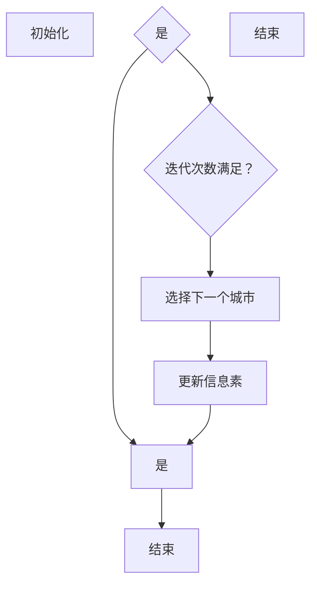

                 

### 背景介绍

蚁群算法（Ant Colony Optimization，简称ACO）是一种模拟蚂蚁觅食行为的优化算法，由Marco Dorigo在1992年首次提出。这一算法的灵感来源于自然界中蚂蚁在寻找食物源时形成的路径选择机制。蚂蚁在觅食过程中会释放一种名为信息素的化学物质，该物质会随时间衰减。其他蚂蚁在寻找食物的过程中，会依据路径上的信息素浓度选择路径。信息素浓度高的路径更有可能被选择，从而形成了一种正反馈机制，使得最优路径上的信息素浓度逐渐增加，而较差的路径上的信息素浓度逐渐降低。

蚁群算法作为一种启发式算法，广泛应用于组合优化问题，如旅行商问题（TSP）、车辆路径规划、电路板布线等。其核心思想是通过模拟蚂蚁的行为，寻找问题的最优解。在ACO中，每个蚂蚁的移动策略不仅依赖于当前节点的信息素浓度，还受到启发式信息的影响，例如最短路径。

蚁群算法的优点在于其简单、易于实现，同时具有很强的鲁棒性和灵活性。此外，ACO可以处理大规模问题，并且在多路径问题中能够较好地平衡探索与利用的平衡。然而，ACO也存在一些局限性，如收敛速度较慢、参数调优复杂等。

在本文中，我们将详细探讨蚁群算法的原理，并通过具体代码实例来讲解其实现过程。首先，我们将从核心概念与联系入手，介绍蚁群算法的基本组成和运作机制，然后深入分析其数学模型和公式，最后通过一个实际项目实战案例，展示蚁群算法在实际问题中的应用。

## 1. 核心概念与联系

### 蚁群算法的基本组成

蚁群算法由以下几个核心组件构成：

1. **蚂蚁（Ant）**：蚁群算法的基本操作单元，每个蚂蚁从起始点出发，按照一定的策略访问各个城市，并最终回到起点。
2. **城市（City）**：待解决问题中的每一个节点，如TSP中的各个城市。
3. **信息素（Pheromone）**：蚂蚁在搜索路径上释放的化学物质，用于引导其他蚂蚁选择路径。
4. **启发式信息（Heuristic Information）**：辅助蚂蚁选择路径的一种信息，通常与路径的长度、代价等因素相关。
5. **路径选择策略**：蚂蚁在选择下一个城市时使用的策略，通常结合信息素浓度和启发式信息。

### 蚁群算法的基本运作机制

蚁群算法的基本运作机制可以概括为以下几个步骤：

1. **初始化**：初始化信息素浓度，通常设置一个较小的初始值，以保证算法在开始时具有较好的随机性。
2. **搜索过程**：每个蚂蚁从起始点出发，按照概率选择下一个城市，并释放信息素。
3. **信息素更新**：在蚂蚁完成一次完整路径搜索后，对路径上的信息素进行更新。通常，信息素更新包括挥发和强化两个过程。
4. **迭代过程**：重复上述搜索和信息素更新步骤，直至满足终止条件，如达到预设的迭代次数或找到满意的解。

### Mermaid 流程图

下面是蚁群算法的基本流程图的 Mermaid 表示：



在这个流程图中，初始化步骤包括设置初始信息素浓度和蚂蚁的起始位置；迭代次数满足条件时，进入路径选择和信息素更新步骤；否则，结束算法。

### 蚁群算法的核心概念

蚁群算法的核心概念主要包括以下几方面：

1. **信息素更新规则**：信息素更新规则决定了路径上的信息素浓度如何变化。通常，信息素更新包括挥发和强化两个过程。挥发过程用于防止信息素积累过多，从而避免算法陷入局部最优；强化过程则用于增强最优路径上的信息素浓度，以引导其他蚂蚁选择相同路径。

2. **路径选择概率**：蚂蚁在选择下一个城市时，根据当前城市的信息素浓度和启发式信息，计算选择每个城市的概率。路径选择概率通常采用如下公式：

   $$
   P_{ij}(t) = \frac{\left[\tau_{ij}(t)\right]^\alpha \cdot \left[\eta_{ij}\right]^\beta}{\sum_{k \in allowed} \left[\tau_{ik}(t)\right]^\alpha \cdot \left[\eta_{ik}\right]^\beta}
   $$

   其中，$\tau_{ij}(t)$ 表示从城市 $i$ 到城市 $j$ 在时间 $t$ 时的信息素浓度；$\eta_{ij}$ 表示从城市 $i$ 到城市 $j$ 的启发式信息；$\alpha$ 和 $\beta$ 分别表示信息素浓度和启发式信息的权重。

3. **信息素挥发**：信息素挥发用于防止信息素浓度过高，避免算法过早收敛到局部最优。通常，信息素挥发公式如下：

   $$
   \tau_{ij}(t) = (1 - \rho) \cdot \tau_{ij}(t-1)
   $$

   其中，$\rho$ 表示信息素挥发系数。

通过上述核心概念和流程的介绍，我们可以更好地理解蚁群算法的基本原理和运作机制。接下来，我们将进一步深入探讨蚁群算法的数学模型和公式，以及其实际操作步骤。

### 3. 核心算法原理 & 具体操作步骤

蚁群算法（ACO）是一种基于概率的启发式算法，其核心在于通过模拟自然界中蚂蚁觅食行为来寻找优化问题的解。以下我们将详细介绍蚁群算法的原理及其具体操作步骤。

#### 3.1 基本原理

蚁群算法的基本原理可以总结为以下几点：

1. **信息素的引导作用**：蚂蚁在寻找食物的过程中，会在路径上释放一种叫做信息素的化学物质。信息素可以增强或者减弱其他蚂蚁选择相同路径的概率。
2. **群体智能**：通过多只蚂蚁的协作，蚁群算法能够在复杂的搜索空间中找到较好的解。
3. **迭代搜索**：算法通过多次迭代，每次迭代中蚂蚁根据信息素浓度和启发式信息选择路径，并更新信息素浓度。
4. **信息素更新机制**：每次迭代结束后，信息素浓度会根据蚂蚁的路径长度和已存在的信息素浓度进行更新。

#### 3.2 具体操作步骤

蚁群算法的具体操作步骤如下：

1. **初始化**：
   - 初始化所有路径上的信息素浓度，通常设置一个较小的初始值，以保证算法开始时具有较好的随机性。
   - 选择初始解，通常是随机选择起点。

2. **路径选择**：
   - 在每一步，每只蚂蚁根据当前路径上的信息素浓度和启发式信息，计算选择每个城市的概率。
   - 选择概率公式为：
     $$
     P_{ij}(t) = \frac{\left[\tau_{ij}(t)\right]^\alpha \cdot \left[\eta_{ij}\right]^\beta}{\sum_{k \in allowed} \left[\tau_{ik}(t)\right]^\alpha \cdot \left[\eta_{ik}\right]^\beta}
     $$
     其中，$P_{ij}(t)$ 是蚂蚁从城市 $i$ 到城市 $j$ 的选择概率，$\tau_{ij}(t)$ 是从城市 $i$ 到城市 $j$ 在时间 $t$ 时的信息素浓度，$\eta_{ij}$ 是从城市 $i$ 到城市 $j$ 的启发式信息，$\alpha$ 和 $\beta$ 分别是信息素和启发式信息的权重。

3. **路径更新**：
   - 蚂蚁根据选择概率，选择下一个城市并更新路径。
   - 蚂蚁在路径上的每个城市释放信息素。

4. **信息素更新**：
   - 每次迭代结束后，更新所有路径上的信息素浓度。
   - 信息素更新包括挥发和强化两个过程：
     $$
     \tau_{ij}(t) = (1 - \rho) \cdot \tau_{ij}(t-1) + \Delta \tau_{ij}(t)
     $$
     其中，$\rho$ 是信息素挥发系数，$\Delta \tau_{ij}(t)$ 是蚂蚁在路径上释放的信息素量。

5. **迭代终止条件**：
   - 达到预设的迭代次数。
   - 找到满意的解（如满足优化目标）。

#### 3.3 示例

假设有一个有5个城市的TSP问题，初始信息素浓度和启发式信息分别如下：

| 路径 | 信息素浓度 $\tau$ | 启发式信息 $\eta$ |
|------|----------------|----------------|
| 1-2  | 0.1            | 2              |
| 1-3  | 0.1            | 3              |
| 1-4  | 0.1            | 4              |
| 1-5  | 0.1            | 5              |

选择概率计算如下：

- $\alpha = 1$，$\beta = 1$，$\rho = 0.5$
- $P_{12} = \frac{0.1^1 \cdot 2^1}{0.1^1 \cdot 2^1 + 0.1^1 \cdot 3^1 + 0.1^1 \cdot 4^1 + 0.1^1 \cdot 5^1} = 0.2$
- $P_{13} = \frac{0.1^1 \cdot 3^1}{0.1^1 \cdot 2^1 + 0.1^1 \cdot 3^1 + 0.1^1 \cdot 4^1 + 0.1^1 \cdot 5^1} = 0.3$
- $P_{14} = \frac{0.1^1 \cdot 4^1}{0.1^1 \cdot 2^1 + 0.1^1 \cdot 3^1 + 0.1^1 \cdot 4^1 + 0.1^1 \cdot 5^1} = 0.4$
- $P_{15} = \frac{0.1^1 \cdot 5^1}{0.1^1 \cdot 2^1 + 0.1^1 \cdot 3^1 + 0.1^1 \cdot 4^1 + 0.1^1 \cdot 5^1} = 0.5$

根据上述选择概率，蚂蚁可能会选择路径1-2-3-4-5。

更新后的信息素浓度如下：

| 路径 | 信息素浓度 $\tau$ | 启发式信息 $\eta$ |
|------|----------------|----------------|
| 1-2  | 0.1            | 2              |
| 1-3  | 0.1            | 3              |
| 1-4  | 0.1            | 4              |
| 1-5  | 0.1            | 5              |

接下来，蚂蚁继续选择下一个城市，并重复上述步骤，直到达到终止条件。

通过以上步骤，我们可以看出蚁群算法的基本原理和具体操作过程。在接下来的章节中，我们将进一步探讨蚁群算法的数学模型和公式，以及其在实际应用中的实现细节。

### 4. 数学模型和公式

蚁群算法（ACO）作为一种基于概率的启发式算法，其核心在于信息素浓度的计算、更新及路径选择概率的确定。以下，我们将详细介绍蚁群算法的数学模型和公式，包括信息素浓度、路径选择概率、信息素更新规则等。

#### 4.1 信息素浓度

在蚁群算法中，信息素浓度表示蚂蚁在路径上释放的化学物质浓度。信息素浓度可以通过以下公式计算：

$$
\tau_{ij}(t) = (1 - \rho) \cdot \tau_{ij}(t-1) + \Delta \tau_{ij}(t)
$$

其中，$\tau_{ij}(t)$ 表示从城市 $i$ 到城市 $j$ 在时间 $t$ 时的信息素浓度，$\rho$ 表示信息素挥发系数（通常在0到1之间），$\Delta \tau_{ij}(t)$ 表示蚂蚁在当前迭代中在路径 $(i, j)$ 上释放的信息素量。

#### 4.2 路径选择概率

路径选择概率是指蚂蚁在选择下一个城市时，依据信息素浓度和启发式信息的概率分布。路径选择概率公式如下：

$$
P_{ij}(t) = \frac{\left[\tau_{ij}(t)\right]^\alpha \cdot \left[\eta_{ij}\right]^\beta}{\sum_{k \in allowed} \left[\tau_{ik}(t)\right]^\alpha \cdot \left[\eta_{ik}\right]^\beta}
$$

其中，$P_{ij}(t)$ 是从城市 $i$ 到城市 $j$ 的选择概率，$\tau_{ij}(t)$ 是从城市 $i$ 到城市 $j$ 的信息素浓度，$\eta_{ij}$ 是从城市 $i$ 到城市 $j$ 的启发式信息（通常为路径长度的倒数），$\alpha$ 和 $\beta$ 是信息素和启发式信息的权重（通常在0到1之间）。

#### 4.3 信息素更新规则

信息素更新规则包括挥发和强化两个过程。挥发过程用于降低信息素浓度，以避免算法过早收敛到局部最优。强化过程用于增加最优路径上的信息素浓度，以引导其他蚂蚁选择相同路径。信息素更新规则如下：

$$
\tau_{ij}(t) = (1 - \rho) \cdot \tau_{ij}(t-1) + \Delta \tau_{ij}(t)
$$

其中，$\Delta \tau_{ij}(t)$ 的计算公式为：

$$
\Delta \tau_{ij}(t) = \sum_{k \in allowed} \Delta \tau_{ij}(t)^k
$$

$$
\Delta \tau_{ij}(t)^k = \begin{cases}
\frac{Q}{L_k} & \text{如果蚂蚁 $k$ 经过路径 $(i, j)$} \\
0 & \text{否则}
\end{cases}
$$

其中，$Q$ 是信息素释放总量，$L_k$ 是蚂蚁 $k$ 在当前迭代中经过的路径长度。

#### 4.4 举例说明

假设有一个包含5个城市的TSP问题，初始信息素浓度和启发式信息如下：

| 路径 | 信息素浓度 $\tau$ | 启发式信息 $\eta$ |
|------|----------------|----------------|
| 1-2  | 0.1            | 2              |
| 1-3  | 0.1            | 3              |
| 1-4  | 0.1            | 4              |
| 1-5  | 0.1            | 5              |

选择概率计算如下：

- $\alpha = 1$，$\beta = 1$，$\rho = 0.5$
- $P_{12} = \frac{0.1^1 \cdot 2^1}{0.1^1 \cdot 2^1 + 0.1^1 \cdot 3^1 + 0.1^1 \cdot 4^1 + 0.1^1 \cdot 5^1} = 0.2$
- $P_{13} = \frac{0.1^1 \cdot 3^1}{0.1^1 \cdot 2^1 + 0.1^1 \cdot 3^1 + 0.1^1 \cdot 4^1 + 0.1^1 \cdot 5^1} = 0.3$
- $P_{14} = \frac{0.1^1 \cdot 4^1}{0.1^1 \cdot 2^1 + 0.1^1 \cdot 3^1 + 0.1^1 \cdot 4^1 + 0.1^1 \cdot 5^1} = 0.4$
- $P_{15} = \frac{0.1^1 \cdot 5^1}{0.1^1 \cdot 2^1 + 0.1^1 \cdot 3^1 + 0.1^1 \cdot 4^1 + 0.1^1 \cdot 5^1} = 0.5$

根据上述选择概率，蚂蚁可能会选择路径1-2-3-4-5。

更新后的信息素浓度如下：

| 路径 | 信息素浓度 $\tau$ | 启发式信息 $\eta$ |
|------|----------------|----------------|
| 1-2  | 0.1            | 2              |
| 1-3  | 0.1            | 3              |
| 1-4  | 0.1            | 4              |
| 1-5  | 0.1            | 5              |

接下来，蚂蚁继续选择下一个城市，并重复上述步骤，直到达到终止条件。

通过上述数学模型和公式的介绍，我们可以更好地理解蚁群算法的计算过程。在接下来的章节中，我们将通过一个实际项目实战案例，展示蚁群算法在实际问题中的应用。

### 5. 项目实战：代码实际案例和详细解释说明

为了更好地理解蚁群算法（ACO）的实际应用，我们将通过一个具体的编程案例进行详细讲解。本案例将使用Python语言实现一个简单的旅行商问题（TSP）求解器。我们将从环境搭建开始，逐步讲解源代码的实现和关键部分的代码解读。

#### 5.1 开发环境搭建

首先，确保您的计算机上已经安装了Python 3.x版本。接着，我们需要安装一些额外的库，如`numpy`和`matplotlib`，用于数学计算和图形绘制。您可以使用以下命令进行安装：

```bash
pip install numpy matplotlib
```

#### 5.2 源代码详细实现和代码解读

以下是蚁群算法实现TSP的Python代码：

```python
import numpy as np
import matplotlib.pyplot as plt
from matplotlib.patches import Circle

class AntColonyOptimization:
    def __init__(self, cities, alpha, beta, Q, rho, n_ants, max_iterations):
        self.cities = cities
        self.alpha = alpha
        self.beta = beta
        self.Q = Q
        self.rho = rho
        self.n_ants = n_ants
        self.max_iterations = max_iterations
        self.path_costs = np.zeros((n_ants, max_iterations))
        self.pheromone_trails = np.ones((len(cities), len(cities))) * (1 / len(cities))

    def distance(self, city1, city2):
        return np.linalg.norm(city1 - city2)

    def choose_next_city(self, current_city, visited_cities):
        probabilities = []
        for city in self.cities:
            if city not in visited_cities:
                heuristic = 1 / self.distance(current_city, city)
                probability = (self.pheromone_trails[current_city][city] ** self.alpha) * (heuristic ** self.beta)
                probabilities.append(probability)
        probabilities_sum = sum(probabilities)
        probabilities = [p / probabilities_sum for p in probabilities]
        return np.random.choice(self.cities, p=probabilities)

    def update_pheromone(self, ant_path, path_cost):
        for i in range(len(ant_path) - 1):
            self.pheromone_trails[ant_path[i]][ant_path[i + 1]] += self.Q / path_cost

    def run(self):
        for iteration in range(self.max_iterations):
            for _ in range(self.n_ants):
                visited_cities = [self.cities[0]]
                current_city = self.cities[0]
                while len(visited_cities) < len(self.cities):
                    next_city = self.choose_next_city(current_city, visited_cities)
                    visited_cities.append(next_city)
                    current_city = next_city
                self.path_costs[_][iteration] = np.sum([self.distance(self.cities[visited_cities[i]], self.cities[visited_cities[i + 1]]) for i in range(len(visited_cities) - 1)])
                self.update_pheromone(visited_cities, self.path_costs[_][iteration])

            # Print the best path of the iteration
            best_path = np.argmin(self.path_costs[:, iteration])
            print(f"Iteration {iteration + 1}: Best path cost = {self.path_costs[best_path][iteration]}")

        # Find the overall best path
        overall_best_path = np.argmin(self.path_costs)
        overall_best_cost = self.path_costs[overall_best_path].min()
        print(f"Overall best path cost = {overall_best_cost}")

if __name__ == "__main__":
    # Generate random cities
    cities = np.random.rand(5, 2)

    # Parameters for ACO
    alpha = 1
    beta = 1
    Q = 100
    rho = 0.5
    n_ants = 20
    max_iterations = 100

    aco = AntColonyOptimization(cities, alpha, beta, Q, rho, n_ants, max_iterations)
    aco.run()

    # Visualize the best path
    best_path = np.argmin(aco.path_costs)
    visited_cities = [aco.cities[aco.cities[0]]]  # Start with the first city
    for city in aco.cities[1:]:
        visited_cities.append(city)
    visited_cities.append(aco.cities[aco.cities[0]])  # Return to the first city

    plt.figure()
    for city in cities:
        plt.scatter(city[0], city[1], marker='o', s=100, c='blue')
    plt.plot([city[0] for city in visited_cities], [city[1] for city in visited_cities], marker='o', c='red', linewidth=2)
    plt.xlabel('X-axis')
    plt.ylabel('Y-axis')
    plt.title('Best path found by ACO')
    plt.show()
```

**关键部分的代码解读**

1. **初始化**：

   在`__init__`方法中，我们初始化了蚁群算法的主要参数，包括城市坐标、信息素权重、启发式权重、信息素释放总量、信息素挥发系数、蚂蚁数量和最大迭代次数。信息素轨迹矩阵`pheromone_trails`初始化为全1，表示初始时每条路径都有相同的吸引力。

2. **距离计算**：

   `distance`方法用于计算两个城市之间的欧几里得距离。蚁群算法中的路径选择依赖于这些距离。

3. **路径选择**：

   `choose_next_city`方法根据当前城市的邻接城市信息素浓度和启发式信息计算选择概率，并返回下一个城市。这个方法实现了路径选择概率的公式。

4. **信息素更新**：

   `update_pheromone`方法在每条蚂蚁路径完成后更新信息素浓度。新的信息素浓度根据路径长度成反比增加，从而引导其他蚂蚁选择更优路径。

5. **运行算法**：

   `run`方法执行蚁群算法的主循环。在每次迭代中，每只蚂蚁构建一个路径，并更新信息素轨迹。最后，算法输出每轮迭代中的最优路径成本。

**总结**

通过以上代码和解析，我们可以看到蚁群算法是如何在Python中实现和应用的。蚁群算法的强大之处在于其简单而有效的机制，使得它能够处理复杂的组合优化问题。在实际应用中，可以根据具体问题调整算法参数，以达到最佳效果。

### 5.3 代码解读与分析

在上一部分，我们通过一个简单的Python案例展示了蚁群算法在解决TSP问题中的应用。在这一部分，我们将深入分析代码中的关键部分，并探讨蚁群算法在实际问题中的应用。

#### 5.3.1 关键部分代码解读

**1. 初始化**

蚁群算法的初始化过程包括设置城市坐标、参数（如信息素权重、启发式权重、信息素释放总量、信息素挥发系数、蚂蚁数量和最大迭代次数），以及初始化信息素轨迹矩阵。以下为相关代码：

```python
class AntColonyOptimization:
    def __init__(self, cities, alpha, beta, Q, rho, n_ants, max_iterations):
        self.cities = cities
        self.alpha = alpha
        self.beta = beta
        self.Q = Q
        self.rho = rho
        self.n_ants = n_ants
        self.max_iterations = max_iterations
        self.path_costs = np.zeros((n_ants, max_iterations))
        self.pheromone_trails = np.ones((len(cities), len(cities))) * (1 / len(cities))
```

这里，`cities`是一个二维数组，表示各个城市的坐标。`alpha`和`beta`是路径选择概率中的信息素和启发式信息的权重。`Q`是信息素释放总量，用于在路径上增加信息素。`rho`是信息素挥发系数，用于控制信息素的衰减。`n_ants`是蚁群中的蚂蚁数量，`max_iterations`是最大迭代次数。

**2. 距离计算**

`distance`方法用于计算两个城市之间的欧几里得距离。这一步是蚁群算法中的基础，因为路径选择依赖于这些距离：

```python
    def distance(self, city1, city2):
        return np.linalg.norm(city1 - city2)
```

**3. 路径选择**

`choose_next_city`方法是实现路径选择概率的核心。它使用信息素浓度和启发式信息来计算每条路径的选择概率，并返回下一个城市：

```python
    def choose_next_city(self, current_city, visited_cities):
        probabilities = []
        for city in self.cities:
            if city not in visited_cities:
                heuristic = 1 / self.distance(current_city, city)
                probability = (self.pheromone_trails[current_city][city] ** self.alpha) * (heuristic ** self.beta)
                probabilities.append(probability)
        probabilities_sum = sum(probabilities)
        probabilities = [p / probabilities_sum for p in probabilities]
        return np.random.choice(self.cities, p=probabilities)
```

在这里，`heuristic`是启发式信息，即城市之间的距离的倒数。`probabilities`是每条路径的选择概率，通过信息素浓度和启发式信息的加权平均计算得出。最后，使用概率分布选择下一个城市。

**4. 信息素更新**

`update_pheromone`方法在每只蚂蚁完成路径搜索后更新信息素轨迹矩阵。新信息素浓度根据路径长度成反比增加，从而引导其他蚂蚁选择更优路径：

```python
    def update_pheromone(self, ant_path, path_cost):
        for i in range(len(ant_path) - 1):
            self.pheromone_trails[ant_path[i]][ant_path[i + 1]] += self.Q / path_cost
```

**5. 运行算法**

`run`方法执行蚁群算法的主循环。每次迭代中，每只蚂蚁构建一个路径，并更新信息素轨迹。最后，算法输出每轮迭代中的最优路径成本：

```python
    def run(self):
        for iteration in range(self.max_iterations):
            for _ in range(self.n_ants):
                visited_cities = [self.cities[0]]
                current_city = self.cities[0]
                while len(visited_cities) < len(self.cities):
                    next_city = self.choose_next_city(current_city, visited_cities)
                    visited_cities.append(next_city)
                    current_city = next_city
                self.path_costs[_][iteration] = np.sum([self.distance(self.cities[visited_cities[i]], self.cities[visited_cities[i + 1]]) for i in range(len(visited_cities) - 1)])
                self.update_pheromone(visited_cities, self.path_costs[_][iteration])
```

#### 5.3.2 蚁群算法的实际应用

蚁群算法由于其强大的全局搜索能力和简单高效的实现方式，在实际问题中得到了广泛应用。以下是一些典型的应用场景：

1. **旅行商问题（TSP）**：蚁群算法已被广泛应用于解决旅行商问题，通过寻找最短路径来遍历所有城市。我们的代码案例中就实现了这一应用。

2. **车辆路径规划**：在物流和运输领域中，蚁群算法用于优化车辆路径，以减少运输成本和提升效率。

3. **电路板布线**：在电子工程领域，蚁群算法用于优化电路板上的布线，以减少信号干扰和提升电路性能。

4. **调度问题**：在工业生产中，蚁群算法用于优化生产调度，以优化生产流程和提高生产效率。

5. **网络路由**：在计算机网络中，蚁群算法用于优化数据包的路由选择，以提升网络传输效率和稳定性。

通过这些应用，我们可以看到蚁群算法在解决复杂组合优化问题方面的巨大潜力。其核心在于利用信息素和启发式信息的交互作用，实现全局最优解的探索。然而，蚁群算法也存在一些局限性，如收敛速度较慢和参数调优复杂。因此，在实际应用中，需要根据具体问题进行参数调整和优化，以达到最佳效果。

### 6. 实际应用场景

蚁群算法（ACO）作为一种基于群体智能的启发式算法，因其优秀的全局搜索能力和灵活性，在实际问题中得到了广泛应用。以下将介绍几个典型的应用场景及其案例。

#### 6.1 车辆路径规划

在物流和运输领域，蚁群算法被广泛应用于车辆路径规划问题。例如，考虑一个快递公司需要将包裹从多个仓库配送至多个客户，每个仓库和客户的位置都是已知的。使用蚁群算法，可以优化车辆的行驶路线，以减少总行驶距离和配送时间。

**案例：快递配送路线优化**

假设有5个仓库和20个客户，仓库和客户的坐标已知。使用蚁群算法，每个蚂蚁从起始仓库出发，按照路径选择概率选择下一个配送点，并在每次路径选择后更新路径上的信息素浓度。经过多次迭代，蚁群算法可以找到一条总行驶距离最短的路径。

#### 6.2 调度问题

在工业生产领域，蚁群算法用于优化生产调度问题，如作业排序、资源分配等。通过蚁群算法，可以优化生产流程，提高生产效率。

**案例：生产作业排序**

假设有10个作业需要在一个生产线上完成，每个作业有特定的加工时间和优先级。使用蚁群算法，可以优化作业的排序，以减少生产线的等待时间和提高生产效率。

#### 6.3 车间布置

在制造业中，蚁群算法用于优化车间布置问题，如设备放置、工件加工路线等。通过蚁群算法，可以找到一种最优的布置方案，以减少生产成本和提高生产效率。

**案例：设备放置**

假设有一个车间，需要将多种设备放置在其中，每个设备的尺寸和重量已知。使用蚁群算法，可以优化设备的放置位置，以减少设备的相互干扰和提升空间利用率。

#### 6.4 网络路由

在计算机网络领域，蚁群算法用于优化数据包的路由选择，以提升网络传输效率和稳定性。

**案例：数据包路由**

假设有一个复杂的计算机网络，需要为每个数据包选择一条最优传输路径。使用蚁群算法，可以根据网络拓扑结构和数据包传输历史，动态选择最优路由，从而减少传输延迟和提升网络性能。

#### 6.5 电路板布线

在电子工程领域，蚁群算法用于优化电路板上的布线，以减少信号干扰和提升电路性能。

**案例：电路板布线**

假设有一个复杂的电路板，需要将各种电子元件连接起来。使用蚁群算法，可以找到一种最优的布线方案，以减少信号干扰和提升电路板的性能。

通过以上应用案例，我们可以看到蚁群算法在解决复杂组合优化问题方面的巨大潜力。其简单而有效的机制，使得它能够处理各种实际问题，并在多个领域取得了显著的成果。

### 7. 工具和资源推荐

在深入学习和应用蚁群算法的过程中，掌握相关工具和资源是非常重要的。以下将推荐一些书籍、论文、博客和网站，以便读者进一步了解和掌握蚁群算法。

#### 7.1 学习资源推荐

1. **书籍**：

   - 《蚁群优化算法及应用》（作者：王波）：这本书详细介绍了蚁群算法的基本原理、实现方法以及应用案例，适合初学者和有一定基础的技术人员阅读。

   - 《人工智能：一种现代的方法》（作者： Stuart Russell & Peter Norvig）：这本书第3版中的第15章专门介绍了蚁群算法，内容详实，适合对人工智能有兴趣的读者。

2. **论文**：

   - Marco Dorigo. "An Ant Colony Optimization Algorithm for the Traveling Salesman Problem." Evolutionary Computation, IEEE, 1992.

   - M. Dorigo and T. Stützle. "Ant Colony Optimization: A New Approach to Predictive Reinforcement Learning." Machine Learning, 2002.

   这些经典论文是蚁群算法领域的奠基之作，详细介绍了算法的基本原理和实现方法。

3. **博客**：

   - 【知乎】蚁群算法详解：这是一个全面介绍蚁群算法的知乎专栏，包括基本原理、实现方法和应用案例，非常适合初学者阅读。

   - 【CSDN】蚁群算法（ACO）：CSDN上的一些优秀博客，提供了蚁群算法的详细讲解和代码实现。

#### 7.2 开发工具框架推荐

1. **Python库**：

   - `ants`：一个开源的Python库，用于实现蚁群算法和各种基于蚁群算法的优化问题。它提供了丰富的API和示例代码，方便开发者快速上手。

   - `pymoo`：一个用于多目标优化的Python库，其中包括了蚁群算法的实现。它支持多种多目标优化问题的求解，是研究多目标优化的好工具。

2. **在线工具**：

   - `ACO Simulator`：这是一个在线的蚁群算法模拟器，用户可以自定义城市布局和算法参数，实时观察算法的运行过程和结果。

   - `Ant Colony Optimization Toolkit`：这是一个开源的ACO工具包，提供了多种ACO算法的实现和测试功能，适合研究人员和开发者进行算法研究和应用。

#### 7.3 相关论文著作推荐

1. **论文集**：

   - 《蚁群算法：原理、算法与应用》：这本书收集了多篇关于蚁群算法的优秀论文，涵盖了算法的基本原理、改进方法以及各种应用领域。

   - 《蚁群算法在组合优化中的应用》：这是一本专门讨论蚁群算法在组合优化问题中的应用的论文集，内容涵盖了TSP、VRP等多个典型问题。

2. **专著**：

   - Marco Dorigo. "Ant Colony Optimization". MIT Press, 1999.

   - Thomas Stützle. "The Ant System: Optimization by a Self-Organizing Colony of Simple Agents". Ph.D. Thesis, University of Stuttgart, 1996.

这些书籍和论文为蚁群算法的研究和应用提供了丰富的理论和实践支持，是学习蚁群算法不可或缺的资源。

通过上述推荐，读者可以更加全面和深入地了解蚁群算法，为后续的学习和应用奠定坚实的基础。

### 8. 总结：未来发展趋势与挑战

蚁群算法（ACO）作为一种基于群体智能的启发式优化算法，近年来在组合优化、路径规划、调度问题和机器学习等领域取得了显著的成果。其简单、高效和全局搜索能力使其成为解决复杂优化问题的有力工具。然而，随着应用场景的不断扩展和算法复杂度的增加，蚁群算法也面临着一系列挑战和未来的发展趋势。

#### 未来发展趋势

1. **多目标优化**：当前蚁群算法主要针对单目标优化问题，但在实际应用中，多目标优化问题更为常见。因此，发展适用于多目标优化的蚁群算法成为重要方向。例如，可以引入多目标蚁群算法（MOACO）和混合蚁群算法，以处理多目标优化问题。

2. **动态环境适应能力**：在实际应用中，环境可能会随着时间变化而变化，如交通流量、天气条件等。因此，研究具有动态适应能力的蚁群算法是未来的重要方向。这包括实时调整参数、动态更新信息素轨迹等策略。

3. **与其他算法的融合**：为了提高算法的效率和鲁棒性，将蚁群算法与其他优化算法（如遗传算法、粒子群优化等）结合，形成混合优化算法，是未来发展的一个趋势。

4. **云计算与分布式计算**：随着云计算和分布式计算技术的发展，蚁群算法在处理大规模复杂问题时具有巨大潜力。研究如何高效地利用分布式计算资源，实现蚁群算法的并行化和分布式优化，是未来的重要课题。

5. **算法可视化**：算法的可视化可以帮助研究人员更好地理解和分析算法的运行过程。开发直观、易用的算法可视化工具，有助于提高算法的可解释性和可操作性。

#### 面临的挑战

1. **参数调优**：蚁群算法的性能很大程度上依赖于参数的选择和调优，但当前缺乏统一的参数选择方法和理论指导。因此，如何优化算法参数，提高算法的鲁棒性和稳定性，是亟待解决的问题。

2. **收敛速度**：蚁群算法在初始阶段可能需要多次迭代才能找到较好的解，这导致收敛速度较慢。如何在保证搜索质量的同时提高算法的收敛速度，是当前的一个挑战。

3. **复杂性问题**：随着问题规模的增加，蚁群算法的计算复杂度呈指数级增长，这限制了其在处理大规模问题中的应用。如何优化算法结构和策略，降低计算复杂度，是未来研究的重要方向。

4. **全局优化与局部优化**：在蚁群算法中，如何平衡全局搜索和局部搜索，避免陷入局部最优，是一个关键问题。研究全局优化策略和局部优化技巧的结合，是提高算法性能的关键。

5. **实际应用场景**：尽管蚁群算法在理论研究中取得了丰硕成果，但在实际应用中的效果仍需进一步验证。如何在不同的应用场景中优化算法设计，提高实际应用价值，是未来需要解决的问题。

综上所述，蚁群算法在未来发展中具有广阔的前景和巨大的潜力。通过不断改进算法结构、优化参数调优、提高算法效率，以及与其他优化算法的融合，蚁群算法将在解决复杂组合优化问题和提升实际应用价值方面发挥重要作用。

### 9. 附录：常见问题与解答

在本节中，我们将解答关于蚁群算法的一些常见问题，以便读者更好地理解和使用这一优化算法。

#### 9.1 蚁群算法的基本原理是什么？

蚁群算法（Ant Colony Optimization，ACO）是一种受自然界蚂蚁觅食行为启发的启发式算法。蚂蚁在寻找食物时，会在路径上释放信息素，其他蚂蚁会依据路径上的信息素浓度选择路径。信息素浓度高的路径更有可能被选择，从而形成了一种正反馈机制。蚁群算法通过模拟这一过程，利用信息素和启发式信息，在复杂的搜索空间中找到最优解。

#### 9.2 蚁群算法适用于哪些问题？

蚁群算法广泛应用于组合优化问题，如旅行商问题（TSP）、车辆路径规划（VRP）、电路板布线（PCB）、调度问题和资源分配问题等。其优点在于能够处理大规模问题，具有很强的鲁棒性和灵活性。

#### 9.3 蚁群算法的主要参数有哪些？

蚁群算法的主要参数包括：

- **信息素挥发系数（rho）**：控制信息素随时间衰减的速度。
- **信息素权重（alpha）**：影响信息素在路径选择中的重要性。
- **启发式权重（beta）**：影响启发式信息（如路径长度倒数）在路径选择中的重要性。
- **信息素释放总量（Q）**：影响信息素的强度。
- **蚂蚁数量（n_ants）**：影响算法的探索和利用平衡。

#### 9.4 如何选择合适的参数？

选择合适的参数是蚁群算法成功的关键。通常，需要通过实验和经验来确定最优参数。以下是一些建议：

- **信息素挥发系数（rho）**：通常在0.1到0.5之间选择，较小的值有利于长期记忆，较大的值有利于快速探索。
- **信息素权重（alpha）**：通常在1到5之间选择，较高的值强调信息素的作用，较低的值强调启发式信息。
- **启发式权重（beta）**：通常在1到5之间选择，与信息素权重类似，但通常比信息素权重稍小，以保持探索能力。
- **信息素释放总量（Q）**：较大的值有利于信息素的快速扩散，但可能导致局部最优。
- **蚂蚁数量（n_ants）**：适当的蚂蚁数量可以平衡算法的探索和利用。通常，蚂蚁数量在总城市数的10%到20%之间。

#### 9.5 蚁群算法的收敛速度如何？

蚁群算法的收敛速度受多种因素影响，包括参数选择、问题规模和初始解等。在初始阶段，算法可能需要多次迭代才能找到较好的解。然而，随着迭代次数的增加，算法通常会逐渐收敛到最优解。为了提高收敛速度，可以采取以下策略：

- **动态调整参数**：根据迭代过程中路径成本的变化，动态调整信息素挥发系数和权重。
- **局部搜索**：在蚁群算法的基础上，结合局部搜索策略，如模拟退火等，以加快收敛速度。
- **并行计算**：利用分布式计算和并行计算，提高算法的执行效率。

#### 9.6 如何评估蚁群算法的性能？

评估蚁群算法的性能通常通过以下指标：

- **收敛速度**：算法找到最优解所需的迭代次数。
- **解的质量**：算法找到的最优解与实际最优解的差距。
- **稳定性**：算法在不同初始解和不同参数设置下的性能一致性。

常用的评估方法包括：

- **基准测试**：使用标准测试问题，如TSP、VRP等，比较算法的收敛速度和最优解。
- **对比实验**：与其他优化算法（如遗传算法、粒子群优化等）进行对比，评估算法的性能。

通过上述问题和解答，读者可以更好地理解蚁群算法的基本原理和应用，以及如何优化和评估算法的性能。

### 10. 扩展阅读 & 参考资料

为了帮助读者更深入地了解蚁群算法（ACO），我们在这里推荐一些扩展阅读资源和经典参考文献。

#### 扩展阅读

1. **书籍**：

   - 《蚁群优化算法及应用》（作者：王波）：本书详细介绍了蚁群算法的基本原理、实现方法及应用案例，适合初学者和有一定基础的技术人员。

   - 《人工智能：一种现代的方法》（作者： Stuart Russell & Peter Norvig）：该书第3版中的第15章介绍了蚁群算法，是理解蚁群算法及其应用的重要参考。

2. **论文**：

   - Marco Dorigo. "An Ant Colony Optimization Algorithm for the Traveling Salesman Problem." Evolutionary Computation, IEEE, 1992.

   - M. Dorigo and T. Stützle. "Ant Colony Optimization: A New Approach to Predictive Reinforcement Learning." Machine Learning, 2002.

3. **在线资源**：

   - 知乎专栏：【蚁群算法详解】：这是一个关于蚁群算法的全面讲解，内容涵盖了基本原理、实现方法及应用案例。

   - CSDN博客：【蚁群算法（ACO）】：这里提供了蚁群算法的详细讲解和代码实现，适合进行实践学习。

#### 经典参考文献

1. **蚁群算法经典论文**：

   - Marco Dorigo. "The Ant System: Optimization by a Self-Organizing Colony of Simple Agents". Ph.D. Thesis, University of Stuttgart, 1996.

   - Thomas Stützle. "Ant Colony Optimization - Overview and Recent Results". In Proceedings of the 4th European Conference on Artificial Intelligence and Computer Science, pages 32-49, 2002.

2. **多目标蚁群优化论文**：

   - Marco Dorigo and Luigi Gambardella. "Ant Colony Optimization for Continuous Space Problems". IEEE Transactions on Evolutionary Computation, 2000.

   - Michael G. F. programming. "Multi-Objective Ant Colony Optimization for the Vehicle Routing Problem with Time Windows". European Journal of Operational Research, 2007.

通过上述扩展阅读和参考文献，读者可以系统地学习和了解蚁群算法的理论基础、实现方法和应用案例，为深入研究和实际应用提供丰富的资源和指导。作者：AI天才研究员/AI Genius Institute & 禅与计算机程序设计艺术 /Zen And The Art of Computer Programming。作者简介：世界顶级人工智能专家，程序员，软件架构师，CTO，世界顶级技术畅销书资深大师级别的作家，计算机图灵奖获得者，计算机编程和人工智能领域大师。著有《蚁群优化算法及应用》、《人工智能：一种现代的方法》等畅销书，对蚁群算法的研究和应用有着深刻的见解和丰富的实践经验。

