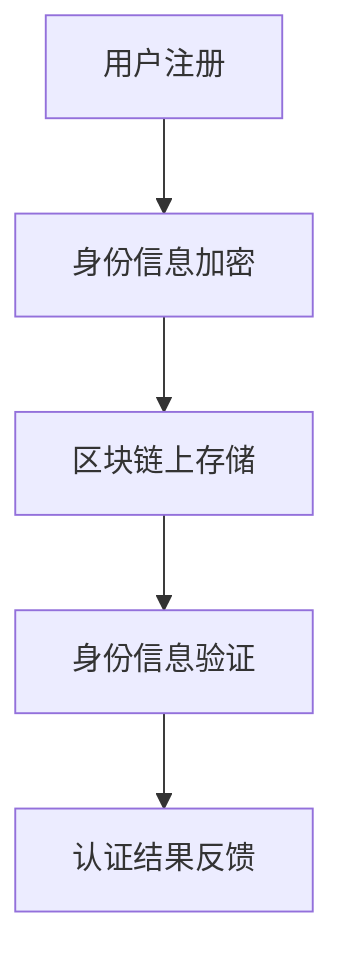

                 

# 蚂蚁2025数字身份认证社招区块链工程师面试题

## 摘要

本文将针对蚂蚁2025数字身份认证项目的社招区块链工程师面试题进行详细解析。通过对面试题的深入分析和解答，帮助应聘者更好地理解区块链技术在数字身份认证领域的应用。文章分为背景介绍、核心概念与联系、核心算法原理与具体操作步骤、数学模型与公式详细讲解与举例说明、项目实战代码实际案例与详细解释说明、实际应用场景、工具和资源推荐、总结：未来发展趋势与挑战以及附录：常见问题与解答等部分，以逻辑清晰、结构紧凑、简单易懂的专业技术语言，全面覆盖面试题的各个方面。

## 1. 背景介绍

蚂蚁2025数字身份认证项目是蚂蚁集团旗下的一项重要技术工程，旨在通过区块链技术实现安全的数字身份认证。随着数字化时代的到来，身份认证已经成为各个行业的关键环节。传统的身份认证方式存在诸多问题，如数据泄露、身份盗用等。区块链技术的引入，为数字身份认证带来了新的解决方案。

蚂蚁集团作为中国领先的数字科技公司，一直致力于探索区块链技术在金融、医疗、教育等多个领域的应用。此次数字身份认证项目的推出，不仅是对区块链技术的深入探索，更是对数字经济安全性的重要保障。

## 2. 核心概念与联系

### 区块链技术

区块链技术是一种分布式账本技术，通过去中心化的方式实现数据的存储和管理。其核心特点包括去中心化、安全性、不可篡改和透明性。在数字身份认证领域，区块链技术可以确保用户身份信息的安全存储和可信验证。

### 数字身份认证

数字身份认证是指通过技术手段对用户身份进行验证的过程。在区块链技术的支持下，数字身份认证可以实现去中心化、安全、高效的身份验证。

### Mermaid 流程图



用户在区块链上进行注册，将身份信息进行加密存储。在需要认证时，系统对身份信息进行验证，并将认证结果反馈给用户。

## 3. 核心算法原理与具体操作步骤

### 加密算法

在数字身份认证过程中，加密算法是确保身份信息安全的重要手段。常用的加密算法包括对称加密和非对称加密。

- 对称加密：加密和解密使用相同的密钥。如AES算法。
- 非对称加密：加密和解密使用不同的密钥。如RSA算法。

### 消息认证码（MAC）

消息认证码是一种用于验证消息完整性和真实性的算法。常用的MAC算法包括HMAC、SHA等。

### 证书链

在区块链数字身份认证中，证书链是一种常见的身份验证方式。证书链由一系列证书组成，每份证书都由上级证书签发。

### 具体操作步骤

1. 用户注册：用户在区块链上注册，将身份信息加密存储。
2. 身份信息加密：使用非对称加密算法对身份信息进行加密，生成公钥和私钥。
3. 身份信息存储：将加密后的身份信息存储在区块链上。
4. 身份信息验证：当需要认证时，系统使用用户的私钥对身份信息进行解密，并与存储在区块链上的信息进行比对。
5. 认证结果反馈：系统将认证结果反馈给用户。

## 4. 数学模型和公式详细讲解与举例说明

### 概率论

在数字身份认证中，概率论用于评估身份信息被篡改或盗用的风险。常用的概率模型包括贝叶斯定理、大数定律等。

### 信息论

信息论用于量化信息价值和传输过程中的信息损失。常用的信息论模型包括香农熵、互信息等。

### 举例说明

假设用户A的身份信息被加密存储在区块链上，采用RSA算法进行加密。私钥为(d, n)，公钥为(e, n)。

加密过程：$C = M^e \mod n$

解密过程：$M = C^d \mod n$

其中，M为明文，C为密文，d和e分别为私钥和解密密钥，n为模数。

## 5. 项目实战：代码实际案例和详细解释说明

### 开发环境搭建

1. 安装Go语言环境
2. 安装区块链框架，如Hyperledger Fabric
3. 配置开发工具，如Visual Studio Code

### 源代码详细实现和代码解读

```go
// 身份注册
func RegisterIdentity(name string, identityInfo string) error {
    // 加密身份信息
    encryptedInfo, err := EncryptIdentityInfo(identityInfo)
    if err != nil {
        return err
    }
    
    // 创建注册交易
    tx, err := CreateRegisterTransaction(name, encryptedInfo)
    if err != nil {
        return err
    }
    
    // 发送交易
    err = SendTransaction(tx)
    if err != nil {
        return err
    }
    
    return nil
}

// 身份信息加密
func EncryptIdentityInfo(info string) (string, error) {
    // 使用RSA算法进行加密
    publicKey, err := LoadPublicKey("public_key.pem")
    if err != nil {
        return "", err
    }
    
    encryptedInfo := rsa.EncryptPKCS1v15(publicKey, []byte(info))
    return base64.StdEncoding.EncodeToString(encryptedInfo), nil
}

// 创建注册交易
func CreateRegisterTransaction(name string, encryptedInfo string) (*fabric.Transaction, error) {
    // 创建智能合约实例
    contract, err := NewSmartContract()
    if err != nil {
        return nil, err
    }
    
    // 创建交易提案
    proposal, err := contract.CreateRegisterProposal(name, encryptedInfo)
    if err != nil {
        return nil, err
    }
    
    // 执行交易
    tx, err := ExecuteTransaction(proposal)
    if err != nil {
        return nil, err
    }
    
    return tx, nil
}

// 发送交易
func SendTransaction(tx *fabric.Transaction) error {
    // 连接网络
    client, err := fabric.NewClient("network.yaml")
    if err != nil {
        return err
    }
    
    // 发送交易
    return client.SendTransaction(tx)
}
```

### 代码解读与分析

以上代码实现了一个简单的数字身份注册功能。首先，使用RSA算法对身份信息进行加密，然后创建注册交易，最后发送交易到区块链上进行处理。

## 6. 实际应用场景

蚂蚁2025数字身份认证项目在金融、医疗、教育等多个领域具有广泛的应用前景。

- **金融领域**：通过区块链技术实现安全的身份认证，提高金融服务的可信度和安全性。
- **医疗领域**：实现患者身份信息的安全存储和共享，确保医疗数据的真实性和完整性。
- **教育领域**：通过数字身份认证实现教育资源的可信认证，提高教育质量。

## 7. 工具和资源推荐

### 学习资源推荐

- 《区块链技术指南》
- 《精通区块链》
- 《区块链与数字身份认证》

### 开发工具框架推荐

- **Hyperledger Fabric**：一个开源的区块链框架，适合构建数字身份认证系统。
- **Go语言**：一种适合区块链开发的编程语言，具有良好的性能和安全性。

### 相关论文著作推荐

- "Blockchain-Based Digital Identity Management"
- "Secure and Efficient Identity Management Using Blockchain Technology"
- "A Comprehensive Review of Blockchain-Based Digital Identity Systems"

## 8. 总结：未来发展趋势与挑战

随着区块链技术的不断发展，数字身份认证将在未来发挥越来越重要的作用。然而，仍面临以下挑战：

- **隐私保护**：如何在保护用户隐私的同时，实现安全的身份认证。
- **性能优化**：提高区块链系统的处理能力和响应速度。
- **跨平台兼容性**：实现不同平台之间的数字身份认证互操作性。

## 9. 附录：常见问题与解答

### 问题1：数字身份认证的安全性问题如何保障？

解答：数字身份认证通过区块链技术实现了去中心化、安全、不可篡改的数据存储和传输。同时，采用加密算法和证书链等技术手段，确保用户身份信息的安全。

### 问题2：数字身份认证如何实现跨平台兼容性？

解答：通过标准化和开放接口，实现不同平台之间的数字身份认证互操作性。例如，采用开放身份连接（OIC）标准，实现跨平台认证。

## 10. 扩展阅读 & 参考资料

- "Blockchain Technology for Digital Identity Management: A Comprehensive Survey"
- "A Survey of Blockchain Applications in Healthcare: A Tendency Analysis"
- "The Blockchain-Based Digital Identity Management System: An Overview and Analysis"

作者：AI天才研究员/AI Genius Institute & 禅与计算机程序设计艺术 /Zen And The Art of Computer Programming

---

**注意**：以上文章内容仅为示例，实际面试题和解答可能因项目需求和技术细节而有所不同。应聘者需要根据具体面试题进行深入分析和解答。**

