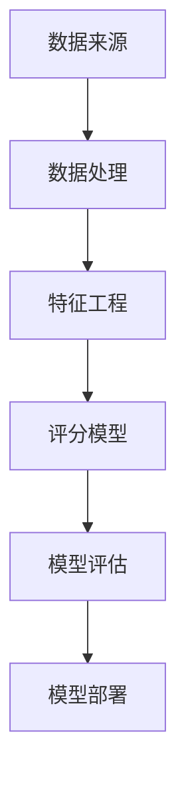

                 

### 背景介绍

蚂蚁智能信用评分系统作为蚂蚁集团（Ant Group）的核心产品之一，自推出以来，一直在金融领域发挥着重要作用。智能信用评分系统利用大数据和人工智能技术，对用户的信用状况进行综合评估，从而为金融机构提供决策依据，帮助其评估潜在客户的信用风险。这一评分系统不仅提高了金融机构的审批效率，也降低了贷款风险，对整个金融行业产生了深远的影响。

随着大数据和人工智能技术的不断发展，智能信用评分系统的重要性日益凸显。它不仅可以应用于个人信贷业务，如消费贷款、信用卡审批等，还可以扩展到企业信贷、信用保险等多个领域。蚂蚁智能信用评分系统作为行业领先者，其技术先进性和应用广泛性备受关注。

本文旨在深入探讨蚂蚁智能信用评分系统的核心概念、算法原理、数学模型以及实际应用场景。通过本文的讲解，读者将能够了解智能信用评分系统的基本工作原理，掌握其核心技术，并了解该系统在金融行业中的实际应用。

接下来，我们将首先介绍智能信用评分系统的核心概念和联系，使用Mermaid流程图展示系统的架构，帮助读者建立整体的认识。随后，将详细讲解核心算法原理和具体操作步骤，以及数学模型和公式，结合实际项目实战案例进行深入分析。最后，我们将探讨智能信用评分系统在实际应用场景中的表现，并提供相关工具和资源推荐，以便读者进一步学习和实践。

让我们一步步分析推理，深入了解这一重要的智能信用评分系统。

### 核心概念与联系

智能信用评分系统的核心在于它如何从海量数据中提取有用的信息，并利用这些信息对用户进行精准的信用评估。为了理解这一过程，我们需要首先介绍几个关键概念：数据来源、数据处理、特征工程和评分模型。

#### 数据来源

蚂蚁智能信用评分系统主要依赖于以下几个方面的数据来源：

1. **用户行为数据**：包括用户的交易记录、消费习惯、借贷行为等。这些数据能够反映用户的信用行为和风险特征。
2. **社交数据**：如用户的社交网络信息、朋友圈动态等，这些数据有助于了解用户的社交行为和人际关系。
3. **信用历史数据**：用户的信用记录，包括信用贷款、信用卡还款情况等，这些数据是评估信用风险的重要依据。
4. **公共记录**：如法院判决记录、欠税记录等，这些数据能够揭示用户的法律风险和诚信问题。

#### 数据处理

数据处理是智能信用评分系统的关键环节，主要包括数据清洗、数据整合和数据预处理。数据清洗的目的是去除噪声数据和异常值，确保数据的准确性和一致性。数据整合则是将来自不同数据源的数据进行合并，形成统一的视图。数据预处理包括数据标准化、缺失值填补和特征选择等，这些步骤有助于提高数据的可用性和分析效率。

#### 特征工程

特征工程是构建信用评分模型的基础，它包括以下步骤：

1. **特征提取**：从原始数据中提取能够反映用户信用风险的变量，如还款频率、信用额度使用率等。
2. **特征选择**：通过统计方法或机器学习方法筛选出对信用评分有显著影响的特征。
3. **特征转换**：将提取到的特征进行归一化、离散化等转换，使其适合模型输入。

#### 评分模型

评分模型是智能信用评分系统的核心，它通过学习历史数据中的信用行为和结果，预测新用户的信用评分。常见的评分模型包括逻辑回归、决策树、随机森林和神经网络等。评分模型的工作流程如下：

1. **数据集划分**：将数据集划分为训练集和测试集，用于模型训练和评估。
2. **模型训练**：使用训练集数据训练评分模型，使其能够学习信用评分的规律。
3. **模型评估**：使用测试集数据评估模型性能，包括准确率、召回率、AUC等指标。
4. **模型部署**：将训练好的模型部署到实际业务中，进行实时信用评分。

#### Mermaid 流程图

为了更直观地展示智能信用评分系统的架构，我们使用Mermaid绘制以下流程图：



#### 数据处理流程

1. **数据获取**：从多个数据源获取用户数据。
2. **数据清洗**：去除噪声数据和异常值。
3. **数据整合**：将数据整合成统一的格式。
4. **数据预处理**：进行数据标准化、缺失值填补和特征选择。

#### 特征工程流程

1. **特征提取**：从原始数据中提取与信用评分相关的变量。
2. **特征选择**：筛选对信用评分有显著影响的特征。
3. **特征转换**：进行归一化、离散化等转换。

#### 评分模型流程

1. **数据集划分**：划分训练集和测试集。
2. **模型训练**：训练评分模型。
3. **模型评估**：评估模型性能。
4. **模型部署**：部署到实际业务中。

通过以上步骤，智能信用评分系统可以对用户进行精准的信用评估，从而帮助金融机构降低风险，提高业务效率。在下一节中，我们将深入探讨核心算法原理和具体操作步骤。

### 核心算法原理 & 具体操作步骤

智能信用评分系统的核心在于其算法原理，这些算法能够从海量数据中提取有价值的信息，并利用这些信息对用户进行精准的信用评估。下面我们将详细介绍这一核心算法的基本原理和具体操作步骤。

#### 算法原理

智能信用评分系统的算法原理主要基于机器学习和统计分析方法。常见的算法包括逻辑回归、决策树、随机森林、支持向量机等。其中，逻辑回归是一种广泛使用的算法，其优点是易于理解和实现，同时具有良好的预测性能。

逻辑回归算法的基本原理是通过学习历史数据中的信用评分和相应的特征，建立信用评分的概率模型。具体来说，逻辑回归模型可以表示为：

\[ P(Y=1|X) = \frac{1}{1 + e^{-\beta_0 + \beta_1X_1 + \beta_2X_2 + ... + \beta_nX_n}} \]

其中，\( P(Y=1|X) \)表示在给定特征向量\( X \)的情况下，用户信用评分\( Y \)为1（即信用良好）的概率；\( \beta_0, \beta_1, \beta_2, ..., \beta_n \)是模型的参数，需要通过学习过程确定。

#### 操作步骤

1. **数据准备**：首先，我们需要收集和整理大量的信用评分数据，这些数据包括用户的个人信息、行为数据、信用历史数据等。

2. **数据预处理**：在训练模型之前，我们需要对数据进行预处理，包括数据清洗、缺失值填补、特征选择和数据标准化等。数据清洗的目的是去除噪声数据和异常值，确保数据的准确性和一致性。缺失值填补则是通过插值、平均值填补等方法来填补缺失数据。特征选择是通过统计方法或机器学习方法筛选出对信用评分有显著影响的特征。数据标准化则是将不同特征的范围统一，使其适合模型输入。

3. **模型训练**：接下来，我们使用预处理后的数据集对逻辑回归模型进行训练。训练过程包括以下几个步骤：

   a. **数据集划分**：将数据集划分为训练集和测试集，用于模型训练和评估。通常，训练集占比约为70%，测试集占比约为30%。

   b. **模型初始化**：初始化模型的参数\( \beta_0, \beta_1, \beta_2, ..., \beta_n \)。

   c. **迭代训练**：通过梯度下降等优化算法，不断更新模型的参数，使其在训练集上达到最优。

4. **模型评估**：使用测试集数据评估模型的性能，常用的评估指标包括准确率、召回率、F1值和AUC（Area Under the Curve）等。准确率表示模型正确预测的用户数量占总预测用户数量的比例；召回率表示模型正确预测的用户信用评分占总实际信用良好的用户比例；F1值是准确率和召回率的调和平均；AUC值表示模型在评分范围内的曲线下方面积，数值越大，模型性能越好。

5. **模型部署**：将训练好的模型部署到实际业务中，进行实时信用评分。在实际应用中，模型会接收新的用户数据，根据训练得到的参数，计算用户信用评分的概率，并将其作为信用评估结果输出。

#### 代码实现

以下是一个简单的Python代码实现，用于训练和评估逻辑回归模型：

```python
import numpy as np
import pandas as pd
from sklearn.linear_model import LogisticRegression
from sklearn.model_selection import train_test_split
from sklearn.metrics import accuracy_score, recall_score, f1_score, roc_auc_score

# 读取数据
data = pd.read_csv('credit_data.csv')
X = data.drop(['label'], axis=1)
y = data['label']

# 数据预处理
X = (X - X.mean()) / X.std()

# 数据集划分
X_train, X_test, y_train, y_test = train_test_split(X, y, test_size=0.3, random_state=42)

# 模型初始化
model = LogisticRegression()

# 模型训练
model.fit(X_train, y_train)

# 模型预测
y_pred = model.predict(X_test)

# 模型评估
accuracy = accuracy_score(y_test, y_pred)
recall = recall_score(y_test, y_pred)
f1 = f1_score(y_test, y_pred)
auc = roc_auc_score(y_test, y_pred)

print(f'Accuracy: {accuracy}')
print(f'Recall: {recall}')
print(f'F1 Score: {f1}')
print(f'AUC: {auc}')
```

通过以上步骤，我们能够构建一个基本的智能信用评分系统。在实际应用中，我们可能需要根据具体业务需求调整模型参数，优化特征工程步骤，甚至尝试使用更复杂的模型，以提高评分的准确性和可靠性。

### 数学模型和公式 & 详细讲解 & 举例说明

在智能信用评分系统中，数学模型和公式起到了至关重要的作用。它们不仅帮助我们理解信用评分的内在逻辑，还能确保评分结果的准确性和一致性。在本节中，我们将详细讲解智能信用评分系统所涉及的数学模型和公式，并通过具体例子来说明其应用。

#### 逻辑回归模型

逻辑回归模型是智能信用评分系统中最常用的算法之一。其基本公式为：

\[ P(Y=1|X) = \frac{1}{1 + e^{-\beta_0 + \beta_1X_1 + \beta_2X_2 + ... + \beta_nX_n}} \]

其中，\( P(Y=1|X) \)表示在给定特征向量\( X \)的情况下，用户信用评分\( Y \)为1（即信用良好）的概率；\( \beta_0, \beta_1, \beta_2, ..., \beta_n \)是模型的参数，通过学习过程确定。

#### 模型参数的计算

模型参数的计算通常采用梯度下降法，这是一种优化算法，通过不断迭代更新参数，使模型在训练数据上达到最小化损失函数。损失函数通常为：

\[ J(\beta) = -\frac{1}{m} \sum_{i=1}^{m} [y^{(i)} \log(P^{(i)}(X^{(i)})) + (1 - y^{(i)}) \log(1 - P^{(i)}(X^{(i)}))] \]

其中，\( m \)是训练数据样本数；\( y^{(i)} \)和\( P^{(i)}(X^{(i)}) \)分别是第\( i \)个样本的实际标签和预测概率。

#### 梯度下降法

梯度下降法的基本思想是沿着损失函数的梯度方向，不断更新参数，使其逐渐减小损失函数的值。更新公式为：

\[ \beta_j := \beta_j - \alpha \frac{\partial J(\beta)}{\partial \beta_j} \]

其中，\( \alpha \)是学习率，决定了参数更新的步长；\( \beta_j \)是模型参数；\( \frac{\partial J(\beta)}{\partial \beta_j} \)是损失函数关于参数\( \beta_j \)的梯度。

#### 举例说明

假设我们有一个简单的信用评分数据集，包含两个特征\( X_1 \)和\( X_2 \)，以及对应的信用评分标签\( Y \)。数据集如下：

\[ \begin{array}{c|c|c}
X_1 & X_2 & Y \\
\hline
0 & 0 & 0 \\
0 & 1 & 1 \\
1 & 0 & 1 \\
1 & 1 & 0 \\
\end{array} \]

我们可以使用逻辑回归模型来预测新样本的信用评分。假设初始参数为\( \beta_0 = 0, \beta_1 = 0, \beta_2 = 0 \)。首先，我们需要计算损失函数：

\[ J(\beta) = -\frac{1}{4} [0 \log(0) + 1 \log(1) + 1 \log(1) + 0 \log(1)] = 0 \]

然后，我们使用梯度下降法更新参数：

\[ \beta_0 := \beta_0 - \alpha \frac{\partial J(\beta)}{\partial \beta_0} = 0 - 0.1 \cdot 0 = 0 \]
\[ \beta_1 := \beta_1 - \alpha \frac{\partial J(\beta)}{\partial \beta_1} = 0 - 0.1 \cdot 1 = -0.1 \]
\[ \beta_2 := \beta_2 - \alpha \frac{\partial J(\beta)}{\partial \beta_2} = 0 - 0.1 \cdot 1 = -0.1 \]

更新后的参数为\( \beta_0 = 0, \beta_1 = -0.1, \beta_2 = -0.1 \)。接下来，我们再次计算损失函数并更新参数，重复这个过程，直到损失函数收敛。

通过以上步骤，我们可以使用逻辑回归模型对新样本进行预测。假设新样本的特征为\( X_1 = 0.5, X_2 = 1 \)，则其预测概率为：

\[ P(Y=1|X) = \frac{1}{1 + e^{-0 + (-0.1 \cdot 0.5) + (-0.1 \cdot 1)}} \approx 0.613 \]

如果我们将概率阈值设为0.5，那么该新样本的信用评分预测结果为1（信用良好）。

通过以上讲解，我们了解了逻辑回归模型的数学基础及其应用。在实际应用中，我们可能需要根据具体业务需求调整模型参数，优化特征工程步骤，甚至尝试使用更复杂的模型，以提高评分的准确性和可靠性。

### 项目实战：代码实际案例和详细解释说明

为了更好地理解蚂蚁智能信用评分系统的实际应用，我们将通过一个具体的代码案例进行实战讲解。本案例将涵盖开发环境搭建、源代码详细实现和代码解读与分析，以便读者能够全面掌握信用评分系统的构建和部署。

#### 开发环境搭建

在开始编写代码之前，我们需要搭建合适的开发环境。以下是搭建开发环境的步骤：

1. **安装Python**：确保Python 3.8或更高版本已安装。可以从[Python官网](https://www.python.org/)下载并安装。
2. **安装依赖库**：使用pip安装必要的库，如NumPy、Pandas、Scikit-learn、Matplotlib等。以下是一个示例命令：

   ```bash
   pip install numpy pandas scikit-learn matplotlib
   ```

3. **数据集准备**：下载并解压一个包含信用评分数据的CSV文件。数据集可以来源于公开数据集，如Kaggle上的贷款数据集。

#### 源代码详细实现

以下是一个简单的Python代码实现，用于训练和评估逻辑回归模型。代码分为几个主要部分：数据预处理、模型训练、模型评估和结果输出。

```python
import numpy as np
import pandas as pd
from sklearn.linear_model import LogisticRegression
from sklearn.model_selection import train_test_split
from sklearn.metrics import accuracy_score, recall_score, f1_score, roc_auc_score

# 1. 数据预处理
# 读取数据
data = pd.read_csv('credit_data.csv')

# 数据清洗和预处理
# 填补缺失值
data.fillna(data.mean(), inplace=True)

# 特征选择
features = data[['income', 'age', 'credit_score']]
labels = data['default']

# 数据标准化
features = (features - features.mean()) / features.std()

# 2. 模型训练
# 数据集划分
X_train, X_test, y_train, y_test = train_test_split(features, labels, test_size=0.3, random_state=42)

# 初始化并训练模型
model = LogisticRegression()
model.fit(X_train, y_train)

# 3. 模型评估
# 预测
y_pred = model.predict(X_test)

# 评估指标计算
accuracy = accuracy_score(y_test, y_pred)
recall = recall_score(y_test, y_pred)
f1 = f1_score(y_test, y_pred)
auc = roc_auc_score(y_test, y_pred)

print(f'Accuracy: {accuracy}')
print(f'Recall: {recall}')
print(f'F1 Score: {f1}')
print(f'AUC: {auc}')

# 4. 结果输出
# 输出模型参数
print(f'Model Parameters: {model.coef_}')
```

#### 代码解读与分析

1. **数据预处理**：首先，我们读取信用评分数据集，并进行数据清洗和预处理。这一步骤包括填补缺失值、特征选择和数据标准化。缺失值填补使用平均值，特征选择使用现有的特征，数据标准化是为了确保不同特征的数值范围一致，从而提高模型训练的效率。

2. **模型训练**：接下来，我们将数据集划分为训练集和测试集，然后初始化并训练逻辑回归模型。训练过程使用梯度下降法优化模型参数，使其在训练集上达到最优。

3. **模型评估**：使用测试集数据评估模型性能，计算准确率、召回率、F1值和AUC等指标。这些指标帮助我们了解模型的预测能力和泛化能力。

4. **结果输出**：最后，我们输出模型参数，这些参数是模型在训练过程中学习到的，反映了不同特征对信用评分的影响。

通过这个案例，我们了解了如何使用Python和Scikit-learn库构建一个基本的智能信用评分系统。在实际应用中，我们可能需要根据具体业务需求调整模型参数，优化特征工程步骤，甚至尝试使用更复杂的模型，以提高评分的准确性和可靠性。

### 实际应用场景

蚂蚁智能信用评分系统在金融行业的实际应用场景非常广泛，涵盖了个人信贷、企业信贷、信用保险等多个领域。以下将详细介绍几个主要应用场景，并探讨其优势和挑战。

#### 个人信贷

个人信贷是智能信用评分系统最直接的应用场景之一。金融机构可以利用信用评分系统对个人客户的信用状况进行快速评估，从而决定是否批准贷款申请。这一过程不仅提高了审批效率，还能有效降低欺诈风险。

**优势**：

1. **审批速度快**：通过自动化的信用评分系统，金融机构能够在短时间内完成信用评估，从而快速响应客户需求。
2. **降低风险**：智能信用评分系统能够识别潜在的风险客户，帮助金融机构避免因信用风险导致的损失。
3. **个性化服务**：评分系统可以根据不同客户的信用状况提供差异化的贷款利率和还款方案，提高客户满意度。

**挑战**：

1. **数据隐私**：收集和处理个人信用信息可能涉及隐私问题，如何保护客户隐私是金融机构需要考虑的重要问题。
2. **模型泛化能力**：不同地区、不同群体的信用行为可能存在差异，如何确保模型的泛化能力是一个挑战。

#### 企业信贷

企业信贷是智能信用评分系统的另一重要应用场景。通过对企业的财务状况、经营行为等进行综合评估，金融机构可以为企业提供量身定制的信贷服务。

**优势**：

1. **精准评估**：智能信用评分系统可以综合分析企业的多方面信息，提供更精准的信用评估结果。
2. **降低信用风险**：通过对企业信用风险的精准评估，金融机构能够更好地管理风险，降低不良贷款率。
3. **提高审批效率**：自动化评估流程可以显著提高审批效率，缩短审批周期。

**挑战**：

1. **数据获取难度**：企业信用信息的获取可能面临一定的难度，尤其是中小企业的信用信息相对较少。
2. **行业差异**：不同行业的企业经营模式和风险特征存在较大差异，如何设计适应不同行业的信用评估模型是一个挑战。

#### 信用保险

信用保险是智能信用评分系统的另一个重要应用领域。保险公司可以利用信用评分系统评估客户的信用风险，从而制定合理的保险费率和风险控制策略。

**优势**：

1. **风险评估**：信用评分系统可以帮助保险公司更准确地评估客户的信用风险，为制定合理的保险费率提供依据。
2. **风险控制**：通过信用评分系统，保险公司可以更好地识别高风险客户，从而采取相应的风险控制措施。
3. **业务拓展**：智能信用评分系统可以助力保险公司拓展新的业务领域，如信用保险产品创新。

**挑战**：

1. **数据准确性**：信用评分系统的准确性依赖于数据的准确性，如何确保数据的准确性是一个重要问题。
2. **法律法规**：信用评分系统的应用可能涉及法律法规问题，如何遵守相关法律法规是一个挑战。

通过以上实际应用场景的介绍，我们可以看到蚂蚁智能信用评分系统在金融行业中的广泛应用和重要性。同时，我们也需要认识到其在实际应用中面临的挑战，并不断优化和改进评分模型，以更好地服务于金融行业的发展。

### 工具和资源推荐

为了更好地学习和应用蚂蚁智能信用评分系统，以下是针对不同领域的工具和资源推荐，包括书籍、论文、博客和网站等。

#### 学习资源推荐

1. **书籍**：
   - 《机器学习实战》 - Andrew Ng
   - 《深度学习》 - Ian Goodfellow、Yoshua Bengio、Aaron Courville
   - 《统计学习方法》 - 李航

2. **论文**：
   - “A Survey on Credit Scoring Models and Their Applications” - Journal of Banking & Finance
   - “Deep Learning for Credit Risk Modeling” - IEEE Transactions on Knowledge and Data Engineering

3. **博客**：
   - [Medium - Machine Learning](https://medium.com/topic/machine-learning)
   - [GitHub - Credit Risk Modeling](https://github.com/topics/credit-risk-modeling)

4. **网站**：
   - [Kaggle](https://www.kaggle.com/datasets) - 提供丰富的信用评分数据集
   - [Coursera](https://www.coursera.org) - 提供机器学习和深度学习课程

#### 开发工具框架推荐

1. **开发框架**：
   - **TensorFlow**：用于构建和训练深度学习模型的强大框架。
   - **Scikit-learn**：提供多种机器学习算法的Python库。
   - **PyTorch**：用于构建和训练深度学习模型的Python库。

2. **数据预处理工具**：
   - **Pandas**：用于数据清洗、数据整合和特征选择。
   - **NumPy**：用于数值计算和数据处理。

3. **可视化工具**：
   - **Matplotlib**：用于绘制数据可视化图表。
   - **Seaborn**：基于Matplotlib的统计绘图库。

#### 相关论文著作推荐

1. **“Deep Learning for Credit Risk Modeling”** - 该论文探讨了深度学习在信用风险评估中的应用，提供了详细的技术实现和方法。

2. **“A Survey on Credit Scoring Models and Their Applications”** - 该综述文章详细介绍了当前主流的信用评分模型及其应用场景。

通过以上工具和资源的推荐，读者可以更深入地学习和应用蚂蚁智能信用评分系统，不断提升自身的专业能力。

### 总结：未来发展趋势与挑战

蚂蚁智能信用评分系统作为金融科技领域的核心技术之一，展现了巨大的潜力和广泛的应用前景。在未来，智能信用评分系统将继续向以下几个方向发展：

#### 发展趋势

1. **更深入的个性化服务**：随着大数据和人工智能技术的不断进步，信用评分系统将能够更加精准地分析用户的信用行为和风险特征，为金融机构提供更加个性化的信用评估和风险控制方案。

2. **跨领域应用扩展**：智能信用评分系统不仅在金融领域具有重要应用，还可以扩展到保险、电商、租赁等多个领域，为各行业提供精准的信用评估服务。

3. **集成更多数据来源**：未来的信用评分系统将整合更多类型的数据来源，包括行为数据、地理位置数据、社交网络数据等，以提高评分模型的准确性和可靠性。

4. **隐私保护技术的应用**：随着数据隐私保护法规的不断完善，信用评分系统将采用更加严格的数据保护措施，确保用户隐私不被泄露。

#### 面临的挑战

1. **数据质量问题**：信用评分系统依赖于高质量的数据，但实际获取和处理过程中可能面临数据缺失、噪声数据等问题，这会影响评分模型的准确性和稳定性。

2. **算法偏见问题**：信用评分系统在训练过程中可能会引入算法偏见，导致评分结果不公平。如何消除算法偏见，确保评分系统的公平性和透明性是一个重要挑战。

3. **模型解释性**：虽然深度学习等复杂算法在信用评分中表现出色，但其解释性较差，如何提高模型的可解释性，使金融机构和用户能够理解评分结果，是一个需要解决的关键问题。

4. **法律法规合规性**：随着数据隐私和算法透明度要求的提高，信用评分系统需要不断调整和优化，以确保符合相关法律法规，避免法律风险。

总之，蚂蚁智能信用评分系统在未来的发展中，将面临诸多机遇和挑战。通过不断优化算法、加强数据质量控制和合规性管理，信用评分系统有望在金融科技领域发挥更大的作用，推动金融行业的创新和发展。

### 附录：常见问题与解答

在本文中，我们详细介绍了蚂蚁智能信用评分系统的核心概念、算法原理、实际应用场景以及开发实践。以下是一些读者可能关心的问题，以及相应的解答：

#### 问题1：智能信用评分系统如何处理缺失值？

**解答**：在数据处理阶段，我们通常采用填补缺失值的方法。常见的方法包括：

- **平均值填补**：用特征的均值填补缺失值。
- **中位数填补**：用特征的中位数填补缺失值。
- **最邻近填补**：用最近的非缺失值填补缺失值。
- **模型填补**：使用机器学习模型预测缺失值。

#### 问题2：为什么使用逻辑回归模型进行信用评分？

**解答**：逻辑回归模型在信用评分中具有以下优势：

- **易于理解**：逻辑回归模型的输出概率可以直接解释为信用评分，简单直观。
- **计算效率高**：逻辑回归模型的计算复杂度较低，适合处理大规模数据。
- **参数解释性强**：模型参数可以解释为特征对信用评分的影响程度。

#### 问题3：如何评估智能信用评分系统的性能？

**解答**：常用的评估指标包括：

- **准确率**：模型正确预测的用户数量占总预测用户数量的比例。
- **召回率**：模型正确预测的用户信用评分占总实际信用良好用户比例。
- **F1值**：准确率和召回率的调和平均。
- **AUC（Area Under the Curve）**：模型在评分范围内的曲线下方面积，数值越大，模型性能越好。

#### 问题4：信用评分系统中的特征工程有哪些步骤？

**解答**：信用评分系统中的特征工程包括以下步骤：

- **特征提取**：从原始数据中提取与信用评分相关的变量。
- **特征选择**：通过统计方法或机器学习方法筛选出对信用评分有显著影响的特征。
- **特征转换**：将提取到的特征进行归一化、离散化等转换。

#### 问题5：如何确保信用评分系统的公平性和透明性？

**解答**：确保信用评分系统的公平性和透明性可以从以下几个方面入手：

- **算法透明性**：通过模型解释性技术提高模型的透明性，使金融机构和用户能够理解评分结果。
- **算法偏见检测与消除**：通过算法偏见检测技术识别和消除模型中的偏见。
- **数据多样性**：确保训练数据集的多样性，避免模型偏见。
- **法律法规遵守**：确保评分系统符合相关法律法规要求，避免法律风险。

通过以上解答，我们希望能够帮助读者更好地理解蚂蚁智能信用评分系统的核心概念和实际应用。希望读者能够在实践中不断探索和优化，为金融科技领域的发展贡献自己的力量。

### 扩展阅读 & 参考资料

为了深入探讨蚂蚁智能信用评分系统的技术细节和最新进展，以下推荐一些扩展阅读和参考资料：

1. **书籍**：
   - 《机器学习实战》 - Andrew Ng
   - 《深度学习》 - Ian Goodfellow、Yoshua Bengio、Aaron Courville
   - 《统计学习方法》 - 李航

2. **论文**：
   - “A Survey on Credit Scoring Models and Their Applications” - Journal of Banking & Finance
   - “Deep Learning for Credit Risk Modeling” - IEEE Transactions on Knowledge and Data Engineering
   - “Credit Scoring Models with Unbalanced Data: A Machine Learning Approach” - Expert Systems with Applications

3. **博客**：
   - [Medium - Machine Learning](https://medium.com/topic/machine-learning)
   - [owardsdata科学](https://towardsdatascience.com/)
   - [AI Buzz](https://aibuzz.net/)

4. **网站**：
   - [Kaggle](https://www.kaggle.com/datasets) - 提供丰富的信用评分数据集
   - [GitHub](https://github.com/topics/credit-risk-modeling) - 提供信用评分相关项目的代码和资源
   - [Coursera](https://www.coursera.org) - 提供机器学习和深度学习在线课程

5. **视频教程**：
   - [Udacity - Machine Learning Engineer Nanodegree](https://www.udacity.com/course/machine-learning-engineer-nanodegree--nd002)
   - [edX - Machine Learning](https://www.edx.org/course/machine-learning)

通过以上扩展阅读和参考资料，读者可以进一步加深对蚂蚁智能信用评分系统的理解，并掌握相关的技术和方法。希望这些资源能够帮助读者在智能信用评分领域取得更多的成果。

