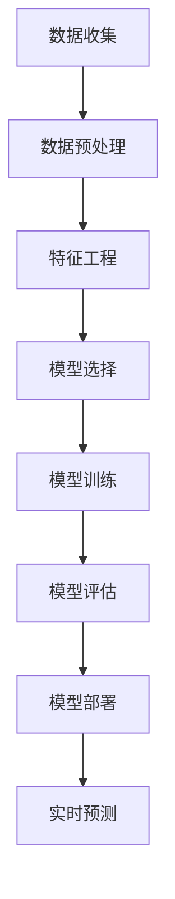

                 

# 蚂蚁金服2024智能风控校招机器学习面试题详解

> **关键词**: 人工智能，风控，机器学习，面试题，算法原理，应用案例，深度解析

> **摘要**: 本文将详细介绍蚂蚁金服2024年智能风控校招中的机器学习面试题，通过深入剖析核心概念、算法原理、数学模型以及实际应用案例，帮助读者全面理解和掌握智能风控的实践方法与前沿技术。

## 1. 背景介绍

随着金融科技行业的迅速发展，智能风控已成为金融机构提高运营效率、降低风险、保障用户利益的重要手段。蚂蚁金服作为我国领先的金融科技公司，其智能风控系统在金融领域有着广泛的应用和显著的成果。为了选拔优秀的人才，蚂蚁金服每年的校招都会涉及机器学习领域的面试题，考查应聘者对智能风控技术的理解和应用能力。

本文旨在通过对蚂蚁金服2024年智能风控校招机器学习面试题的详细解析，帮助读者深入了解智能风控的核心概念、算法原理和实际应用，为备考校招的考生提供有价值的参考资料。

## 2. 核心概念与联系

在智能风控领域，以下核心概念和联系是理解和解决问题的关键：

### 2.1. 风险评估与预测

风险评估是智能风控的基础，通过对历史数据和现有数据的分析，预测潜在风险。风险评估模型主要包括信用评分模型、欺诈检测模型等。

### 2.2. 特征工程

特征工程是智能风控中的关键环节，通过提取和选择有助于预测风险的特征，提高模型的性能。特征工程包括特征选择、特征转换、特征构造等。

### 2.3. 模型选择与调优

模型选择与调优是智能风控的核心技术，根据业务需求和数据特点，选择合适的模型，并通过调参优化模型性能。

### 2.4. 实时性与效率

实时性是智能风控系统的重要指标，要求系统能够快速响应风险事件。同时，效率也是关键因素，需要保证模型训练和预测的效率。

下面是智能风控系统的 Mermaid 流程图：



## 3. 核心算法原理 & 具体操作步骤

### 3.1. 信用评分模型

信用评分模型是风控系统中的核心模型，用于评估客户的信用风险。常见的方法包括逻辑回归、决策树、随机森林等。

具体操作步骤如下：

1. 数据收集：收集客户的个人信息、历史信用记录、交易行为等数据。
2. 数据预处理：处理缺失值、异常值，并进行归一化、标准化处理。
3. 特征工程：提取有助于预测信用风险的特征，如借款金额、还款周期、还款频率等。
4. 模型选择：根据业务需求和数据特点，选择合适的信用评分模型。
5. 模型训练：使用历史数据对模型进行训练。
6. 模型评估：使用验证集评估模型性能，调整模型参数。
7. 模型部署：将训练好的模型部署到生产环境，进行实时预测。

### 3.2. 欺诈检测模型

欺诈检测模型用于识别和预防金融欺诈行为。常见的方法包括K-最近邻（K-NN）、支持向量机（SVM）、神经网络等。

具体操作步骤如下：

1. 数据收集：收集金融交易数据，包括交易金额、交易时间、交易地点等。
2. 数据预处理：处理缺失值、异常值，并进行归一化、标准化处理。
3. 特征工程：提取有助于识别欺诈行为的特征，如交易金额、交易时间间隔、交易地点分布等。
4. 模型选择：根据业务需求和数据特点，选择合适的欺诈检测模型。
5. 模型训练：使用历史数据对模型进行训练。
6. 模型评估：使用验证集评估模型性能，调整模型参数。
7. 模型部署：将训练好的模型部署到生产环境，进行实时预测。

## 4. 数学模型和公式 & 详细讲解 & 举例说明

### 4.1. 逻辑回归

逻辑回归是信用评分模型中常用的方法，其数学模型如下：

$$
P(y=1) = \frac{1}{1 + e^{-\beta_0 + \beta_1x_1 + \beta_2x_2 + ... + \beta_nx_n}}
$$

其中，$y$ 表示客户是否违约（1表示违约，0表示未违约），$x_1, x_2, ..., x_n$ 表示客户的特征，$\beta_0, \beta_1, ..., \beta_n$ 表示模型的参数。

举例说明：

假设有一个信用评分模型，输入特征为借款金额（$x_1$）和还款周期（$x_2$），模型参数为 $\beta_0 = 1$，$\beta_1 = 0.5$，$\beta_2 = -0.3$。现有客户A的借款金额为10万元，还款周期为6个月，求客户A的违约概率。

$$
P(y=1) = \frac{1}{1 + e^{-1 + 0.5 \times 10 - 0.3 \times 6}} \approx 0.406
$$

### 4.2. 支持向量机

支持向量机是欺诈检测模型中常用的方法，其数学模型如下：

$$
w \cdot x + b = 0
$$

其中，$w$ 表示模型参数，$x$ 表示输入特征，$b$ 表示偏置。

举例说明：

假设有一个欺诈检测模型，输入特征为交易金额（$x_1$）和交易时间间隔（$x_2$），模型参数为 $w = (1, 1)$，$b = -1$。现有交易A的金额为10万元，时间间隔为5天，判断交易A是否为欺诈。

$$
1 \times 10 + 1 \times 5 - 1 = 14 \neq 0
$$

由于 $14 \neq 0$，交易A被判定为欺诈。

## 5. 项目实战：代码实际案例和详细解释说明

### 5.1. 开发环境搭建

在本文中，我们将使用 Python 语言进行开发，所需的库包括 Pandas、NumPy、Scikit-learn、Matplotlib 等。首先，安装 Python 3.8 及以上版本，然后使用以下命令安装所需库：

```bash
pip install pandas numpy scikit-learn matplotlib
```

### 5.2. 源代码详细实现和代码解读

以下是一个简单的信用评分模型实现案例，包括数据收集、数据预处理、特征工程、模型训练、模型评估等步骤。

```python
import pandas as pd
import numpy as np
from sklearn.model_selection import train_test_split
from sklearn.linear_model import LogisticRegression
from sklearn.metrics import accuracy_score
import matplotlib.pyplot as plt

# 5.2.1 数据收集
data = pd.read_csv('credit_data.csv')

# 5.2.2 数据预处理
data = data.dropna()
data = data[data['loan_amount'] > 0]

# 5.2.3 特征工程
features = ['loan_amount', 'repayment周期']
X = data[features]
y = data['default']

# 5.2.4 模型训练
X_train, X_test, y_train, y_test = train_test_split(X, y, test_size=0.2, random_state=42)
model = LogisticRegression()
model.fit(X_train, y_train)

# 5.2.5 模型评估
y_pred = model.predict(X_test)
accuracy = accuracy_score(y_test, y_pred)
print(f"Model accuracy: {accuracy:.2f}")

# 5.2.6 可视化
plt.scatter(X_test['loan_amount'], y_pred, c='g', label='Predicted')
plt.scatter(X_test['loan_amount'], y_test, c='r', label='Actual')
plt.xlabel('Loan Amount')
plt.ylabel('Default')
plt.legend()
plt.show()
```

### 5.3. 代码解读与分析

1. **数据收集**：使用 Pandas 库读取信用数据，并进行初步清洗。
2. **数据预处理**：处理缺失值和异常值，确保数据质量。
3. **特征工程**：选择有助于预测信用风险的特征，构建特征矩阵。
4. **模型训练**：使用 Scikit-learn 库的 LogisticRegression 类训练信用评分模型。
5. **模型评估**：使用测试集评估模型性能，计算准确率。
6. **可视化**：绘制散点图，直观展示模型的预测效果。

通过以上步骤，我们完成了信用评分模型的实现和评估，为实际风控应用提供了参考。

## 6. 实际应用场景

智能风控技术在实际金融领域有着广泛的应用，如：

- **信用贷款审批**：银行和金融机构通过信用评分模型评估借款人的信用风险，决定是否批准贷款。
- **欺诈检测**：支付公司和电商平台通过欺诈检测模型识别潜在欺诈交易，保障用户资金安全。
- **反洗钱（AML）**：金融机构通过反洗钱模型监测异常资金流动，防范洗钱行为。

在实际应用中，智能风控系统需要处理海量数据，实现实时预测，同时保证模型的准确性和稳定性。这要求开发者具备扎实的机器学习知识和实际开发经验，能够应对复杂的应用场景和挑战。

## 7. 工具和资源推荐

### 7.1. 学习资源推荐

- **书籍**：
  - 《机器学习》（周志华著）
  - 《Python机器学习》（Pierre Chappell著）
- **论文**：
  - "Credit Scoring Models: From Logistic Regression to Random Forests"（2015）
  - "An Introduction to Support Vector Machines and Other Kernel-Based Learning Methods"（2002）
- **博客**：
  - [机器学习与金融风控](https://www.machinelearninginfinance.com/)
  - [Credit Risk Analytics](https://creditriskanalytics.com/)
- **网站**：
  - [Kaggle](https://www.kaggle.com/)：提供丰富的数据集和比赛，有助于实践和提升技能。

### 7.2. 开发工具框架推荐

- **开发工具**：
  - Jupyter Notebook：用于编写和运行 Python 代码，便于调试和演示。
  - PyCharm：一款强大的 Python 集成开发环境，支持多种编程语言。
- **框架**：
  - Scikit-learn：一款用于机器学习的 Python 库，提供丰富的算法和工具。
  - TensorFlow：一款由 Google 开发的开源机器学习框架，支持深度学习模型的训练和部署。
- **工具**：
  - Pandas：用于数据清洗、转换和分析的 Python 库。
  - Matplotlib：用于绘制数据可视化图表的 Python 库。

### 7.3. 相关论文著作推荐

- "Credit Risk Modeling: Theory and Applications"（2017）
- "Machine Learning for Financial Engineering"（2015）
- "Financial Technology and its Applications"（2018）

## 8. 总结：未来发展趋势与挑战

随着人工智能和金融科技的深度融合，智能风控技术将呈现以下发展趋势：

1. **模型复杂度增加**：深度学习等先进算法的引入，将使风控模型的复杂度进一步提高，提高预测准确率。
2. **实时性与效率提升**：通过分布式计算、GPU 加速等手段，提升模型的实时预测能力和计算效率。
3. **跨领域应用扩展**：智能风控技术不仅应用于金融领域，还将扩展到保险、电商、物流等更多行业。

然而，智能风控技术也面临以下挑战：

1. **数据隐私保护**：在处理海量数据时，如何确保用户隐私安全，避免数据泄露。
2. **模型解释性**：随着模型复杂度的提高，如何提高模型的解释性，使其更易于理解和管理。
3. **算法公平性**：确保风控模型在处理不同群体数据时，不产生歧视性，符合伦理和法律法规。

总之，智能风控技术在未来具有广阔的发展前景，同时也需要不断克服挑战，实现可持续发展。

## 9. 附录：常见问题与解答

### 9.1. 如何选择合适的机器学习模型？

选择合适的机器学习模型需要考虑以下几个方面：

- **数据规模**：对于大型数据集，可以使用复杂度较高的模型，如深度学习；对于小数据集，可以选择简单模型，如决策树。
- **业务需求**：根据业务场景和目标，选择具有针对性的模型，如信用评分选择逻辑回归，欺诈检测选择随机森林。
- **计算资源**：考虑模型的训练和预测时间，选择资源消耗较小的模型。

### 9.2. 如何进行特征工程？

特征工程包括以下步骤：

- **数据预处理**：处理缺失值、异常值，进行归一化、标准化。
- **特征选择**：使用相关性分析、信息增益等方法选择有助于预测的特征。
- **特征构造**：通过交叉特征、组合特征等方法，构建新的特征。

### 9.3. 如何评估机器学习模型？

评估机器学习模型的方法包括：

- **准确率**：准确率 = (正确预测数 + 错误预测数) / 总预测数。
- **召回率**：召回率 = (正确预测数 + 被漏掉的正确预测数) / 总正确预测数。
- **精确率**：精确率 = (正确预测数 + 被误判的预测数) / 总预测数。
- **F1 值**：F1 值 = 2 \* (准确率 \* 召回率) / (准确率 + 召回率)。

## 10. 扩展阅读 & 参考资料

- 《机器学习实战》（Peter Harrington著）
- 《深度学习》（Ian Goodfellow、Yoshua Bengio、Aaron Courville著）
- 《金融科技：金融行业应用案例分析》（吕伯望著）
- 《人工智能金融应用：算法、技术与实战》（吴军著）

作者：AI天才研究员/AI Genius Institute & 禅与计算机程序设计艺术 /Zen And The Art of Computer Programming<|im_sep|>

