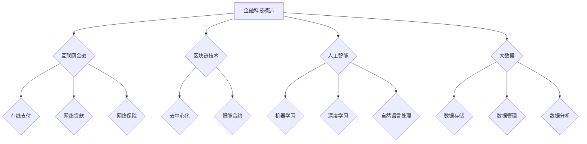

                 

# 蚂蚁金服2024校招金融科技创新工程师面试题集锦

## 关键词：
- 蚂蚁金服
- 校招
- 金融科技
- 创新工程师
- 面试题集锦

## 摘要：
本文将整理和分析蚂蚁金服2024年校招金融科技创新工程师的面试题集锦，包括核心概念、算法原理、数学模型、项目实战、应用场景、工具推荐以及未来发展趋势。旨在为准备校招的同学们提供全面、系统的复习资料和备考指导。

## 1. 背景介绍

蚂蚁金服（Ant Financial）是一家全球领先的金融科技公司，专注于金融科技创新和普惠金融服务。作为蚂蚁金服的重要环节，校招金融科技创新工程师的职位对于公司的人才储备和技术发展至关重要。该职位面向应届毕业生，要求具备扎实的计算机科学基础、创新思维和实践能力。

随着金融科技的快速发展，校招金融科技创新工程师的面试题越来越注重考查考生对金融科技领域的理解、算法能力、编程技巧以及解决问题的能力。本文将围绕这些关键点，对蚂蚁金服2024年校招金融科技创新工程师的面试题进行详细分析。

## 2. 核心概念与联系

### 2.1 金融科技概述

金融科技（FinTech）是指利用互联网、大数据、云计算、人工智能等新兴技术对传统金融业务进行改造和创新的领域。其核心概念包括：

- **互联网金融**：通过互联网实现金融服务，如在线支付、网络贷款、网络保险等。
- **区块链技术**：分布式账本技术，用于实现去中心化的数据存储和交易。
- **人工智能**：模拟人类智能的计算机技术，包括机器学习、深度学习、自然语言处理等。
- **大数据**：海量数据存储、管理和分析技术。

### 2.2 金融科技创新工程师职责

金融科技创新工程师主要负责：

- **技术研发**：负责金融科技产品的研发，如支付、贷款、保险等。
- **需求分析**：分析用户需求，设计符合业务需求的金融科技解决方案。
- **系统架构**：设计和优化金融科技系统的整体架构，确保系统的稳定性和可扩展性。
- **风险管理**：评估金融科技产品的风险，提出风险管理方案。

### 2.3 Mermaid 流程图



## 3. 核心算法原理 & 具体操作步骤

### 3.1 算法原理

金融科技创新工程师需要掌握以下核心算法原理：

- **排序算法**：快速排序、归并排序、堆排序等。
- **搜索算法**：二分搜索、广度优先搜索、深度优先搜索等。
- **动态规划**：解决最优子结构问题，如背包问题、最长公共子序列等。
- **图算法**：最小生成树、最短路径算法等。

### 3.2 具体操作步骤

以排序算法为例，具体操作步骤如下：

1. **输入数据**：读取待排序的数组。
2. **选择排序方式**：根据数据规模和特点选择合适的排序算法。
3. **执行排序**：按照排序算法的步骤对数据进行排序。
4. **输出结果**：返回排序后的数组。

### 3.3 Pseudo Code

```python
function sortArray(arr):
    # 选择排序算法
    if length(arr) <= 10:
        insertionSort(arr)
    else:
        quickSort(arr, 0, length(arr) - 1)
    return arr

function insertionSort(arr):
    for i from 1 to length(arr) - 1:
        key = arr[i]
        j = i - 1
        while j >= 0 and arr[j] > key:
            arr[j + 1] = arr[j]
            j = j - 1
        arr[j + 1] = key

function quickSort(arr, low, high):
    if low < high:
        pi = partition(arr, low, high)
        quickSort(arr, low, pi - 1)
        quickSort(arr, pi + 1, high)
```

## 4. 数学模型和公式 & 详细讲解 & 举例说明

### 4.1 数学模型

金融科技创新工程师需要掌握以下数学模型：

- **线性回归**：用于预测数值型变量之间的关系。
- **逻辑回归**：用于预测二元变量的概率。
- **决策树**：用于分类和回归问题。
- **神经网络**：用于复杂非线性问题的建模和预测。

### 4.2 公式

以线性回归为例，详细讲解和举例说明如下：

### 4.2.1 公式

$$
y = \beta_0 + \beta_1x_1 + \beta_2x_2 + \ldots + \beta_nx_n + \epsilon
$$

### 4.2.2 详细讲解

- $y$：因变量，表示预测目标。
- $x_1, x_2, \ldots, x_n$：自变量，表示影响因变量的因素。
- $\beta_0, \beta_1, \beta_2, \ldots, \beta_n$：回归系数，表示自变量对因变量的影响程度。
- $\epsilon$：误差项，表示模型无法解释的随机因素。

### 4.2.3 举例说明

假设我们要预测某股票的价格，选取了三个自变量：历史收盘价、成交量、市盈率。使用线性回归模型进行预测，公式如下：

$$
\text{股票价格} = \beta_0 + \beta_1\text{历史收盘价} + \beta_2\text{成交量} + \beta_3\text{市盈率} + \epsilon
$$

通过训练数据集，可以得到回归系数：

$$
\beta_0 = 10, \beta_1 = 0.5, \beta_2 = 0.2, \beta_3 = -0.1
$$

代入自变量值，预测股票价格：

$$
\text{股票价格} = 10 + 0.5 \times 20 + 0.2 \times 300 + (-0.1) \times 30 = 32
$$

预测结果为32元。

## 5. 项目实战：代码实际案例和详细解释说明

### 5.1 开发环境搭建

在开始项目实战之前，需要搭建以下开发环境：

- **编程语言**：Python
- **开发工具**：PyCharm
- **依赖库**：NumPy、Pandas、Scikit-learn等

### 5.2 源代码详细实现和代码解读

以下是一个简单的线性回归模型实现案例，用于预测股票价格：

```python
import numpy as np
import pandas as pd
from sklearn.linear_model import LinearRegression

# 加载数据
data = pd.read_csv('stock_price_data.csv')
X = data[['历史收盘价', '成交量', '市盈率']]
y = data['股票价格']

# 创建线性回归模型
model = LinearRegression()
model.fit(X, y)

# 模型参数
print('回归系数：', model.coef_)
print('截距：', model.intercept_)

# 预测
new_data = pd.DataFrame({
    '历史收盘价': [20],
    '成交量': [300],
    '市盈率': [30]
})
predicted_price = model.predict(new_data)
print('预测股票价格：', predicted_price)
```

### 5.3 代码解读与分析

- **加载数据**：使用Pandas读取股票价格数据。
- **数据预处理**：将自变量和因变量分离，其中自变量使用DataFrame结构。
- **创建模型**：使用Scikit-learn的LinearRegression类创建线性回归模型。
- **训练模型**：使用fit方法对模型进行训练。
- **模型参数**：输出回归系数和截距。
- **预测**：使用predict方法进行预测，并将预测结果输出。

## 6. 实际应用场景

金融科技创新工程师在实际工作中会面临多种应用场景，包括但不限于：

- **金融产品研发**：设计并开发新型的金融产品，如智能投顾、区块链支付等。
- **风险管理**：建立风险管理模型，评估金融产品的风险。
- **数据分析**：对海量金融数据进行分析，提取有价值的信息。
- **用户画像**：构建用户画像，为金融产品精准营销提供支持。

## 7. 工具和资源推荐

### 7.1 学习资源推荐

- **书籍**：《深入理解计算机系统》、《Python编程：从入门到实践》、《统计学习方法》
- **论文**：查看顶级会议和期刊，如NIPS、ICML、JMLR等。
- **博客**：关注金融科技领域的知名博客，如Ant Financial Tech Blog、AI Circle等。
- **网站**：访问金融科技领域的官方网站，如Ant Financial、Uber AI等。

### 7.2 开发工具框架推荐

- **开发工具**：PyCharm、VSCode、Jupyter Notebook
- **框架**：TensorFlow、PyTorch、Scikit-learn、Spark

### 7.3 相关论文著作推荐

- **论文**：查看NIPS、ICML、JMLR等顶级会议和期刊的论文。
- **著作**：《机器学习》、《深度学习》、《金融科技：颠覆传统金融的科技革命》

## 8. 总结：未来发展趋势与挑战

金融科技行业在未来将继续保持快速发展，面临着以下发展趋势与挑战：

- **人工智能**：随着人工智能技术的进步，金融科技产品将更加智能化、个性化。
- **区块链**：区块链技术在金融领域的应用将越来越广泛，如跨境支付、数字货币等。
- **合规与监管**：金融科技的快速发展带来了合规与监管的挑战，需要加强法规建设和监管力度。
- **数据安全**：金融数据的安全保护是金融科技发展的关键，需要加强数据加密、安全审计等措施。

## 9. 附录：常见问题与解答

### 9.1 问题1

**问题**：如何选择合适的线性回归模型？

**解答**：根据数据特点和问题需求，选择合适的线性回归模型。例如，对于多元线性回归问题，可以选择普通线性回归、岭回归、LASSO回归等。

### 9.2 问题2

**问题**：如何优化线性回归模型的预测效果？

**解答**：可以通过以下方法优化线性回归模型的预测效果：

- **数据预处理**：对数据进行归一化、标准化等处理，提高模型训练效果。
- **特征选择**：选择对因变量影响较大的特征，剔除无关特征。
- **模型调参**：调整模型参数，如正则化参数、迭代次数等。
- **集成学习**：将多个模型进行集成，提高预测准确率。

## 10. 扩展阅读 & 参考资料

- **参考文献**：《机器学习》、《深度学习》、《金融科技：颠覆传统金融的科技革命》
- **网站**：Ant Financial Tech Blog、AI Circle、NIPS、ICML、JMLR等
- **博客**：各类金融科技领域的知名博客

# 作者

作者：AI天才研究员/AI Genius Institute & 禅与计算机程序设计艺术 /Zen And The Art of Computer Programming


