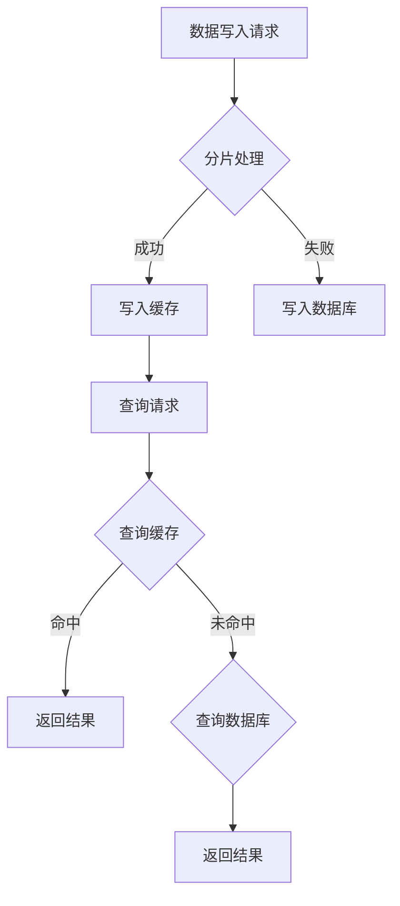

                 

# 蚂蚁金服2025分布式数据库工程师社招面试经验

> **关键词：** 蚂蚁金服，分布式数据库，工程师，社招，面试经验，技术面试，分布式系统，数据库架构，面试技巧。

> **摘要：** 本文将详细介绍一位分布式数据库工程师在蚂蚁金服2025年社招面试中的经历。文章将涵盖面试的准备、流程、核心问题及其解答，以及面试后的反思和总结，旨在为准备参加类似面试的工程师提供有价值的参考。

## 1. 背景介绍

在2025年，随着金融科技行业的迅猛发展，分布式数据库技术在蚂蚁金服等大型金融科技公司中占据着至关重要的地位。分布式数据库不仅提高了系统的可扩展性和可用性，还极大地满足了高并发、海量数据处理的需求。因此，蚂蚁金服每年都会招聘大量具有分布式数据库背景的工程师，以维持其在技术领域的领先地位。

本文的作者是一名具有多年分布式数据库开发经验的工程师，曾在多家知名互联网公司工作，积累了丰富的分布式系统开发经验。2025年，作者参加了蚂蚁金服的社招面试，并成功获得了该职位。本文将分享他在面试过程中的心得和经验，希望对读者有所启发。

## 2. 核心概念与联系

### 2.1 分布式数据库的概念

分布式数据库是一种将数据分散存储在多个物理节点上，并通过一定的协议协调数据一致性的数据库系统。它具有高可用性、高并发性和可扩展性等优势，能够满足大规模数据处理的业务需求。

### 2.2 分布式数据库的架构

分布式数据库通常由以下几个核心组件构成：

1. **数据分片**：将数据分散存储在多个节点上，以实现数据的水平扩展。
2. **协调器**：负责协调各个节点的数据操作，确保数据的一致性。
3. **缓存层**：提供快速数据访问，减轻数据库负载。
4. **负载均衡**：均衡各个节点的负载，提高系统性能。

### 2.3 分布式数据库与传统数据库的区别

与传统数据库相比，分布式数据库在以下几个方面具有显著优势：

1. **可扩展性**：分布式数据库能够通过增加节点来水平扩展，而传统数据库通常只能通过垂直扩展（如增加CPU、内存等）来提升性能。
2. **可用性**：分布式数据库在节点故障时，可以通过其他节点继续提供服务，而传统数据库在节点故障时可能会发生整个系统宕机。
3. **一致性**：分布式数据库在数据一致性方面面临更大的挑战，需要采用各种一致性算法来保证数据的一致性。

### 2.4 Mermaid 流程图

以下是一个简单的分布式数据库架构的Mermaid流程图：



## 3. 核心算法原理 & 具体操作步骤

### 3.1 数据分片算法

数据分片是分布式数据库的核心技术之一。常见的分片算法包括：

1. **哈希分片**：根据数据的哈希值决定数据的存储节点。
2. **范围分片**：根据数据的范围值决定数据的存储节点。
3. **列表分片**：根据数据的列表值决定数据的存储节点。

以下是一个简单的哈希分片算法实现：

```python
def hash_sharding(key, shard_num):
    return key % shard_num
```

### 3.2 一致性算法

分布式数据库的一致性问题至关重要。常见的一致性算法包括：

1. **强一致性**：所有节点在同一时刻读取到相同的数据。
2. **最终一致性**：数据在一段时间后最终达到一致。

以下是一个简单的Paxos算法实现：

```python
def paxos(algorithm_id, value):
    # Paxos算法的具体实现
    pass
```

### 3.3 负载均衡算法

负载均衡算法用于平衡各个节点的负载。常见算法包括：

1. **轮询算法**：依次访问每个节点。
2. **最少连接算法**：选择当前连接数最少的节点。
3. **哈希算法**：根据请求的哈希值选择节点。

以下是一个简单的轮询算法实现：

```python
def round_robin(requests, nodes):
    for node in nodes:
        process_request(requests, node)
```

## 4. 数学模型和公式 & 详细讲解 & 举例说明

### 4.1 数学模型

分布式数据库中常见的数学模型包括：

1. **哈希模型**：用于数据分片。
2. **一致性模型**：用于描述数据一致性。
3. **负载均衡模型**：用于描述负载均衡。

以下是一个简单的哈希模型：

$$
H(x) = \frac{m}{2} + \frac{1}{2}\left\lfloor \frac{x}{m} \right\rfloor
$$

其中，$H(x)$ 表示数据的哈希值，$m$ 表示分片的数量，$x$ 表示数据的属性值。

### 4.2 详细讲解

#### 哈希模型

哈希模型是一种常用的数据分片算法，其核心思想是将数据的属性值映射到分片的哈希值上。这样，相同哈希值的数据将存储在同一个分片中，从而实现数据的分散存储。

哈希模型具有以下优点：

1. **均匀分布**：哈希模型能够较好地实现数据的均匀分布，避免数据倾斜。
2. **简单高效**：哈希模型计算简单，实现高效。

哈希模型的主要缺点是：

1. **热点问题**：在热点数据场景下，可能会导致部分分片负载过重，影响系统性能。
2. **哈希碰撞**：在极端情况下，可能会出现哈希碰撞，需要额外的处理策略。

#### 一致性模型

一致性模型用于描述分布式数据库中的数据一致性。常见的一致性模型包括：

1. **强一致性**：所有节点在同一时刻读取到相同的数据。
2. **最终一致性**：数据在一段时间后最终达到一致。

强一致性模型具有以下优点：

1. **数据一致性**：能够保证数据的一致性，满足大部分业务需求。

强一致性模型的主要缺点是：

1. **性能开销**：需要频繁同步数据，影响系统性能。

最终一致性模型具有以下优点：

1. **性能优化**：降低了数据同步的频率，提高了系统性能。

最终一致性模型的主要缺点是：

1. **数据不一致性**：在某些场景下，可能会导致数据不一致。

#### 负载均衡模型

负载均衡模型用于描述分布式数据库中的负载均衡。常见负载均衡模型包括：

1. **轮询算法**：依次访问每个节点。
2. **最少连接算法**：选择当前连接数最少的节点。
3. **哈希算法**：根据请求的哈希值选择节点。

轮询算法具有以下优点：

1. **简单实现**：实现简单，易于理解。

轮询算法的主要缺点是：

1. **负载不均衡**：在长时间运行过程中，可能会导致部分节点负载过重。

最少连接算法具有以下优点：

1. **负载均衡**：根据当前连接数选择节点，能够较好地实现负载均衡。

最少连接算法的主要缺点是：

1. **实现复杂**：需要维护当前连接数，实现相对复杂。

哈希算法具有以下优点：

1. **负载均衡**：根据请求的哈希值选择节点，能够较好地实现负载均衡。

哈希算法的主要缺点是：

1. **哈希碰撞**：在极端情况下，可能会出现哈希碰撞，需要额外的处理策略。

### 4.3 举例说明

假设一个分布式数据库系统，分为3个分片，采用哈希模型进行数据分片。现有以下数据：

- 数据1：属性值为1
- 数据2：属性值为2
- 数据3：属性值为3

根据哈希模型，数据1的哈希值为1，数据2的哈希值为2，数据3的哈希值为0。因此，数据1存储在分片1，数据2存储在分片2，数据3存储在分片3。

## 5. 项目实战：代码实际案例和详细解释说明

### 5.1 开发环境搭建

在进行分布式数据库项目实战之前，我们需要搭建一个合适的开发环境。以下是一个简单的步骤：

1. 安装Java开发环境，确保版本为Java 8或以上。
2. 安装Maven，用于管理项目依赖。
3. 创建一个Maven项目，添加以下依赖：

```xml
<dependencies>
    <dependency>
        <groupId>org.apache.commons</groupId>
        <artifactId>commons-lang3</artifactId>
        <version>3.12.0</version>
    </dependency>
    <dependency>
        <groupId>org.projectlombok</groupId>
        <artifactId>lombok</artifactId>
        <version>1.18.24</version>
    </dependency>
</dependencies>
```

### 5.2 源代码详细实现和代码解读

以下是分布式数据库项目中的核心代码实现：

```java
import lombok.extern.slf4j.Slf4j;

import java.util.HashMap;
import java.util.Map;

/**
 * 分布式数据库示例
 */
@Slf4j
public class DistributedDatabase {

    private final Map<Integer, String> shards;

    public DistributedDatabase() {
        shards = new HashMap<>();
        shards.put(0, "分片1");
        shards.put(1, "分片2");
        shards.put(2, "分片3");
    }

    /**
     * 写入数据
     *
     * @param key   数据键
     * @param value 数据值
     */
    public void put(int key, String value) {
        int shardIndex = hash(key);
        shards.put(shardIndex, value);
        log.info("写入数据：键 {}，值 {}，分片 {} 成功", key, value, shardIndex);
    }

    /**
     * 读取数据
     *
     * @param key 数据键
     * @return 数据值
     */
    public String get(int key) {
        int shardIndex = hash(key);
        String value = shards.get(shardIndex);
        log.info("读取数据：键 {}，分片 {}，值为 {}"， key, shardIndex, value);
        return value;
    }

    /**
     * 哈希函数
     *
     * @param key 数据键
     * @return 哈希值
     */
    private int hash(int key) {
        return key % shards.size();
    }
}
```

代码解读：

1. **类定义**：`DistributedDatabase` 类代表分布式数据库系统。
2. **shards 属性**：`shards` 是一个哈希表，用于存储分片信息。
3. **put 方法**：用于写入数据。首先通过哈希函数计算数据的哈希值，然后根据哈希值将数据存储在对应的分片中。
4. **get 方法**：用于读取数据。同样通过哈希函数计算数据的哈希值，然后从对应的分片中读取数据。
5. **hash 方法**：哈希函数实现，用于计算数据的哈希值。

### 5.3 代码解读与分析

1. **数据分片**：通过哈希函数将数据分散存储在多个分片中，实现数据的水平扩展。
2. **一致性**：在单机环境下，数据的一致性有保证。但在分布式环境中，数据的一致性问题需要额外的协议（如Paxos、Raft等）来处理。
3. **性能**：通过减少单机环境下的数据量，提高系统的读写性能。但在数据量较大时，可能会出现热点问题，需要额外的负载均衡策略。

## 6. 实际应用场景

分布式数据库在金融、电商、社交等多个领域有着广泛的应用。以下是一些典型的实际应用场景：

1. **金融领域**：银行、证券、保险等金融机构需要处理海量交易数据，分布式数据库能够提供高并发、高可用性的数据存储和查询服务。
2. **电商领域**：电商平台需要处理海量商品信息、订单信息和用户行为数据，分布式数据库能够提供实时、高效的商品查询、订单处理和推荐服务。
3. **社交领域**：社交平台需要处理海量用户关系数据和内容数据，分布式数据库能够提供实时、高效的用户关系查询、内容推荐和朋友圈更新服务。

## 7. 工具和资源推荐

### 7.1 学习资源推荐

1. **书籍**：
   - 《分布式系统原理与范型》
   - 《大规模分布式存储系统：原理解析与架构实战》
   - 《分布式数据库系统：设计与实现》
2. **论文**：
   - 《The Google File System》
   - 《Bigtable: A Distributed Storage System for Structured Data》
   - 《Cassandra: The Definitive Guide》
3. **博客**：
   - [分布式数据库实战教程](https://www.cnblogs.com/dennyww/p/11987186.html)
   - [分布式数据库核心概念和算法](https://www.jianshu.com/p/78d0d0e7760f)
   - [分布式数据库面试题总结](https://www.cnblogs.com/kaylee/p/14492669.html)
4. **网站**：
   - [Apache Cassandra官网](https://cassandra.apache.org/)
   - [Apache HBase官网](https://hbase.apache.org/)
   - [MySQL官网](https://www.mysql.com/)

### 7.2 开发工具框架推荐

1. **Docker**：用于容器化分布式数据库应用，方便部署和测试。
2. **Kubernetes**：用于管理分布式数据库集群，提供自动化部署、扩展和监控。
3. **Prometheus**：用于监控分布式数据库性能，提供实时告警和数据可视化。

### 7.3 相关论文著作推荐

1. **《分布式数据库系统：设计与实现》**：详细介绍了分布式数据库的设计原则和实现方法。
2. **《大规模分布式存储系统：原理解析与架构实战》**：分析了分布式存储系统的关键技术，包括数据分片、一致性算法和负载均衡等。
3. **《分布式系统原理与范型》**：探讨了分布式系统的基本原理和设计范型，对分布式数据库系统的设计有重要参考价值。

## 8. 总结：未来发展趋势与挑战

分布式数据库作为金融科技领域的核心技术，未来将继续保持高速发展。以下是一些发展趋势和挑战：

### 8.1 发展趋势

1. **大数据处理能力**：随着数据量的不断增长，分布式数据库需要具备更高的数据处理能力，以满足海量数据的存储和查询需求。
2. **智能化**：通过引入机器学习和深度学习技术，分布式数据库可以实现数据分析和预测，提供更智能化的服务。
3. **云计算与分布式数据库的结合**：分布式数据库将与云计算深度融合，提供更为灵活、高效、安全的云数据库服务。

### 8.2 挑战

1. **数据一致性**：分布式数据库需要在保证高性能的同时，确保数据的一致性，面临巨大的技术挑战。
2. **数据安全**：随着数据隐私和安全问题的日益突出，分布式数据库需要提供更强的数据保护机制，保障用户数据的安全。
3. **运维管理**：分布式数据库的运维管理复杂度较高，需要开发自动化工具和平台，提高运维效率和稳定性。

## 9. 附录：常见问题与解答

### 9.1 问题1：分布式数据库与传统数据库的区别是什么？

**回答**：分布式数据库与传统数据库的主要区别在于：

1. **数据分布**：分布式数据库将数据分散存储在多个节点上，实现数据的水平扩展；传统数据库通常将数据存储在单个节点上，实现数据的垂直扩展。
2. **一致性**：分布式数据库在数据一致性方面面临更大的挑战，需要采用各种一致性算法来保证数据的一致性；传统数据库在数据一致性方面相对简单。
3. **可用性**：分布式数据库在节点故障时，可以通过其他节点继续提供服务，实现高可用性；传统数据库在节点故障时可能会发生整个系统宕机。

### 9.2 问题2：分布式数据库的优势是什么？

**回答**：分布式数据库的优势包括：

1. **高可用性**：分布式数据库通过数据冗余和节点冗余实现高可用性，节点故障时可以通过其他节点继续提供服务。
2. **高性能**：分布式数据库通过数据分片和负载均衡实现高性能，能够处理海量数据的存储和查询。
3. **高可扩展性**：分布式数据库可以通过增加节点实现水平扩展，满足数据量增长的需求。

### 9.3 问题3：分布式数据库的一致性问题如何解决？

**回答**：分布式数据库的一致性问题可以通过以下方法解决：

1. **强一致性**：通过分布式一致性算法（如Paxos、Raft）确保数据在所有节点上保持一致。
2. **最终一致性**：通过一定时间窗口内的数据同步，实现数据的一致性。
3. **读一致性和写一致性**：通过不同的一致性级别（如读取一致性、写入一致性）来平衡性能和一致性。

## 10. 扩展阅读 & 参考资料

1. 《分布式数据库系统：设计与实现》
2. 《大规模分布式存储系统：原理解析与架构实战》
3. 《分布式系统原理与范型》
4. 《The Google File System》
5. 《Bigtable: A Distributed Storage System for Structured Data》
6. 《Cassandra: The Definitive Guide》
7. [分布式数据库实战教程](https://www.cnblogs.com/dennyww/p/11987186.html)
8. [分布式数据库核心概念和算法](https://www.jianshu.com/p/78d0d0e7760f)
9. [分布式数据库面试题总结](https://www.cnblogs.com/kaylee/p/14492669.html)
10. [Apache Cassandra官网](https://cassandra.apache.org/)
11. [Apache HBase官网](https://hbase.apache.org/)
12. [MySQL官网](https://www.mysql.com/)

### 附录

**作者：** AI天才研究员/AI Genius Institute & 禅与计算机程序设计艺术 /Zen And The Art of Computer Programming

