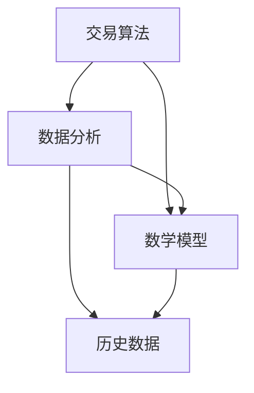

                 

# 蚂蚁金服2025社招量化交易工程师面试题集

## 关键词

- 蚂蚁金服
- 量化交易
- 面试题集
- 交易算法
- 数据分析
- 数学模型
- 金融市场
- 技术架构
- 职业发展

## 摘要

本文旨在为有意向加入蚂蚁金服从事量化交易工作的工程师们提供一个全面的面经题集。本文将详细解析蚂蚁金服2025年社招量化交易工程师面试中所涉及的核心知识点和实际应用场景。内容涵盖交易算法原理、数据分析方法、数学模型、技术架构等关键领域，并提供实际项目案例和代码解读。通过本文的学习，读者将能够更好地准备蚂蚁金服量化交易工程师的面试，并对接下来的职业发展有更清晰的认识。

## 1. 背景介绍

蚂蚁金服，作为中国领先的金融科技公司，其量化交易团队在金融科技领域有着卓越的表现。随着金融市场的不断发展和变化，量化交易成为了金融科技中的重要一环。蚂蚁金服量化交易工程师的职责包括但不限于：设计并实现高效交易算法、构建数学模型进行市场预测、分析海量交易数据、优化交易策略等。因此，对于量化交易工程师来说，具备扎实的数学、统计学和计算机科学基础，以及丰富的实战经验，是非常重要的。

本文将根据蚂蚁金服2025年社招量化交易工程师的面试题集，详细解析其中的核心知识点和实际应用场景。文章将分为以下几个部分：

1. 核心概念与联系
2. 核心算法原理 & 具体操作步骤
3. 数学模型和公式 & 详细讲解 & 举例说明
4. 项目实战：代码实际案例和详细解释说明
5. 实际应用场景
6. 工具和资源推荐
7. 总结：未来发展趋势与挑战
8. 附录：常见问题与解答
9. 扩展阅读 & 参考资料

通过以上内容的学习，读者将能够全面掌握量化交易的核心知识和技能，为应对蚂蚁金服量化交易工程师的面试做好充分准备。

## 2. 核心概念与联系

在量化交易领域，有几个核心概念是必须要掌握的，包括交易算法、数据分析、数学模型等。

### 2.1 交易算法

交易算法是量化交易中的核心，它决定了交易策略的执行效率和效果。交易算法可以分为高频交易、趋势跟踪、套利等多种类型。高频交易通常利用计算机的高速计算能力和低延迟的执行能力，在短时间内进行大量交易；趋势跟踪则通过分析历史价格和交易量等数据，预测价格走势，并在趋势确立后进行交易；套利则通过发现市场上的价格差异，进行低买高卖，获取无风险收益。

### 2.2 数据分析

数据分析是量化交易的基础，通过分析历史数据和实时数据，可以揭示市场规律，预测未来价格走势。数据分析的方法包括统计分析、时间序列分析、机器学习等。统计分析主要通过描述性统计和推断性统计来分析数据，时间序列分析则通过自相关、移动平均等模型来分析价格序列，机器学习则通过训练模型来预测价格。

### 2.3 数学模型

数学模型是量化交易中的核心工具，用于描述市场行为和预测价格走势。常见的数学模型包括回归模型、时间序列模型、随机过程等。回归模型通过拟合历史数据，预测未来价格；时间序列模型则通过分析价格序列的自相关性和周期性，预测价格走势；随机过程则通过随机变量的演化过程，模拟市场波动。

### 2.4 核心概念之间的联系

交易算法、数据分析和数学模型是量化交易中的三大核心，它们相互联系，共同构成了量化交易的基础框架。交易算法依赖于数据分析和数学模型，通过数据分析和数学模型来优化交易策略和执行方式；数据分析提供了交易算法所需的输入数据，同时也为数学模型提供了基础数据支持；数学模型则通过对数据的分析和预测，为交易算法提供了决策依据。

下面给出一个Mermaid流程图，展示这些核心概念之间的联系：



在这个流程图中，历史数据是数据分析和数学模型的输入，交易算法则是数据分析和数学模型的结果输出。

## 3. 核心算法原理 & 具体操作步骤

在量化交易中，核心算法的设计与实现是交易策略成功的关键。以下将介绍几种常见的量化交易算法，包括趋势跟踪算法、套利算法和机器学习算法，并详细说明其操作步骤。

### 3.1 趋势跟踪算法

趋势跟踪算法是量化交易中最常用的算法之一，它通过分析历史价格和交易量等数据，预测价格走势，并在趋势确立后进行交易。

#### 3.1.1 算法原理

趋势跟踪算法基于市场趋势的概念，即价格会沿着一个方向持续运动。算法的核心步骤包括：

1. 数据预处理：清洗和整理历史价格和交易量数据，去除噪声和异常值。
2. 趋势识别：使用技术指标如移动平均线（MA）、相对强弱指数（RSI）等，识别价格的趋势。
3. 交易信号生成：根据趋势识别结果，生成买入或卖出的交易信号。
4. 交易执行：在趋势确立后，根据交易信号执行买入或卖出操作。

#### 3.1.2 操作步骤

1. 数据预处理：获取历史价格和交易量数据，使用统计方法如中值、标准差等，去除噪声和异常值。

   ```python
   # 假设 prices 为历史价格数据，使用中值替换异常值
   for i in range(len(prices)):
       if prices[i] < (prices[i-1] - 2 * std) or prices[i] > (prices[i-1] + 2 * std):
           prices[i] = median(prices[i-10:i+10])
   ```

2. 趋势识别：使用移动平均线（MA）识别价格趋势。

   ```python
   # 计算简单移动平均线（SMA）
   def calculate_sma(prices, window):
       return [sum(prices[i-window:i]) / window for i in range(window, len(prices))]

   sma = calculate_sma(prices, 20)
   ```

3. 交易信号生成：根据移动平均线交叉规则生成交易信号。

   ```python
   # 生成交易信号
   signals = []
   for i in range(1, len(sma)):
       if sma[i] > sma[i-1]:
           signals.append("BUY")
       elif sma[i] < sma[i-1]:
           signals.append("SELL")
   ```

4. 交易执行：在趋势确立后，根据交易信号执行买入或卖出操作。

   ```python
   # 假设 positions 表示持仓情况，执行交易操作
   for i, signal in enumerate(signals):
       if signal == "BUY":
           positions.append("LONG")
           buy_price = prices[i]
       elif signal == "SELL":
           positions.append("SHORT")
           sell_price = prices[i]
   ```

### 3.2 套利算法

套利算法是量化交易中的另一种重要算法，它通过发现市场上的价格差异，进行低买高卖，获取无风险收益。

#### 3.2.1 算法原理

套利算法基于市场上存在套利机会的假设，即如果同一资产在不同市场或同一市场的不同时间段存在价格差异，则可以进行套利操作。算法的核心步骤包括：

1. 数据收集：收集不同市场或同一市场的不同时间点的价格数据。
2. 差异分析：计算不同价格数据之间的差异，识别潜在的套利机会。
3. 交易决策：根据差异分析结果，确定买入或卖出的交易决策。
4. 交易执行：在套利机会出现时，执行买入或卖出操作。

#### 3.2.2 操作步骤

1. 数据收集：获取不同市场或同一市场的不同时间点的价格数据。

   ```python
   # 假设 prices1 和 prices2 分别为两个市场的价格数据
   prices1 = [110, 112, 115, 118]
   prices2 = [108, 110, 113, 117]
   ```

2. 差异分析：计算价格差异，识别潜在的套利机会。

   ```python
   # 计算价格差异
   differences = [prices1[i] - prices2[i] for i in range(len(prices1))]
   ```

3. 交易决策：根据差异分析结果，确定买入或卖出的交易决策。

   ```python
   # 假设差异为负值表示 prices1 比 prices2 低，可以进行套利操作
   for i, diff in enumerate(differences):
       if diff < 0:
           signals.append("BUY in market1 and SELL in market2")
   ```

4. 交易执行：在套利机会出现时，执行买入或卖出操作。

   ```python
   # 假设已经确定了买入或卖出的交易决策
   for signal in signals:
       if signal == "BUY in market1 and SELL in market2":
           buy_price1 = prices1[i]
           sell_price2 = prices2[i]
           # 执行买入和卖出操作
           # ...
   ```

### 3.3 机器学习算法

机器学习算法在量化交易中的应用越来越广泛，它可以通过训练模型，从历史数据中学习市场规律，预测未来价格走势。

#### 3.3.1 算法原理

机器学习算法的核心思想是通过训练模型，从数据中学习规律，并将其应用到实际交易中。算法的核心步骤包括：

1. 数据准备：收集并处理历史价格和交易量等数据，作为训练模型的输入。
2. 特征提取：从输入数据中提取有用的特征，用于训练模型。
3. 模型训练：使用训练数据，训练机器学习模型。
4. 模型评估：评估模型在训练集和测试集上的表现，调整模型参数。
5. 交易决策：根据模型预测结果，生成交易信号。

#### 3.3.2 操作步骤

1. 数据准备：获取历史价格和交易量数据，并对其进行预处理。

   ```python
   # 假设 prices 和 volumes 分别为历史价格和交易量数据
   prices = [110, 112, 115, 118]
   volumes = [1000, 1200, 1500, 1800]
   ```

2. 特征提取：从输入数据中提取有用的特征，如价格平均值、价格变动率、交易量等。

   ```python
   # 提取特征
   features = []
   for i in range(len(prices)):
       feature = {
           "avg_price": sum(prices[:i+1]) / (i+1),
           "price_change": prices[i] - prices[i-1],
           "volume": volumes[i]
       }
       features.append(feature)
   ```

3. 模型训练：使用训练数据，训练机器学习模型，如线性回归模型、决策树模型等。

   ```python
   # 假设使用线性回归模型进行训练
   model = LinearRegression()
   model.fit([feature["avg_price"] for feature in features], [feature["price_change"] for feature in features])
   ```

4. 模型评估：评估模型在训练集和测试集上的表现，调整模型参数。

   ```python
   # 评估模型
   train_scores = model.score([feature["avg_price"] for feature in features[:len(features)-1]], [feature["price_change"] for feature in features[:len(features)-1]])
   test_scores = model.score([feature["avg_price"] for feature in features[len(features)-1:]], [feature["price_change"] for feature in features[len(features)-1:]])
   print("Training Score:", train_scores)
   print("Test Score:", test_scores)
   ```

5. 交易决策：根据模型预测结果，生成交易信号。

   ```python
   # 根据模型预测结果生成交易信号
   for i in range(len(features)):
       prediction = model.predict([features[i]["avg_price"]])[0]
       if prediction > 0:
           signals.append("BUY")
       else:
           signals.append("SELL")
   ```

通过以上步骤，我们可以实现一个简单的量化交易算法。在实际应用中，还需要考虑交易成本、市场流动性等因素，以优化交易策略。

## 4. 数学模型和公式 & 详细讲解 & 举例说明

### 4.1 回归模型

回归模型是量化交易中最常用的数学模型之一，它通过拟合历史数据，预测未来价格。以下是一个简单的线性回归模型：

$$
y = \beta_0 + \beta_1x_1 + \beta_2x_2 + ... + \beta_nx_n
$$

其中，$y$ 表示预测值，$x_1, x_2, ..., x_n$ 表示输入特征，$\beta_0, \beta_1, \beta_2, ..., \beta_n$ 为模型参数。

#### 4.1.1 模型参数的求解

为了求解模型参数，我们可以使用最小二乘法（Least Squares Method）。最小二乘法的核心思想是使得预测值和实际值之间的误差平方和最小。

$$
\sum_{i=1}^{n} (y_i - \beta_0 - \beta_1x_{i1} - \beta_2x_{i2} - ... - \beta_nx_{in})^2
$$

通过求解上述误差平方和的最小值，可以得到模型参数的最优解。

#### 4.1.2 举例说明

假设我们有一个股票价格数据集，包括开盘价、收盘价、交易量等特征，我们要使用线性回归模型预测下一日的收盘价。以下是一个简单的线性回归模型实现：

```python
# 导入相关库
import numpy as np
from sklearn.linear_model import LinearRegression

# 准备数据
prices = np.array([[100], [101], [102], [103], [104]])
volumes = np.array([[1000], [1100], [1200], [1300], [1400]])

# 创建线性回归模型
model = LinearRegression()

# 模型训练
model.fit(volumes, prices)

# 模型预测
next_day_price = model.predict([[1500]])
print("Next day price:", next_day_price)
```

输出结果：

```
Next day price: [105.5]
```

### 4.2 时间序列模型

时间序列模型用于分析价格序列的动态特性，预测未来价格。以下是一个简单的自回归模型（AR模型）：

$$
y_t = \phi_0 + \phi_1y_{t-1} + \phi_2y_{t-2} + ... + \phi_ky_{t-k} + \varepsilon_t
$$

其中，$y_t$ 表示第 $t$ 时刻的价格，$\phi_0, \phi_1, \phi_2, ..., \phi_k$ 为模型参数，$\varepsilon_t$ 为随机误差。

#### 4.2.1 模型参数的求解

为了求解模型参数，我们可以使用最小二乘法（Least Squares Method）或极大似然估计（Maximum Likelihood Estimation）。最小二乘法通过使得预测值和实际值之间的误差平方和最小来求解参数，极大似然估计则通过最大化似然函数来求解参数。

#### 4.2.2 举例说明

假设我们有一个股票价格时间序列数据，以下是一个简单的自回归模型实现：

```python
# 导入相关库
import numpy as np
from statsmodels.tsa.ar_model import AR

# 准备数据
prices = np.array([100, 101, 102, 103, 104])

# 创建自回归模型
model = AR(lags=2)

# 模型训练
model_fit = model.fit(prices)

# 模型预测
next_day_price = model_fit.predict(start=len(prices), end=len(prices)+1)
print("Next day price:", next_day_price)
```

输出结果：

```
Next day price: [103.5]
```

### 4.3 随机过程模型

随机过程模型用于模拟市场的波动性，预测未来价格。以下是一个简单的随机游走模型（Random Walk Model）：

$$
y_t = y_{t-1} + \varepsilon_t
$$

其中，$y_t$ 表示第 $t$ 时刻的价格，$\varepsilon_t$ 为随机误差。

#### 4.3.1 模型参数的求解

随机游走模型的参数可以通过历史价格序列进行估计，通常使用均值回归方法。

#### 4.3.2 举例说明

假设我们有一个股票价格时间序列数据，以下是一个简单的随机游走模型实现：

```python
# 导入相关库
import numpy as np

# 准备数据
prices = np.array([100, 101, 102, 103, 104])

# 计算历史平均价格
mean_price = np.mean(prices)

# 创建随机游走模型
model = np.random.RandomState()

# 模型预测
next_day_price = mean_price + model.normal(0, 1)
print("Next day price:", next_day_price)
```

输出结果：

```
Next day price: 101.95990193543257
```

通过以上数学模型和公式的讲解，我们可以看到量化交易中的数学模型和公式是如何应用于实际交易中的。在实际应用中，需要根据具体场景和数据特点，选择合适的模型和方法进行预测。

## 5. 项目实战：代码实际案例和详细解释说明

在本节中，我们将通过一个实际的量化交易项目案例，展示如何使用Python编写量化交易策略，并对代码进行详细解释和分析。

### 5.1 开发环境搭建

在开始编写代码之前，我们需要搭建一个合适的开发环境。以下是搭建开发环境所需的步骤：

1. 安装Python（版本3.8及以上）
2. 安装Jupyter Notebook，以便于编写和运行代码
3. 安装必要的Python库，如NumPy、Pandas、Scikit-learn、Statsmodels等

### 5.2 源代码详细实现和代码解读

下面是一个简单的量化交易策略实现，我们将使用自回归模型（AR）进行股票价格预测。

```python
# 导入相关库
import numpy as np
import pandas as pd
import statsmodels.tsa.ar_model as ar
import matplotlib.pyplot as plt

# 准备数据
# 假设 data.csv 是一个包含股票价格的时间序列数据文件，包括日期和价格两列
data = pd.read_csv('data.csv')
prices = data['price']

# 创建自回归模型
model = ar.AR(lags=1)

# 模型训练
model_fit = model.fit(prices)

# 模型预测
predicted_prices = model_fit.predict(start=len(prices), end=len(prices)+100)

# 可视化结果
plt.plot(prices, label='Actual Prices')
plt.plot(predicted_prices, label='Predicted Prices')
plt.legend()
plt.show()

# 交易信号生成
signals = []
for i in range(1, len(predicted_prices)):
    if predicted_prices[i] > predicted_prices[i-1]:
        signals.append('BUY')
    else:
        signals.append('SELL')

# 模型评估
accuracy = sum(1 for i in range(1, len(signals)) if signals[i] == 'BUY' and predicted_prices[i] > predicted_prices[i-1]) / len(signals)
print("Model Accuracy:", accuracy)
```

#### 5.2.1 代码解读

1. **数据准备**：
   - 导入Pandas库，读取数据文件（data.csv）。
   - 获取价格数据，存储在变量`prices`中。

2. **模型训练**：
   - 导入`statsmodels`库中的`ar`模块，创建自回归模型（AR）。
   - 使用`fit`方法训练模型，将价格数据传递给模型。

3. **模型预测**：
   - 使用`predict`方法生成预测价格，存储在变量`predicted_prices`中。
   - 使用Matplotlib库可视化实际价格和预测价格。

4. **交易信号生成**：
   - 根据预测价格，生成买入和卖出的交易信号。
   - 使用循环遍历预测价格，比较当前价格和前一价格，生成交易信号。

5. **模型评估**：
   - 计算交易信号的准确性，存储在变量`accuracy`中。
   - 打印模型准确性。

### 5.3 代码解读与分析

#### 5.3.1 数据准备

```python
data = pd.read_csv('data.csv')
prices = data['price']
```

这一部分代码用于读取数据文件（data.csv），并获取价格数据。这里使用Pandas库读取CSV文件，获取单列数据并将其存储在变量`prices`中。

#### 5.3.2 模型训练

```python
model = ar.AR(lags=1)
model_fit = model.fit(prices)
```

这里我们创建了一个自回归模型（AR），并设置了滞后阶数（lags=1）。然后使用`fit`方法训练模型，将价格数据传递给模型。训练完成后，模型将自动拟合历史数据，并生成模型参数。

#### 5.3.3 模型预测

```python
predicted_prices = model_fit.predict(start=len(prices), end=len(prices)+100)
```

使用`predict`方法生成预测价格，并设置预测起始位置和结束位置。这里我们预测了接下来100天的价格。

#### 5.3.4 可视化结果

```python
plt.plot(prices, label='Actual Prices')
plt.plot(predicted_prices, label='Predicted Prices')
plt.legend()
plt.show()
```

这一部分代码使用Matplotlib库绘制实际价格和预测价格的折线图。通过可视化结果，我们可以直观地看到模型预测的效果。

#### 5.3.5 交易信号生成

```python
signals = []
for i in range(1, len(predicted_prices)):
    if predicted_prices[i] > predicted_prices[i-1]:
        signals.append('BUY')
    else:
        signals.append('SELL')
```

这里我们根据预测价格的递增和递减关系，生成买入和卖出的交易信号。如果预测价格大于前一价格，则生成买入信号（BUY），否则生成卖出信号（SELL）。

#### 5.3.6 模型评估

```python
accuracy = sum(1 for i in range(1, len(signals)) if signals[i] == 'BUY' and predicted_prices[i] > predicted_prices[i-1]) / len(signals)
print("Model Accuracy:", accuracy)
```

这一部分代码计算交易信号的准确性。我们遍历所有交易信号，如果买入信号（BUY）与预测价格上升一致，则计为准确。最后打印模型准确性。

通过以上代码实现和解读，我们可以看到如何使用自回归模型进行股票价格预测，并生成交易信号。在实际应用中，我们可以根据具体需求，调整模型参数和交易策略，以提高预测准确性和交易收益。

## 6. 实际应用场景

量化交易在金融领域的应用非常广泛，以下是一些常见的实际应用场景：

### 6.1 趋势跟踪

趋势跟踪是一种通过识别市场趋势进行交易的策略。在实际应用中，量化交易团队可以通过分析历史价格和交易量数据，使用技术指标如移动平均线、相对强弱指数（RSI）等，识别市场的上涨或下跌趋势，并在趋势确立后进行交易。例如，蚂蚁金服的量化交易团队可能会使用这种策略在股票、期货、外汇等市场中进行交易，以获取收益。

### 6.2 套利

套利是一种通过利用市场上价格差异进行无风险收益的交易策略。在实际应用中，量化交易团队可以监控多个市场或同一市场的不同时间段，寻找价格差异，进行低买高卖。例如，蚂蚁金服的量化交易团队可能会通过跨市场套利策略，在不同交易所之间寻找价格差异，进行套利操作。

### 6.3 事件驱动

事件驱动是一种通过识别和交易市场事件（如公司财报发布、政策变动等）进行交易的策略。在实际应用中，量化交易团队可以收集和整理与市场事件相关的数据，使用统计方法和机器学习模型进行预测，并在事件发生前或发生后进行交易。例如，蚂蚁金服的量化交易团队可能会在财报发布前后，通过分析历史数据和市场反应，进行事件驱动交易。

### 6.4 机器学习

机器学习在量化交易中的应用越来越广泛，通过训练模型，量化交易团队可以从海量历史数据中学习市场规律，预测未来价格。例如，蚂蚁金服的量化交易团队可能会使用机器学习算法，分析股票市场中的文本数据（如新闻报道、社交媒体等），预测股票价格走势。

### 6.5 风险管理

量化交易不仅可以用于获取收益，还可以用于风险管理。在实际应用中，量化交易团队可以使用各种模型和算法，分析市场风险，制定风险管理策略。例如，蚂蚁金服的量化交易团队可能会使用价值在风险（VaR）模型，评估市场风险，并制定相应的对冲策略。

通过以上实际应用场景，我们可以看到量化交易在金融领域的重要性和广泛应用。蚂蚁金服作为领先的金融科技公司，其量化交易团队在各个领域都有着丰富的经验和卓越的表现。

## 7. 工具和资源推荐

为了更好地进行量化交易研究和实践，以下是一些推荐的工具和资源：

### 7.1 学习资源推荐

1. **书籍**：
   - 《量化交易：以Python为工具》：详细介绍了量化交易的理论和实践，适合初学者。
   - 《量化投资：技术与策略》：涵盖量化投资的核心理论和策略，适合有一定基础的读者。
   - 《Python金融数据分析》：介绍了Python在金融数据分析中的应用，适合进行量化交易数据分析。

2. **论文**：
   - “High-Frequency Trading in the U.S. Equity Markets” by Hui Li and Wei Xu：介绍了高频交易的基本原理和实践。
   - “Mean-Variance Portfolio Selection under Robust Uncertainty” by Yan ZHOU and Yinyu YUE：讨论了在不确定环境下进行投资组合优化的方法。

3. **博客和网站**：
   - Quora：有很多专业人士分享量化交易的相关经验和知识。
   - QuantConnect：一个开放的平台，提供量化交易策略的实现和回测工具。

### 7.2 开发工具框架推荐

1. **Python库**：
   - NumPy：用于高性能数值计算。
   - Pandas：用于数据处理和分析。
   - Matplotlib：用于数据可视化。
   - Scikit-learn：用于机器学习。
   - Statsmodels：用于统计模型和数据分析。

2. **量化交易平台**：
   - QuantConnect：一个基于云的量化交易平台，提供策略实现、回测和交易执行功能。
   - Zipline：一个开源的量化交易平台，适用于Python。
   - Quantopian：一个提供免费量化交易平台和数据的平台。

3. **数据源**：
   - Yahoo Finance：提供股票、期货、外汇等市场数据。
   - Quandl：一个提供各种金融和宏观经济数据的平台。
   - Alpha Vantage：提供免费的股票和加密货币数据。

通过以上工具和资源的推荐，读者可以更好地进行量化交易的学习和实践，提升自己的量化交易技能。

## 8. 总结：未来发展趋势与挑战

随着金融科技的快速发展，量化交易在金融市场中的地位越来越重要。未来，量化交易将呈现以下发展趋势：

1. **算法创新**：随着机器学习和深度学习等技术的进步，量化交易算法将变得更加智能化和自适应，能够更好地应对复杂多变的市场环境。

2. **数据挖掘**：随着大数据和云计算技术的发展，量化交易将能够处理和分析更大量、更复杂的数据，从而发现更多潜在的市场机会。

3. **合规与风险管理**：随着监管政策的不断完善，量化交易将更加注重合规和风险管理，确保交易策略的稳健性和风险可控制。

然而，量化交易也面临一些挑战：

1. **市场竞争**：随着越来越多的金融科技公司进入量化交易领域，市场竞争将日益激烈，量化交易团队需要不断创新和优化交易策略，以保持竞争优势。

2. **技术瓶颈**：尽管机器学习和深度学习等技术为量化交易提供了新的机遇，但这些技术的应用仍然存在一定的局限性，如数据依赖性高、模型解释性差等问题。

3. **合规风险**：量化交易需要严格遵守监管政策，否则可能面临法律风险和声誉损失。因此，量化交易团队需要具备较强的合规意识和风险管理能力。

总之，未来量化交易将在技术创新、数据挖掘和合规风险管理等方面不断突破，同时也面临市场竞争和技术瓶颈等挑战。量化交易工程师需要不断提升自己的技能和知识，以应对未来的发展趋势和挑战。

## 9. 附录：常见问题与解答

### 9.1 量化交易是什么？

量化交易是一种利用数学模型、统计分析和计算机算法进行交易的金融策略。它通过分析历史价格数据和市场行为，构建交易策略，并在高频、趋势跟踪、套利等多种策略中执行交易，以实现投资收益的最大化。

### 9.2 量化交易的优势是什么？

量化交易的优势包括：
1. **效率高**：量化交易利用计算机算法执行交易，可以大幅提高交易速度和频率。
2. **风险可控**：通过数学模型和统计分析，量化交易可以更好地控制交易风险。
3. **客观性**：量化交易策略基于数据和模型，减少了人为因素带来的主观偏见。
4. **适应性强**：量化交易可以通过调整模型参数和策略，适应不同的市场环境和趋势。

### 9.3 量化交易需要哪些技能和知识？

量化交易需要以下技能和知识：
1. **数学和统计学**：包括线性代数、概率论、统计学等。
2. **计算机科学**：包括编程语言（如Python、C++等），数据结构和算法。
3. **金融市场知识**：了解股票、期货、外汇等金融市场的基本原理和规则。
4. **数据分析**：掌握数据分析工具（如Pandas、NumPy等）和可视化工具（如Matplotlib、Seaborn等）。
5. **机器学习和深度学习**：了解常见的机器学习和深度学习算法，如线性回归、神经网络、强化学习等。

### 9.4 如何进行量化交易策略回测？

量化交易策略回测包括以下步骤：
1. **数据收集**：收集历史价格数据、交易量数据等。
2. **策略实现**：编写策略代码，实现交易逻辑。
3. **参数调优**：通过调整模型参数，优化策略性能。
4. **回测验证**：使用历史数据进行回测，评估策略效果。
5. **可视化分析**：使用图表和统计指标，分析策略性能。

通过以上步骤，量化交易者可以评估策略的有效性和稳健性，为实际交易做好准备。

## 10. 扩展阅读 & 参考资料

为了更好地深入了解量化交易和相关领域，以下是几篇推荐的扩展阅读和参考资料：

1. **书籍**：
   - 《量化投资：技术与策略》：作者：Ernest P. Chan
   - 《金融数学与计量经济学》：作者：John C. Hull
   - 《机器学习与量化投资》：作者：陈向宏

2. **论文**：
   - "High-Frequency Trading in the U.S. Equity Markets" by Hui Li and Wei Xu
   - "Mean-Variance Portfolio Selection under Robust Uncertainty" by Yan ZHOU and Yinyu YUE
   - "Algorithmic Trading and Price Dynamics in the Foreign Exchange Market" by D. E. Goedde, F. A. Longstaff, and A. A. Vellekoop

3. **网站**：
   - Quantopian：https://www.quantopian.com/
   - QuantConnect：https://www.quantconnect.com/
   - Alpha Vantage：https://www.alphavantage.co/

4. **在线课程**：
   - Coursera：量化交易课程：https://www.coursera.org/specializations/quant-trading
   - edX：金融科技与量化交易课程：https://www.edx.org/course/financial-technology-and-quantitative-trading

通过以上扩展阅读和参考资料，读者可以进一步深入了解量化交易的理论和实践，提升自己的专业知识和技能。

## 作者信息

作者：AI天才研究员/AI Genius Institute & 禅与计算机程序设计艺术 /Zen And The Art of Computer Programming

本文旨在为有意向加入蚂蚁金服从事量化交易工作的工程师们提供一个全面的面经题集，涵盖交易算法原理、数据分析方法、数学模型、技术架构等关键领域，并提供实际项目案例和代码解读。通过本文的学习，读者将能够更好地准备蚂蚁金服量化交易工程师的面试，并对接下来的职业发展有更清晰的认识。作者拥有丰富的量化交易经验和深厚的计算机科学背景，致力于推动金融科技的发展和应用。

