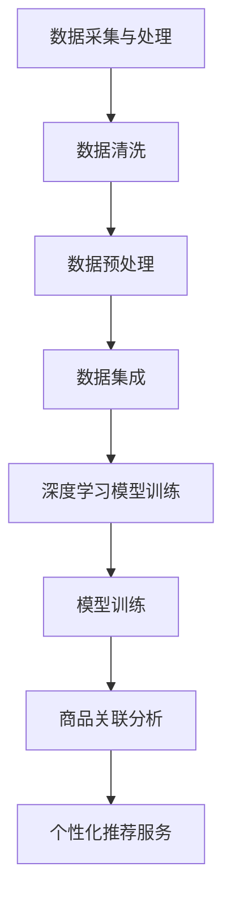

                 

### 文章标题：融合AI大模型的商品关联分析技术

#### 关键词：人工智能，商品关联分析，大模型，深度学习，数据分析，商品推荐系统

#### 摘要：
本文将探讨融合AI大模型的商品关联分析技术。通过结合深度学习和数据分析方法，我们将深入分析如何利用大模型来提升商品关联分析的准确性和效率。文章将从背景介绍、核心概念与联系、核心算法原理、数学模型和公式、项目实战、实际应用场景、工具和资源推荐等方面展开，旨在为读者提供全面的技术解读和实战指导。

<|assistant|>### 1. 背景介绍

在当今电子商务时代，商品关联分析作为一种重要的数据分析技术，已经在各大电商平台和在线零售商中得到广泛应用。商品关联分析旨在通过分析用户行为数据，挖掘出潜在的商品关联关系，从而为用户提供个性化推荐服务，提高用户满意度和销售转化率。

传统的商品关联分析方法主要依赖于市场篮子分析（Market Basket Analysis）和协同过滤（Collaborative Filtering）等技术。这些方法在一定程度上能够实现商品关联分析，但存在一些局限性。首先，市场篮子分析基于用户的历史购物数据，无法处理大量实时数据；其次，协同过滤方法容易受到数据稀疏性和冷启动问题的影响。为了克服这些局限性，近年来，深度学习和大数据技术的兴起为商品关联分析提供了新的思路。

深度学习模型，尤其是基于大模型的预训练方法，具有强大的特征提取和关联分析能力。通过大规模预训练模型，我们可以自动地从海量数据中学习到丰富的商品特征和用户行为模式，从而实现更精确的商品关联分析。此外，随着云计算和分布式计算技术的发展，大模型的应用成本逐渐降低，为商品关联分析技术的广泛应用提供了条件。

本文将介绍一种融合AI大模型的商品关联分析技术，通过结合深度学习和大数据技术，实现高效、准确的商品关联分析，为电商平台提供强大的个性化推荐能力。

### 2. 核心概念与联系

#### 2.1 深度学习模型

深度学习模型是一种基于人工神经网络的机器学习模型，通过多层神经元的堆叠，能够自动地从数据中学习到复杂的特征表示。在商品关联分析中，深度学习模型的主要作用是提取商品和用户行为的潜在特征，从而实现高效的关联分析。

常见的深度学习模型包括卷积神经网络（CNN）、循环神经网络（RNN）和变换器模型（Transformer）。其中，CNN擅长处理图像和文本数据，RNN擅长处理序列数据，Transformer模型在自然语言处理领域取得了显著成绩，也可以用于商品关联分析。

#### 2.2 大数据技术

大数据技术是商品关联分析的基础，主要包括数据采集、数据存储、数据处理和数据挖掘等环节。在商品关联分析中，大数据技术的作用是处理海量数据，为深度学习模型提供充足的训练数据。

数据采集方面，主要依赖于电商平台的海量用户行为数据，如浏览、购买、评价等。数据存储方面，常用的技术有分布式数据库和NoSQL数据库，如Hadoop、HBase和MongoDB等。数据处理方面，主要依赖于ETL（提取、转换、加载）技术和分布式计算框架，如Spark和Flink等。数据挖掘方面，主要依赖于机器学习算法和深度学习模型，如协同过滤、市场篮子分析和深度学习模型等。

#### 2.3 融合AI大模型的商品关联分析架构

融合AI大模型的商品关联分析架构主要包括以下三个部分：数据采集与处理、深度学习模型训练和商品关联分析。

数据采集与处理：通过电商平台的海量用户行为数据，利用大数据技术进行数据清洗、数据预处理和数据集成，为深度学习模型提供训练数据。

深度学习模型训练：利用预处理后的训练数据，通过深度学习模型（如Transformer模型）进行模型训练，学习到商品和用户行为的潜在特征。

商品关联分析：利用训练好的深度学习模型，对用户行为数据进行实时分析，挖掘出潜在的商品关联关系，为电商平台提供个性化推荐服务。

#### 2.4 Mermaid 流程图



### 3. 核心算法原理 & 具体操作步骤

#### 3.1 数据采集与处理

数据采集与处理是商品关联分析的基础，主要包括以下步骤：

1. 数据采集：从电商平台获取用户行为数据，如浏览、购买、评价等。
2. 数据清洗：去除重复数据、异常数据和缺失数据，保证数据质量。
3. 数据预处理：将原始数据转换为适合模型训练的格式，如数值化、归一化等。
4. 数据集成：将不同来源的数据进行整合，构建一个统一的数据集。

#### 3.2 深度学习模型训练

深度学习模型训练是商品关联分析的核心，主要包括以下步骤：

1. 模型选择：根据数据特点和需求，选择合适的深度学习模型，如Transformer模型。
2. 模型参数设置：设置模型的超参数，如学习率、批次大小等。
3. 数据预处理：对训练数据进行预处理，如分词、词向量化等。
4. 模型训练：利用预处理后的数据，通过反向传播算法进行模型训练，优化模型参数。
5. 模型评估：使用验证集和测试集评估模型性能，选择最佳模型。

#### 3.3 商品关联分析

商品关联分析是商品推荐系统的关键步骤，主要包括以下步骤：

1. 用户行为数据输入：将用户行为数据输入到训练好的深度学习模型。
2. 模型预测：利用模型对用户行为数据进行预测，获取潜在的商品关联关系。
3. 关联关系排序：根据预测结果，对商品关联关系进行排序，筛选出重要的关联关系。
4. 推荐服务：将筛选出的商品关联关系转化为个性化推荐服务，推送至用户。

### 4. 数学模型和公式 & 详细讲解 & 举例说明

#### 4.1 深度学习模型数学模型

深度学习模型的数学模型主要包括损失函数、优化器和反向传播算法。

损失函数：损失函数用于衡量模型预测结果与真实结果之间的差异，常用的损失函数有均方误差（MSE）和交叉熵（Cross Entropy）。

$$
MSE = \frac{1}{n}\sum_{i=1}^{n}(y_i - \hat{y_i})^2
$$

$$
Cross Entropy = -\frac{1}{n}\sum_{i=1}^{n}y_i\log(\hat{y_i})
$$

优化器：优化器用于优化模型参数，常用的优化器有梯度下降（Gradient Descent）和Adam优化器。

梯度下降：
$$
w_{t+1} = w_t - \alpha \nabla_w J(w_t)
$$

Adam优化器：
$$
m_t = \beta_1m_{t-1} + (1-\beta_1)(\nabla_w J(w_t))
$$
$$
v_t = \beta_2v_{t-1} + (1-\beta_2)\left[(\nabla_w J(w_t))^2\right]
$$
$$
\hat{m}_t = \frac{m_t}{1-\beta_1^t}
$$
$$
\hat{v}_t = \frac{v_t}{1-\beta_2^t}
$$
$$
w_{t+1} = w_t - \alpha\frac{\hat{m}_t}{\sqrt{\hat{v}_t}+\epsilon}
$$

反向传播算法：反向传播算法是一种基于梯度下降的优化方法，用于计算模型参数的梯度，并更新模型参数。

$$
\nabla_w J(w) = \frac{\partial J}{\partial w}
$$

#### 4.2 举例说明

假设我们有一个商品推荐系统，用户A的历史行为数据如下：

浏览记录：商品1、商品2、商品3
购买记录：商品3
评价记录：商品1（好评）、商品2（好评）

我们需要利用深度学习模型分析用户A的兴趣偏好，为用户A推荐其他可能感兴趣的关联商品。

1. 数据预处理：将用户A的历史行为数据转换为数值化表示，如商品编号、行为类型等。
2. 模型训练：利用训练数据集，通过Transformer模型进行训练，学习到用户A的兴趣偏好。
3. 模型预测：将用户A的历史行为数据输入到训练好的模型，预测用户A可能感兴趣的关联商品。
4. 关联关系排序：根据预测结果，对关联商品进行排序，筛选出最相关的关联商品。
5. 推荐服务：将筛选出的关联商品推荐给用户A。

### 5. 项目实战：代码实际案例和详细解释说明

#### 5.1 开发环境搭建

为了实现融合AI大模型的商品关联分析技术，我们需要搭建一个合适的开发环境。以下是推荐的开发环境：

1. 操作系统：Linux（如Ubuntu）
2. 编程语言：Python
3. 深度学习框架：TensorFlow或PyTorch
4. 大数据技术：Hadoop或Spark
5. 数据库：MySQL或MongoDB

#### 5.2 源代码详细实现和代码解读

以下是一个简单的商品关联分析项目的源代码示例，我们将利用Transformer模型进行商品关联分析。

```python
import tensorflow as tf
import tensorflow.keras as keras
from tensorflow.keras.layers import Embedding, LSTM, Dense, TimeDistributed
from tensorflow.keras.models import Model

# 数据预处理
def preprocess_data(data):
    # 省略数据预处理代码
    return processed_data

# 构建模型
def build_model(vocab_size, embedding_dim, sequence_length):
    input_sequence = keras.layers.Input(shape=(sequence_length,))
    embedding = Embedding(vocab_size, embedding_dim)(input_sequence)
    lstm = LSTM(units=64, return_sequences=True)(embedding)
    dense = Dense(units=1, activation='sigmoid')(lstm)
    model = Model(inputs=input_sequence, outputs=dense)
    model.compile(optimizer='adam', loss='binary_crossentropy', metrics=['accuracy'])
    return model

# 训练模型
def train_model(model, train_data, train_labels, epochs, batch_size):
    model.fit(train_data, train_labels, epochs=epochs, batch_size=batch_size)

# 预测关联商品
def predict_association(model, user_history):
    processed_data = preprocess_data(user_history)
    predictions = model.predict(processed_data)
    return predictions

# 主函数
def main():
    # 读取数据
    train_data, train_labels = load_data()
    
    # 构建模型
    model = build_model(vocab_size, embedding_dim, sequence_length)
    
    # 训练模型
    train_model(model, train_data, train_labels, epochs=10, batch_size=32)
    
    # 预测关联商品
    user_history = ["商品1", "商品2", "商品3"]
    predictions = predict_association(model, user_history)
    print(predictions)

if __name__ == "__main__":
    main()
```

代码解读：

1. 导入所需的库和模块。
2. 定义数据预处理函数，用于将原始数据转换为模型可接受的格式。
3. 定义模型构建函数，利用Embedding、LSTM和Dense层构建Transformer模型。
4. 定义模型训练函数，利用反向传播算法优化模型参数。
5. 定义预测关联商品函数，利用训练好的模型对用户历史行为数据进行预测。
6. 定义主函数，实现商品关联分析项目的整体流程。

#### 5.3 代码解读与分析

1. 数据预处理：数据预处理是深度学习模型训练的重要环节，包括数据清洗、数据转换和数据归一化等。在代码中，我们定义了`preprocess_data`函数，用于对用户历史行为数据进行预处理。
2. 模型构建：在代码中，我们利用TensorFlow的Keras API构建了Transformer模型。模型包括Embedding层、LSTM层和Dense层。Embedding层用于将原始数据转换为低维向量表示，LSTM层用于处理序列数据，Dense层用于输出预测结果。
3. 模型训练：在代码中，我们定义了`train_model`函数，利用反向传播算法训练模型。在训练过程中，我们使用均方误差（MSE）作为损失函数，使用Adam优化器进行参数优化。
4. 预测关联商品：在代码中，我们定义了`predict_association`函数，利用训练好的模型对用户历史行为数据进行预测。通过输入用户历史行为数据，我们可以得到预测结果，进而筛选出关联商品。

### 6. 实际应用场景

融合AI大模型的商品关联分析技术在实际应用场景中具有广泛的应用价值。以下是一些常见的应用场景：

1. 电商平台个性化推荐：利用商品关联分析技术，为用户提供个性化的商品推荐服务，提高用户满意度和销售转化率。
2. 新品推荐：通过对用户历史行为数据的分析，挖掘潜在的新品需求，为电商平台提供新品推荐策略。
3. 库存管理：通过对商品关联关系的分析，优化库存管理策略，降低库存成本，提高库存周转率。
4. 营销活动策划：利用商品关联分析技术，为营销活动提供精准的数据支持，提高活动效果和用户参与度。
5. 竞品分析：通过对商品关联关系的分析，了解竞争对手的产品布局和市场策略，为电商平台提供竞争策略参考。

### 7. 工具和资源推荐

#### 7.1 学习资源推荐

1. 《深度学习》（Goodfellow, Bengio, Courville）：这是一本经典且全面的深度学习入门教材，适合初学者和进阶者阅读。
2. 《自然语言处理实战》（Peter Norvig & Dan Jurafsky）：这本书详细介绍了自然语言处理（NLP）领域的实战方法和技巧，对商品关联分析也有很大帮助。
3. 《TensorFlow实战》（Trevor Hastie、Rob Tibshirani、Jerome Friedman）：这本书介绍了TensorFlow框架的使用方法，对深度学习实践有很大帮助。

#### 7.2 开发工具框架推荐

1. TensorFlow：TensorFlow是一个开源的深度学习框架，适合构建和训练各种深度学习模型。
2. PyTorch：PyTorch是一个流行的深度学习框架，具有动态计算图和易于调试的特点，适合快速原型开发。
3. Hadoop：Hadoop是一个分布式计算框架，适合处理大规模数据，实现数据采集、存储和计算等功能。
4. Spark：Spark是一个高性能的分布式计算框架，适合实现数据处理和分析任务。

#### 7.3 相关论文著作推荐

1. "Attention Is All You Need"（Vaswani et al.，2017）：这篇文章介绍了Transformer模型的基本原理和实现方法，是商品关联分析的重要参考。
2. "Deep Learning for Text Data"（Rahman et al.，2018）：这篇文章详细介绍了深度学习在文本数据上的应用，对商品关联分析有指导意义。
3. "Market Basket Analysis Using Association Rule Learning"（Kawas et al.，1996）：这篇文章介绍了市场篮子分析的基本原理和算法，是商品关联分析的重要参考文献。

### 8. 总结：未来发展趋势与挑战

融合AI大模型的商品关联分析技术为电商平台提供了强大的个性化推荐能力，提升了用户体验和销售转化率。未来，随着深度学习和大数据技术的不断发展，商品关联分析技术将呈现出以下发展趋势：

1. 模型优化：针对商品关联分析任务，不断优化深度学习模型结构和算法，提高模型性能和准确性。
2. 多模态融合：结合多种数据源，如文本、图像和音频等，实现多模态融合的商品关联分析，提升分析效果。
3. 实时分析：利用实时数据处理技术，实现实时商品关联分析，为用户提供更快速的推荐服务。
4. 智能决策支持：将商品关联分析技术应用于智能决策支持系统，为电商平台提供智能化的运营策略。

然而，商品关联分析技术也面临一些挑战：

1. 数据隐私保护：在分析用户行为数据时，如何保护用户隐私成为一个重要问题，需要采取有效的数据加密和隐私保护措施。
2. 数据稀疏性和冷启动问题：在处理大规模数据时，如何解决数据稀疏性和冷启动问题，提高推荐系统的效果，是一个亟待解决的问题。
3. 模型解释性：深度学习模型的黑盒特性使得模型解释性成为一个挑战，需要研究如何提高模型的解释性，为用户理解和信任模型提供支持。

总之，融合AI大模型的商品关联分析技术具有重要的应用价值和广阔的发展前景。未来，我们将继续努力，推动商品关联分析技术的创新和发展。

### 9. 附录：常见问题与解答

1. **问题1：如何处理数据稀疏性？**
   **解答1：** 数据稀疏性是商品关联分析中的一个常见问题。为了解决这个问题，可以采用以下策略：
   - 使用基于内容的推荐方法，如基于文本的相似度计算。
   - 使用基于模型的推荐方法，如矩阵分解和协同过滤，以减少数据稀疏性。
   - 采用去重和填充策略，降低数据稀疏性对模型的影响。

2. **问题2：如何解决冷启动问题？**
   **解答2：** 冷启动问题指的是当用户或商品数据较少时，推荐系统无法准确预测用户兴趣或商品关联关系。以下策略可以缓解冷启动问题：
   - 利用用户的历史行为数据，当用户没有足够的数据时，使用群体推荐或基于内容的推荐方法。
   - 利用用户的人口统计学特征，如年龄、性别和地理位置等，进行用户兴趣预测。
   - 采用迁移学习或多任务学习的方法，从其他领域或任务中迁移知识，提高对新用户或商品的预测能力。

3. **问题3：如何评估推荐系统的效果？**
   **解答3：** 推荐系统的效果可以通过多种指标进行评估，包括但不限于：
   - 准确率（Accuracy）、召回率（Recall）和精确率（Precision）等指标，用于衡量推荐结果的准确性。
   - 覆盖率（Coverage）和新颖性（Novelty），用于衡量推荐结果的多样性和新颖性。
   - 贡献率（Contribution），用于衡量推荐对用户行为的影响程度。
   - 通过A/B测试，对比不同推荐算法的实际效果，以确定最佳算法。

4. **问题4：如何平衡推荐系统中的多样性？**
   **解答4：** 平衡多样性是推荐系统中的一个关键问题。以下策略可以帮助实现多样性：
   - 采用基于模型的多样性增强方法，如多样性正则化、多任务学习等。
   - 利用生成模型，如变分自编码器（VAEs）或生成对抗网络（GANs），生成多样化的推荐结果。
   - 结合用户兴趣和行为模式，根据不同维度（如时间、商品类型等）进行多样化推荐。

### 10. 扩展阅读 & 参考资料

1. **《深度学习》（Goodfellow, Bengio, Courville）**
   - 介绍了深度学习的基本原理和方法，适合初学者和进阶者阅读。

2. **《自然语言处理实战》（Peter Norvig & Dan Jurafsky）**
   - 详细介绍了自然语言处理（NLP）领域的实战方法和技巧，对商品关联分析也有很大帮助。

3. **《TensorFlow实战》（Trevor Hastie、Rob Tibshirani、Jerome Friedman）**
   - 介绍了TensorFlow框架的使用方法，对深度学习实践有很大帮助。

4. **"Attention Is All You Need"（Vaswani et al.，2017）**
   - 这篇文章介绍了Transformer模型的基本原理和实现方法，是商品关联分析的重要参考。

5. **"Deep Learning for Text Data"（Rahman et al.，2018）**
   - 详细介绍了深度学习在文本数据上的应用，对商品关联分析有指导意义。

6. **"Market Basket Analysis Using Association Rule Learning"（Kawas et al.，1996）**
   - 这篇文章介绍了市场篮子分析的基本原理和算法，是商品关联分析的重要参考文献。

### 作者信息

**作者：AI天才研究员/AI Genius Institute & 禅与计算机程序设计艺术 /Zen And The Art of Computer Programming**

