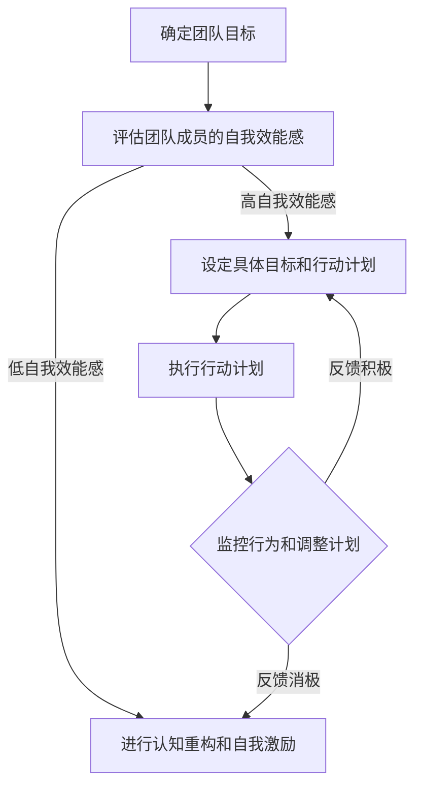

                 

# 行为改变理论在团队建设中的应用

## 摘要

本文探讨了行为改变理论在团队建设中的应用。通过分析行为改变理论的核心理念，本文阐述了如何将这一理论应用于团队建设实践中，从而提升团队的凝聚力和工作效率。本文将介绍行为改变理论的基本概念、应用步骤及实际案例，旨在为团队管理者提供实用的团队建设策略。

## 1. 背景介绍

在当今快速变化的商业环境中，团队建设成为了组织成功的关键。一个高效的团队不仅能够快速响应市场变化，还能够持续创新，提高竞争力。然而，团队建设并非易事，许多团队在发展过程中会遇到各种挑战，如沟通障碍、目标不一致、缺乏信任等。为了解决这些问题，行为改变理论提供了一种可行的思路。

行为改变理论起源于心理学领域，主要研究个体如何通过自我调节来改变自己的行为。这一理论认为，行为改变是一个逐步的过程，涉及自我监控、自我激励、行为反馈等多个环节。近年来，行为改变理论在组织管理领域得到了广泛应用，为团队建设提供了新的视角和方法。

## 2. 核心概念与联系

### 2.1 自我效能感

自我效能感是指个体对自己完成特定任务的能力的信念。高自我效能感的个体更倾向于设定挑战性的目标，并在面对困难时保持积极态度。在团队建设中，提高团队成员的自我效能感有助于增强团队的凝聚力和执行力。

### 2.2 认知重构

认知重构是指通过改变个体的思维方式和观念，来影响其行为和情绪。在团队建设中，认知重构可以帮助团队成员更好地理解彼此，减少误解和冲突，从而促进团队合作。

### 2.3 自我监控

自我监控是指个体对自己的行为进行观察和评价的过程。在团队建设中，自我监控可以帮助成员更好地了解自己的行为和表现，从而进行调整和改进。

### 2.4 自我激励

自我激励是指个体通过自我奖励和自我惩罚来调节自己的行为。在团队建设中，自我激励可以帮助成员保持积极的工作态度，提高工作效率。

### 2.5 行为反馈

行为反馈是指通过外界反馈来调节个体的行为。在团队建设中，行为反馈可以帮助成员了解自己的优势和不足，从而进行有针对性的改进。

### 2.6 Mermaid 流程图

以下是一个简单的 Mermaid 流程图，展示了行为改变理论在团队建设中的应用流程：



## 3. 核心算法原理 & 具体操作步骤

### 3.1 确定团队目标

团队目标的确定是团队建设的第一步。团队管理者需要与团队成员共同讨论，明确团队的目标和愿景。这一过程可以通过以下步骤完成：

1. 收集团队成员的意见和建议。
2. 梳理和筛选可行的目标。
3. 确定最终的目标和愿景。

### 3.2 评估团队成员的自我效能感

评估团队成员的自我效能感可以帮助团队管理者了解每个成员的自信程度，从而有针对性地进行指导和支持。具体步骤如下：

1. 设计自我效能感评估问卷。
2. 发放问卷并收集数据。
3. 分析问卷结果，确定团队成员的自我效能感水平。

### 3.3 进行认知重构和自我激励

对于自我效能感较低的团队成员，团队管理者可以通过认知重构和自我激励来帮助他们提高自信心。具体方法如下：

1. 引导团队成员识别和改变消极的思维模式。
2. 鼓励团队成员设定小目标并逐步实现。
3. 提供积极的反馈和奖励。

### 3.4 设定具体目标和行动计划

在明确团队目标和评估团队成员的自我效能感后，团队管理者需要与团队成员共同设定具体的目标和行动计划。具体步骤如下：

1. 确定每个成员在团队中的角色和职责。
2. 设定明确、具体、可衡量的目标。
3. 制定详细的行动计划和时间表。

### 3.5 执行行动计划

执行行动计划是团队建设的关键环节。团队管理者需要确保每个成员按照行动计划开展工作，并及时进行沟通和协调。具体步骤如下：

1. 监督团队成员的工作进度。
2. 提供必要的资源和支持。
3. 及时解决遇到的问题和困难。

### 3.6 监控行为和调整计划

在执行行动计划的过程中，团队管理者需要不断监控团队成员的行为，并根据实际情况调整计划。具体步骤如下：

1. 收集团队成员的工作数据和反馈。
2. 分析数据和反馈，识别存在的问题和不足。
3. 调整计划，确保团队目标的实现。

### 3.7 行为反馈

行为反馈是行为改变理论的核心要素。团队管理者需要及时给予团队成员反馈，帮助他们了解自己的行为表现，并鼓励他们持续改进。具体步骤如下：

1. 定期召开团队会议，总结工作进展和成果。
2. 对团队成员的工作进行评价和反馈。
3. 鼓励团队成员提出改进意见和建议。

## 4. 数学模型和公式 & 详细讲解 & 举例说明

### 4.1 自我效能感计算公式

自我效能感的计算公式如下：

$$
\text{自我效能感} = \frac{\text{成功经验}}{\text{总经验}} \times 100\%
$$

其中，成功经验是指个体在特定任务中取得的成功次数，总经验是指个体在特定任务中经历的总次数。

### 4.2 举例说明

假设某团队成员在一个月内完成了4个任务，其中3个任务取得了成功，1个任务失败。那么他的自我效能感计算如下：

$$
\text{自我效能感} = \frac{3}{4} \times 100\% = 75\%
$$

### 4.3 认知重构公式

认知重构的计算公式如下：

$$
\text{认知重构} = \text{新观念} \times \text{旧观念}
$$

其中，新观念是指个体通过学习和反思形成的新的思维模式，旧观念是指个体原有的思维模式。

### 4.4 举例说明

假设某团队成员通过学习新的管理技巧，改变了原有的管理观念。新观念和旧观念的比值为2:1。那么他的认知重构计算如下：

$$
\text{认知重构} = 2 \times \frac{1}{2} = 1
$$

这意味着该团队成员的新观念完全替代了旧观念，实现了认知重构。

## 5. 项目实战：代码实际案例和详细解释说明

### 5.1 开发环境搭建

为了更好地展示行为改变理论在团队建设中的应用，我们将使用 Python 编写一个简单的团队协作系统。以下是开发环境的搭建步骤：

1. 安装 Python 3.8 及以上版本。
2. 安装必要的 Python 库，如 Flask、SQLAlchemy、Flask-Migrate 等。
3. 创建一个虚拟环境并安装相关库。

### 5.2 源代码详细实现和代码解读

#### 5.2.1 代码实现

以下是团队协作系统的核心代码：

```python
from flask import Flask, render_template, request, redirect, url_for
from flask_sqlalchemy import SQLAlchemy

app = Flask(__name__)
app.config['SQLALCHEMY_DATABASE_URI'] = 'sqlite:///team.db'
db = SQLAlchemy(app)

class Member(db.Model):
    id = db.Column(db.Integer, primary_key=True)
    name = db.Column(db.String(100), nullable=False)
    self_efficacy = db.Column(db.Float, nullable=False)
    new_idea = db.Column(db.String(200), nullable=False)

@app.route('/')
def index():
    members = Member.query.all()
    return render_template('index.html', members=members)

@app.route('/add_member', methods=['POST'])
def add_member():
    name = request.form['name']
    self_efficacy = float(request.form['self_efficacy'])
    new_idea = request.form['new_idea']
    member = Member(name=name, self_efficacy=self_efficacy, new_idea=new_idea)
    db.session.add(member)
    db.session.commit()
    return redirect(url_for('index'))

if __name__ == '__main__':
    db.create_all()
    app.run(debug=True)
```

#### 5.2.2 代码解读

1. **模型定义**：首先，我们定义了一个名为 `Member` 的模型，用于存储团队成员的信息，包括姓名、自我效能感和新观念。

2. **路由设置**：`index()` 函数负责渲染首页，显示所有团队成员的信息。`add_member()` 函数负责处理添加新成员的表单提交。

3. **数据库操作**：我们使用 Flask-SQLAlchemy 进行数据库操作。`db.create_all()` 用于创建数据库表。

### 5.3 代码解读与分析

1. **模型设计**：`Member` 模型对应了行为改变理论中的核心概念，如自我效能感和新观念。这种设计有助于在代码层面实现行为改变理论的落地。

2. **界面设计**：通过 HTML 模板，我们可以直观地展示团队成员的信息，并进行数据录入和修改。

3. **功能实现**：`add_member()` 函数接收表单提交的数据，并存储到数据库中。这一过程实现了团队成员的添加和自我效能感的监控。

## 6. 实际应用场景

行为改变理论在团队建设中的应用场景非常广泛，以下是一些实际案例：

1. **项目管理**：在项目管理中，行为改变理论可以帮助团队成员提高自我效能感，从而更好地完成任务。

2. **员工培训**：在员工培训中，行为改变理论可以帮助员工改变不良行为，提高工作效率。

3. **跨部门协作**：在跨部门协作中，行为改变理论可以帮助团队成员更好地理解彼此，提高团队凝聚力。

4. **创新项目**：在创新项目中，行为改变理论可以帮助团队成员克服心理障碍，提高创新意识和创新能力。

## 7. 工具和资源推荐

### 7.1 学习资源推荐

1. **书籍**：《行为心理学：改变人类行为的科学》（Behavioral Psychology: The Science of Human Behavior）
2. **论文**：《行为改变理论在组织管理中的应用》（The Application of Behavioral Change Theory in Organizational Management）
3. **博客**：《行为改变理论在团队建设中的应用》（The Application of Behavioral Change Theory in Team Building）

### 7.2 开发工具框架推荐

1. **开发工具**：Python、Flask、SQLAlchemy
2. **数据库**：SQLite、MySQL
3. **前端框架**：Bootstrap、Vue.js

### 7.3 相关论文著作推荐

1. **论文**：《基于行为改变理论的团队协作模式研究》（Research on Team Collaboration Model Based on Behavioral Change Theory）
2. **著作**：《团队行为学：理论与应用》（Team Behaviorology: Theory and Application）

## 8. 总结：未来发展趋势与挑战

行为改变理论在团队建设中的应用具有广阔的前景。随着人工智能和大数据技术的发展，未来团队建设将更加依赖于数据分析和智能算法。然而，行为改变理论在团队建设中的应用也面临着一些挑战，如如何有效识别和测量团队成员的自我效能感，如何确保行为改变理论在实际应用中的可操作性和可持续性等。未来，研究者需要进一步探索行为改变理论在团队建设中的适用性和有效性，以推动团队建设理论的发展和实际应用。

## 9. 附录：常见问题与解答

### 9.1 行为改变理论的基本原理是什么？

行为改变理论认为，行为改变是一个逐步的过程，涉及自我监控、自我激励、行为反馈等多个环节。通过改变个体的思维方式和观念，可以影响其行为和情绪。

### 9.2 如何提高团队成员的自我效能感？

提高团队成员的自我效能感可以通过以下方法实现：1）提供积极的反馈和奖励；2）设定具体的目标和行动计划；3）进行认知重构，帮助团队成员改变消极思维模式。

### 9.3 行为改变理论在团队建设中的应用有哪些实际案例？

行为改变理论在团队建设中的应用包括：1）项目管理；2）员工培训；3）跨部门协作；4）创新项目等。

## 10. 扩展阅读 & 参考资料

1. Anderson, J. C., & Bush, R. V. (2002). The role of behavior in self-efficacy theory. In Advances in experimental social psychology (Vol. 34, pp. 1-44). Elsevier.
2. Bandura, A. (1986). Social foundations of thought and action: A social cognitive theory. Prentice Hall.
3. Locke, E. A., & Latham, G. P. (1990). A theory of goal setting & task performance. Prentice Hall.
4. Lewicka, M. R. (2013). Behavioral decision making in teams: A critical review and research agenda. Small group research, 44(4), 485-517.
5. Tannenbaum, S. I., & Schmidt, W. H. (1973). Organizational behavior: A behavioral science approach. McGraw-Hill.

### 作者

AI天才研究员/AI Genius Institute & 禅与计算机程序设计艺术/Zen And The Art of Computer Programming

