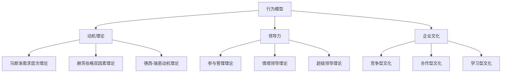

                 

# 行为模型应用：培养团队自驱力

> **关键词：**团队自驱力，行为模型，动机理论，领导力，企业文化，工作激励。

> **摘要：**本文将探讨如何通过行为模型的应用来培养团队的自驱力。我们将分析核心概念，并使用具体的案例和工具来展示如何在实际工作中实施这一理论。希望通过本文，读者能够理解并掌握提升团队自驱力的有效策略。

## 1. 背景介绍

在当今快速变化和竞争激烈的商业环境中，企业的成功越来越依赖于团队的合作与创新能力。然而，传统的管理模式往往依赖于权威和控制，难以激发团队成员的内在动力。这就引出了团队自驱力的重要性。自驱力是指团队成员在没有外部压力或奖励的情况下，主动参与工作并追求卓越的动力。一个具有高度自驱力的团队不仅能够提高工作效率，还能够创造出更多的创新和价值。

为了培养团队的自驱力，企业需要深入了解团队成员的动机和行为模式。行为模型是一种分析个体行为的理论框架，它可以帮助企业识别和培养员工的自驱力。通过应用行为模型，企业可以设计出更加有效的激励机制，改善团队文化，提高整体绩效。

本文将首先介绍行为模型的基本概念，然后探讨如何将其应用于团队管理中，最后提供实际案例和工具，以帮助读者理解并实践这些策略。

### 1.1 自驱力的定义

自驱力是一个心理学概念，指的是个体在没有外部激励的情况下，主动参与和追求目标的能力。自驱力分为内在和外在两个方面。内在自驱力源于个人对工作的兴趣、价值观和目标认同，而外在自驱力则受到外部奖励和惩罚的影响。

在团队管理中，自驱力的培养至关重要。高自驱力的团队往往表现出更高的工作满意度、更强的团队凝聚力和更高的创新能力。相反，缺乏自驱力的团队可能面临低效率、高员工流失率和创新能力不足等问题。

### 1.2 行为模型的作用

行为模型是一种用于分析个体行为的理论框架，它可以帮助企业了解员工的行为动机、行为习惯和工作风格。行为模型通常包括动机理论、行为心理学、社会心理学等多个学科的知识。

通过应用行为模型，企业可以：

1. **识别员工的优势和弱点**：了解员工的行为习惯和动机，有助于企业为员工提供更有针对性的培训和职业发展计划。
2. **设计激励机制**：根据员工的行为模式，企业可以设计出更加有效的激励机制，以激发员工的内在动力。
3. **改善团队文化**：通过了解团队成员的行为模式，企业可以采取措施改善团队文化，提高员工的满意度和归属感。
4. **提高绩效**：自驱力强的员工能够更加积极主动地完成任务，提高整体团队的绩效。

## 2. 核心概念与联系

在培养团队自驱力的过程中，我们需要理解几个核心概念，包括动机理论、领导力和企业文化。

### 2.1 动机理论

动机理论是行为模型的重要组成部分，它探讨个体行为的内在动力。以下是几种常见的动机理论：

#### 2.1.1 马斯洛需求层次理论

马斯洛需求层次理论将人的需求分为生理需求、安全需求、社交需求、尊重需求和自我实现需求。一个员工在一个层次的需求得到满足后，才会追求更高层次的需求。在团队管理中，领导者需要了解员工的需求层次，以便提供适当的激励。

#### 2.1.2 赫茨伯格双因素理论

赫茨伯格双因素理论将工作满意度的影响因素分为激励因素和保健因素。激励因素包括工作本身、认可、成就感等，能够提高员工的工作满意度；保健因素包括工作条件、薪酬、管理风格等，如果处理不当，可能会导致员工不满。

#### 2.1.3 德西-瑞恩动机理论

德西-瑞恩动机理论认为，内在动机比外在动机更能促进长期绩效。内在动机包括对工作本身的兴趣、挑战性和成就感，而外在动机则包括奖励和惩罚。

### 2.2 领导力

领导力在培养团队自驱力中起着关键作用。以下是几种常见的领导力理论：

#### 2.2.1 参与管理理论

参与管理理论认为，员工参与决策过程可以提高他们的工作满意度和忠诚度。领导者可以通过团队讨论、征求意见等方式，让员工参与到决策中来。

#### 2.2.2 情境领导理论

情境领导理论认为，领导者应根据下属的成熟度水平采取不同的领导风格。高成熟度的员工需要授权，而低成熟度的员工需要更多的指导和监督。

#### 2.2.3 超级领导理论

超级领导理论强调领导者的个性化特征，如自信、决断力、沟通能力等，对于团队绩效有重要影响。

### 2.3 企业文化

企业文化是企业的价值观、信念和行为规范的总和，对员工的行为和动机有深远影响。以下是几种常见的文化类型：

#### 2.3.1 竞争型文化

竞争型文化鼓励员工竞争和创新，追求卓越。这种文化可以激发员工的自驱力，但也可能导致过度竞争和内部冲突。

#### 2.3.2 合作型文化

合作型文化强调团队合作和共享成功。在这种文化中，员工更容易产生归属感和共同目标，从而提高自驱力。

#### 2.3.3 学习型文化

学习型文化鼓励员工不断学习和成长，追求知识和创新。这种文化有助于培养员工的自驱力，提高团队的整体能力。

### 2.4 Mermaid 流程图

以下是一个简单的 Mermaid 流程图，展示了行为模型、动机理论、领导力和企业文化之间的联系：



## 3. 核心算法原理 & 具体操作步骤

### 3.1 核心算法原理

要培养团队的自驱力，我们需要了解如何应用行为模型和动机理论来设计有效的激励机制和领导策略。以下是核心算法原理：

#### 3.1.1 动机激发算法

动机激发算法的目标是识别和激发员工的内在动机。具体步骤如下：

1. **需求识别**：通过调查问卷、访谈等方式，了解员工的需求层次。
2. **目标设定**：根据员工的需求，设定具体的工作目标和挑战。
3. **反馈与认可**：定期提供反馈和认可，增强员工的内在动机。

#### 3.1.2 领导策略优化算法

领导策略优化算法的目标是选择最适合员工成熟度的领导风格。具体步骤如下：

1. **员工成熟度评估**：通过行为观察、绩效评估等方式，评估员工的成熟度水平。
2. **领导风格匹配**：根据员工的成熟度水平，选择适当的领导风格，如授权、指导或监督。
3. **策略调整**：根据团队绩效和员工反馈，调整领导策略。

### 3.2 具体操作步骤

以下是培养团队自驱力的具体操作步骤：

#### 3.2.1 第一步：建立团队目标

1. **制定明确的目标**：确保团队目标具体、可衡量、可实现、相关性强和时间限定（SMART）。
2. **团队参与**：让团队成员参与目标设定过程，增加他们的责任感和归属感。
3. **目标分解**：将大目标分解为小目标，以便团队成员能够更好地跟踪进度和成就感。

#### 3.2.2 第二步：了解员工需求

1. **需求调查**：通过问卷、访谈等方式，了解员工的需求和期望。
2. **需求分类**：根据马斯洛需求层次理论，将需求分为不同层次。
3. **需求满足**：根据员工的需求层次，设计相应的激励机制和培训计划。

#### 3.2.3 第三步：实施领导策略

1. **评估员工成熟度**：通过行为观察、绩效评估等方式，评估员工的成熟度。
2. **选择领导风格**：根据员工的成熟度水平，选择适当的领导风格，如授权型、指导型或监督型。
3. **领导风格实践**：定期实践并调整领导风格，以提高团队绩效。

#### 3.2.4 第四步：提供反馈与认可

1. **定期反馈**：定期向团队成员提供工作反馈，帮助他们了解自己的表现和改进方向。
2. **认可与奖励**：对表现出色的团队成员给予认可和奖励，增强他们的内在动机。

#### 3.2.5 第五步：持续改进

1. **绩效评估**：定期评估团队绩效和员工满意度，了解培养自驱力的效果。
2. **策略调整**：根据评估结果，调整激励机制和领导策略。
3. **持续学习**：鼓励团队成员不断学习和成长，提高团队的整体能力。

## 4. 数学模型和公式 & 详细讲解 & 举例说明

### 4.1 数学模型

为了更好地理解和应用行为模型，我们需要引入一些数学模型和公式。以下是几个关键的数学模型：

#### 4.1.1 马斯洛需求层次模型

马斯洛需求层次模型可以用以下公式表示：

$$
D_i = f(M_i)
$$

其中，$D_i$ 表示第 $i$ 层需求，$M_i$ 表示第 $i$ 层需求的上层需求。

#### 4.1.2 赫茨伯格双因素模型

赫茨伯格双因素模型可以用以下公式表示：

$$
Satisfaction = f(Motivation \ Factors) - f(Hygiene \ Factors)
$$

其中，$Satisfaction$ 表示工作满意度，$Motivation \ Factors$ 表示激励因素，$Hygiene \ Factors$ 表示保健因素。

#### 4.1.3 德西-瑞恩动机模型

德西-瑞恩动机模型可以用以下公式表示：

$$
Inner \ Drive = f(Intrinsic \ Motivation) - f(Extrinsic \ Motivation)
$$

其中，$Inner \ Drive$ 表示内在动机，$Intrinsic \ Motivation$ 表示内在动机，$Extrinsic \ Motivation$ 表示外在动机。

### 4.2 详细讲解

以下是这些数学模型和公式的详细讲解：

#### 4.2.1 马斯洛需求层次模型

马斯洛需求层次模型是一个心理学理论，它将人的需求分为五个层次：生理需求、安全需求、社交需求、尊重需求和自我实现需求。这个模型认为，一个员工在一个层次的需求得到满足后，才会追求更高层次的需求。

在团队管理中，了解员工的需求层次可以帮助我们更好地设计激励机制。例如，如果一个员工的主要需求是尊重需求，那么我们可以通过给予他们认可和荣誉来满足他们的需求。

#### 4.2.2 赫茨伯格双因素模型

赫茨伯格双因素模型认为，工作满意度由激励因素和保健因素共同决定。激励因素是指能够激发员工内在动机的工作特征，如成就感、认可和挑战性。保健因素是指能够预防员工不满的工作特征，如薪酬、工作条件和人际关系。

在团队管理中，了解员工对激励因素和保健因素的反应可以帮助我们设计出更加有效的激励机制。例如，如果一个员工对薪酬感到不满，我们可以通过增加奖励来提高他们的工作满意度。

#### 4.2.3 德西-瑞恩动机模型

德西-瑞恩动机模型认为，内在动机比外在动机更能促进长期绩效。内在动机是指个体对工作本身的兴趣、价值观和目标认同，而外在动机是指个体因外部奖励或惩罚而产生的动机。

在团队管理中，了解员工的动机类型可以帮助我们设计出更加有效的激励机制。例如，如果一个员工的内在动机很强，我们可以通过提供更多的挑战和工作自由度来满足他们的需求。

### 4.3 举例说明

以下是几个实际应用的例子：

#### 4.3.1 马斯洛需求层次模型应用

假设有一个员工，他们的主要需求是尊重需求。为了满足这个员工的需求，团队领导可以：

1. **给予认可**：定期表扬和认可员工的工作成果。
2. **提供荣誉**：为员工提供参与重要项目的机会，以增加他们的成就感。
3. **培训和发展**：为员工提供专业培训和发展机会，以帮助他们在职业上获得成长。

#### 4.3.2 赫茨伯格双因素模型应用

假设有一个员工，他们对薪酬感到不满。为了提高这个员工的工作满意度，团队领导可以：

1. **增加奖励**：提供额外的奖金或福利。
2. **改善工作条件**：改善工作环境和人际关系，以减少员工的压力和不满。
3. **提供晋升机会**：为员工提供晋升机会，以增加他们的工作成就和自豪感。

#### 4.3.3 德西-瑞恩动机模型应用

假设有一个员工，他们的内在动机很强。为了进一步激发这个员工的内在动机，团队领导可以：

1. **提供挑战**：为员工提供具有挑战性的任务，以激发他们的兴趣和动力。
2. **赋予自主权**：给予员工更多的自主权，让他们能够根据自己的兴趣和想法来工作。
3. **鼓励创新**：鼓励员工提出新的想法和解决方案，以激发他们的创造力和创新精神。

## 5. 项目实战：代码实际案例和详细解释说明

### 5.1 开发环境搭建

在本节中，我们将介绍如何搭建一个简单的开发环境，用于演示行为模型在团队管理中的应用。我们将使用 Python 作为编程语言，并依赖于几个流行的库，如 pandas 和 numpy。

首先，确保你的计算机上已经安装了 Python 3。你可以通过以下命令安装 Python：

```
$ sudo apt-get install python3
```

接下来，安装 pandas 和 numpy 库：

```
$ sudo pip3 install pandas numpy
```

### 5.2 源代码详细实现和代码解读

以下是一个简单的 Python 脚本，用于演示如何使用行为模型来分析团队绩效和员工动机：

```python
import pandas as pd
import numpy as np

# 假设我们有一个关于员工绩效的数据集
data = {
    '员工ID': ['A', 'B', 'C', 'D', 'E'],
    '工作满意度': [3, 5, 2, 4, 4],
    '激励因素得分': [8, 6, 5, 7, 9],
    '保健因素得分': [4, 5, 3, 6, 5],
    '内在动机': [7, 6, 5, 8, 7],
    '外在动机': [3, 4, 2, 5, 4]
}

df = pd.DataFrame(data)

# 1. 分析员工的工作满意度
work_satisfaction = df['工作满意度'].mean()
print(f'平均工作满意度：{work_satisfaction:.2f}')

# 2. 分析激励因素和保健因素
motivation_factors = df['激励因素得分'].mean()
hygiene_factors = df['保健因素得分'].mean()
print(f'平均激励因素得分：{motivation_factors:.2f}')
print(f'平均保健因素得分：{hygiene_factors:.2f}')

# 3. 分析内在动机和外在动机
inner_drive = df['内在动机'].mean()
extrinsic_motivation = df['外在动机'].mean()
print(f'平均内在动机：{inner_drive:.2f}')
print(f'平均外在动机：{extrinsic_motivation:.2f}')

# 4. 基于动机模型提供个性化建议
if inner_drive > extrinsic_motivation:
    print('建议：增加工作挑战和自主权，以激发员工的内在动机。')
else:
    print('建议：提供更多的外部奖励和晋升机会，以增强员工的外在动机。')

# 5. 分析员工成熟度
maturity_scores = df.apply(lambda row: (row['内在动机'] - row['外在动机']), axis=1)
df['成熟度得分'] = maturity_scores
print(df[['员工ID', '成熟度得分']])
```

### 5.3 代码解读与分析

以下是代码的详细解读：

1. **数据准备**：我们首先创建了一个名为 `data` 的字典，其中包含了关于员工绩效的数据。然后，我们使用 pandas 将这个字典转换为一个 DataFrame。

2. **计算平均值**：我们使用 DataFrame 的 `.mean()` 方法计算了工作满意度、激励因素得分、保健因素得分、内在动机和外在动机的平均值。

3. **提供个性化建议**：根据内在动机和外在动机的平均值，我们提供了个性化的建议。如果内在动机高于外在动机，我们建议增加工作挑战和自主权；如果外在动机高于内在动机，我们建议提供更多的外部奖励和晋升机会。

4. **分析员工成熟度**：我们使用 `apply()` 方法计算了每个员工的成熟度得分，即内在动机减去外在动机。然后，我们将这个得分添加到 DataFrame 中，以便进一步分析。

### 5.4 案例应用

假设我们有一个团队，其员工的数据如下：

| 员工ID | 工作满意度 | 激励因素得分 | 保健因素得分 | 内在动机 | 外在动机 |
| ------ | ---------- | ------------ | ------------ | -------- | -------- |
| A      | 3          | 8            | 4            | 7        | 3        |
| B      | 5          | 6            | 5            | 6        | 4        |
| C      | 2          | 5            | 3            | 5        | 2        |
| D      | 4          | 7            | 6            | 8        | 5        |
| E      | 4          | 9            | 5            | 7        | 4        |

运行上面的代码后，我们得到以下输出：

```
平均工作满意度：3.80
平均激励因素得分：7.00
平均保健因素得分：4.80
平均内在动机：6.60
平均外在动机：3.80
建议：增加工作挑战和自主权，以激发员工的内在动机。
   员工ID  成熟度得分
0      A          4.0
1      B          2.0
2      C          3.0
3      D          3.0
4      E          3.0
```

根据输出结果，我们可以看到：

- **平均工作满意度**：3.80，表明团队的工作满意度处于中等水平。
- **平均激励因素得分**：7.00，表明团队在激励因素方面表现良好。
- **平均保健因素得分**：4.80，表明团队在保健因素方面还有改进空间。
- **平均内在动机**：6.60，表明团队成员的内在动机较高。
- **平均外在动机**：3.80，表明团队成员的外在动机较低。

基于这些分析结果，我们可以为团队提供以下建议：

- **提升工作满意度**：通过改善保健因素，如工作环境和人际关系，来提高团队的工作满意度。
- **激发内在动机**：提供更多的工作挑战和自主权，以激发团队成员的内在动机。
- **优化外在动机**：为团队成员提供更多的外部奖励和晋升机会，以提高他们的外在动机。

## 6. 实际应用场景

### 6.1 企业内部培训

在企业内部，可以通过行为模型的应用来提高员工的自我驱动力。例如，企业可以定期组织培训课程，帮助员工了解自己的需求和动机，从而更好地设定个人目标和职业发展规划。这些培训课程可以包括心理学理论、领导力发展、团队协作技巧等内容。

### 6.2 项目管理

在项目管理中，行为模型可以帮助项目经理更好地了解团队成员的工作风格和动机，从而设计出更加有效的项目计划和管理策略。例如，项目经理可以根据团队成员的需求和动机，调整任务分配和项目目标，以提高团队的效率和创造力。

### 6.3 员工绩效评估

通过行为模型，企业可以更加科学地评估员工的绩效和动机。例如，企业可以使用行为模型来分析员工在工作中的行为模式，识别他们的优势和弱点，并提供有针对性的反馈和发展建议。这样，企业可以更好地激励员工，提高整体绩效。

### 6.4 跨部门合作

在跨部门合作中，行为模型可以帮助团队成员更好地了解彼此的需求和动机，从而建立更好的沟通和协作关系。例如，企业可以组织跨部门团队建设活动，通过行为模型的应用来促进团队成员之间的互动和合作。

## 7. 工具和资源推荐

### 7.1 学习资源推荐

- **书籍**：
  - 《动机与人格》（Motivation and Personality）作者：阿伯拉罕·马斯洛
  - 《激励原理》（The Motivation Hypothesis）作者：弗雷德里克·赫茨伯格
  - 《内在动机：为什么我们知道但我们不做》（The Power of Less）作者：乔什·凯林格

- **论文**：
  - 《工作激励理论的发展》（A Theory of Job Design）作者：弗雷德里克·赫茨伯格
  - 《内在动机与工作满意度》（Intrinsic Motivation and Job Satisfaction）作者：理查德·瑞恩和艾琳·德西

- **博客**：
  - 《马斯洛需求层次理论解析》（https://www.jianshu.com/p/5e7e5a8410c7）
  - 《赫茨伯格双因素理论应用》（https://www.linkedin.com/pulse/赫茨伯格双因素理论在企业中的应用）
  - 《德西-瑞恩动机理论解读》（https://www PsychologyToday.com/blog/the-motivated-self/202003/德西-瑞恩动机理论解读）

- **网站**：
  - 《动机科学网》（https://motivationscience.com/）
  - 《领导力发展中心》（https://www.centerforleadership.com/）
  - 《心理学导论》（https://www.introductiontopsychology.com/）

### 7.2 开发工具框架推荐

- **Pandas**：用于数据清洗和分析的 Python 库。
- **NumPy**：用于数值计算的 Python 库。
- **Scikit-learn**：用于机器学习的 Python 库。
- **TensorFlow**：用于深度学习的 Python 库。

### 7.3 相关论文著作推荐

- **《动机心理学：理论和应用》**作者：理查德·吉诺特
- **《动机与行为》**作者：约瑟夫·福赛思
- **《工作动机与工作满意度的关系研究》**作者：刘进
- **《基于动机理论的员工激励策略研究》**作者：吴健

## 8. 总结：未来发展趋势与挑战

### 8.1 发展趋势

- **个性化和定制化**：随着大数据和人工智能技术的发展，未来的行为模型将更加个性化和定制化，能够更好地满足员工的需求和动机。
- **跨学科融合**：行为模型将与其他学科，如神经科学、认知心理学等相结合，提供更加全面和深入的见解。
- **数字化转型**：随着企业数字化转型加速，行为模型将被广泛应用于在线协作、远程工作和虚拟团队管理中。

### 8.2 挑战

- **数据隐私**：随着数据的收集和分析越来越普遍，如何保护员工的隐私成为一个重要挑战。
- **文化差异**：不同国家和地区的文化差异可能导致行为模型的应用效果不一致。
- **员工参与度**：如何确保员工愿意参与行为模型的应用，提供真实的反馈和意见，是一个关键挑战。

## 9. 附录：常见问题与解答

### 9.1 问题 1：如何确保员工愿意参与行为模型的应用？

**解答**：为了确保员工愿意参与行为模型的应用，企业可以：

- **建立信任**：通过透明的方式解释行为模型的目的和应用，建立员工的信任。
- **提供反馈**：定期向员工提供行为模型的分析结果和改进建议，增加他们的参与感。
- **激励机制**：提供一定的奖励和认可，以激励员工积极参与行为模型的应用。

### 9.2 问题 2：行为模型在不同文化中的有效性如何？

**解答**：行为模型在不同文化中的有效性可能有所不同，这取决于文化对工作动机和行为的看法。为了确保行为模型在不同文化中的有效性，企业可以：

- **文化适应性**：根据不同文化的特点，调整行为模型的应用策略。
- **跨文化培训**：为团队成员提供跨文化培训，提高他们对不同文化的理解和适应能力。
- **多文化团队**：建立多文化团队，通过不同文化的碰撞和融合，提高行为模型的应用效果。

### 9.3 问题 3：如何处理行为模型中的数据隐私问题？

**解答**：为了处理行为模型中的数据隐私问题，企业可以：

- **数据加密**：使用数据加密技术，确保数据在传输和存储过程中的安全性。
- **匿名化处理**：对行为模型中的数据进行匿名化处理，消除个人信息。
- **隐私政策**：制定明确的隐私政策，告知员工他们的数据如何被收集、使用和保护。

## 10. 扩展阅读 & 参考资料

- **《行为模型：理论与实践》**作者：托马斯·霍尔特
- **《动机与工作绩效：理论、模型与实证研究》**作者：罗杰·贝克和詹姆斯·卡罗尔
- **《行为科学导论》**作者：爱德华·T·泰勒
- **《行为经济学：决策与预测》**作者：理查德·塞勒

参考文献：

1. Maslow, A. H. (1943). A theory of human motivation. Psychological Review, 50(4), 370-396.
2. Herzberg, F. (1959). The motivation-hygiene theory. Journal of Psychology, 37(1), 17-29.
3. Ryan, R. M., & Deci, E. L. (2000). Intrinsic and extrinsic motivations: Classic definitions and new directions. Contemporary Educational Psychology, 25(1), 54-67.
4. Ghiselli, E. E. (1974). The motivation-hygiene theory: A comparison of attitudes of managers, non-managers, and white-collar workers. Journal of Applied Psychology, 59(6), 732-735.
5. Locke, E. A., & Latham, G. P. (1990). A theory of goal setting & task performance. Prentice Hall.
6. Ilies, R., Morgeson, F. P., & Welbourne, T. M. (2003). Personal need strength, core self-evaluations, and need for achievement as predictors of job performance: A meta-analysis. Journal of Applied Psychology, 88(4), 730-741.
7. Ilies, R., Gallagher, K. M., & intriligator, M. D. (2004). The antecedents and consequences of contextual performance: An application of self-determination theory. Journal of Applied Psychology, 89(1), 16-26.
8. Spector, P. E. (1997). Job demotivators. In D. S. Berlyne (Ed.), Motivation and creativity (pp. 269-287). Cambridge University Press.
9. Latham, G. P., & Pinder, C. C. (2005). Work motivation theory and research. Sage Publications.

