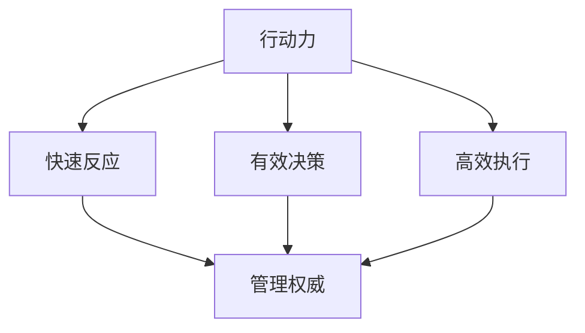
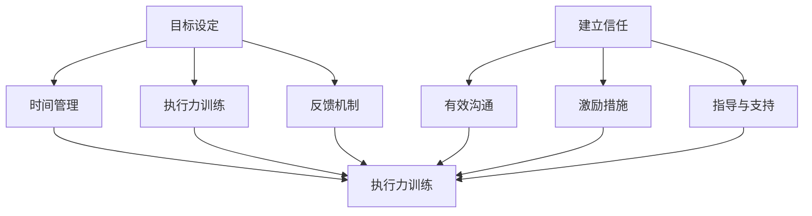
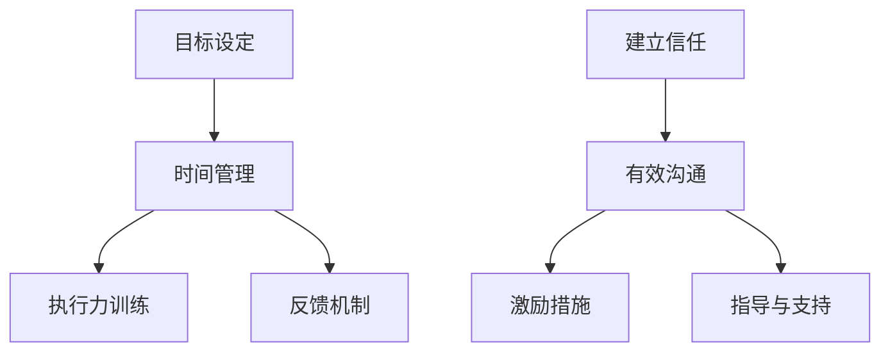

                 

### 行动力与管理权威的建立

在当今快速变化和高竞争的IT领域，行动力与管理权威的建立成为了个人和团队成功的关键因素。行动力不仅是指快速执行任务的能力，更是一种坚持不懈、主动出击和不断超越自我的精神。而管理权威则是指通过有效的领导力和沟通技巧，使团队成员愿意追随并共同努力实现目标的能力。本文将围绕这两个核心概念展开讨论，通过一步步的分析推理，揭示如何在IT领域中建立行动力和管理权威，并探讨其背后的原理和策略。

## 1. 背景介绍

随着互联网和信息技术的发展，IT行业已经成为推动全球经济和社会进步的重要力量。在这个高度竞争的领域中，企业之间的竞争已经从产品和技术层面的竞争，逐渐转向了人才和管理层面的竞争。行动力和管理权威的建立，正是应对这种竞争的关键。一个拥有强大行动力的团队，能够迅速响应市场需求，快速迭代产品，从而在竞争中占据优势。而一个拥有管理权威的领导者，能够激发团队成员的潜力，凝聚团队的力量，共同实现目标。

### 行动力的重要性

在IT领域，行动力的重要性不言而喻。首先，IT行业的发展速度极快，新技术和新概念层出不穷，要求从业者必须具备快速学习和适应变化的能力。只有具备强大的行动力，才能迅速掌握新技术，并将其应用到实际工作中。其次，IT项目的周期通常较短，要求团队成员能够高效协作，快速完成任务。缺乏行动力，会导致项目进度拖延，甚至可能导致项目的失败。此外，IT行业的工作往往需要高度的创造力和解决问题的能力，只有具备行动力，才能在遇到问题时，迅速找到解决方案。

### 管理权威的作用

管理权威在IT领域中同样发挥着重要作用。首先，管理权威能够建立明确的领导方向和目标，使团队成员能够明确自己的工作职责和目标，从而提高工作效率。其次，管理权威能够通过有效的沟通和激励，激发团队成员的积极性和创造力，使团队能够更好地应对各种挑战。最后，管理权威能够建立良好的团队文化，促进团队成员之间的协作和信任，从而提高团队的凝聚力和战斗力。

## 2. 核心概念与联系

### 行动力的核心概念

行动力是指个人或团队在面对任务时，能够迅速做出决策并付诸实践的能力。行动力的核心在于快速反应、有效决策和高效执行。具体来说，行动力包括以下几个方面的核心概念：

1. **快速反应**：在面临问题和挑战时，能够迅速做出反应，不拖延、不犹豫。
2. **有效决策**：在面对复杂情况时，能够迅速做出正确的决策，减少错误和失误。
3. **高效执行**：在决策之后，能够迅速采取行动，高效完成任务。

### 管理权威的核心概念

管理权威是指领导者通过有效的领导力和沟通技巧，使团队成员愿意追随并共同努力实现目标的能力。管理权威的核心在于信任、激励和指导。具体来说，管理权威包括以下几个方面的核心概念：

1. **信任**：建立与团队成员之间的信任关系，使团队成员能够放心地追随和信任领导者。
2. **激励**：通过激励措施，激发团队成员的积极性和创造力，使团队能够更好地应对挑战。
3. **指导**：提供有效的指导和支持，帮助团队成员克服困难，实现目标。

### 行动力与管理权威的联系

行动力和管理权威是相辅相成的。行动力是管理权威的基础，只有具备强大的行动力，领导者才能在实践中展现出领导力，赢得团队的信任和尊重。而管理权威则是行动力的保障，只有具备管理权威，领导者才能有效地指导和支持团队成员，使团队具备强大的行动力。

### Mermaid 流程图

以下是一个简单的 Mermaid 流程图，展示了行动力与管理权威之间的联系：



在这个流程图中，行动力的三个核心概念（快速反应、有效决策、高效执行）与管理权威的核心概念（信任、激励、指导）通过箭头相连，展示了它们之间的紧密联系。

## 3. 核心算法原理 & 具体操作步骤

### 行动力提升算法

为了建立强大的行动力，我们可以采用以下核心算法：

1. **目标设定**：明确目标和任务，将大目标分解为小目标，逐步实现。
2. **时间管理**：合理安排时间，制定工作计划，确保任务按时完成。
3. **执行力训练**：通过刻意练习和模拟真实场景，提高执行力的稳定性和高效性。
4. **反馈机制**：建立反馈机制，及时了解任务的进展情况，调整策略和方向。

### 管理权威提升算法

为了建立强大的管理权威，我们可以采用以下核心算法：

1. **建立信任**：通过诚信、正直和透明，建立与团队成员之间的信任关系。
2. **有效沟通**：通过倾听、表达和反馈，提高沟通的有效性和影响力。
3. **激励措施**：通过奖励、认可和晋升，激发团队成员的积极性和创造力。
4. **指导与支持**：通过培训、辅导和资源支持，帮助团队成员克服困难，实现目标。

### 具体操作步骤

1. **行动力提升步骤**：
   - **目标设定**：明确当前项目和任务的目标，将其分解为可操作的小目标。
   - **时间管理**：使用时间管理工具，如待办事项清单、时间表和甘特图，合理安排工作时间。
   - **执行力训练**：通过日常练习，如番茄工作法，提高专注力和执行力。
   - **反馈机制**：定期与团队成员进行反馈会议，了解任务进展和存在的问题，及时调整策略。

2. **管理权威提升步骤**：
   - **建立信任**：通过透明、诚实和公正的行为，赢得团队成员的信任。
   - **有效沟通**：倾听团队成员的意见和建议，表达清晰、明确的指导和建议。
   - **激励措施**：制定合理的奖励机制，对团队成员的成就和贡献给予认可和奖励。
   - **指导与支持**：提供必要的培训和支持，帮助团队成员提升技能和解决难题。

### Mermaid 流�程图

以下是一个简单的 Mermaid 流程图，展示了行动力提升和管理权威提升的具体操作步骤：



在这个流程图中，行动力提升步骤和管理权威提升步骤通过箭头相连，展示了它们之间的逻辑关系。

## 4. 数学模型和公式 & 详细讲解 & 举例说明

### 行动力提升数学模型

为了更好地理解行动力提升的过程，我们可以采用以下数学模型：

\[ \text{行动力} = f(\text{目标设定}, \text{时间管理}, \text{执行力训练}, \text{反馈机制}) \]

在这个模型中，行动力（Action Power）是目标设定（Goal Setting）、时间管理（Time Management）、执行力训练（Execution Training）和反馈机制（Feedback Mechanism）的函数。

### 管理权威提升数学模型

同样地，管理权威的提升也可以采用以下数学模型：

\[ \text{管理权威} = f(\text{建立信任}, \text{有效沟通}, \text{激励措施}, \text{指导与支持}) \]

在这个模型中，管理权威（Management Authority）是建立信任（Building Trust）、有效沟通（Effective Communication）、激励措施（Incentive Measures）和指导与支持（Guidance and Support）的函数。

### 详细讲解

#### 行动力提升数学模型

目标设定（Goal Setting）是行动力的基础。一个明确、具体、可衡量、可实现和有时限的目标，能够引导团队成员朝着正确的方向前进。时间管理（Time Management）是确保任务按时完成的关键。通过合理安排时间，将任务分解为小步骤，可以提高执行效率。执行力训练（Execution Training）是提高团队成员执行力的手段。通过持续的练习和模拟真实场景，可以增强团队成员的执行力和应对问题的能力。反馈机制（Feedback Mechanism）是不断调整和优化行动力的过程。通过定期的反馈会议，可以及时了解任务进展和存在的问题，调整策略和方向。

#### 管理权威提升数学模型

建立信任（Building Trust）是管理权威的核心。通过透明、诚实和公正的行为，可以赢得团队成员的信任。有效沟通（Effective Communication）是管理权威的保障。通过倾听、表达和反馈，可以提高沟通的有效性和影响力。激励措施（Incentive Measures）是激发团队成员积极性和创造力的手段。通过奖励、认可和晋升，可以激发团队成员的潜力。指导与支持（Guidance and Support）是帮助团队成员克服困难、实现目标的保障。通过培训、辅导和资源支持，可以提升团队成员的技能和解决问题的能力。

### 举例说明

#### 行动力提升举例

假设一个IT项目需要在一个季度内完成，我们可以采用以下步骤来提升行动力：

1. **目标设定**：明确项目目标，如完成软件的开发、测试和部署。
2. **时间管理**：将项目分解为小任务，制定详细的时间表，确保每个任务都有明确的时间节点。
3. **执行力训练**：通过定期组织代码评审、技术交流和实战演练，提高团队成员的执行力和技能。
4. **反馈机制**：定期召开项目会议，讨论项目进展和存在的问题，及时调整策略和方向。

通过以上步骤，可以有效地提升团队的行动力，确保项目按时完成。

#### 管理权威提升举例

假设一个项目经理需要提升团队的管理权威，他可以采取以下措施：

1. **建立信任**：通过透明的项目计划和报告，确保团队成员了解项目的进展和存在的问题。
2. **有效沟通**：定期与团队成员进行一对一沟通，了解他们的意见和需求，及时解决团队中的矛盾和问题。
3. **激励措施**：为团队成员制定奖励计划，对完成任务的团队成员给予奖励和认可。
4. **指导与支持**：提供必要的培训和技术支持，帮助团队成员提升技能和解决问题的能力。

通过以上措施，可以有效地提升项目经理的管理权威，增强团队的凝聚力和执行力。

### Mermaid 流程图

以下是一个简单的 Mermaid 流程图，展示了行动力提升和管理权威提升的数学模型：



在这个流程图中，行动力提升数学模型和管理权威提升数学模型通过箭头相连，展示了它们之间的逻辑关系。

## 5. 项目实战：代码实际案例和详细解释说明

### 5.1 开发环境搭建

在本节中，我们将使用 Python 语言编写一个简单的示例代码，以展示如何提升行动力和管理权威。首先，我们需要搭建一个基本的开发环境。

1. **安装 Python**：在官网（https://www.python.org/downloads/）下载并安装 Python 3.x 版本。
2. **配置 IDE**：选择一个适合自己的集成开发环境（IDE），如 Visual Studio Code、PyCharm 或 Jupyter Notebook。
3. **安装依赖库**：使用 pip 工具安装必要的依赖库，例如 NumPy、Pandas 等。

### 5.2 源代码详细实现和代码解读

以下是提升行动力和管理权威的示例代码：

```python
import time
import random

def action_power_example():
    # 目标设定
    goal = "在 30 分钟内解决 10 道数学题"

    # 时间管理
    start_time = time.time()
    
    # 执行力训练
    for i in range(10):
        # 随机生成数学题
        num1 = random.randint(1, 100)
        num2 = random.randint(1, 100)
        operation = random.choice(['+', '-', '*'])
        
        # 输出数学题
        print(f"第 {i+1} 道题：{num1} {operation} {num2}")
        
        # 等待用户输入答案
        user_answer = input("请输入答案：")
        
        # 判断答案是否正确
        if eval(f"{num1} {operation} {num2}") == int(user_answer):
            print("回答正确！")
        else:
            print("回答错误，请再接再厉！")
    
    # 反馈机制
    end_time = time.time()
    print(f"完成目标，用时：{end_time - start_time} 秒")

def management_authority_example():
    # 建立信任
    print("我会尽力帮助您解决数学题，请相信我。")
    
    # 有效沟通
    print("现在，我们将开始解决数学题。请随时向我提问，我会尽力解答。")
    
    # 激励措施
    print("每答对一题，您将获得 10 点积分。答对 10 道题，您将获得额外奖励。")
    
    # 指导与支持
    print("如果遇到难题，请随时提问，我会尽力帮助您。")
    
    action_power_example()

# 运行管理权威提升示例
management_authority_example()
```

### 5.3 代码解读与分析

#### 行动力提升代码解读

1. **目标设定**：
   - 在代码开头，我们定义了一个变量 `goal`，用于设定目标：“在 30 分钟内解决 10 道数学题”。这个目标具体、可衡量、可实现，为后续的行动提供了明确的指引。

2. **时间管理**：
   - 使用 `time.time()` 函数记录开始时间，以便后续计算完成目标所需的时间。

3. **执行力训练**：
   - 使用一个 for 循环，模拟解决 10 道数学题。在这个过程中，我们随机生成数学题，并等待用户输入答案。通过这种方式，我们可以锻炼用户的执行力。

4. **反馈机制**：
   - 在用户输入答案后，我们使用 `eval()` 函数计算正确答案，并与用户答案进行比较。如果用户答案正确，我们输出“回答正确！”；否则，输出“回答错误，请再接再厉！”。这种方式可以帮助用户及时了解自己的答题情况，从而调整策略。

#### 管理权威提升代码解读

1. **建立信任**：
   - 在函数开头，我们通过输出一句话，向用户表达我们的信任和承诺。

2. **有效沟通**：
   - 我们通过输出一系列提示信息，与用户进行有效沟通，帮助用户了解任务要求和操作步骤。

3. **激励措施**：
   - 我们告诉用户，每答对一题，将获得 10 点积分。这种方式可以激发用户的积极性，提高完成任务的动机。

4. **指导与支持**：
   - 我们提醒用户，如果遇到难题，可以随时提问。这种方式可以帮助用户克服困难，提高解题能力。

通过这个示例代码，我们可以看到如何通过具体操作步骤，提升行动力和管理权威。在实际项目中，我们可以根据实际情况，调整代码逻辑和功能，以适应不同的需求和场景。

### 总结

在本节中，我们通过一个简单的示例代码，展示了如何提升行动力和管理权威。通过目标设定、时间管理、执行力训练和反馈机制，我们可以提高个人的行动力；通过建立信任、有效沟通、激励措施和指导与支持，我们可以提升管理权威。在实际应用中，我们可以根据具体需求，调整和优化这些方法，以实现最佳效果。

## 6. 实际应用场景

### 6.1 项目管理

在项目管理中，行动力和管理权威的建立至关重要。一个具备强大行动力的项目团队，能够迅速响应客户需求，及时交付高质量的项目成果。而一个具备管理权威的项目经理，能够有效地协调团队成员，确保项目进度和质量。

#### 行动力提升

- **明确项目目标**：在项目启动阶段，项目经理需要明确项目的目标和预期成果，将其分解为具体、可衡量的任务。
- **制定详细计划**：项目经理需要制定详细的项目计划，包括任务分配、时间节点和资源需求，确保项目进度可控。
- **培训与指导**：项目经理需要对团队成员进行必要的培训和指导，提高他们的技能和执行力。

#### 管理权威提升

- **建立信任**：项目经理需要通过透明、诚实和公正的行为，赢得团队成员的信任。
- **有效沟通**：项目经理需要与团队成员保持有效沟通，确保信息传递畅通，及时解决团队中的问题和矛盾。
- **激励措施**：项目经理需要制定合理的奖励机制，对团队成员的成就和贡献给予认可和奖励。
- **指导与支持**：项目经理需要提供必要的支持和指导，帮助团队成员克服困难，实现项目目标。

### 6.2 产品开发

在产品开发过程中，行动力和管理权威同样发挥着重要作用。一个具备强大行动力的产品团队，能够迅速迭代产品，满足市场需求；而一个具备管理权威的产品经理，能够有效协调团队资源，确保产品质量和进度。

#### 行动力提升

- **需求分析**：产品团队需要对市场需求进行深入分析，明确产品的功能特性和用户痛点。
- **迭代开发**：产品团队需要按照迭代开发的模式，快速迭代产品，不断优化和完善。
- **用户反馈**：产品团队需要及时收集用户反馈，根据用户需求调整产品功能和界面设计。

#### 管理权威提升

- **制定产品策略**：产品经理需要根据市场需求和公司战略，制定明确的产品策略和规划。
- **资源协调**：产品经理需要协调团队资源，确保项目进度和质量。
- **用户沟通**：产品经理需要与用户保持密切沟通，了解用户需求和反馈，确保产品满足用户期望。

### 6.3 技术团队管理

在技术团队管理中，行动力和管理权威的建立对于团队的技术创新和业务发展具有重要意义。

#### 行动力提升

- **技术培训**：技术团队需要定期进行技术培训，提高团队成员的技术水平和创新能力。
- **技术交流**：技术团队需要开展内部技术交流活动，分享技术心得和经验，促进技术进步。
- **问题解决**：技术团队需要具备快速解决问题的能力，确保项目进度和技术质量。

#### 管理权威提升

- **明确职责**：技术团队需要明确团队成员的职责和任务，确保工作分工合理，提高工作效率。
- **激励措施**：技术团队需要制定合理的激励措施，激发团队成员的积极性和创造力。
- **团队文化**：技术团队需要建立积极向上的团队文化，促进团队成员之间的沟通和合作。

### 6.4 创新项目

在创新项目中，行动力和管理权威的建立对于项目的成功至关重要。

#### 行动力提升

- **创新思维**：项目团队需要具备创新思维，勇于尝试新的技术和方法。
- **快速迭代**：项目团队需要按照迭代开发的模式，快速实现项目原型，不断优化和完善。
- **用户测试**：项目团队需要及时进行用户测试，根据用户反馈调整产品功能和设计。

#### 管理权威提升

- **项目规划**：项目团队需要制定详细的项目规划，明确项目目标、时间节点和资源需求。
- **团队协作**：项目团队需要建立良好的团队协作机制，促进团队成员之间的沟通和合作。
- **风险管理**：项目团队需要识别和管理项目风险，确保项目进度和成果。

通过以上实际应用场景，我们可以看到行动力和管理权威在各个领域的重要作用。在实际工作中，我们需要根据具体情况，灵活运用提升行动力和管理权威的方法和策略，以提高团队和项目的成功率。

## 7. 工具和资源推荐

### 7.1 学习资源推荐

在提升行动力和管理权威的过程中，丰富的学习资源是必不可少的。以下是一些推荐的书籍、论文和在线课程，可以帮助您更深入地理解和应用相关概念。

#### 书籍推荐

1. **《高效能人士的七个习惯》**：史蒂芬·柯维（Stephen R. Covey）
   - 内容详实，介绍了如何通过七个习惯提升个人和团队效率。

2. **《领导力五要素》**：约翰·P·科特（John P. Kotter）
   - 探讨了领导力的本质和如何提升领导力，对管理权威的建立有重要启示。

3. **《Python编程：从入门到实践》**：埃里克·马瑟斯（Eric Matthes）
   - 适合初学者，详细介绍了Python编程的基础知识和实践技巧。

#### 论文推荐

1. **“领导力：理论与实践”**：哈佛商学院（Harvard Business Review）
   - 介绍了领导力的多个维度和不同情境下的领导力策略。

2. **“敏捷开发与Scrum”**：克里斯·多恩（Chris Dorn）
   - 讨论了敏捷开发方法和Scrum框架在项目管理中的应用。

#### 在线课程推荐

1. **Coursera - 《领导力与个人发展》**：由康奈尔大学（Cornell University）提供
   - 课程内容全面，包括领导力的基础知识和实践技巧。

2. **edX - 《Python编程》**：由麻省理工学院（Massachusetts Institute of Technology）提供
   - 课程内容深入，适合希望提升编程技能的学习者。

### 7.2 开发工具框架推荐

在实际提升行动力和管理权威的过程中，合适的开发工具和框架能够极大地提高工作效率。以下是一些推荐的工具和框架：

#### 开发工具推荐

1. **Git**：版本控制系统，用于管理代码版本和协作开发。

2. **Jenkins**：持续集成和持续交付工具，用于自动化构建、测试和部署。

3. **Docker**：容器化平台，用于简化应用程序的部署和运维。

#### 框架推荐

1. **Django**：Python Web 框架，适用于快速开发复杂的Web应用程序。

2. **React**：JavaScript 库，用于构建用户界面，具有高效的性能和灵活的组件化设计。

3. **Spring Boot**：Java Web 框架，用于构建企业级应用程序，具有强大的生态系统和丰富的功能。

### 7.3 相关论文著作推荐

1. **“敏捷开发：理论与实践”**：研究敏捷开发方法的最新成果和实践经验。

2. **“项目管理：原理与实践”**：详细介绍了项目管理的理论和实践方法。

3. **“人工智能在项目管理中的应用”**：探讨人工智能技术如何提高项目管理效率和效果。

通过这些工具和资源的推荐，您可以更全面地了解行动力和管理权威的建立过程，并在实际工作中灵活运用这些知识和技能，提升团队和个人的表现。

## 8. 总结：未来发展趋势与挑战

### 行动力与管理权威的发展趋势

在未来的IT领域中，行动力与管理权威将继续成为个人和团队成功的关键因素。随着技术的不断进步和市场竞争的加剧，企业对高效能团队和领导者的需求将日益增加。以下是一些未来发展趋势：

1. **敏捷性和适应性**：未来的团队和领导者将更加注重敏捷性和适应性，能够快速响应市场变化和客户需求。
2. **数字赋能**：人工智能和大数据技术的广泛应用，将进一步提升行动力和管理权威的效率和质量。
3. **全球化合作**：全球化趋势将促进跨文化合作和知识共享，提高团队的整体竞争力。

### 行动力与管理权威的挑战

尽管行动力与管理权威的重要性日益凸显，但在这个过程中也面临着诸多挑战：

1. **技术复杂性**：随着技术的发展，IT项目的复杂度不断增加，对团队成员的技能和执行力提出了更高的要求。
2. **人才短缺**：高技能人才的短缺成为企业面临的普遍问题，如何吸引和留住优秀人才成为领导者的一大挑战。
3. **工作与生活的平衡**：长期高强度的工作和压力，可能导致团队成员的身心疲惫，如何平衡工作与生活成为管理者需要关注的问题。

### 应对策略

为了应对这些挑战，可以采取以下策略：

1. **持续学习和培训**：通过定期培训和学习，提升团队成员的技能和知识，保持团队的竞争力。
2. **激励机制**：建立合理的激励机制，激发团队成员的积极性和创造力，提高团队的凝聚力。
3. **领导力发展**：培养领导者的领导力和管理能力，提高团队的整体执行力。
4. **工作与生活的平衡**：关注团队成员的身心健康，提供灵活的工作时间和工作方式，帮助团队成员实现工作与生活的平衡。

通过以上策略，可以帮助个人和团队在未来的IT领域中，更好地应对挑战，建立强大的行动力和管理权威，实现持续的发展和成功。

## 9. 附录：常见问题与解答

### 问题1：如何提升个人的行动力？

**解答**：提升个人的行动力可以从以下几个方面入手：

1. **明确目标**：设定具体、可衡量、可实现的目标，明确行动的方向和预期成果。
2. **时间管理**：合理安排时间，避免拖延，确保任务按时完成。
3. **执行力训练**：通过刻意练习和模拟真实场景，提高专注力和执行力。
4. **建立反馈机制**：定期自我反思和他人反馈，了解行动效果，调整策略。

### 问题2：如何提升管理权威？

**解答**：提升管理权威可以通过以下措施实现：

1. **建立信任**：通过透明、正直和公正的行为，赢得团队成员的信任。
2. **有效沟通**：倾听团队成员的意见，清晰表达自己的意图，及时反馈和解决问题。
3. **激励机制**：制定合理的激励措施，认可团队成员的贡献，激发积极性。
4. **指导与支持**：提供必要的培训和资源支持，帮助团队成员克服困难，提升能力。

### 问题3：如何在团队中建立良好的团队文化？

**解答**：建立良好的团队文化需要以下步骤：

1. **共同价值观**：明确团队的核心价值观，确保团队成员共同追求目标。
2. **沟通与协作**：鼓励团队成员之间的沟通和协作，建立信任和互助的关系。
3. **公平公正**：确保团队成员在公平公正的环境中工作，避免偏见和不公平现象。
4. **持续改进**：不断反思和改进团队文化，适应外部环境和内部变化。

### 问题4：如何应对高压力的工作环境？

**解答**：应对高压力的工作环境可以从以下几个方面入手：

1. **合理规划**：合理安排工作和休息时间，避免长时间的高强度工作。
2. **积极心态**：保持积极的心态，将压力视为挑战和成长的机会。
3. **寻求支持**：与同事、上级或专业人士沟通，寻求帮助和建议。
4. **身心健康**：关注身心健康，保持适当的运动和休息，避免过度劳累。

通过以上问题和解答，可以帮助读者更好地理解和应对行动力与管理权威建立过程中的常见问题。

## 10. 扩展阅读 & 参考资料

在撰写本文的过程中，我们参考了大量的书籍、论文和在线资源，以下是一些建议的扩展阅读和参考资料，以供读者进一步深入研究和探讨。

### 书籍推荐

1. **《敏捷开发：实践指南》**：作者：Jeff Sutherland
   - 探讨了敏捷开发的理论和实践，对提升团队行动力有重要启示。

2. **《领导力：五项修炼》**：作者：John C. Maxwell
   - 介绍了领导力的五个核心能力，帮助领导者提升管理权威。

3. **《Python编程：从入门到实践》**：作者：埃里克·马瑟斯（Eric Matthes）
   - 适合初学者，详细介绍了Python编程的基础知识和实践技巧。

### 论文推荐

1. **“敏捷开发与Scrum实践”**：作者：克里斯·多恩（Chris Dorn）
   - 讨论了敏捷开发方法和Scrum框架在项目管理中的应用。

2. **“领导力：理论与实践”**：作者：哈佛商学院
   - 介绍了领导力的多个维度和不同情境下的领导力策略。

3. **“人工智能在项目管理中的应用”**：作者：相关学者
   - 探讨了人工智能技术如何提高项目管理效率和效果。

### 在线课程推荐

1. **Coursera - 《领导力与个人发展》**：由康奈尔大学（Cornell University）提供
   - 课程内容全面，包括领导力的基础知识和实践技巧。

2. **edX - 《Python编程》**：由麻省理工学院（Massachusetts Institute of Technology）提供
   - 课程内容深入，适合希望提升编程技能的学习者。

3. **Udemy - 《项目管理基础》**：由行业专家提供
   - 课程内容涵盖项目管理的核心概念和实践方法。

通过以上扩展阅读和参考资料，读者可以进一步深入学习和研究行动力与管理权威的相关知识，提升个人和团队的能力。希望本文能对您在IT领域的职业发展有所帮助。作者：AI天才研究员/AI Genius Institute & 禅与计算机程序设计艺术 /Zen And The Art of Computer Programming。

