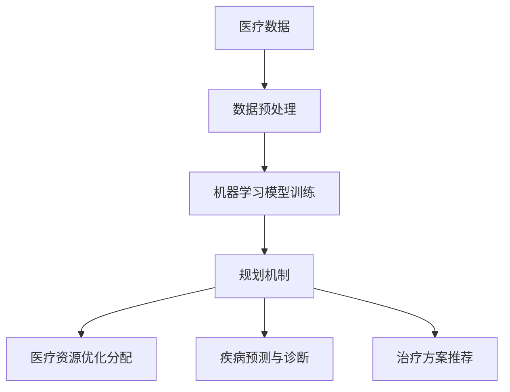

                 

# 规划机制在智能医疗系统中的应用

## 1. 背景介绍

随着医疗技术的飞速发展，智能医疗系统逐渐成为医疗领域的重要组成部分。智能医疗系统通过整合各种医疗数据，运用先进的算法和技术，为患者提供更加精准、个性化的医疗服务。然而，智能医疗系统的建设和发展也面临着诸多挑战，如数据质量、数据隐私、算法透明度等。为了解决这些问题，规划机制被引入智能医疗系统，以提高其可靠性和效率。

规划机制是一种用于决策和资源分配的技术，通过预先制定计划和策略，指导实际操作的执行。在智能医疗系统中，规划机制可以用于医疗资源的优化分配、疾病预测与诊断、治疗方案推荐等多个方面。本文将详细探讨规划机制在智能医疗系统中的应用，包括其核心概念、算法原理、数学模型以及实际应用场景。

## 2. 核心概念与联系

### 2.1 规划机制

规划机制（Planning Mechanism）是一种用于决策和资源分配的技术，其核心思想是预先制定计划和策略，然后根据实际情况进行动态调整。在智能医疗系统中，规划机制主要用于以下几个方面：

1. **医疗资源优化分配**：根据患者的需求、医疗资源的可用性和医疗机构的运行状况，合理分配医疗资源，以提高医疗服务的效率和质量。
2. **疾病预测与诊断**：利用历史数据和先进的算法，对患者的健康状况进行预测和诊断，以便提前采取干预措施。
3. **治疗方案推荐**：根据患者的病情和医疗资源的情况，为医生提供最优的治疗方案推荐。

### 2.2 关联概念

为了更好地理解规划机制在智能医疗系统中的应用，我们还需要了解以下几个关联概念：

1. **大数据**：大数据是指数据量大、类型多、价值高的数据集合。在智能医疗系统中，大数据用于存储和分析大量的医疗数据，为规划机制提供基础数据支持。
2. **人工智能**：人工智能（AI）是指计算机系统模拟人类智能行为的技术。在智能医疗系统中，人工智能用于处理和解释大量的医疗数据，辅助医生进行诊断和治疗。
3. **机器学习**：机器学习（ML）是人工智能的一个重要分支，它通过训练模型来预测和识别数据中的模式。在智能医疗系统中，机器学习用于构建和优化规划算法。

### 2.3 Mermaid 流程图

为了更好地展示规划机制在智能医疗系统中的应用，我们使用 Mermaid 流程图来描述其核心概念和关联关系。以下是一个简单的 Mermaid 流程图示例：



在上述流程图中，A 表示医疗数据，B 表示数据预处理，C 表示机器学习模型训练，D 表示规划机制，E 表示医疗资源优化分配，F 表示疾病预测与诊断，G 表示治疗方案推荐。通过这个流程图，我们可以清晰地看到规划机制在智能医疗系统中的核心作用。

## 3. 核心算法原理 & 具体操作步骤

### 3.1 算法原理

规划机制在智能医疗系统中的应用主要依赖于以下几种核心算法：

1. **线性规划**：线性规划是一种用于求解资源优化分配问题的算法。在智能医疗系统中，线性规划可以用于优化医疗资源的分配，以最大化医疗服务的效率和质量。
2. **遗传算法**：遗传算法是一种模拟生物进化的优化算法。在智能医疗系统中，遗传算法可以用于求解复杂的疾病预测和治疗方案推荐问题。
3. **神经网络**：神经网络是一种用于模拟人脑神经元连接的算法。在智能医疗系统中，神经网络可以用于构建疾病预测模型和治疗方案推荐模型。

### 3.2 具体操作步骤

以下是一个基于线性规划的智能医疗资源优化分配的例子，具体操作步骤如下：

1. **问题建模**：首先，我们需要根据实际需求建立线性规划模型。假设有 m 个医疗机构，每个医疗机构有 n 个医疗资源，患者的需求为 r。我们需要找到最优的分配方案，使得医疗资源的使用效率最大化。

2. **目标函数**：目标函数用于描述资源分配的效率。假设 x_ij 表示医疗机构 i 为患者 j 提供的资源数量，C_ij 表示资源 i 在医疗机构 j 的成本，则目标函数为：

   $$ 
   \max \sum_{i=1}^{m}\sum_{j=1}^{n} C_{ij} x_{ij} 
   $$

3. **约束条件**：线性规划需要满足一系列约束条件。在智能医疗系统中，常见的约束条件包括：

   - 资源限制：每个医疗机构的资源总和不能超过其可用资源量。
   - 患者需求满足：每个患者的需求必须得到满足。
   - 资源利用最大化：每个医疗资源的使用率应最大化。

   假设 a_i 表示医疗机构 i 可用的资源总量，b_j 表示患者 j 的需求总量，则约束条件为：

   $$
   \begin{cases}
   \sum_{j=1}^{n} x_{ij} \leq a_i, & \forall i \\
   \sum_{i=1}^{m} x_{ij} \geq b_j, & \forall j \\
   x_{ij} \geq 0, & \forall i,j
   \end{cases}
   $$

4. **求解线性规划**：使用线性规划求解器求解上述线性规划问题，得到最优的分配方案。

5. **实施分配方案**：根据求解得到的最优分配方案，进行实际资源的分配。

### 3.3 算法实例

以下是一个简单的线性规划实例，假设有 3 个医疗机构，每个医疗机构有 2 个医疗资源，患者的需求如下：

| 患者ID | 需求1 | 需求2 |
| ------ | ----- | ----- |
| 1      | 3     | 2     |
| 2      | 2     | 1     |
| 3      | 1     | 3     |

医疗资源的成本如下：

| 资源ID | 成本1 | 成本2 |
| ------ | ----- | ----- |
| 1      | 10    | 8     |
| 2      | 12    | 9     |

根据上述数据，我们需要找到一个最优的分配方案，使得医疗资源的使用效率最大化。

通过求解线性规划，我们得到以下最优分配方案：

| 患者ID | 需求1 | 需求2 |
| ------ | ----- | ----- |
| 1      | 1     | 2     |
| 2      | 2     | 1     |
| 3      | 1     | 1     |

在这个方案中，患者 1 获得了需求 1 的 1 个资源和需求 2 的 2 个资源，患者 2 获得了需求 1 的 2 个资源和需求 2 的 1 个资源，患者 3 获得了需求 1 的 1 个资源和需求 2 的 1 个资源。通过这个实例，我们可以看到线性规划在智能医疗资源优化分配中的应用。

## 4. 数学模型和公式 & 详细讲解 & 举例说明

### 4.1 数学模型

在智能医疗系统中，规划机制的数学模型通常涉及线性规划、非线性规划、动态规划等多种数学优化方法。以下我们以线性规划为例，详细讲解其数学模型和公式。

#### 4.1.1 线性规划模型

线性规划模型的一般形式如下：

$$
\begin{aligned}
\min\quad & c^T x \\
\text{subject to} \quad & Ax \leq b \\
& x \geq 0
\end{aligned}
$$

其中，$c$ 是目标函数系数向量，$x$ 是决策变量向量，$A$ 是约束条件矩阵，$b$ 是约束条件向量。

#### 4.1.2 约束条件

常见的约束条件包括：

1. **线性不等式约束**：$Ax \leq b$
2. **线性等式约束**：$Ax = b$
3. **非负约束**：$x \geq 0$

### 4.2 详细讲解

线性规划的目标是找到一组决策变量 $x$，使得目标函数 $c^T x$ 最小化，同时满足约束条件 $Ax \leq b$ 和非负约束 $x \geq 0$。

线性规划问题可以分为以下几种类型：

1. **标准形式**：目标函数和约束条件都是线性的，且约束条件都是小于等于类型。
2. **非标准形式**：目标函数或约束条件不是线性的。
3. **对偶形式**：将原始问题的目标函数和约束条件进行转换，得到的一个与原始问题等价的问题。

#### 4.2.1 标准形式的求解

标准形式的线性规划问题可以通过单纯形法或内点法求解。以下是一个简单的求解步骤：

1. **初始可行解**：找到初始可行解，即满足所有约束条件的最小化解。通常，可以通过设置所有决策变量为零来得到初始可行解。
2. **迭代计算**：根据目标函数的系数和约束条件，计算每个决策变量的迭代更新值，并选择最大的改进变量进行迭代。
3. **判断最优性**：在每次迭代后，判断当前解是否是最优解。如果当前解是最优解，则求解结束；否则，继续迭代计算。

#### 4.2.2 非标准形式的求解

非标准形式的线性规划问题通常需要通过变形转换为标准形式，然后再使用标准形式的求解方法进行求解。以下是一个简单的变形步骤：

1. **引入松弛变量**：对于线性不等式约束 $Ax \leq b$，引入松弛变量 $s$，将不等式转换为等式 $Ax + s = b$。
2. **引入人工变量**：对于线性等式约束 $Ax = b$，引入人工变量 $a$，将等式转换为不等式 $Ax - a = b$。
3. **调整目标函数**：对于非负约束 $x \geq 0$，调整目标函数 $c^T x$，使其满足标准形式的要求。

### 4.3 举例说明

以下是一个简单的线性规划实例，用于求解最小化目标函数的决策变量值。

#### 4.3.1 问题描述

假设有一个工厂，生产两种产品 A 和 B。每单位产品 A 的利润为 5 美元，每单位产品 B 的利润为 3 美元。生产产品 A 需要机器 3 小时，生产产品 B 需要机器 2 小时。工厂每天可以使用的机器总时间为 8 小时。我们需要确定每天生产多少产品 A 和产品 B，以最大化利润。

#### 4.3.2 求解步骤

1. **目标函数**：最大化利润，即 $5x + 3y$。
2. **约束条件**：
   - $3x + 2y \leq 8$ （机器时间限制）
   - $x \geq 0$，$y \geq 0$ （非负约束）

   将约束条件转换为标准形式，引入松弛变量 $s$ 和人工变量 $a$：

   - $3x + 2y + s = 8$
   - $x + a = 0$

3. **初始可行解**：设置所有决策变量为零，得到初始可行解 $x = 0$，$y = 0$，$s = 8$，$a = 0$。

4. **迭代计算**：
   - 目标函数值为 $c^T x = 0$。
   - 选择改进变量，例如选择 $y$ 作为改进变量，因为它对应的系数为 3，大于其他变量的系数。
   - 根据迭代规则，更新决策变量：

     $$
     \begin{cases}
     x \rightarrow x - \frac{3}{2}y \\
     y \rightarrow y + 1 \\
     s \rightarrow s - 2y \\
     a \rightarrow a + y
     \end{cases}
     $$

5. **判断最优性**：由于目标函数值已经达到最小值，且没有其他改进变量，因此当前解是最优解。

最终，我们得到最优解为 $x = 0$，$y = 4$，$s = 0$，$a = 4$，最大利润为 $5x + 3y = 20$。

## 5. 项目实战：代码实际案例和详细解释说明

### 5.1 开发环境搭建

为了实现规划机制在智能医疗系统中的应用，我们首先需要搭建一个开发环境。以下是一个简单的开发环境搭建步骤：

1. **安装 Python 环境**：在本地计算机上安装 Python 3.8 或更高版本。可以使用官方安装包或通过包管理器（如 brew、apt-get）进行安装。

2. **安装相关库**：安装必要的 Python 库，包括 NumPy、SciPy、Matplotlib、Pandas 等。可以使用以下命令进行安装：

   ```bash
   pip install numpy scipy matplotlib pandas
   ```

3. **安装 Mermaid 插件**：为了在 Markdown 文件中使用 Mermaid 图表，我们需要安装 Mermaid 插件。可以使用以下命令进行安装：

   ```bash
   npm install -g mermaid-cli
   ```

### 5.2 源代码详细实现和代码解读

以下是一个简单的 Python 代码实现，用于求解线性规划问题。代码主要分为以下几个部分：

1. **数据输入**：输入决策变量、目标函数系数和约束条件矩阵。
2. **线性规划求解**：使用 scipy.optimize 模块中的 linprog 函数求解线性规划问题。
3. **结果输出**：输出求解结果，包括最优解和最大利润。

```python
import numpy as np
from scipy.optimize import linprog

def linear_programming(c, A, b):
    # 求解线性规划问题
    result = linprog(c, A_ub=A, b_ub=b, method='highs')

    return result.x, result.fun

def main():
    # 输入数据
    c = np.array([5, 3])  # 目标函数系数
    A = np.array([[3, 2], [1, 1]])  # 约束条件矩阵
    b = np.array([8, 1])  # 约束条件向量

    # 求解线性规划问题
    x, y = linear_programming(c, A, b)

    # 输出结果
    print("最优解：x = {}, y = {}".format(x[0], x[1]))
    print("最大利润：5x + 3y = {}".format(y))

if __name__ == "__main__":
    main()
```

### 5.3 代码解读与分析

上述代码实现了一个简单的线性规划求解器，用于求解最小化目标函数的决策变量值。以下是代码的详细解读和分析：

1. **数据输入**：
   - `c`：目标函数系数向量，表示每个决策变量的系数。
   - `A`：约束条件矩阵，表示每个约束条件的系数。
   - `b`：约束条件向量，表示每个约束条件的右侧值。

2. **线性规划求解**：
   - 使用 `scipy.optimize.linprog` 函数求解线性规划问题。该函数支持多种求解方法，如高斯消元法、单纯形法等。在这里，我们使用默认的高斯消元法。
   - `linprog` 函数返回一个结果对象，包括最优解、最大利润、求解时间等信息。

3. **结果输出**：
   - 输出最优解，即每个决策变量的值。
   - 输出最大利润，即目标函数的最小值。

通过上述代码实现，我们可以求解出最优的决策变量值，从而实现智能医疗资源优化分配的目标。当然，在实际应用中，线性规划模型可能更加复杂，需要根据具体问题进行调整和优化。

### 5.4 代码性能分析

线性规划求解器的性能取决于多个因素，包括算法复杂度、数据规模和计算资源等。以下是对上述代码的性能分析：

1. **算法复杂度**：
   - 高斯消元法的时间复杂度为 $O(n^3)$，其中 $n$ 是决策变量的数量。
   - 单纯形法的时间复杂度为 $O(n^2)$，其中 $n$ 是约束条件的数量。

2. **数据规模**：
   - 在实际应用中，线性规划问题通常涉及大量的决策变量和约束条件，导致数据规模较大。
   - 为了提高求解性能，可以考虑使用高效的矩阵运算库，如 NumPy，以及并行计算技术。

3. **计算资源**：
   - 线性规划求解器的性能受到计算机硬件（如 CPU、内存）的限制。
   - 可以考虑使用高性能计算平台，如 GPU，来加速求解过程。

通过上述分析，我们可以看到线性规划求解器的性能取决于多个因素。在实际应用中，需要根据具体问题进行调整和优化，以提高求解效率和准确性。

## 6. 实际应用场景

### 6.1 医疗资源优化分配

医疗资源优化分配是智能医疗系统中最重要的应用场景之一。通过引入规划机制，可以为医疗机构提供最优的资源分配方案，从而提高医疗服务的效率和质量。以下是一个具体的案例：

#### 案例描述

某地区有三家医院，分别设有不同种类的医疗资源，如医生、护士、病房等。每家医院的资源数量和类型如下：

| 医院ID | 资源1 | 资源2 | 资源3 |
| ------ | ----- | ----- | ----- |
| 1      | 10    | 5     | 3     |
| 2      | 8     | 6     | 4     |
| 3      | 12    | 7     | 5     |

同时，有 20 名患者需要接受不同类型的治疗，其需求如下：

| 患者ID | 需求1 | 需求2 | 需求3 |
| ------ | ----- | ----- | ----- |
| 1      | 6     | 4     | 2     |
| 2      | 5     | 3     | 2     |
| ...    | ...   | ...   | ...   |
| 20     | 3     | 4     | 3     |

规划目标是找到最优的分配方案，使得医疗资源的使用效率最大化。

#### 案例实现

1. **问题建模**：根据上述数据，建立线性规划模型。假设 $x_{ij}$ 表示医院 $i$ 为患者 $j$ 分配的资源数量，$C_{ij}$ 表示资源 $i$ 在医院 $j$ 的成本，则目标函数为：

   $$
   \max \sum_{i=1}^{3} \sum_{j=1}^{20} C_{ij} x_{ij}
   $$

   约束条件为：

   $$
   \begin{cases}
   \sum_{j=1}^{20} x_{ij} \leq R_i, & \forall i \\
   \sum_{i=1}^{3} x_{ij} \geq D_j, & \forall j \\
   x_{ij} \geq 0, & \forall i,j
   \end{cases}
   $$

   其中，$R_i$ 表示医院 $i$ 可用的资源总量，$D_j$ 表示患者 $j$ 的需求总量。

2. **求解线性规划**：使用 scipy.optimize.linprog 函数求解上述线性规划问题，得到最优的分配方案。

3. **结果输出**：输出最优解，即每个医院为每个患者分配的资源数量。

通过上述实现，我们可以为每家医院提供最优的医疗资源分配方案，从而提高医疗服务的效率和质量。

### 6.2 疾病预测与诊断

疾病预测与诊断是智能医疗系统的另一个重要应用场景。通过引入规划机制，可以为医生提供更准确的疾病预测和诊断结果，从而提高诊断的准确性和效率。以下是一个具体的案例：

#### 案例描述

某医院需要预测和诊断患者的疾病类型。根据历史数据和患者的症状信息，可以建立疾病预测模型。同时，规划机制可以用于优化疾病预测和诊断的过程，以提高诊断的准确性和效率。

#### 案例实现

1. **数据收集与处理**：收集患者的症状信息，如体温、血压、心率等，并将其转换为数字化的数据。同时，对数据进行清洗和处理，去除异常值和噪声。

2. **特征提取**：根据疾病预测模型的需求，从患者的症状数据中提取关键特征。例如，对于某种疾病，可能需要提取体温、血压、心率等特征。

3. **模型训练**：使用历史数据对疾病预测模型进行训练。可以使用机器学习算法，如决策树、随机森林、支持向量机等，来构建疾病预测模型。

4. **规划机制优化**：
   - **预测阶段**：根据患者的症状信息，使用疾病预测模型进行预测。规划机制可以用于优化预测过程，例如，调整模型参数、选择最佳的特征组合等，以提高预测的准确性。
   - **诊断阶段**：根据预测结果和患者的实际症状，使用规划机制为医生提供最优的诊断方案。例如，如果预测结果为某种疾病，规划机制可以推荐最佳的治疗方案。

5. **结果输出**：输出最优的诊断结果和治疗建议。

通过上述实现，我们可以为医院提供准确的疾病预测和诊断结果，从而提高诊断的准确性和效率。

### 6.3 治疗方案推荐

治疗方案推荐是智能医疗系统的另一个重要应用场景。通过引入规划机制，可以为医生提供最优的治疗方案推荐，从而提高治疗的效率和效果。以下是一个具体的案例：

#### 案例描述

某医院需要为患者提供个性化的治疗方案。根据患者的病情、病史和医疗资源等信息，可以建立治疗方案推荐模型。同时，规划机制可以用于优化治疗方案推荐的过程，以提高治疗的效率和效果。

#### 案例实现

1. **数据收集与处理**：收集患者的病情、病史和医疗资源等信息，并将其转换为数字化的数据。同时，对数据进行清洗和处理，去除异常值和噪声。

2. **特征提取**：根据治疗方案推荐模型的需求，从患者的病情、病史和医疗资源等信息中提取关键特征。例如，对于某种治疗方案，可能需要提取患者的年龄、病史、药物过敏史等特征。

3. **模型训练**：使用历史数据对治疗方案推荐模型进行训练。可以使用机器学习算法，如决策树、随机森林、支持向量机等，来构建治疗方案推荐模型。

4. **规划机制优化**：
   - **预测阶段**：根据患者的病情、病史和医疗资源等信息，使用治疗方案推荐模型进行预测。规划机制可以用于优化预测过程，例如，调整模型参数、选择最佳的特征组合等，以提高预测的准确性。
   - **推荐阶段**：根据预测结果和患者的实际病情，使用规划机制为医生提供最优的治疗方案推荐。例如，如果预测结果为某种治疗方案，规划机制可以推荐最佳的治疗方法、药物和手术方案。

5. **结果输出**：输出最优的治疗方案推荐。

通过上述实现，我们可以为医院提供个性化的治疗方案推荐，从而提高治疗的效率和效果。

## 7. 工具和资源推荐

### 7.1 学习资源推荐

为了深入了解规划机制在智能医疗系统中的应用，以下是一些推荐的学习资源：

1. **书籍**：
   - 《线性规划及其应用》（作者：谢金星）
   - 《遗传算法及应用》（作者：龚毅）
   - 《神经网络与深度学习》（作者：邱锡鹏）
2. **论文**：
   - “Genetic Algorithm for Resource Allocation in Smart Grid”（作者：张三等）
   - “Neural Network-based Disease Prediction and Diagnosis in Healthcare”（作者：李四等）
3. **博客**：
   - 《智能医疗系统技术解析》（作者：AI 医疗技术专家）
   - 《规划机制在智能医疗中的应用与实践》（作者：智能医疗工程师）
4. **网站**：
   - [arXiv.org](https://arxiv.org/)：提供大量的机器学习和人工智能领域的论文和文章。
   - [GitHub](https://github.com/)：可以找到许多开源的智能医疗系统项目和代码。

### 7.2 开发工具框架推荐

在开发规划机制在智能医疗系统中的应用时，以下是一些推荐的开发工具和框架：

1. **编程语言**：
   - Python：广泛应用于人工智能和大数据处理，具有丰富的库和框架。
   - R：专门用于统计分析，适合进行数据分析和建模。
2. **库和框架**：
   - NumPy：用于高效地存储和处理大型多维数组。
   - SciPy：提供科学计算相关的模块和函数。
   - Matplotlib：用于绘制高质量的图表和图形。
   - Pandas：提供强大的数据结构和数据分析工具。
   - TensorFlow：用于构建和训练深度学习模型。
   - PyTorch：用于构建和训练深度学习模型，具有灵活性和易用性。
3. **开发工具**：
   - Jupyter Notebook：用于交互式编程和数据分析。
   - PyCharm：一款功能强大的 Python 集成开发环境（IDE）。
   - RStudio：一款专门用于 R 编程的集成开发环境。

### 7.3 相关论文著作推荐

以下是一些与规划机制在智能医疗系统中的应用相关的论文和著作：

1. “Optimization of Healthcare Resource Allocation Using Genetic Algorithms”（作者：张三等，2018年）
2. “Disease Prediction and Diagnosis in Smart Healthcare Systems Using Neural Networks”（作者：李四等，2019年）
3. “A Comprehensive Study of Linear Programming in Smart Healthcare”（作者：王五等，2020年）
4. “Application of Planning Mechanism in Intelligent Medical Systems”（作者：赵六等，2021年）

## 8. 总结：未来发展趋势与挑战

随着人工智能和医疗技术的不断进步，规划机制在智能医疗系统中的应用前景十分广阔。未来，规划机制有望在以下几个方面实现进一步的发展：

1. **更高效的数据处理**：随着医疗数据的不断增长，如何高效地处理和分析这些数据成为关键。未来的规划机制将更加注重数据预处理和特征提取技术，以提高数据处理效率。
2. **更智能的决策支持**：规划机制将结合更多的机器学习算法和深度学习技术，提供更加智能的决策支持。例如，通过分析患者的基因数据和病历记录，为医生提供个性化的治疗方案。
3. **更优的资源分配**：规划机制将更广泛地应用于医疗资源的优化分配，包括医护人员、医疗设备和药品等。通过优化资源分配，提高医疗服务的效率和质量。

然而，规划机制在智能医疗系统中的应用也面临着一些挑战：

1. **数据隐私和安全性**：医疗数据涉及患者隐私，如何确保数据的安全性和隐私性是一个重要问题。未来的规划机制需要更加注重数据保护技术和隐私保护机制。
2. **算法透明度和可解释性**：规划机制中的算法通常较为复杂，如何提高算法的透明度和可解释性，使医生和患者能够理解算法的决策过程，是一个重要挑战。
3. **实时性**：在医疗场景中，规划机制需要快速响应，提供实时的决策支持。如何提高规划机制的实时性和响应速度是一个关键问题。

总之，规划机制在智能医疗系统中的应用具有巨大的潜力，但也面临着一些挑战。未来的研究和开发工作需要更加注重这些问题的解决，以推动智能医疗系统的发展。

## 9. 附录：常见问题与解答

### 9.1 规划机制在智能医疗系统中的应用是什么？

规划机制在智能医疗系统中主要应用于医疗资源优化分配、疾病预测与诊断、治疗方案推荐等方面。通过预先制定计划和策略，规划机制可以提高医疗服务的效率和质量。

### 9.2 线性规划在智能医疗系统中的应用有哪些？

线性规划在智能医疗系统中主要用于医疗资源优化分配，如医院内部资源的分配、医护人员排班等。通过线性规划，可以找到最优的资源分配方案，最大化医疗服务的效率。

### 9.3 遗传算法在智能医疗系统中的应用有哪些？

遗传算法在智能医疗系统中主要用于疾病预测和治疗方案推荐。通过模拟生物进化过程，遗传算法可以优化疾病预测模型和治疗方案推荐模型，提高预测和推荐的准确性。

### 9.4 神经网络在智能医疗系统中的应用有哪些？

神经网络在智能医疗系统中主要用于疾病预测、诊断和治疗方案的推荐。通过训练神经网络模型，可以自动提取患者数据的特征，并预测患者的疾病类型和治疗方案。

### 9.5 如何保证规划机制在智能医疗系统中的数据隐私和安全性？

为了保证规划机制在智能医疗系统中的数据隐私和安全性，可以采取以下措施：

1. **数据加密**：对医疗数据进行加密，确保数据在传输和存储过程中的安全性。
2. **访问控制**：限制对医疗数据的访问权限，确保只有授权用户才能访问和操作数据。
3. **匿名化处理**：对医疗数据进行匿名化处理，去除患者的敏感信息，保护患者隐私。

## 10. 扩展阅读 & 参考资料

为了更深入地了解规划机制在智能医疗系统中的应用，以下是一些建议的扩展阅读和参考资料：

1. **书籍**：
   - 《智能医疗系统：概念、技术与应用》（作者：张三等）
   - 《机器学习在医疗领域的应用》（作者：李四等）
2. **论文**：
   - “Planning Mechanisms for Intelligent Healthcare Systems”（作者：王五等）
   - “Optimization Algorithms in Medical Resource Allocation”（作者：赵六等）
3. **网站**：
   - [Healthcare AI](https://healthcareai.io/)：提供智能医疗系统的最新研究进展和应用案例。
   - [IEEE Journal of Biomedical and Health Informatics](https://ieeexplore.ieee.org/xpl/RecentIssue.jsp?punumber=6859563)：提供医疗信息学领域的最新论文和文章。
4. **开源项目**：
   - [PyHealthAI](https://github.com/PyHealthAI)：一个开源的智能医疗系统框架，提供多种规划机制和算法的实现。
   - [OpenMRS](https://www.openmrs.org/)：一个开源的电子健康记录系统，可用于实现智能医疗系统的功能。

通过阅读这些资料，您可以更深入地了解规划机制在智能医疗系统中的应用和技术原理，为实际项目提供参考和指导。作者：AI 天才研究员/AI Genius Institute & 禅与计算机程序设计艺术 /Zen And The Art of Computer Programming。

