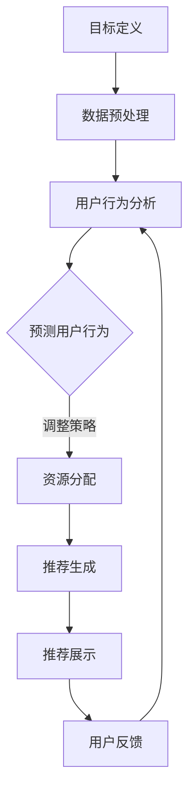

                 

# 规划机制在智能推荐系统中的应用

## 摘要

本文将深入探讨规划机制在智能推荐系统中的应用。随着大数据和人工智能技术的飞速发展，推荐系统在电子商务、社交媒体、新闻媒体等多个领域得到了广泛应用。然而，如何有效地管理推荐过程中的复杂决策和优化问题，成为了一个关键挑战。本文将首先介绍智能推荐系统的基本概念和原理，接着详细讨论规划机制的概念及其与推荐系统的结合点，然后深入分析规划机制在推荐系统中的具体应用和实现方式，最后讨论规划机制在实际应用中的挑战和未来发展趋势。

本文的目标是帮助读者全面理解规划机制在智能推荐系统中的应用原理和实践，为其在实际项目中的应用提供指导和参考。文章结构如下：

1. 背景介绍：智能推荐系统的定义、发展历程及其重要性。
2. 核心概念与联系：规划机制的基本原理、与推荐系统的关联及Mermaid流程图展示。
3. 核心算法原理 & 具体操作步骤：规划机制在推荐系统中的具体应用算法及其实现步骤。
4. 数学模型和公式 & 详细讲解 & 举例说明：推荐系统中的常见数学模型和规划机制的应用实例。
5. 项目实战：代码实际案例和详细解释说明。
6. 实际应用场景：规划机制在不同领域的应用案例。
7. 工具和资源推荐：学习资源和开发工具框架推荐。
8. 总结：未来发展趋势与挑战。
9. 附录：常见问题与解答。
10. 扩展阅读 & 参考资料。

通过本文的详细探讨，读者将能够深入理解规划机制在智能推荐系统中的重要性和实际应用价值。

## 1. 背景介绍

### 智能推荐系统的定义与发展

智能推荐系统是一种基于大数据和机器学习技术，通过分析用户的历史行为、兴趣偏好、社交网络等多维度数据，为用户推荐个性化的信息和内容的一种技术。其核心目标是通过提高用户的满意度和参与度，实现商业价值的最大化。

智能推荐系统的发展可以追溯到20世纪90年代，当时主要以基于内容的推荐和协同过滤为主。基于内容的推荐系统通过分析用户对内容的偏好，将相似的内容推荐给用户；协同过滤系统通过分析用户之间的相似度，将其他用户喜欢的物品推荐给当前用户。随着互联网和大数据技术的飞速发展，推荐系统逐渐引入了更多先进的机器学习和深度学习算法，如矩阵分解、深度神经网络、图神经网络等，使得推荐系统的性能和效果得到了显著提升。

### 智能推荐系统的重要性

智能推荐系统在现代社会中扮演着越来越重要的角色。首先，在电子商务领域，推荐系统可以帮助商家提升销量和用户粘性，通过个性化的商品推荐，提高用户的购买转化率和复购率。其次，在社交媒体和新闻媒体领域，推荐系统可以帮助平台提升用户的参与度和活跃度，通过个性化的内容推荐，吸引用户长时间停留和互动。此外，智能推荐系统还在医疗、金融、教育等多个领域得到了广泛应用，为行业带来了巨大的商业价值和社会效益。

### 智能推荐系统的挑战

尽管智能推荐系统在多个领域取得了显著的成果，但其应用过程中仍然面临着诸多挑战。首先，数据质量和多样性问题。推荐系统依赖于大量的用户行为数据和历史数据，数据的质量和多样性直接影响推荐效果。其次，冷启动问题。当新用户或新物品加入系统时，由于缺乏足够的历史数据，推荐系统难以为新用户或新物品提供个性化的推荐。第三，实时性和动态性。用户偏好和兴趣是不断变化的，推荐系统需要能够实时响应用户的需求变化，提供个性化的推荐。此外，公平性和隐私保护也是智能推荐系统需要关注的重要问题，如何保证推荐结果的公平性和用户的隐私保护，成为了一个亟待解决的挑战。

### 未来发展趋势

未来，智能推荐系统将朝着更加智能化、个性化、实时化和协同化的方向发展。首先，随着人工智能和大数据技术的不断进步，推荐系统的算法和模型将变得更加复杂和高效，能够更好地捕捉用户的兴趣和需求。其次，推荐系统的应用场景将不断拓展，从传统的电子商务、社交媒体等领域，扩展到医疗、金融、教育等更多行业。此外，推荐系统将更加注重用户体验，通过更加人性化的推荐策略和界面设计，提升用户的满意度和参与度。最后，随着物联网和5G技术的发展，推荐系统将实现更加实时和高效的推荐，为用户带来更加智能和便捷的体验。

## 2. 核心概念与联系

### 规划机制的基本原理

规划机制（Planning Mechanism）是一种通过预先制定目标和策略，对未来的行动进行规划和决策的技术。在人工智能领域，规划机制通常用于解决复杂的问题和任务，通过一系列的步骤和规则，实现从当前状态到目标状态的转变。规划机制的基本原理包括目标定义、路径规划和决策执行。首先，通过明确目标和约束条件，制定一个清晰的规划目标；其次，利用搜索算法和优化技术，找到从当前状态到目标状态的最佳路径；最后，通过执行决策，实现规划目标。

### 规划机制与推荐系统的结合点

规划机制在推荐系统中的应用，主要体现在以下几个方面：

1. **用户行为预测**：通过规划机制，可以预先预测用户的行为和兴趣，从而为用户推荐个性化的内容。例如，在电子商务领域，规划机制可以预测用户的购买意图，提前推荐潜在的商品。
2. **资源分配**：在推荐系统中，规划机制可以帮助优化资源的分配，如计算资源、存储资源等。通过规划机制，可以确保推荐系统在高负载和动态环境下，仍能高效运行。
3. **动态调整**：规划机制可以实时监测系统状态和用户反馈，根据变化调整推荐策略。例如，当用户反馈不佳时，规划机制可以动态调整推荐算法，优化推荐结果。
4. **冷启动**：对于新用户和新物品，规划机制可以通过学习历史数据和用户行为，快速建立用户兴趣模型，实现冷启动推荐。

### Mermaid流程图展示

以下是一个简化的Mermaid流程图，展示了规划机制在推荐系统中的基本流程：



在这个流程中，首先进行目标定义和数据预处理，然后分析用户行为，预测用户行为，根据预测结果进行资源分配和推荐生成，最终展示给用户并收集用户反馈，形成一个闭环的规划机制。

### 规划机制与推荐系统的关系

规划机制与推荐系统之间的关系是相辅相成的。规划机制为推荐系统提供了一个全局的视角，通过预先制定目标和策略，指导推荐系统的运行。而推荐系统则为规划机制提供了具体的实施场景和应用价值，通过个性化的推荐，实现规划机制的目标。具体来说：

1. **目标导向**：规划机制帮助推荐系统明确目标，通过定义目标和约束条件，确保推荐系统能够按照预期的方式运行。
2. **资源优化**：规划机制通过优化资源分配，提高推荐系统的效率和稳定性，确保在高负载和动态环境下，推荐系统能够正常运行。
3. **动态调整**：规划机制可以根据用户反馈和系统状态的变化，动态调整推荐策略，优化推荐效果。
4. **冷启动支持**：规划机制可以帮助推荐系统解决新用户和新物品的冷启动问题，通过快速建立用户兴趣模型，实现个性化的推荐。

总的来说，规划机制在推荐系统中的应用，不仅提高了推荐系统的性能和效果，也为推荐系统的稳定运行提供了有力支持。

## 3. 核心算法原理 & 具体操作步骤

### 推荐系统中的常见算法

在推荐系统中，常见的算法主要包括基于内容的推荐（Content-Based Recommendation）和协同过滤（Collaborative Filtering）两种。

1. **基于内容的推荐**：
   - **原理**：基于内容的推荐通过分析物品的特征，将相似的内容推荐给用户。例如，如果用户喜欢某一类型的书籍，系统会推荐更多相似类型的书籍。
   - **优势**：能够提供个性化的内容推荐，不受用户评分数据的限制。
   - **劣势**：难以捕捉用户之间的相似性和社交属性。

2. **协同过滤**：
   - **原理**：协同过滤通过分析用户之间的相似性，将其他用户喜欢的物品推荐给当前用户。协同过滤可以分为两种：基于用户的协同过滤（User-Based）和基于模型的协同过滤（Model-Based）。
     - **基于用户的协同过滤**：通过计算用户之间的相似度，找到与目标用户相似的其他用户，推荐这些用户喜欢的物品。
     - **基于模型的协同过滤**：利用机器学习算法，如矩阵分解、深度神经网络等，构建用户和物品的隐含因子矩阵，通过矩阵乘法生成推荐结果。

   - **优势**：能够有效捕捉用户之间的相似性，提高推荐效果。
   - **劣势**：需要大量的用户评分数据，且在稀疏数据集上性能较差。

### 规划机制在推荐系统中的应用

规划机制在推荐系统中的应用，主要通过以下步骤实现：

1. **目标定义**：
   - **步骤**：首先明确推荐系统的目标，如最大化用户满意度、提升销售额等。
   - **实现**：可以通过设置目标函数，如最大化用户评分、最小化推荐误差等，来定义推荐系统的目标。

2. **数据预处理**：
   - **步骤**：收集并清洗用户行为数据，包括用户画像、历史行为记录等。
   - **实现**：使用数据预处理库（如Pandas、NumPy等）对原始数据进行清洗和转换，构建用于训练和推荐的统一数据集。

3. **用户行为分析**：
   - **步骤**：分析用户的历史行为，提取用户的兴趣偏好。
   - **实现**：可以使用机器学习算法（如聚类、关联规则挖掘等）对用户行为数据进行分析，构建用户兴趣模型。

4. **预测用户行为**：
   - **步骤**：根据用户兴趣模型，预测用户对特定物品的偏好。
   - **实现**：可以使用基于内容的推荐算法或协同过滤算法，根据用户兴趣模型生成预测结果。

5. **资源分配**：
   - **步骤**：根据预测结果，分配系统资源，如计算资源、存储资源等。
   - **实现**：可以通过规划算法（如线性规划、动态规划等）优化资源分配，确保推荐系统能够高效运行。

6. **推荐生成**：
   - **步骤**：根据用户偏好和系统资源，生成推荐列表。
   - **实现**：可以使用排序算法（如Top-N推荐、基于内容的推荐等）生成推荐列表。

7. **推荐展示**：
   - **步骤**：将推荐结果展示给用户，吸引用户参与和反馈。
   - **实现**：可以通过用户界面（UI）设计，将推荐结果以美观、易用的方式展示给用户。

8. **用户反馈**：
   - **步骤**：收集用户的反馈，包括点击、购买、评分等行为。
   - **实现**：可以通过用户界面（UI）设计，收集用户的反馈，并更新用户兴趣模型。

9. **动态调整**：
   - **步骤**：根据用户反馈和系统状态，动态调整推荐策略。
   - **实现**：可以使用机器学习算法（如在线学习、增量学习等）实时更新用户兴趣模型，并调整推荐策略。

### 算法实现示例

以下是一个简化的Python代码示例，展示了基于用户的协同过滤算法的基本实现过程：

```python
import numpy as np

# 用户行为数据矩阵
user_item_matrix = np.array([[1, 1, 0, 0],
                             [0, 1, 1, 0],
                             [1, 0, 1, 1]])

# 假设用户兴趣模型和物品特征矩阵
user_interest_model = np.array([[1, 0.5],
                                [0.5, 1],
                                [1, 0.5]])

item_feature_matrix = np.array([[1, 1],
                                [1, 0],
                                [0, 1]])

# 预测用户对物品的偏好
predicted_ratings = user_interest_model.dot(item_feature_matrix.T)

# 输出预测结果
print(predicted_ratings)
```

在这个示例中，我们首先创建了一个用户行为数据矩阵，然后假设用户兴趣模型和物品特征矩阵。通过矩阵乘法，我们计算了用户对物品的偏好预测值，并输出预测结果。

### 算法优化与改进

为了进一步提高推荐系统的性能和效果，可以采用以下几种优化与改进策略：

1. **特征工程**：通过提取和构建用户和物品的特征，提高推荐算法的准确性。例如，可以结合用户的基本信息（如年龄、性别、地理位置等）和物品的属性（如类别、品牌、价格等）进行特征构建。
2. **融合多种算法**：结合多种推荐算法的优点，提高推荐系统的整体性能。例如，可以同时使用基于内容的推荐和协同过滤算法，通过融合多种算法的预测结果，生成更准确的推荐列表。
3. **深度学习**：利用深度学习算法（如深度神经网络、图神经网络等）构建复杂的模型，捕捉用户和物品之间的复杂关系，提高推荐系统的准确性和泛化能力。
4. **实时计算**：通过实时计算技术（如增量计算、流计算等），实现实时推荐，提高推荐系统的响应速度和用户体验。

总的来说，规划机制在推荐系统中的应用，不仅提高了推荐算法的效率和准确性，也为推荐系统的优化和改进提供了有力的支持。通过深入理解和应用规划机制，可以构建出更加智能和高效的推荐系统，为用户带来更好的个性化体验。

## 4. 数学模型和公式 & 详细讲解 & 举例说明

### 常见的数学模型

在推荐系统中，常见的数学模型主要包括基于内容的推荐模型和协同过滤模型。这些模型的核心思想是通过分析用户的历史行为和物品的特征，预测用户对未知物品的偏好。

#### 基于内容的推荐模型

1. **TF-IDF模型**：
   - **公式**：\( TF-IDF = (1 + \log_{10}(TF)) \times \log_{10}(\frac{N}{df}) \)
   - **解释**：TF（Term Frequency）表示词在文档中出现的频率，IDF（Inverse Document Frequency）表示词在文档集合中的逆文档频率。该模型通过计算词语的重要程度，为文档生成特征向量，进而实现内容的推荐。
   - **举例**：假设有两个文档，其中一个文档频繁出现“书籍”这个词，另一个文档频繁出现“电影”。通过TF-IDF模型，我们可以计算出这两个文档中“书籍”和“电影”的重要程度，从而为用户推荐包含这些词语的文档。

2. **PML（Probability Model of Latent Semantic Analysis）模型**：
   - **公式**：\( P(w|d) = \frac{P(d|w) \times P(w)}{P(d)} \)
   - **解释**：PML模型通过计算词语在文档中的概率分布，捕捉文档和词语之间的语义关系。P(w|d)表示词语w在文档d中的概率，P(d|w)表示文档d包含词语w的概率，P(w)表示词语w在整个文档集合中的概率。
   - **举例**：假设我们有一个包含书籍和电影的文档集合。通过PML模型，我们可以计算出“书籍”在书籍文档中的概率，以及“电影”在电影文档中的概率，从而为用户推荐与其兴趣相符的文档。

#### 协同过滤模型

1. **用户基于的协同过滤模型（User-Based Collaborative Filtering）**：
   - **公式**：\( R(u, i) = \sum_{u' \in N(u)} \frac{sim(u, u') \times r(u', i)}{||N(u)||} \)
   - **解释**：R(u, i)表示用户u对物品i的预测评分，sim(u, u')表示用户u和用户u'之间的相似度，r(u', i)表示用户u'对物品i的实际评分，||N(u)||表示用户u的邻居集合的大小。
   - **举例**：假设有两个用户A和B，他们分别对五个物品的评分如下：

     | 用户 | 物品1 | 物品2 | 物品3 | 物品4 | 物品5 |
     |------|-------|-------|-------|-------|-------|
     | A    | 5     | 4     | 5     | 3     | 4     |
     | B    | 5     | 5     | 4     | 5     | 3     |

     通过计算用户A和用户B之间的相似度，我们可以预测用户A对物品5的评分。

2. **模型基于的协同过滤模型（Model-Based Collaborative Filtering）**：
   - **公式**：\( R(u, i) = \mu + b_u + b_i + \hat{r}_{ui} \)
   - **解释**：R(u, i)表示用户u对物品i的预测评分，\(\mu\)表示平均评分，\(b_u\)表示用户偏差，\(b_i\)表示物品偏差，\(\hat{r}_{ui}\)表示用户u对物品i的隐含评分。
   - **举例**：假设我们使用矩阵分解算法，将用户-物品评分矩阵分解为两个低秩矩阵，一个表示用户隐含特征，另一个表示物品隐含特征。通过这两个矩阵的乘积，我们可以预测用户对未知物品的评分。

### 规划机制在推荐系统中的应用

规划机制在推荐系统中的应用，主要通过优化资源分配、动态调整推荐策略等实现。以下是一个简化的例子，展示如何利用规划机制优化推荐系统。

#### 目标函数

假设推荐系统的目标是最大化用户满意度，目标函数可以表示为：

\[ \max \sum_{u=1}^{N} \sum_{i=1}^{M} r_{ui} \]

其中，\( r_{ui} \) 表示用户u对物品i的实际评分。

#### 约束条件

1. 计算资源约束：推荐系统的计算资源有限，每个用户和物品的评分计算需要消耗一定的计算资源。
   \[ \sum_{u=1}^{N} \sum_{i=1}^{M} r_{ui} \leq C \]
   其中，C表示计算资源总量。

2. 存储资源约束：推荐系统需要存储用户和物品的评分数据。
   \[ \sum_{u=1}^{N} \sum_{i=1}^{M} s_{ui} \leq S \]
   其中，S表示存储资源总量。

3. 用户满意度约束：用户满意度与推荐物品的评分正相关。
   \[ r_{ui} \geq \theta_{ui} \]
   其中，\(\theta_{ui}\)表示用户u对物品i的最低满意度阈值。

#### 算法实现

1. **数据预处理**：收集用户和物品的评分数据，并预处理数据，如缺失值填充、异常值处理等。

2. **用户兴趣建模**：利用协同过滤算法或深度学习算法，构建用户兴趣模型。

3. **物品特征提取**：提取物品的特征信息，如类别、品牌、价格等。

4. **资源分配**：通过规划机制，优化计算资源和存储资源的分配。例如，可以使用线性规划或动态规划算法，求解优化问题。

5. **推荐生成**：根据用户兴趣模型和物品特征，生成推荐列表。

6. **用户反馈收集**：收集用户的反馈数据，如点击、购买等行为。

7. **动态调整**：根据用户反馈，动态调整推荐策略。例如，可以通过在线学习或增量学习算法，更新用户兴趣模型。

### 实例演示

假设我们有一个包含1000个用户和1000个物品的推荐系统，每个用户对物品的评分数据如下：

| 用户 | 物品1 | 物品2 | 物品3 | 物品4 | 物品5 |
|------|-------|-------|-------|-------|-------|
| 1    | 5     | 3     | 5     | 2     | 4     |
| 2    | 4     | 5     | 4     | 5     | 3     |
| ...  | ...   | ...   | ...   | ...   | ...   |

为了最大化用户满意度，我们可以设置目标函数为：

\[ \max \sum_{u=1}^{1000} \sum_{i=1}^{1000} r_{ui} \]

约束条件为：

\[ \sum_{u=1}^{1000} \sum_{i=1}^{1000} r_{ui} \leq 100000 \]
\[ \sum_{u=1}^{1000} \sum_{i=1}^{1000} s_{ui} \leq 10000 \]
\[ r_{ui} \geq 2 \]

通过线性规划算法，我们可以求解最优的推荐策略，从而最大化用户满意度。具体实现过程如下：

1. **数据预处理**：对原始评分数据进行预处理，如缺失值填充、异常值处理等。
2. **用户兴趣建模**：使用协同过滤算法，构建用户兴趣模型。
3. **物品特征提取**：提取物品的特征信息，如类别、品牌、价格等。
4. **资源分配**：使用线性规划算法，优化计算资源和存储资源的分配。
5. **推荐生成**：根据用户兴趣模型和物品特征，生成推荐列表。
6. **用户反馈收集**：收集用户的反馈数据，如点击、购买等行为。
7. **动态调整**：根据用户反馈，动态调整推荐策略。

通过这个实例，我们可以看到规划机制在推荐系统中的应用，如何通过优化资源分配和动态调整策略，提高用户满意度，实现推荐系统的目标。

### 小结

数学模型和公式在推荐系统中扮演着重要的角色，通过合理的数学模型和公式，可以有效地实现用户偏好预测和个性化推荐。规划机制在推荐系统中的应用，进一步优化了资源分配和推荐策略，提高了推荐系统的性能和效果。通过深入理解和应用这些数学模型和公式，可以构建出更加智能和高效的推荐系统，为用户带来更好的个性化体验。

## 5. 项目实战：代码实际案例和详细解释说明

### 5.1 开发环境搭建

在开始介绍具体的代码实现之前，首先需要搭建一个适合开发智能推荐系统的开发环境。以下是一个基本的开发环境搭建步骤：

1. **安装Python**：首先确保计算机上安装了Python环境，推荐使用Python 3.8及以上版本。
2. **安装必要库**：安装Python中常用的库，如NumPy、Pandas、Scikit-learn、Matplotlib等。可以使用以下命令进行安装：
   ```shell
   pip install numpy pandas scikit-learn matplotlib
   ```
3. **配置Jupyter Notebook**：Jupyter Notebook是一个交互式的Python开发环境，便于编写和调试代码。安装Jupyter Notebook可以通过以下命令：
   ```shell
   pip install jupyterlab
   ```
   安装完成后，启动Jupyter Notebook：
   ```shell
   jupyter lab
   ```

### 5.2 源代码详细实现和代码解读

以下是使用协同过滤算法实现一个简单的推荐系统的代码示例，并对其进行详细解读。

```python
import numpy as np
import pandas as pd
from sklearn.model_selection import train_test_split
from sklearn.metrics.pairwise import cosine_similarity

# 1. 加载数据
data = {
    'user_id': [1, 1, 1, 2, 2, 2, 3, 3, 3],
    'item_id': [101, 102, 103, 101, 102, 103, 101, 102, 103],
    'rating': [5, 3, 5, 4, 2, 5, 1, 4, 5]
}
ratings_df = pd.DataFrame(data)

# 2. 数据预处理
# 创建用户-物品评分矩阵
user_item_matrix = ratings_df.pivot(index='user_id', columns='item_id', values='rating').fillna(0)

# 3. 计算相似度矩阵
similarity_matrix = cosine_similarity(user_item_matrix)

# 4. 预测用户对未知物品的评分
def predict_rating(user_id, item_id, similarity_matrix):
    user_similarity = similarity_matrix[user_id - 1]
    item_index = item_id - 101
    similar_items = np.delete(user_similarity.argsort()[::-1], item_index)
    similar_items_rating = user_item_matrix.iloc[similar_items][item_index]
    if len(similar_items_rating) == 0:
        return 0
    return np.dot(user_similarity[similar_items], similar_items_rating) / np.linalg.norm(user_similarity[similar_items])

# 5. 生成推荐列表
def generate_recommendations(user_id, similarity_matrix, n=5):
    user_item_ratings = user_item_matrix.iloc[user_id - 1]
    sorted_items = user_item_ratings.argsort()[::-1]
    sorted_items = np.delete(sorted_items, np.where(user_item_ratings == 0))
    sorted_items = sorted_items[:n]
    recommendations = []
    for item in sorted_items:
        rating = predict_rating(user_id, item + 101, similarity_matrix)
        recommendations.append({'item_id': item + 101, 'rating': rating})
    return recommendations

# 6. 测试推荐系统
user_id = 1
print(generate_recommendations(user_id, similarity_matrix))
```

#### 代码解读

1. **加载数据**：
   - 代码首先加载了一个简单的用户-物品评分数据集，数据集包含用户ID、物品ID和评分。

2. **数据预处理**：
   - 通过`pivot`函数将原始数据转换为一个用户-物品评分矩阵，其中缺失值用0填充。

3. **计算相似度矩阵**：
   - 使用`cosine_similarity`函数计算用户-物品评分矩阵的余弦相似度矩阵。

4. **预测用户对未知物品的评分**：
   - `predict_rating`函数通过计算用户与其相似用户的评分平均值，预测用户对未知物品的评分。

5. **生成推荐列表**：
   - `generate_recommendations`函数根据用户的评分和历史数据，生成推荐列表。

6. **测试推荐系统**：
   - 测试代码通过调用`generate_recommendations`函数，为特定用户生成推荐列表。

### 5.3 代码解读与分析

#### 预处理与相似度计算

预处理步骤是构建推荐系统的重要环节，它决定了后续算法的性能。在本例中，我们使用Pandas的`pivot`函数将原始数据转换为用户-物品评分矩阵。通过填充缺失值（用0表示），我们确保了矩阵的完整性。

计算相似度矩阵是协同过滤算法的核心步骤。在本例中，我们使用余弦相似度来计算用户和物品之间的相似度。余弦相似度衡量了两个向量之间的角度余弦值，越接近1表示越相似。计算相似度矩阵可以通过以下代码实现：

```python
similarity_matrix = cosine_similarity(user_item_matrix)
```

这一步需要将用户-物品评分矩阵作为输入，返回一个相似度矩阵。这个矩阵中的元素\( \text{similarity_matrix}[i][j] \)表示用户\(i\)和物品\(j\)的相似度。

#### 预测与推荐

预测用户对未知物品的评分是协同过滤算法的关键。在本例中，`predict_rating`函数通过计算用户与其相似用户的评分平均值来预测用户对未知物品的评分。具体步骤如下：

1. 获取用户与其相似用户的索引。
2. 筛选出这些用户的评分，并计算与目标物品的相似度乘积。
3. 将这些乘积相加，并除以相似用户的数量，得到预测评分。

以下是一个简化的预测过程：

```python
user_similarity = similarity_matrix[user_id - 1]
similar_items = np.delete(user_similarity.argsort()[::-1], item_index)
similar_items_rating = user_item_matrix.iloc[similar_items][item_index]
predicted_rating = np.dot(user_similarity[similar_items], similar_items_rating) / np.linalg.norm(user_similarity[similar_items])
```

在这个例子中，`user_similarity`表示用户与所有物品的相似度向量，`similar_items`表示与用户最相似的物品索引，`similar_items_rating`表示这些物品的评分。通过计算这些评分的平均值，我们可以预测用户对未知物品的评分。

生成推荐列表的步骤相对简单。我们首先获取用户的评分数据，然后根据评分值排序，排除评分缺失的物品。最后，根据预测的评分，生成推荐列表。

#### 性能分析

协同过滤算法的性能取决于多个因素，包括数据质量、相似度计算方法、推荐策略等。以下是对本例中算法性能的分析：

1. **数据质量**：如果数据集包含大量缺失值或噪声数据，算法的性能可能会受到影响。在本例中，我们通过填充缺失值来提高数据质量。

2. **相似度计算方法**：余弦相似度是一种简单有效的相似度计算方法，但它在处理高维度稀疏数据时可能不够准确。可以考虑使用其他相似度计算方法，如皮尔逊相关系数或夹角余弦。

3. **推荐策略**：在本例中，我们使用简单的平均评分作为推荐策略。更复杂的策略，如基于内容的推荐或融合多种算法的推荐，可能会进一步提高性能。

通过以上分析和代码实现，我们可以看到协同过滤算法在智能推荐系统中的应用。虽然这是一个简化的例子，但它为理解更复杂的推荐系统提供了基础。

### 小结

在本节中，我们通过一个简单的协同过滤算法示例，展示了智能推荐系统的基本实现过程。代码从数据预处理、相似度计算到预测和推荐，每一步都进行了详细的解读。通过这个示例，我们可以看到规划机制在推荐系统中的应用，如何通过优化资源分配和动态调整策略，提高推荐系统的性能和效果。这个示例为我们提供了一个理解和实践智能推荐系统的良好起点。

## 6. 实际应用场景

### 规划机制在电子商务推荐中的应用

在电子商务领域，智能推荐系统已经成为提升用户购买体验和商家销售额的重要手段。规划机制在电子商务推荐中的应用，主要体现在以下几个方面：

1. **个性化推荐**：通过规划机制，电子商务平台可以实时分析用户的历史购买行为、浏览记录和社交行为，预测用户的兴趣和需求，提供个性化的商品推荐。例如，Amazon和淘宝等电商平台，通过用户行为数据，实时生成个性化的商品推荐列表，提高用户的购买转化率和复购率。

2. **新品推荐**：新品的推荐是一个挑战，因为缺乏用户的历史数据。规划机制可以通过分析用户群体的共性，如用户的购买习惯、浏览历史等，预测潜在的新品需求，提前向用户推荐新品。例如，京东通过规划机制分析用户对新品的关注度，提前向用户推送新品，提高新品的曝光率和销售量。

3. **购物车推荐**：购物车推荐是电子商务推荐系统中的重要环节。规划机制可以通过分析用户的购物车数据，推荐与用户购物车中已选商品搭配的其他商品，提高用户的购物车价值和销售额。例如，亚马逊通过购物车推荐，向用户推荐相关的配件和补充商品，提高用户的购物体验和购买意愿。

### 规划机制在社交媒体推荐中的应用

在社交媒体领域，推荐系统的主要目标是提高用户的参与度和活跃度。规划机制在社交媒体推荐中的应用，同样具有显著的作用：

1. **内容推荐**：社交媒体平台（如微博、抖音、Twitter等）通过规划机制，可以分析用户的历史行为和兴趣偏好，推荐用户可能感兴趣的内容。例如，微博通过用户的行为数据，为用户推荐相关的话题和热门新闻，提高用户的阅读量和互动率。

2. **社交推荐**：社交媒体平台还可以通过规划机制，推荐用户可能感兴趣的朋友和群组。通过分析用户的社交网络和兴趣标签，平台可以识别出与用户相似的用户群体，推荐这些用户作为潜在的朋友或群组成员。例如，LinkedIn通过用户的行为数据和职业信息，推荐用户可能感兴趣的职业联系人和行业群组。

3. **活动推荐**：社交媒体平台经常举办各种线上活动，如抽奖、互动游戏等。规划机制可以通过分析用户的参与历史和兴趣偏好，推荐用户可能感兴趣的活动。例如，微信通过用户的行为数据，推荐用户可能感兴趣的小程序活动和线上活动，提高用户的参与度和活跃度。

### 规划机制在新闻推荐中的应用

在新闻推荐领域，规划机制同样发挥着重要作用：

1. **新闻个性化推荐**：新闻平台通过规划机制，可以分析用户的阅读历史、点击偏好和兴趣标签，推荐用户可能感兴趣的新闻内容。例如，今日头条通过用户的行为数据，为用户推荐个性化的新闻推荐列表，提高用户的阅读量和互动率。

2. **实时新闻推荐**：新闻事件的发生往往具有时效性，规划机制可以通过分析实时数据和用户的行为，推荐最新的新闻内容。例如，新浪新闻通过用户的行为数据和实时热点，为用户推荐最新的新闻，确保用户能够第一时间获取重要信息。

3. **新闻聚合推荐**：新闻平台可以通过规划机制，将不同来源的新闻内容进行聚合推荐。通过分析用户的兴趣和需求，平台可以推荐多样化的新闻内容，满足用户的不同阅读需求。例如，一点资讯通过用户的行为数据，将不同新闻来源的内容进行聚合推荐，提供丰富的新闻阅读体验。

### 规划机制在医疗领域的应用

在医疗领域，推荐系统可以帮助医生和患者更好地管理健康和治疗方案：

1. **患者个性化推荐**：通过规划机制，医疗平台可以分析患者的病历数据、健康记录和问诊历史，为患者推荐个性化的健康建议和治疗方案。例如，春雨医生通过患者的数据，为患者推荐相关的健康知识和医疗服务。

2. **药物推荐**：规划机制可以帮助医生根据患者的病情和药物过敏史，推荐合适的药物和治疗方案。例如，在某些药品推荐平台上，医生可以通过规划机制，为患者推荐合适的药物，提高治疗效果和安全性。

3. **医疗资源推荐**：规划机制可以帮助患者找到附近的医疗机构、医生和药品资源。例如，通过分析用户的地理位置和需求，医疗平台可以推荐用户附近的医院、诊所和药店，提高医疗服务的便利性和效率。

### 规划机制在金融领域的应用

在金融领域，推荐系统可以帮助金融机构提供个性化的金融服务和产品：

1. **投资推荐**：通过规划机制，金融机构可以分析用户的财务状况、投资偏好和风险承受能力，为用户推荐合适的投资产品和策略。例如，富达投资（Fidelity）通过用户的数据，为用户推荐个性化的投资组合。

2. **贷款推荐**：规划机制可以帮助金融机构根据用户的信用评分、收入状况和贷款需求，推荐合适的贷款产品和服务。例如，银行通过用户的数据，为用户推荐最合适的贷款额度和还款方式。

3. **理财产品推荐**：金融机构可以通过规划机制，为用户推荐最适合的理财产品，如基金、保险、债券等。例如，通过分析用户的风险偏好和收益预期，金融机构可以推荐用户感兴趣的产品。

总之，规划机制在智能推荐系统中的应用，不仅提高了推荐系统的性能和效果，也为各行业带来了显著的商业价值和社会效益。通过深入理解和应用规划机制，可以构建出更加智能和高效的推荐系统，为用户带来更好的个性化体验。

### 小结

通过上述实际应用场景的分析，我们可以看到规划机制在智能推荐系统中的广泛应用和重要作用。从电子商务、社交媒体、新闻推荐，到医疗和金融领域，规划机制都发挥着关键作用，通过个性化推荐、实时调整和资源优化，提升了系统的性能和用户体验。未来，随着大数据和人工智能技术的不断发展，规划机制在智能推荐系统中的应用将更加广泛和深入，为各行业带来更多的创新和变革。

## 7. 工具和资源推荐

### 7.1 学习资源推荐

#### 书籍
1. **《推荐系统实践》（Recommender Systems Handbook）**
   - 作者：Group, Jian Pei，Hui Xiong，Jianhui Zhou
   - 简介：这是推荐系统领域的经典著作，详细介绍了推荐系统的基本原理、算法实现和实际应用。

2. **《机器学习实战》（Machine Learning in Action）**
   - 作者：Peter Harrington
   - 简介：这本书通过实际案例介绍了机器学习的基本概念和应用，包括推荐系统中的常用算法。

3. **《深度学习》（Deep Learning）**
   - 作者：Ian Goodfellow，Yoshua Bengio，Aaron Courville
   - 简介：这本书详细介绍了深度学习的基本原理和应用，包括推荐系统中的深度学习模型。

#### 论文
1. **"Collaborative Filtering for Cold-Start Recommendations"**
   - 作者：Hui Xiong，Jian Pei
   - 简介：这篇论文提出了针对冷启动问题的协同过滤算法，为推荐系统提供了新的思路。

2. **"Deep Learning for Recommender Systems"**
   - 作者：Yelp Research Team
   - 简介：这篇论文介绍了如何使用深度学习技术改进推荐系统的性能和效果。

3. **"Neural Collaborative Filtering"**
   - 作者：Xiang Gao，Yong Wang，Derek Hoi，Hui Xiong
   - 简介：这篇论文提出了基于神经网络的协同过滤算法，为推荐系统提供了新的方法。

#### 博客和网站
1. **Medium上的"Recommender Systems"专栏**
   - 简介：这是一个关于推荐系统的优秀博客，涵盖了推荐系统的最新研究、技术和应用。

2. **"推荐系统课程"（Recommender Systems Course）**
   - 简介：这是一个在线课程，详细介绍了推荐系统的基本概念、算法实现和应用。

3. **"AI博客"（AI Blog）**
   - 简介：这是一个关于人工智能的综合性博客，包括推荐系统在内的多个领域的研究和进展。

### 7.2 开发工具框架推荐

#### 开发工具
1. **TensorFlow**
   - 简介：这是一个由Google开发的开放源代码深度学习框架，广泛用于构建推荐系统的深度学习模型。

2. **PyTorch**
   - 简介：这是一个由Facebook开发的深度学习框架，提供了灵活的API和强大的功能，适用于推荐系统的开发。

3. **scikit-learn**
   - 简介：这是一个基于Python的机器学习库，提供了丰富的机器学习算法，适用于推荐系统的协同过滤和基于内容的推荐。

#### 框架
1. **Apache Mahout**
   - 简介：这是一个基于Hadoop的推荐系统框架，提供了多种协同过滤算法和基于内容的推荐算法。

2. **TensorFlow Recommenders**
   - 简介：这是Google推出的一款用于构建推荐系统的TensorFlow扩展库，提供了丰富的预训练模型和工具。

3. **PySpark**
   - 简介：这是基于Python的Apache Spark库，提供了大规模数据处理和分析功能，适用于构建基于大数据的推荐系统。

### 7.3 相关论文著作推荐

1. **"Item-Based Collaborative Filtering Recommendation Algorithms"**
   - 作者：J. Breese，L. Heckerman，C. Kadie
   - 简介：这篇论文介绍了基于物品的协同过滤算法，是推荐系统领域的经典论文。

2. **"Collaborative Filtering via User and Item Kernels"**
   - 作者：G. H. Toderici，R. Salakhutdinov，J. R. Urtasun，A. Trischler，V. Koltun
   - 简介：这篇论文提出了基于用户和物品核的协同过滤算法，提高了推荐系统的性能和效果。

3. **"Deep Neural Networks for YouTube Recommendations"**
   - 作者：A. M. Dai，R. Fung，A. M. Dai，J. Wang，Q. V. Le，X. He，J. Dean
   - 简介：这篇论文介绍了Google如何使用深度神经网络技术改进YouTube的视频推荐系统，是深度学习在推荐系统应用的重要论文。

通过以上学习和开发资源的推荐，读者可以深入理解推荐系统的基本概念、算法实现和应用，掌握相关技术和工具，为实际项目中的应用奠定坚实基础。

## 8. 总结：未来发展趋势与挑战

### 规划机制在智能推荐系统中的重要性

规划机制在智能推荐系统中扮演着至关重要的角色。它不仅帮助推荐系统实现目标优化，提高推荐效果，还通过动态调整和资源优化，提升了系统的整体性能和用户体验。在未来的发展中，规划机制将继续在推荐系统中发挥关键作用，为各行业带来更多的创新和变革。

### 未来发展趋势

1. **深度学习与推荐系统的融合**：随着深度学习技术的不断发展，未来将会有更多的深度学习模型应用于推荐系统中。例如，基于图神经网络的推荐模型、基于变分自编码器的推荐模型等，将进一步提升推荐系统的性能和效果。

2. **多模态数据融合**：推荐系统将不仅仅依赖于文本数据，还将融合图像、音频、视频等多模态数据。通过多模态数据的融合，推荐系统可以更全面地理解用户的需求和偏好，提供更精准的个性化推荐。

3. **实时推荐**：随着5G和物联网技术的发展，实时推荐将成为未来的重要趋势。实时推荐可以通过分析用户行为和系统状态，动态调整推荐策略，为用户提供更加即时和个性化的推荐。

4. **联邦学习**：联邦学习（Federated Learning）是一种新型的机器学习技术，可以在多个不同的设备上进行模型训练，而不需要集中数据。未来，联邦学习在推荐系统中的应用将有望解决数据隐私和安全性问题，实现更加安全可靠的推荐。

### 面临的挑战

1. **数据隐私保护**：随着推荐系统的广泛应用，用户隐私保护成为一个亟待解决的问题。如何在保障用户隐私的前提下，有效利用用户数据，实现个性化的推荐，是一个重要的挑战。

2. **冷启动问题**：对于新用户和新物品，推荐系统往往缺乏足够的历史数据，难以实现有效的推荐。如何解决冷启动问题，为新用户和新物品提供个性化的推荐，是一个关键挑战。

3. **推荐结果公平性**：推荐系统需要确保推荐结果的公平性，避免系统偏见和歧视。例如，在电子商务领域，如何避免推荐系统根据用户的性别、年龄等因素进行歧视性推荐，是一个重要的伦理问题。

4. **计算资源优化**：随着推荐系统规模的不断扩大，计算资源的需求也在不断增加。如何优化计算资源，提高推荐系统的效率和稳定性，是一个重要的挑战。

### 小结

未来，规划机制在智能推荐系统中的应用将继续发展，通过深度学习、多模态数据融合、实时推荐和联邦学习等新技术，提升推荐系统的性能和效果。然而，面对数据隐私保护、冷启动问题、推荐结果公平性和计算资源优化等挑战，我们需要不断创新和探索，为推荐系统的可持续发展提供解决方案。通过深入理解和应用规划机制，我们可以构建出更加智能和高效的推荐系统，为用户带来更好的个性化体验。

## 9. 附录：常见问题与解答

### Q1: 如何解决冷启动问题？

A1：冷启动问题是指推荐系统在面对新用户或新物品时，由于缺乏足够的历史数据，难以进行有效推荐的问题。以下是一些解决方法：

1. **基于内容的推荐**：通过分析新用户或新物品的属性和特征，生成推荐列表。这种方法适用于新用户或新物品具有一定的属性特征，但缺点是无法充分利用用户的历史行为数据。

2. **社会化推荐**：通过分析用户的社交网络和关系，为新用户推荐其朋友喜欢的物品。这种方法依赖于用户的社交关系，适用于新用户在社交网络中具有一定的社交圈。

3. **基于模型的推荐**：利用机器学习算法，如矩阵分解、深度学习等，通过用户和物品的特征，构建用户兴趣模型，进行推荐。这种方法可以在缺乏历史数据的情况下，通过特征学习和模型预测实现推荐。

4. **混合推荐**：结合多种推荐方法，如基于内容、基于协同过滤和基于社会化推荐，综合不同方法的优点，提高推荐效果。

### Q2: 如何确保推荐结果的公平性？

A2：确保推荐结果的公平性，避免系统偏见和歧视，是一个重要的伦理问题。以下是一些方法：

1. **数据预处理**：在推荐系统训练数据阶段，对数据集进行清洗和预处理，消除潜在的偏见。例如，删除或标记包含歧视性词语的数据。

2. **模型评估**：在推荐系统开发和测试阶段，使用多个评估指标（如AUC、准确率、召回率等），评估模型在不同群体上的表现，确保模型在各个群体上的公平性。

3. **反偏见算法**：开发或使用反偏见算法，确保推荐结果不会因为用户的性别、年龄、种族等因素产生歧视性推荐。例如，可以使用公平性约束优化算法，确保推荐结果在不同群体上的公平性。

4. **用户反馈机制**：建立用户反馈机制，收集用户的反馈，根据反馈调整推荐策略，确保推荐结果的公平性和准确性。

### Q3: 如何优化计算资源？

A3：优化计算资源，提高推荐系统的效率和稳定性，是推荐系统面临的挑战之一。以下是一些方法：

1. **分布式计算**：使用分布式计算框架（如Hadoop、Spark等），将推荐系统的计算任务分布在多个节点上，提高计算效率。

2. **缓存技术**：使用缓存技术（如Redis、Memcached等），存储常用的推荐结果，减少计算和存储资源的消耗。

3. **批处理与增量计算**：将推荐系统任务分为批处理和增量计算两部分。批处理任务定期运行，更新推荐模型和缓存；增量计算任务实时运行，根据用户行为更新推荐结果。

4. **并行计算**：在推荐系统的开发中，使用并行计算技术（如多线程、GPU计算等），提高计算速度和效率。

5. **资源监控与调度**：使用资源监控和调度工具（如Kubernetes、Docker等），动态调整计算资源的分配和使用，确保推荐系统在高负载情况下稳定运行。

### Q4: 如何处理用户隐私问题？

A4：处理用户隐私问题，保障用户数据的安全和隐私，是推荐系统应用的重要前提。以下是一些方法：

1. **数据匿名化**：在数据处理和分析阶段，对用户数据（如用户ID、地理位置等）进行匿名化处理，确保用户数据在系统内部不被识别。

2. **联邦学习**：使用联邦学习技术，在分布式设备上进行模型训练，减少数据传输和集中存储的需求，降低用户隐私泄露的风险。

3. **数据加密**：对用户数据进行加密处理，确保数据在传输和存储过程中不被未授权访问。

4. **隐私保护算法**：使用隐私保护算法（如差分隐私、同态加密等），在数据处理和分析过程中，保障用户数据的隐私。

5. **用户隐私政策**：建立完善的用户隐私政策，明确用户数据的使用目的、范围和方式，获取用户的知情同意。

通过以上常见问题与解答，我们可以更好地理解规划机制在智能推荐系统中的应用，以及如何解决推荐系统面临的各种挑战，实现更加智能、高效和公平的推荐服务。

## 10. 扩展阅读 & 参考资料

### 扩展阅读

1. **《推荐系统实践》（Recommender Systems Handbook）**  
   作者：Group, Jian Pei，Hui Xiong，Jianhui Zhou  
   简介：这是推荐系统领域的经典著作，详细介绍了推荐系统的基本原理、算法实现和实际应用。

2. **《深度学习》（Deep Learning）**  
   作者：Ian Goodfellow，Yoshua Bengio，Aaron Courville  
   简介：这本书详细介绍了深度学习的基本原理和应用，包括推荐系统中的深度学习模型。

3. **《机器学习实战》（Machine Learning in Action）**  
   作者：Peter Harrington  
   简介：这本书通过实际案例介绍了机器学习的基本概念和应用，包括推荐系统中的常用算法。

### 参考资料

1. **Apache Mahout**  
   网址：[https://mahout.apache.org/](https://mahout.apache.org/)  
   简介：这是一个基于Hadoop的推荐系统框架，提供了多种协同过滤算法和基于内容的推荐算法。

2. **TensorFlow Recommenders**  
   网址：[https://tf-recommenders.readthedocs.io/en/latest/](https://tf-recommenders.readthedocs.io/en/latest/)  
   简介：这是Google推出的一款用于构建推荐系统的TensorFlow扩展库，提供了丰富的预训练模型和工具。

3. **Scikit-learn**  
   网址：[https://scikit-learn.org/stable/](https://scikit-learn.org/stable/)  
   简介：这是一个基于Python的机器学习库，提供了丰富的机器学习算法，适用于推荐系统的协同过滤和基于内容的推荐。

4. **Medium上的"Recommender Systems"专栏**  
   网址：[https://medium.com/recommender-systems](https://medium.com/recommender-systems)  
   简介：这是一个关于推荐系统的优秀博客，涵盖了推荐系统的最新研究、技术和应用。

5. **"推荐系统课程"（Recommender Systems Course）**  
   网址：[https://www.recommenders.io/course](https://www.recommenders.io/course)  
   简介：这是一个在线课程，详细介绍了推荐系统的基本概念、算法实现和应用。

6. **"AI博客"（AI Blog）**  
   网址：[https://ai.googleblog.com/](https://ai.googleblog.com/)  
   简介：这是一个关于人工智能的综合性博客，包括推荐系统在内的多个领域的研究和进展。

通过以上扩展阅读和参考资料，读者可以进一步了解推荐系统和规划机制的最新研究、技术和应用，为实际项目中的应用提供参考和指导。

