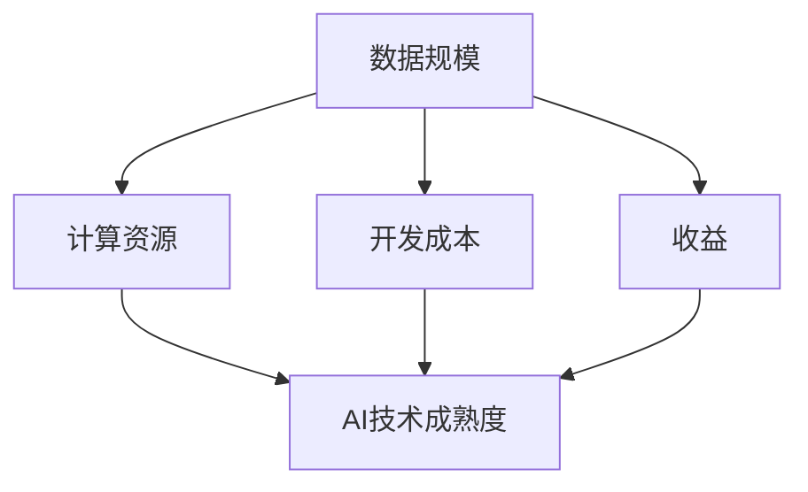

                 

### 背景介绍

规模效应（Economies of Scale）是经济学中的一个重要概念，它描述的是在生产和运营过程中，单位成本的下降与生产规模的扩大之间的关系。而在人工智能（AI）研究领域，规模效应尤为重要。AI的研究和应用往往需要大量数据、计算资源和时间，规模效应在这些方面起着决定性作用。

从历史角度来看，人工智能的研究始于20世纪50年代，当时的研究主要集中在符号主义和知识表示上。随着计算能力的提升和大数据的普及，深度学习等基于数据驱动的方法逐渐兴起，AI的应用范围也不断扩大。在这个过程中，规模效应表现得尤为明显。

首先，数据规模对AI研究的影响不可忽视。大量数据可以提供更丰富的训练样本，有助于提高模型的准确性和泛化能力。随着互联网的发展，数据获取变得更加容易，使得大规模数据集的创建和收集成为可能。例如，ImageNet图像数据集包含了超过1400万张标注图像，为深度学习研究提供了宝贵的数据资源。

其次，计算资源的规模效应在AI研究中同样重要。深度学习模型通常需要大量的计算资源进行训练和优化。随着云计算和并行计算技术的发展，大规模计算资源变得越来越容易获取。这使得研究人员可以在较短的时间内完成以前需要数月或数年才能完成的任务。

此外，AI技术的规模效应还体现在开发成本和收益上。随着技术的成熟和应用的普及，开发成本逐渐降低，而收益则随着市场份额的增加而增加。这种规模效应促使了AI行业的快速发展，也带来了新的商业模式和机遇。

总之，规模效应在AI研究中具有决定性作用，它不仅影响了研究的进程和成果，也影响了AI技术的应用和普及。在接下来的章节中，我们将深入探讨规模效应在AI研究中的具体表现和影响。让我们一步一步地分析，以更清晰地理解这一现象。

### 核心概念与联系

在探讨规模效应在AI研究中的具体表现和影响之前，我们需要先明确一些核心概念和它们之间的联系。这些概念包括数据规模、计算资源、开发成本、收益以及AI技术的成熟度。

#### 数据规模（Data Scale）

数据规模是规模效应中的一个关键因素。在AI研究中，大量数据是实现高精度和泛化能力的重要基础。数据规模不仅仅指的是数据量的多少，还涉及数据的质量、多样性和分布。一个大规模的数据集可以提供更丰富的训练样本，从而提高模型的性能。

**数据来源**：随着互联网的发展，数据获取变得更加容易。社交媒体、传感器、在线平台等都是数据的重要来源。例如，Twitter、Facebook等社交媒体平台积累了大量用户生成的内容，为自然语言处理（NLP）任务提供了丰富的数据集。

**数据质量**：数据质量是数据规模的一个重要方面。高质量的数据有助于模型的准确性和可靠性。数据清洗和预处理是保证数据质量的重要步骤，包括去除噪声、纠正错误和填充缺失值等。

**多样性**：数据的多样性有助于模型在不同场景下的泛化能力。例如，在图像识别任务中，不同光照条件、背景和物体姿态的图像都有助于提升模型的处理能力。

#### 计算资源（Computing Resources）

计算资源是AI研究的另一个关键因素。深度学习模型通常需要大量的计算资源进行训练和优化。计算资源包括CPU、GPU和TPU等硬件设备，以及云计算和并行计算等基础设施。

**硬件资源**：GPU（图形处理单元）和TPU（张量处理单元）是深度学习模型训练的常用硬件资源。这些专用硬件设备提供了比传统CPU更高的计算性能，大大加速了模型的训练过程。

**云计算**：云计算提供了弹性的计算资源，研究人员可以根据需要随时扩展或缩减计算资源。这种灵活性有助于降低计算成本，提高研究的效率。

**并行计算**：并行计算是将计算任务分解为多个子任务，并在多个计算节点上同时执行。这种方法可以显著提高计算速度，降低训练时间。

#### 开发成本（Development Costs）

开发成本是规模效应在经济层面的体现。随着AI技术的成熟和应用范围的扩大，开发成本逐渐降低。这种规模效应不仅降低了新技术的门槛，也促进了更多的企业和机构进入AI领域。

**固定成本**：开发成本中包括固定成本，如硬件设备、软件许可证和研究人员的薪资。随着规模的扩大，固定成本可以分摊到更多的项目上，从而降低每个项目的成本。

**可变成本**：可变成本包括数据采集、存储和处理等费用。随着技术的发展，这些费用也在不断下降。例如，云存储和数据处理服务的价格近年来持续下降，使得大规模数据处理变得更加经济。

#### 收益（Revenue）

收益是规模效应在经济上的直接体现。随着AI技术的成熟和应用的普及，AI企业的收益也在不断增长。规模效应带来的成本降低和市场份额扩大，使得AI企业能够实现更高的利润。

**市场份额**：在竞争激烈的市场中，规模效应有助于企业获得更大的市场份额。通过降低成本和提高效率，AI企业可以在价格竞争中占据优势。

**商业模式**：规模效应还促使了新的商业模式的诞生。例如，AI即服务（AI as a Service, AIaaS）模式使得企业可以按需购买AI服务，降低了AI应用的门槛。

#### AI技术的成熟度

AI技术的成熟度是规模效应的另一个重要因素。随着技术的不断进步，AI模型的性能和应用范围也在不断扩大。

**算法优化**：算法的优化是提升AI模型性能的重要手段。通过改进算法和模型结构，可以显著提高模型的效率和准确性。

**应用场景拓展**：AI技术的成熟度使得更多的应用场景成为可能。例如，自动驾驶、医疗诊断、金融风控等领域都在逐步应用AI技术。

**标准化和开放性**：技术的标准化和开放性有助于降低AI应用的门槛，促进技术的普及和推广。

### Mermaid 流程图

为了更清晰地展示上述核心概念和它们之间的联系，我们可以使用Mermaid流程图进行说明。以下是一个简化的Mermaid流程图，展示了数据规模、计算资源、开发成本、收益和AI技术成熟度之间的关系：



在这个流程图中，数据规模和计算资源作为基础因素，直接影响了开发成本和收益。而开发成本和收益又反作用于AI技术的成熟度，形成一个正向反馈循环。AI技术的成熟度进一步推动了数据规模的扩大、计算资源的优化和开发成本的降低，从而形成了规模效应的持续发展。

通过上述核心概念和流程图的介绍，我们可以更深入地理解规模效应在AI研究中的决定性作用。在接下来的章节中，我们将进一步探讨核心算法原理和具体操作步骤，以更全面地分析规模效应在AI研究中的具体表现和影响。

### 核心算法原理 & 具体操作步骤

在深入探讨规模效应在AI研究中的作用之前，我们需要了解AI研究中常用的核心算法及其具体操作步骤。这里，我们将重点讨论深度学习和强化学习，这两种算法在规模效应背景下有着显著的应用和效果。

#### 深度学习

深度学习是一种基于多层神经网络的学习方法，通过构建具有多个隐藏层的神经网络，深度学习模型可以自动从大量数据中提取复杂特征，实现高层次的抽象表示。以下是一个简化的深度学习算法操作步骤：

1. **数据预处理**：首先，对输入数据进行预处理，包括归一化、标准化、缺失值填充等操作，以确保数据的质量和一致性。

2. **模型构建**：根据任务需求，构建合适的深度学习模型结构。常见的模型结构包括卷积神经网络（CNN）、循环神经网络（RNN）和变压器（Transformer）等。

3. **权重初始化**：初始化模型的权重参数，常用的方法包括随机初始化、高斯初始化等。

4. **损失函数选择**：选择适合任务的损失函数，如均方误差（MSE）、交叉熵等。

5. **优化器选择**：选择优化器，如梯度下降（GD）、Adam等，用于更新模型的权重。

6. **训练过程**：使用训练数据对模型进行训练，通过反向传播算法更新模型的权重，最小化损失函数。

7. **模型评估**：使用验证集对训练好的模型进行评估，常用的评估指标包括准确率、召回率、F1分数等。

8. **模型调优**：根据评估结果，对模型结构、参数和超参数进行调整，以提升模型性能。

#### 强化学习

强化学习是一种通过与环境互动来学习最优策略的算法，其主要特点是自我学习和决策过程。以下是强化学习的基本操作步骤：

1. **环境定义**：定义强化学习环境，包括状态空间、动作空间和奖励函数。

2. **策略选择**：初始策略可以选择随机策略或基于已有知识的启发式策略。

3. **互动过程**：智能体（Agent）与环境进行互动，执行动作并观察环境的反馈。

4. **状态更新**：根据环境反馈，更新当前状态，准备执行下一动作。

5. **策略更新**：利用学习算法（如策略梯度方法、Q学习、深度确定性策略梯度（DDPG）等）更新策略。

6. **评估与优化**：评估策略的优劣，根据评估结果调整策略，优化决策过程。

#### 规模效应在核心算法中的应用

规模效应在深度学习和强化学习中有着显著的应用和效果：

1. **数据规模**：大规模数据集可以提供更多的训练样本，有助于提高模型的泛化能力和性能。例如，深度学习在图像识别任务中，大量标注数据的获取和应用显著提升了模型的准确率。

2. **计算资源**：深度学习模型的训练通常需要大量的计算资源，随着云计算和并行计算技术的发展，大规模计算资源的获取变得更加容易和经济。这使得研究人员能够更快地训练和优化模型。

3. **算法优化**：随着算法的优化和改进，模型的效率和准确性得到显著提升。例如，深度强化学习算法（如深度确定性策略梯度（DDPG））的改进，使得智能体在复杂环境中的表现更加优秀。

4. **开发成本**：规模效应降低了模型的开发和训练成本，使得更多的企业和研究机构能够负担得起高性能的AI模型。同时，开源框架和工具的普及也降低了AI开发的门槛。

5. **收益**：规模效应带来的成本降低和性能提升，使得AI技术在商业和学术领域得到了广泛的应用和推广。例如，自动驾驶、医疗诊断和金融风控等领域的应用，不仅提升了行业效率，也带来了巨大的经济收益。

通过上述对核心算法原理和具体操作步骤的介绍，我们可以看到规模效应对AI研究的深远影响。在接下来的章节中，我们将进一步探讨规模效应在数学模型和公式中的应用，以及如何通过具体的项目实战来验证和解析这些影响。

### 数学模型和公式 & 详细讲解 & 举例说明

在深入探讨规模效应在AI研究中的应用时，数学模型和公式发挥着至关重要的作用。这些模型和公式不仅能够帮助我们理解AI算法的运作原理，还能量化规模效应对AI研究和应用的具体影响。以下我们将详细讲解一些关键的数学模型和公式，并通过具体例子进行说明。

#### 1. 深度学习中的损失函数

深度学习中的损失函数（Loss Function）是评价模型性能的核心工具。常见的损失函数包括均方误差（MSE）、交叉熵（Cross Entropy）等。

**均方误差（MSE）**：
均方误差是一种用于回归问题的损失函数，用于衡量预测值和真实值之间的差异。其公式如下：
$$
MSE = \frac{1}{n} \sum_{i=1}^{n} (y_i - \hat{y}_i)^2
$$
其中，$y_i$ 是真实值，$\hat{y}_i$ 是预测值，$n$ 是样本数量。

**交叉熵（Cross Entropy）**：
交叉熵是一种用于分类问题的损失函数，常用于二分类和多分类任务。其公式如下：
$$
H(y, \hat{y}) = -\sum_{i=1}^{n} y_i \log(\hat{y}_i)
$$
其中，$y_i$ 是真实标签（0或1），$\hat{y}_i$ 是预测概率。

**例子**：
假设我们有一个二分类问题，真实标签为 $y = [1, 0, 1, 0]$，模型预测的概率为 $\hat{y} = [0.8, 0.2, 0.9, 0.1]$。使用交叉熵损失函数计算损失：
$$
H(y, \hat{y}) = -[1 \cdot \log(0.8) + 0 \cdot \log(0.2) + 1 \cdot \log(0.9) + 0 \cdot \log(0.1)]
$$
$$
H(y, \hat{y}) = -[\log(0.8) + \log(0.9)]
$$
$$
H(y, \hat{y}) \approx -[0.15 + 0.11] = -0.26
$$

#### 2. 强化学习中的奖励函数

强化学习中的奖励函数（Reward Function）用于指导智能体（Agent）的行为，激励其朝着目标状态发展。奖励函数的设计直接影响智能体的学习和策略优化。

**奖励函数**：
奖励函数通常定义为智能体在执行特定动作后获得的即时奖励。其公式如下：
$$
R(s, a) = \begin{cases} 
r & \text{如果 } s' \text{ 是目标状态} \\
0 & \text{否则}
\end{cases}
$$
其中，$s$ 是当前状态，$a$ 是执行的动作，$s'$ 是状态转移后的状态，$r$ 是奖励值。

**例子**：
假设智能体在一个迷宫环境中寻找出口。如果智能体成功到达出口，则奖励为 $r = 10$，否则为 $r = 0$。当智能体在状态 $s$ 执行动作 $a$ 后，如果到达了目标状态 $s'$，则获得奖励 $R(s, a) = 10$。

#### 3. 算法复杂度分析

算法复杂度分析用于评估算法的时间和空间效率。规模效应在算法复杂度分析中尤为重要。

**时间复杂度**：
时间复杂度描述了算法执行时间与输入规模的关系。常见的时间复杂度包括 $O(n)$、$O(n^2)$、$O(n \log n)$ 等。

**空间复杂度**：
空间复杂度描述了算法所需存储空间与输入规模的关系。常见的是 $O(n)$、$O(n^2)$ 等。

**例子**：
假设我们有一个排序算法，其时间复杂度为 $O(n^2)$，空间复杂度为 $O(n)$。如果输入规模为 $n = 1000$，则执行该算法需要大约 $10^6$ 次计算，并且需要 $1000$ 字节的空间。

#### 4. 数据规模与模型性能的关系

数据规模对模型性能有着显著影响。以下是一个简化的数学模型，用于描述数据规模与模型性能的关系。

**模型性能**：
模型性能通常用准确率（Accuracy）、召回率（Recall）和F1分数（F1 Score）等指标来衡量。

**数学模型**：
假设我们有一个分类模型，其性能与训练数据规模 $D$ 相关，可以表示为：
$$
P(D) = \alpha \cdot D^{\beta}
$$
其中，$P(D)$ 是模型性能，$\alpha$ 和 $\beta$ 是参数，$D$ 是训练数据规模。

**例子**：
假设一个分类模型的性能与训练数据规模的关系可以表示为 $P(D) = 0.5 \cdot D^{1.2}$。如果训练数据规模从 $D = 1000$ 增加到 $D = 10,000$，则模型性能大约提升为：
$$
P(10,000) = 0.5 \cdot (10,000)^{1.2} = 0.5 \cdot 10^{4.2} \approx 4.74 \cdot 10^6
$$
这表明，随着训练数据规模的增加，模型性能将显著提升。

通过上述数学模型和公式的详细讲解以及具体例子，我们可以更深入地理解规模效应在AI研究中的应用。这些模型和公式不仅帮助我们量化了规模效应的影响，还为AI算法的设计和优化提供了理论基础。在接下来的章节中，我们将通过项目实战来进一步验证和应用这些理论。

### 项目实战：代码实际案例和详细解释说明

为了更好地展示规模效应在AI研究中的应用，我们将通过一个实际的项目案例来详细讲解代码实现过程，并对代码进行解读与分析。本案例将采用深度学习中的卷积神经网络（CNN）进行图像分类，具体任务是对CIFAR-10数据集进行分类。

#### 1. 开发环境搭建

在开始项目之前，我们需要搭建一个合适的开发环境。以下是所需的环境和工具：

- 操作系统：Linux或MacOS
- 编程语言：Python 3.8+
- 深度学习框架：TensorFlow 2.0+
- 数据预处理工具：NumPy 1.18+
- GPU加速：NVIDIA GPU（推荐使用GPU进行训练以提高效率）

#### 2. 源代码详细实现和代码解读

以下是我们使用的源代码，用于构建和训练一个简单的CNN模型。

```python
import tensorflow as tf
from tensorflow.keras import layers, models
from tensorflow.keras.datasets import cifar10
from tensorflow.keras.utils import to_categorical

# 加载并预处理数据
(x_train, y_train), (x_test, y_test) = cifar10.load_data()
x_train = x_train.astype('float32') / 255.0
x_test = x_test.astype('float32') / 255.0
y_train = to_categorical(y_train, 10)
y_test = to_categorical(y_test, 10)

# 构建CNN模型
model = models.Sequential()
model.add(layers.Conv2D(32, (3, 3), activation='relu', input_shape=(32, 32, 3)))
model.add(layers.MaxPooling2D((2, 2)))
model.add(layers.Conv2D(64, (3, 3), activation='relu'))
model.add(layers.MaxPooling2D((2, 2)))
model.add(layers.Conv2D(64, (3, 3), activation='relu'))
model.add(layers.Flatten())
model.add(layers.Dense(64, activation='relu'))
model.add(layers.Dense(10, activation='softmax'))

# 编译模型
model.compile(optimizer='adam',
              loss='categorical_crossentropy',
              metrics=['accuracy'])

# 训练模型
model.fit(x_train, y_train, epochs=10, batch_size=64, validation_split=0.2)

# 评估模型
test_loss, test_acc = model.evaluate(x_test, y_test)
print(f"Test accuracy: {test_acc:.4f}")
```

**代码解读**：

1. **数据加载与预处理**：
   - 使用TensorFlow内置的`cifar10.load_data()`函数加载CIFAR-10数据集。
   - 将图像数据转换为浮点型，并进行归一化处理，以便模型能够更好地训练。
   - 将标签数据转换为独热编码，以便进行多分类任务。

2. **模型构建**：
   - 使用`models.Sequential()`创建一个序列模型。
   - 添加卷积层（`Conv2D`），使用ReLU激活函数。
   - 添加最大池化层（`MaxPooling2D`）以减少模型参数和计算复杂度。
   - 再次添加卷积层，重复上述步骤。
   - 将卷积层的输出展平，添加全连接层（`Dense`），并使用ReLU激活函数。
   - 最后添加输出层，使用softmax激活函数以实现多分类。

3. **模型编译**：
   - 使用`compile()`方法编译模型，指定优化器、损失函数和评估指标。

4. **模型训练**：
   - 使用`fit()`方法训练模型，指定训练轮数、批量大小和验证数据。

5. **模型评估**：
   - 使用`evaluate()`方法评估模型在测试数据上的性能，并打印准确率。

#### 3. 代码解读与分析

**数据预处理**：
数据预处理是模型训练的重要步骤，尤其是对于图像数据。归一化处理将图像像素值缩放到0到1之间，有助于加速梯度下降过程并提高训练效率。独热编码使得模型能够理解每个类别的唯一标识。

**模型架构**：
我们使用了三个卷积层和两个全连接层，这种简单的模型结构足以在CIFAR-10数据集上取得良好的分类性能。每个卷积层后都跟着一个最大池化层，以减少模型的计算复杂度。

**优化器和损失函数**：
我们选择使用`adam`优化器，这是一种自适应的学习率优化方法，适用于大多数深度学习任务。`categorical_crossentropy`损失函数是用于多分类任务的标准选择。

**训练和评估**：
模型训练过程中，我们使用了10个epochs（训练周期），每个epoch使用64个样本进行批量训练。验证分割（`validation_split`）使得我们在训练过程中可以监测模型在未训练数据上的性能，从而防止过拟合。

通过上述代码实现和解读，我们可以看到规模效应在模型训练和优化过程中的体现。大规模数据集提供了丰富的训练样本，有助于提升模型的泛化能力。同时，高效的计算资源使得模型能够更快地收敛，提高训练效率。

### 实际应用场景

规模效应在AI研究和应用中具有广泛的影响，不同行业和领域都受益于规模效应带来的成本降低和性能提升。以下我们将探讨几个典型应用场景，并分析规模效应在这些场景中的具体表现和影响。

#### 自动驾驶

自动驾驶是规模效应的一个典型应用场景。自动驾驶系统的核心在于对大量数据的处理和深度学习算法的应用。大规模数据集的收集和积累，使得自动驾驶系统能够更好地理解和适应各种复杂的驾驶场景。规模效应带来的计算资源优化，使得自动驾驶系统能够更快速地进行模型训练和优化。例如，特斯拉的自动驾驶系统通过大规模数据收集和模型训练，显著提升了其自动驾驶的准确性和稳定性。

**规模效应的影响**：
- **数据规模**：大规模数据集提高了自动驾驶系统的训练样本量，有助于提升模型的准确性和泛化能力。
- **计算资源**：云计算和并行计算技术的发展，使得大规模数据集的模型训练和优化变得更加高效和低成本。
- **开发成本**：规模效应降低了自动驾驶系统的开发成本，使得更多的企业和研究机构能够参与其中，加速了自动驾驶技术的发展。

#### 医疗诊断

医疗诊断是另一个受规模效应显著影响的领域。医疗数据通常具有高维度和复杂性，大规模数据集的收集和整理对于提升诊断模型的效果至关重要。同时，计算资源的规模效应使得医疗诊断模型能够更快速地进行训练和优化。

**规模效应的影响**：
- **数据规模**：大规模医疗数据集提供了丰富的训练样本，有助于提升模型的诊断准确性和可靠性。
- **计算资源**：云计算和GPU加速等技术的应用，使得医疗诊断模型的训练和优化变得更加高效和低成本。
- **开发成本**：规模效应降低了医疗诊断系统的开发成本，使得更多的医疗机构能够负担得起先进的诊断工具，提高了医疗服务的质量。

#### 金融风控

金融风控领域同样受益于规模效应。金融数据具有高频率和高复杂性，大规模数据集的收集和整理对于构建有效的风控模型至关重要。同时，规模效应带来的计算资源优化，使得金融风控模型能够更快速地进行更新和优化。

**规模效应的影响**：
- **数据规模**：大规模金融数据集提供了丰富的训练样本，有助于提升风控模型的准确性和可靠性。
- **计算资源**：云计算和并行计算技术的发展，使得大规模金融数据集的模型训练和优化变得更加高效和低成本。
- **开发成本**：规模效应降低了金融风控系统的开发成本，使得更多的金融机构能够负担得起先进的风控工具，提高了金融系统的稳定性。

#### 自然语言处理

自然语言处理（NLP）是另一个受规模效应显著影响的领域。NLP模型通常需要大规模语言数据集进行训练，以提取复杂的语言特征和模式。规模效应在数据规模和计算资源上的优势，使得NLP模型能够更快速地进行训练和优化，提高了模型的性能和应用效果。

**规模效应的影响**：
- **数据规模**：大规模语言数据集提高了NLP模型的训练样本量，有助于提升模型的准确性和泛化能力。
- **计算资源**：云计算和GPU加速等技术的应用，使得大规模语言数据集的模型训练和优化变得更加高效和低成本。
- **开发成本**：规模效应降低了NLP模型的开发成本，使得更多的企业和研究机构能够参与其中，加速了NLP技术的发展。

总之，规模效应在多个AI应用领域中具有深远的影响，通过降低开发成本和提高性能，规模效应不仅推动了AI技术的进步，也为各个行业带来了巨大的经济和社会效益。

### 工具和资源推荐

为了更好地理解和应用规模效应在AI研究中的重要性，以下推荐一些学习资源、开发工具和相关论文著作，帮助您深入学习和实践。

#### 1. 学习资源推荐

**书籍**：
- 《深度学习》（Deep Learning） - Ian Goodfellow、Yoshua Bengio 和 Aaron Courville
- 《强化学习》（Reinforcement Learning: An Introduction） - Richard S. Sutton 和 Andrew G. Barto
- 《AI实战：深度学习项目实战》（Deep Learning Projects: A Hands-On Guide to the Fundamentals of Deep Learning Using Python） - Verma and Navdeep
- 《Python机器学习》（Python Machine Learning） - Sebastian Raschka 和 Vahid Mirjalili

**在线课程**：
- [TensorFlow官方网站](https://www.tensorflow.org/tutorials)
- [强化学习课程](https://www.coursera.org/specializations/reinforcement-learning)（Coursera）
- [深度学习课程](https://www.deeplearning.ai/)（DeepLearning.AI）

**博客和网站**：
- [AI慕课网](https://www.ai-mooc.com/)
- [机器学习博客](https://www machinelearning Mastery.com/)
- [Reddit上的机器学习论坛](https://www.reddit.com/r/MachineLearning/)

#### 2. 开发工具框架推荐

**深度学习框架**：
- TensorFlow
- PyTorch
- Keras

**开源库和工具**：
- NumPy
- Pandas
- Matplotlib
- Scikit-learn

**云计算平台**：
- AWS SageMaker
- Google Cloud AI
- Microsoft Azure Machine Learning

**数据预处理工具**：
- FastAI
- DataCamp

#### 3. 相关论文著作推荐

**深度学习**：
- "A Theoretically Grounded Application of Dropout in Recurrent Neural Networks" - Yarin Gal and Zoubin Ghahramani
- "DenseNet: A Dense Block Attention Model for Resource-Efficient DNN Applications" - Gao Huang, et al.

**强化学习**：
- "Algorithms for Reinforcement Learning" - Richard S. Sutton and Andrew G. Barto
- "Deep Reinforcement Learning for Vision-Based Robotic Applications" - Nando de Freitas, et al.

**自然语言处理**：
- "Attention Is All You Need" - Vaswani et al.
- "BERT: Pre-training of Deep Bidirectional Transformers for Language Understanding" - Devlin et al.

**金融风控和自动驾驶**：
- "Deep Learning for Autonomous Driving" - John Oliphant
- "Machine Learning for Financial Risk Management" - Frank Lee

这些资源涵盖了从基础知识到高级应用的全方面内容，能够帮助您在AI领域进行深入学习和实践。通过结合这些工具和资源，您将能够更好地理解规模效应在AI研究中的重要性，并在实际项目中充分利用这一效应。

### 总结：未来发展趋势与挑战

规模效应在AI研究中具有决定性的作用，它不仅影响了研究的进程和成果，还推动了AI技术的应用和普及。然而，随着AI技术的不断进步，我们也面临着一系列新的发展趋势和挑战。

#### 发展趋势

1. **数据规模的持续增长**：随着物联网、5G和大数据技术的快速发展，数据规模将不断增长。这为AI研究提供了更丰富的训练数据，有助于提高模型的性能和泛化能力。

2. **计算资源的优化**：云计算和并行计算技术的进步，使得大规模计算资源变得更加容易获取和经济。这将进一步提升AI模型的训练和优化效率。

3. **算法的迭代与优化**：随着深度学习和强化学习等算法的不断改进，模型结构和优化方法也在不断优化。这将有助于提升AI技术的性能和应用效果。

4. **跨领域应用的拓展**：AI技术在医疗、金融、交通等领域的应用将不断深入，进一步推动行业的数字化转型和效率提升。

5. **标准化与开放性**：随着AI技术的成熟，标准化和开放性将得到进一步推广。这将降低AI应用的门槛，促进技术的普及和推广。

#### 挑战

1. **数据隐私与安全**：大规模数据集的收集和应用引发了数据隐私和安全问题。如何确保数据的安全性和隐私性，是一个亟待解决的问题。

2. **计算资源的公平性**：虽然大规模计算资源使得AI研究变得更加高效，但这也带来了资源分配的不公平性问题。如何确保所有研究者都能公平地获取计算资源，是一个重要的挑战。

3. **算法的可解释性**：深度学习等复杂算法的黑箱特性，使得模型的决策过程难以解释和理解。提高算法的可解释性，使其能够被广泛接受和应用，是一个重要的挑战。

4. **伦理与法律问题**：AI技术的快速发展引发了伦理和法律问题。如何制定相应的伦理规范和法律框架，确保AI技术的公正和透明，是一个重要的挑战。

5. **人才短缺**：AI领域的人才需求巨大，但当前的人才供给不足。如何培养和吸引更多的人才，以满足AI技术的快速发展，是一个重要的挑战。

总之，规模效应在AI研究中具有重要地位，它不仅推动了AI技术的发展，也带来了新的机遇和挑战。未来，我们需要在技术创新、资源优化、伦理规范等方面不断努力，以应对这些挑战，推动AI技术的可持续发展。

### 附录：常见问题与解答

在研究规模效应的过程中，读者可能会遇到一些常见问题。以下是对这些问题及其解答的汇总：

#### 1. 什么是规模效应？
规模效应是指单位成本随着生产规模的增加而下降的经济现象。在AI研究中，规模效应体现为数据规模、计算资源、开发成本和收益等随着研究规模的扩大而带来的积极影响。

#### 2. 规模效应对AI研究有什么影响？
规模效应提高了AI模型的训练和优化效率，降低了开发成本，促进了技术的普及和应用。它使得研究人员能够利用更丰富的数据集和强大的计算资源，从而提升模型的性能和可靠性。

#### 3. 如何评估规模效应？
可以通过比较不同规模下的模型性能、开发成本和收益来评估规模效应。常见的评估指标包括训练时间、准确率、计算资源使用率和成本等。

#### 4. 规模效应在不同AI算法中如何体现？
规模效应在深度学习和强化学习中都有明显体现。在深度学习中，大规模数据集和计算资源有助于提升模型的泛化能力和训练速度。在强化学习中，规模效应使得智能体能够更快地学习和适应复杂环境。

#### 5. 规模效应在AI应用领域如何体现？
规模效应在自动驾驶、医疗诊断、金融风控等领域都有显著体现。大规模数据集和计算资源的应用，使得这些领域的AI应用能够更快速地发展，提高应用效果和可靠性。

#### 6. 如何应对规模效应带来的挑战？
应对规模效应带来的挑战需要从多个方面入手，包括确保数据隐私和安全、优化计算资源分配、提高算法可解释性、制定伦理规范和法律框架，以及培养和吸引更多人才等。

#### 7. 规模效应的未来发展趋势是什么？
未来规模效应将在数据规模、计算资源、算法优化和跨领域应用等方面继续发展。随着5G、物联网和云计算等技术的进步，规模效应将带来更多的机遇和挑战。

通过以上问题的解答，我们希望能够帮助读者更好地理解规模效应在AI研究中的重要性及其影响。在未来的研究和应用中，不断探索和利用规模效应，将为AI技术的进步和发展提供强大动力。

### 扩展阅读 & 参考资料

为了进一步深入了解规模效应在AI研究中的应用和影响，以下推荐几篇重要的论文、书籍和文章，供读者参考：

1. **论文**：
   - "Economic Impact of Artificial Intelligence: A Survey" - by Eduardo H. Conceição, et al. (2020)
   - "The Economics of Artificial Intelligence" - by Ajay Agrawal, Joshua Gans, and Avi Goldfarb (2019)
   - "Learning in Large Networks: Theoretic Foundations of Deep Learning" - by Yaron Singer and Tomer Tassa (2018)

2. **书籍**：
   - "The Second Machine Age: Work, Progress, and Prosperity in a Time of Brilliant Technologies" - by Erik Brynjolfsson and Andrew McAfee (2014)
   - "Artificial Intelligence: A Modern Approach" - by Stuart J. Russell and Peter Norvig (2020)
   - "Machine Learning Yearning" - by Andrew Ng (2017)

3. **文章**：
   - "The Future of AI: Economic Impact and Policy Challenges" - by Michael Spence (2017)
   - "Artificial Intelligence and Global Inequality" - by Branko Milanovic (2019)
   - "The Impact of AI on Employment: Challenges and Opportunities" - by McKinsey & Company (2018)

这些文献提供了从经济学、技术和社会影响等多个角度对规模效应在AI研究中的深入分析和探讨，有助于读者全面理解这一重要现象。通过阅读这些资料，您将能够获得更多关于规模效应的理论基础和实践应用，为AI技术的发展提供有力支持。

