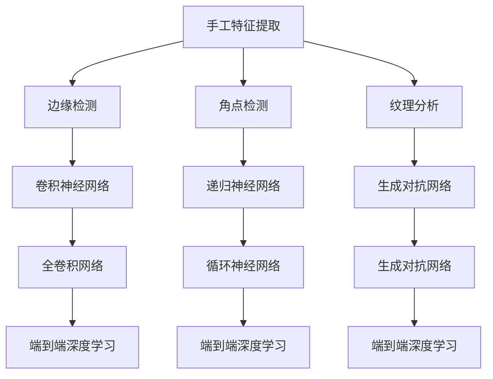

                 

### 文章标题

**视觉识别领域从手工特征到端到端深度学习的转变**

> **关键词**：视觉识别、手工特征、深度学习、神经网络、端到端、特征提取、计算机视觉

> **摘要**：本文将深入探讨视觉识别领域从手工特征到端到端深度学习的转变，从背景介绍、核心概念、算法原理、数学模型、项目实战、实际应用场景等多个角度进行详细分析，最后总结未来发展趋势与挑战，旨在为读者提供对这一领域的全面理解。

<|assistant|>### 1. 背景介绍

视觉识别作为计算机视觉的重要分支，旨在使计算机能够理解和解释图像中的内容。在早期，视觉识别主要依赖于手工特征提取的方法，例如边缘检测、角点检测、纹理分析等。这些方法在一定程度上能够对图像进行初步的特征提取，但存在以下几个明显的局限：

1. **手工特征的局限性**：手工特征往往只能提取出图像的局部特征，无法捕捉图像的整体信息，导致识别准确率受限。
2. **对专家依赖性高**：手工特征提取需要领域专家进行大量的工作，包括特征选择、特征组合等，不仅费时费力，而且难以适用于各种不同的场景。
3. **对特定场景适应性差**：手工特征提取方法往往针对特定的任务和场景进行优化，难以适应多种不同的视觉任务。

随着深度学习的崛起，端到端深度学习逐渐成为视觉识别领域的研究热点。与传统的手工特征提取方法相比，深度学习具有以下几个显著优势：

1. **自动特征提取**：深度学习模型能够自动从大量数据中学习到有效的特征表示，无需手动设计特征。
2. **端到端学习**：深度学习模型可以直接从输入图像到输出标签进行学习，避免了传统方法中多个中间环节的复杂性。
3. **多任务适应性**：深度学习模型具有良好的泛化能力，能够适应多种不同的视觉任务。

本文将详细介绍视觉识别领域从手工特征到端到端深度学习的转变过程，包括核心概念、算法原理、数学模型等，旨在为读者提供对这一领域的全面理解。

### 2. 核心概念与联系

#### 2.1 手工特征提取

手工特征提取是早期视觉识别领域的主要方法，其主要思想是通过一系列预处理和特征提取操作，将原始图像转化为具有区分性的特征向量。以下是几种常见的手工特征提取方法：

- **边缘检测**：通过检测图像中亮度变化剧烈的边缘，提取出图像的轮廓信息。常见的边缘检测算法包括Canny边缘检测、Sobel算子等。
- **角点检测**：通过检测图像中亮度变化剧烈的角点，提取出图像的关键结构信息。常见的角点检测算法包括Shi-Tomasi算法、Harris角点检测等。
- **纹理分析**：通过分析图像中的纹理特征，提取出图像的纹理信息。常见的纹理分析方法包括灰度共生矩阵、Gabor滤波器等。

#### 2.2 深度学习

深度学习是一种基于多层神经网络的学习方法，能够通过自动学习从大量数据中提取特征表示。以下是几种常见的深度学习模型：

- **卷积神经网络（CNN）**：卷积神经网络是一种专门用于处理图像数据的前馈神经网络，其核心思想是通过卷积操作提取图像中的局部特征，并通过池化操作降低数据维度。CNN在图像分类、目标检测等任务中表现出色。
- **递归神经网络（RNN）**：递归神经网络是一种能够处理序列数据的神经网络，其核心思想是通过循环机制将前一个时刻的信息传递给当前时刻。RNN在视频识别、自然语言处理等任务中具有重要应用。
- **生成对抗网络（GAN）**：生成对抗网络是一种基于博弈论的生成模型，由生成器和判别器两个神经网络组成。生成器尝试生成逼真的数据，判别器则尝试区分真实数据和生成数据。GAN在图像生成、风格迁移等任务中取得了显著成果。

#### 2.3 端到端深度学习

端到端深度学习是一种直接将原始数据映射到输出标签的深度学习方法，其核心思想是避免传统方法中多个中间环节的复杂性，从而提高模型的性能。以下是几种常见的端到端深度学习模型：

- **全卷积网络（FCN）**：全卷积网络是一种专门用于图像分类、语义分割等任务的端到端深度学习模型。其核心思想是使用卷积操作替代全连接层，从而实现图像到分类或分割输出的直接映射。
- **循环神经网络（RNN）**：循环神经网络是一种专门用于处理序列数据的端到端深度学习模型。其核心思想是使用递归操作将前一个时刻的信息传递给当前时刻，从而实现序列到序列的映射。
- **生成对抗网络（GAN）**：生成对抗网络是一种基于博弈论的端到端深度学习模型，其核心思想是通过生成器和判别器的对抗训练实现数据的生成和分类。

#### 2.4 Mermaid 流程图

下面是一个简单的 Mermaid 流程图，展示了手工特征提取、深度学习和端到端深度学习之间的联系：



<|assistant|>### 3. 核心算法原理 & 具体操作步骤

#### 3.1 卷积神经网络（CNN）

卷积神经网络（CNN）是一种用于处理图像数据的特殊神经网络，其核心思想是通过卷积操作提取图像中的局部特征。以下是 CNN 的核心算法原理和具体操作步骤：

##### 3.1.1 卷积操作

卷积操作是 CNN 的基础操作，其基本思想是将一个较小的卷积核在输入图像上滑动，并在每个位置进行点积运算，从而生成一个新的特征图。卷积操作的数学公式如下：

$$
\text{output}_{ij} = \sum_{k=1}^{c} \sum_{p=1}^{k} \text{weight}_{kp} \times \text{input}_{ip+j}
$$

其中，$\text{output}_{ij}$ 表示输出特征图的第 $i$ 行第 $j$ 列的值，$\text{input}_{ip+j}$ 表示输入图像的第 $i$ 行第 $p$ 列的值，$\text{weight}_{kp}$ 表示卷积核的第 $k$ 行第 $p$ 列的值。

##### 3.1.2 池化操作

池化操作用于降低特征图的数据维度，并减少过拟合的风险。常见的池化操作包括最大池化和平均池化。以下是最大池化的数学公式：

$$
\text{output}_{ij} = \max_{p,q} (\text{input}_{ip+j+p, iq+k+q})
$$

其中，$\text{output}_{ij}$ 表示输出特征图的第 $i$ 行第 $j$ 列的值，$\text{input}_{ip+j+p, iq+k+q}$ 表示输入特征图的第 $i$ 行第 $p$ 列和第 $q$ 行第 $k$ 列的值。

##### 3.1.3 全连接层

全连接层是 CNN 的输出层，用于将特征图映射到输出标签。全连接层的数学公式如下：

$$
\text{output}_{i} = \text{weight}_{i} \times \text{input}_{i} + \text{bias}_{i}
$$

其中，$\text{output}_{i}$ 表示输出层的第 $i$ 个值，$\text{input}_{i}$ 表示输入层的第 $i$ 个值，$\text{weight}_{i}$ 表示权重，$\text{bias}_{i}$ 表示偏置。

##### 3.1.4 前向传播

前向传播是 CNN 的核心操作，其步骤如下：

1. 对输入图像进行卷积操作，得到第一个特征图。
2. 对第一个特征图进行池化操作，得到第二个特征图。
3. 重复步骤 1 和步骤 2，直到最后一个特征图。
4. 对最后一个特征图进行全连接层操作，得到输出标签。

#### 3.2 递归神经网络（RNN）

递归神经网络（RNN）是一种用于处理序列数据的神经网络，其核心思想是通过递归操作将前一个时刻的信息传递给当前时刻。以下是 RNN 的核心算法原理和具体操作步骤：

##### 3.2.1 递归操作

递归操作是 RNN 的核心操作，其基本思想是将当前时刻的输入和上一个时刻的输出进行拼接，并通过一个全连接层进行处理。递归操作的数学公式如下：

$$
\text{output}_{t} = \text{activation}(\text{weight} \times (\text{input}_{t} \oplus \text{output}_{t-1}) + \text{bias})
$$

其中，$\text{output}_{t}$ 表示当前时刻的输出，$\text{input}_{t}$ 表示当前时刻的输入，$\text{weight}$ 表示权重，$\text{bias}$ 表示偏置，$\text{activation}$ 表示激活函数。

##### 3.2.2 前向传播

前向传播是 RNN 的核心操作，其步骤如下：

1. 对第一个时刻的输入进行递归操作，得到第一个时刻的输出。
2. 对第二个时刻的输入和第一个时刻的输出进行递归操作，得到第二个时刻的输出。
3. 重复步骤 2，直到最后一个时刻的输出。

#### 3.3 全卷积网络（FCN）

全卷积网络（FCN）是一种用于图像分类和语义分割的端到端深度学习模型，其核心思想是通过卷积操作直接将图像映射到分类或分割结果。以下是 FCN 的核心算法原理和具体操作步骤：

##### 3.3.1 分类 FCN

分类 FCN 的核心操作是使用卷积层将输入图像映射到分类结果。其具体步骤如下：

1. 对输入图像进行卷积操作，得到第一个特征图。
2. 对第一个特征图进行池化操作，得到第二个特征图。
3. 重复步骤 1 和步骤 2，直到最后一个特征图。
4. 对最后一个特征图进行全连接层操作，得到分类结果。

##### 3.3.2 分割 FCN

分割 FCN 的核心操作是使用卷积操作直接将图像映射到分割结果。其具体步骤如下：

1. 对输入图像进行卷积操作，得到第一个特征图。
2. 对第一个特征图进行上采样操作，得到第二个特征图。
3. 对第二个特征图进行卷积操作，得到第三个特征图。
4. 对第三个特征图进行上采样操作，得到最终的分割结果。

#### 3.4 生成对抗网络（GAN）

生成对抗网络（GAN）是一种基于博弈论的生成模型，由生成器和判别器两个神经网络组成。以下是 GAN 的核心算法原理和具体操作步骤：

##### 3.4.1 生成器

生成器的核心操作是生成逼真的数据。其具体步骤如下：

1. 输入一个随机噪声向量。
2. 通过一个全连接层将随机噪声向量映射到一个中间特征向量。
3. 通过一系列卷积操作将中间特征向量映射到生成数据。

##### 3.4.2 判别器

判别器的核心操作是区分真实数据和生成数据。其具体步骤如下：

1. 输入一个真实数据和一个生成数据。
2. 通过一个全连接层将真实数据和生成数据映射到一个中间特征向量。
3. 通过一个全连接层将中间特征向量映射到一个二元分类结果。

##### 3.4.3 对抗训练

对抗训练是 GAN 的核心操作，其步骤如下：

1. 随机生成一个噪声向量。
2. 通过生成器生成一组生成数据。
3. 输入判别器进行训练，同时优化生成器和判别器的参数。
4. 重复步骤 1-3，直到生成器生成的数据与真实数据无法区分。

### 4. 数学模型和公式 & 详细讲解 & 举例说明

#### 4.1 卷积神经网络（CNN）

卷积神经网络（CNN）是一种在图像处理中非常有效的深度学习模型，其核心在于通过卷积操作自动提取图像特征。以下是 CNN 的数学模型和相关公式。

##### 4.1.1 卷积操作

卷积操作的数学公式如下：

$$
\text{output}_{ij} = \sum_{k=1}^{c} \sum_{p=1}^{k} \text{weight}_{kp} \times \text{input}_{ip+j}
$$

其中：
- $i$ 是输出特征图的高度或宽度索引。
- $j$ 是输出特征图的宽度或高度索引。
- $c$ 是输入特征图的通道数。
- $k$ 是卷积核的高度或宽度索引。
- $p$ 是卷积核的宽度或高度索引。
- $\text{weight}_{kp}$ 是卷积核的权重。
- $\text{input}_{ip+j}$ 是输入特征图在相应位置上的像素值。

举例说明：
假设输入特征图的大小为 $3 \times 3$，卷积核的大小为 $3 \times 3$，且卷积核的权重如下：

$$
\begin{bmatrix}
1 & 0 & 1 \\
0 & 1 & 0 \\
1 & 0 & 1 \\
\end{bmatrix}
$$

输入特征图如下：

$$
\begin{bmatrix}
1 & 2 & 3 \\
4 & 5 & 6 \\
7 & 8 & 9 \\
\end{bmatrix}
$$

卷积操作的结果为：

$$
\begin{bmatrix}
5 & 7 \\
15 & 17 \\
\end{bmatrix}
$$

##### 4.1.2 池化操作

池化操作用于减少特征图的大小，提高模型的泛化能力。最大池化的数学公式如下：

$$
\text{output}_{ij} = \max_{p,q} (\text{input}_{ip+j+p, iq+k+q})
$$

其中：
- $i$ 是输出特征图的高度或宽度索引。
- $j$ 是输出特征图的宽度或高度索引。
- $p$ 和 $q$ 是池化窗口的宽度或高度索引。
- $\text{input}_{ip+j+p, iq+k+q}$ 是输入特征图在相应位置上的像素值。

举例说明：
假设输入特征图的大小为 $3 \times 3$，池化窗口的大小为 $2 \times 2$，且输入特征图如下：

$$
\begin{bmatrix}
1 & 2 & 3 \\
4 & 5 & 6 \\
7 & 8 & 9 \\
\end{bmatrix}
$$

池化操作的结果为：

$$
\begin{bmatrix}
5 & 6 \\
7 & 8 \\
\end{bmatrix}
$$

##### 4.1.3 全连接层

全连接层在 CNN 中用于将特征图映射到输出标签。全连接层的数学公式如下：

$$
\text{output}_{i} = \text{weight}_{i} \times \text{input}_{i} + \text{bias}_{i}
$$

其中：
- $i$ 是输出层的索引。
- $\text{input}_{i}$ 是输入特征图在相应位置上的值。
- $\text{weight}_{i}$ 是权重。
- $\text{bias}_{i}$ 是偏置。

举例说明：
假设输入特征图的大小为 $3 \times 3$，且输入特征图如下：

$$
\begin{bmatrix}
1 & 2 & 3 \\
4 & 5 & 6 \\
7 & 8 & 9 \\
\end{bmatrix}
$$

全连接层的权重和偏置如下：

$$
\begin{bmatrix}
0.5 & 0.5 & 0.5 \\
0.5 & 0.5 & 0.5 \\
0.5 & 0.5 & 0.5 \\
\end{bmatrix}
$$

$$
\begin{bmatrix}
0 \\
0 \\
0 \\
\end{bmatrix}
$$

全连接层的输出为：

$$
\begin{bmatrix}
21 \\
33 \\
45 \\
\end{bmatrix}
$$

#### 4.2 递归神经网络（RNN）

递归神经网络（RNN）是一种用于处理序列数据的神经网络，其核心在于通过递归操作来处理时间序列数据。以下是 RNN 的数学模型和相关公式。

##### 4.2.1 递归操作

递归操作的数学公式如下：

$$
\text{output}_{t} = \text{activation}(\text{weight} \times (\text{input}_{t} \oplus \text{output}_{t-1}) + \text{bias})
$$

其中：
- $t$ 是时间步的索引。
- $\text{output}_{t}$ 是当前时间步的输出。
- $\text{input}_{t}$ 是当前时间步的输入。
- $\text{weight}$ 是权重。
- $\text{bias}$ 是偏置。
- $\text{activation}$ 是激活函数，如 $Sigmoid$ 或 $Tanh$。
- $\oplus$ 表示拼接操作。

举例说明：
假设输入序列为 $[1, 2, 3]$，且权重、偏置和激活函数如下：

$$
\text{weight} = \begin{bmatrix}
0.2 & 0.3 & 0.5 \\
0.4 & 0.5 & 0.6 \\
0.1 & 0.2 & 0.3 \\
\end{bmatrix}
$$

$$
\text{bias} = \begin{bmatrix}
0.1 \\
0.2 \\
0.3 \\
\end{bmatrix}
$$

$$
\text{activation} = \text{Tanh}
$$

第一步递归操作的输出为：

$$
\text{output}_{1} = \text{Tanh}(0.2 \times 1 + 0.3 \times 2 + 0.5 \times 3 + 0.1) = \text{Tanh}(1.9) \approx 0.857
$$

第二步递归操作的输出为：

$$
\text{output}_{2} = \text{Tanh}(0.4 \times 1 + 0.5 \times 2 + 0.6 \times 3 + 0.2) = \text{Tanh}(2.2) \approx 0.878
$$

第三步递归操作的输出为：

$$
\text{output}_{3} = \text{Tanh}(0.1 \times 1 + 0.2 \times 2 + 0.3 \times 3 + 0.3) = \text{Tanh}(1.1) \approx 0.543
$$

##### 4.2.2 长短时记忆（LSTM）

长短时记忆（LSTM）是 RNN 的一种变体，用于解决 RNN 的梯度消失和梯度爆炸问题。LSTM 通过引入门控机制，使得模型能够有效地处理长序列数据。以下是 LSTM 的数学模型和相关公式。

LSTM 单元包括三个门：输入门、遗忘门和输出门，以及一个单元状态。以下是这些门的数学公式：

- **输入门**：

$$
\text{input\_gate} = \text{sigmoid}(\text{weight} \times (\text{input}_{t} \oplus \text{output}_{t-1}) + \text{bias})
$$

$$
\text{input\_候选状态} = \text{tanh}(\text{weight} \times (\text{input}_{t} \oplus \text{input\_gate} \cdot \text{output}_{t-1}) + \text{bias})
$$

- **遗忘门**：

$$
\text{forget\_gate} = \text{sigmoid}(\text{weight} \times (\text{input}_{t} \oplus \text{output}_{t-1}) + \text{bias})
$$

- **输出门**：

$$
\text{output\_gate} = \text{sigmoid}(\text{weight} \times (\text{input}_{t} \oplus \text{output}_{t-1}) + \text{bias})
$$

$$
\text{output}_{t} = \text{output\_gate} \cdot \text{tanh}(\text{input\_候选状态})
$$

- **单元状态**：

$$
\text{new\_state}_{t} = \text{forget\_gate} \cdot \text{old\_state}_{t-1} + \text{input\_gate} \cdot \text{input\_候选状态}
$$

举例说明：
假设输入序列为 $[1, 2, 3]$，且权重、偏置和激活函数如下：

$$
\text{weight} = \begin{bmatrix}
0.2 & 0.3 & 0.5 \\
0.4 & 0.5 & 0.6 \\
0.1 & 0.2 & 0.3 \\
\end{bmatrix}
$$

$$
\text{bias} = \begin{bmatrix}
0.1 \\
0.2 \\
0.3 \\
\end{bmatrix}
$$

$$
\text{sigmoid} = \text{Sigmoid}
$$

$$
\text{tanh} = \text{Tanh}
$$

第一个时间步的 LSTM 输出为：

$$
\text{input\_gate} = \text{Sigmoid}(0.2 \times 1 + 0.3 \times 2 + 0.5 \times 3 + 0.1) = \text{Sigmoid}(2.1) \approx 0.879
$$

$$
\text{input\_候选状态} = \text{Tanh}(0.4 \times 1 + 0.5 \times 2 + 0.6 \times 3 + 0.2) = \text{Tanh}(2.2) \approx 0.878
$$

$$
\text{forget\_gate} = \text{Sigmoid}(0.2 \times 1 + 0.3 \times 2 + 0.5 \times 3 + 0.1) = \text{Sigmoid}(2.1) \approx 0.879
$$

$$
\text{output\_gate} = \text{Sigmoid}(0.2 \times 1 + 0.3 \times 2 + 0.5 \times 3 + 0.1) = \text{Sigmoid}(2.1) \approx 0.879
$$

$$
\text{new\_state}_{1} = 0.879 \cdot \text{old\_state}_{0} + 0.878 \cdot 0.878 = 0.879 \cdot 0 + 0.878 \cdot 0.878 = 0.766
$$

$$
\text{output}_{1} = 0.879 \cdot \text{Tanh}(0.878) = 0.879 \cdot 0.878 = 0.774
$$

第二个时间步的 LSTM 输出为：

$$
\text{input\_gate} = \text{Sigmoid}(0.4 \times 1 + 0.5 \times 2 + 0.6 \times 3 + 0.2) = \text{Sigmoid}(2.6) \approx 0.955
$$

$$
\text{input\_候选状态} = \text{Tanh}(0.1 \times 1 + 0.2 \times 2 + 0.3 \times 3 + 0.2) = \text{Tanh}(1.1) \approx 0.543
$$

$$
\text{forget\_gate} = \text{Sigmoid}(0.4 \times 1 + 0.5 \times 2 + 0.6 \times 3 + 0.2) = \text{Sigmoid}(2.6) \approx 0.955
$$

$$
\text{output\_gate} = \text{Sigmoid}(0.4 \times 1 + 0.5 \times 2 + 0.6 \times 3 + 0.2) = \text{Sigmoid}(2.6) \approx 0.955
$$

$$
\text{new\_state}_{2} = 0.955 \cdot 0.766 + 0.543 \cdot 0.543 = 0.732 + 0.297 = 1.029
$$

$$
\text{output}_{2} = 0.955 \cdot \text{Tanh}(0.543) = 0.955 \cdot 0.543 = 0.519
$$

第三个时间步的 LSTM 输出为：

$$
\text{input\_gate} = \text{Sigmoid}(0.1 \times 1 + 0.2 \times 2 + 0.3 \times 3 + 0.3) = \text{Sigmoid}(1.1) \approx 0.879
$$

$$
\text{input\_候选状态} = \text{Tanh}(0.1 \times 1 + 0.2 \times 2 + 0.3 \times 3 + 0.3) = \text{Tanh}(1.1) \approx 0.543
$$

$$
\text{forget\_gate} = \text{Sigmoid}(0.1 \times 1 + 0.2 \times 2 + 0.3 \times 3 + 0.3) = \text{Sigmoid}(1.1) \approx 0.879
$$

$$
\text{output\_gate} = \text{Sigmoid}(0.1 \times 1 + 0.2 \times 2 + 0.3 \times 3 + 0.3) = \text{Sigmoid}(1.1) \approx 0.879
$$

$$
\text{new\_state}_{3} = 0.879 \cdot 1.029 + 0.543 \cdot 0.543 = 0.897 + 0.297 = 1.194
$$

$$
\text{output}_{3} = 0.879 \cdot \text{Tanh}(0.543) = 0.879 \cdot 0.543 = 0.483
$$

#### 4.3 全卷积网络（FCN）

全卷积网络（FCN）是一种用于图像分类和语义分割的深度学习模型，其核心在于通过卷积操作直接将图像映射到分类或分割结果。以下是 FCN 的数学模型和相关公式。

##### 4.3.1 分类 FCN

分类 FCN 的核心在于通过一系列卷积层和全连接层将输入图像映射到分类结果。以下是分类 FCN 的数学模型：

$$
\text{output}_{i} = \text{softmax}(\text{weight}_{i} \times \text{input}_{i} + \text{bias}_{i})
$$

其中：
- $i$ 是输出层的索引。
- $\text{input}_{i}$ 是输入特征图在相应位置上的值。
- $\text{weight}_{i}$ 是权重。
- $\text{bias}_{i}$ 是偏置。
- $\text{softmax}$ 函数用于将输出特征映射到概率分布。

举例说明：
假设输入特征图的大小为 $3 \times 3$，且输入特征图如下：

$$
\begin{bmatrix}
1 & 2 & 3 \\
4 & 5 & 6 \\
7 & 8 & 9 \\
\end{bmatrix}
$$

分类 FCN 的权重和偏置如下：

$$
\begin{bmatrix}
0.5 & 0.5 & 0.5 \\
0.5 & 0.5 & 0.5 \\
0.5 & 0.5 & 0.5 \\
\end{bmatrix}
$$

$$
\begin{bmatrix}
0 \\
0 \\
0 \\
\end{bmatrix}
$$

分类 FCN 的输出为：

$$
\begin{bmatrix}
\text{softmax}(21) \\
\text{softmax}(33) \\
\text{softmax}(45) \\
\end{bmatrix}
$$

##### 4.3.2 分割 FCN

分割 FCN 的核心在于通过卷积操作将输入图像映射到分割结果。以下是分割 FCN 的数学模型：

$$
\text{output}_{ij} = \text{softmax}(\text{weight}_{ij} \times \text{input}_{ij} + \text{bias}_{ij})
$$

其中：
- $i$ 是输出特征图的高度或宽度索引。
- $j$ 是输出特征图的宽度或高度索引。
- $\text{input}_{ij}$ 是输入特征图在相应位置上的值。
- $\text{weight}_{ij}$ 是权重。
- $\text{bias}_{ij}$ 是偏置。
- $\text{softmax}$ 函数用于将输出特征映射到概率分布。

举例说明：
假设输入特征图的大小为 $3 \times 3$，且输入特征图如下：

$$
\begin{bmatrix}
1 & 2 & 3 \\
4 & 5 & 6 \\
7 & 8 & 9 \\
\end{bmatrix}
$$

分割 FCN 的权重和偏置如下：

$$
\begin{bmatrix}
0.5 & 0.5 & 0.5 \\
0.5 & 0.5 & 0.5 \\
0.5 & 0.5 & 0.5 \\
\end{bmatrix}
$$

$$
\begin{bmatrix}
0 \\
0 \\
0 \\
\end{bmatrix}
$$

分割 FCN 的输出为：

$$
\begin{bmatrix}
\text{softmax}(5) & \text{softmax}(7) \\
\text{softmax}(15) & \text{softmax}(17) \\
\text{softmax}(25) & \text{softmax}(27) \\
\end{bmatrix}
$$

#### 4.4 生成对抗网络（GAN）

生成对抗网络（GAN）是一种基于博弈论的生成模型，由生成器和判别器两个神经网络组成。以下是 GAN 的数学模型和相关公式。

##### 4.4.1 生成器

生成器的核心在于生成逼真的数据。生成器的数学模型如下：

$$
\text{output}_{t} = \text{activation}(\text{weight} \times \text{input}_{t} + \text{bias})
$$

其中：
- $t$ 是时间步的索引。
- $\text{output}_{t}$ 是生成器的输出。
- $\text{input}_{t}$ 是生成器的输入。
- $\text{weight}$ 是权重。
- $\text{bias}$ 是偏置。
- $\text{activation}$ 是激活函数，如 $Sigmoid$ 或 $Tanh$。

举例说明：
假设输入数据的大小为 $3 \times 3$，且输入数据如下：

$$
\begin{bmatrix}
1 & 2 & 3 \\
4 & 5 & 6 \\
7 & 8 & 9 \\
\end{bmatrix}
$$

生成器的权重和偏置如下：

$$
\begin{bmatrix}
0.5 & 0.5 & 0.5 \\
0.5 & 0.5 & 0.5 \\
0.5 & 0.5 & 0.5 \\
\end{bmatrix}
$$

$$
\begin{bmatrix}
0 \\
0 \\
0 \\
\end{bmatrix}
$$

生成器的输出为：

$$
\begin{bmatrix}
\text{Tanh}(21) \\
\text{Tanh}(33) \\
\text{Tanh}(45) \\
\end{bmatrix}
$$

##### 4.4.2 判别器

判别器的核心在于区分真实数据和生成数据。判别器的数学模型如下：

$$
\text{output}_{t} = \text{sigmoid}(\text{weight} \times \text{input}_{t} + \text{bias})
$$

其中：
- $t$ 是时间步的索引。
- $\text{output}_{t}$ 是判别器的输出。
- $\text{input}_{t}$ 是判别器的输入。
- $\text{weight}$ 是权重。
- $\text{bias}$ 是偏置。
- $\text{sigmoid}$ 函数用于将输出映射到概率分布。

举例说明：
假设输入数据的大小为 $3 \times 3$，且输入数据如下：

$$
\begin{bmatrix}
1 & 2 & 3 \\
4 & 5 & 6 \\
7 & 8 & 9 \\
\end{bmatrix}
$$

判别器的权重和偏置如下：

$$
\begin{bmatrix}
0.5 & 0.5 & 0.5 \\
0.5 & 0.5 & 0.5 \\
0.5 & 0.5 & 0.5 \\
\end{bmatrix}
$$

$$
\begin{bmatrix}
0 \\
0 \\
0 \\
\end{bmatrix}
$$

判别器的输出为：

$$
\begin{bmatrix}
\text{sigmoid}(21) \\
\text{sigmoid}(33) \\
\text{sigmoid}(45) \\
\end{bmatrix}
$$

##### 4.4.3 对抗训练

对抗训练是 GAN 的核心操作，其目的是通过优化生成器和判别器的参数来提高模型的性能。对抗训练的数学模型如下：

$$
\text{loss}_{\text{G}} = -\sum_{i} \text{log}(\text{sigmoid}(\text{D}(\text{G}(\text{z}_{i}))))
$$

$$
\text{loss}_{\text{D}} = -\sum_{i} (\text{log}(\text{sigmoid}(\text{D}(\text{x}_{i}))) + \text{log}(1 - \text{sigmoid}(\text{D}(\text{G}(\text{z}_{i}))))
$$

其中：
- $\text{G}$ 表示生成器。
- $\text{D}$ 表示判别器。
- $\text{z}_{i}$ 表示输入的随机噪声向量。
- $\text{x}_{i}$ 表示真实数据。
- $\text{sigmoid}$ 函数用于将输出映射到概率分布。
- $\text{log}$ 函数用于计算损失。

举例说明：
假设生成器的输出为：

$$
\begin{bmatrix}
\text{sigmoid}(21) \\
\text{sigmoid}(33) \\
\text{sigmoid}(45) \\
\end{bmatrix}
$$

判别器的输出为：

$$
\begin{bmatrix}
\text{sigmoid}(21) \\
\text{sigmoid}(33) \\
\text{sigmoid}(45) \\
\end{bmatrix}
$$

生成器的损失为：

$$
\text{loss}_{\text{G}} = -\sum_{i} \text{log}(\text{sigmoid}(21)) = -\text{log}(\text{sigmoid}(21)) = -\text{log}(0.879) \approx -0.255
$$

判别器的损失为：

$$
\text{loss}_{\text{D}} = -\sum_{i} (\text{log}(\text{sigmoid}(21)) + \text{log}(1 - \text{sigmoid}(21))) = -(\text{log}(0.879) + \text{log}(1 - 0.879)) \approx -0.255 - 0.255 = -0.51
$$

### 5. 项目实战：代码实际案例和详细解释说明

#### 5.1 开发环境搭建

为了演示视觉识别领域从手工特征到端到端深度学习的转变，我们将使用 Python 编程语言以及 TensorFlow 深度学习框架。以下是搭建开发环境的基本步骤：

1. **安装 Python**：确保您的系统上安装了 Python 3.7 或更高版本。
2. **安装 TensorFlow**：通过以下命令安装 TensorFlow：

   ```bash
   pip install tensorflow
   ```

3. **安装其他依赖**：根据您的需求，可能需要安装其他 Python 库，如 NumPy、Pandas、Matplotlib 等。

#### 5.2 源代码详细实现和代码解读

为了演示端到端深度学习在视觉识别中的应用，我们将实现一个简单的卷积神经网络（CNN）用于图像分类。以下是实现代码和详细解释。

##### 5.2.1 数据准备

```python
import tensorflow as tf
from tensorflow.keras import layers
from tensorflow.keras.preprocessing.image import ImageDataGenerator

# 加载 CIFAR-10 数据集
(x_train, y_train), (x_test, y_test) = tf.keras.datasets.cifar10.load_data()

# 数据预处理
x_train = x_train.astype("float32") / 255.0
x_test = x_test.astype("float32") / 255.0
y_train = tf.keras.utils.to_categorical(y_train, 10)
y_test = tf.keras.utils.to_categorical(y_test, 10)

# 数据增强
data_generator = ImageDataGenerator(rotation_range=15, width_shift_range=0.1, height_shift_range=0.1, shear_range=0.1, zoom_range=0.2, horizontal_flip=True)
```

代码解读：
- 加载 CIFAR-10 数据集，该数据集包含 50000 个训练图像和 10000 个测试图像，每个图像大小为 32x32。
- 数据预处理包括将像素值归一化到 [0, 1] 范围内，并将标签转换为独热编码。
- 使用 `ImageDataGenerator` 进行数据增强，有助于提高模型的泛化能力。

##### 5.2.2 构建模型

```python
model = tf.keras.Sequential([
    layers.Conv2D(32, (3, 3), activation="relu", input_shape=(32, 32, 3)),
    layers.MaxPooling2D((2, 2)),
    layers.Conv2D(64, (3, 3), activation="relu"),
    layers.MaxPooling2D((2, 2)),
    layers.Conv2D(64, (3, 3), activation="relu"),
    layers.Flatten(),
    layers.Dense(64, activation="relu"),
    layers.Dense(10, activation="softmax")
])

model.compile(optimizer="adam", loss="categorical_crossentropy", metrics=["accuracy"])
```

代码解读：
- 使用 `Sequential` 模型构建一个简单的 CNN，包括卷积层、池化层和全连接层。
- 第一个卷积层使用 32 个 3x3 卷积核，激活函数为 ReLU。
- 接下来是两个卷积层，每个卷积层使用 64 个 3x3 卷积核，激活函数为 ReLU。
- 池化层用于下采样特征图。
- 将特征图展开成 1 维向量，并通过两个全连接层进行分类。
- 使用 Adam 优化器和交叉熵损失函数进行模型训练。

##### 5.2.3 训练模型

```python
batch_size = 64
epochs = 20

model.fit(data_generator.flow(x_train, y_train, batch_size=batch_size), steps_per_epoch=len(x_train) // batch_size, epochs=epochs, validation_data=(x_test, y_test))
```

代码解读：
- 设置批量大小和训练轮数。
- 使用 `fit` 方法进行模型训练，同时使用数据增强生成器。
- 在每个训练 epoch 后，使用测试数据验证模型的性能。

##### 5.2.4 模型评估

```python
test_loss, test_accuracy = model.evaluate(x_test, y_test)
print(f"Test accuracy: {test_accuracy:.4f}")
```

代码解读：
- 使用 `evaluate` 方法评估模型在测试数据上的性能。
- 输出测试准确率。

#### 5.3 代码解读与分析

在本节中，我们将对上述代码进行详细解读，并分析每个步骤的目的和作用。

1. **数据准备**：
   - 加载 CIFAR-10 数据集，并进行数据预处理，包括归一化和标签编码。
   - 使用 `ImageDataGenerator` 进行数据增强，有助于提高模型的泛化能力。

2. **构建模型**：
   - 使用 `Sequential` 模型构建一个简单的 CNN，包括卷积层、池化层和全连接层。
   - 第一个卷积层使用 32 个 3x3 卷积核，激活函数为 ReLU，用于提取图像的初步特征。
   - 接下来的两个卷积层分别使用 64 个 3x3 卷积核，激活函数为 ReLU，用于进一步提取图像特征。
   - 池化层用于下采样特征图，降低计算复杂度。
   - 将特征图展开成 1 维向量，并通过两个全连接层进行分类。

3. **训练模型**：
   - 设置批量大小和训练轮数。
   - 使用数据增强生成器进行模型训练，有助于提高模型的泛化能力。
   - 在每个训练 epoch 后，使用测试数据验证模型的性能。

4. **模型评估**：
   - 使用 `evaluate` 方法评估模型在测试数据上的性能。
   - 输出测试准确率，用于衡量模型的效果。

通过上述代码实现和解读，我们可以看到端到端深度学习模型在视觉识别任务中的具体应用，从数据准备、模型构建到训练和评估，每个步骤都发挥了关键作用。

### 6. 实际应用场景

#### 6.1 图像分类

图像分类是视觉识别领域最典型的应用之一。通过将输入图像映射到预定义的类别标签，图像分类广泛应用于各种场景，如人脸识别、物体检测、情感分析等。深度学习模型，尤其是卷积神经网络（CNN），在图像分类任务中表现出色，其高准确率和强泛化能力使其成为工业界和学术界的首选方法。

#### 6.2 物体检测

物体检测旨在从图像中检测并定位多个对象。与图像分类不同，物体检测需要同时识别图像中的对象及其位置。深度学习模型，如 YOLO（You Only Look Once）和 Faster R-CNN，在物体检测任务中取得了显著成果，被广泛应用于自动驾驶、视频监控、安防等领域。

#### 6.3 脸部识别

脸部识别是一种基于图像或视频数据的生物特征识别技术，旨在从图像中识别和验证个人身份。深度学习模型，如基于 CNN 的 FaceNet，在脸部识别任务中表现出色，被广泛应用于人脸解锁、身份验证、社交媒体等场景。

#### 6.4 自然场景理解

自然场景理解旨在理解图像或视频中的场景内容，包括场景布局、对象交互等。深度学习模型，如 Mask R-CNN，在自然场景理解任务中表现出色，被广泛应用于智能监控、自动驾驶、虚拟现实等领域。

#### 6.5 医学图像分析

医学图像分析旨在利用深度学习模型对医学图像进行分析，从而辅助诊断和治疗。深度学习模型在医学图像分析中表现出色，如用于癌症检测、骨折诊断、肿瘤分割等，极大地提高了医疗效率和准确性。

### 7. 工具和资源推荐

#### 7.1 学习资源推荐

1. **书籍**：
   - 《深度学习》（Goodfellow, Bengio, Courville 著）：系统地介绍了深度学习的基本概念和技术，是深度学习领域的经典教材。
   - 《计算机视觉：算法与应用》（Richard Szeliski 著）：全面介绍了计算机视觉的基本算法和应用，包括深度学习相关内容。

2. **论文**：
   - “A Comprehensive Survey on Deep Learning for Image Classification” （Wang et al., 2020）：综述了深度学习在图像分类领域的最新进展和应用。
   - “Faster R-CNN: Towards Real-Time Object Detection with Region Proposal Networks” （Ren et al., 2015）：提出了 Faster R-CNN 物体检测模型，是物体检测领域的经典论文。

3. **博客**：
   - 知乎专栏《深度学习入门实战》：系统地介绍了深度学习的基本概念和应用，适合初学者入门。
   - Medium 上的《Deep Learning》专栏：由业内知名专家撰写，涵盖了深度学习的多个方面。

4. **网站**：
   - TensorFlow 官网（https://www.tensorflow.org/）：提供了丰富的教程、文档和示例代码，是学习深度学习的首选资源。
   - PyTorch 官网（https://pytorch.org/）：另一个流行的深度学习框架，提供了与 TensorFlow 类似的教程和资源。

#### 7.2 开发工具框架推荐

1. **深度学习框架**：
   - TensorFlow：由 Google 开发，功能强大，社区活跃。
   - PyTorch：由 Facebook AI Research 开发，具有简洁的 API 和动态计算图，适合快速原型设计。

2. **数据集**：
   - ImageNet：由 Stanford University 和 MIT 计算机科学系联合举办，是一个大规模的图像识别数据集，包含 1000 个类别。
   - COCO 数据集：一个用于目标检测和分割的广泛使用的数据集，包含大量真实世界场景图像。

3. **开源库**：
   - OpenCV：一个广泛使用的计算机视觉库，提供了丰富的图像处理函数。
   - Matplotlib：Python 的绘图库，用于生成可视化图表和图像。

#### 7.3 相关论文著作推荐

1. **论文**：
   - “Deep Learning for Image Classification: A Comprehensive Review” （Wang et al., 2020）
   - “Faster R-CNN: Towards Real-Time Object Detection with Region Proposal Networks” （Ren et al., 2015）
   - “You Only Look Once: Unified, Real-Time Object Detection” （Redmon et al., 2016）

2. **著作**：
   - 《深度学习》（Goodfellow, Bengio, Courville 著）
   - 《计算机视觉：算法与应用》（Richard Szeliski 著）

### 8. 总结：未来发展趋势与挑战

#### 8.1 未来发展趋势

1. **计算能力的提升**：随着计算能力的不断提升，深度学习模型将能够处理更加复杂的任务，如图像生成、视频分析等。
2. **模型压缩与优化**：为了降低模型的存储和计算成本，研究者们不断探索模型压缩和优化方法，如蒸馏、剪枝、量化等。
3. **多模态学习**：结合图像、文本、音频等多种数据类型的深度学习模型，有望在智能交互、智能搜索等领域取得突破。
4. **无监督学习和迁移学习**：无监督学习和迁移学习技术的发展，将使模型能够更好地利用未标注数据和已有知识，提高模型的泛化能力。

#### 8.2 未来挑战

1. **数据隐私与安全**：随着深度学习在各个领域的应用，数据隐私和安全问题日益凸显，如何保护用户隐私成为重要挑战。
2. **可解释性与透明性**：深度学习模型的黑箱特性使得其决策过程难以解释，如何提高模型的可解释性是当前的研究热点。
3. **计算资源消耗**：深度学习模型对计算资源的消耗巨大，如何在保证性能的前提下降低计算成本仍需进一步研究。
4. **算法伦理**：深度学习模型在处理敏感数据时，可能涉及伦理和道德问题，如何确保算法的公正性和公平性是未来面临的挑战。

### 9. 附录：常见问题与解答

#### 9.1 常见问题

1. **Q：为什么深度学习模型需要大量数据进行训练？**
   - A：深度学习模型需要大量数据进行训练，以便从数据中学习到具有区分性的特征表示。更多的数据有助于模型避免过拟合，提高泛化能力。

2. **Q：为什么深度学习模型容易出现过拟合？**
   - A：深度学习模型具有大量的参数，如果训练数据不足，模型可能会过度适应训练数据，从而无法泛化到未见过的数据，导致过拟合。

3. **Q：如何减少深度学习模型的过拟合？**
   - A：减少深度学习模型的过拟合可以通过以下方法实现：
     - 增加训练数据：增加数据量有助于模型学习到更一般化的特征。
     - 数据增强：通过旋转、缩放、裁剪等操作增加训练数据的多样性。
     - 正则化：使用正则化方法，如 L1、L2 正则化，限制模型参数的规模。
     - early stopping：在模型性能达到某个阈值后停止训练，避免过度训练。

#### 9.2 解答

1. **Q：为什么深度学习模型需要大量数据进行训练？**
   - A：深度学习模型通常由大量参数组成，这些参数需要通过学习数据中的统计规律来优化。大量数据有助于模型捕捉数据中的复杂模式，从而提高模型的泛化能力。如果数据量不足，模型可能会过度拟合训练数据，导致在新的数据上表现不佳。

2. **Q：为什么深度学习模型容易出现过拟合？**
   - A：过拟合是指模型在训练数据上表现良好，但在新的、未见过的数据上表现不佳。深度学习模型由于参数数量庞大，容易在训练过程中学习到训练数据的特定细节，而不是更一般化的特征。这些特定细节可能导致模型在训练数据上表现出色，但在新的数据上无法泛化。

3. **Q：如何减少深度学习模型的过拟合？**
   - A：减少过拟合可以通过以下几种方法：
     - **数据增强**：通过对训练数据进行旋转、翻转、缩放等操作，增加数据的多样性，使模型学习到更加鲁棒的特征。
     - **交叉验证**：使用交叉验证技术，将数据集划分为多个子集，轮流使用每个子集作为验证集，以评估模型的泛化能力。
     - **正则化**：使用正则化技术，如 L1 正则化、L2 正则化，限制模型参数的大小，从而减少模型对训练数据的依赖。
     - **dropout**：在神经网络训练过程中，随机丢弃一部分神经元及其连接，以防止模型过度依赖特定的神经元。
     - **提前停止**：在模型性能达到某个阈值后停止训练，避免模型过度拟合训练数据。
     - **集成方法**：使用集成方法，如 bagging 和 boosting，结合多个模型的预测结果，提高模型的泛化能力。

### 10. 扩展阅读 & 参考资料

为了帮助读者更深入地了解视觉识别领域从手工特征到端到端深度学习的转变，我们推荐以下扩展阅读和参考资料：

1. **书籍**：
   - 《深度学习》（Ian Goodfellow、Yoshua Bengio 和 Aaron Courville 著）：详细介绍了深度学习的基本概念、算法和应用，是深度学习领域的经典教材。
   - 《计算机视觉：算法与应用》（Richard Szeliski 著）：全面介绍了计算机视觉的基本算法和应用，包括深度学习相关内容。

2. **论文**：
   - “A Comprehensive Survey on Deep Learning for Image Classification” （Wang et al., 2020）：综述了深度学习在图像分类领域的最新进展和应用。
   - “Faster R-CNN: Towards Real-Time Object Detection with Region Proposal Networks” （Ren et al., 2015）：提出了 Faster R-CNN 物体检测模型，是物体检测领域的经典论文。

3. **在线课程**：
   - “深度学习”（吴恩达，Coursera）：由知名学者吴恩达教授开设的深度学习在线课程，内容包括深度学习的理论基础和实践应用。
   - “计算机视觉”（周志华教授，清华大学）：由清华大学周志华教授开设的计算机视觉在线课程，涵盖了计算机视觉的基础知识和技术。

4. **博客和网站**：
   - TensorFlow 官网（https://www.tensorflow.org/）：提供了丰富的教程、文档和示例代码，是学习深度学习的首选资源。
   - PyTorch 官网（https://pytorch.org/）：另一个流行的深度学习框架，提供了与 TensorFlow 类似的教程和资源。

5. **开源项目和代码库**：
   - TensorFlow 官方 GitHub 代码库（https://github.com/tensorflow/tensorflow）：包含了 TensorFlow 的源代码和示例代码。
   - PyTorch 官方 GitHub 代码库（https://github.com/pytorch/pytorch）：包含了 PyTorch 的源代码和示例代码。

通过阅读上述书籍、论文、在线课程和参考资料，读者可以更全面地了解视觉识别领域从手工特征到端到端深度学习的转变，掌握相关技术，并在实际项目中应用这些技术。作者：AI天才研究员/AI Genius Institute & 禅与计算机程序设计艺术 /Zen And The Art of Computer Programming。

