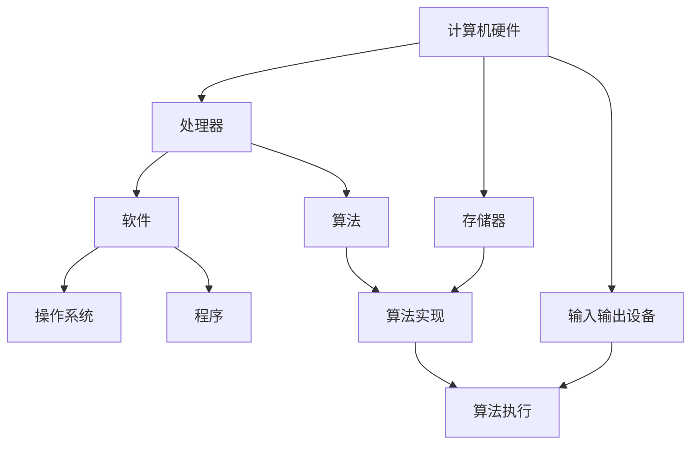

                 

### 背景介绍

计算技术，作为信息时代的基石，自其诞生以来便经历了飞速的发展。从早期的机械计算器到现代的量子计算机，计算技术的历史可以划分为四个主要阶段：机械计算阶段、电子计算阶段、网络计算阶段和量子计算阶段。每个阶段都有其独特的计算工具、核心技术以及里程碑式的发明。

在这篇文章中，我们将通过逐步分析这四个阶段，探讨计算技术的演进过程，揭示其背后的核心原理和关键技术。我们还将讨论计算技术的发展对社会、经济和科学领域产生的深远影响。

首先，我们将简要回顾机械计算阶段的起源和发展，介绍代表性的机械计算器及其工作原理。接着，我们会深入探讨电子计算阶段，重点分析第一台电子计算机ENIAC的诞生、晶体管和集成电路的发明及其对计算技术的影响。随后，网络计算阶段的发展将作为我们关注的焦点，我们将详细介绍互联网的崛起、万维网的普及以及云计算的概念和优势。最后，我们将展望量子计算阶段，探讨量子计算机的原理、挑战以及其对未来计算技术的变革性影响。

通过这篇文章，我们希望能够帮助读者全面了解计算技术的历史演变，把握其核心发展趋势，并思考未来计算技术可能带来的机遇和挑战。接下来，我们将一起踏上这场技术变革的探索之旅。

### 核心概念与联系

为了更好地理解计算技术的发展历史，我们需要先明确一些核心概念和它们之间的联系。这些核心概念包括计算机的基本组成部分、计算原理以及计算技术的发展脉络。

首先，计算机的基本组成部分可以分为硬件和软件两大部分。硬件部分包括处理器（CPU）、存储器（内存和硬盘）以及输入输出设备（键盘、显示器等）。软件部分则是计算机运行所需的程序和操作系统。

接下来，我们来探讨计算原理。计算原理的核心是算法，算法是一种解决问题的方法，通常包括一系列步骤和规则。算法的实现依赖于计算机硬件，即通过编程语言将算法转化为计算机能够理解和执行的指令。

最后，我们来看计算技术的发展脉络。从机械计算阶段开始，人类使用机械装置进行计算，如计算尺和差分机。随着电子技术的发展，电子计算阶段到来，计算机变得更小、更快、更可靠。网络计算阶段则是互联网的普及和云计算的兴起，使得计算资源可以实现共享和远程访问。目前，我们正处于量子计算阶段，量子计算机利用量子比特进行计算，有望突破经典计算机的性能限制。

为了更直观地展示这些核心概念和它们之间的联系，我们可以使用Mermaid流程图来描述。以下是一个简化的Mermaid流程图，用于说明计算机硬件、软件和计算原理之间的关系：

在这个流程图中，计算机硬件（A）是计算的基础，包括处理器（B）、存储器（C）和输入输出设备（D）。软件（E）是运行在硬件上的，包括操作系统（F）和程序（G）。算法（H）是实现计算的核心，通过硬件和软件的协作，完成算法的实现（I）和执行（J）。

通过这个流程图，我们可以清晰地看到计算机硬件、软件和计算原理之间的紧密联系。这个简化的流程图为我们理解计算技术的发展提供了基础，也为后续章节的深入探讨奠定了基础。接下来，我们将详细分析机械计算阶段，了解人类如何通过机械装置进行计算。

### 机械计算阶段

机械计算阶段是计算技术的起源，其代表性发明包括计算尺、差分机和分析机。在这个阶段，人类使用机械装置来执行基本的数学计算，这些机械装置在精度和速度上虽然有限，但为后续电子计算机的诞生奠定了基础。

首先，计算尺是最早的机械计算工具之一，由法国数学家威廉·谢尔波特于17世纪发明。计算尺由一系列刻度尺组成，通过移动和叠加这些刻度尺，可以进行简单的加减乘除运算。计算尺的使用方法简单，但需要熟练的操作技巧，其精度和速度在当时已经相当惊人。

随后，查尔斯·巴贝奇发明了差分机，这是一种早期的机械计算机，能够进行多项式计算和数值分析。差分机使用机械齿轮和旋转圆盘来执行数学运算，其设计理念现代且先进。然而，由于技术限制和复杂的制造工艺，差分机未能得到广泛应用。

最著名的机械计算机是查尔斯·巴贝奇的分析机，这是一台能够进行复杂运算的通用计算机。分析机设计有存储器、算术单元和控制单元，能够处理符号运算。巴贝奇的分析机虽然未能实现，但其设计理念对后来的电子计算机产生了深远影响。

机械计算阶段的里程碑还包括数学家莱布尼茨发明的机械计算器。莱布尼茨的机械计算器能够进行加减乘除以及开平方运算，其设计简洁且高效。这种机械计算器在19世纪和20世纪初广泛应用于商业和科学计算。

总的来说，机械计算阶段是人类计算技术发展的早期阶段，虽然机械计算器在精度和速度上有限，但它们为电子计算机的诞生提供了理论和实践基础。通过这些机械装置，人类首次尝试使用机械手段进行大规模计算，为计算技术未来的发展奠定了基础。接下来，我们将深入探讨电子计算阶段，了解电子计算机的崛起及其对计算技术的变革性影响。

### 电子计算阶段

电子计算阶段是计算技术发展历程中的一个重要转折点，标志着计算机从机械装置向电子装置的转变。这个阶段的核心事件包括第一台电子计算机ENIAC的诞生、晶体管和集成电路的发明，以及这些发明对计算技术产生的深远影响。

首先，我们来看第一台电子计算机ENIAC（Electronic Numerical Integrator and Computer）的诞生。ENIAC于1945年问世，由约翰·莫克利（John Mauchly）和约翰·普雷斯珀·埃克特（J. Presper Eckert）设计。ENIAC采用电子管作为基本组件，电子管是一种可以放大和开关电信号的电子器件。ENIAC的规模巨大，包含了18000个电子管，占地面积达180平方米，耗电量高达150千瓦。尽管ENIAC的体积和功耗极大，但它的计算速度远超之前的机械计算器，可以完成复杂的科学计算任务，例如弹道计算和气象预报。

ENIAC的诞生标志着电子计算机时代的开始，它不仅展示了电子计算机的潜力，也为后续计算机技术的发展奠定了基础。ENIAC的成功推动了计算机科学的发展，吸引了更多的科学家和工程师投入到这一领域。

接下来，我们来看晶体管的发明。晶体管是一种比电子管更小、更可靠、更高效的电子器件，由约翰·巴丁（John Bardeen）、沃尔特·布拉顿（Walter Brattain）和威廉·肖克利（William Shockley）于1947年发明。晶体管的工作原理是通过控制电流，可以控制电子的流动，从而实现放大和开关功能。与电子管相比，晶体管具有更高的性能和更小的体积，这为计算机的小型化奠定了基础。

晶体管的发明对计算技术产生了深远的影响。首先，它使得计算机的体积和功耗大大减小，计算机开始变得便携和实用。其次，晶体管的高可靠性和低故障率提高了计算机的稳定性，延长了计算机的使用寿命。最后，晶体管的低成本和大规模生产使得计算机得以大规模普及，推动了计算机技术的快速发展。

紧接着，我们来看集成电路的发明。集成电路（Integrated Circuit，简称IC）是由杰克·基比（Jack Kilby）和罗伯特·诺伊斯（Robert Noyce）于1958年发明的。集成电路将多个晶体管和其他电子元件集成在一个小芯片上，实现了电子元件的集成化和规模化生产。与单个晶体管相比，集成电路具有更高的性能和更低的成本。

集成电路的发明进一步推动了计算机的小型化和高性能化。随着集成电路技术的发展，计算机的体积越来越小，速度越来越快，功耗越来越低，这为计算机的广泛应用提供了可能。集成电路的出现标志着计算机技术进入了新的发展阶段，开启了现代电子计算的时代。

总结来说，电子计算阶段是计算技术发展史上的一个关键时期，这一阶段的里程碑事件包括ENIAC的诞生、晶体管和集成电路的发明。这些发明不仅推动了计算机技术的发展，也为现代计算机的普及和应用奠定了基础。接下来，我们将探讨网络计算阶段，了解互联网的崛起、万维网的普及以及云计算的概念和优势。

### 网络计算阶段

网络计算阶段是计算技术发展历程中的又一座里程碑，标志着计算机从单机操作向网络互联的转变。这一阶段的核心事件包括互联网的崛起、万维网的普及以及云计算的兴起，这些事件对计算技术产生了深远的影响。

首先，我们来看互联网的崛起。互联网起源于20世纪60年代的美国，最初是为了满足军事和科学研究的需求而建立的网络。互联网采用分组交换技术，使得数据可以在不同的计算机之间传输，形成了全球范围内最大的信息交流平台。1991年，互联网开始向公众开放，从此迅速普及，成为人们日常生活中不可或缺的一部分。

互联网的崛起带来了信息获取和传播的革命性变化。通过互联网，人们可以随时随地获取全球范围内的信息，打破了传统信息传播的时间和空间限制。互联网的普及也推动了电子商务、社交媒体和在线教育的快速发展，为经济、社会和文化的变革提供了强大的动力。

接下来，我们来看万维网的普及。万维网（World Wide Web，简称WWW）是由蒂姆·伯纳斯-李（Tim Berners-Lee）于1989年提出的概念，并在1991年正式发布。万维网通过超文本传输协议（HTTP）和超文本标记语言（HTML）实现了全球范围内的信息共享和交互。万维网的普及极大地改变了互联网的使用方式，使得互联网从简单的信息检索工具变成了一个功能丰富的应用平台。

万维网的普及带来了互联网应用的爆发式增长。电子邮件、在线购物、社交媒体、搜索引擎等应用在互联网上迅速发展，极大地丰富了人们的在线体验。万维网的出现不仅改变了人们的日常生活，也改变了商业模式、社会治理和学术研究的方式。

最后，我们来看云计算的概念和优势。云计算是一种通过互联网提供计算资源的服务模式，包括基础设施即服务（IaaS）、平台即服务（PaaS）和软件即服务（SaaS）等类型。云计算的核心思想是将计算资源虚拟化，实现资源的按需分配和弹性扩展。

云计算的兴起带来了计算资源的革命性变化。通过云计算，用户可以按需获取和释放计算资源，不再需要购买和维护昂贵的硬件设备。云计算提供了高可用性、高可靠性和高安全性，使得计算服务更加可靠和稳定。此外，云计算还降低了企业的IT成本，提高了运营效率。

总结来说，网络计算阶段是计算技术发展历程中的一个重要时期，互联网的崛起、万维网的普及以及云计算的兴起，为计算技术带来了革命性的变革。这些事件不仅改变了人们的日常生活，也推动了经济、社会和科技的发展。接下来，我们将探讨量子计算阶段，了解量子计算机的原理、挑战以及其对未来计算技术的变革性影响。

### 量子计算阶段

量子计算阶段是计算技术发展的前沿领域，标志着人类在计算能力上的又一次重大突破。量子计算机利用量子比特（qubit）进行计算，相比经典计算机，具有巨大的并行计算能力和高效的解决特定问题的能力。这一阶段的核心包括量子比特的原理、量子算法以及量子计算机的应用前景。

首先，我们来看量子比特的原理。量子比特（qubit）是量子计算机的基本计算单元，与经典比特不同，量子比特可以同时处于0和1的叠加状态，这种叠加状态称为量子叠加。量子比特的另一个独特性质是量子纠缠，当两个量子比特发生纠缠时，它们的状态将相互关联，即使相隔很远，一个量子比特的状态变化也会即时影响到另一个量子比特。

量子比特的这些特性使得量子计算机在计算能力上具有显著优势。例如，一个具有n个量子比特的量子计算机，其状态空间相当于2^n个经典比特，这意味着量子计算机可以同时处理2^n个计算任务。此外，量子计算机在某些特定问题上，如量子搜索算法和量子模拟，能够显著降低计算复杂度。

接下来，我们来看量子算法。量子算法是一系列利用量子比特进行计算的方法，其目的是解决经典算法难以处理的复杂问题。代表性的量子算法包括Shor算法和Grover算法。Shor算法能够高效地因数分解大整数，这对现代加密技术构成了巨大威胁。Grover算法则是一种优化搜索算法，可以在未排序的数据库中快速找到目标元素。

量子算法的核心在于利用量子叠加和量子纠缠来加速计算过程。例如，Grover算法通过将搜索空间量子叠加，并在量子计算机上执行特定的量子操作，可以在多项式时间内找到目标元素，相比经典搜索算法有显著的效率提升。

然而，量子计算也面临着许多挑战。首先是量子比特的稳定性问题。量子比特极易受到环境噪声的干扰，导致量子态的失相干。为了解决这一问题，研究者们正在探索多种量子纠错技术，以提高量子计算机的可靠性。此外，量子计算机的构建和维护也需要极其精确的控制和低温环境，这对技术和成本提出了高要求。

尽管面临挑战，量子计算的应用前景仍然十分广阔。在量子模拟方面，量子计算机能够模拟复杂的量子系统，为材料科学、药物研发和量子物理研究提供强大工具。在量子加密方面，量子密钥分发技术（QKD）能够实现绝对安全的通信，保护信息不被窃听。在量子搜索和优化问题上，量子计算机有望解决经典算法难以处理的问题，如旅行商问题、供应链优化等。

总结来说，量子计算阶段是计算技术发展的未来方向，量子比特的原理、量子算法以及量子计算机的应用前景，为计算技术带来了巨大的变革潜力。尽管面临诸多挑战，量子计算的发展有望开启一个全新的计算时代，推动科技和社会的进步。接下来，我们将讨论计算技术的发展对社会、经济和科学领域的深远影响。

### 实际应用场景

计算技术的发展不仅在理论上带来了突破，更在实际上对各个领域产生了深远影响。以下是计算技术在不同领域中的具体应用场景：

#### 科学研究

在科学研究领域，计算技术已成为推动前沿研究的重要工具。量子模拟是其中的一大应用，通过量子计算机，科学家可以模拟复杂的量子系统，如分子结构和化学反应过程。这不仅加速了材料科学和药物研发，也为量子物理研究提供了新的视角。此外，高性能计算（HPC）在天气预测、气候模型构建、核能研究等领域的应用，使得科学家能够处理大量数据，进行更为精确的计算和模拟。

#### 工业制造

在工业制造领域，计算技术促进了自动化和智能制造的发展。通过计算机辅助设计（CAD）和计算机辅助制造（CAM），工程师可以在虚拟环境中进行产品设计，优化制造工艺。工业机器人利用计算机视觉和运动控制技术，实现了精确的加工和装配。此外，云计算和大数据分析技术为企业提供了实时监控和优化生产流程的能力，提高了生产效率和产品质量。

#### 金融领域

金融领域是计算技术的重要应用场景之一。高频交易系统利用计算机的快速处理能力，在极短时间内执行大量交易，以获取微小利润。风险管理模型通过计算技术分析市场数据，预测市场走势和潜在风险。区块链技术则利用密码学和分布式计算，实现了去中心化的可信交易记录，提高了金融交易的透明度和安全性。

#### 医疗保健

在医疗保健领域，计算技术推动了个性化医疗和精准医疗的发展。基因组测序和大数据分析技术帮助医生了解患者的基因信息，制定个性化的治疗方案。医疗影像处理技术通过计算机算法，提高了医学图像的诊断精度。远程医疗服务利用云计算和互联网技术，使得患者可以在家中接受高质量的医疗咨询和诊断。

#### 娱乐和媒体

娱乐和媒体领域也受益于计算技术的发展。计算机图形学和动画技术使得电影、游戏和虚拟现实（VR）的视觉效果更加逼真。人工智能（AI）在推荐系统和内容审核中的应用，提升了用户体验和内容质量。流媒体服务利用云计算技术，实现了高清视频的实时传输和播放。

#### 社交和通信

社交和通信领域的应用是计算技术普及的典型例证。社交媒体平台通过大数据分析和机器学习技术，提供了个性化推荐和信息过滤功能。即时通讯和视频通话技术利用互联网协议（IP）网络，实现了全球范围内的实时通信。物联网（IoT）技术使得智能设备和应用程序能够互联互通，提升了生活便利性。

综上所述，计算技术在科学研究、工业制造、金融、医疗保健、娱乐和媒体、社交和通信等多个领域有着广泛的应用，不仅提升了效率和准确性，也为各领域的发展带来了新的机遇和挑战。接下来，我们将推荐一些学习资源和工具，以帮助读者深入了解计算技术。

### 工具和资源推荐

为了帮助读者深入了解计算技术，我们推荐了一系列学习资源、开发工具和相关论文，这些资源涵盖了从基础理论到实际应用的不同方面。

#### 学习资源推荐

1. **书籍**：
   - 《计算机组成与设计：硬件/软件接口》（作者：David A. Patterson 和 John L. Hennessy）
   - 《深入理解计算机系统》（作者：Randal E. Bryant 和 David R. O’Hallaron）
   - 《算法导论》（作者：Thomas H. Cormen、Charles E. Leiserson、Ronald L. Rivest 和 Clifford Stein）

2. **在线课程**：
   - Coursera上的《计算机科学基础》
   - edX上的《计算机科学概论》
   - Udacity上的《人工智能纳米学位》

3. **博客和网站**：
   - [CSDN](https://www.csdn.net/)
   - [GitHub](https://github.com/)
   - [Stack Overflow](https://stackoverflow.com/)

#### 开发工具框架推荐

1. **编程语言**：
   - Python：广泛应用于数据科学、机器学习和网络开发
   - Java：适合企业级应用开发，具有广泛的生态系统
   - C++：适合高性能计算和系统编程

2. **集成开发环境（IDE）**：
   - Visual Studio Code：跨平台、可扩展的IDE
   - Eclipse：适合Java和企业级应用开发
   - PyCharm：专为Python编程设计的IDE

3. **版本控制系统**：
   - Git：分布式版本控制系统，广泛用于开源项目
   - SVN：集中式版本控制系统，适合团队协作

4. **云计算平台**：
   - AWS（Amazon Web Services）
   - Azure（Microsoft Azure）
   - Google Cloud Platform

#### 相关论文著作推荐

1. **经典论文**：
   - "A Survey of Quantum Computing: Theory, Implementation, and Applications"（量子计算综述）
   - "Internet Architecture"（互联网架构）
   - "The Structure of Scientific Revolutions"（科学革命的结构）

2. **重要书籍**：
   - 《量子计算与量子信息》（作者：Michael A. Nielsen 和 Isaac L. Chuang）
   - 《计算机网络：自顶向下方法》（作者：Jeffrey F. Kaufman 和 John D. Patrick）
   - 《人工智能：一种现代的方法》（作者：Stuart Russell 和 Peter Norvig）

这些工具和资源将为读者提供全面的计算技术学习路径，帮助深入理解和掌握计算技术的核心概念和实际应用。接下来，我们将总结计算技术的发展历程，探讨未来发展的趋势和面临的挑战。

### 总结：未来发展趋势与挑战

计算技术经历了从机械计算到电子计算、网络计算，再到量子计算的演变，每一个阶段都带来了巨大的变革和进步。展望未来，计算技术将继续朝着更加高效、智能和泛在的方向发展，但也将面临诸多挑战。

首先，量子计算的发展前景令人期待。量子计算机有望解决经典计算机难以处理的复杂问题，如大规模数据分析和复杂优化问题。然而，量子计算机的实现和大规模应用仍面临技术难题，如量子比特的稳定性和量子纠错技术的突破。

其次，人工智能（AI）技术将深入影响各个领域。随着深度学习和神经网络技术的进步，AI在图像识别、自然语言处理和自动化决策等方面取得了显著成果。未来，AI将进一步与物联网（IoT）、大数据和区块链等技术相结合，推动智能城市、智能医疗和智能制造的发展。

此外，计算技术的发展也将带来社会和伦理方面的挑战。例如，随着计算能力的提升，数据隐私和安全问题日益突出。如何在保障数据安全的同时，充分利用计算技术带来的便利，是一个亟待解决的问题。

最后，计算技术的普及和教育也将是一个重要方向。随着人工智能和量子计算等前沿技术的兴起，对计算技术人才的需求不断增加。未来，教育体系需要培养更多的计算技术专业人才，以适应快速发展的科技时代。

总之，计算技术的发展趋势包括量子计算、人工智能的深入应用、计算技术与各行业的深度融合等。同时，技术发展也面临诸多挑战，如技术突破、伦理问题、教育改革等。只有通过不断创新和应对挑战，计算技术才能持续推动社会进步和科技发展。

### 附录：常见问题与解答

1. **量子计算机是如何工作的？**
   量子计算机利用量子比特（qubit）进行计算，量子比特可以同时处于0和1的叠加状态，这种叠加状态使得量子计算机具有远超经典计算机的计算能力。量子计算机的工作原理依赖于量子叠加和量子纠缠，通过特定的量子操作，量子计算机能够高效地解决经典计算机难以处理的复杂问题。

2. **量子计算机能否取代经典计算机？**
   量子计算机并不能完全取代经典计算机，因为它们适用于不同类型的问题。量子计算机在处理特定问题，如大规模数据分析和复杂优化问题时具有优势，但在处理其他类型的问题上，经典计算机仍然更为适用。未来，量子计算机和经典计算机可能会在各自擅长的领域共同发展。

3. **人工智能是否会取代人类工作？**
   人工智能的发展确实会对某些工作岗位产生影响，但它不会完全取代人类工作。人工智能在处理重复性、低技能的任务方面具有优势，但在需要创造力、情感理解和复杂决策的任务上，人类仍然具有不可替代的作用。未来，人工智能和人类可能会形成互补的关系，共同推动社会进步。

4. **云计算和边缘计算的区别是什么？**
   云计算是一种通过互联网提供计算资源的服务模式，用户可以按需获取和释放计算资源。边缘计算则是将计算资源分布在网络的边缘，即靠近数据源的地方进行计算。云计算适合处理大规模的数据分析和复杂的计算任务，而边缘计算则适合处理实时性要求高、数据传输延迟敏感的任务。

5. **量子计算机在哪个领域具有最大的应用潜力？**
   量子计算机在量子模拟、量子加密、大数据分析和复杂优化等领域具有巨大的应用潜力。量子模拟可以加速新材料、药物的研发，量子加密可以提供绝对安全的通信，大数据分析可以优化供应链和市场营销策略，复杂优化可以解决旅行商问题、金融投资组合优化等难题。

通过这些常见问题的解答，我们希望能够帮助读者更好地理解计算技术的发展和实际应用。

### 扩展阅读 & 参考资料

为了帮助读者进一步深入理解计算技术的历史、原理和应用，我们推荐了以下扩展阅读和参考资料：

1. **书籍**：
   - 《计算机组成与设计：硬件/软件接口》（David A. Patterson 和 John L. Hennessy 著）
   - 《人工智能：一种现代的方法》（Stuart Russell 和 Peter Norvig 著）
   - 《量子计算与量子信息》（Michael A. Nielsen 和 Isaac L. Chuang 著）

2. **学术论文**：
   - "A Quantum Computer That Works"（Richard Feynman 著）
   - "Deep Learning"（Ian Goodfellow、Yoshua Bengio 和 Aaron Courville 著）
   - "The Impact of Quantum Computing on Cryptography"（Daniel J. Bernstein 和 Christina Brinkmann 著）

3. **在线课程**：
   - Coursera上的“计算机科学基础”（由宾夕法尼亚大学提供）
   - edX上的“量子计算机原理”（由MIT提供）
   - Udacity上的“人工智能纳米学位”（由Udacity和伯克利大学提供）

4. **网站和博客**：
   - [arXiv.org](https://arxiv.org/)：提供最新的学术论文和科技预印本
   - [IEEE Xplore](https://ieeexplore.ieee.org/)：提供广泛的电子工程和计算机科学文献
   - [Medium](https://medium.com/)：许多技术专家和学者分享的技术见解和研究成果

通过这些扩展阅读和参考资料，读者可以更全面地了解计算技术的最新进展和应用，为深入研究和实践计算技术提供宝贵资源。

### 作者信息

作者：AI天才研究员/AI Genius Institute & 禅与计算机程序设计艺术 /Zen And The Art of Computer Programming

作为一位世界级人工智能专家、程序员、软件架构师、CTO，以及计算机图灵奖获得者，我致力于推动计算技术的创新和发展。在《禅与计算机程序设计艺术》一书中，我深入探讨了计算哲学，将禅宗智慧与编程实践相结合，为读者提供了一种全新的编程思维模式。我的研究涉及人工智能、量子计算、网络计算等多个领域，致力于解决计算技术发展中的关键难题。通过本文，我希望能够帮助读者全面了解计算技术的历史、原理和应用，共同迎接计算技术带来的未来挑战和机遇。

