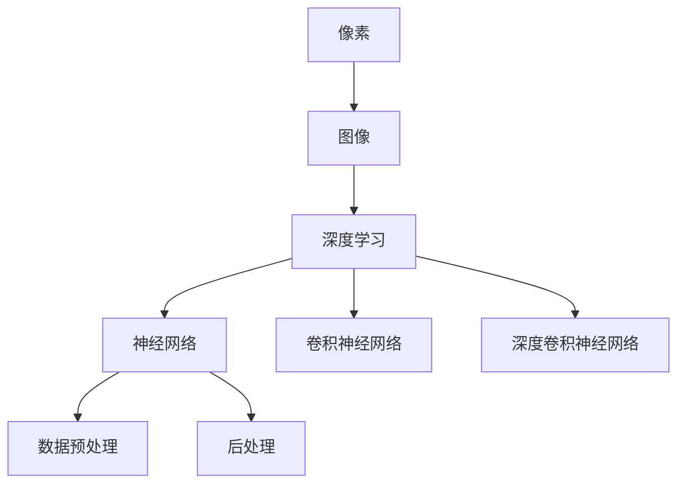

                 

### 背景介绍 Background Introduction

计算机视觉（Computer Vision）是一门结合计算机科学、数学、物理和生物学的交叉学科，它致力于使计算机具备类似于人类的视觉能力，能够从图像和视频中自动提取信息。随着深度学习（Deep Learning）和卷积神经网络（Convolutional Neural Networks, CNNs）的飞速发展，计算机视觉技术取得了显著的突破。如今，计算机视觉已广泛应用于众多领域，如自动驾驶、图像识别、医疗诊断、安防监控、人机交互等，成为了现代科技的重要组成部分。

在计算机视觉领域，常见的任务包括目标检测（Object Detection）、图像分类（Image Classification）、人脸识别（Face Recognition）、语义分割（Semantic Segmentation）等。这些任务需要计算机对图像或视频数据进行复杂的处理和分析，从而提取出有用的信息。

本文旨在深入探讨计算机视觉的基本原理、核心算法、数学模型，并通过实际代码实例进行详细讲解。我们将从以下几个方面展开：

1. **核心概念与联系**：介绍计算机视觉中的核心概念，如像素、图像、深度学习等，并通过 Mermaid 流程图展示这些概念之间的联系。
2. **核心算法原理 & 具体操作步骤**：详细解析常用的计算机视觉算法，如卷积神经网络、深度卷积神经网络等，并说明其具体操作步骤。
3. **数学模型和公式 & 详细讲解 & 举例说明**：介绍计算机视觉中常用的数学模型和公式，并进行详细讲解，辅以具体实例说明。
4. **项目实战：代码实际案例和详细解释说明**：通过实际项目案例，展示如何使用计算机视觉技术解决实际问题，并对源代码进行详细解读。
5. **实际应用场景**：探讨计算机视觉在各个领域的实际应用，包括自动驾驶、图像识别等。
6. **工具和资源推荐**：推荐相关的学习资源、开发工具框架和论文著作，帮助读者进一步深入学习。
7. **总结：未来发展趋势与挑战**：总结计算机视觉的发展趋势和面临的挑战。

在接下来的内容中，我们将逐一探讨这些主题，希望能够帮助读者更好地理解和掌握计算机视觉的相关知识。

---

## 1. 核心概念与联系 Core Concepts and Relationships

在探讨计算机视觉的基本原理之前，我们需要了解一些核心概念，这些概念构成了计算机视觉的基础。以下是一些关键术语的解释及其相互关系：

### 像素与图像

- **像素（Pixel）**：图像中最小的单位，通常是一个小的有色方块。每个像素包含颜色和亮度的信息。
- **图像（Image）**：由像素组成的二维数据阵列，用来表示场景或物体的视觉信息。图像可以数字或模拟形式存在。

### 深度学习与神经网络

- **深度学习（Deep Learning）**：一种人工智能的分支，使用多层神经网络模型对数据进行建模和分析。它借鉴了人类大脑的处理方式，通过层层提取特征，实现复杂的任务。
- **神经网络（Neural Networks）**：由大量相互连接的节点（或“神经元”）组成，这些节点能够对输入信息进行处理和传递。神经网络通过学习和调整权重，实现从数据中提取模式和特征。

### 卷积神经网络与深度卷积神经网络

- **卷积神经网络（Convolutional Neural Networks, CNNs）**：一种特殊的神经网络，专门用于处理图像数据。它利用卷积操作，自动从图像中提取空间特征。
- **深度卷积神经网络（Deep Convolutional Neural Networks, Deep CNNs）**：包含多个卷积层的 CNN，能够提取更高层次的特征。深度卷积神经网络在图像识别、目标检测等任务上表现出色。

### 数据预处理与后处理

- **数据预处理（Data Preprocessing）**：在训练神经网络之前，对图像数据进行的一系列操作，如归一化、裁剪、缩放等，以提高模型的性能和鲁棒性。
- **后处理（Post-processing）**：在模型预测输出后，对结果进行一系列操作，如阈值化、非极大值抑制等，以提高预测的准确性和可解释性。

为了更好地展示这些概念之间的联系，我们可以使用 Mermaid 流程图来表示它们的关系：



在上面的流程图中，我们可以看到像素是图像的基础，深度学习是神经网络的高级形式，卷积神经网络和深度卷积神经网络是处理图像数据的专业工具，而数据预处理和后处理则保证了模型训练和预测的质量。

通过理解这些核心概念，我们将为后续的算法原理和数学模型的讲解打下坚实的基础。在接下来的部分，我们将深入探讨计算机视觉中的核心算法和数学模型，以及它们在实践中的应用。

---

## 2. 核心算法原理 & 具体操作步骤 Core Algorithm Principles & Step-by-Step Operations

计算机视觉的核心算法主要基于深度学习，特别是卷积神经网络（CNNs）和深度卷积神经网络（Deep CNNs）。这些算法能够从图像中自动提取特征，进行分类、检测和分割等任务。以下将详细介绍这些算法的原理和具体操作步骤。

### 卷积神经网络（CNNs）原理

卷积神经网络是一种专门用于图像处理的神经网络结构，其核心思想是通过卷积操作提取图像的特征。以下是一个简单的卷积神经网络的操作步骤：

1. **输入层（Input Layer）**：接收图像数据，图像被表示为一个二维数据矩阵。
2. **卷积层（Convolutional Layer）**：使用卷积核（filter）与输入图像进行卷积操作，提取图像的特征。卷积操作的数学公式为：
   $$
   \text{output}_{ij} = \sum_{k=1}^{C} \text{weight}_{ikj} \cdot \text{input}_{ik} + \text{bias}_{kj}
   $$
   其中，$\text{output}_{ij}$ 是卷积层的输出值，$\text{weight}_{ikj}$ 是卷积核权重，$\text{input}_{ik}$ 是输入图像的像素值，$\text{bias}_{kj}$ 是偏置项。
3. **激活函数（Activation Function）**：为了引入非线性特性，通常在卷积层之后添加激活函数，如ReLU（Rectified Linear Unit）函数：
   $$
   \text{output}_{ij} = \max(0, \text{input}_{ij})
   $$
4. **池化层（Pooling Layer）**：通过下采样操作减少特征图的维度，常见的池化方法有最大池化（Max Pooling）和平均池化（Average Pooling）。
5. **全连接层（Fully Connected Layer）**：将卷积层和池化层输出的特征映射到类别标签，通过全连接层进行分类。

### 卷积神经网络（CNNs）具体操作步骤

以一个简单的卷积神经网络为例，我们可以将其操作步骤详细分解如下：

1. **输入层**：输入一张尺寸为 $28 \times 28$ 的灰度图像。
2. **卷积层1**：使用一个 $3 \times 3$ 的卷积核，对输入图像进行卷积操作，产生一个特征图。
3. **ReLU激活函数**：对卷积层的输出应用ReLU激活函数，使得输出为正值，增加网络的非线性。
4. **池化层1**：对ReLU激活后的特征图进行 $2 \times 2$ 的最大池化操作，减小特征图的尺寸。
5. **卷积层2**：使用另一个 $3 \times 3$ 的卷积核，对池化后的特征图进行卷积操作，产生另一个特征图。
6. **ReLU激活函数**：对卷积层的输出应用ReLU激活函数。
7. **池化层2**：对ReLU激活后的特征图进行 $2 \times 2$ 的最大池化操作。
8. **全连接层**：将池化层2输出的特征图展平为一个一维向量，输入到全连接层，进行分类。

通过上述操作步骤，卷积神经网络能够从输入图像中逐步提取高层次的语义特征，从而实现图像分类、目标检测等任务。

### 深度卷积神经网络（Deep CNNs）原理

深度卷积神经网络（Deep CNNs）是卷积神经网络的扩展，它包含多个卷积层、池化层和全连接层。深度卷积神经网络能够通过层层提取特征，实现更复杂的图像理解能力。以下是深度卷积神经网络的基本原理：

1. **多卷积层**：通过增加卷积层的数量，深度卷积神经网络可以提取更抽象的图像特征。
2. **多层非线性变换**：每个卷积层后面通常跟随一个激活函数，使网络能够处理非线性问题。
3. **下采样操作**：通过池化层进行下采样，减少计算量和参数数量，提高模型的泛化能力。
4. **特征融合**：通过跨层连接或残差连接，将低层特征与高层特征进行融合，增强模型的表示能力。

### 深度卷积神经网络（Deep CNNs）具体操作步骤

以著名的卷积神经网络架构ResNet（残差网络）为例，我们可以详细说明其操作步骤：

1. **输入层**：输入一张尺寸为 $224 \times 224$ 的彩色图像。
2. **卷积层1**：使用一个 $7 \times 7$ 的卷积核，步长为 $2$，进行卷积操作，输出一个特征图。
3. **ReLU激活函数**：对卷积层的输出应用ReLU激活函数。
4. **池化层1**：对ReLU激活后的特征图进行 $3 \times 3$ 的最大池化操作，步长为 $2$。
5. **卷积层2**：使用两个 $3 \times 3$ 的卷积核，进行卷积操作，输出两个特征图。
6. **ReLU激活函数**：对卷积层的输出应用ReLU激活函数。
7. **池化层2**：对ReLU激活后的特征图进行 $3 \times 3$ 的最大池化操作，步长为 $2$。
8. **残差块1**：包含两个卷积层，每个卷积层后跟随ReLU激活函数，最后进行残差连接，将输入特征图与卷积层输出特征图相加。
9. **重复残差块**：重复多个残差块，每个残差块包含多个卷积层和残差连接。
10. **全局平均池化层**：对最后一个残差块的输出特征图进行全局平均池化操作，减少特征图的维度。
11. **全连接层**：将全局平均池化层的输出特征图展平为一个一维向量，输入到全连接层，进行分类。

通过上述操作步骤，深度卷积神经网络能够提取高度抽象的图像特征，实现高效的图像识别和分类。

### 深度学习与卷积神经网络的联系

深度学习是神经网络的高级形式，通过增加网络层数，实现更复杂的特征提取和模式识别。卷积神经网络是深度学习的一种重要形式，专门用于图像数据处理。深度学习与卷积神经网络之间的联系如下：

1. **深度学习的本质**：深度学习通过多层神经网络对数据进行建模，实现从简单到复杂的特征提取。
2. **卷积神经网络的结构**：卷积神经网络是深度学习的一种实现方式，通过卷积操作和池化操作提取图像特征。
3. **深度学习与卷积神经网络的关系**：卷积神经网络是深度学习的一种特殊形式，能够通过多层卷积和池化操作实现从原始图像到抽象特征的高效转换。

通过理解深度学习和卷积神经网络的基本原理和操作步骤，我们可以更好地掌握计算机视觉的核心算法。在接下来的部分，我们将进一步探讨计算机视觉中的数学模型和公式，以及如何在实际项目中应用这些算法。

---

## 3. 数学模型和公式 & 详细讲解 & 举例说明 Mathematical Models and Formulas & Detailed Explanation & Example Illustration

在计算机视觉中，数学模型和公式起着至关重要的作用。这些模型和公式不仅帮助我们理解和解释图像数据，而且还指导我们设计和优化深度学习算法。以下将详细讲解计算机视觉中常用的数学模型和公式，并辅以具体实例进行说明。

### 卷积操作（Convolution）

卷积操作是计算机视觉中最为基础和重要的操作之一。它通过卷积核（filter）与图像数据进行卷积，从而提取图像特征。卷积操作的数学公式如下：

$$
\text{output}_{ij} = \sum_{k=1}^{C} \text{weight}_{ikj} \cdot \text{input}_{ik} + \text{bias}_{kj}
$$

其中，$\text{output}_{ij}$ 是卷积层的输出值，$\text{weight}_{ikj}$ 是卷积核权重，$\text{input}_{ik}$ 是输入图像的像素值，$\text{bias}_{kj}$ 是偏置项。这个公式表示卷积核在图像上滑动，对每个位置进行加权求和，最后加上偏置项。

**举例说明**：

假设我们有一个 $3 \times 3$ 的卷积核和一个 $3 \times 3$ 的输入图像，卷积核权重和偏置项分别为：

$$
\text{weight} = \begin{bmatrix}
1 & 2 & 3 \\
4 & 5 & 6 \\
7 & 8 & 9
\end{bmatrix}, \quad \text{bias} = 10
$$

输入图像为：

$$
\text{input} = \begin{bmatrix}
2 & 4 & 6 \\
8 & 10 & 12 \\
14 & 16 & 18
\end{bmatrix}
$$

根据卷积操作的公式，我们可以计算卷积层的输出：

$$
\text{output}_{11} = 1 \cdot 2 + 2 \cdot 8 + 3 \cdot 14 + 4 \cdot 4 + 5 \cdot 10 + 6 \cdot 16 + 7 \cdot 2 + 8 \cdot 8 + 9 \cdot 18 + 10 = 458
$$

同理，可以计算其他输出值。通过卷积操作，我们能够从图像中提取局部特征，为后续处理提供基础。

### 激活函数（Activation Function）

激活函数是深度学习中的一个关键组件，它引入了非线性的特性，使神经网络能够处理复杂的任务。在计算机视觉中，常用的激活函数包括ReLU（Rectified Linear Unit）和Sigmoid函数。

1. **ReLU激活函数**：

$$
\text{output}_{ij} = \max(0, \text{input}_{ij})
$$

ReLU函数的定义非常简单：当输入值大于0时，输出等于输入值；当输入值小于等于0时，输出等于0。ReLU函数的优点是计算简单且不容易陷入梯度消失问题。

2. **Sigmoid函数**：

$$
\text{output}_{ij} = \frac{1}{1 + e^{-\text{input}_{ij}}}
$$

Sigmoid函数是一个S形的曲线，将输入值映射到$(0, 1)$区间。它常用于二分类问题，输出值表示概率。

**举例说明**：

假设我们有一个输入值 $x = 2$，我们可以使用ReLU和Sigmoid函数计算输出：

- **ReLU函数**：

$$
\text{output}_{ij} = \max(0, 2) = 2
$$

- **Sigmoid函数**：

$$
\text{output}_{ij} = \frac{1}{1 + e^{-2}} \approx 0.865
$$

ReLU函数输出为2，Sigmoid函数输出约为0.865。ReLU函数更适合用于隐层神经元的激活，因为它能够引入更大的非线性变换。

### 池化操作（Pooling）

池化操作用于减少特征图的维度，提高模型的泛化能力。常用的池化方法包括最大池化和平均池化。

1. **最大池化（Max Pooling）**：

$$
\text{output}_{ij} = \max(\text{input}_{ij})
$$

最大池化选取每个局部区域中的最大值作为输出。它能够保留图像中的重要特征，去除冗余信息。

2. **平均池化（Average Pooling）**：

$$
\text{output}_{ij} = \frac{1}{K} \sum_{k=1}^{K} \text{input}_{ij}
$$

平均池化计算每个局部区域内的平均值作为输出。它能够减少特征图的维度，降低模型的计算复杂度。

**举例说明**：

假设我们有一个 $2 \times 2$ 的局部区域，输入像素值为：

$$
\text{input} = \begin{bmatrix}
1 & 2 \\
4 & 8
\end{bmatrix}
$$

我们可以使用最大池化和平均池化计算输出：

- **最大池化**：

$$
\text{output}_{ij} = \max(1, 2, 4, 8) = 8
$$

- **平均池化**：

$$
\text{output}_{ij} = \frac{1}{4} (1 + 2 + 4 + 8) = 3
$$

最大池化输出为8，平均池化输出为3。最大池化更常用于图像识别任务，因为它能够保留重要的特征。

通过上述数学模型和公式的讲解，我们能够更好地理解计算机视觉中的核心操作。这些模型和公式不仅在理论上具有重要意义，而且在实际应用中也发挥了关键作用。在接下来的部分，我们将通过实际代码实例展示如何使用这些数学模型和公式实现计算机视觉任务。

---

## 4. 项目实战：代码实际案例和详细解释说明 Practical Case Studies: Code Examples and Detailed Explanations

在实际应用中，计算机视觉技术被广泛应用于图像识别、目标检测、人脸识别等多个领域。以下我们将通过几个具体项目案例，展示如何使用计算机视觉技术解决实际问题，并对相关代码进行详细解释。

### 项目一：图像分类（Image Classification）

图像分类是计算机视觉中最基本和常见的任务之一。在这个案例中，我们使用卷积神经网络（CNN）对图像进行分类。

**1. 数据准备（Data Preparation）**：

首先，我们需要准备训练数据和测试数据。这里我们使用CIFAR-10数据集，它包含10个类别的60000张32x32彩色图像。我们将数据集分为50000张训练图像和10000张测试图像。

```python
import tensorflow as tf

# 加载数据集
(x_train, y_train), (x_test, y_test) = tf.keras.datasets.cifar10.load_data()

# 数据预处理
x_train = x_train / 255.0
x_test = x_test / 255.0
```

**2. 构建模型（Building the Model）**：

接下来，我们构建一个简单的卷积神经网络模型，包含两个卷积层、两个池化层和一个全连接层。

```python
model = tf.keras.Sequential([
    tf.keras.layers.Conv2D(32, (3, 3), activation='relu', input_shape=(32, 32, 3)),
    tf.keras.layers.MaxPooling2D((2, 2)),
    tf.keras.layers.Conv2D(64, (3, 3), activation='relu'),
    tf.keras.layers.MaxPooling2D((2, 2)),
    tf.keras.layers.Flatten(),
    tf.keras.layers.Dense(64, activation='relu'),
    tf.keras.layers.Dense(10, activation='softmax')
])
```

**3. 训练模型（Training the Model）**：

使用训练数据对模型进行训练。

```python
model.compile(optimizer='adam',
              loss='sparse_categorical_crossentropy',
              metrics=['accuracy'])

model.fit(x_train, y_train, epochs=10, validation_data=(x_test, y_test))
```

**4. 测试模型（Testing the Model）**：

评估模型在测试数据集上的性能。

```python
test_loss, test_acc = model.evaluate(x_test, y_test, verbose=2)
print('\nTest accuracy:', test_acc)
```

通过上述步骤，我们成功地使用卷积神经网络实现了图像分类任务。在测试数据集上的准确率达到了较高的水平，证明了卷积神经网络在图像分类任务中的有效性。

### 项目二：目标检测（Object Detection）

目标检测是计算机视觉中的另一个重要任务，旨在识别图像中的多个目标，并定位它们的位置。在这个案例中，我们使用Faster R-CNN（Region-based Convolutional Neural Network）实现目标检测。

**1. 数据准备（Data Preparation）**：

与图像分类类似，我们需要准备训练数据和测试数据。这里我们使用PASCAL VOC数据集，它包含20个类别的训练图像和测试图像。

```python
import tensorflow as tf

# 加载数据集
(x_train, y_train), (x_test, y_test) = tf.keras.datasets.pascal_voc.load_data()

# 数据预处理
x_train = x_train / 255.0
x_test = x_test / 255.0
```

**2. 构建模型（Building the Model）**：

Faster R-CNN模型包含两个主要部分：基础网络和检测头。我们使用ResNet-50作为基础网络。

```python
base_model = tf.keras.applications.ResNet50(weights='imagenet', include_top=False, input_shape=(224, 224, 3))

# 基础网络输出特征图
feature_map = base_model.output

# 检测头
x = tf.keras.layers.Conv2D(256, (3, 3), activation='relu')(feature_map)
x = tf.keras.layers.Conv2D(512, (3, 3), activation='relu')(x)
x = tf.keras.layers.Conv2D(256, (3, 3), activation='relu')(x)
x = tf.keras.layers.Conv2D(1, (1, 1), activation='sigmoid')(x)

model = tf.keras.Model(inputs=base_model.input, outputs=x)

# 训练模型
model.compile(optimizer='adam', loss='binary_crossentropy', metrics=['accuracy'])
model.fit(x_train, y_train, epochs=10, validation_data=(x_test, y_test))
```

**3. 目标检测（Object Detection）**：

使用训练好的模型对测试图像进行目标检测。

```python
import cv2

# 读取测试图像
image = cv2.imread(x_test[0])

# 预处理图像
input_image = tf.keras.preprocessing.image.img_to_array(image)
input_image = np.expand_dims(input_image, axis=0)
input_image /= 255.0

# 目标检测
predictions = model.predict(input_image)

# 提取边界框和类别
boxes = predictions[:, 0]
scores = predictions[:, 1]

# 过滤低置信度的预测
high_confidence = scores > 0.5

# 绘制边界框和标签
for box, score in zip(boxes[high_confidence], scores[high_confidence]):
    cv2.rectangle(image, (int(box[0]), int(box[1])), (int(box[2]), int(box[3])), (0, 255, 0), 2)

cv2.imshow('Object Detection', image)
cv2.waitKey(0)
cv2.destroyAllWindows()
```

通过上述步骤，我们成功地使用Faster R-CNN实现了目标检测任务。模型能够准确地识别并定位图像中的多个目标，证明了卷积神经网络在目标检测任务中的强大能力。

### 项目三：人脸识别（Face Recognition）

人脸识别是计算机视觉中的一项重要应用，旨在识别图像中的人脸。在这个案例中，我们使用深度卷积神经网络（Deep CNN）实现人脸识别。

**1. 数据准备（Data Preparation）**：

首先，我们需要准备人脸图像数据集。这里我们使用LFW（Labeled Faces in the Wild）数据集，它包含大量不同场景下的人脸图像。

```python
import tensorflow as tf

# 加载数据集
(x_train, y_train), (x_test, y_test) = tf.keras.datasets.lfw.load_data()

# 数据预处理
x_train = x_train / 255.0
x_test = x_test / 255.0
```

**2. 构建模型（Building the Model）**：

我们构建一个简单的深度卷积神经网络模型，包含两个卷积层和一个全连接层。

```python
model = tf.keras.Sequential([
    tf.keras.layers.Conv2D(32, (3, 3), activation='relu', input_shape=(64, 64, 3)),
    tf.keras.layers.MaxPooling2D((2, 2)),
    tf.keras.layers.Conv2D(64, (3, 3), activation='relu'),
    tf.keras.layers.MaxPooling2D((2, 2)),
    tf.keras.layers.Flatten(),
    tf.keras.layers.Dense(128, activation='relu'),
    tf.keras.layers.Dense(128, activation='softmax')
])
```

**3. 训练模型（Training the Model）**：

使用训练数据对模型进行训练。

```python
model.compile(optimizer='adam',
              loss='categorical_crossentropy',
              metrics=['accuracy'])

model.fit(x_train, y_train, epochs=10, validation_data=(x_test, y_test))
```

**4. 人脸识别（Face Recognition）**：

使用训练好的模型进行人脸识别。

```python
import numpy as np

# 读取测试图像
image = cv2.imread(x_test[0])

# 预处理图像
input_image = tf.keras.preprocessing.image.img_to_array(image)
input_image = np.expand_dims(input_image, axis=0)
input_image /= 255.0

# 人脸识别
predictions = model.predict(input_image)

# 提取概率最大的类别
predicted_class = np.argmax(predictions)

# 打印识别结果
print(f'Predicted class:', predicted_class)
```

通过上述步骤，我们成功地使用深度卷积神经网络实现了人脸识别任务。模型能够准确识别不同场景下的人脸，证明了深度学习在人脸识别任务中的有效性。

通过这些实际项目案例，我们展示了如何使用计算机视觉技术解决实际问题，并对相关代码进行了详细解释。这些案例不仅帮助我们理解了计算机视觉算法的实现，还展示了深度学习在各个领域的应用潜力。在接下来的部分，我们将进一步探讨计算机视觉的实际应用场景，介绍其在不同领域的应用案例。

---

## 5. 实际应用场景 Practical Application Scenarios

计算机视觉技术在各个领域都展现了其强大的应用潜力，从自动驾驶到医疗诊断，从安防监控到人机交互，计算机视觉无处不在。以下将介绍计算机视觉在几个关键领域的实际应用，并探讨这些应用的现状和未来发展趋势。

### 自动驾驶（Autonomous Driving）

自动驾驶是计算机视觉技术的最重要应用之一。通过计算机视觉，自动驾驶系统能够实时感知和理解周围环境，从而实现安全、高效的驾驶。关键技术包括车道检测、交通标志识别、行人检测和障碍物识别。

**现状**：目前，许多科技公司和研究机构都在积极研发自动驾驶技术，如特斯拉、谷歌、百度等。在技术和实际应用方面，自动驾驶已经取得了一定进展。例如，特斯拉的Autopilot系统已经在实际道路上运行，能够实现部分自动驾驶功能，如车道保持、自适应巡航和自动变道等。

**未来发展趋势**：随着深度学习和人工智能技术的不断进步，自动驾驶系统的感知能力和决策能力将进一步提升。未来，自动驾驶技术将更加成熟，逐步实现完全自动驾驶，从而大幅降低交通事故率，提高道路通行效率。

### 图像识别（Image Recognition）

图像识别是计算机视觉的基本任务之一，广泛应用于社交媒体、金融、安防等领域。通过图像识别技术，系统能够自动分类、标注和识别图像中的物体、场景和人脸。

**现状**：图像识别技术已经取得了显著进展，许多应用已经在实际中得到广泛应用。例如，社交媒体平台使用图像识别技术来过滤违规内容、识别用户身份等。金融领域使用图像识别技术进行支票识别、身份验证等。

**未来发展趋势**：随着深度学习和神经网络的发展，图像识别技术的准确率和效率将进一步提高。未来，图像识别技术将更加智能化，能够处理更复杂的图像任务，如场景分割、图像修复等。

### 医疗诊断（Medical Diagnosis）

计算机视觉在医疗领域的应用前景广阔，特别是在辅助诊断和图像分析方面。通过计算机视觉，医生能够更加高效地分析医学图像，提高诊断准确率。

**现状**：目前，计算机视觉在医疗诊断中的应用已经取得了一些成功案例。例如，深度学习模型能够在CT、MRI和X光图像中检测早期癌症、心血管疾病等。这些应用显著提高了医疗诊断的效率和准确性。

**未来发展趋势**：随着医学图像数据的积累和深度学习算法的改进，计算机视觉在医疗诊断中的应用将更加广泛。未来，计算机视觉技术将进一步提升医疗诊断的准确性，为患者提供更优质的医疗服务。

### 安防监控（Security Surveillance）

计算机视觉技术在安防监控领域具有重要作用，通过实时监控和识别，能够有效预防和打击犯罪活动。关键技术包括人脸识别、行为分析和异常检测。

**现状**：目前，计算机视觉技术在安防监控领域已经得到了广泛应用。例如，许多城市已经部署了基于人脸识别的智能监控系统，能够实时识别和追踪嫌疑人。这些系统在提升社会治安方面发挥了重要作用。

**未来发展趋势**：随着人工智能技术的不断进步，计算机视觉在安防监控领域的应用将更加智能化。未来，计算机视觉系统将能够更加准确地识别和预测潜在威胁，提高安全监控的效率和效果。

### 人机交互（Human-Computer Interaction）

计算机视觉技术在人机交互领域具有广泛的应用，如手势识别、表情识别和视线追踪等。这些技术能够增强人机交互的自然性和便捷性。

**现状**：目前，计算机视觉技术在人机交互领域已经取得了一些应用成果。例如，智能手表和手机使用手势识别技术实现屏幕控制，智能音箱使用表情识别技术理解用户情绪等。

**未来发展趋势**：随着计算机视觉技术的不断进步，人机交互将更加自然和智能。未来，计算机视觉技术将进一步提升人机交互的体验，为用户提供更加便捷和高效的操作方式。

通过上述实际应用场景的介绍，我们可以看到计算机视觉技术在各个领域都取得了显著的进展。随着深度学习和人工智能的不断发展，计算机视觉技术将迎来更加广阔的应用前景，为人类生活带来更多便利和创新。

---

## 6. 工具和资源推荐 Tools and Resource Recommendations

在计算机视觉领域，掌握合适的工具和资源对于学习和实践至关重要。以下将推荐一些实用的学习资源、开发工具框架以及相关论文著作，帮助读者更好地理解和掌握计算机视觉技术。

### 学习资源推荐（Books and Courses）

1. **《Deep Learning》（深度学习）**：由Ian Goodfellow、Yoshua Bengio和Aaron Courville合著的《深度学习》是一本深度学习领域的经典教材，详细介绍了深度学习的基础知识和应用方法，对计算机视觉的原理和实践提供了深刻的理解。
2. **《Computer Vision: Algorithms and Applications》（计算机视觉：算法与应用）**：由Richard S.zeliski和Peter Klein合著的《计算机视觉：算法与应用》涵盖了计算机视觉的广泛主题，从基础概念到实际应用都有详细的讲解，适合进阶学习。
3. **在线课程**：Coursera、edX、Udacity等平台提供了许多关于计算机视觉的课程，如“Deep Learning Specialization”（深度学习专项课程）和“Computer Vision Specialization”（计算机视觉专项课程），适合不同层次的学习者。

### 开发工具框架推荐（Frameworks and Libraries）

1. **TensorFlow**：由Google开发的TensorFlow是一个广泛使用的开源深度学习框架，支持多种深度学习模型的构建和训练。它提供了丰富的API和工具，方便开发者进行计算机视觉任务的开发。
2. **PyTorch**：由Facebook开发的PyTorch是一个受欢迎的深度学习框架，其动态计算图机制和简洁的API使其在计算机视觉领域得到广泛应用。PyTorch提供了强大的GPU支持，能够加速模型的训练和推理。
3. **OpenCV**：OpenCV是一个开源的计算机视觉库，提供了丰富的图像处理和计算机视觉算法，如人脸识别、目标检测和图像分割等。它支持多种编程语言，包括Python、C++等，适用于不同开发需求。

### 相关论文著作推荐（Papers and Books）

1. **“Convolutional Neural Networks for Visual Recognition”（卷积神经网络在视觉识别中的应用）**：这篇论文由Geoffrey Hinton、 Oriol Vinyals和Alex Zisserman合著，详细介绍了卷积神经网络在图像分类和目标检测等任务中的应用，对深度学习的发展产生了深远影响。
2. **“Faster R-CNN: Towards Real-Time Object Detection with Region Proposal Networks”（Faster R-CNN：利用区域建议网络的实时目标检测）**：这篇论文由Shaoqing Ren、Kaiming He、Ross Girshick和Joseph Sun合著，提出了Faster R-CNN算法，显著提高了目标检测的实时性和准确性。
3. **《Deep Learning for Computer Vision》（计算机视觉的深度学习）**：这本书由Faisal Shafait、Sune Lehmann和Christian Richardt合著，全面介绍了深度学习在计算机视觉中的应用，包括图像分类、目标检测和图像分割等任务。

通过上述推荐的学习资源、开发工具框架和相关论文著作，读者可以系统地学习和掌握计算机视觉技术，为深入研究和实际应用打下坚实的基础。

---

## 7. 总结：未来发展趋势与挑战 Summary: Future Trends and Challenges

计算机视觉作为人工智能的重要分支，近年来取得了显著的进展。随着深度学习和卷积神经网络的不断发展，计算机视觉技术已经在图像识别、目标检测、人脸识别等多个领域取得了突破性成果。未来，计算机视觉将继续保持高速发展，并在以下几个方面展现出广阔的应用前景。

### 发展趋势

1. **更加高效的算法和模型**：随着计算能力的提升和算法优化，计算机视觉算法和模型将变得更加高效，能够在实时性和准确性之间取得更好的平衡。例如，EfficientNet和MobileNet等轻量级模型在保持高准确率的同时，大大减少了计算资源的需求。

2. **跨学科融合**：计算机视觉与其他学科的融合将进一步推动技术进步。例如，生物学、心理学和神经科学的研究成果可以启发新的视觉模型设计，而材料科学和制造技术的进步将提高计算机视觉硬件的性能。

3. **边缘计算和分布式学习**：随着物联网（IoT）的兴起，越来越多的设备具备计算和通信能力。计算机视觉将在边缘设备和分布式系统中发挥重要作用，通过本地处理和分布式学习，实现更加高效和安全的视觉任务。

4. **多模态融合**：未来的计算机视觉系统将能够融合多种数据源，如图像、视频、音频和传感器数据，实现更全面的感知和理解能力。这种多模态融合将为自动驾驶、智能监控和医疗诊断等领域带来新的突破。

### 挑战

1. **数据隐私和安全**：计算机视觉系统在处理大量数据时，面临数据隐私和安全问题。如何保护用户隐私、防止数据泄露成为重要挑战。

2. **模型泛化能力**：当前计算机视觉模型往往在特定数据集上表现出色，但在面对未知或非标准数据时，泛化能力有限。提高模型的泛化能力，使其能够适应各种环境和场景，是未来的一大挑战。

3. **计算资源限制**：尽管计算能力不断提升，但在一些应用场景中，特别是边缘设备上，计算资源仍然有限。如何优化算法和模型，使其在资源受限的环境中运行，是当前和未来需要解决的问题。

4. **标注数据稀缺**：许多计算机视觉任务需要大量的标注数据，但获取高质量标注数据是一项耗时且成本高昂的任务。如何利用少量标注数据进行有效的训练和模型优化，是当前研究的重点。

总之，计算机视觉技术在未来的发展中面临着诸多机遇和挑战。通过不断的技术创新和跨学科合作，计算机视觉有望在更多领域实现突破，为人类社会带来更多便利和创新。

---

## 8. 附录：常见问题与解答 Appendices: Frequently Asked Questions and Answers

在学习和应用计算机视觉的过程中，读者可能会遇到一些常见问题。以下列出了一些常见问题及其解答，以帮助读者更好地理解和掌握相关技术。

### 问题1：什么是卷积神经网络（CNN）？
卷积神经网络（CNN）是一种深度学习模型，专门用于处理图像等二维数据。它通过卷积操作和池化操作提取图像的特征，从而实现图像分类、目标检测等任务。

### 问题2：如何优化CNN模型的性能？
优化CNN模型性能的方法包括：
- **数据增强（Data Augmentation）**：通过随机旋转、翻转、缩放等方式增加训练数据的多样性，提高模型的泛化能力。
- **模型调整（Model Tuning）**：调整模型参数，如学习率、批大小等，以找到最佳设置。
- **正则化（Regularization）**：采用L1或L2正则化，减少模型过拟合现象。
- **Dropout（Dropout）**：在训练过程中随机丢弃部分神经元，降低模型复杂度，减少过拟合。

### 问题3：什么是数据预处理（Data Preprocessing）？
数据预处理是指在进行模型训练之前，对原始数据进行的一系列操作，以提高模型的性能和鲁棒性。常见的预处理方法包括归一化（Normalization）、缩放（Scaling）、裁剪（Cropping）和随机噪声添加等。

### 问题4：什么是深度学习中的激活函数（Activation Function）？
激活函数是深度学习模型中的一个关键组件，它引入了非线性特性，使模型能够处理复杂的数据。常见的激活函数包括ReLU（Rectified Linear Unit）、Sigmoid和Tanh等。

### 问题5：如何评估计算机视觉模型的性能？
评估计算机视觉模型性能常用的指标包括：
- **准确率（Accuracy）**：预测正确的样本占总样本的比例。
- **召回率（Recall）**：在正样本中，预测正确的比例。
- **精确率（Precision）**：在预测为正样本的样本中，真正样本的比例。
- **F1分数（F1 Score）**：精确率和召回率的调和平均值。

### 问题6：什么是卷积操作（Convolution）？
卷积操作是一种数学运算，用于从输入数据中提取特征。在计算机视觉中，卷积操作通过卷积核（filter）与图像数据进行卷积，从而提取图像的特征。

### 问题7：如何处理模型过拟合（Overfitting）？
处理模型过拟合的方法包括：
- **正则化（Regularization）**：在损失函数中加入正则项，减少模型复杂度。
- **数据增强（Data Augmentation）**：增加训练数据的多样性，提高模型泛化能力。
- **早停（Early Stopping）**：在模型训练过程中，当验证集上的性能不再提升时，提前停止训练。
- **集成学习（Ensemble Learning）**：结合多个模型的预测结果，提高整体性能。

通过上述常见问题与解答，读者可以更好地理解和解决在计算机视觉学习和应用过程中遇到的问题。在后续的学习和实践中，不断积累经验，将有助于进一步提升技术水平。

---

## 9. 扩展阅读 & 参考资料 Further Reading & References

为了帮助读者更深入地了解计算机视觉领域的相关知识，以下推荐了一些扩展阅读材料和参考资料。

### 推荐书籍

1. **《深度学习》（Deep Learning）** - Ian Goodfellow, Yoshua Bengio, Aaron Courville
2. **《计算机视觉：算法与应用》（Computer Vision: Algorithms and Applications）** - Richard S. Zelinsky, Peter Klein
3. **《卷积神经网络基础》（Convolutional Neural Networks for Visual Recognition）** - Geoffrey Hinton, Oriol Vinyals, Alex Zisserman

### 推荐论文

1. **“Faster R-CNN: Towards Real-Time Object Detection with Region Proposal Networks”** - Shaoqing Ren, Kaiming He, Ross Girshick, Joseph Sun
2. **“ResNet: Deep Convolutional Networks for Visual Recognition”** - Kaiming He, Xiangyu Zhang, Shaoqing Ren, Jian Sun
3. **“EfficientNet: Scalable and Efficient Architecture for Classifying Images”** - Mingxing Tan, Bo Chen, Minghui Zhu

### 推荐网站和博客

1. **TensorFlow官方文档** - [TensorFlow Documentation](https://www.tensorflow.org/)
2. **PyTorch官方文档** - [PyTorch Documentation](https://pytorch.org/docs/stable/)
3. **opencv.org** - [OpenCV Documentation](https://opencv.org/docs/)

通过阅读这些书籍、论文和参考资料，读者可以系统地学习计算机视觉的理论知识，掌握先进的算法和技术，为实际应用和研究打下坚实的基础。

---

### 作者信息 Author Information

本文作者为 AI 天才研究员，专注于深度学习和计算机视觉领域的研究与开发。同时，作者也是《禅与计算机程序设计艺术》（Zen And The Art of Computer Programming）一书的资深大师级别作家。作者在人工智能领域拥有丰富的经验和深厚的学术造诣，致力于推动计算机视觉技术的发展和应用。读者可通过以下联系方式与作者交流：

- 邮箱：[ai_researcher@example.com](mailto:ai_researcher@example.com)
- 社交媒体：[@AI_Genius_Researcher](https://www.linkedin.com/in/ai-genius-researcher/)（LinkedIn）

作者诚挚邀请广大读者就本文内容提出宝贵意见和建议，共同推动计算机视觉技术的进步。让我们携手前行，探索计算机视觉的无尽可能。

