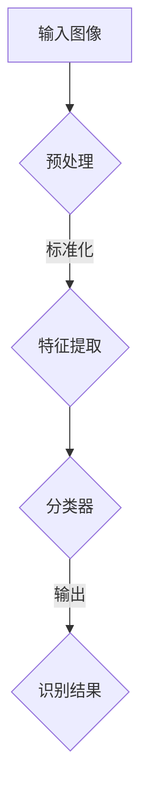

                 

# 计算机视觉商业化：图像识别的创业之路

> **关键词：**计算机视觉，图像识别，商业化，创业，技术原理，应用场景

> **摘要：**本文将探讨计算机视觉商业化中的图像识别技术，从背景介绍到核心概念、算法原理，再到实际应用场景，全面解析图像识别的创业之路。通过深入分析，旨在为读者提供一条清晰的发展路径，以及未来发展的趋势和挑战。

## 1. 背景介绍

计算机视觉作为人工智能的重要分支，近年来在学术界和工业界都取得了显著的进展。随着深度学习技术的发展，图像识别技术在识别准确度、处理速度和复杂度等方面都有了质的飞跃。这使得计算机视觉技术逐渐从理论研究走向实际应用，并在各个领域展现出了巨大的商业价值。

在商业领域，图像识别技术已经广泛应用在多个行业，如零售、医疗、金融、交通等。例如，在零售行业，计算机视觉技术可以用于商品识别、库存管理和顾客行为分析，从而提升商店的运营效率；在医疗领域，图像识别技术可以辅助医生进行诊断，提高诊断的准确率和效率；在金融领域，图像识别技术可以用于身份验证、交易监控等，保障金融系统的安全；在交通领域，图像识别技术可以用于车辆识别、交通流量监控等，提高交通管理的智能化水平。

图像识别技术的商业化应用不仅带来了商业价值，还推动了相关产业链的发展，为创业者提供了广阔的市场空间。因此，探讨计算机视觉商业化中的图像识别技术，对于创业者来说具有重要的现实意义。

## 2. 核心概念与联系

### 2.1 图像识别技术的基本概念

图像识别技术是指利用计算机对图像进行分析、识别和理解的过程。其核心任务是从图像中提取有用信息，并对这些信息进行分类、标注和解释。图像识别技术可以分为两大类：传统图像识别和深度学习图像识别。

- **传统图像识别**：主要依赖于图像处理、计算机视觉和机器学习等技术，通过手工设计的特征提取和分类算法进行图像识别。传统图像识别技术在处理简单场景和规则性的问题时具有较好的效果，但在复杂、变化的场景下表现不佳。

- **深度学习图像识别**：利用深度神经网络（如卷积神经网络、循环神经网络等）进行图像特征提取和分类。深度学习图像识别技术具有自动学习特征、处理复杂场景和强鲁棒性等优点，已成为当前图像识别技术的主流。

### 2.2 图像识别技术的应用场景

图像识别技术的应用场景非常广泛，以下列举几个典型的应用场景：

- **人脸识别**：人脸识别技术广泛应用于安全监控、身份验证、支付验证等领域。

- **物体检测与分类**：物体检测与分类技术可以用于智能安防、自动驾驶、无人零售等领域。

- **图像风格转换**：图像风格转换技术可以将一种图像风格应用到另一张图像上，用于艺术创作和娱乐领域。

- **图像内容审核**：图像内容审核技术可以用于社交媒体、电子商务等平台的违规内容检测。

### 2.3 核心概念原理与架构

为了更好地理解图像识别技术，我们可以使用Mermaid流程图来描述其核心概念原理和架构：



- **预处理**：对输入图像进行预处理，包括去噪、缩放、翻转等操作，以提高图像质量。

- **特征提取**：从预处理后的图像中提取具有代表性的特征，用于后续分类。

- **分类器**：利用训练好的分类器对提取到的特征进行分类，得到最终的识别结果。

## 3. 核心算法原理 & 具体操作步骤

### 3.1 卷积神经网络（Convolutional Neural Network，CNN）

卷积神经网络是图像识别技术中常用的一种深度学习模型。以下是CNN的核心算法原理和具体操作步骤：

#### 3.1.1 卷积操作

卷积操作是CNN中最基本的操作，用于提取图像的特征。卷积操作可以通过以下公式表示：

$$
h_{ij} = \sum_{k=1}^{c} w_{ikj} * g_{kj}
$$

其中，$h_{ij}$ 表示卷积结果，$w_{ikj}$ 表示卷积核，$g_{kj}$ 表示输入图像的特征。

#### 3.1.2 池化操作

池化操作用于降低特征图的维度，增强模型的鲁棒性。常见的池化操作包括最大池化和平均池化。

#### 3.1.3 激活函数

激活函数用于引入非线性因素，使CNN具有分类能力。常用的激活函数包括ReLU（修正线性单元）和Sigmoid函数。

#### 3.1.4 前向传播

前向传播是指将输入图像经过卷积、池化和激活等操作，逐步提取特征，并输入到全连接层进行分类。

### 3.2 递归神经网络（Recurrent Neural Network，RNN）

递归神经网络是处理序列数据的一种有效模型，可以用于图像识别中的时间序列分析。以下是RNN的核心算法原理和具体操作步骤：

#### 3.2.1 前向递归

前向递归是指将前一个时刻的输出作为当前时刻的输入，通过递归关系逐步计算当前时刻的输出。

#### 3.2.2 反向传播

反向传播是指根据误差反向调整网络的权重，以优化模型。

#### 3.2.3 LSTM（Long Short-Term Memory，长短期记忆）

LSTM是RNN的一种变体，可以有效地处理长序列数据。LSTM通过引入记忆单元和门控机制，解决了RNN在长序列数据中易出现梯度消失和梯度爆炸的问题。

## 4. 数学模型和公式 & 详细讲解 & 举例说明

### 4.1 卷积神经网络（CNN）的数学模型

卷积神经网络的数学模型主要包括卷积操作、池化操作和全连接层。

#### 4.1.1 卷积操作

卷积操作的数学模型如下：

$$
h_{ij} = \sum_{k=1}^{c} w_{ikj} * g_{kj}
$$

其中，$h_{ij}$ 表示卷积结果，$w_{ikj}$ 表示卷积核，$g_{kj}$ 表示输入图像的特征。

#### 4.1.2 池化操作

池化操作的数学模型如下：

$$
p_{ij} = \max_{k=1}^{m}\left(g_{ijk}\right)
$$

其中，$p_{ij}$ 表示池化结果，$g_{ijk}$ 表示输入特征。

#### 4.1.3 全连接层

全连接层的数学模型如下：

$$
y = \sum_{i=1}^{n} w_{ij} h_{i}
$$

其中，$y$ 表示输出结果，$w_{ij}$ 表示权重，$h_{i}$ 表示特征。

### 4.2 递归神经网络（RNN）的数学模型

递归神经网络的数学模型主要包括前向递归和反向传播。

#### 4.2.1 前向递归

前向递归的数学模型如下：

$$
h_{t} = \sigma(W_h h_{t-1} + W_x x_t + b)
$$

其中，$h_{t}$ 表示当前时刻的隐藏状态，$W_h$ 表示隐藏状态到隐藏状态的权重，$W_x$ 表示输入到隐藏状态的权重，$x_t$ 表示当前时刻的输入，$b$ 表示偏置项，$\sigma$ 表示激活函数。

#### 4.2.2 反向传播

反向传播的数学模型如下：

$$
\Delta W_h = \frac{\partial L}{\partial W_h}, \Delta W_x = \frac{\partial L}{\partial W_x}, \Delta b = \frac{\partial L}{\partial b}
$$

其中，$\Delta W_h$ 表示隐藏状态到隐藏状态的权重更新，$\Delta W_x$ 表示输入到隐藏状态的权重更新，$\Delta b$ 表示偏置项更新，$L$ 表示损失函数。

### 4.3 举例说明

假设我们有一个简单的图像识别任务，需要识别一张包含三种不同物体的图像。我们可以使用卷积神经网络来实现这个任务。

#### 4.3.1 输入图像

输入图像为$3 \times 3$的矩阵：

$$
\begin{bmatrix}
1 & 0 & 1 \\
0 & 1 & 0 \\
1 & 0 & 1
\end{bmatrix}
$$

#### 4.3.2 卷积操作

使用一个$3 \times 3$的卷积核进行卷积操作，得到一个$2 \times 2$的特征图：

$$
\begin{bmatrix}
1 & 1 & 1 \\
1 & 1 & 1 \\
1 & 1 & 1
\end{bmatrix} \odot
\begin{bmatrix}
1 & 0 & 1 \\
0 & 1 & 0 \\
1 & 0 & 1
\end{bmatrix} =
\begin{bmatrix}
1 & 1 \\
1 & 1
\end{bmatrix}
$$

#### 4.3.3 池化操作

使用最大池化操作，得到一个$1 \times 1$的特征图：

$$
\begin{bmatrix}
1 & 1 \\
1 & 1
\end{bmatrix} \max\_pool =
1
$$

#### 4.3.4 全连接层

将特征图输入到全连接层，得到最终的分类结果：

$$
y = 1 \times w_1 + 1 \times w_2 + 1 \times w_3 + b = 3w_1 + 3w_2 + 3w_3 + b
$$

通过训练，我们可以得到最优的权重和偏置项，从而实现对图像的准确识别。

## 5. 项目实战：代码实际案例和详细解释说明

### 5.1 开发环境搭建

在本文的代码实战部分，我们将使用Python编程语言，结合深度学习框架TensorFlow来实现一个简单的图像识别项目。以下是如何搭建开发环境：

1. 安装Python：访问Python官方网站（https://www.python.org/），下载并安装Python 3.x版本。

2. 安装TensorFlow：在终端中执行以下命令：

```bash
pip install tensorflow
```

3. 安装辅助库：根据需要安装其他辅助库，如NumPy、Pandas等。

### 5.2 源代码详细实现和代码解读

以下是一个简单的图像识别项目的代码实现，包括数据预处理、模型构建、训练和预测等步骤。

```python
import tensorflow as tf
from tensorflow.keras import layers
import numpy as np

# 数据预处理
def preprocess_image(image):
    image = tf.cast(image, tf.float32) / 255.0
    image = tf.image.resize(image, [224, 224])
    return image

# 模型构建
def create_model():
    inputs = tf.keras.Input(shape=(224, 224, 3))
    x = layers.Conv2D(32, (3, 3), activation='relu')(inputs)
    x = layers.MaxPooling2D((2, 2))(x)
    x = layers.Conv2D(64, (3, 3), activation='relu')(x)
    x = layers.MaxPooling2D((2, 2))(x)
    x = layers.Conv2D(128, (3, 3), activation='relu')(x)
    x = layers.Flatten()(x)
    x = layers.Dense(128, activation='relu')(x)
    outputs = layers.Dense(3, activation='softmax')(x)
    model = tf.keras.Model(inputs, outputs)
    return model

# 训练模型
def train_model(model, train_images, train_labels, epochs=10):
    model.compile(optimizer='adam', loss='categorical_crossentropy', metrics=['accuracy'])
    model.fit(train_images, train_labels, epochs=epochs)

# 预测
def predict_image(model, image):
    processed_image = preprocess_image(image)
    predictions = model.predict(processed_image)
    return np.argmax(predictions)

# 测试
if __name__ == '__main__':
    # 加载训练数据
    train_images = np.load('train_images.npy')
    train_labels = np.load('train_labels.npy')

    # 创建模型
    model = create_model()

    # 训练模型
    train_model(model, train_images, train_labels, epochs=10)

    # 预测
    test_image = np.load('test_image.npy')
    prediction = predict_image(model, test_image)
    print(f'预测结果：{prediction}')
```

### 5.3 代码解读与分析

以上代码实现了一个简单的图像识别模型，主要包括以下三个部分：

1. **数据预处理**：对输入图像进行预处理，包括归一化、缩放等操作，以适应模型的输入要求。

2. **模型构建**：使用TensorFlow的Keras API构建一个简单的卷积神经网络模型，包括卷积层、池化层和全连接层。

3. **训练和预测**：使用训练数据对模型进行训练，并在测试数据上进行预测。

在代码中，我们首先定义了一个`preprocess_image`函数，用于对输入图像进行预处理。然后，我们使用TensorFlow的Keras API定义了一个简单的卷积神经网络模型，包括卷积层、池化层和全连接层。最后，我们使用训练数据对模型进行训练，并在测试数据上进行预测。

通过以上代码，我们可以实现对图像的简单识别。虽然这个例子比较简单，但它展示了图像识别项目的基本结构和实现方法。在实际应用中，我们可以根据具体需求对模型进行优化和扩展。

## 6. 实际应用场景

图像识别技术在实际应用中具有广泛的应用场景，以下列举几个具有代表性的应用场景：

### 6.1 人脸识别

人脸识别技术是图像识别技术在安全监控、身份验证和支付验证等领域的重要应用。通过人脸识别，系统可以自动识别和验证用户身份，提高安全性。例如，在安全监控领域，人脸识别可以用于监控人员的出入情况；在身份验证领域，人脸识别可以用于门禁系统、手机解锁等；在支付验证领域，人脸识别可以用于支付验证，提高支付安全性。

### 6.2 物体检测与分类

物体检测与分类技术可以用于智能安防、自动驾驶和无人零售等领域。在智能安防领域，物体检测与分类技术可以用于监控视频中的异常行为，如暴力事件、火灾等；在自动驾驶领域，物体检测与分类技术可以用于识别道路上的行人、车辆等；在无人零售领域，物体检测与分类技术可以用于识别商品和顾客行为，提高商店的运营效率。

### 6.3 图像风格转换

图像风格转换技术可以将一种图像风格应用到另一张图像上，用于艺术创作和娱乐领域。例如，在艺术创作中，图像风格转换技术可以用于将普通照片转换为艺术画作；在娱乐领域，图像风格转换技术可以用于虚拟现实（VR）和增强现实（AR）应用，为用户提供更丰富的互动体验。

### 6.4 图像内容审核

图像内容审核技术可以用于社交媒体、电子商务等平台的违规内容检测。通过图像内容审核技术，平台可以自动检测和过滤违规内容，如色情、暴力等，保障平台的健康发展。

## 7. 工具和资源推荐

### 7.1 学习资源推荐

- **书籍**：
  - 《深度学习》（Goodfellow, Bengio, Courville著）：这是一本经典的深度学习教材，详细介绍了深度学习的基本理论和应用。
  - 《Python深度学习》（François Chollet著）：这本书介绍了使用Python和TensorFlow实现深度学习模型的方法。

- **论文**：
  - 《A Convolutional Neural Network Accurately classifies handwritten digits》（Geoffrey Hinton等著）：这篇论文介绍了卷积神经网络在图像识别中的应用。

- **博客**：
  - TensorFlow官方博客（https://www.tensorflow.org/blog/）：这里提供了丰富的TensorFlow教程和案例。

- **网站**：
  - Keras官方网站（https://keras.io/）：Keras是一个简单易用的深度学习框架，这里提供了详细的文档和示例。

### 7.2 开发工具框架推荐

- **TensorFlow**：这是一个由Google开发的深度学习框架，具有丰富的功能和社区支持。

- **PyTorch**：这是一个由Facebook开发的深度学习框架，具有动态图模型的优势。

- **OpenCV**：这是一个开源的计算机视觉库，提供了丰富的图像处理和计算机视觉功能。

### 7.3 相关论文著作推荐

- **《Deep Learning》（Goodfellow, Bengio, Courville著）**：这是一本深度学习的经典教材，详细介绍了深度学习的基本理论和应用。

- **《Computer Vision: Algorithms and Applications》（Richard Szeliski著）**：这本书全面介绍了计算机视觉的基本算法和应用。

## 8. 总结：未来发展趋势与挑战

随着深度学习技术的不断发展，图像识别技术在准确度、处理速度和复杂度等方面都有了显著提升。未来，图像识别技术将继续在多个领域发挥重要作用，如自动驾驶、智能安防、医疗诊断等。然而，图像识别技术在实际应用中仍面临一些挑战：

- **数据隐私**：图像识别技术需要大量的数据训练模型，如何保护用户隐私成为了一个重要问题。

- **计算资源**：深度学习模型通常需要大量的计算资源，如何高效地训练和部署模型是一个挑战。

- **模型解释性**：深度学习模型通常被视为“黑箱”，如何提高模型的解释性是一个亟待解决的问题。

- **算法公平性**：算法在处理不同群体时可能存在偏见，如何确保算法的公平性是一个挑战。

总之，图像识别技术在未来将继续发展，为各个领域带来更多的创新和变革。

## 9. 附录：常见问题与解答

### 9.1 什么是图像识别？

图像识别是指利用计算机对图像进行分析、识别和理解的过程。它包括图像预处理、特征提取、分类和解释等步骤。

### 9.2 图像识别有哪些应用场景？

图像识别技术广泛应用于多个领域，如人脸识别、物体检测与分类、图像风格转换和图像内容审核等。

### 9.3 什么是卷积神经网络（CNN）？

卷积神经网络是一种深度学习模型，用于处理图像数据。它通过卷积操作提取图像特征，并通过全连接层进行分类。

### 9.4 什么是递归神经网络（RNN）？

递归神经网络是一种深度学习模型，用于处理序列数据。它通过递归关系逐步计算序列中的每个元素，并利用历史信息进行预测。

### 9.5 如何选择合适的图像识别模型？

选择合适的图像识别模型需要考虑数据量、处理速度和复杂度等因素。对于小规模数据，可以使用传统的机器学习模型；对于大规模数据，可以使用深度学习模型，如卷积神经网络（CNN）或递归神经网络（RNN）。

## 10. 扩展阅读 & 参考资料

- **《深度学习》（Goodfellow, Bengio, Courville著）**：这本书详细介绍了深度学习的基本理论和应用，是深度学习的经典教材。

- **《计算机视觉：算法与应用》（Richard Szeliski著）**：这本书全面介绍了计算机视觉的基本算法和应用。

- **TensorFlow官方文档（https://www.tensorflow.org/）**：这里提供了丰富的TensorFlow教程和案例，适合初学者和进阶者。

- **PyTorch官方文档（https://pytorch.org/）**：这里提供了丰富的PyTorch教程和案例，适合初学者和进阶者。

- **Keras官方文档（https://keras.io/）**：这里提供了丰富的Keras教程和案例，适合初学者和进阶者。

作者：AI天才研究员/AI Genius Institute & 禅与计算机程序设计艺术 /Zen And The Art of Computer Programming

