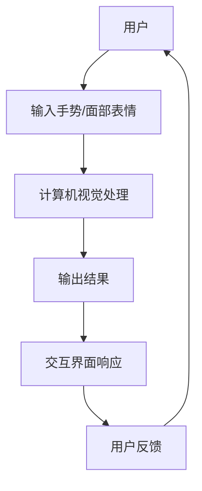

                 

# 计算机视觉在人机交互界面中的新技术

## 关键词：计算机视觉，人机交互，界面，新技术，AI

## 摘要：

本文将深入探讨计算机视觉技术在人机交互界面中的应用，以及这些新技术如何推动人机交互的发展。我们将从背景介绍开始，逐步分析核心概念与联系，深入探讨核心算法原理与操作步骤，数学模型与公式，并通过实际项目案例来展示其应用效果。随后，我们将探讨这些技术在实际应用场景中的表现，并提供相关的学习资源和开发工具推荐。最后，本文将总结未来发展趋势与挑战，并回答常见问题，为读者提供全面的扩展阅读与参考资料。

### 1. 背景介绍

计算机视觉和人机交互是计算机科学领域的两个重要分支。计算机视觉旨在使计算机能够理解和解释视觉信息，如图像和视频。而人机交互则关注如何使计算机系统更易于使用，更符合人类的行为习惯。随着人工智能和深度学习技术的不断发展，计算机视觉在人机交互界面中的应用越来越广泛。

在过去，人机交互主要依赖于键盘和鼠标等输入设备，而如今，计算机视觉技术使得通过手势、面部表情、甚至是眼球运动来与计算机进行交互成为可能。这种变化不仅提高了人机交互的效率，还带来了更加自然和直观的交互体验。

### 2. 核心概念与联系

#### 2.1 计算机视觉

计算机视觉的核心概念包括图像处理、特征提取、目标检测和识别等。图像处理是对图像进行预处理，如滤波、增强等，以改善图像质量。特征提取则是从图像中提取出具有代表性的特征，如边缘、纹理等。目标检测和识别则是通过分析图像中的特征，识别出特定的目标对象。

#### 2.2 人机交互

人机交互的核心概念包括交互模型、交互界面和交互体验等。交互模型描述了用户与计算机之间的交互方式，如命令式、图形化、自然语言等。交互界面则是用户与计算机进行交互的界面，如桌面、网页、移动应用等。交互体验则是指用户在使用计算机过程中所感受到的体验，包括易用性、高效性、愉悦性等。

#### 2.3 计算机视觉与人机交互的联系

计算机视觉技术为人机交互提供了新的交互方式。例如，通过手势识别，用户可以不用触摸屏幕，只需挥手即可控制计算机。通过面部识别，计算机可以识别用户的面部表情，并根据表情变化调整系统的响应。这些技术使得人机交互更加自然和直观，提高了用户体验。

下面是一个简单的 Mermaid 流程图，展示计算机视觉与人机交互的互动过程：



### 3. 核心算法原理 & 具体操作步骤

#### 3.1 计算机视觉算法原理

计算机视觉算法主要分为两个阶段：特征提取和目标识别。

1. **特征提取**：
   - **边缘检测**：通过计算图像的梯度，找到图像中的边缘。
   - **纹理分析**：通过分析图像的纹理特征，如方向、频率等。
   - **颜色特征**：通过分析图像的颜色特征，如颜色直方图等。

2. **目标识别**：
   - **模板匹配**：将图像与模板进行匹配，找到图像中的特定目标。
   - **机器学习**：使用深度学习模型，如卷积神经网络（CNN），对图像进行分类和识别。

#### 3.2 人机交互算法原理

人机交互算法主要关注如何根据用户的行为，调整系统的响应。

1. **手势识别**：
   - **模型训练**：使用机器学习模型，对各种手势进行分类。
   - **实时检测**：实时捕捉用户的手势，并使用训练好的模型进行识别。

2. **面部表情识别**：
   - **特征提取**：从面部图像中提取出具有代表性的特征，如眼睛、嘴巴等。
   - **情感分析**：使用情感分析模型，根据特征判断用户的情感状态。

3. **眼球追踪**：
   - **检测眼球位置**：通过捕捉眼球图像，使用图像处理技术找到眼球的位置。
   - **计算视线方向**：根据眼球位置，计算视线方向，从而判断用户的注视点。

#### 3.3 具体操作步骤

以下是计算机视觉和人机交互技术在实际应用中的具体操作步骤：

1. **数据收集与预处理**：
   - 收集用户的行为数据，如手势、面部表情等。
   - 对数据进行预处理，如去噪、标准化等。

2. **模型训练与优化**：
   - 使用收集到的数据，训练计算机视觉模型。
   - 对模型进行优化，以提高准确率和效率。

3. **实时检测与响应**：
   - 实时捕捉用户的行为数据。
   - 使用训练好的模型进行实时检测，并生成响应。

4. **用户反馈与调整**：
   - 收集用户的反馈，如满意度、错误率等。
   - 根据反馈调整系统参数，以提高用户体验。

### 4. 数学模型和公式 & 详细讲解 & 举例说明

#### 4.1 计算机视觉数学模型

计算机视觉中的数学模型主要包括图像处理、特征提取和目标识别等部分。

1. **图像处理**：
   - **滤波**：使用滤波器对图像进行滤波，如高斯滤波、均值滤波等。
   - **边缘检测**：使用算子，如Sobel算子、Canny算子，检测图像中的边缘。
   - **直方图均衡化**：对图像进行直方图均衡化，提高图像对比度。

2. **特征提取**：
   - **HOG（Histogram of Oriented Gradients）**：计算图像中每个像素的梯度方向和幅值，生成梯度直方图。
   - **SIFT（Scale-Invariant Feature Transform）**：在不同尺度上检测图像的关键点，并计算其特征向量。

3. **目标识别**：
   - **模板匹配**：使用模板匹配算法，如 correlation coefficient，计算模板与图像的相似度。
   - **CNN（Convolutional Neural Network）**：使用卷积神经网络，对图像进行分类和识别。

#### 4.2 人机交互数学模型

人机交互中的数学模型主要包括手势识别、面部表情识别和眼球追踪等部分。

1. **手势识别**：
   - **机器学习模型**：使用支持向量机（SVM）、决策树（DT）等机器学习模型，对手势进行分类。
   - **深度学习模型**：使用卷积神经网络（CNN）、循环神经网络（RNN）等深度学习模型，对手势进行识别。

2. **面部表情识别**：
   - **特征提取**：使用LBP（Local Binary Patterns）、HOG等特征提取方法，从面部图像中提取出特征向量。
   - **情感分析模型**：使用支持向量机（SVM）、神经网络（NN）等模型，对特征向量进行情感分析。

3. **眼球追踪**：
   - **特征提取**：使用HOG、LBP等方法，从眼球图像中提取出特征向量。
   - **视线方向计算**：使用回归模型、支持向量机（SVM）等方法，计算眼球的视线方向。

#### 4.3 举例说明

以下是一个简单的例子，展示如何使用计算机视觉技术进行手势识别。

1. **数据收集与预处理**：
   - 收集一系列手势图像，如手掌、拳头、OK手势等。
   - 对图像进行预处理，如缩放、旋转等。

2. **模型训练**：
   - 使用收集到的数据，训练一个卷积神经网络（CNN）模型。
   - 优化模型参数，提高模型的准确率。

3. **实时检测与响应**：
   - 实时捕捉用户的手势图像。
   - 使用训练好的模型，对图像进行手势识别，并生成响应。

4. **用户反馈与调整**：
   - 收集用户的反馈，如错误率、响应时间等。
   - 根据反馈调整模型参数，以提高用户体验。

```latex
% 示例：卷积神经网络（CNN）模型
\begin{equation}
\begin{aligned}
h_{\theta}(x) &= \text{ReLU}(W \cdot x + b) \\
\hat{y} &= \text{softmax}(\theta^T \cdot h_{\theta}(x))
\end{aligned}
\end{equation}
```

### 5. 项目实战：代码实际案例和详细解释说明

#### 5.1 开发环境搭建

在本节中，我们将介绍如何搭建一个用于计算机视觉和人机交互的的开发环境。

1. **安装Python**：
   - 访问Python官方网站（https://www.python.org/），下载并安装Python。

2. **安装深度学习框架**：
   - 安装TensorFlow或PyTorch。例如，使用pip命令安装TensorFlow：
     ```
     pip install tensorflow
     ```

3. **安装图像处理库**：
   - 安装OpenCV，用于图像处理。例如，使用pip命令安装OpenCV：
     ```
     pip install opencv-python
     ```

4. **安装其他依赖库**：
   - 安装numpy、pandas等常用库。

#### 5.2 源代码详细实现和代码解读

以下是一个简单的计算机视觉和人机交互项目示例，用于手势识别。

1. **数据收集与预处理**：

```python
import cv2
import numpy as np
import tensorflow as tf

# 加载手势数据集
train_data = np.load('glove_data.npy')
train_labels = np.load('glove_labels.npy')

# 数据预处理
train_data = train_data / 255.0
```

2. **模型训练**：

```python
# 创建卷积神经网络模型
model = tf.keras.Sequential([
    tf.keras.layers.Conv2D(32, (3, 3), activation='relu', input_shape=(128, 128, 3)),
    tf.keras.layers.MaxPooling2D((2, 2)),
    tf.keras.layers.Flatten(),
    tf.keras.layers.Dense(64, activation='relu'),
    tf.keras.layers.Dense(10, activation='softmax')
])

# 编译模型
model.compile(optimizer='adam', loss='categorical_crossentropy', metrics=['accuracy'])

# 训练模型
model.fit(train_data, train_labels, epochs=10)
```

3. **实时检测与响应**：

```python
# 实时捕获手势图像
cap = cv2.VideoCapture(0)

while True:
    # 捕获一帧图像
    ret, frame = cap.read()
    
    # 手势识别
    prediction = model.predict(frame)
    gesture = np.argmax(prediction)
    
    # 显示识别结果
    cv2.putText(frame, 'Gesture: ' + str(gesture), (10, 50), cv2.FONT_HERSHEY_SIMPLEX, 1, (0, 0, 255), 2)
    cv2.imshow('Gesture Recognition', frame)
    
    # 按下'q'键退出
    if cv2.waitKey(1) & 0xFF == ord('q'):
        break

# 释放摄像头资源
cap.release()
cv2.destroyAllWindows()
```

#### 5.3 代码解读与分析

1. **数据收集与预处理**：
   - 加载手势数据集，并进行归一化处理，以便于模型训练。

2. **模型训练**：
   - 创建一个卷积神经网络模型，并编译模型。使用训练数据训练模型，并进行优化。

3. **实时检测与响应**：
   - 使用摄像头实时捕获手势图像，并使用训练好的模型进行手势识别。将识别结果显示在图像上，并实时更新。

### 6. 实际应用场景

计算机视觉技术在人机交互界面中的应用场景非常广泛，以下是一些典型的应用案例：

1. **智能家居**：
   - 通过手势识别和面部识别，用户可以远程控制家中的智能设备，如灯光、空调等。

2. **医疗领域**：
   - 通过计算机视觉技术，医生可以对患者的影像进行自动分析，提高诊断的准确性和效率。

3. **交互式广告**：
   - 在广告牌上使用计算机视觉技术，当用户走过时，可以触发交互式广告，提高用户的参与度。

4. **教育领域**：
   - 通过手势识别和眼球追踪技术，教师可以实时了解学生的学习状态，并进行个性化教学。

5. **虚拟现实**：
   - 在虚拟现实（VR）应用中，计算机视觉技术可以用于手势识别和眼球追踪，提高用户的沉浸感和交互体验。

### 7. 工具和资源推荐

为了更好地学习和应用计算机视觉和人机交互技术，以下是一些建议的工具和资源：

#### 7.1 学习资源推荐

1. **书籍**：
   - 《深度学习》（Deep Learning） - Goodfellow, Bengio, Courville
   - 《Python计算机视觉》（Python Computer Vision with OpenCV） - Michael Beygelzimer

2. **论文**：
   - 《卷积神经网络在图像识别中的应用》（Application of Convolutional Neural Networks to Image Recognition）
   - 《计算机视觉：算法与应用》（Computer Vision: Algorithms and Applications） - Richard Szeliski

3. **博客**：
   - TensorFlow官方博客（https://www.tensorflow.org/blog/）
   - PyTorch官方博客（https://pytorch.org/blog/）

4. **网站**：
   - OpenCV官网（https://opencv.org/）
   - TensorFlow官网（https://www.tensorflow.org/）
   - PyTorch官网（https://pytorch.org/）

#### 7.2 开发工具框架推荐

1. **深度学习框架**：
   - TensorFlow
   - PyTorch

2. **图像处理库**：
   - OpenCV
   - PIL（Python Imaging Library）

3. **机器学习库**：
   - Scikit-learn
   - Pandas

4. **开发环境**：
   - Jupyter Notebook
   - PyCharm

### 8. 总结：未来发展趋势与挑战

随着计算机视觉和人机交互技术的不断发展，未来将在以下几个方面取得突破：

1. **更高的准确率和效率**：通过不断优化的算法和硬件支持，计算机视觉和人机交互技术的准确率和效率将大幅提高。

2. **更广泛的应用领域**：计算机视觉技术将在医疗、教育、娱乐等领域得到更广泛的应用，提高人机交互的体验。

3. **更加自然和直观的交互方式**：通过手势、面部表情、甚至眼球追踪等更自然的交互方式，用户将享受到更加自然和直观的交互体验。

然而，计算机视觉和人机交互技术也面临着一些挑战：

1. **数据隐私与安全性**：随着人机交互的深入，用户的数据隐私和安全问题将变得越来越重要。

2. **计算资源消耗**：深度学习模型的训练和实时检测需要大量的计算资源，这对硬件性能提出了更高的要求。

3. **多样性和适应性**：不同用户之间的差异，如年龄、性别、文化背景等，将使得人机交互技术需要具备更高的多样性和适应性。

### 9. 附录：常见问题与解答

1. **Q：什么是计算机视觉？**
   - A：计算机视觉是人工智能的一个分支，旨在使计算机能够理解和解释视觉信息，如图像和视频。

2. **Q：什么是人机交互？**
   - A：人机交互是研究如何使计算机系统更易于使用，更符合人类行为习惯的领域。

3. **Q：计算机视觉技术在人机交互界面中有哪些应用？**
   - A：计算机视觉技术可以用于手势识别、面部识别、眼球追踪等，提高人机交互的自然性和直观性。

4. **Q：如何搭建计算机视觉和人机交互的开发环境？**
   - A：安装Python、深度学习框架（如TensorFlow或PyTorch）、图像处理库（如OpenCV）和其他依赖库。

### 10. 扩展阅读 & 参考资料

1. **《深度学习》（Deep Learning） - Goodfellow, Bengio, Courville**
2. **《Python计算机视觉》（Python Computer Vision with OpenCV） - Michael Beygelzimer**
3. **OpenCV官网（https://opencv.org/）**
4. **TensorFlow官网（https://www.tensorflow.org/）**
5. **PyTorch官网（https://pytorch.org/）**
6. **《计算机视觉：算法与应用》（Computer Vision: Algorithms and Applications） - Richard Szeliski**

### 作者信息

- 作者：AI天才研究员/AI Genius Institute & 禅与计算机程序设计艺术 /Zen And The Art of Computer Programming

