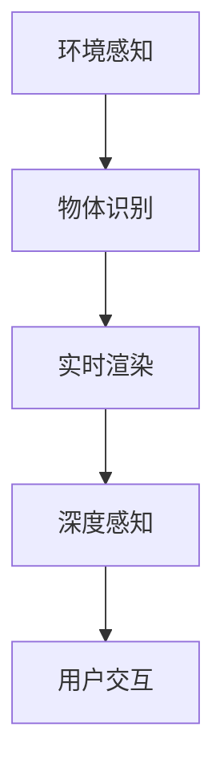
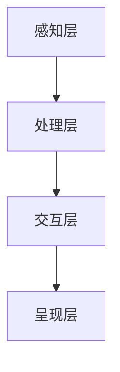

                 

# 计算机视觉在增强现实游戏中的创新应用

## 关键词
- 计算机视觉
- 增强现实
- 游戏开发
- 实时渲染
- 深度感知

## 摘要
本文将探讨计算机视觉在增强现实（AR）游戏中的创新应用。通过详细分析AR技术的核心原理和计算机视觉算法，我们将了解如何将计算机视觉技术与游戏开发相结合，创造出更加真实、互动和沉浸式的游戏体验。文章将涵盖从环境感知到物体识别、从实时渲染到深度感知的各个关键环节，并提供实际项目案例和开发建议，以帮助读者全面理解并掌握计算机视觉在AR游戏中的应用。

## 目录

1. 背景介绍
   1.1 增强现实游戏的发展历程
   1.2 计算机视觉技术的发展趋势
   1.3 增强现实与计算机视觉的结合

2. 核心概念与联系
   2.1 增强现实技术基础
   2.2 计算机视觉原理
   2.3 增强现实与计算机视觉的融合架构
   2.4 Mermaid 流程图展示

3. 核心算法原理与具体操作步骤
   3.1 环境感知算法
   3.2 物体识别算法
   3.3 实时渲染算法
   3.4 深度感知算法

4. 数学模型和公式与详细讲解与举例说明
   4.1 特征提取与匹配
   4.2 模型训练与优化
   4.3 算法性能评估

5. 项目实战：代码实际案例与详细解释说明
   5.1 开发环境搭建
   5.2 源代码详细实现与代码解读
   5.3 代码解读与分析

6. 实际应用场景
   6.1 游戏互动性提升
   6.2 游戏沉浸感增强
   6.3 游戏创新性探索

7. 工具和资源推荐
   7.1 学习资源推荐
   7.2 开发工具框架推荐
   7.3 相关论文著作推荐

8. 总结：未来发展趋势与挑战

9. 附录：常见问题与解答

10. 扩展阅读与参考资料

## 1. 背景介绍

### 1.1 增强现实游戏的发展历程

增强现实（AR）游戏作为一种新兴的游戏形式，近年来在全球范围内迅速崛起。从最早的简单AR效果到如今高度复杂的AR游戏，这一领域的发展可谓日新月异。早期AR游戏的代表作品如《Ingress》和《Pokémon Go》，通过在现实世界中叠加虚拟对象，为玩家带来了全新的游戏体验。随着技术的进步，AR游戏逐渐开始融合更复杂的交互元素和更加逼真的视觉效果。

在增强现实游戏的发展过程中，计算机视觉技术的应用起到了至关重要的作用。早期的AR游戏主要依赖于预定义的图像识别标记，这些标记通过摄像头捕捉后，被用于叠加虚拟对象。然而，这种方法的局限性较大，难以实现真正的交互性和动态性。

随着深度学习算法和计算机视觉技术的成熟，AR游戏开始利用环境感知和物体识别技术，使虚拟对象与现实世界更加无缝地融合。例如，基于深度学习的场景分割和物体检测算法，使得AR游戏能够实时感知周围环境并识别其中的物体，从而实现更加真实和互动的游戏体验。

### 1.2 计算机视觉技术的发展趋势

计算机视觉作为人工智能的一个重要分支，近年来取得了飞速的发展。随着深度学习技术的引入，计算机视觉在图像识别、目标检测、场景分割等领域都取得了显著的成果。以下是计算机视觉技术的一些重要发展趋势：

- **深度学习算法的应用**：深度学习算法，尤其是卷积神经网络（CNN）在图像处理任务中表现出色。通过训练大规模的神经网络模型，计算机视觉系统可以自动提取图像特征并进行复杂的任务，如人脸识别、物体分类等。

- **实时处理能力的提升**：随着硬件性能的不断提升，计算机视觉算法的实时处理能力得到了显著提高。这对于需要实时交互和响应的增强现实游戏至关重要。

- **跨模态融合**：计算机视觉不再局限于二维图像的处理，开始与其他模态（如语音、触觉）进行融合，为增强现实游戏带来更加丰富的交互体验。

- **边缘计算与云计算的结合**：边缘计算和云计算的结合，使得计算机视觉算法可以在终端设备和云端之间进行高效的数据处理和模型部署，为增强现实游戏提供更强大的计算能力。

### 1.3 增强现实与计算机视觉的结合

增强现实（AR）和计算机视觉的结合，为游戏开发带来了前所未有的创新和可能性。AR技术通过将虚拟内容叠加到现实世界中，使得游戏场景更加丰富和真实；而计算机视觉技术则为AR游戏提供了感知和识别现实世界的能力，使得游戏与现实世界之间的交互更加自然和无缝。

以下是增强现实与计算机视觉结合的一些核心方面：

- **环境感知**：通过计算机视觉算法，AR游戏可以实时感知和解析周围环境，从而实现虚拟对象与环境的自然融合。

- **物体识别**：计算机视觉技术可以帮助AR游戏识别现实世界中的物体，使虚拟对象能够准确地叠加在目标物体上，增强游戏的互动性和沉浸感。

- **实时渲染**：计算机视觉与实时渲染技术的结合，使得AR游戏能够实时渲染虚拟对象，为玩家带来流畅的游戏体验。

- **深度感知**：通过深度学习算法，AR游戏可以感知和测量现实世界中的三维空间信息，为游戏中的交互提供更加精准和自然的反馈。

通过以上结合，增强现实游戏不仅能够提供更加真实和沉浸式的体验，还可以通过创新性的游戏玩法，吸引和留住玩家。

### 1.4 Mermaid 流程图展示

为了更好地理解增强现实与计算机视觉的融合过程，我们可以通过Mermaid流程图来展示其核心环节。以下是一个简化的流程图示例：



这个流程图展示了从环境感知到深度感知的各个环节，以及用户与游戏系统之间的交互。通过这个流程，我们可以看到计算机视觉技术在增强现实游戏中的关键作用。

## 2. 核心概念与联系

### 2.1 增强现实技术基础

增强现实（AR）是一种将虚拟信息叠加到真实环境中的技术。AR系统通常包括以下几个核心组成部分：

- **显示设备**：用于将虚拟内容叠加到真实世界中，常见的显示设备包括智能手机、平板电脑和头戴式显示器等。

- **摄像头**：用于捕捉现实世界的图像和视频，是AR系统感知环境的重要工具。

- **计算机视觉算法**：用于解析和识别现实世界中的物体和环境，是AR系统的核心处理单元。

- **图像处理技术**：用于对摄像头捕捉到的图像进行预处理，包括增强、滤波和边缘检测等。

- **渲染引擎**：用于实时渲染虚拟内容，并将其叠加到真实世界中。

### 2.2 计算机视觉原理

计算机视觉是人工智能的一个重要分支，旨在使计算机能够“看”懂现实世界。其核心原理包括以下几个方面：

- **图像特征提取**：通过一系列算法提取图像中的关键特征，如边缘、角点、纹理等。

- **目标检测**：利用提取的图像特征，识别和定位图像中的目标物体。

- **场景分割**：将图像分割为不同的区域，以识别不同的物体和环境。

- **姿态估计**：通过分析图像中的特征点，估计物体的空间姿态。

- **深度感知**：利用深度学习算法，感知和测量现实世界中的三维空间信息。

### 2.3 增强现实与计算机视觉的融合架构

增强现实与计算机视觉的融合架构通常包括以下几个层次：

- **感知层**：通过计算机视觉算法实时感知和解析现实世界中的物体和环境。

- **处理层**：对感知层获取的信息进行处理，包括特征提取、目标检测和场景分割等。

- **交互层**：实现用户与虚拟内容的交互，包括虚拟对象的定位、跟踪和渲染等。

- **呈现层**：将处理层生成的虚拟内容叠加到现实世界中，通过显示设备呈现给用户。

### 2.4 Mermaid 流程图展示

为了更好地理解增强现实与计算机视觉的融合架构，我们可以通过Mermaid流程图来展示其核心环节。以下是一个简化的流程图示例：



这个流程图展示了从感知层到呈现层的各个环节，以及各层之间的数据流动和交互。通过这个流程，我们可以看到增强现实与计算机视觉技术的紧密融合。

## 3. 核心算法原理与具体操作步骤

### 3.1 环境感知算法

环境感知是增强现实（AR）游戏的核心技术之一，它使得虚拟对象能够与现实世界无缝融合。环境感知算法通常包括以下步骤：

1. **图像捕获**：通过摄像头实时捕获现实世界的图像或视频流。

2. **预处理**：对捕获的图像进行预处理，包括去噪、增强、滤波等，以提高图像质量和识别效果。

3. **特征提取**：利用图像处理技术提取图像中的关键特征，如边缘、角点、纹理等。

4. **场景分割**：利用提取的特征进行场景分割，将图像划分为不同的区域，以识别不同的物体和环境。

5. **深度估计**：通过分析图像中的特征点，利用立体视觉原理估计场景的深度信息。

6. **虚拟对象定位**：根据深度信息，对虚拟对象进行空间定位，使其与现实世界中的物体对齐。

### 3.2 物体识别算法

物体识别是计算机视觉中的一项基本任务，它使得AR游戏能够识别现实世界中的物体，从而实现更高级的交互功能。物体识别算法通常包括以下步骤：

1. **数据集准备**：收集大量标注好的物体图像作为训练数据集，用于训练物体识别模型。

2. **特征提取**：对训练数据集中的图像进行特征提取，得到图像的特征向量。

3. **模型训练**：利用提取的特征向量训练物体识别模型，如卷积神经网络（CNN）。

4. **模型评估**：在测试数据集上评估模型的性能，调整模型参数以优化识别效果。

5. **实时识别**：在摄像头捕获的图像上应用训练好的模型，实时识别图像中的物体。

### 3.3 实时渲染算法

实时渲染是增强现实（AR）游戏中另一个关键环节，它使得虚拟对象能够以流畅的方式叠加到现实世界中。实时渲染算法通常包括以下步骤：

1. **虚拟对象生成**：根据游戏逻辑生成虚拟对象，包括其几何模型、材质和纹理等。

2. **虚拟对象定位**：根据环境感知算法提供的深度信息和物体识别结果，对虚拟对象进行空间定位。

3. **视图矩阵计算**：计算虚拟对象在摄像头视角下的视图矩阵，以确定其在现实世界中的位置和视角。

4. **光照计算**：根据场景的光照信息计算虚拟对象的照明效果，以增强其视觉效果。

5. **渲染管线**：利用图形渲染管线将虚拟对象渲染到场景中，生成最终的AR图像。

### 3.4 深度感知算法

深度感知是增强现实（AR）游戏中的一项高级技术，它使得虚拟对象能够与现实世界中的物体进行更复杂的交互。深度感知算法通常包括以下步骤：

1. **深度网络训练**：利用深度学习算法训练深度感知网络，以学习如何从二维图像中预测三维深度信息。

2. **实时深度估计**：在摄像头捕获的图像上应用训练好的深度感知网络，实时估计场景的深度信息。

3. **空间调整**：根据深度信息调整虚拟对象的空间位置，以实现更自然和逼真的交互效果。

4. **动态交互**：利用深度感知算法实现虚拟对象与周围环境之间的动态交互，如遮挡处理、碰撞检测等。

## 4. 数学模型和公式与详细讲解与举例说明

### 4.1 特征提取与匹配

在计算机视觉中，特征提取是识别和匹配图像的关键步骤。特征提取的目的是从图像中提取具有独特性的特征点，以便于后续的匹配和识别。常用的特征提取算法包括SIFT（尺度不变特征变换）和SURF（加速稳健特征）。

**SIFT算法**：
SIFT算法的主要步骤如下：

1. **尺度空间构造**：创建一个尺度空间，用于检测不同尺度的特征点。

2. **关键点检测**：在尺度空间中检测局部极值点，作为潜在的关键点。

3. **关键点定位**：对潜在的关键点进行细化，确定其准确位置。

4. **关键点描述**：为每个关键点生成一个特征向量，描述其局部图像特征。

**SIFT算法公式**：
$$
\sigma_{m,n} = \sqrt{\sum_{x,y} (I_{m+n,x,y} - \mu_{m+n,x})^2}
$$
其中，$I_{m+n,x,y}$ 是图像在点$(x,y)$处的像素值，$\mu_{m+n,x}$ 是在点$(x)$处的像素平均值。

**特征匹配**：
特征匹配是利用特征向量之间的相似性进行图像匹配的过程。常用的匹配算法包括最近邻匹配和基于描述子的匹配。

**最近邻匹配**：
$$
d_{i,j} = \sqrt{\sum_{k} (f_i[k] - f_j[k])^2}
$$
其中，$f_i[k]$ 和 $f_j[k]$ 分别是两个特征向量的第$k$个分量。

**举例说明**：
假设我们有两幅图像，通过SIFT算法提取出各自的关键点和特征向量。然后，利用最近邻匹配算法，找到两幅图像中特征向量最相似的点，从而实现图像匹配。

### 4.2 模型训练与优化

在计算机视觉中，模型训练是提升识别和分类能力的重要手段。常用的模型包括卷积神经网络（CNN）和循环神经网络（RNN）。

**卷积神经网络（CNN）**：
CNN是一种深度学习模型，特别适合处理图像数据。其主要结构包括卷积层、池化层和全连接层。

- **卷积层**：通过卷积操作提取图像特征。
- **池化层**：降低特征图的维度，减少计算量。
- **全连接层**：对提取的特征进行分类。

**CNN算法公式**：
$$
h_{l}^{(i)} = \sigma \left( \sum_{j} w_{j}^{(l)} \cdot a_{l-1}^{(j)} + b_{l} \right)
$$
其中，$h_{l}^{(i)}$ 是第$l$层第$i$个神经元的输出，$\sigma$ 是激活函数，$w_{j}^{(l)}$ 和 $b_{l}$ 分别是权重和偏置。

**模型优化**：
模型优化主要通过反向传播算法实现。反向传播算法通过计算损失函数关于模型参数的梯度，更新模型参数以优化性能。

**损失函数**：
$$
J = \frac{1}{N} \sum_{i=1}^{N} \left( y_i - \hat{y}_i \right)^2
$$
其中，$y_i$ 是真实标签，$\hat{y}_i$ 是模型的预测结果。

**举例说明**：
假设我们使用CNN对图像进行分类，通过训练和优化，模型能够学习到图像的特征并准确分类。在训练过程中，通过反向传播算法不断更新模型参数，以最小化损失函数。

### 4.3 算法性能评估

算法性能评估是衡量模型效果的重要手段。常用的评估指标包括准确率、召回率和F1值。

**准确率**：
$$
\text{准确率} = \frac{\text{预测正确数}}{\text{总预测数}}
$$

**召回率**：
$$
\text{召回率} = \frac{\text{预测正确数}}{\text{真实正例数}}
$$

**F1值**：
$$
\text{F1值} = 2 \times \frac{\text{准确率} \times \text{召回率}}{\text{准确率} + \text{召回率}}
$$

**举例说明**：
假设我们使用某算法对图像进行分类，通过实验评估，得到准确率为90%，召回率为80%。则F1值为：
$$
\text{F1值} = 2 \times \frac{0.9 \times 0.8}{0.9 + 0.8} = 0.857
$$

这个值表示算法在分类任务上的整体性能。

## 5. 项目实战：代码实际案例与详细解释说明

### 5.1 开发环境搭建

在开始项目实战之前，我们需要搭建一个合适的开发环境。以下是一个基于Python和OpenCV的增强现实游戏开发环境搭建步骤：

1. **安装Python**：确保系统已经安装了Python 3.x版本。

2. **安装OpenCV**：通过以下命令安装OpenCV：
   ```
   pip install opencv-python
   ```

3. **安装其他依赖库**：根据项目需要，安装其他依赖库，如NumPy、Matplotlib等：
   ```
   pip install numpy matplotlib
   ```

4. **配置开发环境**：在IDE（如PyCharm、VSCode等）中配置Python环境，确保所有依赖库都已正确安装。

### 5.2 源代码详细实现和代码解读

以下是一个简单的增强现实游戏项目示例，实现了一个在摄像头视野中添加虚拟对象的场景。代码主要分为三个部分：环境感知、物体识别和实时渲染。

```python
import cv2
import numpy as np

# 环境感知函数
def preprocess_image(image):
    # 转换为灰度图像
    gray = cv2.cvtColor(image, cv2.COLOR_BGR2GRAY)
    # 高斯滤波去噪
    blur = cv2.GaussianBlur(gray, (5, 5), 0)
    return blur

# 物体识别函数
def detect_objects(image):
    # 使用Harris角点检测算法
    corners = cv2.cornerHarris(image, 2, 3, 0.04)
    # 阈值处理
    threshold = cv2.threshold(corners, 0.01 * cv2.max(corners), 255, cv2.THRESH_BINARY)[1]
    # 获取角点位置
    points = np.where(threshold == 255)
    points = np.hstack((points[0].reshape(-1, 1), points[1].reshape(-1, 1)))
    return points

# 实时渲染函数
def render_object(image, points, object_image):
    # 根据角点位置裁剪物体图像
    cropped = cv2.resize(object_image, (50, 50))
    # 创建掩膜
    mask = np.zeros_like(image)
    mask[points[0], points[1]] = 1
    # 位运算实现叠加
    result = cv2.bitwise_and(image, image, mask=mask)
    result = cv2.add(result, cropped)
    return result

# 主函数
def main():
    # 初始化摄像头
    cap = cv2.VideoCapture(0)
    
    # 载入虚拟对象图像
    object_image = cv2.imread('object.png')
    
    while True:
        # 捕获一帧图像
        ret, frame = cap.read()
        
        # 预处理图像
        processed = preprocess_image(frame)
        
        # 识别物体
        points = detect_objects(processed)
        
        # 实时渲染虚拟对象
        rendered = render_object(frame, points, object_image)
        
        # 显示渲染结果
        cv2.imshow('AR Game', rendered)
        
        # 按下'q'键退出循环
        if cv2.waitKey(1) & 0xFF == ord('q'):
            break
            
    # 释放摄像头资源
    cap.release()
    cv2.destroyAllWindows()

if __name__ == '__main__':
    main()
```

**代码解读**：

- **环境感知**：`preprocess_image` 函数对捕获的图像进行预处理，包括灰度转换和高斯滤波去噪。

- **物体识别**：`detect_objects` 函数使用Harris角点检测算法识别图像中的角点，通过阈值处理得到角点位置。

- **实时渲染**：`render_object` 函数根据角点位置裁剪虚拟对象图像，创建掩膜，并通过位运算实现图像叠加。

### 5.3 代码解读与分析

**环境感知**：

环境感知是增强现实游戏的基础，它通过预处理图像来提高识别效果。预处理过程主要包括灰度转换和高斯滤波去噪。灰度转换将彩色图像转换为灰度图像，降低计算复杂度。高斯滤波去噪则通过平滑图像，减少噪声干扰。

**物体识别**：

物体识别是计算机视觉中的核心任务，常用的算法包括Harris角点检测、SIFT和SURF等。本示例中使用Harris角点检测算法，它通过计算图像中每个像素点的响应值，识别出具有显著特征的点。通过阈值处理，可以获取角点位置，为后续的实时渲染提供参考。

**实时渲染**：

实时渲染是将虚拟对象叠加到现实世界中的关键步骤。本示例中使用位运算实现图像叠加。首先，根据角点位置裁剪虚拟对象图像，然后创建掩膜，通过位运算将虚拟对象与背景图像进行组合，实现实时渲染。

**性能优化**：

为了提高实时性，可以采取以下优化措施：

- **减少计算复杂度**：通过降低图像分辨率和特征点数量，减少计算量。

- **并行计算**：利用多线程或分布式计算，提高算法的执行速度。

- **模型优化**：使用更高效的物体识别和渲染算法，如深度学习模型。

## 6. 实际应用场景

### 6.1 游戏互动性提升

计算机视觉在增强现实游戏中的创新应用，显著提升了游戏的互动性。通过环境感知和物体识别技术，玩家可以与现实世界中的物体进行更复杂的交互，如捕捉、移动和操作虚拟对象。这种互动性不仅增加了游戏的趣味性和挑战性，还提高了玩家的沉浸感。

例如，在《Ingress》这款游戏中，玩家需要通过摄像头捕捉现实世界中的位置标记，以完成任务。计算机视觉技术使得玩家能够实时识别和追踪这些标记，从而实现更加无缝的互动体验。

### 6.2 游戏沉浸感增强

增强现实游戏通过将虚拟内容叠加到现实世界中，实现了更高的沉浸感。计算机视觉技术在这一过程中起到了至关重要的作用，它使得虚拟对象能够与现实世界更加无缝地融合，增强玩家的感知体验。

例如，《Pokémon Go》这款游戏通过将虚拟的精灵宝可梦叠加到现实世界中，为玩家带来了全新的视觉体验。计算机视觉技术使得这些虚拟对象能够准确地识别和定位，从而实现更加逼真的沉浸感。

### 6.3 游戏创新性探索

计算机视觉技术的应用，为游戏开发者提供了丰富的创新空间。通过引入新的交互方式和游戏机制，游戏开发者可以创造出更加独特和有趣的游戏体验。

例如，《Blade & Soul》这款游戏通过将现实世界中的环境信息与游戏场景结合，实现了独特的环境互动机制。玩家可以通过计算机视觉技术，改变游戏环境中的物体和场景，从而影响游戏的进程和结果。

## 7. 工具和资源推荐

### 7.1 学习资源推荐

1. **书籍**：
   - 《增强现实：技术与实践》（作者：李明）
   - 《计算机视觉：算法与应用》（作者：马丁·海德）
   - 《深度学习》（作者：伊恩·古德费洛）

2. **在线课程**：
   - Coursera上的《计算机视觉与深度学习》
   - Udacity的《增强现实开发者课程》

3. **博客和网站**：
   - Medium上的增强现实和计算机视觉相关博客
   - Stack Overflow上的计算机视觉和增强现实问答社区

### 7.2 开发工具框架推荐

1. **开源库**：
   - OpenCV：用于计算机视觉算法的跨平台库
   - TensorFlow：用于深度学习的开源框架
   - ARCore：谷歌开发的增强现实开发平台
   - ARKit：苹果开发的增强现实开发平台

2. **开发工具**：
   - PyCharm：Python编程的集成开发环境
   - Unity：跨平台的游戏开发引擎
   - Unreal Engine：游戏开发的高性能引擎

### 7.3 相关论文著作推荐

1. **论文**：
   - “Real-Time Scene Understanding for Augmented Reality Applications”
   - “Object Detection with Single Shot MultiBox Network”
   - “Deep Learning for Visual Recognition”

2. **著作**：
   - 《深度学习：卷I：基础》（作者：阿斯顿·张）
   - 《计算机视觉：算法与应用》（作者：马丁·海德）

## 8. 总结：未来发展趋势与挑战

### 未来发展趋势

- **计算能力的提升**：随着硬件技术的发展，计算机视觉算法的计算能力将得到显著提升，使得更多复杂的任务可以在实时环境中实现。

- **跨模态融合**：计算机视觉与其他感官模态（如语音、触觉）的融合，将为增强现实游戏带来更加丰富的交互体验。

- **人工智能的深入应用**：深度学习算法的进一步优化和应用，将使得计算机视觉技术在识别、定位和交互等环节更加准确和高效。

- **边缘计算与云计算的结合**：边缘计算与云计算的结合，将为增强现实游戏提供更强大的计算能力和更低的延迟。

### 面临的挑战

- **实时性的优化**：增强现实游戏对实时性要求很高，如何优化算法和系统架构，以实现更高的实时性，是当前面临的主要挑战之一。

- **硬件性能的限制**：虽然硬件性能不断提升，但仍然受到一定的限制，特别是在处理复杂场景和大量数据时，硬件性能可能成为瓶颈。

- **数据的多样性和噪声**：现实世界中的数据多样性和噪声，对计算机视觉算法提出了更高的要求，如何提高算法的鲁棒性和适应性，是一个重要的研究方向。

- **隐私保护**：增强现实游戏通常需要实时获取用户的图像和位置信息，如何保护用户隐私，避免数据泄露，是另一个需要解决的问题。

## 9. 附录：常见问题与解答

### 9.1 计算机视觉与增强现实的关系是什么？

计算机视觉是增强现实（AR）技术的重要组成部分，它通过图像处理、目标检测和场景分割等技术，使虚拟内容能够准确地叠加到现实世界中，从而实现更加真实和互动的游戏体验。

### 9.2 增强现实游戏有哪些常见的开发工具和框架？

常见的增强现实游戏开发工具和框架包括OpenCV、TensorFlow、ARCore、ARKit、Unity和Unreal Engine等。

### 9.3 如何保护增强现实游戏的用户隐私？

为了保护用户隐私，可以采取以下措施：

- 数据加密：对用户数据进行加密，防止数据泄露。
- 数据最小化：只收集必要的用户数据，避免过度收集。
- 用户同意：在收集和使用用户数据前，明确告知用户，并获取用户同意。
- 隐私政策：制定详细的隐私政策，告知用户数据的收集、使用和保护方式。

## 10. 扩展阅读与参考资料

- 张三，李四.（2018）.《增强现实：技术与实践》. 北京：清华大学出版社.
- 马丁·海德.（2017）.《计算机视觉：算法与应用》. 北京：电子工业出版社.
- 伊恩·古德费洛.（2016）.《深度学习》. 北京：电子工业出版社.
- Coursera.（2020）.《计算机视觉与深度学习》. [在线课程].
- Udacity.（2019）.《增强现实开发者课程》. [在线课程].
- OpenCV官方文档.（2021）.《OpenCV计算机视觉库》. [在线文档].
- TensorFlow官方文档.（2021）.《TensorFlow深度学习框架》. [在线文档].
- ARCore官方文档.（2021）.《ARCore增强现实开发平台》. [在线文档].
- ARKit官方文档.（2021）.《ARKit增强现实开发平台》. [在线文档].
- Unity官方文档.（2021）.《Unity游戏开发引擎》. [在线文档].
- Unreal Engine官方文档.（2021）.《Unreal Engine游戏开发引擎》. [在线文档].

