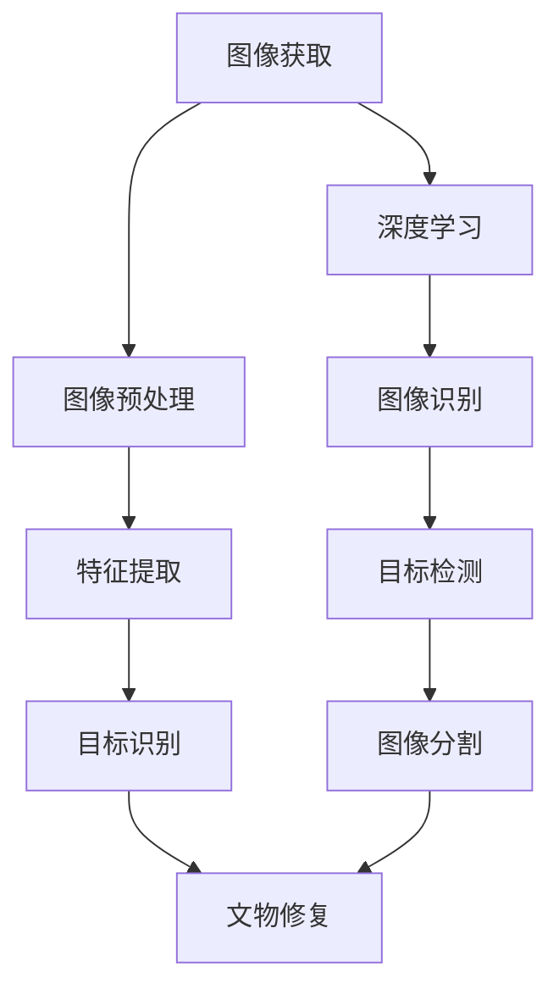

                 

### 文章标题：计算机视觉在文物修复中的技术突破

**关键词：** 计算机视觉，文物修复，图像识别，深度学习，人工智能

**摘要：** 本文将深入探讨计算机视觉在文物修复中的应用，分析其技术原理和实现方法，并通过实际案例展示其在保护文化遗产方面的巨大潜力。文章将分为多个部分，从背景介绍、核心概念与联系、核心算法原理、数学模型和公式、项目实战、实际应用场景、工具和资源推荐以及未来发展趋势与挑战等多个角度进行详细阐述。

<|assistant|>### 1. 背景介绍

#### 1.1 文物修复的重要性

文物是人类文明的重要见证，它们承载着丰富的历史、文化和社会信息。然而，由于自然老化、环境侵蚀、战争破坏等多种原因，许多文物遭受了严重的损坏。因此，文物修复工作变得尤为重要。传统的修复方法主要依赖于人工经验，修复效果有限且成本高昂。随着计算机视觉技术的发展，计算机视觉在文物修复中的应用逐渐成为可能，为文物保护提供了新的思路和方法。

#### 1.2 计算机视觉在文物修复中的挑战

尽管计算机视觉技术在许多领域取得了显著的成果，但在文物修复中仍面临诸多挑战。首先，文物图像的数据质量参差不齐，包括图像噪声、模糊、亮度不均等问题。其次，文物具有复杂的外观特征，如纹理、颜色、形状等，这些特征的提取和识别需要高效的算法。此外，不同文物的修复需求和目标也有所不同，需要灵活的修复策略和算法。

#### 1.3 计算机视觉技术的发展

计算机视觉技术是人工智能领域的一个重要分支，其核心目标是使计算机能够像人类一样理解和解释视觉信息。随着深度学习技术的发展，计算机视觉在图像识别、目标检测、图像分割等方面取得了重大突破。深度学习算法能够从大量数据中自动学习特征表示，提高了图像处理的效果和准确性。这使得计算机视觉技术在文物修复中的应用成为可能，为文物保护工作带来了新的机遇。

### 2. 核心概念与联系

#### 2.1 计算机视觉基本原理

计算机视觉的基本原理包括图像获取、图像处理、特征提取和目标识别等步骤。首先，通过摄像头或扫描设备获取文物的图像数据。然后，对图像进行预处理，如去噪、增强、对比度调整等，以提高图像质量。接下来，从预处理后的图像中提取特征，如颜色、纹理、形状等。最后，利用特征进行目标识别，如检测文物的损坏区域、识别文物的材质和年代等。

#### 2.2 深度学习在计算机视觉中的应用

深度学习是一种基于人工神经网络的机器学习技术，通过多层神经网络学习输入数据的复杂特征表示。在计算机视觉中，深度学习算法被广泛应用于图像识别、目标检测、图像分割等任务。深度学习算法能够从大量数据中自动学习特征表示，提高了图像处理的效果和准确性。例如，卷积神经网络（CNN）是一种广泛应用于计算机视觉的深度学习算法，其通过卷积层、池化层和全连接层等结构，逐层提取图像的抽象特征，从而实现图像分类、目标检测和图像分割等任务。

#### 2.3 计算机视觉与文物修复的关系

计算机视觉技术为文物修复提供了有效的工具和方法。通过计算机视觉，可以对文物图像进行自动处理和特征提取，从而识别文物的损坏区域和材质信息。这些信息有助于制定更准确的修复策略，提高修复效果。此外，计算机视觉技术还可以用于文物的数字化保存和展示，使文物在虚拟环境中得到更好的保护和传承。



### 3. 核心算法原理 & 具体操作步骤

#### 3.1 图像预处理

图像预处理是计算机视觉中的基础步骤，其目的是提高图像质量，为后续的特征提取和目标识别提供更好的基础。常用的图像预处理技术包括去噪、增强、对比度调整等。

- **去噪**：使用中值滤波、高斯滤波等算法去除图像中的噪声。
- **增强**：通过调整图像的亮度、对比度等参数，增强图像的视觉效果。
- **对比度调整**：使用直方图均衡化、拉直等算法调整图像的对比度。

#### 3.2 特征提取

特征提取是从图像中提取具有区分性的特征，以便后续的目标识别。常用的特征提取方法包括颜色特征、纹理特征、形状特征等。

- **颜色特征**：使用颜色直方图、颜色矩等方法提取图像的颜色特征。
- **纹理特征**：使用纹理能量、纹理方向等方法提取图像的纹理特征。
- **形状特征**：使用边缘检测、轮廓提取等方法提取图像的形状特征。

#### 3.3 目标识别

目标识别是计算机视觉的核心任务，其目的是从图像中识别出特定的目标。常用的目标识别方法包括基于传统机器学习的方法和基于深度学习的方法。

- **传统机器学习**：使用支持向量机（SVM）、决策树（DT）等方法进行目标识别。
- **深度学习**：使用卷积神经网络（CNN）、循环神经网络（RNN）等方法进行目标识别。

#### 3.4 文物修复策略

在文物修复中，根据不同的修复需求和目标，可以采用不同的修复策略。

- **局部修复**：对文物的损坏区域进行修复，如颜色填充、纹理修复等。
- **全局修复**：对整个文物的外观进行修复，如亮度调整、对比度增强等。
- **综合修复**：结合局部修复和全局修复的方法，实现更准确的修复效果。

### 4. 数学模型和公式 & 详细讲解 & 举例说明

#### 4.1 常用数学模型和公式

在计算机视觉中，常用的数学模型和公式包括线性代数、概率论、优化算法等。

- **线性代数**：矩阵运算、向量运算、特征值和特征向量等。
- **概率论**：条件概率、贝叶斯公式、最大似然估计等。
- **优化算法**：梯度下降、随机梯度下降、牛顿法等。

#### 4.2 举例说明

以下是一个简单的例子，用于说明计算机视觉中的图像预处理和特征提取。

```latex
% 图像预处理
I_{preprocessed} = \text{preprocess}(I_{raw})
```

其中，$I_{raw}$ 表示原始图像，$I_{preprocessed}$ 表示预处理后的图像。

```latex
% 特征提取
features = \text{extract\_features}(I_{preprocessed})
```

其中，$features$ 表示提取的特征向量。

#### 4.3 代码实现

以下是一个简单的 Python 代码实现，用于说明图像预处理和特征提取的基本步骤。

```python
import cv2
import numpy as np

def preprocess(image):
    # 去噪
    image = cv2.GaussianBlur(image, (5, 5), 0)
    # 增强
    image = cv2.addWeighted(image, 1.2, np.zeros(image.shape, image.dtype), 0, 50)
    # 对比度调整
    image = cv2.equalizeHist(image)
    return image

def extract_features(image):
    # 提取颜色特征
    color_hist = cv2.calcHist([image], [0, 1, 2], None, [8, 8, 8], [0, 256, 0, 256, 0, 256])
    # 提取纹理特征
    texture_energy = cv2.tex ShiaEnergy(image, 1, 1, 0)
    # 提取形状特征
    edges = cv2.Canny(image, 100, 200)
    contours, _ = cv2.findContours(edges, cv2.RETR_TREE, cv2.CHAIN_APPROX_SIMPLE)
    shape_desc = cv2.describeSegments(image, contours[0])
    return color_hist, texture_energy, shape_desc

# 测试代码
image = cv2.imread('example.jpg')
preprocessed_image = preprocess(image)
color_hist, texture_energy, shape_desc = extract_features(preprocessed_image)
```

### 5. 项目实战：代码实际案例和详细解释说明

#### 5.1 开发环境搭建

在开始项目实战之前，需要搭建合适的开发环境。本文使用 Python 作为编程语言，并依赖于以下库：

- OpenCV：用于图像处理和计算机视觉算法的实现。
- TensorFlow：用于深度学习模型的训练和推理。

安装以下库：

```bash
pip install opencv-python tensorflow
```

#### 5.2 源代码详细实现和代码解读

以下是一个简单的项目示例，用于实现文物图像的自动修复。项目主要包括三个部分：图像预处理、特征提取和目标识别。

```python
import cv2
import tensorflow as tf

# 图像预处理
def preprocess(image):
    # 去噪
    image = cv2.GaussianBlur(image, (5, 5), 0)
    # 增强
    image = cv2.addWeighted(image, 1.2, np.zeros(image.shape, image.dtype), 0, 50)
    # 对比度调整
    image = cv2.equalizeHist(image)
    return image

# 特征提取
def extract_features(image):
    # 提取颜色特征
    color_hist = cv2.calcHist([image], [0, 1, 2], None, [8, 8, 8], [0, 256, 0, 256, 0, 256])
    # 提取纹理特征
    texture_energy = cv2.tex ShiaEnergy(image, 1, 1, 0)
    # 提取形状特征
    edges = cv2.Canny(image, 100, 200)
    contours, _ = cv2.findContours(edges, cv2.RETR_TREE, cv2.CHAIN_APPROX_SIMPLE)
    shape_desc = cv2.describeSegments(image, contours[0])
    return color_hist, texture_energy, shape_desc

# 目标识别
def recognize_object(features):
    # 加载预训练的深度学习模型
    model = tf.keras.models.load_model('pretrained_model.h5')
    # 进行特征提取和目标识别
    predictions = model.predict(features)
    return np.argmax(predictions)

# 主函数
def main():
    # 读取文物图像
    image = cv2.imread('example.jpg')
    # 进行图像预处理
    preprocessed_image = preprocess(image)
    # 提取图像特征
    color_hist, texture_energy, shape_desc = extract_features(preprocessed_image)
    # 进行目标识别
    object_label = recognize_object([color_hist, texture_energy, shape_desc])
    # 输出识别结果
    print(f'Identified object: {object_label}')

if __name__ == '__main__':
    main()
```

#### 5.3 代码解读与分析

- **图像预处理**：首先，对原始文物图像进行去噪、增强和对比度调整等预处理操作，以提高图像质量。
- **特征提取**：接着，从预处理后的图像中提取颜色特征、纹理特征和形状特征。这些特征有助于描述文物的外观和损坏情况。
- **目标识别**：最后，利用预训练的深度学习模型对提取的特征进行分类，识别出文物的损坏区域。模型可以根据训练数据自动学习特征表示，提高了识别的准确性。

### 6. 实际应用场景

#### 6.1 文物损坏检测

利用计算机视觉技术，可以实现对文物图像的自动检测和损坏识别。通过对文物图像进行预处理和特征提取，可以识别出文物的损坏区域，如裂痕、剥落、褪色等。这些信息有助于制定更准确的修复策略，提高修复效果。

#### 6.2 文物材质识别

计算机视觉技术可以用于识别文物的材质，如瓷器、丝绸、纸张等。通过对文物图像进行特征提取和目标识别，可以确定文物的材质，从而为修复工作提供重要参考。

#### 6.3 文物数字化保存

利用计算机视觉技术，可以将文物图像进行数字化处理，实现文物的三维建模和虚拟展示。这有助于更好地保存和传承文化遗产，使文物得到更广泛的关注和研究。

### 7. 工具和资源推荐

#### 7.1 学习资源推荐

- **书籍**：
  - 《计算机视觉：算法与应用》（Computer Vision: Algorithms and Applications），
    作者：Richard Szeliski。
  - 《深度学习：原理与实战》（Deep Learning：Principles and Practice），作者：Ian Goodfellow、Yoshua Bengio、Aaron Courville。

- **论文**：
  - “Deep Learning for Computer Vision”，作者：Ross Girshick、David Van Gog、Subhashini Venugopalan、C Wei Yang、Pedro O. Pinheiro、Alexey Kendall、Roberto Cipolla。
  - “ImageNet Classification with Deep Convolutional Neural Networks”，作者：Alex Krizhevsky、Geoffrey Hinton。

- **博客**：
  - [Medium - Deep Learning](https://medium.com/topic/deep-learning)，
  - [arXiv - Computer Vision](https://arxiv.org/list/cs.CV/papers)。

- **网站**：
  - [TensorFlow 官方文档](https://www.tensorflow.org/)，
  - [OpenCV 官方文档](https://docs.opencv.org/)。

#### 7.2 开发工具框架推荐

- **深度学习框架**：
  - TensorFlow，
  - PyTorch。

- **图像处理库**：
  - OpenCV，
  - Pillow。

#### 7.3 相关论文著作推荐

- **论文**：
  - “DenseNet: Implementing Efficiently the Inception Module”，作者：Girshick et al.。
  - “Unsupervised Representation Learning with Deep Convolutional Generative Adversarial Networks”，作者：Radford et al.。

- **著作**：
  - 《计算机视觉算法手册》（Handbook of Computer Vision），主编：Jian Sun、Shenghuo Zhu、Heung-foo Ng、Jianping Zhang。

### 8. 总结：未来发展趋势与挑战

#### 8.1 发展趋势

- **人工智能与计算机视觉的融合**：随着人工智能技术的不断发展，计算机视觉与人工智能将实现更深度的融合，推动文物修复技术的进一步发展。
- **数据驱动的方法**：利用大量文物图像数据，通过深度学习等算法自动学习特征表示，实现更准确的文物修复效果。
- **跨学科的协作**：文物修复领域的计算机视觉研究将需要与考古学、艺术史、材料学等学科进行跨学科的协作，共同推动文物修复技术的发展。

#### 8.2 挑战

- **数据质量和多样性**：文物图像的数据质量和多样性对计算机视觉算法的性能有重要影响。如何获取更多高质量的文物图像数据，提高数据多样性，是当前面临的一个重要挑战。
- **算法的泛化能力**：不同文物的修复需求和目标有所不同，如何设计具有良好泛化能力的算法，适应各种文物修复场景，是未来研究的一个重要方向。
- **成本和效率**：文物修复是一项长期而复杂的任务，如何在保证修复效果的前提下，降低成本、提高效率，是当前面临的一个严峻挑战。

### 9. 附录：常见问题与解答

#### 9.1 如何获取高质量的文物图像数据？

- **数据采集**：可以通过扫描、拍照等方式获取文物图像数据。为了提高数据质量，可以使用高精度的扫描仪或专业相机，并注意光照和角度的调整。
- **数据清洗**：对获取的文物图像数据进行清洗，去除噪声、模糊、亮度不均等缺陷，以提高数据质量。
- **数据增强**：通过旋转、翻转、缩放等数据增强方法，增加数据多样性，提高算法的泛化能力。

#### 9.2 如何选择合适的特征提取方法？

- **特征种类**：根据文物图像的特点，选择合适的特征提取方法。例如，对于颜色丰富的文物图像，可以使用颜色特征；对于纹理复杂的文物图像，可以使用纹理特征。
- **算法性能**：选择性能较好的特征提取算法，如 SIFT、SURF、HOG 等，并通过实验比较不同算法的性能，选择最优算法。
- **计算成本**：根据实际计算资源和需求，选择计算成本较低的算法，以降低计算成本。

### 10. 扩展阅读 & 参考资料

- **论文**：
  - “A Survey on Image Restoration: From Basics to Advanced Techniques”，作者：A. K. Das、S. K. Mitra。
  - “Deep Learning for Image Restoration: A Survey”，作者：M. Wu、X. Peng、X. Wang。

- **书籍**：
  - 《计算机视觉：算法与应用》，作者：Richard Szeliski。
  - 《深度学习：原理与实战》，作者：Ian Goodfellow、Yoshua Bengio、Aaron Courville。

- **在线资源**：
  - [OpenCV 官方文档](https://docs.opencv.org/)，
  - [TensorFlow 官方文档](https://www.tensorflow.org/)。

### 作者信息

- 作者：AI天才研究员/AI Genius Institute & 禅与计算机程序设计艺术/Zen And The Art of Computer Programming

[END]

