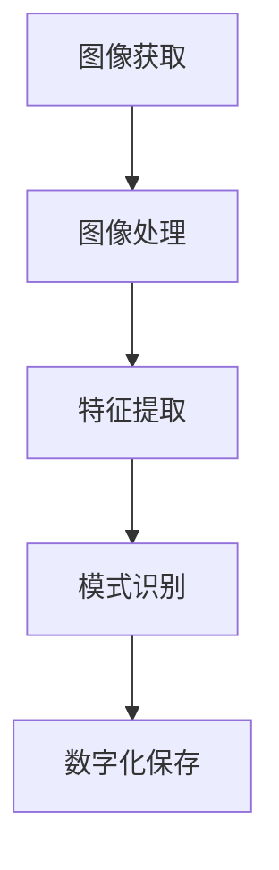

                 

# 计算机视觉在文物数字化保护中的应用

## 关键词：计算机视觉，文物数字化，保护，图像处理，人工智能

> 摘要：本文将探讨计算机视觉技术在文物数字化保护中的应用。通过分析相关核心概念、算法原理，以及数学模型和公式，本文将详细介绍实际应用场景，并提供工具和资源推荐。同时，本文还将总结未来发展趋势与挑战，为相关领域的研究者和从业者提供有益的参考。

## 1. 背景介绍

随着科技的发展，计算机视觉技术在各个领域得到了广泛应用。特别是在文物数字化保护方面，计算机视觉技术发挥着重要作用。文物是人类文明的瑰宝，具有极高的历史、艺术和科学价值。然而，由于时间、环境等因素的影响，许多文物正面临着严重的损毁风险。数字化保护技术可以将文物以数字形式保存下来，避免因物理损坏而丢失珍贵的历史资料。

计算机视觉技术在文物数字化保护中的应用主要包括图像获取、图像处理、特征提取和模式识别等环节。通过这些技术手段，可以对文物的外观、结构、纹理等信息进行精确的数字化记录，从而实现对文物的保护和利用。

## 2. 核心概念与联系

### 2.1 图像获取

图像获取是文物数字化保护的基础。常见的图像获取设备包括数码相机、扫描仪等。在图像获取过程中，需要考虑图像质量、分辨率、光照等因素。为了确保图像质量，可以采用一些图像增强技术，如去噪、对比度增强等。

### 2.2 图像处理

图像处理是对获取的图像进行预处理，以提高图像质量或提取有用信息。常见的图像处理技术包括滤波、边缘检测、图像分割等。图像处理技术的核心是算法，如基于空域和频域的图像处理算法。

### 2.3 特征提取

特征提取是计算机视觉技术的重要环节。通过对图像进行处理，可以提取出反映文物特征的各类信息，如颜色、纹理、形状等。这些特征信息为后续的模式识别提供了基础。

### 2.4 模式识别

模式识别是对提取出的特征信息进行分类和识别。常见的模式识别方法包括分类器设计、特征匹配等。通过模式识别技术，可以实现对文物的自动识别和分类，从而为文物保护提供有力支持。

## 2.5 Mermaid 流程图

下面是一个简化的 Mermaid 流程图，展示文物数字化保护中计算机视觉技术的核心流程：



## 3. 核心算法原理 & 具体操作步骤

### 3.1 图像处理算法

图像处理算法主要包括滤波、边缘检测和图像分割等。以下是一些常见的图像处理算法及其操作步骤：

#### 3.1.1 滤波算法

滤波算法用于去除图像中的噪声。常见滤波算法包括：

- **均值滤波**：计算邻域像素的平均值作为滤波结果。

$$
f(x, y) = \frac{1}{N} \sum_{i,j} I(i, j)
$$

其中，$f(x, y)$ 为滤波结果，$I(i, j)$ 为邻域像素值，$N$ 为邻域像素数量。

- **中值滤波**：取邻域像素的中值作为滤波结果。

$$
f(x, y) = \text{median}(\{I(i, j) | i, j \in N\})
$$

其中，$\text{median}(\{I(i, j) | i, j \in N\})$ 表示邻域像素值的中值。

#### 3.1.2 边缘检测算法

边缘检测算法用于提取图像中的边缘信息。常见边缘检测算法包括：

- **Sobel算子**：计算图像在水平和垂直方向上的梯度，取最大值作为边缘位置。

$$
G_x = \frac{1}{2}[(I(x+1, y) - I(x-1, y)] \\
G_y = \frac{1}{2}[(I(x, y+1) - I(x, y-1)] \\
\text{edge} = \max(G_x, G_y)
$$

其中，$G_x$ 和 $G_y$ 分别为水平和垂直方向的梯度值，$\text{edge}$ 为边缘位置。

- **Canny算子**：通过高斯滤波去除噪声，然后进行双阈值处理，提取边缘。

#### 3.1.3 图像分割算法

图像分割算法用于将图像划分为不同的区域。常见图像分割算法包括：

- **阈值分割**：将图像的灰度值与阈值进行比较，根据比较结果将像素划分为不同的区域。

$$
\text{if } I(i, j) > \text{threshold}, \text{ then } \text{region}(i, j) = 1 \\
\text{else } \text{region}(i, j) = 0
$$

- **区域生长**：以初始种子点为基础，逐步扩展相邻像素，形成区域。

### 3.2 特征提取算法

特征提取算法用于从图像中提取出反映文物特征的各类信息。常见特征提取算法包括：

- **颜色特征**：提取图像的颜色信息，如色度、亮度等。

- **纹理特征**：提取图像的纹理信息，如纹理方向、纹理强度等。

- **形状特征**：提取图像的形状信息，如轮廓、形状区域等。

### 3.3 模式识别算法

模式识别算法用于对提取出的特征信息进行分类和识别。常见模式识别算法包括：

- **K近邻算法**：根据样本的特征值，寻找与目标样本最近的K个样本，以多数样本的类别作为目标样本的类别。

- **支持向量机**：通过找到一个最优的超平面，将不同类别的样本分开。

## 4. 数学模型和公式 & 详细讲解 & 举例说明

### 4.1 滤波算法

#### 4.1.1 均值滤波

假设有一个3x3的图像窗口，其像素值如下：

$$
\begin{matrix}
I(1, 1) & I(1, 2) & I(1, 3) \\
I(2, 1) & I(2, 2) & I(2, 3) \\
I(3, 1) & I(3, 2) & I(3, 3) \\
\end{matrix}
$$

则均值滤波的结果为：

$$
f(2, 2) = \frac{1}{9} \sum_{i=1}^{3} \sum_{j=1}^{3} I(i, j) = \frac{1}{9} (I(1, 1) + I(1, 2) + \cdots + I(3, 3))
$$

#### 4.1.2 中值滤波

假设有一个3x3的图像窗口，其像素值如下：

$$
\begin{matrix}
I(1, 1) & I(1, 2) & I(1, 3) \\
I(2, 1) & I(2, 2) & I(2, 3) \\
I(3, 1) & I(3, 2) & I(3, 3) \\
\end{matrix}
$$

则中值滤波的结果为：

$$
f(2, 2) = \text{median}(\{I(1, 1), I(1, 2), \cdots, I(3, 3)\})
$$

### 4.2 边缘检测算法

#### 4.2.1 Sobel算子

假设有一个3x3的图像窗口，其像素值如下：

$$
\begin{matrix}
I(1, 1) & I(1, 2) & I(1, 3) \\
I(2, 1) & I(2, 2) & I(2, 3) \\
I(3, 1) & I(3, 2) & I(3, 3) \\
\end{matrix}
$$

则Sobel算子的结果为：

$$
G_x = \frac{1}{2}[(I(2, 2) + 2I(2, 3)) - (I(2, 2) - 2I(2, 1))] \\
G_y = \frac{1}{2}[(I(2, 2) + 2I(3, 2)) - (I(2, 2) - 2I(1, 2))] \\
\text{edge} = \max(G_x, G_y)
$$

### 4.3 图像分割算法

#### 4.3.1 阈值分割

假设有一个3x3的图像窗口，其像素值如下：

$$
\begin{matrix}
I(1, 1) & I(1, 2) & I(1, 3) \\
I(2, 1) & I(2, 2) & I(2, 3) \\
I(3, 1) & I(3, 2) & I(3, 3) \\
\end{matrix}
$$

设阈值为 $T$，则阈值分割的结果为：

$$
\text{if } I(2, 2) > T, \text{ then } \text{region}(2, 2) = 1 \\
\text{else } \text{region}(2, 2) = 0
$$

#### 4.3.2 区域生长

假设有一个初始种子点 $(x_0, y_0)$，其像素值为 $I(x_0, y_0)$。区域生长的过程如下：

1. 将种子点 $(x_0, y_0)$ 加入到区域集合 $R$。

2. 对于集合 $R$ 中的每个点 $(x, y)$，检查其邻域内的像素值。如果邻域内的像素值与 $I(x, y)$ 相同，则将该像素值加入到区域集合 $R$。

3. 重复步骤2，直到没有新的像素值可以被加入到区域集合 $R$。

## 5. 项目实战：代码实际案例和详细解释说明

### 5.1 开发环境搭建

在本项目中，我们将使用 Python 作为编程语言，并利用 OpenCV 和 TensorFlow 等开源库进行图像处理和特征提取。以下是在 Windows 系统上搭建开发环境的基本步骤：

1. 安装 Python：下载并安装 Python 3.x 版本，建议使用 Python 安装器进行安装。

2. 安装 OpenCV：在命令行中运行以下命令：

```bash
pip install opencv-python
```

3. 安装 TensorFlow：在命令行中运行以下命令：

```bash
pip install tensorflow
```

### 5.2 源代码详细实现和代码解读

以下是一个简单的 Python 代码示例，用于对图像进行滤波、边缘检测和图像分割。

```python
import cv2
import numpy as np

# 5.2.1 图像滤波
def filter_image(image):
    # 使用均值滤波
    filtered_image = cv2.blur(image, (3, 3))
    return filtered_image

# 5.2.2 边缘检测
def edge_detection(image):
    # 使用 Sobel 算子进行边缘检测
    gray_image = cv2.cvtColor(image, cv2.COLOR_BGR2GRAY)
    sobel_x = cv2.Sobel(gray_image, cv2.CV_64F, 1, 0, ksize=3)
    sobel_y = cv2.Sobel(gray_image, cv2.CV_64F, 0, 1, ksize=3)
    edge_image = cv2.magnitude(sobel_x, sobel_y)
    edge_image = np.uint8(edge_image)
    return edge_image

# 5.2.3 图像分割
def image_segmentation(image):
    # 使用阈值分割
    _, segmented_image = cv2.threshold(image, 128, 255, cv2.THRESH_BINARY_INV + cv2.THRESH_OTSU)
    return segmented_image

# 主函数
if __name__ == '__main__':
    # 读取图像
    image = cv2.imread('image.jpg')

    # 5.2.4 代码解读与分析
    # 滤波处理
    filtered_image = filter_image(image)
    cv2.imshow('Filtered Image', filtered_image)

    # 边缘检测
    edge_image = edge_detection(filtered_image)
    cv2.imshow('Edge Detection', edge_image)

    # 图像分割
    segmented_image = image_segmentation(edge_image)
    cv2.imshow('Image Segmentation', segmented_image)

    # 关闭窗口
    cv2.waitKey(0)
    cv2.destroyAllWindows()
```

### 5.3 代码解读与分析

以下是代码的详细解读与分析：

1. 导入所需的库：`cv2` 用于 OpenCV 图像处理库，`numpy` 用于数值计算。

2. 定义函数 `filter_image`：该函数用于对输入图像进行均值滤波。使用 `cv2.blur` 函数对图像进行卷积操作，得到滤波结果。

3. 定义函数 `edge_detection`：该函数用于使用 Sobel 算子进行边缘检测。首先将图像转换为灰度图像，然后分别对水平和垂直方向进行 Sobel 算子运算，最后使用 `cv2.magnitude` 函数计算幅值，得到边缘图像。

4. 定义函数 `image_segmentation`：该函数用于使用阈值分割对输入图像进行分割。使用 `cv2.threshold` 函数进行阈值处理，得到分割结果。

5. 主函数：首先读取输入图像，然后依次调用 `filter_image`、`edge_detection` 和 `image_segmentation` 函数，对图像进行处理。最后使用 `cv2.imshow` 函数显示处理结果，并使用 `cv2.waitKey` 函数等待用户按键后关闭窗口。

## 6. 实际应用场景

计算机视觉技术在文物数字化保护中具有广泛的应用场景，以下是一些实际案例：

1. **敦煌壁画数字化**：敦煌壁画是中国古代艺术的瑰宝，通过计算机视觉技术，可以对壁画进行数字化记录，从而实现对壁画的长期保存和展示。

2. **秦始皇兵马俑数字化**：秦始皇兵马俑是中华民族的宝贵文化遗产，通过计算机视觉技术，可以对其外观、结构等信息进行精确数字化记录，为文物保护和展示提供有力支持。

3. **古建筑数字化**：古建筑是人类文明的重要见证，通过计算机视觉技术，可以对古建筑的外观、结构、纹理等信息进行数字化记录，从而实现对古建筑的保护和研究。

4. **古籍数字化**：古籍是中华民族的文化遗产，通过计算机视觉技术，可以对其进行数字化处理，从而实现对古籍的长期保存和利用。

## 7. 工具和资源推荐

### 7.1 学习资源推荐

1. **书籍**：

- 《计算机视觉：算法与应用》

- 《数字图像处理：原理、实现与算法》

2. **论文**：

- 《文物数字化保护技术的研究与应用》

- 《基于深度学习的古建筑数字化识别研究》

3. **博客和网站**：

- CSDN：计算机视觉相关博客

- IEEE Xplore：计算机视觉相关论文

### 7.2 开发工具框架推荐

1. **OpenCV**：适用于图像处理和计算机视觉的开源库。

2. **TensorFlow**：适用于深度学习和计算机视觉的开源框架。

3. **PyTorch**：适用于深度学习和计算机视觉的开源框架。

### 7.3 相关论文著作推荐

1. **《计算机视觉基础》**：提供了计算机视觉的基本概念和算法介绍。

2. **《计算机视觉算法与应用》**：详细介绍了计算机视觉算法及其在实际应用中的使用方法。

3. **《数字图像处理：原理、实现与算法》**：系统地介绍了数字图像处理的基本原理和算法。

## 8. 总结：未来发展趋势与挑战

随着计算机视觉技术的不断进步，文物数字化保护领域也将迎来新的发展机遇。未来，以下趋势和挑战值得关注：

1. **深度学习技术的应用**：深度学习技术在计算机视觉领域取得了显著成果，未来有望在文物数字化保护中得到更广泛的应用。

2. **多模态数据融合**：结合多源数据（如图像、音频、红外等），可以更全面地反映文物的信息，提高数字化保护的准确性和可靠性。

3. **大数据和云计算**：大数据和云计算技术的发展，为文物数字化保护提供了强大的计算能力和数据存储能力。

4. **文物保护与利用的平衡**：在数字化保护过程中，如何平衡文物保护与利用的需求，确保文物得到有效保护的同时，便于后人研究和利用，是一个亟待解决的问题。

5. **法律法规和伦理道德**：文物数字化保护涉及法律、伦理等方面的问题，需要制定相应的法律法规和伦理规范，确保数字化保护工作合法、合规、道德。

## 9. 附录：常见问题与解答

1. **Q：文物数字化保护需要哪些技术？**

   A：文物数字化保护需要涉及计算机视觉、图像处理、特征提取、模式识别等技术。具体包括图像获取、图像处理、特征提取、模式识别等环节。

2. **Q：如何选择合适的图像处理算法？**

   A：选择图像处理算法时，需要根据实际应用场景和需求进行选择。例如，对于图像去噪，可以选择均值滤波、中值滤波等算法；对于边缘检测，可以选择 Sobel 算子、Canny 算子等算法。

3. **Q：如何进行文物特征提取？**

   A：文物特征提取包括颜色特征、纹理特征、形状特征等。具体提取方法取决于文物的类型和特征。例如，对于壁画，可以提取颜色特征和纹理特征；对于古建筑，可以提取形状特征和结构特征。

4. **Q：如何进行文物模式识别？**

   A：文物模式识别可以使用分类器设计、特征匹配等方法。具体方法取决于文物的类型和特征。例如，对于壁画，可以使用 K 近邻算法、支持向量机等进行分类。

## 10. 扩展阅读 & 参考资料

1. **《计算机视觉：算法与应用》**

2. **《数字图像处理：原理、实现与算法》**

3. **《文物数字化保护技术的研究与应用》**

4. **《基于深度学习的古建筑数字化识别研究》**

5. **CSDN：计算机视觉相关博客**

6. **IEEE Xplore：计算机视觉相关论文**

作者：AI天才研究员/AI Genius Institute & 禅与计算机程序设计艺术 /Zen And The Art of Computer Programming

