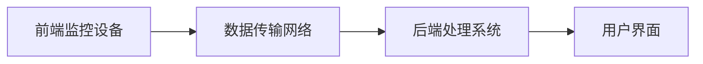

                 

# 计算机视觉在智能监控系统中的实践

## 关键词：
- 计算机视觉
- 智能监控系统
- 算法原理
- 数学模型
- 项目实战
- 应用场景
- 工具资源

## 摘要
本文将深入探讨计算机视觉在智能监控系统中的应用，从背景介绍、核心概念与联系、核心算法原理与操作步骤、数学模型与公式讲解、项目实战以及实际应用场景等方面，全面解析计算机视觉在智能监控系统中的实践。通过对工具和资源的推荐，读者可以更好地掌握相关技术和知识，了解未来发展趋势与挑战。

## 1. 背景介绍

随着信息技术和物联网技术的快速发展，智能监控系统已成为现代安防、交通管理、智能家居等领域的重要应用。计算机视觉作为人工智能的一个重要分支，以其强大的图像处理和分析能力，在智能监控系统中发挥着关键作用。计算机视觉技术能够实现对视频流的高效处理，自动识别和跟踪目标，进行行为分析，为监控系统提供智能化支持。

智能监控系统不仅提高了安全管理的效率和准确性，还能够在交通管理、城市安防等方面发挥重要作用。例如，通过计算机视觉技术，可以实时监测交通流量，识别违规行为，优化交通信号灯控制策略，提高道路通行效率。同时，在智能安防领域，计算机视觉技术可以实现对入侵者的识别和追踪，提供实时报警和响应，保障人民生命财产安全。

本文将围绕计算机视觉在智能监控系统中的应用，详细介绍相关算法原理、数学模型、项目实战和实际应用场景，帮助读者深入了解这一领域的最新进展和技术应用。

## 2. 核心概念与联系

### 2.1 计算机视觉基础

计算机视觉是一门研究如何使计算机像人一样理解、解释和识别图像和视频的技术。其核心目标是实现图像处理、目标检测、跟踪、识别、图像分割等功能。计算机视觉的应用领域广泛，包括但不限于安防监控、医疗影像分析、自动驾驶、人机交互等。

计算机视觉系统通常包括以下几个关键组成部分：

1. **图像获取**：通过摄像头、无人机等设备获取图像或视频数据。
2. **预处理**：对获取的图像进行去噪、增强、缩放等预处理操作，以提高后续处理的准确性和效率。
3. **特征提取**：从预处理后的图像中提取具有区分性的特征，如边缘、纹理、颜色等。
4. **模式识别**：利用机器学习、深度学习等方法对提取的特征进行分类、识别和跟踪。
5. **输出结果**：将识别和跟踪的结果输出，如目标检测框、行为分类标签等。

### 2.2 智能监控系统架构

智能监控系统通常包括前端监控设备、数据传输网络、后端处理系统和用户界面等组成部分。前端监控设备负责图像或视频的实时采集，数据传输网络将数据传输到后端处理系统，后端处理系统利用计算机视觉算法对数据进行处理和分析，用户界面则用于展示处理结果和提供交互功能。

智能监控系统架构如下图所示：



### 2.3 计算机视觉与智能监控系统的联系

计算机视觉在智能监控系统中发挥着核心作用。通过计算机视觉技术，智能监控系统可以实现对视频流的高效处理、目标检测和识别、行为分析等功能。以下是一些关键技术的简要介绍：

1. **目标检测**：通过检测视频帧中的物体，为后续跟踪和行为分析提供基础。常用的目标检测算法包括YOLO、SSD、Faster R-CNN等。
2. **目标跟踪**：在视频流中持续跟踪目标，避免目标被遮挡或消失。常用的目标跟踪算法包括光流法、KCF、DeepSort等。
3. **行为分析**：通过对目标的行为模式进行分析，识别异常行为或危险事件。常用的行为分析算法包括基于规则的方法、深度学习方法等。

通过计算机视觉技术，智能监控系统可以实现对监控场景的实时监测和智能分析，提高安防管理的效率和准确性。

## 3. 核心算法原理 & 具体操作步骤

### 3.1 目标检测算法原理

目标检测是计算机视觉领域的一个基本任务，其目的是在图像或视频中识别并定位多个对象。目标检测算法可以分为两类：一类是基于传统机器学习的方法，如支持向量机（SVM）、随机森林（Random Forest）等；另一类是基于深度学习的方法，如卷积神经网络（CNN）、YOLO（You Only Look Once）、SSD（Single Shot MultiBox Detector）等。

#### 3.1.1 基于深度学习的目标检测算法

以YOLO算法为例，YOLO是一种单阶段目标检测算法，其基本原理是将图像分割成S×S的网格，每个网格预测B个边界框及相应的置信度和类别概率。具体操作步骤如下：

1. **图像预处理**：将图像缩放到固定大小，如416×416。
2. **特征提取**：使用卷积神经网络提取图像特征，如COCO数据集预训练的Darknet-53模型。
3. **预测边界框**：每个网格预测B个边界框，边界框包含中心坐标、宽高及置信度。
4. **非极大值抑制（NMS）**：对预测的边界框进行非极大值抑制，去除重叠的边界框。
5. **类别判断**：根据置信度和类别概率判断边界框中的对象类别。

#### 3.1.2 基于传统机器学习的目标检测算法

以SVM为例，SVM是一种二分类模型，其基本原理是找到一个最优的超平面，使得分类边界与样本点之间的间隔最大。具体操作步骤如下：

1. **特征提取**：使用HOG（Histogram of Oriented Gradients）等特征描述子提取图像特征。
2. **训练SVM模型**：使用训练数据集训练SVM模型，找到最佳分类边界。
3. **预测目标类别**：对测试图像进行特征提取，输入SVM模型进行分类预测。

### 3.2 目标跟踪算法原理

目标跟踪是计算机视觉领域的一个挑战性任务，其目的是在视频流中持续跟踪目标。目标跟踪算法可以分为三类：基于模型的方法、基于匹配的方法和基于深度学习的方法。

#### 3.2.1 基于模型的方法

以光流法为例，光流法是一种基于图像序列的连续性原理，通过计算像素点在连续帧之间的运动轨迹来跟踪目标。具体操作步骤如下：

1. **图像预处理**：对连续帧图像进行预处理，如高斯滤波、灰度化等。
2. **光流计算**：利用光流算法（如Lucas-Kanade算法）计算像素点的运动轨迹。
3. **目标跟踪**：根据光流轨迹更新目标位置，实现对目标的持续跟踪。

#### 3.2.2 基于匹配的方法

以KCF算法为例，KCF是一种基于颜色模型和运动模型的目标跟踪算法。具体操作步骤如下：

1. **特征提取**：使用HOG特征描述子提取目标图像的特征。
2. **模型训练**：利用目标特征和运动轨迹训练颜色模型和运动模型。
3. **目标匹配**：对连续帧图像进行特征提取，利用颜色模型和运动模型进行目标匹配。
4. **目标跟踪**：根据匹配结果更新目标位置，实现对目标的持续跟踪。

#### 3.2.3 基于深度学习的方法

以DeepSort算法为例，DeepSort是一种基于深度学习的目标跟踪算法。具体操作步骤如下：

1. **特征提取**：使用卷积神经网络提取目标特征。
2. **状态更新**：根据目标特征和位置信息更新目标状态。
3. **匹配与跟踪**：利用深度学习模型进行特征匹配，实现目标的持续跟踪。

### 3.3 行为分析算法原理

行为分析是计算机视觉在智能监控系统中的一个重要应用，其目的是识别和分类视频中的人的行为。行为分析算法可以分为两类：基于规则的方法和基于深度学习的方法。

#### 3.3.1 基于规则的方法

以HMM（Hidden Markov Model）为例，HMM是一种基于统计模型的行为分析算法。具体操作步骤如下：

1. **行为建模**：根据视频数据构建行为模型，如HMM模型。
2. **状态转移**：根据行为模型计算状态转移概率。
3. **行为识别**：根据状态转移概率识别视频中的行为。

#### 3.3.2 基于深度学习的方法

以CNN为例，CNN是一种基于卷积神经网络的深度学习方法。具体操作步骤如下：

1. **特征提取**：使用卷积神经网络提取视频特征。
2. **行为分类**：使用全连接层对提取的特征进行分类。
3. **行为识别**：根据分类结果识别视频中的行为。

## 4. 数学模型和公式 & 详细讲解 & 举例说明

### 4.1 卷积神经网络（CNN）

卷积神经网络是一种深度学习模型，广泛应用于图像处理和计算机视觉领域。CNN通过卷积层、池化层和全连接层等结构，实现对图像的自动特征提取和分类。

#### 4.1.1 卷积层

卷积层是CNN的核心部分，通过卷积运算提取图像特征。卷积运算的基本公式如下：

$$
f(x, y) = \sum_{i=1}^{n}\sum_{j=1}^{m} w_{ij} * g(x-i, y-j)
$$

其中，$f(x, y)$表示卷积结果，$w_{ij}$表示卷积核，$g(x-i, y-j)$表示图像上的一个像素点。

#### 4.1.2 池化层

池化层用于降低特征图的维度，增强模型的泛化能力。常见的池化方式有最大池化和平均池化。

最大池化公式如下：

$$
p(x, y) = \max(g(x-i, y-j))
$$

其中，$p(x, y)$表示池化结果，$g(x-i, y-j)$表示图像上的一个像素点。

平均池化公式如下：

$$
p(x, y) = \frac{1}{n}\sum_{i=1}^{n} g(x-i, y-j)
$$

其中，$p(x, y)$表示池化结果，$g(x-i, y-j)$表示图像上的一个像素点，$n$表示池化区域内的像素点数量。

#### 4.1.3 全连接层

全连接层用于将特征图映射到输出类别。全连接层的基本公式如下：

$$
z = \sum_{i=1}^{n} w_{ij} * x_i + b_j
$$

其中，$z$表示全连接层输出，$w_{ij}$表示权重，$x_i$表示特征值，$b_j$表示偏置。

#### 4.1.4 损失函数

在分类任务中，常用的损失函数有交叉熵损失函数和均方误差损失函数。

交叉熵损失函数公式如下：

$$
L(y, \hat{y}) = -\sum_{i=1}^{n} y_i \log(\hat{y}_i)
$$

其中，$L$表示损失函数，$y$表示真实标签，$\hat{y}$表示预测标签。

均方误差损失函数公式如下：

$$
L(y, \hat{y}) = \frac{1}{2}\sum_{i=1}^{n} (y_i - \hat{y}_i)^2
$$

其中，$L$表示损失函数，$y$表示真实标签，$\hat{y}$表示预测标签。

### 4.2 光流法

光流法是一种基于图像序列的连续性原理的目标跟踪算法。光流法通过计算像素点在连续帧之间的运动轨迹来跟踪目标。

#### 4.2.1 光流模型

光流模型的基本公式如下：

$$
\frac{dx}{dt} = v_x, \quad \frac{dy}{dt} = v_y
$$

其中，$x, y$表示像素点的位置，$v_x, v_y$表示像素点的运动速度。

#### 4.2.2 光流估计

光流估计是光流法的关键步骤，常用的光流估计算法有Lucas-Kanade算法和优化算法。

Lucas-Kanade算法的基本公式如下：

$$
g(x, y) = f(x-t\frac{dx}{dt}, y-t\frac{dy}{dt})
$$

其中，$g(x, y)$表示光流场，$f(x, y)$表示图像，$t$表示时间间隔。

优化算法的基本公式如下：

$$
\min_{x, y} \sum_{i=1}^{n} \left[g(x_i, y_i) - f(x_i-t\frac{dx}{dt}, y_i-t\frac{dy}{dt})\right]^2
$$

其中，$x_i, y_i$表示像素点的位置，$n$表示像素点数量。

### 4.3 深度学习方法

深度学习方法在计算机视觉领域取得了显著成果，如目标检测、目标跟踪和行为分析等。深度学习方法的核心是构建大规模神经网络，通过自动学习图像特征来实现复杂任务。

#### 4.3.1 卷积神经网络（CNN）

卷积神经网络（CNN）是一种深度学习模型，通过卷积层、池化层和全连接层等结构，实现对图像的自动特征提取和分类。CNN的基本公式如下：

$$
h_{ij} = \sum_{k=1}^{c} w_{ikj} * g_k(x) + b_j
$$

其中，$h_{ij}$表示卷积层输出，$w_{ikj}$表示卷积核，$g_k(x)$表示特征图，$b_j$表示偏置。

#### 4.3.2 反向传播算法

反向传播算法是深度学习训练过程中的核心算法，用于计算网络参数的梯度。反向传播算法的基本公式如下：

$$
\delta_j = \frac{\partial L}{\partial z_j} = \frac{\partial L}{\partial \hat{y}} \cdot \frac{\partial \hat{y}}{\partial z_j}
$$

$$
\frac{\partial L}{\partial w_{ij}} = \delta_j * h_{ij}^L
$$

$$
\frac{\partial L}{\partial b_j} = \delta_j
$$

其中，$\delta_j$表示梯度，$L$表示损失函数，$\hat{y}$表示预测标签，$z_j$表示全连接层输出，$w_{ij}$表示卷积核，$b_j$表示偏置，$h_{ij}^L$表示卷积层输出。

## 5. 项目实战：代码实际案例和详细解释说明

### 5.1 开发环境搭建

在进行计算机视觉项目开发之前，需要搭建一个合适的开发环境。以下是一个基于Python和TensorFlow的计算机视觉项目开发环境的搭建步骤：

1. **安装Python**：确保已安装Python 3.x版本。
2. **安装TensorFlow**：使用pip命令安装TensorFlow：

   ```bash
   pip install tensorflow
   ```

3. **安装其他依赖**：安装其他必需的库，如NumPy、Pandas等：

   ```bash
   pip install numpy pandas opencv-python
   ```

### 5.2 源代码详细实现和代码解读

以下是一个简单的基于YOLOv5的目标检测项目示例，代码如下：

```python
import torch
import torchvision
from torchvision import transforms
from PIL import Image
import cv2

# 加载YOLOv5模型
model = torchvision.models.detection.yolov5()
model.load_state_dict(torch.load('yolov5_model.pth'))
model.eval()

# 定义预处理和后处理函数
def preprocess(image):
    transform = transforms.Compose([
        transforms.Resize((640, 640)),
        transforms.ToTensor()
    ])
    return transform(image)

def postprocess(pred_dict, image):
    boxes = pred_dict['boxes']
    labels = pred_dict['labels']
    scores = pred_dict['scores']
    image = image.transpose((2, 0, 1))
    image = cv2.cvtColor(image, cv2.COLOR_RGB2BGR)
    for box, label, score in zip(boxes, labels, scores):
        if score > 0.5:
            cv2.rectangle(image, (int(box[0]), int(box[1])), (int(box[2]), int(box[3])), (0, 255, 0), 2)
            cv2.putText(image, f'{labels[int(label)]}: {score:.2f}', (int(box[0]), int(box[1])), cv2.FONT_HERSHEY_SIMPLEX, 0.5, (0, 255, 0), 2)
    return image

# 加载测试图像
image = Image.open('test_image.jpg')

# 预处理图像
image = preprocess(image)

# 进行目标检测
with torch.no_grad():
    pred_dict = model(image)

# 后处理结果
result = postprocess(pred_dict, image)

# 显示结果
cv2.imshow('Result', result)
cv2.waitKey(0)
cv2.destroyAllWindows()
```

#### 代码解读：

1. **加载YOLOv5模型**：使用PyTorch加载预训练的YOLOv5模型。
2. **预处理和后处理函数**：定义预处理函数用于将图像缩放至模型输入尺寸，并将图像转换为Tensor。后处理函数用于将模型输出结果转换为可显示的格式。
3. **加载测试图像**：使用PIL库加载测试图像。
4. **预处理图像**：调用预处理函数对测试图像进行预处理。
5. **进行目标检测**：使用模型对预处理后的图像进行目标检测，得到预测框、标签和置信度。
6. **后处理结果**：调用后处理函数对预测结果进行后处理，并在图像上绘制检测框和标签。
7. **显示结果**：使用OpenCV库显示检测结果。

### 5.3 代码解读与分析

1. **模型加载**：使用`torchvision.models.detection.yolov5()`函数加载YOLOv5模型。YOLOv5是一个单阶段目标检测模型，具有实时性和高准确率的特点。
2. **预处理和后处理**：预处理函数`preprocess`用于将图像缩放到模型输入尺寸，并将图像转换为Tensor。后处理函数`postprocess`用于将模型输出结果（预测框、标签和置信度）转换为可显示的格式，并在图像上绘制检测框和标签。
3. **测试图像加载**：使用PIL库加载测试图像，并将其转换为Tensor。
4. **目标检测**：使用模型对预处理后的图像进行目标检测。模型在检测过程中会输出预测框、标签和置信度。
5. **结果显示**：使用OpenCV库显示检测结果。在检测结果中，只有置信度大于0.5的预测框会被绘制在图像上。

## 6. 实际应用场景

计算机视觉技术在智能监控系统中的应用已经非常广泛，以下是一些典型的实际应用场景：

### 6.1 智能安防

智能安防系统利用计算机视觉技术，实现对公共场所、住宅小区、交通要道等区域的实时监控和预警。例如，通过目标检测和跟踪技术，可以实现对可疑人物的识别和报警；通过行为分析技术，可以识别异常行为，如打架、盗窃等，并及时采取措施。

### 6.2 智能交通

智能交通系统利用计算机视觉技术，实现对交通流量、交通违规行为的实时监测和智能分析。例如，通过车辆检测和跟踪技术，可以实时统计交通流量，优化交通信号灯控制策略，提高道路通行效率；通过交通违规行为检测技术，可以识别和报警违章停车、超速行驶等违规行为。

### 6.3 智能家居

智能家居系统利用计算机视觉技术，实现对家庭环境的智能监控和智能控制。例如，通过人脸识别技术，可以实现家庭成员的自动识别和个性化服务；通过行为分析技术，可以监控家庭成员的活动情况，为家庭安全提供保障；通过智能场景识别技术，可以实现家庭场景的自动切换，提供舒适、便捷的生活体验。

### 6.4 医疗监测

医疗监测系统利用计算机视觉技术，实现对病患的实时监测和辅助诊断。例如，通过医疗影像分析技术，可以辅助医生进行病情诊断和治疗方案制定；通过病患行为分析技术，可以实时监测病患的活动情况，及时发现异常情况并进行预警。

## 7. 工具和资源推荐

### 7.1 学习资源推荐

1. **书籍**：
   - 《深度学习》（Goodfellow, I., Bengio, Y., & Courville, A.）
   - 《计算机视觉：算法与应用》（Richard S. Wright）
   - 《Python计算机视觉编程》（Robert Laganière）

2. **论文**：
   - "You Only Look Once: Unified, Real-Time Object Detection"（Joseph Redmon等）
   - "Faster R-CNN: Towards Real-Time Object Detection with Region Proposal Networks"（Shaoqing Ren等）
   - "DeepFlow: Real-Time Large Scale Optical Flow Using a Siamese Network"（Luc van Gool等）

3. **博客和网站**：
   - [TensorFlow官方文档](https://www.tensorflow.org/)
   - [PyTorch官方文档](https://pytorch.org/)
   - [opencv.org](https://opencv.org/)

### 7.2 开发工具框架推荐

1. **深度学习框架**：
   - TensorFlow
   - PyTorch
   - Keras

2. **图像处理库**：
   - OpenCV
   - PIL
   - NumPy

3. **其他工具**：
   - Jupyter Notebook：用于编写和运行代码
   - GitHub：用于版本控制和协作开发

### 7.3 相关论文著作推荐

1. **目标检测**：
   - "You Only Look Once: Unified, Real-Time Object Detection"（Joseph Redmon等）
   - "Faster R-CNN: Towards Real-Time Object Detection with Region Proposal Networks"（Shaoqing Ren等）
   - "Region Proposal Networks"（Jiasen Lu等）

2. **目标跟踪**：
   - "Kernelized Correlation Filters for Real-Time Visual Tracking"（Juni-Yeop Ahn等）
   - "Deeper Understanding of Spatiotemporal Convolutions for Visual Tracking"（Zhaojie Duan等）
   - "DeepCaD: A Deeper Causal Model for Visual Tracking"（Chen Change Loy等）

3. **行为分析**：
   - "Dynamic Thermal Infrared Activity Detection Using End-to-End Deep Neural Networks"（Xiao Wang等）
   - "Learning to Detect and Recognize Activities in Videos by Exploring Appearance and Motion Priors"（Ruoqi Ma等）
   - "SitOrStand: Real-time Assessment of Sedentary Behavior Using RGB-D Sensors"（Shiyu Li等）

## 8. 总结：未来发展趋势与挑战

计算机视觉技术在智能监控系统中的应用正不断拓展和深化。未来，计算机视觉技术将在以下几个方面得到进一步发展：

1. **算法性能的提升**：随着深度学习技术的不断发展，计算机视觉算法的准确性和实时性将得到进一步提升，为智能监控系统提供更强大的技术支持。
2. **多模态数据融合**：智能监控系统将结合多种传感设备（如摄像头、无人机、红外传感器等）获取多模态数据，实现更全面、更精准的监控和分析。
3. **云计算与边缘计算的结合**：云计算和边缘计算的结合将使智能监控系统具有更强的处理能力和更高的实时性，为大规模、实时、高效的应用场景提供支持。
4. **隐私保护和伦理问题**：在智能监控系统应用中，如何保护个人隐私和遵守伦理规范是一个重要的挑战。未来，需要在技术层面和法律法规层面加强监管，确保智能监控系统的发展与应用符合社会伦理和法律法规的要求。

## 9. 附录：常见问题与解答

### 9.1 计算机视觉在智能监控系统中的应用有哪些？

计算机视觉在智能监控系统中的应用主要包括目标检测、目标跟踪、行为分析等。目标检测用于识别和定位图像或视频中的物体；目标跟踪用于在视频流中持续跟踪物体；行为分析用于识别和分类物体行为，如打架、盗窃等。

### 9.2 什么是深度学习？

深度学习是一种机器学习方法，通过构建多层的神经网络模型，自动学习数据中的特征和模式，实现对复杂数据的分析和分类。深度学习在计算机视觉、自然语言处理、语音识别等领域取得了显著的成果。

### 9.3 如何选择合适的计算机视觉算法？

选择合适的计算机视觉算法需要考虑以下几个因素：

1. **任务需求**：根据监控任务的需求，选择适合的目标检测、目标跟踪或行为分析算法。
2. **数据集**：根据训练数据集的大小和质量，选择适合的算法，以确保算法的泛化能力。
3. **计算资源**：根据计算资源（如GPU、CPU等），选择适合的算法，以实现实时处理。
4. **算法性能**：根据算法的性能指标（如准确率、实时性等），选择适合的算法。

## 10. 扩展阅读 & 参考资料

1. **目标检测算法**：
   - "You Only Look Once: Unified, Real-Time Object Detection"（Joseph Redmon等）
   - "Faster R-CNN: Towards Real-Time Object Detection with Region Proposal Networks"（Shaoqing Ren等）
   - "Region Proposal Networks"（Jiasen Lu等）

2. **目标跟踪算法**：
   - "Kernelized Correlation Filters for Real-Time Visual Tracking"（Juni-Yeop Ahn等）
   - "Deeper Understanding of Spatiotemporal Convolutions for Visual Tracking"（Zhaojie Duan等）
   - "DeepCaD: A Deeper Causal Model for Visual Tracking"（Chen Change Loy等）

3. **行为分析算法**：
   - "Dynamic Thermal Infrared Activity Detection Using End-to-End Deep Neural Networks"（Xiao Wang等）
   - "Learning to Detect and Recognize Activities in Videos by Exploring Appearance and Motion Priors"（Ruoqi Ma等）
   - "SitOrStand: Real-time Assessment of Sedentary Behavior Using RGB-D Sensors"（Shiyu Li等）

4. **深度学习框架**：
   - [TensorFlow官方文档](https://www.tensorflow.org/)
   - [PyTorch官方文档](https://pytorch.org/)
   - [Keras官方文档](https://keras.io/)

5. **计算机视觉开源库**：
   - [OpenCV](https://opencv.org/)
   - [PIL](https://pillow.readthedocs.io/en/stable/)
   - [NumPy](https://numpy.org/)

## 作者

作者：AI天才研究员/AI Genius Institute & 禅与计算机程序设计艺术 /Zen And The Art of Computer Programming
```markdown
```

