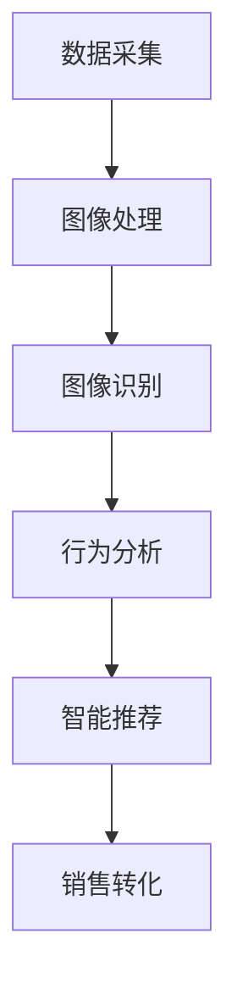

                 

# 计算机视觉在智能零售中的应用前景

## 概述

关键词：计算机视觉，智能零售，图像识别，行为分析，客户体验

摘要：随着人工智能技术的飞速发展，计算机视觉技术在智能零售领域的应用前景愈发广阔。本文旨在探讨计算机视觉技术在智能零售中的应用，从核心概念、算法原理、数学模型到实际应用场景，全面剖析其在零售行业中的潜力与挑战。

## 1. 背景介绍

计算机视觉是人工智能的重要分支，旨在使计算机能够像人类一样理解和解析视觉信息。智能零售则是利用信息技术和数据分析手段，优化零售流程、提高运营效率、提升客户体验的一种新型零售模式。近年来，随着大数据、云计算、物联网等技术的发展，计算机视觉在智能零售中的应用逐渐成为研究热点。

计算机视觉在智能零售中的潜在应用包括：货架管理、商品识别、客户行为分析、智能推荐等。通过图像识别技术，零售商可以实时获取商品信息，优化库存管理，提高销售效率；通过行为分析技术，可以了解客户偏好，提供个性化推荐，提升客户满意度。

## 2. 核心概念与联系

### 2.1 计算机视觉的基本概念

计算机视觉技术主要包括图像处理、图像识别和机器学习三个层次。图像处理是对图像进行预处理，如去噪、增强等，以提高图像质量；图像识别是指从图像中识别出特定目标或对象；机器学习则是通过学习大量的数据，训练出能够识别和分类图像的模型。

### 2.2 智能零售的基本概念

智能零售包括以下几方面：

1. **库存管理**：通过计算机视觉技术对货架上的商品进行实时监控，实现自动补货、减少库存积压。
2. **商品识别**：利用图像识别技术快速准确地识别商品，提高购物体验。
3. **客户行为分析**：通过分析客户在购物过程中的行为，了解其偏好和需求，提供个性化推荐。
4. **智能推荐**：基于客户的行为数据和商品信息，利用机器学习算法进行推荐，提高销售转化率。

### 2.3 关联分析

计算机视觉技术在智能零售中的应用，需要将图像处理、图像识别和机器学习等技术相结合，实现数据的高效处理和智能分析。例如，通过图像识别技术获取商品信息，结合客户行为数据进行机器学习，实现个性化推荐。

### 2.4 Mermaid 流程图

以下是一个简化的Mermaid流程图，展示了计算机视觉在智能零售中的基本工作流程：



## 3. 核心算法原理 & 具体操作步骤

### 3.1 图像识别算法原理

图像识别算法通常分为传统算法和深度学习算法两大类。传统算法主要包括基于特征的方法（如SIFT、SURF等），而深度学习算法则主要包括卷积神经网络（CNN）。

#### 3.1.1 基于特征的图像识别算法

基于特征的方法通过提取图像的局部特征，然后利用这些特征进行匹配和分类。具体步骤如下：

1. **特征提取**：使用SIFT、SURF等方法从图像中提取关键点。
2. **特征匹配**：计算关键点之间的相似度，建立匹配关系。
3. **分类**：根据匹配结果，对图像进行分类。

#### 3.1.2 深度学习图像识别算法

深度学习算法通过多层神经网络对图像进行逐层特征提取和分类。具体步骤如下：

1. **输入层**：接收原始图像。
2. **卷积层**：通过卷积运算提取图像特征。
3. **池化层**：降低特征图的维度，减少计算量。
4. **全连接层**：将特征图映射到类别。
5. **输出层**：输出分类结果。

### 3.2 客户行为分析算法原理

客户行为分析通常基于机器学习算法，通过学习大量的用户行为数据，对用户的偏好和行为进行预测。常见的算法包括决策树、支持向量机（SVM）、随机森林等。

具体步骤如下：

1. **数据预处理**：对用户行为数据进行分析，提取有用的特征。
2. **特征选择**：选择对用户行为预测最相关的特征。
3. **模型训练**：利用训练数据，训练机器学习模型。
4. **模型评估**：使用测试数据评估模型性能。
5. **预测**：使用训练好的模型对用户行为进行预测。

## 4. 数学模型和公式 & 详细讲解 & 举例说明

### 4.1 卷积神经网络（CNN）的数学模型

卷积神经网络（CNN）是深度学习中最常用的模型之一，其核心是卷积层和池化层。以下是CNN的数学模型：

#### 4.1.1 卷积层

卷积层的运算公式如下：

$$
\text{激活值} = \text{滤波器} * \text{输入特征图} + \text{偏置}
$$

其中，$*$ 表示卷积运算，$*$ 的具体计算方法为：

$$
(\sum_{i=1}^{M} w_{ij} * x_{ij}) + b_j
$$

其中，$w_{ij}$ 表示滤波器的权重，$x_{ij}$ 表示输入特征图的像素值，$b_j$ 表示偏置。

#### 4.1.2 池化层

池化层的运算公式如下：

$$
p_{ij} = \max_{k \in \Omega_{ij}} x_{ik}
$$

其中，$p_{ij}$ 表示输出特征图的像素值，$\Omega_{ij}$ 表示输入特征图中 $x_{ij}$ 的邻域。

### 4.2 决策树的数学模型

决策树的运算公式如下：

$$
\text{分类结果} = \arg\max_{c} \sum_{i=1}^{n} w_i \log P(y_i | c)
$$

其中，$w_i$ 表示样本 $i$ 的权重，$P(y_i | c)$ 表示在类别 $c$ 下样本 $i$ 的概率。

## 5. 项目实战：代码实际案例和详细解释说明

### 5.1 开发环境搭建

以下是使用Python和TensorFlow搭建计算机视觉在智能零售中的开发环境的步骤：

1. **安装Python**：下载并安装Python 3.6及以上版本。
2. **安装TensorFlow**：在命令行中运行以下命令：

   ```bash
   pip install tensorflow
   ```

3. **安装OpenCV**：在命令行中运行以下命令：

   ```bash
   pip install opencv-python
   ```

### 5.2 源代码详细实现和代码解读

以下是一个简单的计算机视觉在智能零售中应用的代码案例，包括图像识别和行为分析：

```python
import cv2
import tensorflow as tf

# 加载预训练的CNN模型
model = tf.keras.models.load_model('model.h5')

# 读取商品图像
image = cv2.imread('product.jpg')

# 对图像进行预处理
preprocessed_image = preprocess_image(image)

# 使用CNN模型进行图像识别
prediction = model.predict(preprocessed_image)

# 输出识别结果
print('识别结果：', prediction)

# 定义行为分析模型
behavior_model = tf.keras.models.load_model('behavior_model.h5')

# 读取客户行为数据
behavior_data = read_behavior_data('behavior_data.csv')

# 使用行为分析模型进行预测
behavior_prediction = behavior_model.predict(behavior_data)

# 输出行为分析结果
print('行为分析结果：', behavior_prediction)
```

### 5.3 代码解读与分析

1. **加载模型**：首先加载预训练的CNN模型和客户行为分析模型。
2. **读取图像**：使用OpenCV库读取商品图像和客户行为数据。
3. **预处理图像**：对图像进行归一化、缩放等预处理操作，使其符合模型输入的要求。
4. **图像识别**：使用CNN模型对商品图像进行识别，输出识别结果。
5. **行为分析**：使用行为分析模型对客户行为数据进行分析，输出分析结果。

## 6. 实际应用场景

计算机视觉在智能零售中的实际应用场景非常广泛，以下是一些典型的应用实例：

1. **货架管理**：通过计算机视觉技术实时监控货架，自动识别商品数量和摆放位置，实现自动补货和货架优化。
2. **商品识别**：在自助结账区域，通过计算机视觉技术快速准确地识别商品，提高结账效率。
3. **客户行为分析**：通过分析客户在购物过程中的行为，了解其偏好和需求，提供个性化推荐。
4. **智能推荐**：基于客户的购买记录和行为数据，利用计算机视觉技术实现商品推荐，提高销售转化率。

## 7. 工具和资源推荐

### 7.1 学习资源推荐

1. **书籍**：
   - 《深度学习》（作者：Ian Goodfellow、Yoshua Bengio、Aaron Courville）
   - 《计算机视觉：算法与应用》（作者：Richard Szeliski）

2. **论文**：
   - 《AlexNet: Image Classification with Deep Convolutional Neural Networks》
   - 《Object Detection with Fully Convolutional Networks》

3. **博客**：
   - [TensorFlow 官方文档](https://www.tensorflow.org/)
   - [OpenCV 官方文档](https://docs.opencv.org/)

4. **网站**：
   - [Kaggle](https://www.kaggle.com/)
   - [GitHub](https://github.com/)

### 7.2 开发工具框架推荐

1. **开发工具**：
   - Python
   - TensorFlow
   - OpenCV

2. **框架**：
   - TensorFlow 2.0
   - Keras
   - PyTorch

### 7.3 相关论文著作推荐

1. **论文**：
   - 《Very Deep Convolutional Networks for Large-Scale Image Recognition》
   - 《Faster R-CNN: Towards Real-Time Object Detection with Region Proposal Networks》

2. **著作**：
   - 《深度学习》（作者：Ian Goodfellow、Yoshua Bengio、Aaron Courville）
   - 《计算机视觉：算法与应用》（作者：Richard Szeliski）

## 8. 总结：未来发展趋势与挑战

计算机视觉技术在智能零售中的应用前景广阔，但同时也面临着一些挑战。未来，随着技术的不断进步，计算机视觉在智能零售中的应用将更加深入和广泛。以下是一些发展趋势和挑战：

### 8.1 发展趋势

1. **深度学习算法的进一步优化**：随着深度学习算法的不断发展，其性能将得到进一步提升，为智能零售提供更准确、更高效的解决方案。
2. **多模态数据的融合**：将计算机视觉、语音识别等多种数据源进行融合，提高智能零售系统的全面性和准确性。
3. **实时性的提升**：通过优化算法和硬件性能，提高计算机视觉在智能零售中的应用实时性，实现更快速的反应和处理。

### 8.2 挑战

1. **数据隐私和安全**：智能零售需要收集和处理大量的用户数据，如何保护用户隐私和数据安全是一个重要挑战。
2. **算法的公平性和透明性**：确保算法的公平性和透明性，避免算法偏见和不公平现象的发生。
3. **系统的可扩展性和稳定性**：随着应用场景的复杂化和数据量的增长，如何保证系统的可扩展性和稳定性是一个关键问题。

## 9. 附录：常见问题与解答

### 9.1 什么是计算机视觉？

计算机视觉是指使计算机能够模拟人类的视觉感知和理解能力，通过对图像和视频进行处理、分析和理解，实现人类视觉功能的延伸。

### 9.2 智能零售有哪些特点？

智能零售具有以下特点：实时性、个性化、自动化、高效性和数据分析能力。通过利用人工智能技术，智能零售能够更好地满足消费者的需求，提高运营效率。

### 9.3 计算机视觉在智能零售中的应用有哪些？

计算机视觉在智能零售中的应用主要包括货架管理、商品识别、客户行为分析、智能推荐等。通过计算机视觉技术，零售商可以实时获取商品信息，优化库存管理，提高销售效率，提升客户满意度。

## 10. 扩展阅读 & 参考资料

1. Bengio, Y., Courville, A., & Vincent, P. (2013). Representation learning: A review and new perspectives. IEEE transactions on pattern analysis and machine intelligence, 35(8), 1798-1828.
2. Simonyan, K., & Zisserman, A. (2014). Very deep convolutional networks for large-scale image recognition. arXiv preprint arXiv:1409.1556.
3. Girshick, R., Donahue, J., Darrell, T., & Malik, J. (2014). Rich feature hierarchies for accurate object detection and semantic segmentation. In Proceedings of the IEEE conference on computer vision and pattern recognition (pp. 580-587).
4. Russel, S., & Norvig, P. (2016). Artificial intelligence: A modern approach. Prentice Hall.
5. Szeliski, R. (2010). Computer vision: Algorithms and applications. Springer Science & Business Media.

