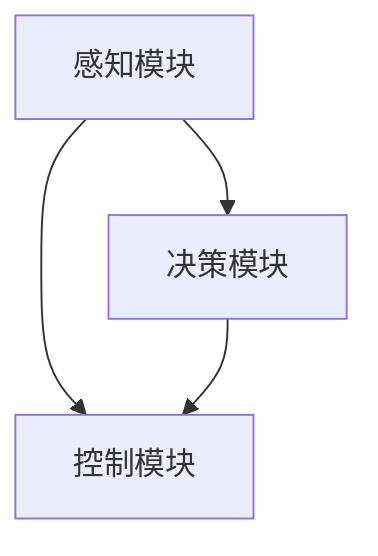

                 

# 计算机视觉在自动驾驶场景理解中的新突破

## 摘要

随着自动驾驶技术的飞速发展，计算机视觉在自动驾驶场景理解中扮演着至关重要的角色。本文将从背景介绍、核心概念与联系、核心算法原理与操作步骤、数学模型与公式、项目实战、实际应用场景、工具和资源推荐等多个方面，全面深入地探讨计算机视觉在自动驾驶场景理解中的新突破。通过本文的阅读，读者可以系统地了解计算机视觉在自动驾驶领域中的应用现状、发展趋势以及面临的挑战。

## 1. 背景介绍

自动驾驶技术，即自动驾驶汽车，是一种通过计算机程序实现车辆自动控制的技术。其核心在于对周围环境进行感知、理解和决策，从而实现车辆的自动驾驶。自动驾驶技术的目标是实现安全、高效、舒适的自动驾驶，减少交通事故，提高交通效率。

计算机视觉作为自动驾驶技术的重要组成部分，主要负责对车辆周围环境进行感知。通过图像采集、处理和分析，计算机视觉能够识别出道路、车辆、行人等关键信息，从而辅助自动驾驶系统的决策。随着深度学习、卷积神经网络等技术的发展，计算机视觉在自动驾驶场景理解中的应用取得了显著的突破。

自动驾驶技术的发展历程可以追溯到20世纪50年代。早期的自动驾驶研究主要基于规则和符号推理，随着计算机硬件和算法的不断发展，自动驾驶技术逐渐走向了基于计算机视觉和机器学习的新阶段。近年来，随着传感器技术、通信技术和人工智能技术的融合，自动驾驶技术正在向更高级别的自动驾驶迈进。

## 2. 核心概念与联系

### 2.1 计算机视觉

计算机视觉是指使计算机能够像人类一样通过视觉感知和理解周围环境的技术。其核心在于图像处理、目标检测、语义分割、场景重建等算法。

#### 2.1.1 图像处理

图像处理是计算机视觉的基础，主要包括图像增强、滤波、边缘检测、特征提取等。图像处理的目的是提高图像质量，提取有用的信息。

#### 2.1.2 目标检测

目标检测是在图像中识别出特定的物体或目标，并确定它们的位置。目标检测是自动驾驶场景理解的关键步骤，例如识别道路、车辆、行人等。

#### 2.1.3 语义分割

语义分割是对图像中的每个像素进行分类，识别出图像中的各种对象。语义分割能够更准确地描述场景，为自动驾驶系统的决策提供更详细的信息。

#### 2.1.4 场景重建

场景重建是通过三维重建技术将二维图像转化为三维场景，从而更好地理解场景的几何关系。场景重建对于自动驾驶系统在复杂环境中的导航和避障至关重要。

### 2.2 自动驾驶系统

自动驾驶系统主要包括感知、决策、控制三个部分。

#### 2.2.1 感知

感知是指通过传感器（如摄像头、激光雷达、雷达等）收集车辆周围环境的信息。计算机视觉作为感知模块的重要组成部分，负责对图像进行预处理、特征提取和目标检测。

#### 2.2.2 决策

决策是根据感知到的环境信息，确定车辆的行驶策略。决策模块需要考虑道路情况、交通规则、车辆行为等多种因素，以保证车辆的安全、高效行驶。

#### 2.2.3 控制

控制是根据决策结果，对车辆进行操作，如加速、减速、转向等。控制模块需要将决策转化为具体的操作指令，确保车辆的稳定运行。

### 2.3 计算机视觉与自动驾驶系统的联系

计算机视觉与自动驾驶系统的联系主要体现在以下几个方面：

1. **感知模块**：计算机视觉作为感知模块的核心，负责对图像进行预处理、特征提取和目标检测，为决策模块提供必要的信息。

2. **决策模块**：计算机视觉的结果直接影响决策模块的决策过程。通过准确识别道路、车辆、行人等目标，决策模块可以更好地理解环境，制定合理的行驶策略。

3. **控制模块**：计算机视觉的结果也为控制模块提供了重要的参考。通过实时监测车辆周围环境，控制模块可以及时调整车辆的操作，确保安全行驶。

### 2.4 Mermaid 流程图



## 3. 核心算法原理 & 具体操作步骤

### 3.1 卷积神经网络（CNN）

卷积神经网络（Convolutional Neural Network，CNN）是计算机视觉领域的一种重要算法，主要用于图像分类、目标检测和语义分割等任务。CNN 通过卷积、池化和全连接层等结构，实现对图像的层次化特征提取。

#### 3.1.1 卷积层（Convolutional Layer）

卷积层是 CNN 的核心部分，通过卷积操作提取图像的局部特征。卷积操作的基本原理是将卷积核（Filter）与输入图像进行点乘，然后求和得到输出特征图。卷积核的大小决定了提取特征的局部性，卷积核的数量决定了提取特征的维度。

#### 3.1.2 池化层（Pooling Layer）

池化层用于降低特征图的维度，提高网络的鲁棒性。常见的池化操作有最大池化和平均池化。最大池化选择特征图中每个局部区域内的最大值作为输出，平均池化则计算每个局部区域内的平均值。

#### 3.1.3 全连接层（Fully Connected Layer）

全连接层将卷积层和池化层提取的高层次特征进行融合，并通过激活函数（如 sigmoid、ReLU 等）得到最终的分类结果。全连接层的神经元数量取决于分类任务的需求。

### 3.2 YOLO（You Only Look Once）

YOLO（You Only Look Once）是一种广泛应用于目标检测的卷积神经网络算法。YOLO 的核心思想是将目标检测任务转化为单次前向传播，通过预测边界框和类别概率，实现高效的目标检测。

#### 3.2.1 网络结构

YOLO 的网络结构主要包括五部分：卷积层、池化层、锚框生成层、预测层和损失函数层。

1. **卷积层和池化层**：卷积层用于提取图像特征，池化层用于降低特征图的维度。

2. **锚框生成层**：根据先验框（Predefined Bounding Boxes）和卷积层的特征图，生成锚框（Anchors）。

3. **预测层**：通过全连接层和激活函数，预测边界框的位置、尺寸和类别概率。

4. **损失函数层**：计算预测边界框与真实边界框之间的损失，包括定位损失、分类损失和锚框匹配损失。

#### 3.2.2 操作步骤

1. **数据预处理**：将输入图像缩放到合适的尺寸，并归一化处理。

2. **网络输入**：将预处理后的图像输入到 YOLO 网络中。

3. **特征提取**：通过卷积层和池化层，提取图像的特征。

4. **锚框生成**：根据先验框和特征图，生成锚框。

5. **预测**：通过全连接层和激活函数，预测边界框的位置、尺寸和类别概率。

6. **损失计算**：计算预测边界框与真实边界框之间的损失，更新网络参数。

7. **迭代训练**：重复步骤 2-6，直到网络收敛。

## 4. 数学模型和公式 & 详细讲解 & 举例说明

### 4.1 卷积神经网络（CNN）

卷积神经网络（CNN）是一种用于图像处理的深度学习模型。其核心在于通过卷积操作提取图像的局部特征，并通过池化操作降低特征图的维度。

#### 4.1.1 卷积操作

卷积操作的基本原理是将卷积核（Filter）与输入图像进行点乘，然后求和得到输出特征图。卷积核的大小决定了提取特征的局部性，卷积核的数量决定了提取特征的维度。

卷积操作可以用以下公式表示：

$$
\text{output}_{ij} = \sum_{k=1}^{C} w_{ik,j,k} \times \text{input}_{ij,k}
$$

其中，$output_{ij}$ 表示输出特征图中的像素值，$w_{ik,j,k}$ 表示卷积核的权重，$\text{input}_{ij,k}$ 表示输入图像中的像素值，$C$ 表示输入图像的通道数。

#### 4.1.2 池化操作

池化操作用于降低特征图的维度，提高网络的鲁棒性。常见的池化操作有最大池化和平均池化。

最大池化选择特征图中每个局部区域内的最大值作为输出：

$$
\text{output}_{ij} = \max_{(x,y) \in R} \text{input}_{(i+x,j+y),k}
$$

其中，$R$ 表示局部区域的范围。

平均池化计算每个局部区域内的平均值：

$$
\text{output}_{ij} = \frac{1}{|R|} \sum_{(x,y) \in R} \text{input}_{(i+x,j+y),k}
$$

其中，$|R|$ 表示局部区域的面积。

#### 4.1.3 举例说明

假设输入图像的大小为 $28 \times 28$，通道数为 $3$，卷积核的大小为 $3 \times 3$，通道数为 $32$。

1. **卷积操作**：

$$
\text{output}_{ij} = \sum_{k=1}^{3} w_{ik,j,k} \times \text{input}_{ij,k}
$$

2. **最大池化操作**：

$$
\text{output}_{ij} = \max_{(x,y) \in [1,2] \times [1,2]} \text{input}_{(i+x,j+y),k}
$$

3. **平均池化操作**：

$$
\text{output}_{ij} = \frac{1}{4} \sum_{(x,y) \in [1,2] \times [1,2]} \text{input}_{(i+x,j+y),k}
$$

### 4.2 YOLO（You Only Look Once）

YOLO 是一种用于目标检测的卷积神经网络算法。其核心思想是将目标检测任务转化为单次前向传播，通过预测边界框和类别概率，实现高效的目标检测。

#### 4.2.1 网络结构

YOLO 的网络结构主要包括五部分：卷积层、池化层、锚框生成层、预测层和损失函数层。

1. **卷积层和池化层**：卷积层用于提取图像特征，池化层用于降低特征图的维度。

2. **锚框生成层**：根据先验框和卷积层的特征图，生成锚框。

3. **预测层**：通过全连接层和激活函数，预测边界框的位置、尺寸和类别概率。

4. **损失函数层**：计算预测边界框与真实边界框之间的损失，包括定位损失、分类损失和锚框匹配损失。

#### 4.2.2 损失函数

YOLO 的损失函数包括定位损失、分类损失和锚框匹配损失。

1. **定位损失**：

$$
\text{loss}_{loc} = \frac{1}{N} \sum_{i=1}^{N} \left( \frac{\text{smooth L1 loss}}{2} \right) \left( \text{obj} \cdot (g_{x_i} - p_{x_i})^2 + (g_{y_i} - p_{y_i})^2 + (g_{w_i} - p_{w_i})^2 + (g_{h_i} - p_{h_i})^2 \right)
$$

其中，$N$ 表示锚框的数量，$g_{x_i}, g_{y_i}, g_{w_i}, g_{h_i}$ 表示真实边界框的中心坐标、宽度和高度，$p_{x_i}, p_{y_i}, p_{w_i}, p_{h_i}$ 表示预测边界框的中心坐标、宽度和高度，$\text{obj}$ 表示锚框是否包含目标。

2. **分类损失**：

$$
\text{loss}_{cls} = \frac{1}{N} \sum_{i=1}^{N} \text{obj} \cdot \text{log}(p_{i}^{obj})
$$

其中，$p_{i}^{obj}$ 表示预测边界框中目标的概率。

3. **锚框匹配损失**：

$$
\text{loss}_{anchor} = \frac{1}{N} \sum_{i=1}^{N} \left( \text{obj} \cdot \text{log}(p_{i}^{obj}) + (1 - \text{obj}) \cdot \text{log}(1 - p_{i}^{obj}) \right)
$$

其中，$p_{i}^{obj}$ 表示锚框是否匹配真实边界框。

#### 4.2.3 举例说明

假设锚框的数量为 $5$，预测的边界框为 $[x_1, y_1, x_2, y_2]$，真实边界框为 $[x_g, y_g, w_g, h_g]$，目标的概率为 $0.9$。

1. **定位损失**：

$$
\text{loss}_{loc} = \frac{1}{5} \left( \frac{\text{smooth L1 loss}}{2} \right) \left( \text{obj} \cdot (g_{x_i} - p_{x_i})^2 + (g_{y_i} - p_{y_i})^2 + (g_{w_i} - p_{w_i})^2 + (g_{h_i} - p_{h_i})^2 \right)
$$

2. **分类损失**：

$$
\text{loss}_{cls} = \frac{1}{5} \text{obj} \cdot \text{log}(p_{i}^{obj})
$$

3. **锚框匹配损失**：

$$
\text{loss}_{anchor} = \frac{1}{5} \left( \text{obj} \cdot \text{log}(p_{i}^{obj}) + (1 - \text{obj}) \cdot \text{log}(1 - p_{i}^{obj}) \right)
$$

## 5. 项目实战：代码实际案例和详细解释说明

### 5.1 开发环境搭建

在开始项目实战之前，需要搭建一个适合深度学习开发的运行环境。以下是搭建开发环境的具体步骤：

1. **安装 Python**：

首先，确保已安装 Python 3.7 或以上版本。

2. **安装深度学习框架**：

安装 PyTorch，可以使用以下命令：

```bash
pip install torch torchvision
```

3. **安装其他依赖库**：

安装 OpenCV、Numpy、Pandas 等依赖库，可以使用以下命令：

```bash
pip install opencv-python numpy pandas
```

### 5.2 源代码详细实现和代码解读

以下是一个基于 YOLO 的自动驾驶场景理解项目的源代码示例。代码主要包括数据预处理、模型训练、模型评估和模型部署等部分。

```python
import torch
import torchvision
from torchvision import transforms
import numpy as np
import cv2

# 数据预处理
transform = transforms.Compose([
    transforms.ToTensor(),
    transforms.Normalize(mean=[0.485, 0.456, 0.406], std=[0.229, 0.224, 0.225]),
])

# 加载训练数据集
train_data = torchvision.datasets.VOCDetection(root='./data', year='2012', image_set='train', download=True, transform=transform)
train_loader = torch.utils.data.DataLoader(dataset=train_data, batch_size=32, shuffle=True)

# 加载测试数据集
test_data = torchvision.datasets.VOCDetection(root='./data', year='2012', image_set='test', download=True, transform=transform)
test_loader = torch.utils.data.DataLoader(dataset=test_data, batch_size=32, shuffle=False)

# 定义 YOLO 模型
model = torchvision.models.detection.yolo_v3(pretrained=True)

# 模型训练
criterion = torch.nn.CrossEntropyLoss()
optimizer = torch.optim.Adam(model.parameters(), lr=0.001)

for epoch in range(1):
    model.train()
    for images, targets in train_loader:
        optimizer.zero_grad()
        loss = criterion(model(images), targets)
        loss.backward()
        optimizer.step()

    model.eval()
    with torch.no_grad():
        for images, targets in test_loader:
            outputs = model(images)
            loss = criterion(outputs, targets)

# 模型评估
print('Test Loss: ', loss.item())

# 模型部署
model.eval()
with torch.no_grad():
    for images, targets in test_loader:
        outputs = model(images)
        for output in outputs:
            boxes = output['boxes']
            labels = output['labels']
            scores = output['scores']
            for box, label, score in zip(boxes, labels, scores):
                if score > 0.5:
                    x1, y1, x2, y2 = box
                    label_name = train_data.class_to_idx[label]
                    image = images[0].permute(1, 2, 0).cpu().numpy()
                    cv2.rectangle(image, (x1, y1), (x2, y2), (0, 0, 255), 2)
                    cv2.putText(image, label_name, (x1, y1 - 10), cv2.FONT_HERSHEY_SIMPLEX, 1, (255, 0, 0), 2)
                    cv2.imshow('Image', image)
                    cv2.waitKey(0)
```

### 5.3 代码解读与分析

1. **数据预处理**：

数据预处理包括将图像转化为 PyTorch 张量，并归一化处理。通过 `transforms.Compose` 函数，将图像转换为 PyTorch 张量，并设置归一化参数。

2. **加载数据集**：

使用 `torchvision.datasets.VOCDetection` 函数加载 VOC 数据集，并设置数据集的路径、年份和图像集。使用 `torch.utils.data.DataLoader` 函数将数据集划分为训练集和测试集，并设置批处理大小和随机打乱。

3. **定义 YOLO 模型**：

使用 `torchvision.models.detection.yolo_v3` 函数定义 YOLO 模型。该函数会自动下载预训练模型，并加载到 GPU 或 CPU 上。

4. **模型训练**：

使用 `torch.optim.Adam` 函数定义优化器，并设置学习率。通过遍历训练数据集，使用交叉熵损失函数训练模型。在每个 epoch 中，先进行训练，然后进行测试，以评估模型的性能。

5. **模型评估**：

使用 `torch.no_grad()` 函数禁用梯度计算，计算模型在测试数据集上的损失。通过打印损失，评估模型的性能。

6. **模型部署**：

使用 `torch.no_grad()` 函数禁用梯度计算，将模型部署到测试数据集上。通过遍历测试数据集，提取模型的预测结果，并在图像上绘制边界框和标签。

## 6. 实际应用场景

计算机视觉在自动驾驶场景理解中具有广泛的应用。以下是计算机视觉在自动驾驶中的一些实际应用场景：

1. **车道线检测**：

通过计算机视觉算法，自动驾驶系统可以实时检测车道线，确保车辆在行驶过程中保持正确行驶轨迹。车道线检测算法通常采用霍夫变换、边缘检测等方法。

2. **障碍物检测**：

自动驾驶系统需要实时检测前方道路上的障碍物，如车辆、行人、自行车等。障碍物检测算法通常采用深度学习模型，如卷积神经网络（CNN）和YOLO等。

3. **交通标志识别**：

自动驾驶系统需要识别道路上的交通标志，如速度限制标志、停车标志等。交通标志识别算法通常采用卷积神经网络（CNN）和目标检测算法。

4. **红绿灯识别**：

自动驾驶系统需要实时识别红绿灯状态，以调整行驶策略。红绿灯识别算法通常采用卷积神经网络（CNN）和图像分类算法。

5. **环境感知与建模**：

通过计算机视觉技术，自动驾驶系统可以构建周围环境的三维模型，实现环境感知。环境感知与建模算法通常采用深度学习模型，如点云处理、结构光等技术。

## 7. 工具和资源推荐

### 7.1 学习资源推荐

1. **书籍**：

   - 《深度学习》（Deep Learning）作者：Ian Goodfellow、Yoshua Bengio、Aaron Courville
   - 《计算机视觉：算法与应用》（Computer Vision: Algorithms and Applications）作者：Richard Szeliski
   - 《自动驾驶技术：原理、算法与实现》（Autonomous Driving: Principles, Algorithms, and Implementation）作者：陈江

2. **论文**：

   - “You Only Look Once: Unified, Real-Time Object Detection”作者：Joseph Redmon 等
   - “Faster R-CNN: Towards Real-Time Object Detection with Region Proposal Networks”作者：Shaoqing Ren 等
   - “EfficientDet: Scalable and Efficient Object Detection”作者：Bo Li 等

3. **博客**：

   - PyTorch 官方文档：[https://pytorch.org/docs/stable/](https://pytorch.org/docs/stable/)
   - OpenCV 官方文档：[https://docs.opencv.org/](https://docs.opencv.org/)

4. **网站**：

   - Kaggle：[https://www.kaggle.com/](https://www.kaggle.com/)
   - arXiv：[https://arxiv.org/](https://arxiv.org/)

### 7.2 开发工具框架推荐

1. **深度学习框架**：

   - PyTorch：[https://pytorch.org/](https://pytorch.org/)
   - TensorFlow：[https://www.tensorflow.org/](https://www.tensorflow.org/)

2. **计算机视觉库**：

   - OpenCV：[https://opencv.org/](https://opencv.org/)
   - Dlib：[https://dlib.net/](https://dlib.net/)

3. **编程环境**：

   - Jupyter Notebook：[https://jupyter.org/](https://jupyter.org/)
   - Google Colab：[https://colab.research.google.com/](https://colab.research.google.com/)

## 8. 总结：未来发展趋势与挑战

随着自动驾驶技术的不断发展，计算机视觉在自动驾驶场景理解中的应用将越来越广泛。未来，计算机视觉在自动驾驶领域的发展趋势包括：

1. **算法优化**：为了提高自动驾驶系统的性能和效率，未来计算机视觉算法将继续进行优化和改进，如针对目标检测、语义分割等任务的算法优化。

2. **硬件加速**：随着硬件技术的发展，如 GPU、TPU 等硬件加速器的普及，计算机视觉算法的运行速度将大大提高，为自动驾驶系统的实时性提供保障。

3. **多传感器融合**：自动驾驶系统需要集成多种传感器（如摄像头、激光雷达、雷达等）的数据，通过多传感器融合技术，提高场景理解的准确性和鲁棒性。

4. **数据集与模型共享**：为了加速自动驾驶技术的发展，未来的数据集和模型将更加开放，促进学术界和工业界的合作与交流。

然而，计算机视觉在自动驾驶场景理解中仍然面临一些挑战：

1. **复杂环境适应**：自动驾驶系统需要应对各种复杂环境，如雨雪、雾霾、夜间等，提高算法的泛化能力是关键。

2. **实时性能**：自动驾驶系统需要在实时性要求较高的场景下运行，提高算法的运行速度是关键。

3. **安全性和可靠性**：自动驾驶系统的安全性至关重要，需要确保算法在各种情况下都能稳定运行。

4. **隐私保护**：自动驾驶系统需要处理大量的个人隐私数据，如何在保障用户隐私的前提下进行数据处理和模型训练是关键。

总之，计算机视觉在自动驾驶场景理解中的发展前景广阔，未来将在自动驾驶技术的推进中发挥越来越重要的作用。

## 9. 附录：常见问题与解答

### 9.1 计算机视觉与自动驾驶的关系

计算机视觉是自动驾驶技术的重要组成部分，主要负责对车辆周围环境进行感知，识别道路、车辆、行人等关键信息，为自动驾驶系统的决策提供必要的信息。

### 9.2 YOLO 算法的特点

YOLO（You Only Look Once）是一种目标检测算法，其核心思想是将目标检测任务转化为单次前向传播，通过预测边界框和类别概率，实现高效的目标检测。YOLO 具有以下特点：

1. **实时性**：YOLO 可以在单次前向传播中完成目标检测，具有很高的实时性。
2. **准确性**：YOLO 在多种数据集上的性能优于其他目标检测算法。
3. **高效性**：YOLO 的结构相对简单，易于实现和优化。

### 9.3 计算机视觉在自动驾驶中的应用场景

计算机视觉在自动驾驶中的应用场景包括：

1. **车道线检测**：用于确保车辆在行驶过程中保持正确行驶轨迹。
2. **障碍物检测**：用于实时检测前方道路上的障碍物，如车辆、行人、自行车等。
3. **交通标志识别**：用于识别道路上的交通标志，如速度限制标志、停车标志等。
4. **红绿灯识别**：用于实时识别红绿灯状态，调整行驶策略。
5. **环境感知与建模**：用于构建周围环境的三维模型，实现环境感知。

## 10. 扩展阅读 & 参考资料

1. **书籍**：

   - Goodfellow, I., Bengio, Y., & Courville, A. (2016). *Deep Learning*.
   - Szeliski, R. (2010). *Computer Vision: Algorithms and Applications*.
   - 陈江. (2019). *自动驾驶技术：原理、算法与实现*.

2. **论文**：

   - Redmon, J., Divvala, S., Girshick, R., & Farhadi, A. (2016). *You Only Look Once: Unified, Real-Time Object Detection*. In *IEEE Conference on Computer Vision and Pattern Recognition*.
   - Ren, S., He, K., Girshick, R., & Sun, J. (2015). *Faster R-CNN: Towards Real-Time Object Detection with Region Proposal Networks*. In * Advances in Neural Information Processing Systems*.
   - Bo Li, Kaiming He, and Christian Szegedy. (2019). *EfficientDet: Scalable and Efficient Object Detection*.

3. **在线资源**：

   - PyTorch 官方文档：[https://pytorch.org/docs/stable/](https://pytorch.org/docs/stable/)
   - OpenCV 官方文档：[https://docs.opencv.org/](https://docs.opencv.org/)
   - Kaggle：[https://www.kaggle.com/](https://www.kaggle.com/)
   - arXiv：[https://arxiv.org/](https://arxiv.org/)

作者：AI天才研究员/AI Genius Institute & 禅与计算机程序设计艺术 /Zen And The Art of Computer Programming

