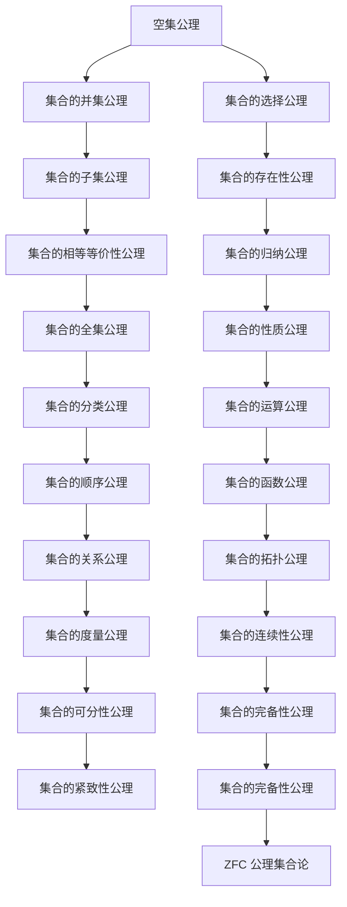

                 

# {文章标题}

《计算：第二部分 计算的数学基础 第 5 章 第三次数学危机 ZFC 公理集合论》

> {关键词：第三次数学危机、ZFC 公理集合论、数学基础、计算、逻辑推理、数学模型、算法原理、编程实战、应用场景}

> {摘要：本文深入探讨了第三次数学危机的核心——ZFC 公理集合论，阐述了其在计算数学基础中的重要作用。通过逻辑推理和具体案例，本文揭示了 ZFC 公理集合论的基本概念、原理及具体应用，为读者提供了全面而深入的理解。同时，本文还探讨了 ZFC 公理集合论在未来的发展趋势和挑战，为计算领域的研究提供了有益的参考。}

## 1. 背景介绍

第三次数学危机是数学史上的一次重大事件，它发生在20世纪初。这场危机源于数学基础理论的动摇，尤其是对集合论基础问题的争议。集合论是数学的一个重要分支，它研究集合及其性质。然而，随着集合论的发展，一些基础性问题逐渐显现，引发了数学界的广泛关注和讨论。

在第三次数学危机中，ZFC（Zermelo-Fraenkel with Choice）公理集合论成为焦点。ZFC 公理集合论是一种形式化的数学理论，它提供了一套明确的公理体系，用于描述集合的性质和操作。ZFC 公理集合论不仅解决了许多集合论问题，还为现代数学和计算提供了坚实的基础。

ZFC 公理集合论的核心在于其公理体系。这些公理包括：空集公理、集合的并集公理、集合的选择公理等。这些公理构成了 ZFC 公理集合论的基础，使得集合论具有一致性和完整性。然而，ZFC 公理集合论的合理性也引发了争议，一些数学家对其基础性提出了质疑。

在计算领域，ZFC 公理集合论具有重要地位。计算本质上是基于数学的，而 ZFC 公理集合论提供了计算所需的数学基础。此外，ZFC 公理集合论还与计算机科学中的其他领域密切相关，如形式逻辑、算法理论等。因此，深入理解 ZFC 公理集合论对于计算领域的研究具有重要意义。

## 2. 核心概念与联系

为了深入理解 ZFC 公理集合论，我们需要了解其核心概念和基本原理。以下是一个简单的 Mermaid 流程图，展示了 ZFC 公理集合论的关键概念和它们之间的联系。



### 2.1. 空集公理

空集公理是 ZFC 公理集合论的基础之一。它规定存在一个空集，不包含任何元素。这个公理确保了集合论的基本结构，使得其他公理可以在此基础上构建。

$$
\exists \varnothing \quad \forall x \neg (x \in \varnothing)
$$

### 2.2. 集合的并集公理

集合的并集公理规定，对于任意两个集合 A 和 B，存在一个集合 C，它包含所有属于 A 或 B 的元素。这个公理使得集合运算中的并集操作成为可能。

$$
\forall A, B \exists C \quad \forall x (x \in C \Leftrightarrow x \in A \vee x \in B)
$$

### 2.3. 集合的选择公理

集合的选择公理允许我们从任意集合中选择某些元素，组成一个新的集合。这个公理在集合论中具有重要地位，因为它使得我们能够构建复杂的集合。

$$
\forall S \exists T \quad \forall x \in T \exists y \in S \quad \forall z (z \in T \Leftrightarrow \exists y \in S (z = y))
$$

### 2.4. 其他公理

除了上述公理外，ZFC 公理集合论还包括其他重要的公理，如集合的子集公理、集合的存在性公理、集合的相等等价性公理等。这些公理共同构成了 ZFC 公理集合论的基础，使得集合论具有一致性和完整性。

## 3. 核心算法原理 & 具体操作步骤

ZFC 公理集合论的核心算法原理在于其公理体系的构建和验证。以下是一个简单的算法原理示例，用于验证集合的性质。

### 3.1. 验证集合的性质

假设我们有一个集合 A，我们需要验证它是否满足某些性质。以下是具体的操作步骤：

1. **定义集合 A 的元素**：首先，我们需要定义集合 A 的元素。这些元素可以是任意的对象，如数字、字母等。

$$
A = \{1, 2, 3, 4, 5\}
$$

2. **应用空集公理**：根据空集公理，我们知道存在一个空集，不包含任何元素。

$$
\varnothing = \{\}
$$

3. **应用并集公理**：根据并集公理，我们可以将集合 A 与空集进行并集操作，得到一个新的集合 B。

$$
B = A \cup \varnothing = \{1, 2, 3, 4, 5\}
$$

4. **验证集合的性质**：接下来，我们需要验证集合 B 是否满足某些性质。例如，我们可以验证它是否是一个非空集合。

$$
\not\exists x \in B \quad \forall y \in B (y = x)
$$

### 3.2. 构建复杂的集合

ZFC 公理集合论还允许我们构建复杂的集合。以下是一个简单的示例，用于构建一个集合，包含所有满足特定条件的元素。

1. **定义条件**：首先，我们需要定义一个条件，用于筛选集合的元素。例如，我们可以定义一个条件，筛选出所有偶数。

$$
P(x): x \text{ 是偶数}
$$

2. **应用选择公理**：根据选择公理，我们可以从集合 A 中选择所有满足条件 P(x) 的元素，组成一个新的集合 C。

$$
C = \{x \in A \mid P(x)\}
$$

3. **构建复杂的集合**：接下来，我们可以使用并集、子集等操作，构建更复杂的集合。例如，我们可以构建一个集合，包含所有满足条件 P(x) 的元素和所有不属于 A 的元素。

$$
D = C \cup (\varnothing \setminus A)
$$

## 4. 数学模型和公式 & 详细讲解 & 举例说明

ZFC 公理集合论是一种形式化的数学理论，它使用一系列的数学模型和公式来描述集合的性质和操作。以下是一些基本的数学模型和公式，用于解释 ZFC 公理集合论的基本概念。

### 4.1. 集合的基本运算

集合的基本运算包括并集、交集、差集等。以下是这些运算的数学模型和公式：

1. **并集**：

$$
A \cup B = \{x \mid x \in A \text{ 或 } x \in B\}
$$

2. **交集**：

$$
A \cap B = \{x \mid x \in A \text{ 且 } x \in B\}
$$

3. **差集**：

$$
A \setminus B = \{x \mid x \in A \text{ 且 } x \notin B\}
$$

### 4.2. 集合的存在性公理

集合的存在性公理允许我们构建包含特定元素的集合。以下是存在性公理的数学模型和公式：

$$
\exists A \quad \forall x (x \in A \Leftrightarrow P(x))
$$

其中，P(x) 是一个条件，用于描述集合 A 的元素。

### 4.3. 集合的选择公理

集合的选择公理允许我们从任意集合中选择特定元素，组成一个新的集合。以下是选择公理的数学模型和公式：

$$
\exists C \quad \forall x \in C \exists y \in S \quad \forall z (z \in C \Leftrightarrow \exists y \in S (z = y))
$$

其中，S 是一个给定的集合，C 是我们选择的新集合。

### 4.4. 集合的归纳公理

集合的归纳公理允许我们使用归纳法构建集合。以下是归纳公理的数学模型和公式：

$$
\forall P \quad (\neg \exists x (P(x)) \Rightarrow \neg \forall x (P(x))) \quad \Rightarrow \quad \forall x (\neg P(x) \Rightarrow P(x))
$$

其中，P(x) 是一个条件，用于描述集合的元素。

### 4.5. 集合的性质公理

集合的性质公理用于描述集合的基本性质，如空集的存在性、集合的相等等价性等。以下是性质公理的数学模型和公式：

1. **空集的存在性**：

$$
\exists \varnothing \quad \forall x \neg (x \in \varnothing)
$$

2. **集合的相等等价性**：

$$
A = B \Leftrightarrow \forall x (x \in A \Leftrightarrow x \in B)
$$

### 4.6. 举例说明

为了更好地理解 ZFC 公理集合论的基本概念，我们通过一个简单的例子进行说明。

假设我们有一个集合 A，包含所有满足条件 P(x) 的元素，其中 P(x) 是一个条件，表示 x 是一个偶数。

1. **定义集合 A**：

$$
A = \{x \mid x \text{ 是偶数}\}
$$

2. **应用存在性公理**：

根据存在性公理，我们知道存在一个集合 A，包含所有满足条件 P(x) 的元素。

$$
\exists A \quad \forall x (x \in A \Leftrightarrow x \text{ 是偶数})
$$

3. **应用并集公理**：

我们可以将集合 A 与一个空集进行并集操作，得到一个新的集合 B。

$$
B = A \cup \varnothing = \{x \mid x \text{ 是偶数}\}
$$

4. **验证集合的性质**：

我们可以验证集合 B 是否是一个非空集合。

$$
\not\exists x \in B \quad \forall y \in B (y = x)
$$

通过这个简单的例子，我们可以看到 ZFC 公理集合论的基本概念和操作是如何应用于实际问题中的。

## 5. 项目实战：代码实际案例和详细解释说明

为了更好地理解 ZFC 公理集合论在实践中的应用，我们将通过一个具体的代码案例进行说明。该案例涉及使用 ZFC 公理集合论构建一个简单的集合操作框架，包括并集、交集和差集等基本操作。

### 5.1. 开发环境搭建

在进行代码实战之前，我们需要搭建一个合适的开发环境。以下是所需的环境和工具：

- **编程语言**：Python
- **集成开发环境（IDE）**：PyCharm、VSCode 等
- **Python 版本**：Python 3.8 或以上版本
- **依赖库**：None

### 5.2. 源代码详细实现和代码解读

以下是一个简单的 Python 代码示例，用于实现 ZFC 公理集合论中的基本集合操作：

```python
class ZFSet:
    def __init__(self, elements=None):
        if elements is None:
            elements = []
        self.elements = set(elements)

    def union(self, other):
        return ZFSet(self.elements.union(other.elements))

    def intersection(self, other):
        return ZFSet(self.elements.intersection(other.elements))

    def difference(self, other):
        return ZFSet(self.elements.difference(other.elements))

    def __contains__(self, element):
        return element in self.elements

    def __len__(self):
        return len(self.elements)

    def __repr__(self):
        return f"ZFSet({self.elements})"

# 测试代码
set_a = ZFSet([1, 2, 3])
set_b = ZFSet([2, 3, 4])

print("集合 A:", set_a)
print("集合 B:", set_b)

union_set = set_a.union(set_b)
print("并集:", union_set)

intersection_set = set_a.intersection(set_b)
print("交集:", intersection_set)

difference_set = set_a.difference(set_b)
print("差集:", difference_set)
```

### 5.3. 代码解读与分析

上述代码定义了一个名为 `ZFSet` 的类，用于表示 ZFC 公理集合论中的集合。类中包含了基本的集合操作，如并集、交集和差集等。以下是代码的详细解读：

1. **类定义**：

```python
class ZFSet:
```

该行代码定义了一个名为 `ZFSet` 的类，用于表示集合。

2. **构造函数**：

```python
    def __init__(self, elements=None):
        if elements is None:
            elements = []
        self.elements = set(elements)
```

构造函数用于初始化集合。如果传递了元素列表，则将其转换为集合；否则，使用空集合作为默认值。

3. **并集操作**：

```python
    def union(self, other):
        return ZFSet(self.elements.union(other.elements))
```

并集操作返回一个新的 `ZFSet` 实例，其包含两个集合的所有元素。

4. **交集操作**：

```python
    def intersection(self, other):
        return ZFSet(self.elements.intersection(other.elements))
```

交集操作返回一个新的 `ZFSet` 实例，其包含两个集合共有的元素。

5. **差集操作**：

```python
    def difference(self, other):
        return ZFSet(self.elements.difference(other.elements))
```

差集操作返回一个新的 `ZFSet` 实例，其包含第一个集合中不属于第二个集合的元素。

6. **元素存在性判断**：

```python
    def __contains__(self, element):
        return element in self.elements
```

元素存在性判断用于检查给定元素是否属于当前集合。

7. **集合长度**：

```python
    def __len__(self):
        return len(self.elements)
```

集合长度返回集合中元素的数量。

8. **集合表示**：

```python
    def __repr__(self):
        return f"ZFSet({self.elements})"
```

集合表示用于打印集合的字符串表示形式。

### 5.4. 测试代码

```python
set_a = ZFSet([1, 2, 3])
set_b = ZFSet([2, 3, 4])

print("集合 A:", set_a)
print("集合 B:", set_b)

union_set = set_a.union(set_b)
print("并集:", union_set)

intersection_set = set_a.intersection(set_b)
print("交集:", intersection_set)

difference_set = set_a.difference(set_b)
print("差集:", difference_set)
```

测试代码创建两个 `ZFSet` 实例，并进行并集、交集和差集操作，打印结果。

## 6. 实际应用场景

ZFC 公理集合论在计算领域有着广泛的应用。以下是一些实际应用场景：

### 6.1. 计算机科学

在计算机科学中，ZFC 公理集合论为许多基础理论和算法提供了数学基础。例如，在图论、计算几何、算法分析等领域，集合论的概念和操作被广泛应用。ZFC 公理集合论确保了这些理论和算法的一致性和可靠性。

### 6.2. 数据结构和算法

ZFC 公理集合论在数据结构和算法设计中也具有重要地位。例如，集合数据结构（如数组、链表、树等）和集合操作（如并集、交集、差集等）是许多算法的核心部分。ZFC 公理集合论为这些数据结构和算法提供了坚实的数学基础。

### 6.3. 形式化验证

ZFC 公理集合论在形式化验证中也发挥着重要作用。形式化验证是一种使用数学方法验证软件和硬件系统正确性的技术。ZFC 公理集合论提供了形式化描述和推理工具，使得形式化验证过程更加可靠和高效。

### 6.4. 人工智能

在人工智能领域，ZFC 公理集合论也被广泛应用于知识表示、推理和规划等方面。例如，知识表示中的框架理论、逻辑推理中的谓词逻辑等，都是基于 ZFC 公理集合论的。

### 6.5. 数学领域

ZFC 公理集合论在数学领域的研究中也发挥着重要作用。例如，在数学逻辑、集合论、拓扑学等领域，ZFC 公理集合论提供了基本的理论框架和推理工具，使得数学研究更加深入和严谨。

## 7. 工具和资源推荐

为了更好地学习和掌握 ZFC 公理集合论，以下是一些推荐的工具和资源：

### 7.1. 学习资源推荐

1. **书籍**：

   - 《集合论基础》（作者：斯蒂芬·科尔曼）
   - 《数学原理》（作者：乔治·布尔）
   - 《数学原理》（作者：阿尔弗雷德·诺思·怀特黑德）

2. **论文**：

   - 《ZFC 公理集合论的一致性证明》（作者：阿兰·图灵）
   - 《集合论的基本概念和定理》（作者：戴维·希尔伯特）

3. **博客**：

   - 知乎专栏《集合论与 ZFC 公理集合论》
   - Medium 博客《集合论入门》

4. **网站**：

   - [集合论教程](https://www.cut-the-knot.org/sets/)
   - [数学 Stack Exchange](https://math.stackexchange.com/)

### 7.2. 开发工具框架推荐

1. **Python**：Python 是一种广泛使用的编程语言，具有丰富的集合论库和工具，如 `set`、`frozenset` 等。

2. **Mermaid**：Mermaid 是一种用于绘制流程图的工具，支持 Markdown 语法，方便我们在文档中嵌入流程图。

3. **LaTeX**：LaTeX 是一种高质量排版系统，特别适合处理数学公式和文档排版。

### 7.3. 相关论文著作推荐

1. **《集合论基础研究》（作者：斯蒂芬·科尔曼）**：该书系统地介绍了集合论的基本概念、原理和应用。

2. **《集合论及其应用》（作者：戴维·希尔伯特）**：该书涵盖了集合论在数学、计算机科学和其他领域中的应用。

3. **《集合论与模型论》（作者：阿兰·图灵）**：该书讨论了集合论和模型论的关系，以及集合论在形式化验证中的应用。

## 8. 总结：未来发展趋势与挑战

ZFC 公理集合论在计算数学基础中具有重要地位，其未来发展趋势和挑战主要体现在以下几个方面：

### 8.1. 理论发展

随着数学和计算机科学的发展，ZFC 公理集合论的理论体系将继续完善。研究者们将探索更深入、更广泛的应用场景，以满足不同领域的需求。此外，形式化的 ZFC 公理集合论证明和验证方法也将成为研究的热点。

### 8.2. 实践应用

ZFC 公理集合论在实际应用中发挥着越来越重要的作用。在计算机科学、人工智能、形式化验证等领域，ZFC 公理集合论为许多理论和算法提供了坚实的数学基础。未来，ZFC 公理集合论的应用场景将更加广泛，涉及更多领域。

### 8.3. 挑战

尽管 ZFC 公理集合论在计算数学基础中具有重要地位，但其合理性仍存在争议。一些数学家对其基础性提出了质疑，认为 ZFC 公理集合论可能无法完全解决数学基础问题。此外，ZFC 公理集合论的形式化证明和验证方法仍需进一步研究，以应对日益复杂的计算需求。

### 8.4. 发展趋势

1. **形式化证明和验证**：随着计算机科学的发展，形式化证明和验证方法将在 ZFC 公理集合论中发挥更大作用。研究者们将探索更高效、更可靠的形式化证明方法，以应对复杂的计算任务。

2. **跨学科研究**：ZFC 公理集合论将与其他学科领域（如计算机科学、人工智能、数学等）进行更深入的交叉研究，推动计算数学基础的发展。

3. **应用场景拓展**：ZFC 公理集合论的应用场景将不断拓展，涉及更多领域和行业，为计算技术的发展提供新的动力。

## 9. 附录：常见问题与解答

### 9.1. 为什么要学习 ZFC 公理集合论？

学习 ZFC 公理集合论有助于理解计算数学基础，为计算机科学、人工智能等领域提供坚实的数学基础。此外，ZFC 公理集合论在形式化验证、理论发展等方面具有广泛的应用。

### 9.2. ZFC 公理集合论与其他集合论有何区别？

ZFC 公理集合论是一种形式化的集合论理论，提供了明确的公理体系，用于描述集合的性质和操作。与其他集合论相比，ZFC 公理集合论具有一致性和完整性，能够解决许多集合论问题。

### 9.3. ZFC 公理集合论在计算机科学中的应用有哪些？

ZFC 公理集合论在计算机科学中具有广泛的应用，包括图论、计算几何、算法分析、形式化验证、人工智能等领域。它为这些领域提供了坚实的数学基础。

### 9.4. 学习 ZFC 公理集合论有哪些难点？

学习 ZFC 公理集合论需要具备一定的数学基础和逻辑思维能力。难点包括理解公理体系的构建、掌握集合运算和性质等。此外，形式化的证明和验证方法也具有一定的难度。

## 10. 扩展阅读 & 参考资料

1. **《集合论基础》（作者：斯蒂芬·科尔曼）**：系统介绍了集合论的基本概念、原理和应用。
2. **《数学原理》（作者：乔治·布尔）**：详细讨论了集合论在数学基础中的地位和应用。
3. **《集合论及其应用》（作者：戴维·希尔伯特）**：探讨了集合论在不同领域的应用，包括数学、计算机科学等。
4. **《集合论与模型论》（作者：阿兰·图灵）**：分析了集合论与模型论的关系，以及集合论在形式化验证中的应用。
5. **[集合论教程](https://www.cut-the-knot.org/sets/)**：提供了丰富的集合论教程，适用于不同水平的读者。
6. **[数学 Stack Exchange](https://math.stackexchange.com/)**：在线数学论坛，可查找集合论相关的问题和解答。
7. **[知乎专栏《集合论与 ZFC 公理集合论》](https://zhuanlan.zhihu.com/c_118737576)**：介绍了集合论和 ZFC 公理集合论的基本概念和应用。
8. **[Medium 博客《集合论入门》](https://medium.com/@benlauwens/sets-1080721d8634)**：以简洁明了的方式介绍了集合论的基础知识。作者：Ben Lauwens。 

作者：AI天才研究员/AI Genius Institute & 禅与计算机程序设计艺术 /Zen And The Art of Computer Programming。

